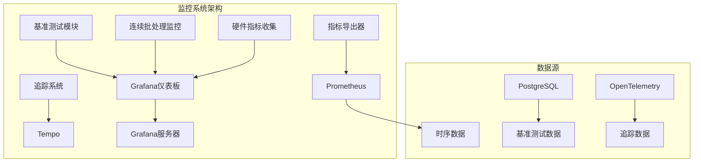
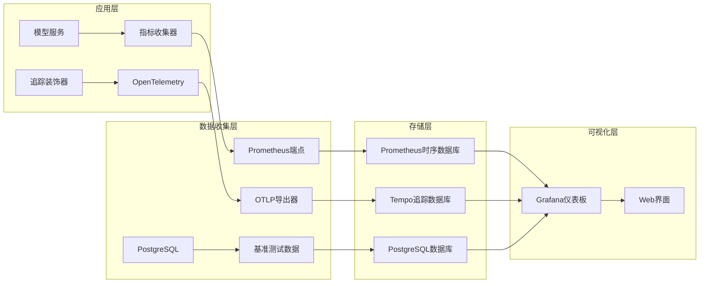
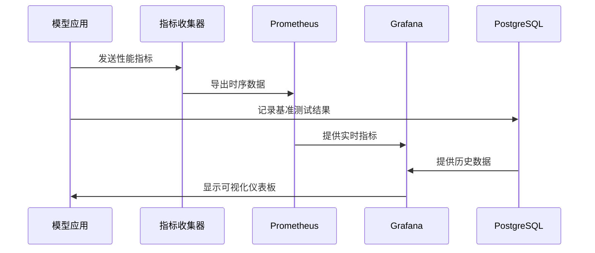
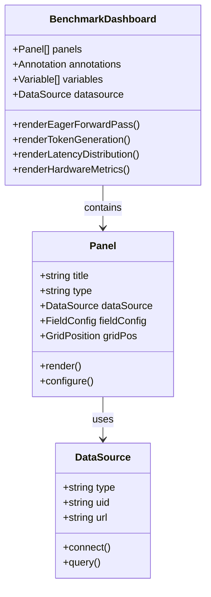
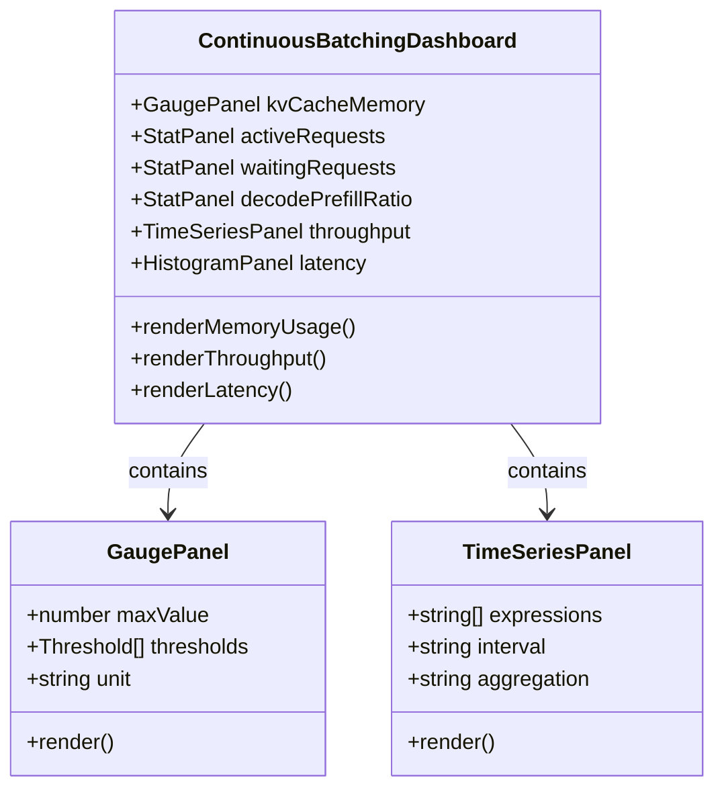
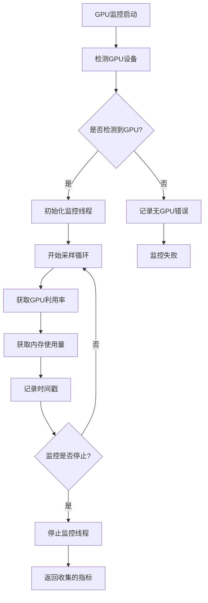
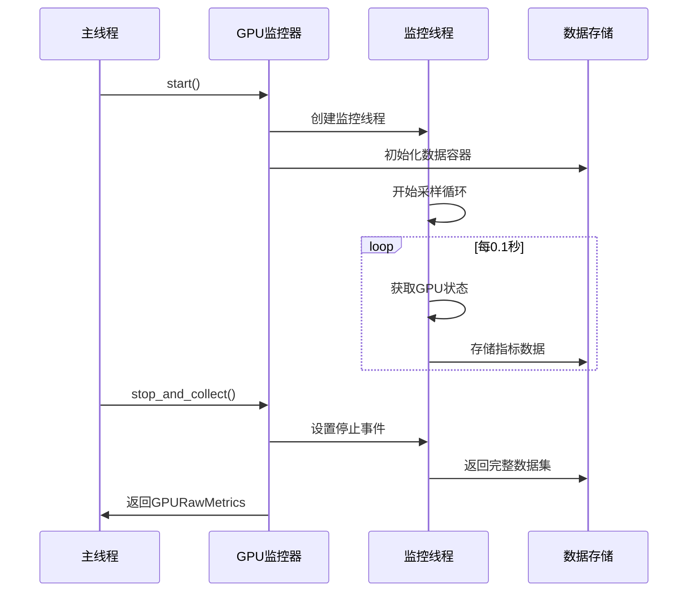
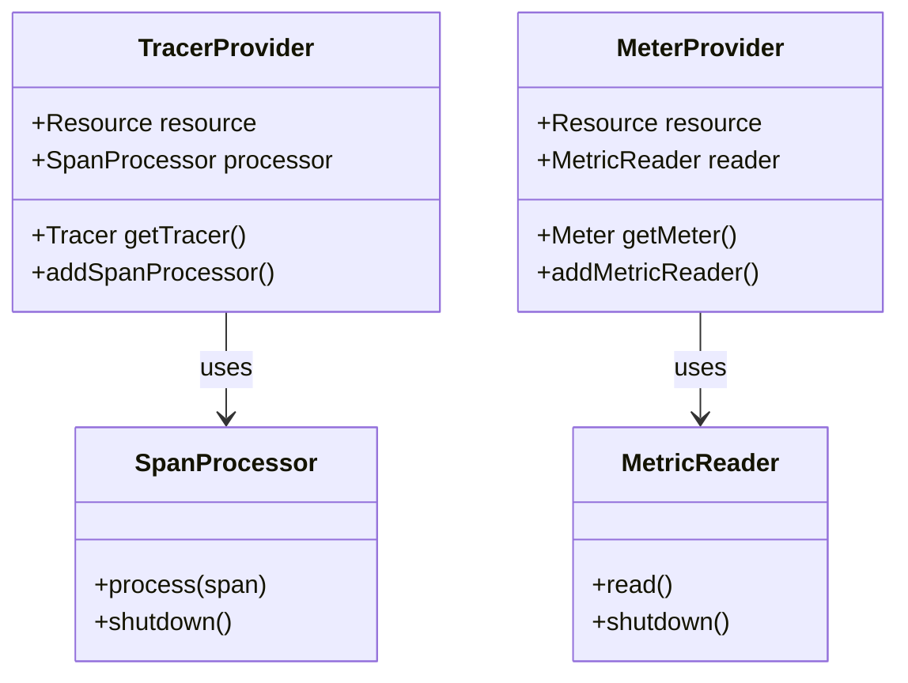
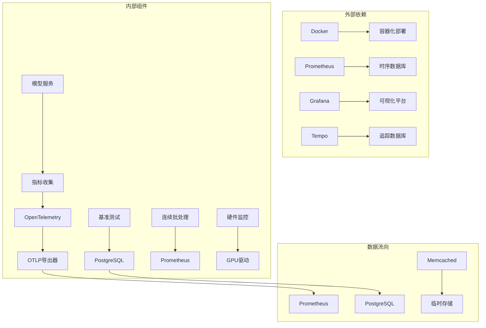
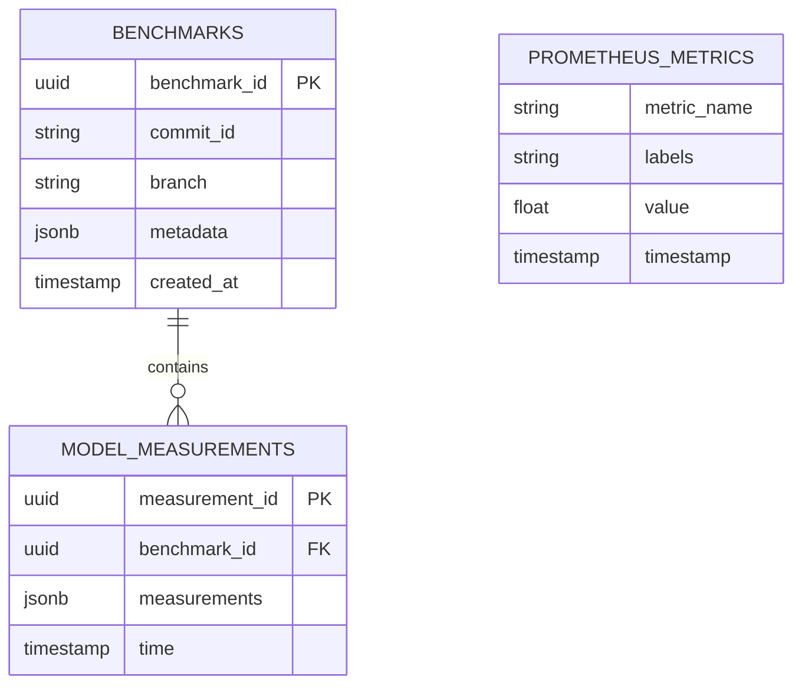

# 可视化仪表板

<cite>
**本文档中引用的文件**
- [grafana_dashboard.json](file://benchmark/grafana_dashboard.json)
- [grafana_datasource.yaml](file://benchmark/grafana_datasource.yaml)
- [continuous-batching-dashboard.json](file://examples/metrics-monitoring/continuous-batching-dashboard.json)
- [grafana-dashboard.yaml](file://examples/metrics-monitoring/grafana-dashboard.yaml)
- [grafana-datasources.yaml](file://examples/metrics-monitoring/grafana-datasources.yaml)
- [docker-compose.yml](file://examples/metrics-monitoring/docker-compose.yml)
- [prometheus.yml](file://examples/metrics-monitoring/prometheus.yml)
- [metrics_example.py](file://examples/metrics-monitoring/metrics_example.py)
- [continuous_batching.py](file://examples/pytorch/continuous_batching.py)
- [hardware_metrics.py](file://benchmark_v2/framework/hardware_metrics.py)
- [metrics.py](file://src/transformers/utils/metrics.py)
</cite>

## 目录
1. [简介](#简介)
2. [项目结构](#项目结构)
3. [核心组件](#核心组件)
4. [架构概览](#架构概览)
5. [详细组件分析](#详细组件分析)
6. [依赖关系分析](#依赖关系分析)
7. [性能考虑](#性能考虑)
8. [故障排除指南](#故障排除指南)
9. [结论](#结论)

## 简介

本文档提供了基于Hugging Face Transformers项目的Grafana可视化仪表板的全面指南。该仪表板系统专门设计用于监控和分析大型语言模型的服务性能，包括请求延迟、错误率、GPU资源使用情况和系统健康状态等关键指标。

仪表板系统采用现代化的监控架构，集成了PostgreSQL数据库、Prometheus时序数据库和Grafana可视化平台，为模型服务提供实时的性能洞察和历史趋势分析。

## 项目结构

该项目的监控和可视化系统主要分布在以下目录结构中：

**图表来源**
- [docker-compose.yml](file://examples/metrics-monitoring/docker-compose.yml#L1-L56)
- [grafana_dashboard.json](file://benchmark/grafana_dashboard.json#L1-L50)

**章节来源**
- [docker-compose.yml](file://examples/metrics-monitoring/docker-compose.yml#L1-L56)
- [grafana_dashboard.json](file://benchmark/grafana_dashboard.json#L1-L100)

## 核心组件

### 基准测试仪表板

基准测试仪表板专注于模型性能基准测试的可视化，提供以下核心功能：

#### 请求延迟分析
- **首次前向传播延迟**：测量模型初始化和预热后的首次推理时间
- **第二次前向传播延迟**：验证模型稳定性和缓存效果
- **首令牌生成时间**：评估模型响应速度的关键指标
- **后续令牌生成时间**：监控批量生成效率

#### 性能对比分析
- **提交版本跟踪**：通过Git提交ID关联性能变化
- **GPU型号兼容性**：支持不同GPU架构的性能对比
- **模型规模影响**：分析模型大小对性能的影响

### 连续批处理仪表板

连续批处理仪表板专门针对流式推理场景设计，提供实时的批处理性能监控：

#### 内存使用监控
- **KV缓存内存**：监控键值缓存的内存占用情况
- **可用内存跟踪**：实时显示可用内存空间
- **内存使用阈值**：设置内存使用警告和告警

#### 批处理效率指标
- **活跃请求数量**：当前正在处理的并发请求数
- **等待队列长度**：待处理的请求数量
- **解码/预填充比率**：批处理效率的重要指标

#### 吞吐量监控
- **解码令牌速率**：每秒处理的解码令牌数
- **预填充令牌速率**：每秒处理的预填充令牌数
- **批次填充百分位数**：评估批次利用率的统计指标

**章节来源**
- [continuous-batching-dashboard.json](file://examples/metrics-monitoring/continuous-batching-dashboard.json#L1-L200)
- [grafana_dashboard.json](file://benchmark/grafana_dashboard.json#L100-L400)

## 架构概览

监控系统的整体架构采用微服务模式，各组件协同工作提供完整的可观测性解决方案：

**图表来源**
- [docker-compose.yml](file://examples/metrics-monitoring/docker-compose.yml#L1-L56)
- [grafana-datasources.yaml](file://examples/metrics-monitoring/grafana-datasources.yaml#L1-L15)

### 数据流架构

系统采用多数据源集成策略，确保全面的监控覆盖：

**图表来源**
- [metrics_example.py](file://examples/metrics-monitoring/metrics_example.py#L1-L49)
- [continuous_batching.py](file://examples/pytorch/continuous_batching.py#L50-L100)

**章节来源**
- [docker-compose.yml](file://examples/metrics-monitoring/docker-compose.yml#L1-L56)
- [prometheus.yml](file://examples/metrics-monitoring/prometheus.yml#L1-L4)

## 详细组件分析

### Grafana仪表板配置

#### 基准测试仪表板分析

基准测试仪表板采用分层布局设计，将不同类型的性能指标分类展示：

**图表来源**
- [grafana_dashboard.json](file://benchmark/grafana_dashboard.json#L1-L100)
- [grafana_datasource.yaml](file://benchmark/grafana_datasource.yaml#L1-L18)

#### 连续批处理仪表板分析

连续批处理仪表板专注于实时性能监控，采用多种可视化类型：

**图表来源**
- [continuous-batching-dashboard.json](file://examples/metrics-monitoring/continuous-batching-dashboard.json#L1-L100)
- [metrics.py](file://src/transformers/utils/metrics.py#L211-L243)

### 数据源配置

#### PostgreSQL数据源配置

PostgreSQL数据源专门用于存储和查询基准测试结果：

| 配置项 | 值 | 描述 |
|--------|-----|------|
| 数据源名称 | grafana-postgresql-datasource | 数据源标识符 |
| 类型 | postgres | 数据库类型 |
| URL | $GRAFANA_POSTGRES_DATASOURCE_URL | 数据库连接URL |
| 用户名 | $GRAFANA_POSTGRES_DATASOURCE_USER | 认证用户名 |
| 密码 | $GRAFANA_POSTGRES_DATASOURCE_PWD | 认证密码 |
| 数据库 | metrics | 目标数据库 |
| 最大连接数 | 100 | 并发连接限制 |

#### Prometheus数据源配置

Prometheus数据源处理实时指标和时序数据：

| 配置项 | 值 | 描述 |
|--------|-----|------|
| 数据源名称 | Prometheus | 数据源标识符 |
| 类型 | prometheus | 数据库类型 |
| 访问方式 | proxy | 访问模式 |
| URL | http://prometheus:9090 | Prometheus服务地址 |
| 默认数据源 | true | 是否为默认数据源 |

**章节来源**
- [grafana_datasource.yaml](file://benchmark/grafana_datasource.yaml#L1-L18)
- [grafana-datasources.yaml](file://examples/metrics-monitoring/grafana-datasources.yaml#L1-L15)

### 硬件指标监控

#### GPU监控系统

硬件指标监控系统提供细粒度的GPU性能监控：

**图表来源**
- [hardware_metrics.py](file://benchmark_v2/framework/hardware_metrics.py#L110-L170)

#### 指标收集流程

系统采用异步监控模式，确保最小化对主业务流程的影响：

**图表来源**
- [hardware_metrics.py](file://benchmark_v2/framework/hardware_metrics.py#L144-L170)

**章节来源**
- [hardware_metrics.py](file://benchmark_v2/framework/hardware_metrics.py#L75-L170)

### OpenTelemetry集成

#### 追踪系统架构

OpenTelemetry系统提供分布式追踪能力，帮助诊断复杂的工作流：

**图表来源**
- [metrics_example.py](file://examples/metrics-monitoring/metrics_example.py#L1-L49)
- [continuous_batching.py](file://examples/pytorch/continuous_batching.py#L50-L100)

#### 指标定义

系统定义了多个关键性能指标：

| 指标名称 | 类型 | 单位 | 描述 |
|----------|------|------|------|
| kv_cache_memory_bytes | Gauge | bytes | KV缓存内存使用量 |
| active_requests_count | Gauge | requests | 当前活跃请求数 |
| waiting_requests_count | Gauge | requests | 等待处理的请求数 |
| decode_prefill_ratio | Gauge | ratio | 解码/预填充比率 |
| prefill_tokens_processed | Counter | tokens | 处理的预填充令牌数 |
| decode_tokens_processed | Counter | tokens | 处理的解码令牌数 |
| request_latency_milliseconds | Histogram | ms | 请求延迟分布 |

**章节来源**
- [metrics.py](file://src/transformers/utils/metrics.py#L211-L243)
- [metrics_example.py](file://examples/metrics-monitoring/metrics_example.py#L1-L49)

## 依赖关系分析

### 组件依赖图

监控系统的各个组件之间存在复杂的依赖关系：

**图表来源**
- [docker-compose.yml](file://examples/metrics-monitoring/docker-compose.yml#L1-L56)
- [grafana-dashboard.yaml](file://examples/metrics-monitoring/grafana-dashboard.yaml#L1-L12)

### 数据库依赖

系统使用多种数据库来满足不同的数据存储需求：

**图表来源**
- [grafana_dashboard.json](file://benchmark/grafana_dashboard.json#L100-L200)

**章节来源**
- [docker-compose.yml](file://examples/metrics-monitoring/docker-compose.yml#L1-L56)
- [grafana_datasource.yaml](file://benchmark/grafana_datasource.yaml#L1-L18)

## 性能考虑

### 监控开销优化

为了最小化监控系统对模型服务性能的影响，系统采用了多种优化策略：

#### 异步监控模式
- GPU监控使用独立线程，避免阻塞主线程
- 指标收集采用非阻塞方式
- 数据导出使用后台进程

#### 数据采样频率控制
- GPU监控采样间隔为0.1秒
- 指标聚合周期可配置
- 缓存机制减少重复计算

#### 资源使用优化
- 内存使用设置合理的上限
- 连接池管理数据库连接
- 定期清理过期数据

### 扩展性设计

系统设计考虑了大规模部署的需求：

#### 水平扩展能力
- 支持多实例部署
- 数据库读写分离
- 负载均衡配置

#### 容错机制
- 数据源连接重试
- 故障转移支持
- 监控降级策略

## 故障排除指南

### 常见问题诊断

#### 数据采集问题

**问题症状**：仪表板显示无数据或数据不更新
**可能原因**：
- Prometheus服务未启动
- 指标导出器配置错误
- 网络连接问题

**解决步骤**：
1. 检查Prometheus服务状态
2. 验证指标端点可达性
3. 查看Grafana日志
4. 检查网络防火墙设置

#### 数据库连接问题

**问题症状**：基准测试数据无法保存
**可能原因**：
- PostgreSQL服务异常
- 认证凭据错误
- 网络连接中断

**解决步骤**：
1. 验证PostgreSQL服务状态
2. 检查连接参数配置
3. 测试数据库连接
4. 查看数据库日志

#### GPU监控问题

**问题症状**：硬件指标显示异常
**可能原因**：
- GPU驱动未正确安装
- CUDA环境配置错误
- 权限不足

**解决步骤**：
1. 检查GPU设备状态
2. 验证CUDA工具包安装
3. 检查用户权限设置
4. 查看GPU监控日志

### 性能调优建议

#### 监控系统优化

**数据库优化**：
- 配置适当的连接池大小
- 定期清理历史数据
- 优化查询索引

**内存管理**：
- 设置合理的缓存大小
- 监控内存使用趋势
- 实施内存回收策略

**网络优化**：
- 使用本地网络连接
- 配置适当的超时时间
- 实施连接复用

**章节来源**
- [hardware_metrics.py](file://benchmark_v2/framework/hardware_metrics.py#L110-L170)
- [continuous_batching.py](file://examples/pytorch/continuous_batching.py#L50-L100)

## 结论

本文档详细介绍了基于Hugging Face Transformers项目的Grafana可视化仪表板系统。该系统通过集成多种监控技术，为模型服务提供了全面的可观测性解决方案。

### 主要优势

1. **全面的监控覆盖**：从硬件资源到应用性能的全方位监控
2. **实时数据分析**：支持实时指标展示和历史趋势分析
3. **灵活的配置选项**：支持多环境部署和自定义配置
4. **强大的可视化能力**：提供丰富的图表类型和交互功能

### 最佳实践建议

1. **环境隔离**：为开发、测试和生产环境配置不同的仪表板
2. **权限管理**：实施细粒度的访问控制和数据保护
3. **定期维护**：建立数据清理和系统优化流程
4. **团队协作**：制定标准化的监控指标和告警规则

### 未来发展方向

随着AI模型服务的不断发展，监控系统也需要持续演进：

1. **智能化监控**：引入机器学习算法进行异常检测
2. **云原生支持**：增强Kubernetes和容器化部署支持
3. **边缘计算适配**：支持边缘设备的监控需求
4. **多模态指标**：扩展到视觉、音频等多模态模型监控

通过持续改进和优化，这套监控系统将为Hugging Face Transformers项目提供更加可靠和高效的可观测性保障。