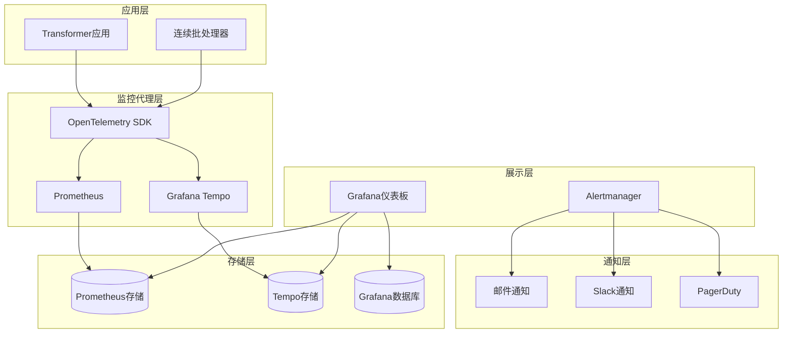
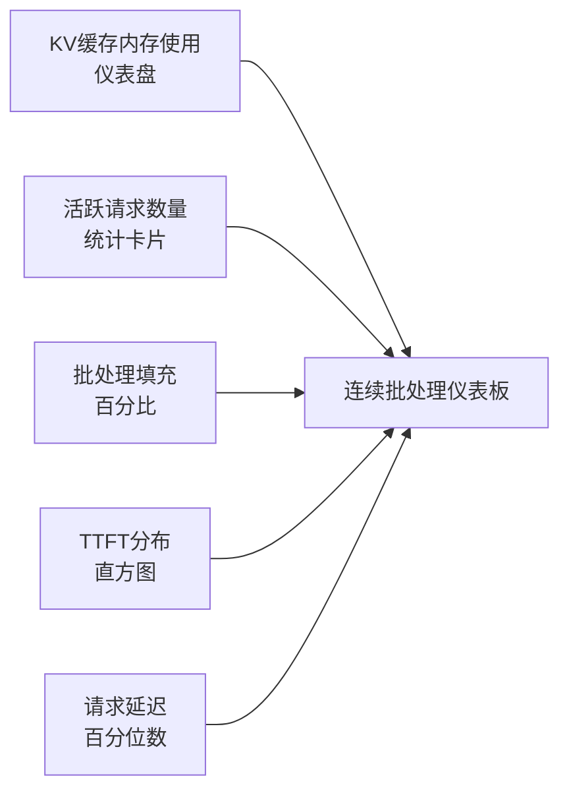
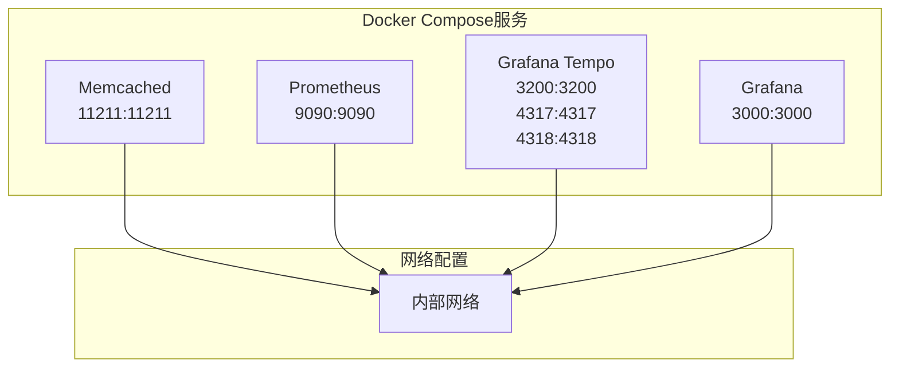

# 告警规则与通知系统

<cite>
**本文档中引用的文件**
- [docker-compose.yml](file://examples/metrics-monitoring/docker-compose.yml)
- [prometheus.yml](file://examples/metrics-monitoring/prometheus.yml)
- [tempo.yaml](file://examples/metrics-monitoring/tempo.yaml)
- [grafana-datasources.yaml](file://examples/metrics-monitoring/grafana-datasources.yaml)
- [grafana-dashboard.yaml](file://examples/metrics-monitoring/grafana-dashboard.yaml)
- [continuous-batching-dashboard.json](file://examples/metrics-monitoring/continuous-batching-dashboard.json)
- [metrics_example.py](file://examples/metrics-monitoring/metrics_example.py)
- [metrics.py](file://src/transformers/utils/metrics.py)
- [continuous_batching.py](file://examples/pytorch/continuous_batching.py)
- [README.md](file://examples/metrics-monitoring/README.md)
</cite>

## 目录
1. [简介](#简介)
2. [系统架构概览](#系统架构概览)
3. [Prometheus监控配置](#prometheus监控配置)
4. [连续批处理监控仪表板](#连续批处理监控仪表板)
5. [指标收集与追踪](#指标收集与追踪)
6. [Docker部署配置](#docker部署配置)
7. [告警规则设计](#告警规则设计)
8. [通知渠道集成](#通知渠道集成)
9. [故障排查指南](#故障排查指南)
10. [最佳实践建议](#最佳实践建议)

## 简介

本文档详细介绍了基于Prometheus和Grafana的监控告警系统，专门针对Transformer模型的连续批处理服务进行优化。该系统提供了完整的可观测性解决方案，包括指标收集、分布式追踪、可视化面板和智能告警机制。

### 核心特性

- **实时指标监控**：通过OpenTelemetry收集TTFT、延迟、内存使用等关键指标
- **分布式追踪**：支持Jaeger、Zipkin和OTLP协议的分布式追踪
- **智能告警**：基于阈值和异常检测的自动化告警系统
- **多渠道通知**：支持邮件、Slack、PagerDuty等多种通知方式
- **容器化部署**：基于Docker Compose的完整部署方案

## 系统架构概览



**图表来源**
- [docker-compose.yml](file://examples/metrics-monitoring/docker-compose.yml#L1-L56)
- [tempo.yaml](file://examples/metrics-monitoring/tempo.yaml#L1-L89)

## Prometheus监控配置

### 基础配置结构

Prometheus配置采用简洁的全局设置，专注于连续批处理服务的关键指标收集：

```yaml
global:
  scrape_interval: 15s
```

### 关键功能特性

- **OTLP接收器**：启用`--web.enable-otlp-receiver`支持OpenTelemetry协议
- **远程写入**：通过`--web.enable-remote-write-receiver`支持远程指标写入
- **原生直方图**：启用`--enable-feature=native-histograms`提升性能
- **示例存储**：启用`--enable-feature=exemplar-storage`支持追踪关联

### 指标收集端点

系统通过以下端点暴露监控指标：
- **HTTP端口**：9090 (Prometheus Web UI)
- **OTLP指标端点**：`/api/v1/otlp/v1/metrics`
- **OTLP追踪端点**：`/v1/traces`

**章节来源**
- [prometheus.yml](file://examples/metrics-monitoring/prometheus.yml#L1-L4)
- [docker-compose.yml](file://examples/metrics-monitoring/docker-compose.yml#L10-L18)

## 连续批处理监控仪表板

### 关键监控指标

仪表板提供了全面的连续批处理服务监控视图：

#### 内存使用监控
- **KV缓存内存使用**：实时监控分页注意力缓存的内存占用
- **内存阈值设置**：
  - 正常状态：< 5GB (绿色)
  - 警告状态：> 5GB (黄色)
  - 危险状态：> 8GB (红色)

#### 请求处理监控
- **活跃请求数量**：显示当前正在处理的请求数量
- **等待队列长度**：监控待处理请求的数量
- **批处理填充百分比**：显示批处理的利用率

#### 性能指标
- **TTFT分布**：首次令牌时间的百分位数统计
- **请求延迟**：端到端请求处理时间
- **解码/预填充比率**：批处理中解码和预填充令牌的比例

### 可视化组件



**图表来源**
- [continuous-batching-dashboard.json](file://examples/metrics-monitoring/continuous-batching-dashboard.json#L1-L199)

**章节来源**
- [continuous-batching-dashboard.json](file://examples/metrics-monitoring/continuous-batching-dashboard.json#L1-L974)

## 指标收集与追踪

### OpenTelemetry集成

系统通过装饰器模式实现透明的指标收集和分布式追踪：

#### 核心装饰器功能

```python
@attach_tracer()
class ContinuousBatchProcessorMetrics:
    """连续批处理器指标收集类"""
    
    def __init__(self, max_batch_tokens: int):
        """初始化指标收集器"""
        self.max_batch_tokens = max_batch_tokens
        self._setup_metrics()
```

#### 自动追踪功能

- **函数级追踪**：自动为被`@traced`装饰的方法添加追踪
- **参数记录**：自动记录函数调用参数和返回值
- **异常捕获**：自动记录异常信息和堆栈跟踪
- **自定义属性**：支持动态添加业务相关属性

### 关键指标类型

#### 时间到首令牌(TTFT)指标
- **直方图桶配置**：从10ms到10秒的精细分组
- **单位转换**：毫秒精度的时间测量
- **性能基准**：典型范围50ms到几秒

#### 批处理指标
- **批处理填充百分比**：0-100%的利用率监控
- **令牌处理计数**：预填充和解码令牌的独立计数
- **内存使用监控**：KV缓存的字节级内存占用

#### 请求生命周期指标
- **请求状态枚举**：PENDING、PREFILLING、DECODING、FINISHED、FAILED
- **活跃请求计数**：实时并发请求数量
- **请求延迟分布**：端到端处理时间统计

**章节来源**
- [metrics.py](file://src/transformers/utils/metrics.py#L1-L405)
- [metrics_example.py](file://examples/metrics-monitoring/metrics_example.py#L1-L49)

## Docker部署配置

### 容器编排架构



**图表来源**
- [docker-compose.yml](file://examples/metrics-monitoring/docker-compose.yml#L1-L56)

### 服务配置详解

#### Memcached缓存服务
- **镜像版本**：memcached:1.6.29
- **内存限制**：64MB最大内存使用
- **线程配置**：4个工作线程
- **端口映射**：11211:11211

#### Prometheus监控服务
- **镜像版本**：prom/prometheus:latest
- **配置挂载**：本地prometheus.yml配置
- **功能特性**：
  - OTLP接收器
  - 远程写入接收器
  - 原生直方图支持
  - 示例存储功能

#### Grafana可视化服务
- **镜像版本**：grafana/grafana:latest
- **数据源配置**：自动发现Prometheus和Tempo
- **插件安装**：探索追踪应用和追踪应用
- **认证配置**：匿名访问启用

#### Grafana Tempo追踪服务
- **镜像版本**：grafana/tempo:latest
- **多协议支持**：Jaeger、Zipkin、OTLP、OpenCensus
- **端口配置**：
  - Jaeger Thrift HTTP: 14268
  - Tempo HTTP: 3200
  - Tempo gRPC: 9095
  - OTLP gRPC: 4317
  - OTLP HTTP: 4318
  - Zipkin: 9411

### 部署命令

```bash
# 进入监控目录
cd examples/metrics-monitoring

# 启动所有服务
docker compose up

# 后台运行
docker compose up -d

# 查看日志
docker compose logs -f prometheus
```

**章节来源**
- [docker-compose.yml](file://examples/metrics-monitoring/docker-compose.yml#L1-L56)

## 告警规则设计

### 告警规则模板

基于连续批处理服务的关键指标，设计以下告警规则：

#### 内存使用告警
```yaml
groups:
- name: transformers.memory
  rules:
  - alert: HighMemoryUsage
    expr: kv_cache_memory_bytes > 8589934592  # 8GB
    for: 5m
    labels:
      severity: critical
      service: transformers
    annotations:
      summary: "KV缓存内存使用过高"
      description: "KV缓存内存使用率达到{{ $value }}字节，超过8GB阈值"
      
  - alert: MediumMemoryUsage
    expr: kv_cache_memory_bytes > 5368709120  # 5GB
    for: 2m
    labels:
      severity: warning
      service: transformers
    annotations:
      summary: "KV缓存内存使用较高"
      description: "KV缓存内存使用率达到{{ $value }}字节，超过5GB阈值"
```

#### 请求处理告警
```yaml
- name: transformers.requests
  rules:
  - alert: HighRequestLatency
    expr: histogram_quantile(0.95, rate(request_latency_milliseconds_bucket[5m])) > 5000
    for: 3m
    labels:
      severity: warning
      service: transformers
    annotations:
      summary: "95%请求延迟过高"
      description: "95%分位数请求延迟达到{{ $value }}ms，超过5秒阈值"
      
  - alert: LowBatchFillRate
    expr: histogram_quantile(0.95, rate(batch_fill_percentage_bucket[5m])) < 0.8
    for: 5m
    labels:
      severity: warning
      service: transformers
    annotations:
      summary: "批处理填充率过低"
      description: "95%分位数批处理填充率为{{ $value }}，低于80%阈值"
```

#### 系统健康告警
```yaml
- name: transformers.system
  rules:
  - alert: NoActiveRequests
    expr: active_requests_count == 0
    for: 10m
    labels:
      severity: info
      service: transformers
    annotations:
      summary: "无活跃请求"
      description: "连续10分钟没有活跃请求，可能服务未启动或流量中断"
      
  - alert: HighErrorRate
    expr: rate(error_count[5m]) > 0.1
    for: 2m
    labels:
      severity: critical
      service: transformers
    annotations:
      summary: "错误率过高"
      description: "错误率超过10%，需要立即检查系统状态"
```

### 告警级别定义

| 级别 | 触发条件 | 处理优先级 | 响应时间 |
|------|----------|------------|----------|
| Critical | 系统不可用或严重性能问题 | 立即响应 | 5分钟内 |
| Warning | 性能下降或资源接近阈值 | 优先处理 | 30分钟内 |
| Info | 状态变化或正常事件 | 计划处理 | 2小时内 |

### 告警抑制规则

```yaml
# 抑制高优先级告警
inhibit_rules:
- source_match:
    severity: 'critical'
  target_match:
    severity: 'warning'
  equal: ['service', 'instance']

# 抑制临时告警
group_by: ['alertname']
group_wait: 30s
group_interval: 5m
repeat_interval: 12h
```

## 通知渠道集成

### 邮件通知配置

```yaml
receivers:
- name: 'email-notifications'
  email_configs:
  - to: 'operations@company.com'
    from: 'alertmanager@company.com'
    smarthost: 'smtp.company.com:587'
    auth_username: 'alertmanager@company.com'
    auth_password: '$ALERTMANAGER_EMAIL_PASSWORD'
    subject: '{{ .GroupLabels.alertname }} - 告警通知'
    body: |
      {{ range .Alerts }}
        告警名称: {{ .Labels.alertname }}
        服务: {{ .Labels.service }}
        状态: {{ .Status }}
        开始时间: {{ .StartsAt }}
        描述: {{ .Annotations.description }}
      {{ end }}
```

### Slack通知配置

```yaml
- name: 'slack-notifications'
  slack_configs:
  - api_url: 'https://hooks.slack.com/services/YOUR/SLACK/WEBHOOK'
    channel: '#alerts'
    title: '{{ .GroupLabels.alertname }} - 告警通知'
    text: |
      *告警状态*: {{ .Status }}
      *服务*: {{ .GroupLabels.service }}
      *开始时间*: {{ .StartsAt }}
      *描述*: {{ .Annotations.description }}
    color: '{{ if eq .Status "firing" }}danger{{ else }}good{{ end }}'
```

### PagerDuty集成

```yaml
- name: 'pagerduty-notifications'
  pagerduty_configs:
  - routing_key: 'YOUR_PAGERDUTY_ROUTING_KEY'
    service_key: 'YOUR_PAGERDUTY_SERVICE_KEY'
    url: 'https://events.pagerduty.com/v2/enqueue'
    description: '{{ .GroupLabels.alertname }} - {{ .Annotations.summary }}'
    client: 'Alertmanager'
    client_url: 'http://alertmanager:9093'
```

### 通知路由配置

```yaml
route:
  group_by: ['alertname', 'service']
  group_wait: 30s
  group_interval: 5m
  repeat_interval: 12h
  receiver: 'email-notifications'
  
  routes:
  - match:
      severity: 'critical'
    receiver: 'pagerduty-notifications'
    continue: true
  - match:
      severity: 'warning'
    receiver: 'slack-notifications'
    continue: true
  - match:
      severity: 'info'
    receiver: 'slack-notifications'
```

## 故障排查指南

### 常见问题诊断

#### 指标收集问题

**症状**：Grafana仪表板显示无数据
**排查步骤**：
1. 检查OpenTelemetry SDK是否正确初始化
2. 验证OTLP导出器端点连接性
3. 确认指标收集器配置正确

```bash
# 检查Prometheus目标状态
curl http://localhost:9090/api/v1/targets

# 检查指标可用性
curl http://localhost:9090/api/v1/query?query=up
```

#### 追踪数据丢失

**症状**：分布式追踪无法查看完整链路
**排查步骤**：
1. 检查Tempo服务状态
2. 验证Jaeger/Zipkin客户端配置
3. 确认追踪采样率设置

```bash
# 检查Tempo服务健康状态
curl http://localhost:3200/ready

# 查询追踪数据
curl -X GET "http://localhost:3200/api/search?start=now-1h&limit=10"
```

#### 告警不触发

**症状**：应该触发的告警没有发送通知
**排查步骤**：
1. 检查告警规则语法
2. 验证表达式计算结果
3. 确认告警状态和持续时间

```bash
# 测试告警规则
curl -X POST -d '{"query":"HighMemoryUsage"}' \
     http://localhost:9093/api/v1/alerts

# 检查告警状态
curl http://localhost:9090/api/v1/alerts
```

### 性能优化建议

#### Prometheus优化
- **存储优化**：调整块大小和保留策略
- **查询优化**：使用适当的查询间隔和缓存
- **资源限制**：设置合理的内存和CPU限制

#### Grafana优化
- **数据源优化**：配置合适的连接池大小
- **缓存策略**：启用面板缓存和查询缓存
- **资源管理**：限制并发查询数量

#### 网络优化
- **端口配置**：使用非标准端口避免冲突
- **防火墙规则**：确保必要的端口开放
- **负载均衡**：在高流量场景下考虑负载均衡

**章节来源**
- [README.md](file://examples/metrics-monitoring/README.md#L1-L42)

## 最佳实践建议

### 监控策略

#### 分层监控架构
1. **基础设施层**：CPU、内存、磁盘、网络
2. **应用层**：请求延迟、错误率、吞吐量
3. **业务层**：用户满意度、业务指标

#### 监控指标选择原则
- **关键性**：选择对业务影响最大的指标
- **可操作性**：确保告警能够指导具体行动
- **可量化**：使用具体的数值而非模糊描述
- **及时性**：确保指标更新频率满足需求

### 告警设计原则

#### 告警质量保证
- **准确性**：避免误报和漏报
- **及时性**：在问题发生时尽快通知
- **可操作性**：提供明确的解决步骤
- **优先级**：根据影响程度分级

#### 告警疲劳防护
- **告警聚合**：合并相似的告警
- **静默规则**：在维护期间暂停告警
- **升级策略**：设置合理的升级时间间隔
- **告警抑制**：避免相关告警同时触发

### 运维流程

#### 告警响应流程
1. **告警接收**：通过多种渠道确认告警
2. **影响评估**：快速判断告警的影响范围
3. **紧急处理**：执行必要的应急措施
4. **根因分析**：深入调查问题根本原因
5. **预防改进**：完善监控和告警策略

#### 文档和知识管理
- **运维手册**：建立详细的运维操作手册
- **故障案例**：积累和分享故障处理经验
- **培训计划**：定期进行监控和告警培训
- **知识库**：构建团队共享的知识库

### 安全考虑

#### 数据安全
- **访问控制**：实施严格的访问权限管理
- **数据加密**：对敏感监控数据进行加密传输
- **审计日志**：记录所有监控系统的访问和操作
- **备份策略**：定期备份监控配置和历史数据

#### 网络安全
- **防火墙配置**：限制不必要的网络访问
- **VPN接入**：通过VPN访问监控系统
- **DDoS防护**：防范针对监控系统的攻击
- **安全更新**：及时更新监控软件的安全补丁

通过遵循这些最佳实践，可以构建一个高效、可靠且易于维护的监控告警系统，为Transformer模型的连续批处理服务提供强有力的可观测性支撑。