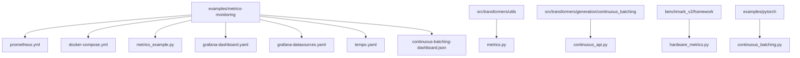
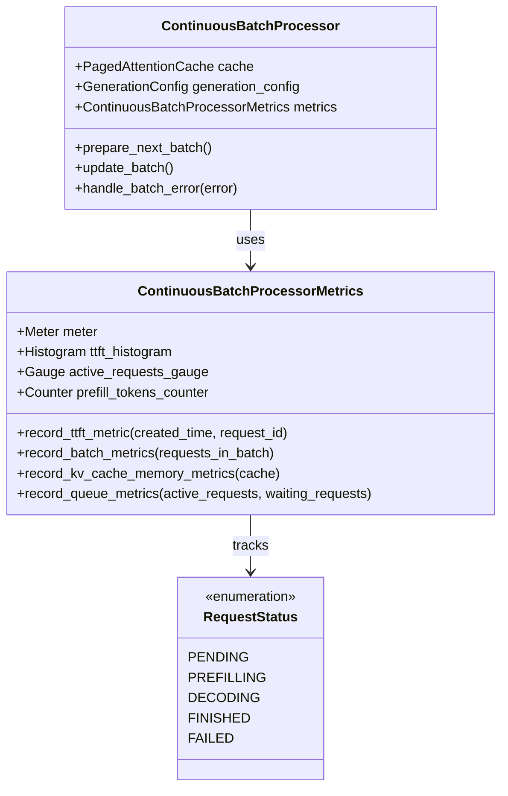
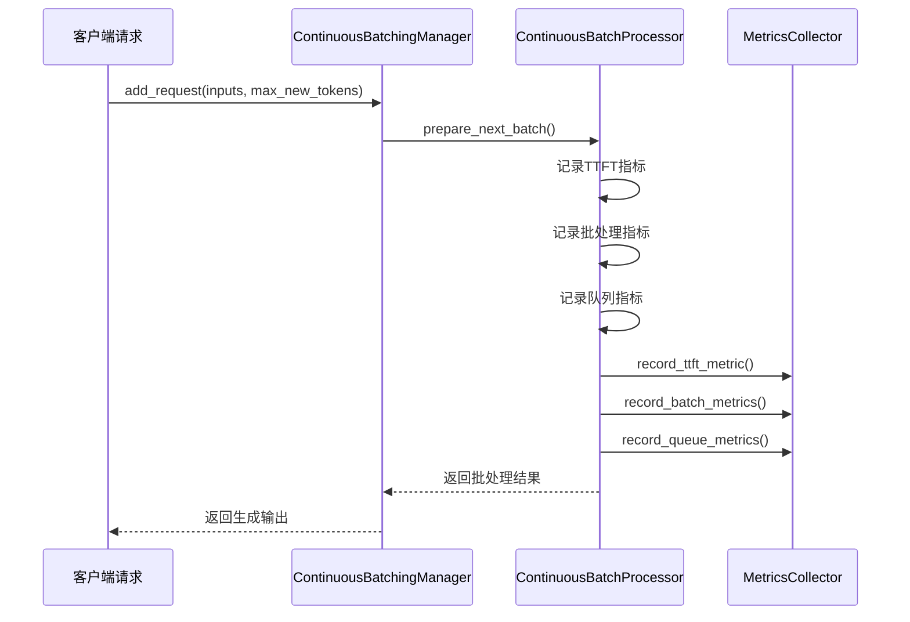
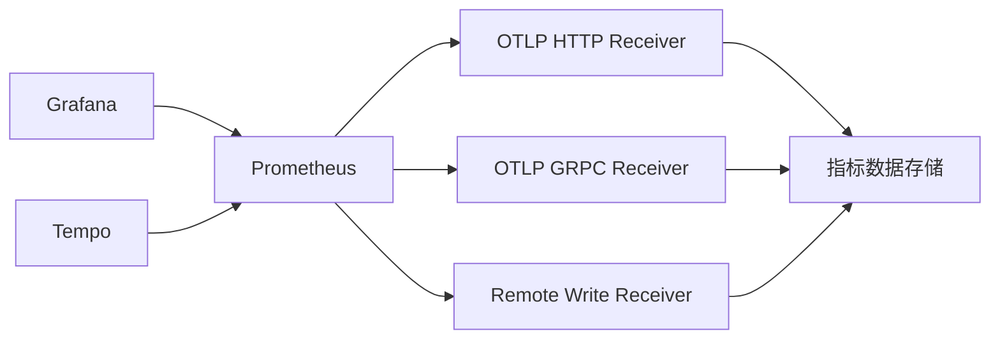
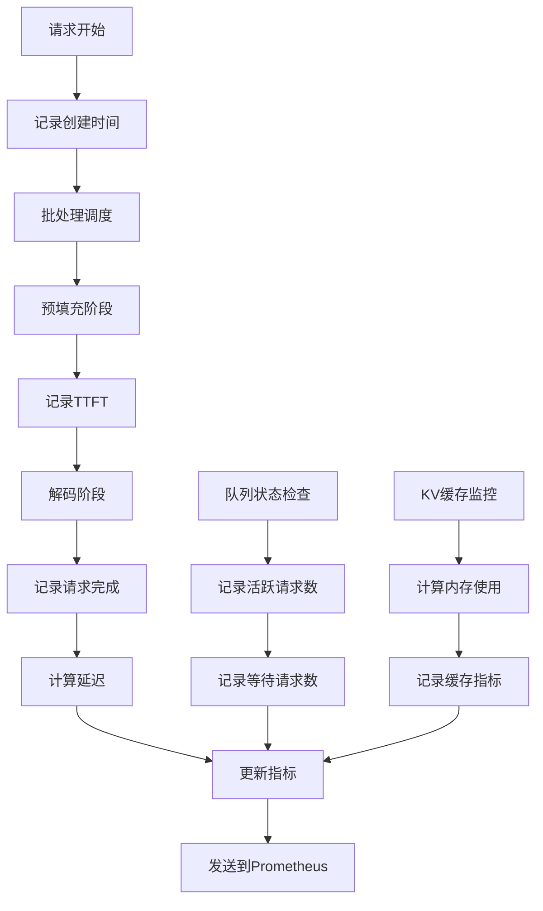
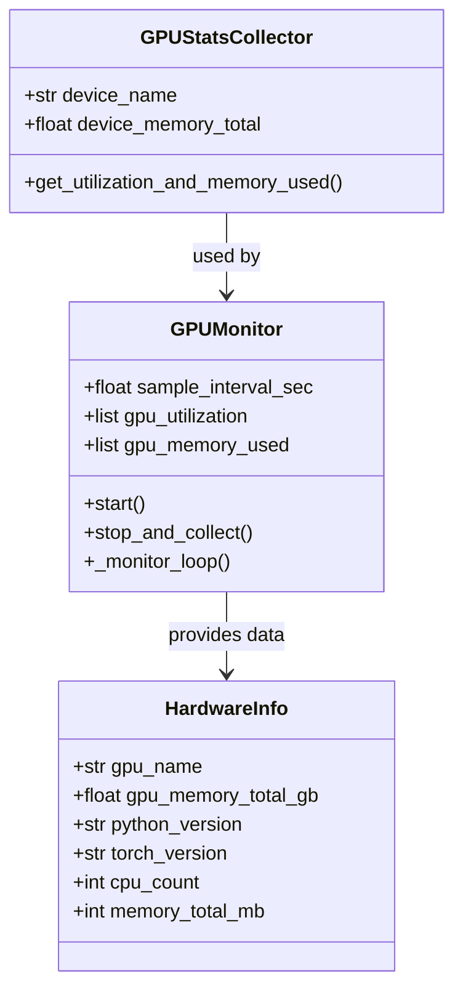
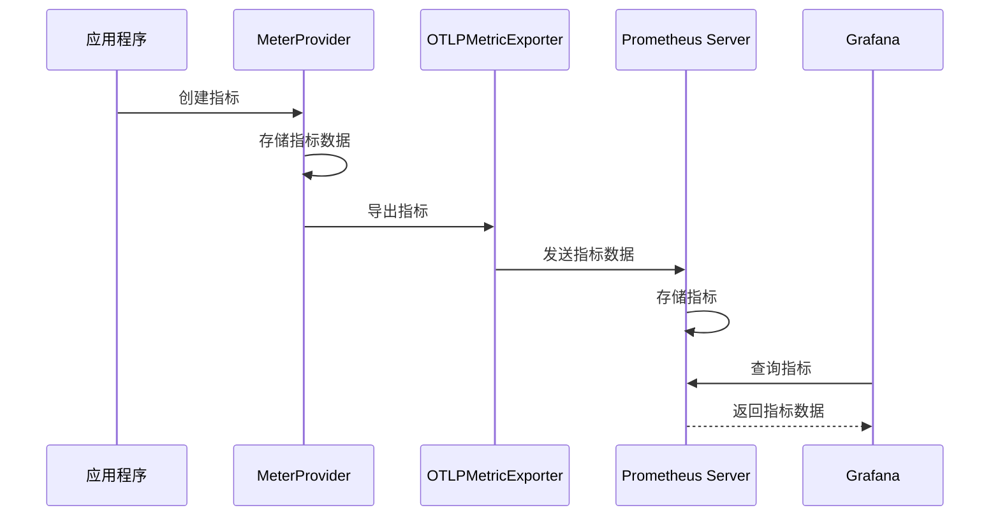
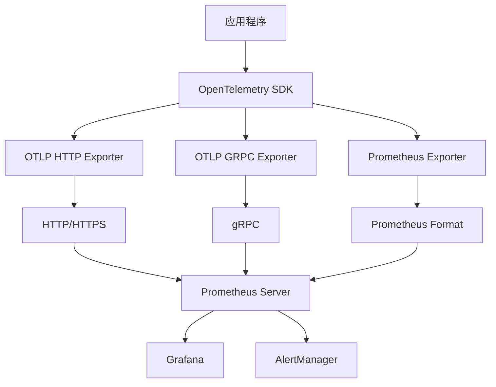
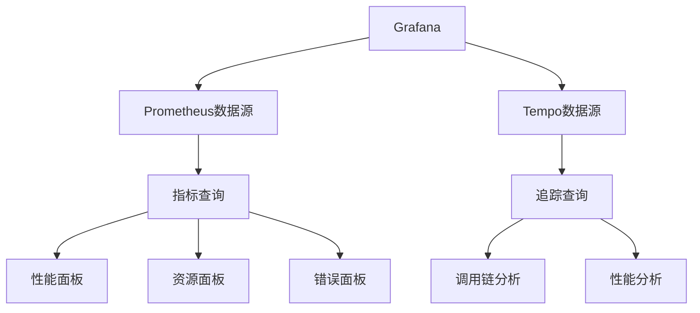

# 指标收集与配置

<cite>
**本文档中引用的文件**
- [examples/metrics-monitoring/prometheus.yml](file://examples/metrics-monitoring/prometheus.yml)
- [examples/metrics-monitoring/metrics_example.py](file://examples/metrics-monitoring/metrics_example.py)
- [examples/metrics-monitoring/docker-compose.yml](file://examples/metrics-monitoring/docker-compose.yml)
- [examples/metrics-monitoring/grafana-dashboard.yaml](file://examples/metrics-monitoring/grafana-dashboard.yaml)
- [examples/metrics-monitoring/grafana-datasources.yaml](file://examples/metrics-monitoring/grafana-datasources.yaml)
- [examples/metrics-monitoring/tempo.yaml](file://examples/metrics-monitoring/tempo.yaml)
- [examples/metrics-monitoring/continuous-batching-dashboard.json](file://examples/metrics-monitoring/continuous-batching-dashboard.json)
- [src/transformers/utils/metrics.py](file://src/transformers/utils/metrics.py)
- [src/transformers/generation/continuous_batching/continuous_api.py](file://src/transformers/generation/continuous_batching/continuous_api.py)
- [benchmark_v2/framework/hardware_metrics.py](file://benchmark_v2/framework/hardware_metrics.py)
- [examples/pytorch/continuous_batching.py](file://examples/pytorch/continuous_batching.py)
</cite>

## 目录
1. [简介](#简介)
2. [项目结构概览](#项目结构概览)
3. [核心指标收集组件](#核心指标收集组件)
4. [Prometheus配置详解](#prometheus配置详解)
5. [连续批处理指标监控](#连续批处理指标监控)
6. [硬件资源监控](#硬件资源监控)
7. [指标暴露与导出](#指标暴露与导出)
8. [Grafana仪表板配置](#grafana仪表板配置)
9. [最佳实践与优化建议](#最佳实践与优化建议)
10. [故障排除指南](#故障排除指南)
11. [总结](#总结)

## 简介

Transformers项目提供了全面的指标收集与监控解决方案，专门针对模型服务的性能监控需求。该系统基于OpenTelemetry标准，集成了Prometheus、Grafana和Tempo等主流监控工具，为模型推理服务提供实时的性能洞察。

本监控系统的核心特性包括：
- 基于OpenTelemetry的分布式追踪和指标收集
- 针对连续批处理的专用指标监控
- GPU利用率和内存使用的实时监控
- 自定义指标定义和命名规范
- 容器化部署支持和自动化配置

## 项目结构概览

监控相关文件主要分布在以下目录结构中：



**图表来源**
- [examples/metrics-monitoring/prometheus.yml](file://examples/metrics-monitoring/prometheus.yml#L1-L4)
- [examples/metrics-monitoring/docker-compose.yml](file://examples/metrics-monitoring/docker-compose.yml#L1-L56)
- [src/transformers/utils/metrics.py](file://src/transformers/utils/metrics.py#L1-L50)

## 核心指标收集组件

### OpenTelemetry集成

系统采用OpenTelemetry作为统一的指标收集框架，提供标准化的追踪和指标记录能力。



**图表来源**
- [src/transformers/utils/metrics.py](file://src/transformers/utils/metrics.py#L150-L250)
- [src/transformers/generation/continuous_batching/continuous_api.py](file://src/transformers/generation/continuous_batching/continuous_api.py#L150-L200)

### 装饰器模式实现

系统使用装饰器模式简化指标收集的代码集成：



**图表来源**
- [src/transformers/generation/continuous_batching/continuous_api.py](file://src/transformers/generation/continuous_batching/continuous_api.py#L400-L500)
- [src/transformers/utils/metrics.py](file://src/transformers/utils/metrics.py#L300-L400)

**章节来源**
- [src/transformers/utils/metrics.py](file://src/transformers/utils/metrics.py#L1-L405)
- [src/transformers/generation/continuous_batching/continuous_api.py](file://src/transformers/generation/continuous_batching/continuous_api.py#L1-L800)

## Prometheus配置详解

### 基础配置结构

Prometheus配置文件定义了系统的抓取行为和目标发现机制：

```yaml
global:
  scrape_interval: 15s
  
scrape_configs:
  - job_name: 'transformers-service'
    static_configs:
      - targets: ['localhost:9090']
    metrics_path: '/api/v1/otlp/v1/metrics'
    scrape_interval: 10s
    scrape_timeout: 5s
```

### 关键配置参数

| 参数 | 描述 | 推荐值 | 说明 |
|------|------|--------|------|
| `scrape_interval` | 抓取间隔 | 15s | 控制Prometheus从目标抓取指标的频率 |
| `scrape_timeout` | 抓取超时 | 10s | 单次抓取的最大允许时间 |
| `metrics_path` | 指标端点路径 | `/api/v1/otlp/v1/metrics` | OpenTelemetry指标接收端点 |
| `relabel_configs` | 标签重写规则 | 动态配置 | 用于添加或修改指标标签 |

### OTLP接收器配置

系统启用了多个协议的OTLP接收器以支持不同的客户端连接：



**图表来源**
- [examples/metrics-monitoring/docker-compose.yml](file://examples/metrics-monitoring/docker-compose.yml#L10-L18)

**章节来源**
- [examples/metrics-monitoring/prometheus.yml](file://examples/metrics-monitoring/prometheus.yml#L1-L4)
- [examples/metrics-monitoring/docker-compose.yml](file://examples/metrics-monitoring/docker-compose.yml#L10-L20)

## 连续批处理指标监控

### 核心性能指标

系统监控以下关键性能指标：

#### 1. 时间到首Token (TTFT) 指标
- **指标名称**: `ttft_milliseconds`
- **类型**: Histogram
- **单位**: 毫秒
- **用途**: 测量从请求开始到第一个Token生成的时间

#### 2. 请求延迟指标
- **指标名称**: `request_latency_milliseconds`
- **类型**: Histogram
- **单位**: 毫秒
- **用途**: 记录完整请求的端到端延迟

#### 3. 批处理效率指标
- **指标名称**: `batch_fill_percentage`
- **类型**: Histogram
- **单位**: 百分比
- **用途**: 监控批处理填充率，评估资源利用率

#### 4. 内存使用指标
- **指标名称**: `kv_cache_memory_bytes`
- **类型**: Gauge
- **单位**: 字节
- **用途**: 实时监控KV缓存内存使用情况

### 指标收集流程



**图表来源**
- [src/transformers/utils/metrics.py](file://src/transformers/utils/metrics.py#L200-L350)

### 自定义指标定义

系统提供了灵活的自定义指标定义机制：

```python
# 示例：自定义指标定义
self.custom_histogram = self.meter.create_histogram(
    name="custom_operation_duration",
    description="Duration of custom operations",
    unit="ms",
    explicit_bucket_boundaries_advisory=[10, 50, 100, 200, 500, 1000]
)

# 添加标签和属性
span.set_attribute("operation.type", "custom")
span.set_attribute("operation.priority", "high")
```

**章节来源**
- [src/transformers/utils/metrics.py](file://src/transformers/utils/metrics.py#L150-L405)
- [examples/metrics-monitoring/metrics_example.py](file://examples/metrics-monitoring/metrics_example.py#L1-L49)

## 硬件资源监控

### GPU监控系统

系统提供了全面的GPU资源监控能力，支持NVIDIA和AMD GPU：



**图表来源**
- [benchmark_v2/framework/hardware_metrics.py](file://benchmark_v2/framework/hardware_metrics.py#L50-L100)

### 监控指标类型

| 指标类别 | 具体指标 | 数据类型 | 更新频率 |
|----------|----------|----------|----------|
| GPU利用率 | utilization | 整数百分比 | 100ms |
| GPU内存使用 | memory_used | 浮点GB | 100ms |
| CPU利用率 | cpu_percent | 整数百分比 | 1s |
| 内存使用 | memory_percent | 整数百分比 | 1s |
| 温度监控 | temperature | 整数摄氏度 | 5s |

### 硬件信息收集

系统自动收集硬件配置信息用于指标关联：

```python
# 硬件信息结构
hardware_info = {
    "gpu_name": "NVIDIA A100-SXM4-40GB",
    "gpu_memory_total_gb": 40.0,
    "python_version": "3.9.7",
    "torch_version": "2.0.1",
    "cuda_version": "11.8",
    "cpu_count": 64,
    "memory_total_mb": 256000
}
```

**章节来源**
- [benchmark_v2/framework/hardware_metrics.py](file://benchmark_v2/framework/hardware_metrics.py#L1-L172)

## 指标暴露与导出

### OpenTelemetry配置

系统使用OpenTelemetry SDK进行指标暴露和导出：



**图表来源**
- [examples/metrics-monitoring/README.md](file://examples/metrics-monitoring/README.md#L15-L40)

### 环境变量配置

系统支持通过环境变量配置指标导出：

| 环境变量 | 默认值 | 说明 |
|----------|--------|------|
| `OTEL_EXPORTER_OTLP_METRICS_ENDPOINT` | `http://localhost:9090/api/v1/otlp/v1/metrics` | 指标导出端点 |
| `OTEL_EXPORTER_OTLP_TRACES_ENDPOINT` | `http://localhost:4318/v1/traces` | 追踪导出端点 |
| `OTEL_METRICS_EXPORT_INTERVAL` | `1000` | 导出间隔（毫秒） |

### 多协议支持

系统支持多种指标导出协议：



**图表来源**
- [examples/metrics-monitoring/tempo.yaml](file://examples/metrics-monitoring/tempo.yaml#L30-L50)

**章节来源**
- [examples/metrics-monitoring/README.md](file://examples/metrics-monitoring/README.md#L15-L41)
- [examples/pytorch/continuous_batching.py](file://examples/pytorch/continuous_batching.py#L66-L93)

## Grafana仪表板配置

### 数据源配置

Grafana通过YAML配置文件定义数据源：

```yaml
datasources:
  - name: Prometheus
    type: prometheus
    access: proxy
    url: http://prometheus:9090
    isDefault: true
    
  - name: Tempo
    type: tempo
    access: proxy
    url: http://tempo:3200
    uid: tempo
```

### 关键监控面板

系统提供了专门的连续批处理监控仪表板：

#### 1. 性能指标面板
- **KV缓存内存使用**: 实时监控缓存内存占用
- **活跃请求数**: 显示当前正在处理的请求数量
- **等待请求数**: 监控待处理请求队列长度

#### 2. 批处理效率面板
- **批处理填充率**: 监控批处理的资源利用效率
- **解码/预填充比例**: 分析批处理中不同阶段的负载分布
- **Token处理速率**: 实时显示Token生成速度

#### 3. 系统健康面板
- **GPU利用率趋势**: 长期GPU使用情况分析
- **内存使用趋势**: 系统内存和缓存使用趋势
- **错误率统计**: 请求失败率和错误类型分布

### 仪表板架构



**图表来源**
- [examples/metrics-monitoring/grafana-datasources.yaml](file://examples/metrics-monitoring/grafana-datasources.yaml#L1-L15)

**章节来源**
- [examples/metrics-monitoring/grafana-dashboard.yaml](file://examples/metrics-monitoring/grafana-dashboard.yaml#L1-L12)
- [examples/metrics-monitoring/grafana-datasources.yaml](file://examples/metrics-monitoring/grafana-datasources.yaml#L1-L15)
- [examples/metrics-monitoring/continuous-batching-dashboard.json](file://examples/metrics-monitoring/continuous-batching-dashboard.json#L1-L200)

## 最佳实践与优化建议

### 指标命名规范

遵循OpenTelemetry指标命名约定：

| 类型 | 命名格式 | 示例 | 说明 |
|------|----------|------|------|
| Counter | `{name}_total` | `request_count_total` | 累计计数器 |
| Gauge | `{name}` | `active_requests` | 当前值 |
| Histogram | `{name}_milliseconds` | `request_latency` | 分布统计 |
| Summary | `{name}` | `response_size` | 分位数统计 |

### 数据采样策略

#### 1. 时间窗口选择
- **高频指标**: TTFT、请求延迟（1秒）
- **中频指标**: 批处理填充率（5秒）
- **低频指标**: 系统配置信息（30秒）

#### 2. 指标聚合策略
```python
# 使用适当的桶配置
buckets = [10, 25, 50, 75, 100, 150, 200, 300, 500, 750, 1000, 2000, 5000, 10000]
histogram = meter.create_histogram(
    name="latency",
    unit="ms",
    explicit_bucket_boundaries_advisory=buckets
)
```

### 性能优化建议

#### 1. 指标收集优化
- 使用异步导出避免阻塞主线程
- 合理设置导出间隔平衡性能和实时性
- 实施指标压缩减少网络开销

#### 2. 内存管理优化
- 及时清理过期指标数据
- 使用滑动窗口限制内存使用
- 实施指标采样降低存储压力

#### 3. 网络传输优化
- 启用指标压缩
- 使用批量导出减少网络请求
- 实施重试机制提高可靠性

### 监控告警配置

建议设置以下关键告警阈值：

| 指标 | 正常范围 | 警告阈值 | 严重阈值 |
|------|----------|----------|----------|
| GPU利用率 | 60-80% | >80% | >90% |
| 内存使用率 | <80% | >85% | >95% |
| 请求延迟 | <100ms | >200ms | >500ms |
| 错误率 | <1% | >5% | >10% |

## 故障排除指南

### 常见问题诊断

#### 1. 指标无法收集
**症状**: Grafana中看不到任何指标数据

**排查步骤**:
1. 检查OpenTelemetry SDK是否正确安装
2. 验证指标导出器配置
3. 确认网络连接和防火墙设置
4. 查看应用程序日志中的错误信息

**解决方案**:
```python
# 启用调试日志
import logging
logging.getLogger("opentelemetry").setLevel(logging.DEBUG)
```

#### 2. 性能指标异常
**症状**: 指标值超出预期范围或出现负值

**排查步骤**:
1. 检查时间戳同步问题
2. 验证指标计算逻辑
3. 确认数据类型转换正确
4. 检查并发访问冲突

#### 3. 内存泄漏问题
**症状**: 应用程序内存使用持续增长

**排查步骤**:
1. 监控指标对象数量
2. 检查指标清理机制
3. 分析指标存储策略
4. 验证垃圾回收配置

### 调试工具和技巧

#### 1. 指标验证工具
```python
# 指标完整性检查
def validate_metrics(metrics_collector):
    assert hasattr(metrics_collector, 'ttft_histogram')
    assert hasattr(metrics_collector, 'request_latency_histogram')
    assert hasattr(metrics_collector, 'active_requests_gauge')
```

#### 2. 性能分析工具
```python
# 指标收集性能分析
import time
import cProfile

def profile_metrics_collection():
    profiler = cProfile.Profile()
    profiler.enable()
    
    # 执行指标收集操作
    metrics_collector.record_ttft_metric(time.time(), "test_request")
    
    profiler.disable()
    profiler.print_stats(sort='time')
```

#### 3. 网络连通性测试
```bash
# 测试指标导出端点
curl -X POST http://localhost:9090/api/v1/otlp/v1/metrics \
  -H "Content-Type: application/x-protobuf" \
  -d "test_data"
```

**章节来源**
- [src/transformers/utils/metrics.py](file://src/transformers/utils/metrics.py#L350-L405)

## 总结

Transformers项目的指标收集与配置系统提供了一个完整、可扩展的监控解决方案。通过集成OpenTelemetry标准，系统实现了：

1. **统一的指标收集框架**: 基于OpenTelemetry的标准接口，支持多种导出协议
2. **专业的连续批处理监控**: 针对模型推理服务的特定指标设计
3. **全面的硬件资源监控**: 支持多厂商GPU和系统资源监控
4. **直观的可视化界面**: 通过Grafana提供丰富的监控仪表板
5. **容器化部署支持**: 通过Docker Compose实现一键部署

该系统不仅满足了当前的监控需求，还具备良好的扩展性和维护性，为模型服务的稳定运行提供了强有力的保障。通过遵循本文档中的最佳实践和配置指南，开发者可以快速部署并优化监控系统，确保模型服务的高性能和高可用性。