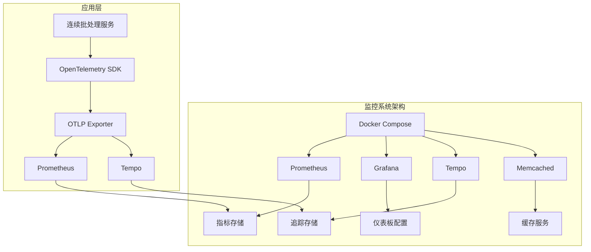
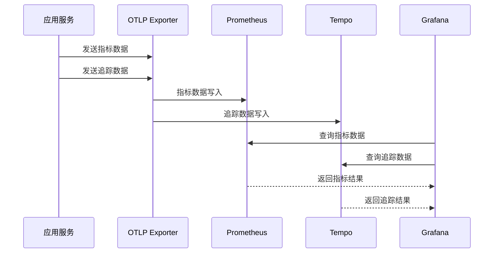
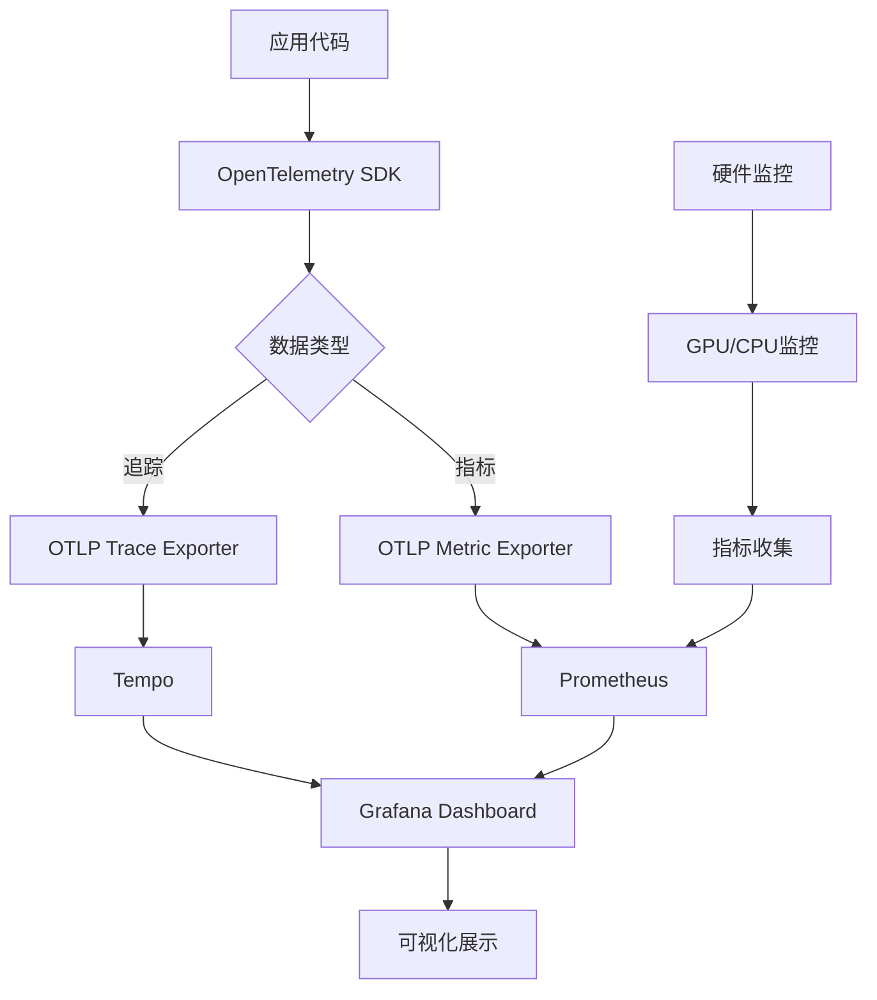
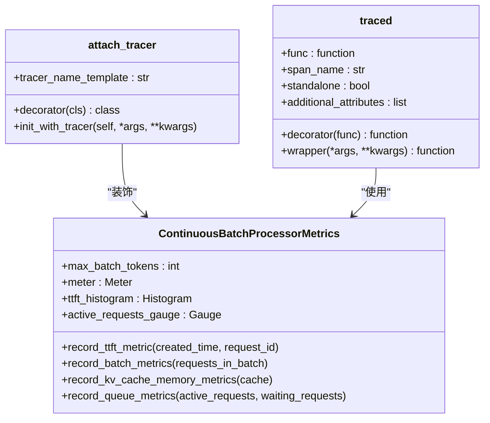
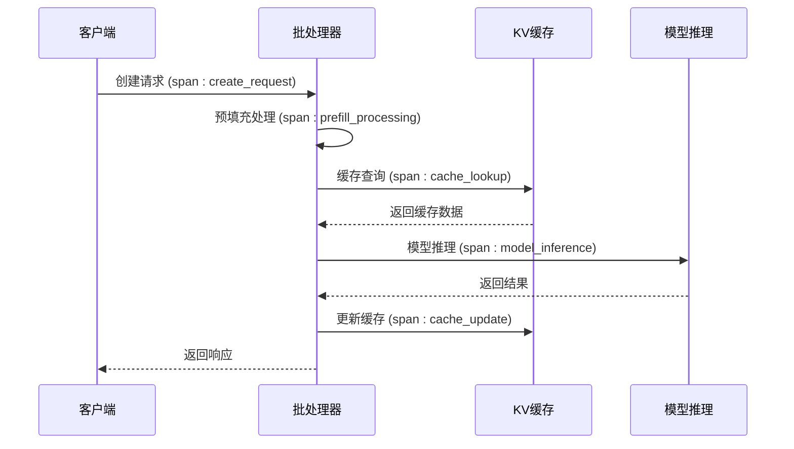
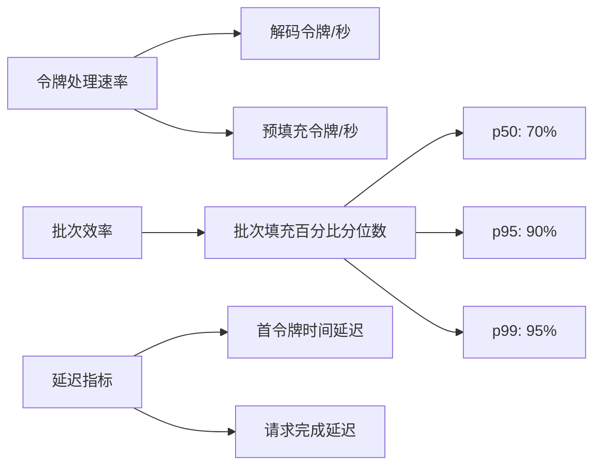
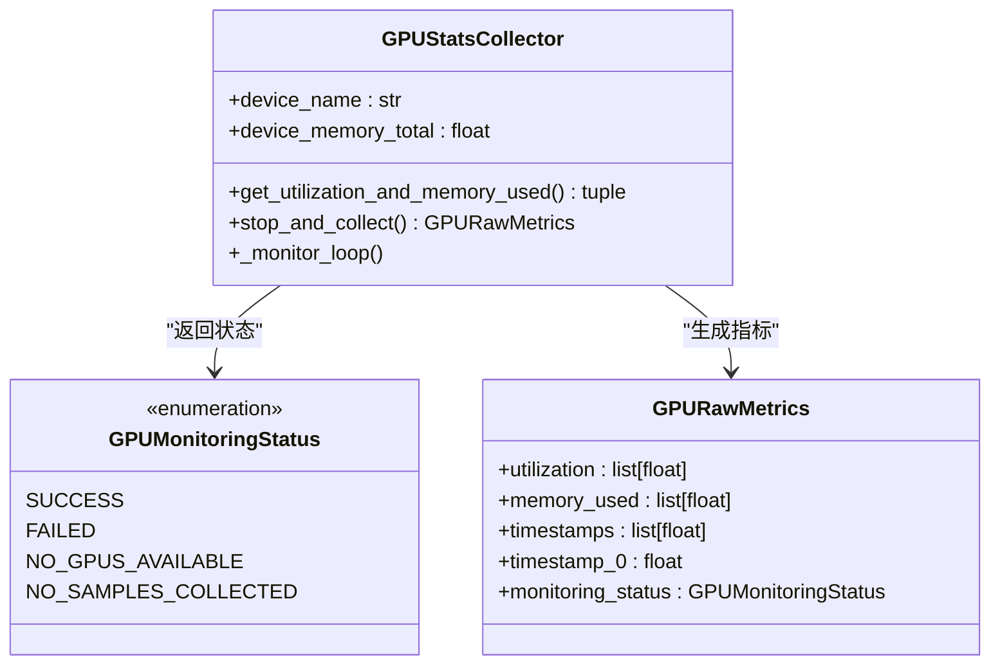
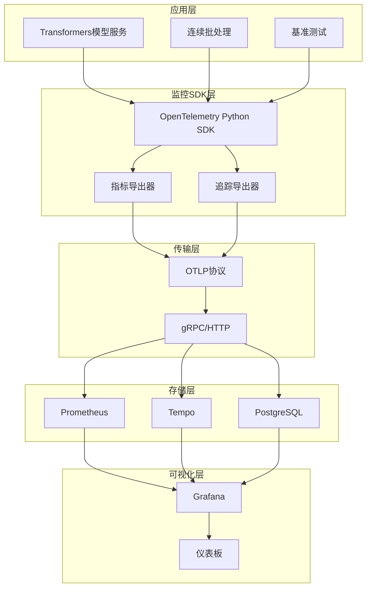

# 监控系统集成

<cite>
**本文档中引用的文件**
- [examples/metrics-monitoring/prometheus.yml](file://examples/metrics-monitoring/prometheus.yml)
- [examples/metrics-monitoring/grafana-dashboard.yaml](file://examples/metrics-monitoring/grafana-dashboard.yaml)
- [examples/metrics-monitoring/docker-compose.yml](file://examples/metrics-monitoring/docker-compose.yml)
- [examples/metrics-monitoring/metrics_example.py](file://examples/metrics-monitoring/metrics_example.py)
- [examples/metrics-monitoring/README.md](file://examples/metrics-monitoring/README.md)
- [examples/metrics-monitoring/continuous-batching-dashboard.json](file://examples/metrics-monitoring/continuous-batching-dashboard.json)
- [examples/metrics-monitoring/grafana-datasources.yaml](file://examples/metrics-monitoring/grafana-datasources.yaml)
- [examples/metrics-monitoring/tempo.yaml](file://examples/metrics-monitoring/tempo.yaml)
- [examples/pytorch/continuous_batching.py](file://examples/pytorch/continuous_batching.py)
- [src/transformers/utils/metrics.py](file://src/transformers/utils/metrics.py)
- [benchmark/grafana_dashboard.json](file://benchmark/grafana_dashboard.json)
- [benchmark_v2/framework/hardware_metrics.py](file://benchmark_v2/framework/hardware_metrics.py)
- [benchmark_v2/framework/data_classes.py](file://benchmark_v2/framework/data_classes.py)
</cite>

## 目录
1. [简介](#简介)
2. [项目结构](#项目结构)
3. [核心组件](#核心组件)
4. [架构概览](#架构概览)
5. [详细组件分析](#详细组件分析)
6. [依赖关系分析](#依赖关系分析)
7. [性能考虑](#性能考虑)
8. [故障排除指南](#故障排除指南)
9. [结论](#结论)

## 简介

本指南详细介绍了基于Transformers库的metrics-monitoring示例中的完整监控系统集成方案。该系统采用现代化的可观测性栈，集成了Prometheus指标收集、Grafana可视化仪表板、Tempo分布式追踪和OpenTelemetry标准，为模型服务提供了全面的监控能力。

监控系统的核心价值在于：
- **实时性能监控**：跟踪关键性能指标如请求延迟、吞吐量和资源利用率
- **分布式追踪**：提供端到端的服务链路追踪能力
- **智能告警**：基于阈值和异常检测的自动化告警机制
- **容量规划**：通过历史数据分析支持基础设施规划
- **故障诊断**：快速定位和诊断系统问题

## 项目结构

监控系统的文件组织遵循容器化部署的标准模式，主要分为以下几个层次：



**图表来源**
- [examples/metrics-monitoring/docker-compose.yml](file://examples/metrics-monitoring/docker-compose.yml#L1-L56)

**章节来源**
- [examples/metrics-monitoring/docker-compose.yml](file://examples/metrics-monitoring/docker-compose.yml#L1-L56)
- [examples/metrics-monitoring/prometheus.yml](file://examples/metrics-monitoring/prometheus.yml#L1-L4)
- [examples/metrics-monitoring/grafana-dashboard.yaml](file://examples/metrics-monitoring/grafana-dashboard.yaml#L1-L12)

## 核心组件

### Prometheus指标收集器

Prometheus作为核心的时序数据库，负责收集和存储各种系统指标。其配置简洁而高效：

```yaml
global:
  scrape_interval: 15s
```

Prometheus配置支持以下关键特性：
- **自动发现机制**：通过Docker Compose自动发现服务
- **多协议支持**：同时支持HTTP和gRPC协议
- **原生直方图**：利用原生直方图提高存储效率
- **示例存储**：支持指标关联的追踪示例

### Grafana可视化平台

Grafana提供丰富的可视化能力和灵活的仪表板配置：

```yaml
providers:
  - name: 'Transformers Dashboards'
    orgId: 1
    folder: 'Transformers'
    type: file
    disableDeletion: false
    editable: true
    options:
      path: /etc/grafana/provisioning/dashboards
```

Grafana的核心功能包括：
- **多数据源支持**：同时连接Prometheus和Tempo
- **动态仪表板**：基于JSON模板的可编程仪表板
- **插件生态**：丰富的第三方插件支持
- **用户权限管理**：细粒度的访问控制

### Tempo分布式追踪系统

Tempo专门处理大规模的分布式追踪数据：

```yaml
server:
  http_listen_port: 3200
  log_level: info

cache:
  background:
    writeback_goroutines: 5
  caches:
  - roles:
    - frontend-search
    memcached:
      addresses: dns+memcached:11211
```

Tempo的关键特性：
- **高性能查询**：优化的查询引擎支持复杂追踪查询
- **多接收器**：支持Jaeger、Zipkin、OTLP等多种协议
- **本地存储**：基于本地磁盘的高效存储方案
- **指标生成**：自动生成追踪相关的指标数据

**章节来源**
- [examples/metrics-monitoring/prometheus.yml](file://examples/metrics-monitoring/prometheus.yml#L1-L4)
- [examples/metrics-monitoring/grafana-dashboard.yaml](file://examples/metrics-monitoring/grafana-dashboard.yaml#L1-L12)
- [examples/metrics-monitoring/tempo.yaml](file://examples/metrics-monitoring/tempo.yaml#L1-L91)

## 架构概览

监控系统采用微服务架构，各组件职责明确且高度解耦：



**图表来源**
- [examples/metrics-monitoring/docker-compose.yml](file://examples/metrics-monitoring/docker-compose.yml#L1-L56)
- [examples/pytorch/continuous_batching.py](file://examples/pytorch/continuous_batching.py#L66-L93)

### 数据流架构

监控系统的数据流遵循标准化的OpenTelemetry规范：



**图表来源**
- [src/transformers/utils/metrics.py](file://src/transformers/utils/metrics.py#L173-L209)
- [examples/pytorch/continuous_batching.py](file://examples/pytorch/continuous_batching.py#L66-L93)

## 详细组件分析

### OpenTelemetry集成

Transformers库提供了完整的OpenTelemetry集成，支持自动化的指标收集和分布式追踪。

#### 装饰器系统

系统提供了两个核心装饰器来简化追踪和指标记录：



**图表来源**
- [src/transformers/utils/metrics.py](file://src/transformers/utils/metrics.py#L46-L88)
- [src/transformers/utils/metrics.py](file://src/transformers/utils/metrics.py#L173-L209)

#### 关键性能指标（KPI）

系统定义了多个关键性能指标来监控模型服务的运行状态：

| 指标名称 | 类型 | 单位 | 描述 | 告警阈值建议 |
|---------|------|------|------|-------------|
| ttft_milliseconds | 直方图 | ms | 首次令牌时间 | > 500ms |
| request_latency_milliseconds | 直方图 | ms | 请求端到端延迟 | > 2000ms |
| active_requests_count | 计数器 | requests | 当前活跃请求数 | > 1000 |
| waiting_requests_count | 计数器 | requests | 等待处理的请求数 | > 500 |
| kv_cache_memory_bytes | 计数器 | bytes | KV缓存内存使用量 | > 8GB |
| decode_prefill_ratio | 计数器 | ratio | 解码/预填充比率 | < 0.1 或 > 10 |

#### 分布式追踪实现

追踪系统支持多种追踪场景：



**图表来源**
- [src/transformers/utils/metrics.py](file://src/transformers/utils/metrics.py#L130-L170)
- [examples/metrics-monitoring/metrics_example.py](file://examples/metrics-monitoring/metrics_example.py#L1-L49)

**章节来源**
- [src/transformers/utils/metrics.py](file://src/transformers/utils/metrics.py#L46-L88)
- [src/transformers/utils/metrics.py](file://src/transformers/utils/metrics.py#L173-L209)
- [examples/metrics-monitoring/metrics_example.py](file://examples/metrics-monitoring/metrics_example.py#L1-L49)

### Grafana仪表板定制

系统提供了专门针对连续批处理的仪表板配置，包含以下核心面板：

#### 实时监控面板

| 面板类型 | 监控指标 | 可视化方式 | 阈值设置 |
|---------|---------|-----------|----------|
| 仪表盘 | KV缓存内存使用 | 仪表盘图表 | 绿色: < 5GB, 黄色: 5-8GB, 红色: > 8GB |
| 统计值 | 活跃请求数 | 数字显示 | > 1000个并发请求 |
| 统计值 | 等待请求数 | 数字显示 | > 500个等待请求 |
| 统计值 | 解码/预填充比率 | 数字显示 | < 0.1 或 > 10 |

#### 性能趋势分析



**图表来源**
- [examples/metrics-monitoring/continuous-batching-dashboard.json](file://examples/metrics-monitoring/continuous-batching-dashboard.json#L1-L799)

#### 内存使用监控

系统提供了详细的内存使用监控，包括：
- **KV缓存内存**：实时监控缓存使用的物理内存
- **内存使用趋势**：历史数据展示内存使用模式
- **内存碎片分析**：帮助识别内存泄漏和碎片化问题

**章节来源**
- [examples/metrics-monitoring/continuous-batching-dashboard.json](file://examples/metrics-monitoring/continuous-batching-dashboard.json#L1-L799)

### 硬件监控集成

基准测试框架包含了完整的硬件监控能力，支持多种GPU厂商的监控：

#### GPU监控实现



**图表来源**
- [benchmark_v2/framework/hardware_metrics.py](file://benchmark_v2/framework/hardware_metrics.py#L75-L170)

#### 多厂商GPU支持

系统支持主流GPU厂商的监控：
- **NVIDIA GPU**：通过`gpustat`库获取利用率和内存使用
- **AMD GPU**：通过`rocm-smi`工具获取监控数据
- **通用接口**：统一的监控接口支持扩展新厂商

**章节来源**
- [benchmark_v2/framework/hardware_metrics.py](file://benchmark_v2/framework/hardware_metrics.py#L75-L170)
- [benchmark_v2/framework/data_classes.py](file://benchmark_v2/framework/data_classes.py#L0-L44)

## 依赖关系分析

监控系统的依赖关系呈现清晰的分层结构：



**图表来源**
- [examples/metrics-monitoring/docker-compose.yml](file://examples/metrics-monitoring/docker-compose.yml#L1-L56)
- [examples/pytorch/continuous_batching.py](file://examples/pytorch/continuous_batching.py#L66-L93)

### 关键依赖项

| 组件 | 版本要求 | 用途 | 可选性 |
|------|---------|------|--------|
| opentelemetry-api | >=1.30.0 | OpenTelemetry核心API | 必需 |
| opentelemetry-sdk | >=1.30.0 | OpenTelemetry SDK实现 | 必需 |
| prometheus-client | 最新版本 | Prometheus客户端 | 必需 |
| grafana | 最新稳定版 | 可视化平台 | 必需 |
| tempo | 最新版本 | 分布式追踪 | 必需 |
| gpustat | 1.1.1 | GPU监控 | 可选 |
| psutil | 6.0.0 | 系统监控 | 可选 |

**章节来源**
- [examples/metrics-monitoring/docker-compose.yml](file://examples/metrics-monitoring/docker-compose.yml#L1-L56)
- [examples/pytorch/continuous_batching.py](file://examples/pytorch/continuous_batching.py#L66-L93)

## 性能考虑

### 指标收集性能

监控系统在设计时充分考虑了性能影响：

#### 异步处理机制
- **批量导出**：指标数据批量发送，减少网络开销
- **后台线程**：追踪数据在独立线程中处理
- **缓冲策略**：智能缓冲避免频繁的I/O操作

#### 内存管理优化
- **滑动窗口**：限制历史数据的内存占用
- **压缩存储**：对追踪数据进行压缩存储
- **垃圾回收**：定期清理过期的监控数据

### 查询性能优化

Grafana仪表板查询经过精心优化：
- **索引策略**：为常用查询字段建立索引
- **缓存机制**：缓存频繁查询的结果
- **分页加载**：大数据集分页显示

## 故障排除指南

### 常见问题诊断

#### 指标收集失败

**症状**：Grafana中看不到任何指标数据

**排查步骤**：
1. 检查OpenTelemetry SDK是否正确初始化
2. 验证OTLP导出器的端点配置
3. 确认Prometheus能够访问指标端点
4. 检查网络防火墙设置

#### 追踪数据丢失

**症状**：部分请求没有追踪记录

**排查步骤**：
1. 检查追踪采样率配置
2. 验证TracerProvider的正确设置
3. 确认Tempo服务的可用性
4. 检查追踪数据的序列化格式

#### 性能问题

**症状**：监控系统影响主业务性能

**解决方案**：
1. 调整指标收集频率
2. 优化追踪采样策略
3. 增加监控系统的资源分配
4. 使用异步处理减少阻塞

**章节来源**
- [examples/metrics-monitoring/README.md](file://examples/metrics-monitoring/README.md#L8-L41)
- [src/transformers/utils/metrics.py](file://src/transformers/utils/metrics.py#L173-L209)

## 结论

Transformers库的监控系统集成提供了一个完整、现代化的可观测性解决方案。通过Prometheus、Grafana、Tempo和OpenTelemetry的深度集成，系统能够：

### 主要优势

1. **全面覆盖**：从基础设施到应用层的全方位监控
2. **实时响应**：毫秒级的指标收集和追踪记录
3. **易于部署**：基于Docker Compose的一键部署
4. **灵活配置**：支持自定义指标和告警规则
5. **成本效益**：开源技术栈降低部署成本

### 最佳实践建议

1. **合理设置阈值**：根据业务需求调整告警阈值
2. **定期审查指标**：持续优化监控指标的有效性
3. **备份配置**：定期备份监控配置和仪表板
4. **安全加固**：配置适当的访问控制和网络安全
5. **容量规划**：基于历史数据进行容量预测

### 未来发展方向

随着AI模型规模的不断增长，监控系统需要持续演进：
- **机器学习驱动的异常检测**
- **更细粒度的资源监控**
- **跨云平台的统一监控**
- **自动化运维能力增强**

这套监控系统为Transformers模型服务提供了坚实的基础，确保了生产环境的稳定性和可维护性。