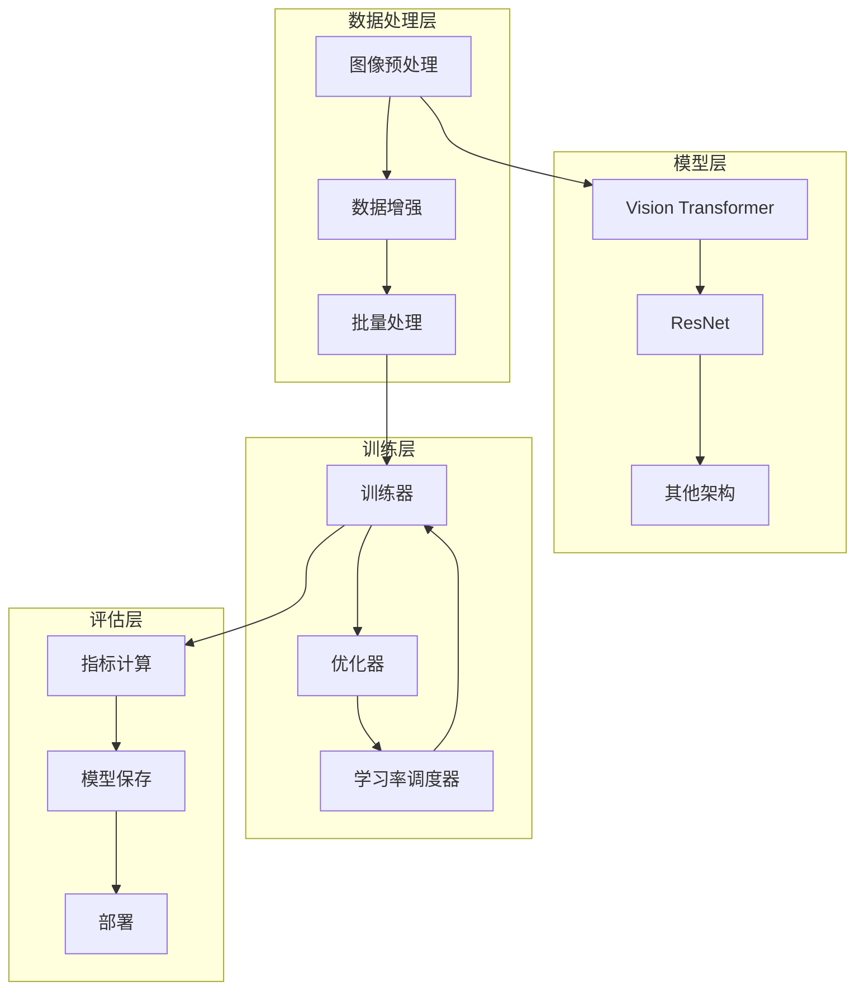
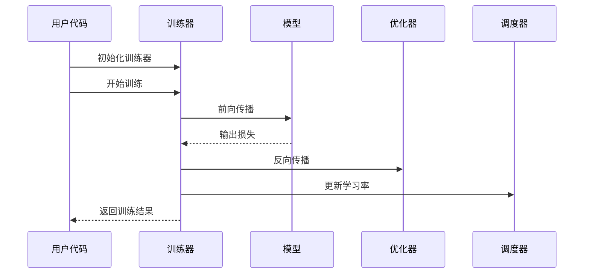
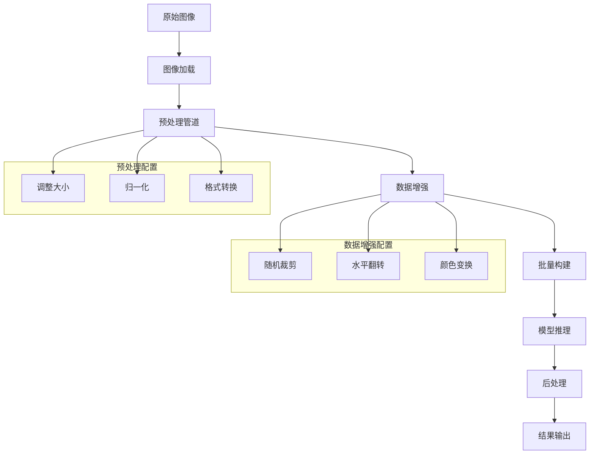
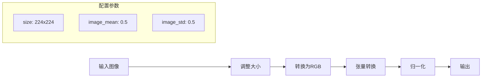
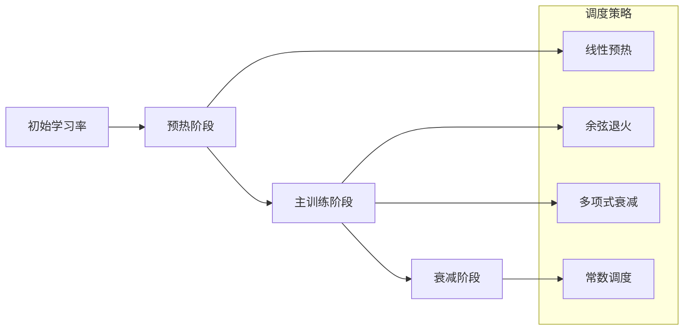
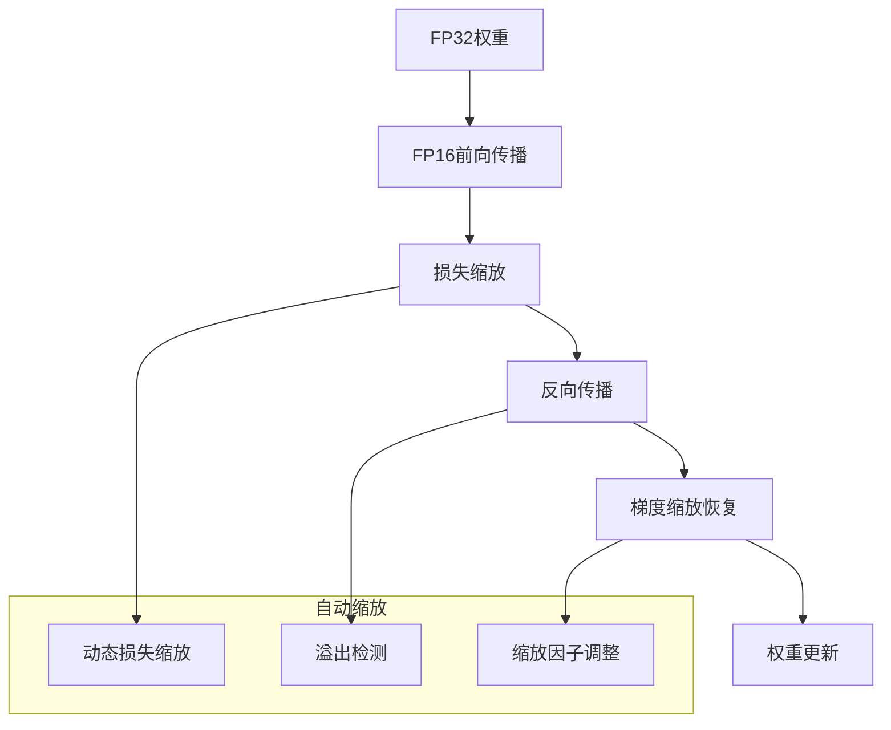
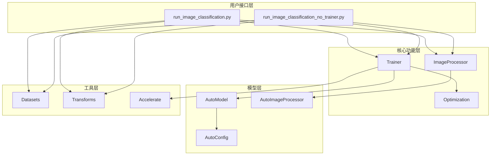
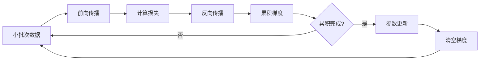
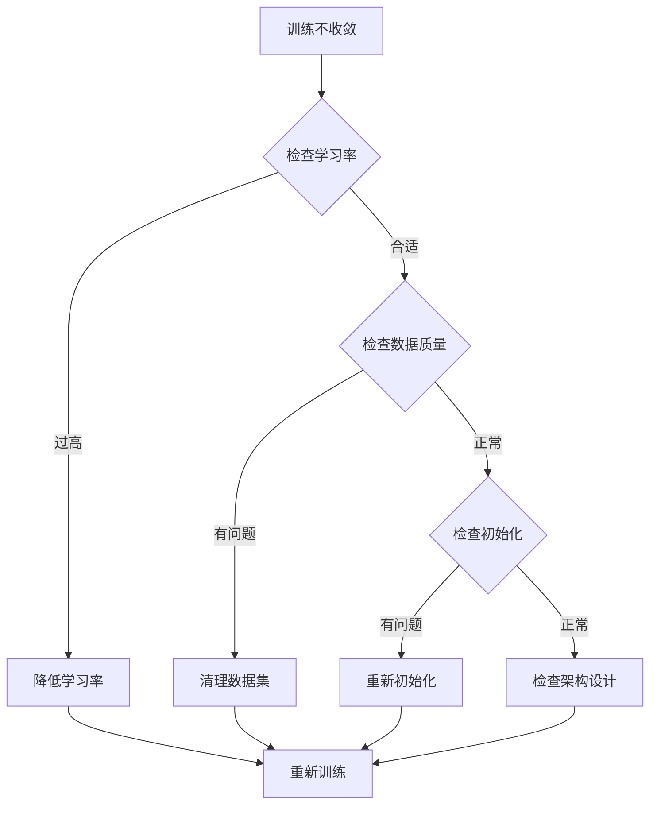

# 图像分类最佳实践

<cite>
**本文档中引用的文件**
- [run_image_classification.py](file://examples/pytorch/image-classification/run_image_classification.py)
- [run_image_classification_no_trainer.py](file://examples/pytorch/image-classification/run_image_classification_no_trainer.py)
- [image_classification.py](file://src/transformers/pipelines/image_classification.py)
- [image_processing_utils.py](file://src/transformers/image_processing_utils.py)
- [trainer.py](file://src/transformers/trainer.py)
- [optimization.py](file://src/transformers/optimization.py)
- [training_args.py](file://src/transformers/training_args.py)
- [vit/image_processing_vit.py](file://src/transformers/models/vit/image_processing_vit.py)
- [deit/image_processing_deit.py](file://src/transformers/models/deit/image_processing_deit.py)
</cite>

## 目录
1. [简介](#简介)
2. [项目结构概览](#项目结构概览)
3. [核心组件](#核心组件)
4. [架构概览](#架构概览)
5. [详细组件分析](#详细组件分析)
6. [依赖关系分析](#依赖关系分析)
7. [性能考虑](#性能考虑)
8. [故障排除指南](#故障排除指南)
9. [结论](#结论)

## 简介

本文档提供了基于Hugging Face Transformers库的图像分类任务最佳实践指南。重点关注基于Vision Transformer（ViT）和ResNet等现代架构的推荐方法，涵盖从数据预处理到训练优化的完整工作流程。

图像分类是计算机视觉领域的基础任务，涉及将输入图像分配给预定义类别。随着深度学习的发展，基于Transformer的架构（如ViT）在图像分类任务中展现出卓越性能，同时保留了与自然语言处理相似的模块化设计优势。

## 项目结构概览

Transformers库为图像分类提供了完整的解决方案，包含以下关键组件：

**图表来源**
- [run_image_classification.py](file://examples/pytorch/image-classification/run_image_classification.py#L1-L50)
- [trainer.py](file://src/transformers/trainer.py#L1-L100)

## 核心组件

### 图像预处理系统

Transformers提供了统一的图像预处理接口，支持多种主流架构的标准化预处理流程：

#### 预处理管道
- **调整大小（Resize）**：将图像调整到模型期望的输入尺寸
- **中心裁剪（Center Crop）**：从调整大小后的图像中提取中心区域
- **归一化（Normalize）**：使用ImageNet标准均值和标准差进行归一化
- **张量转换（ToTensor）**：将PIL图像转换为PyTorch张量

#### 数据增强策略
- **随机裁剪（RandomResizedCrop）**：提高模型的尺度不变性
- **水平翻转（RandomHorizontalFlip）**：增加数据多样性
- **颜色抖动**：模拟不同的光照条件

**章节来源**
- [image_processing_utils.py](file://src/transformers/image_processing_utils.py#L50-L150)
- [run_image_classification.py](file://examples/pytorch/image-classification/run_image_classification.py#L300-L400)

### 训练框架

#### 训练器（Trainer）
Transformers提供了高级训练器，简化了训练流程：

**图表来源**
- [trainer.py](file://src/transformers/trainer.py#L200-L300)

**章节来源**
- [trainer.py](file://src/transformers/trainer.py#L1-L200)

## 架构概览

### 图像分类流水线

**图表来源**
- [image_classification.py](file://src/transformers/pipelines/image_classification.py#L150-L230)
- [run_image_classification.py](file://examples/pytorch/image-classification/run_image_classification.py#L350-L431)

## 详细组件分析

### Vision Transformer (ViT) 图像处理器

ViT图像处理器针对Vision Transformer架构进行了专门优化：

#### 标准配置
- **输入尺寸**：默认224×224像素
- **归一化参数**：使用ImageNet标准均值[0.5, 0.5, 0.5]和标准差[0.5, 0.5, 0.5]
- **重采样滤波器**：双线性插值（BILINEAR）

#### 处理流程

**图表来源**
- [vit/image_processing_vit.py](file://src/transformers/models/vit/image_processing_vit.py#L100-L150)

**章节来源**
- [vit/image_processing_vit.py](file://src/transformers/models/vit/image_processing_vit.py#L1-L199)

### DeiT 图像处理器

DeiT（Data-efficient Image Transformer）是ViT的改进版本，在保持Transformer架构的同时提高了数据效率：

#### 特殊配置
- **输入尺寸**：256×256用于预处理，224×224用于最终输入
- **重采样滤波器**：双三次插值（BICUBIC）
- **归一化参数**：使用ImageNet标准均值和标准差

#### 处理步骤
1. **调整大小**：将图像调整到256×256
2. **中心裁剪**：从中提取224×224的中心区域
3. **归一化**：使用ImageNet统计信息

**章节来源**
- [deit/image_processing_deit.py](file://src/transformers/models/deit/image_processing_deit.py#L1-L100)

### 优化器和学习率调度

#### 支持的优化器类型

| 优化器 | 适用场景 | 优势 | 注意事项 |
|--------|----------|------|----------|
| AdamW | 通用场景 | 稳定且高效 | 需要适当权重衰减 |
| Adafactor | 大模型训练 | 内存效率高 | 学习率设置复杂 |
| SGD | 经典场景 | 理论基础强 | 需要仔细调参 |

#### 学习率调度策略

**图表来源**
- [optimization.py](file://src/transformers/optimization.py#L50-L150)

**章节来源**
- [optimization.py](file://src/transformers/optimization.py#L1-L200)

### 训练参数配置

#### 关键超参数

| 参数名称 | 推荐值 | 说明 | 调整建议 |
|----------|--------|------|----------|
| 学习率 | 5e-4 | AdamW优化器的标准学习率 | 大型模型可适当降低 |
| 批次大小 | 32-128 | 根据GPU内存调整 | 使用梯度累积扩展批次 |
| 权重衰减 | 0.01-0.1 | 正则化强度 | 大模型需要更高值 |
| 预热步数 | 1000-2000 | 训练开始时的预热 | 小数据集需要更长预热 |

#### 混合精度训练

混合精度训练通过使用半精度浮点数来加速训练并减少内存使用：

**图表来源**
- [trainer.py](file://src/transformers/trainer.py#L2500-L2530)

**章节来源**
- [training_args.py](file://src/transformers/training_args.py#L1-L300)

## 依赖关系分析

### 核心依赖关系图

**图表来源**
- [run_image_classification.py](file://examples/pytorch/image-classification/run_image_classification.py#L1-L50)
- [trainer.py](file://src/transformers/trainer.py#L1-L100)

**章节来源**
- [run_image_classification.py](file://examples/pytorch/image-classification/run_image_classification.py#L1-L100)
- [run_image_classification_no_trainer.py](file://examples/pytorch/image-classification/run_image_classification_no_trainer.py#L1-L100)

## 性能考虑

### 内存优化策略

#### 梯度累积
当GPU内存不足时，可以通过梯度累积来模拟大批次训练：

#### 梯度检查点
通过重新计算部分中间激活值来减少内存使用：
- **适用场景**：内存受限的大模型训练
- **权衡**：增加计算时间，减少内存使用
- **实现方式**：在反向传播时重新计算前向激活

### 计算优化

#### 分布式训练
支持多种分布式训练策略：
- **数据并行**：在多个GPU上复制模型
- **模型并行**：将模型分割到不同设备
- **流水线并行**：按层分割模型到不同设备

#### 自适应计算
根据输入复杂度动态调整计算量：
- **早期停止**：简单样本快速预测
- **多尺度推理**：不同分辨率处理
- **动态批处理**：根据序列长度调整批次

## 故障排除指南

### 常见问题及解决方案

#### 过拟合处理

| 症状 | 可能原因 | 解决方案 |
|------|----------|----------|
| 验证损失持续上升 | 模型过于复杂 | 减少模型参数或增加正则化 |
| 训练准确率高但验证低 | 数据分布不一致 | 增加数据增强或使用交叉验证 |
| 损失函数不稳定 | 学习率过高 | 降低学习率或使用学习率调度 |

#### 收敛问题

#### 内存溢出

**解决方案**：
1. **减少批次大小**：使用梯度累积
2. **启用混合精度**：使用FP16训练
3. **使用梯度检查点**：减少激活存储
4. **模型并行**：分割模型到多个设备

#### 性能优化

**训练速度优化**：
- 使用融合优化的卷积操作
- 启用编译优化（如TorchDynamo）
- 使用高效的注意力机制
- 优化数据加载管道

**推理速度优化**：
- 模型量化（INT8/FP16）
- 动态批处理
- KV缓存优化
- 硬件特定优化

**章节来源**
- [trainer.py](file://src/transformers/trainer.py#L2500-L2600)

## 结论

基于Transformers的图像分类最佳实践涵盖了从数据预处理到模型部署的完整流程。通过合理配置预处理管道、选择合适的优化器和学习率调度策略、以及应用性能优化技术，可以显著提升模型的训练效率和最终性能。

### 关键要点总结

1. **预处理标准化**：使用与模型训练相同的预处理配置
2. **数据增强策略**：平衡增强效果与计算成本
3. **优化器选择**：根据任务特点选择合适的优化算法
4. **学习率调度**：采用渐进式学习率调整策略
5. **性能优化**：结合混合精度和分布式训练
6. **监控与调试**：建立完善的训练监控体系

### 实践建议

对于不同经验水平的用户：

**初学者**：
- 使用提供的示例脚本作为起点
- 从较小的数据集和模型开始
- 逐步调整超参数

**中级用户**：
- 自定义数据增强策略
- 尝试不同的优化器组合
- 实现自定义训练循环

**高级用户**：
- 开发领域特定的预处理管道
- 实现复杂的调度策略
- 优化分布式训练配置

通过遵循这些最佳实践，用户可以在各种图像分类任务中获得优异的性能表现。