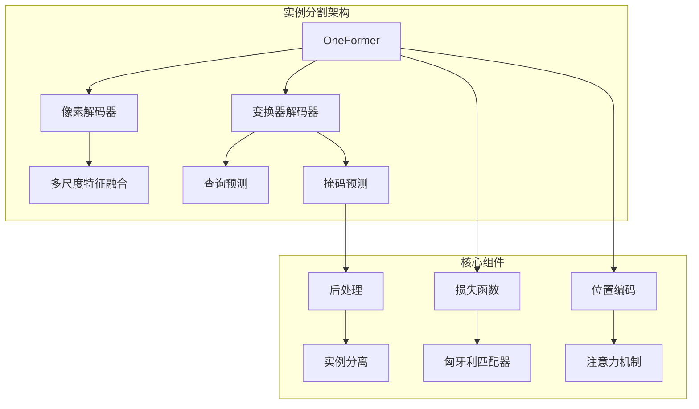
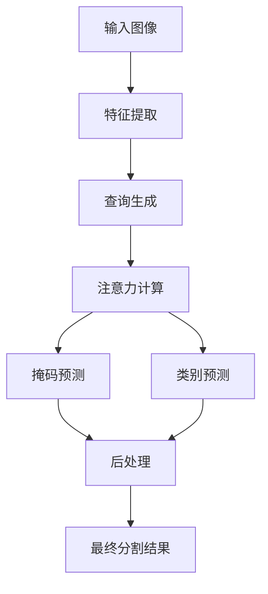
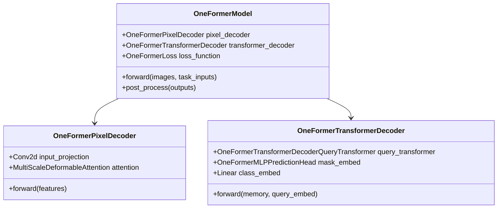
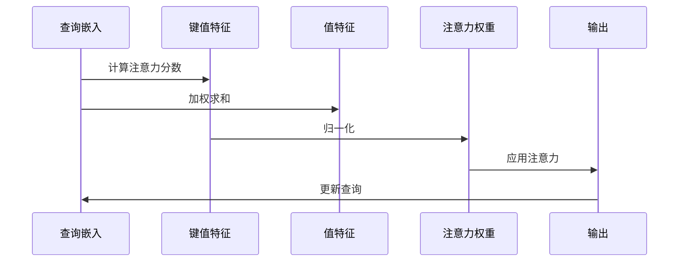
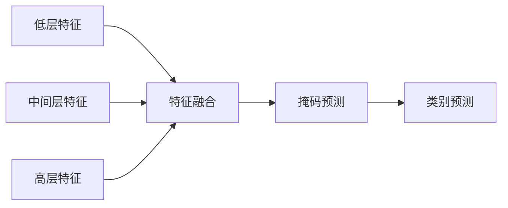
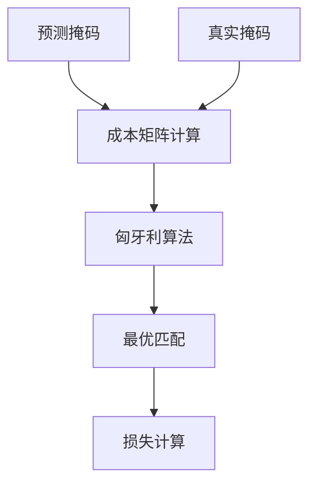
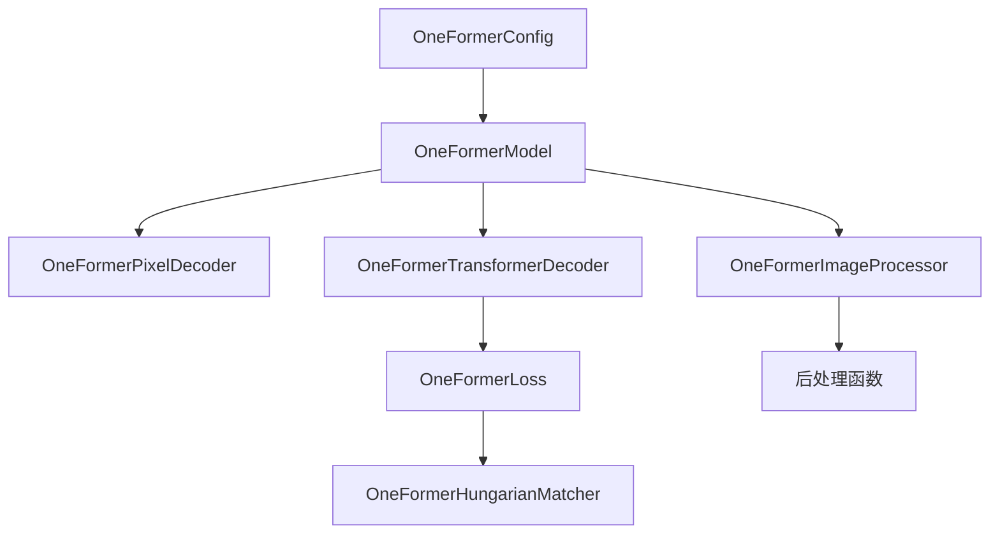

# 实例分割最佳实践

<cite>
**本文档中引用的文件**
- [modeling_oneformer.py](file://src/transformers/models/oneformer/modeling_oneformer.py)
- [modeling_maskformer.py](file://src/transformers/models/maskformer/modeling_maskformer.py)
- [run_instance_segmentation.py](file://examples/pytorch/instance-segmentation/run_instance_segmentation.py)
- [configuration_oneformer.py](file://src/transformers/models/oneformer/configuration_oneformer.py)
- [image_processing_oneformer.py](file://src/transformers/models/oneformer/image_processing_oneformer.py)
- [image_processing_maskformer.py](file://src/transformers/models/maskformer/image_processing_maskformer.py)
</cite>

## 目录
1. [简介](#简介)
2. [项目结构](#项目结构)
3. [核心组件](#核心组件)
4. [架构概览](#架构概览)
5. [详细组件分析](#详细组件分析)
6. [依赖关系分析](#依赖关系分析)
7. [性能考虑](#性能考虑)
8. [故障排除指南](#故障排除指南)
9. [结论](#结论)

## 简介

实例分割是计算机视觉中的一个重要任务，它结合了目标检测和语义分割的特点，能够识别图像中每个对象的精确边界并为其分配类别标签。本文档深入探讨了基于MaskFormer和OneFormer等现代架构的实例分割最佳实践，重点关注任务分解、查询设计、掩码预测机制以及性能优化策略。

这些先进的架构通过将实例分割视为掩码分类问题，采用可学习的查询机制来预测每个实例的掩码和类别，从而实现了卓越的性能。本文档提供了从初学者到专家的全面指导，包括理论基础、实现细节和实际应用建议。

## 项目结构

Transformers库中的实例分割实现主要集中在以下几个关键模块：

**图表来源**
- [modeling_oneformer.py](file://src/transformers/models/oneformer/modeling_oneformer.py#L1-L100)
- [modeling_maskformer.py](file://src/transformers/models/maskformer/modeling_maskformer.py#L1-L100)

**章节来源**
- [modeling_oneformer.py](file://src/transformers/models/oneformer/modeling_oneformer.py#L1-L200)
- [modeling_maskformer.py](file://src/transformers/models/maskformer/modeling_maskformer.py#L1-L200)

## 核心组件

### 任务分解：掩码分类视角

实例分割的核心思想是将每个实例视为一个独立的掩码分类问题。这种分解方式允许模型通过可学习的查询来预测每个实例的掩码和类别：

**图表来源**
- [modeling_oneformer.py](file://src/transformers/models/oneformer/modeling_oneformer.py#L2161-L2198)

### 查询设计与初始化

查询的设计是实例分割架构的关键。OneFormer采用了基于嵌入的查询设计：

- **查询嵌入**：使用可学习的嵌入向量表示每个查询
- **位置编码**：通过正弦位置编码提供空间信息
- **任务令牌**：用于条件化查询以适应特定任务

**章节来源**
- [modeling_oneformer.py](file://src/transformers/models/oneformer/modeling_oneformer.py#L2295-L2323)
- [configuration_oneformer.py](file://src/transformers/models/oneformer/configuration_oneformer.py#L80-L120)

## 架构概览

### OneFormer架构

OneFormer采用统一的框架处理多种分割任务，其核心架构包括：

**图表来源**
- [modeling_oneformer.py](file://src/transformers/models/oneformer/modeling_oneformer.py#L1250-L1359)
- [modeling_oneformer.py](file://src/transformers/models/oneformer/modeling_oneformer.py#L2161-L2198)

### 注意力机制与位置编码

注意力机制在实例分割中发挥着关键作用，特别是在处理重叠实例时：

**图表来源**
- [modeling_oneformer.py](file://src/transformers/models/oneformer/modeling_oneformer.py#L2372-L2403)

**章节来源**
- [modeling_oneformer.py](file://src/transformers/models/oneformer/modeling_oneformer.py#L2350-L2372)

## 详细组件分析

### 掩码预测机制

掩码预测是实例分割的核心，涉及复杂的多尺度特征融合和预测头设计：

#### 多尺度特征处理

**图表来源**
- [modeling_oneformer.py](file://src/transformers/models/oneformer/modeling_oneformer.py#L1250-L1284)

#### 损失函数设计

OneFormer使用组合损失函数来优化掩码和类别预测：

| 损失类型 | 权重 | 用途 |
|---------|------|------|
| 分类损失 | 2.0 | 类别预测准确性 |
| 掩码损失 | 5.0 | 掩码二元交叉熵 |
| Dice损失 | 5.0 | 掩码重叠度量 |
| 对比损失 | 0.5 | 文本-图像对齐 |

**章节来源**
- [modeling_oneformer.py](file://src/transformers/models/oneformer/modeling_oneformer.py#L300-L400)
- [configuration_oneformer.py](file://src/transformers/models/oneformer/configuration_oneformer.py#L60-L80)

### 匹配器与匈牙利算法

匈牙利匹配器负责将预测与地面真值进行最优匹配：

**图表来源**
- [modeling_oneformer.py](file://src/transformers/models/oneformer/modeling_oneformer.py#L250-L350)

**章节来源**
- [modeling_oneformer.py](file://src/transformers/models/oneformer/modeling_oneformer.py#L250-L400)

### 后处理与实例分离

后处理阶段负责从预测中提取最终的实例分割结果：

#### 实例分离策略

| 方法 | 适用场景 | 优势 | 劣势 |
|------|----------|------|------|
| 阈值过滤 | 轻度重叠 | 简单高效 | 可能误分 |
| NMS | 中度重叠 | 平衡性能 | 参数敏感 |
| 连接组件 | 大量重叠 | 最高精度 | 计算复杂 |

**章节来源**
- [image_processing_oneformer.py](file://src/transformers/models/oneformer/image_processing_oneformer.py#L262-L298)
- [image_processing_maskformer.py](file://src/transformers/models/maskformer/image_processing_maskformer.py#L975-L1013)

## 依赖关系分析

### 模块间依赖

**图表来源**
- [modeling_oneformer.py](file://src/transformers/models/oneformer/modeling_oneformer.py#L1-L50)
- [configuration_oneformer.py](file://src/transformers/models/oneformer/configuration_oneformer.py#L1-L50)

**章节来源**
- [modeling_oneformer.py](file://src/transformers/models/oneformer/modeling_oneformer.py#L1-L100)
- [configuration_oneformer.py](file://src/transformers/models/oneformer/configuration_oneformer.py#L1-L100)

## 性能考虑

### 查询初始化策略

有效的查询初始化对于训练稳定性和最终性能至关重要：

1. **随机初始化**：使用正态分布或Xavier初始化
2. **预训练权重**：利用迁移学习的预训练权重
3. **任务特定初始化**：根据具体任务调整初始查询

### 掩码质量评估

掩码质量直接影响实例分割性能，需要综合考虑以下指标：

- **IoU（交并比）**：衡量预测与真实掩码的重叠程度
- **Dice系数**：另一种常用的重叠度量指标
- **边界精度**：评估掩码边界的准确性

### 训练优化技巧

1. **渐进式训练**：从简单任务开始逐步增加难度
2. **数据增强**：使用多样化的数据增强策略
3. **学习率调度**：采用合适的LR调度策略
4. **梯度裁剪**：防止梯度爆炸问题

## 故障排除指南

### 常见问题及解决方案

#### 实例分离困难

**症状**：重叠实例无法正确分离
**原因**：
- 查询数量不足
- 注意力机制不够强
- 后处理阈值不当

**解决方案**：
1. 增加查询数量（默认150）
2. 调整注意力权重
3. 优化后处理参数

#### 遮挡处理问题

**症状**：部分遮挡的实例分割不准确
**原因**：
- 特征提取能力不足
- 多尺度特征融合不充分
- 上下文信息缺失

**解决方案**：
1. 使用更深的骨干网络
2. 增强特征融合策略
3. 引入上下文建模

#### 训练不稳定

**症状**：训练过程中损失震荡或发散
**原因**：
- 学习率过高
- 批次大小不合适
- 数据预处理问题

**解决方案**：
1. 降低学习率
2. 调整批次大小
3. 检查数据预处理流程

**章节来源**
- [run_instance_segmentation.py](file://examples/pytorch/instance-segmentation/run_instance_segmentation.py#L200-L300)

## 结论

实例分割作为计算机视觉的重要任务，其技术发展经历了从传统方法到深度学习的转变。基于MaskFormer和OneFormer等现代架构的方法，通过将实例分割视为掩码分类问题，采用可学习的查询机制，实现了显著的性能提升。

这些架构的核心优势包括：

1. **统一框架**：能够处理多种分割任务
2. **端到端训练**：简化了训练流程
3. **可扩展性**：易于适应不同的下游任务
4. **高性能**：在多个基准数据集上取得了最先进的结果

对于实践者而言，理解这些架构的设计原理、掌握关键的配置参数、以及熟练运用各种优化技巧，是成功实施实例分割项目的基石。随着技术的不断发展，我们期待看到更多创新的架构和方法出现，进一步推动实例分割技术的发展。