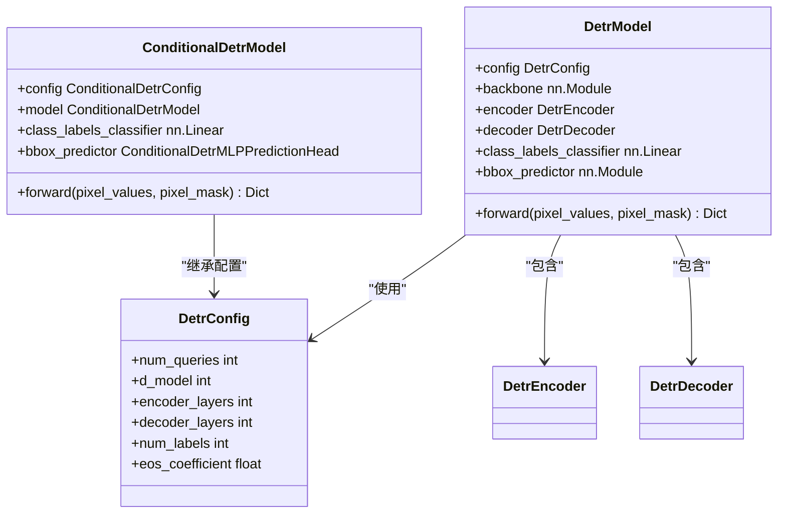
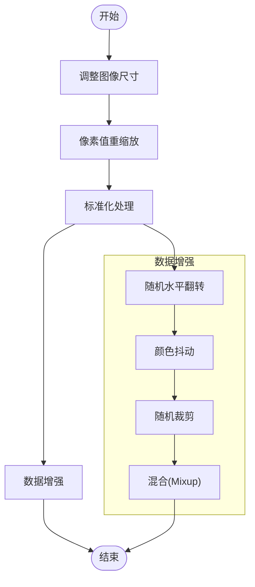
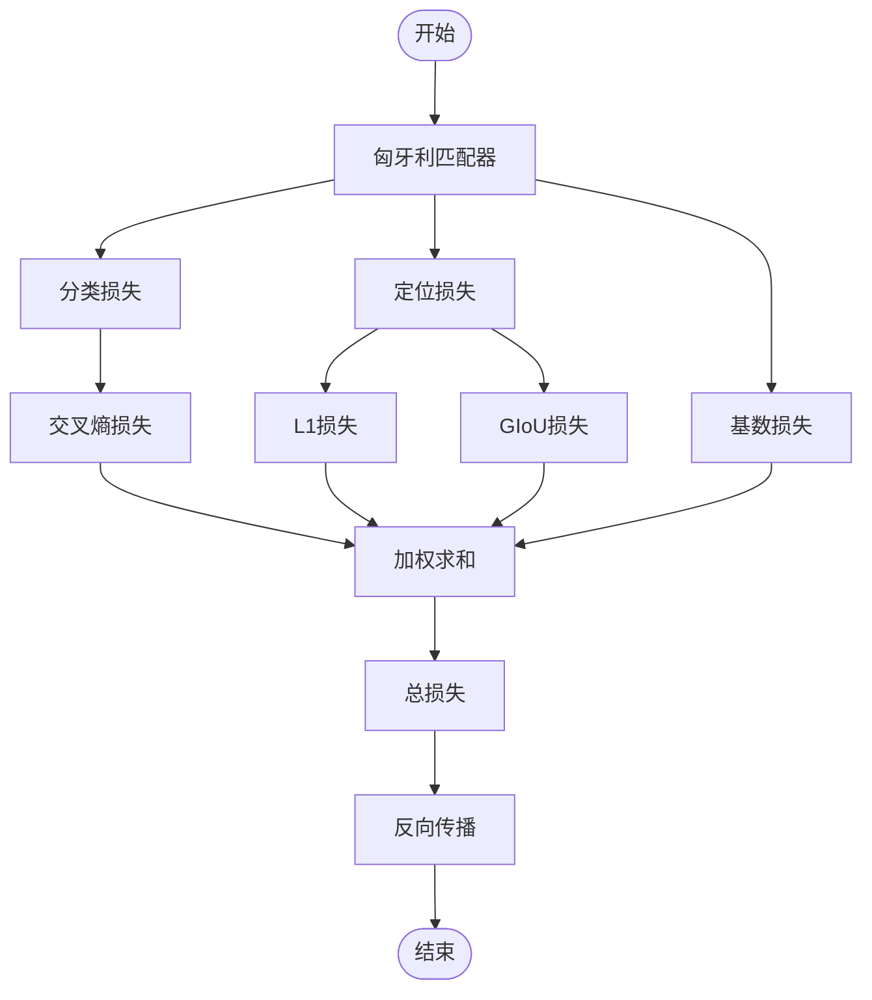
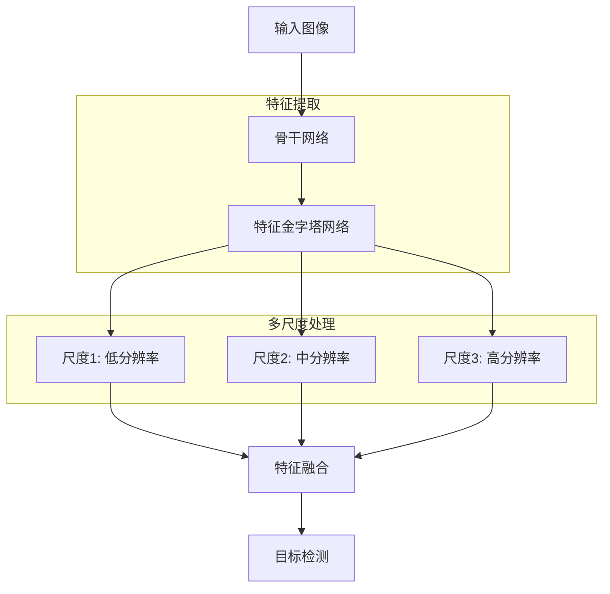
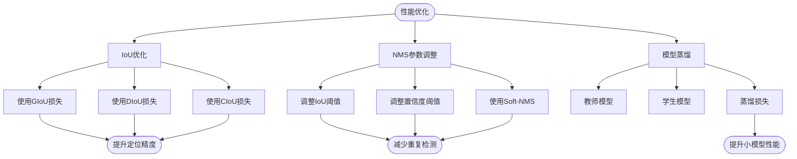
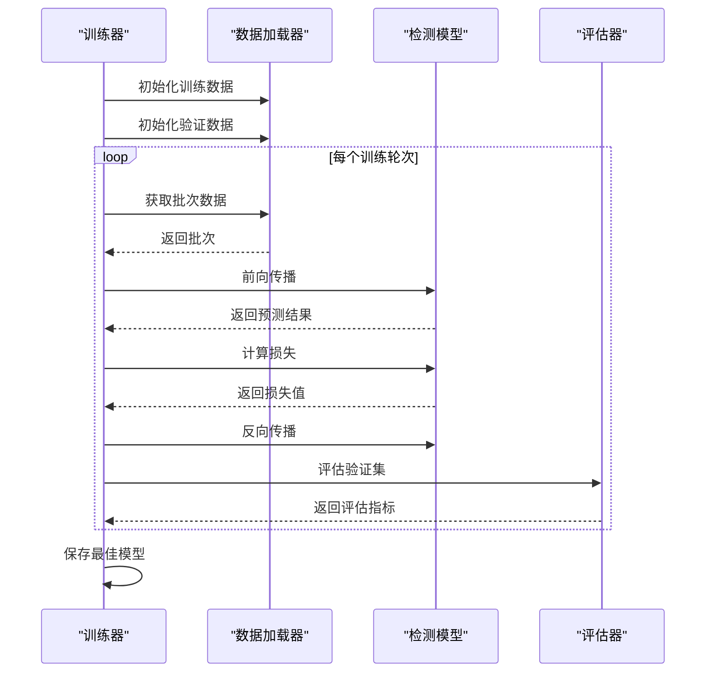

# 目标检测最佳实践

<cite>
**本文档中引用的文件**  
- [modeling_detr.py](file://src/transformers/models/detr/modeling_detr.py)
- [modeling_conditional_detr.py](file://src/transformers/models/conditional_detr/modeling_conditional_detr.py)
- [loss_for_object_detection.py](file://src/transformers/loss/loss_for_object_detection.py)
- [configuration_detr.py](file://src/transformers/models/detr/configuration_detr.py)
- [image_processing_detr.py](file://src/transformers/models/detr/image_processing_detr.py)
- [object_detection.py](file://src/transformers/pipelines/object_detection.py)
- [trainer.py](file://src/transformers/trainer.py)
- [run_object_detection_no_trainer.py](file://examples/pytorch/object-detection/run_object_detection_no_trainer.py)
</cite>

## 目录
1. [引言](#引言)
2. [核心架构分析](#核心架构分析)
3. [预处理与数据增强](#预处理与数据增强)
4. [模型配置与超参数](#模型配置与超参数)
5. [损失函数与优化策略](#损失函数与优化策略)
6. [多尺度目标检测](#多尺度目标检测)
7. [性能优化技巧](#性能优化技巧)
8. [常见问题解决方案](#常见问题解决方案)
9. [训练与评估实践](#训练与评估实践)
10. [总结与建议](#总结与建议)

## 引言
目标检测是计算机视觉领域的核心任务之一，旨在识别图像中所有感兴趣的对象并确定其位置。近年来，基于Transformer的架构如DETR（Detection Transformer）和Conditional DETR等方法在目标检测领域取得了显著进展，通过端到端的方式简化了传统检测流程。本文档旨在为不同经验水平的用户提供目标检测任务的最佳实践指南，重点介绍基于DETR及其变体的推荐方法。

**Section sources**
- [modeling_detr.py](file://src/transformers/models/detr/modeling_detr.py#L1-L50)
- [modeling_conditional_detr.py](file://src/transformers/models/conditional_detr/modeling_conditional_detr.py#L1-L50)

## 核心架构分析
DETR和Conditional DETR等架构采用基于Transformer的编码器-解码器结构，将目标检测任务转化为集合预测问题。模型通过编码器提取图像特征，然后利用解码器生成固定数量的预测结果，每个预测包含类别标签和边界框坐标。

**Diagram sources**
- [modeling_detr.py](file://src/transformers/models/detr/modeling_detr.py#L100-L200)
- [modeling_conditional_detr.py](file://src/transformers/models/conditional_detr/modeling_conditional_detr.py#L1500-L1516)
- [configuration_detr.py](file://src/transformers/models/detr/configuration_detr.py#L50-L100)

## 预处理与数据增强
目标检测任务的预处理流程包括图像标准化、尺寸调整和数据增强等步骤。这些操作对于提高模型的泛化能力和检测精度至关重要。

**Diagram sources**
- [image_processing_detr.py](file://src/transformers/models/detr/image_processing_detr.py#L1392-L1421)
- [image_processing_conditional_detr.py](file://src/transformers/models/conditional_detr/image_processing_conditional_detr.py#L1412-L1441)

## 模型配置与超参数
合理的模型配置和超参数设置是实现高性能目标检测的关键。以下表格总结了DETR架构中的核心配置参数：

| 参数名称 | 描述 | 推荐值 | 说明 |
|--------|------|--------|------|
| num_queries | 查询数量 | 100 | 决定模型能检测的最大对象数 |
| d_model | 模型维度 | 256 | 影响模型容量和计算复杂度 |
| encoder_layers | 编码器层数 | 6 | 控制特征提取深度 |
| decoder_layers | 解码器层数 | 6 | 影响预测生成过程 |
| num_labels | 标签数量 | 91 | COCO数据集类别数+1 |
| eos_coefficient | 无对象类别权重 | 0.1 | 平衡正负样本 |
| class_cost | 分类成本权重 | 1 | 匈牙利匹配成本 |
| bbox_cost | 边界框成本权重 | 5 | 匈牙利匹配成本 |
| giou_cost | GIoU成本权重 | 2 | 匈牙利匹配成本 |

**Section sources**
- [configuration_detr.py](file://src/transformers/models/detr/configuration_detr.py#L50-L200)

## 损失函数与优化策略
目标检测任务采用复合损失函数，结合分类损失和定位损失。DETR使用匈牙利匹配算法将预测与真实标签进行最优配对，然后计算相应的损失。

**Diagram sources**
- [loss_for_object_detection.py](file://src/transformers/loss/loss_for_object_detection.py#L81-L96)
- [modeling_detr.py](file://src/transformers/models/detr/modeling_detr.py#L1500-L1516)

## 多尺度目标检测
处理不同尺度的目标是目标检测中的重要挑战。DETR架构通过特征金字塔网络和多尺度训练策略来应对这一问题。

**Diagram sources**
- [modeling_detr.py](file://src/transformers/models/detr/modeling_detr.py#L1764-L1774)
- [modeling_conditional_detr.py](file://src/transformers/models/conditional_detr/modeling_conditional_detr.py#L1796-L1822)

## 性能优化技巧
为了提高目标检测模型的性能，可以采用多种优化技巧，包括IoU优化、NMS参数调整和模型蒸馏等方法。

**Section sources**
- [loss_for_object_detection.py](file://src/transformers/loss/loss_for_object_detection.py#L225-L254)
- [object_detection.py](file://src/transformers/pipelines/object_detection.py#L150-L180)

## 常见问题解决方案
目标检测任务中常见的问题包括小目标检测困难和类别不平衡问题。以下提供相应的解决方案。

### 小目标检测困难
小目标检测困难的主要原因是小目标在特征图上的表示较弱。解决方案包括：
- 使用更高分辨率的输入图像
- 增强特征金字塔网络的低层特征
- 采用专门针对小目标的数据增强策略
- 调整损失函数权重，增加小目标的权重

### 类别不平衡问题
类别不平衡问题会导致模型偏向于多数类。解决方案包括：
- 使用Focal Loss来平衡难易样本
- 调整类别权重
- 采用过采样或欠采样技术
- 使用分层抽样策略

**Section sources**
- [loss_for_object_detection.py](file://src/transformers/loss/loss_for_object_detection.py#L0-L50)
- [modeling_detr.py](file://src/transformers/models/detr/modeling_detr.py#L200-L250)

## 训练与评估实践
有效的训练和评估实践对于构建高性能目标检测系统至关重要。以下是一些关键的实践建议。

**Diagram sources**
- [trainer.py](file://src/transformers/trainer.py#L1000-L1100)
- [run_object_detection_no_trainer.py](file://examples/pytorch/object-detection/run_object_detection_no_trainer.py#L593-L615)

## 总结与建议
基于DETR和Conditional DETR等Transformer架构的目标检测方法为端到端检测提供了新的范式。通过合理的配置和优化，这些模型能够在各种场景下实现优异的检测性能。对于初学者，建议从预训练模型开始，逐步调整超参数；对于高级用户，可以探索自定义架构和损失函数以满足特定需求。