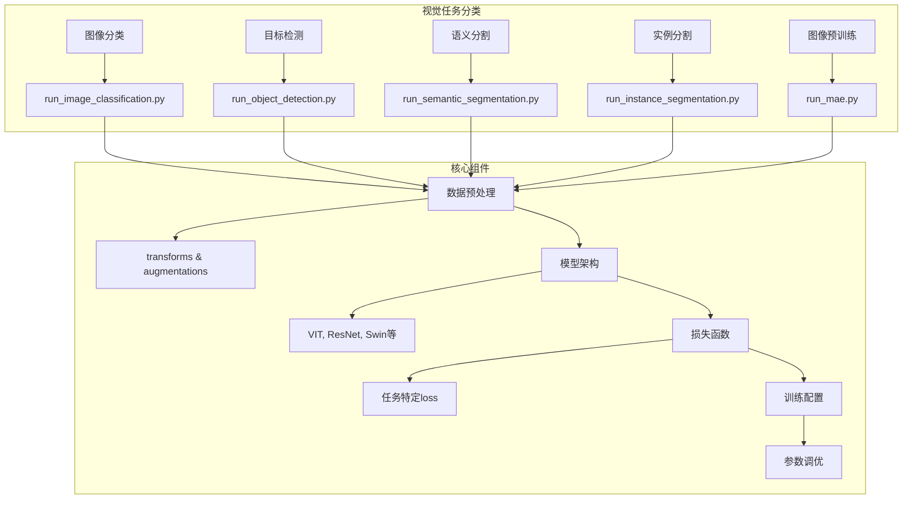
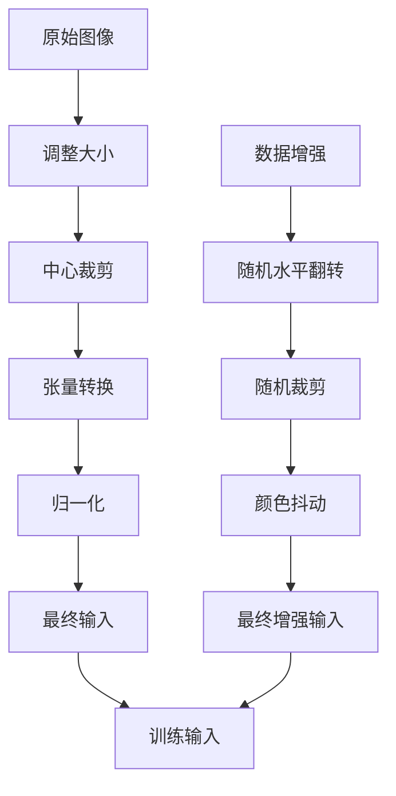
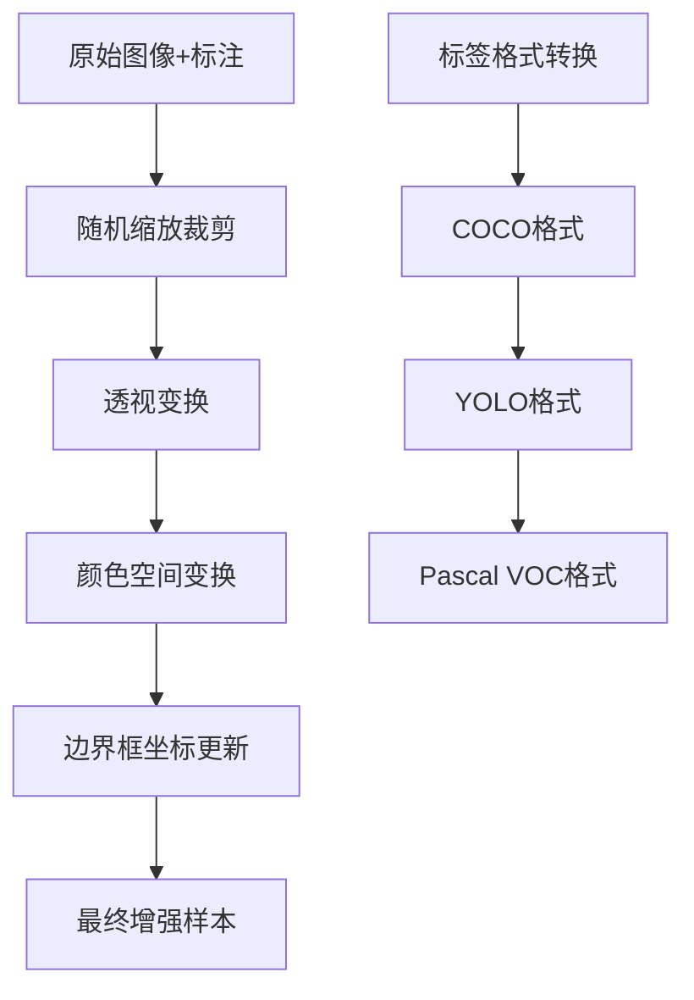
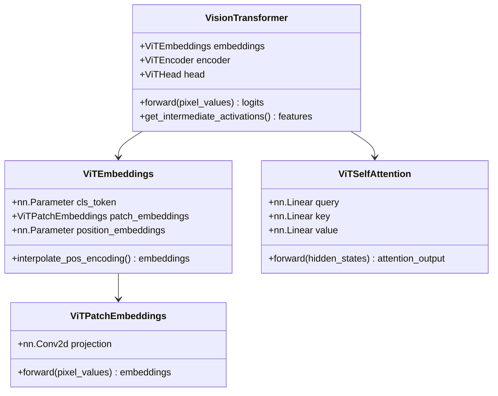
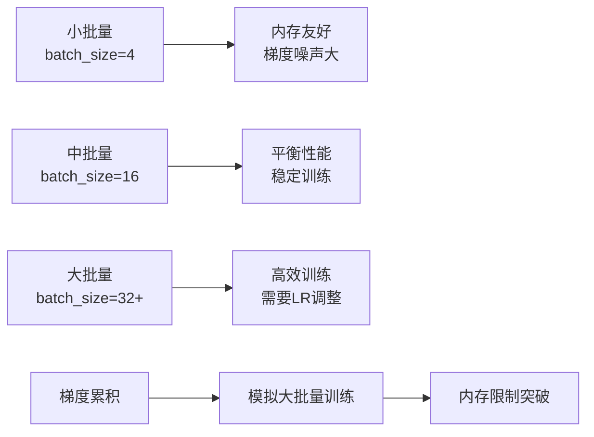
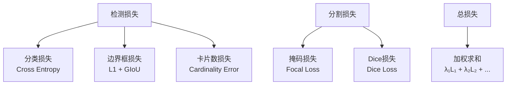
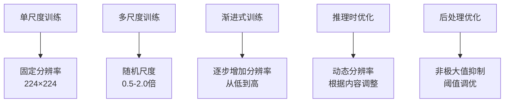
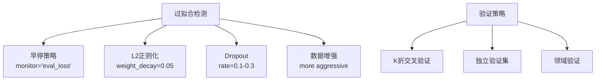
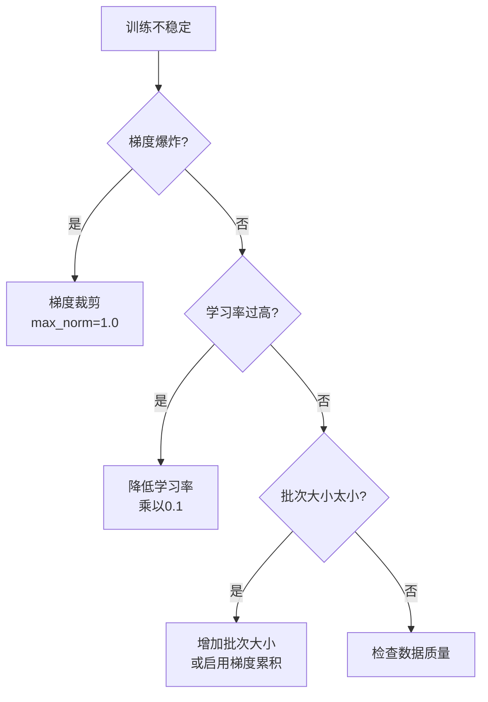

# 计算机视觉任务最佳实践

<cite>
**本文档中引用的文件**
- [run_image_classification.py](file://examples/pytorch/image-classification/run_image_classification.py)
- [run_object_detection.py](file://examples/pytorch/object-detection/run_object_detection.py)
- [run_semantic_segmentation.py](file://examples/pytorch/semantic-segmentation/run_semantic_segmentation.py)
- [run_instance_segmentation.py](file://examples/pytorch/instance-segmentation/run_instance_segmentation.py)
- [run_mae.py](file://examples/pytorch/image-pretraining/run_mae.py)
- [loss_for_object_detection.py](file://src/transformers/loss/loss_for_object_detection.py)
- [loss_utils.py](file://src/transformers/loss/loss_utils.py)
- [modeling_vit.py](file://src/transformers/models/vit/modeling_vit.py)
- [modeling_resnet.py](file://src/transformers/models/resnet/modeling_resnet.py)
- [README.md](file://examples/pytorch/image-classification/README.md)
- [README.md](file://examples/pytorch/object-detection/README.md)
- [README.md](file://examples/pytorch/semantic-segmentation/README.md)
- [README.md](file://examples/pytorch/instance-segmentation/README.md)
</cite>

## 目录
1. [简介](#简介)
2. [项目结构概览](#项目结构概览)
3. [核心视觉任务类型](#核心视觉任务类型)
4. [图像预处理与数据增强](#图像预处理与数据增强)
5. [模型架构选择](#模型架构选择)
6. [训练配置与优化](#训练配置与优化)
7. [损失函数设计](#损失函数设计)
8. [性能优化策略](#性能优化策略)
9. [常见问题解决方案](#常见问题解决方案)
10. [最佳实践总结](#最佳实践总结)

## 简介

本文档基于Hugging Face Transformers库中的计算机视觉任务示例，提供了全面的视觉任务最佳实践指南。涵盖了图像分类、目标检测、语义分割和实例分割等核心任务，以及相应的预处理、训练配置和优化策略。

## 项目结构概览

计算机视觉任务在examples/pytorch目录下按任务类型组织：

**图表来源**
- [run_image_classification.py](file://examples/pytorch/image-classification/run_image_classification.py#L1-L50)
- [run_object_detection.py](file://examples/pytorch/object-detection/run_object_detection.py#L1-L50)

## 核心视觉任务类型

### 图像分类

图像分类是计算机视觉的基础任务，旨在识别图像中的主要对象或场景。

**关键特性：**
- 单标签或多标签分类
- 全局特征提取
- 基于Transformer的架构（如ViT）

**推荐模型架构：**
- ViT (Vision Transformer)
- ConvNeXT
- ResNet系列
- Swin Transformer

**训练配置要点：**
- 学习率通常设置为2e-5
- 批量大小建议8-32
- 使用余弦退火学习率调度器

### 目标检测

目标检测不仅识别图像中的对象，还定位其位置。

**关键特性：**
- 边界框回归
- 多尺度特征融合
- 基于Transformer的检测器（如DETR）

**推荐模型架构：**
- DETR (DEtection TRansformer)
- Deformable DETR
- Conditional DETR
- RT-DETR

**锚框设计考虑：**
- 预定义锚框尺寸
- 多尺度锚框策略
- 动态锚框生成

### 语义分割

语义分割为图像中的每个像素分配类别标签。

**关键特性：**
- 像素级预测
- 上采样操作
- 注意力机制

**推荐模型架构：**
- SegFormer
- BEiT
- UPerNet
- DPT

**损失函数选择：**
- 交叉熵损失
- 加权交叉熵
- Dice损失

### 实例分割

实例分割结合了目标检测和语义分割，区分同一类别的不同实例。

**关键特性：**
- 实例级别的掩码生成
- 掩码解码器
- 多任务学习

**推荐模型架构：**
- Mask2Former
- MaskFormer
- Mask R-CNN

**Section sources**
- [run_object_detection.py](file://examples/pytorch/object-detection/run_object_detection.py#L1-L100)
- [run_semantic_segmentation.py](file://examples/pytorch/semantic-segmentation/run_semantic_segmentation.py#L1-L100)
- [run_instance_segmentation.py](file://examples/pytorch/instance-segmentation/run_instance_segmentation.py#L1-L100)

## 图像预处理与数据增强

### 图像分类预处理

图像分类任务的标准预处理流程：

**图表来源**
- [run_image_classification.py](file://examples/pytorch/image-classification/run_image_classification.py#L300-L350)

**关键预处理步骤：**

1. **尺寸标准化**：统一图像尺寸，通常使用短边或固定尺寸
2. **归一化**：使用ImageNet统计值进行标准化
3. **数据增强**：随机翻转、裁剪、颜色变换

### 目标检测数据增强

目标检测需要特殊的增强策略：

**图表来源**
- [run_object_detection.py](file://examples/pytorch/object-detection/run_object_detection.py#L200-L250)

**增强策略：**
- Albumentations库的强大功能
- 边界框坐标同步变换
- 支持多种标注格式

### 分割任务预处理

分割任务需要保持像素级对应关系：

**语义分割预处理：**
- 统一图像尺寸
- 对应的标签映射
- 可选的标签减少（背景标记为255）

**实例分割预处理：**
- 三通道标注格式
- 语义分割图 + 实例分割图
- 实例ID到语义ID映射

**Section sources**
- [run_image_classification.py](file://examples/pytorch/image-classification/run_image_classification.py#L300-L400)
- [run_object_detection.py](file://examples/pytorch/object-detection/run_object_detection.py#L200-L300)
- [run_semantic_segmentation.py](file://examples/pytorch/semantic-segmentation/run_semantic_segmentation.py#L250-L350)

## 模型架构选择

### Transformer架构

现代视觉任务主要采用Transformer架构：

**图表来源**
- [modeling_vit.py](file://src/transformers/models/vit/modeling_vit.py#L40-L100)

**ViT核心特性：**
- 补丁嵌入（Patch Embedding）
- 位置编码插值
- 多头自注意力机制

### CNN架构

传统CNN架构在某些任务中仍具优势：

**ResNet特性：**
- 残差连接
- 深度网络稳定性
- 特征金字塔

**Swin Transformer特性：**
- 层次化架构
- 移动窗口注意力
- 多尺度特征

### 混合架构

结合CNN和Transformer的优势：

**特征融合策略：**
- 自底向上路径
- 自顶向下路径
- 融合层设计

**Section sources**
- [modeling_vit.py](file://src/transformers/models/vit/modeling_vit.py#L1-L200)
- [modeling_resnet.py](file://src/transformers/models/resnet/modeling_resnet.py#L385-L420)

## 训练配置与优化

### 学习率调度

不同任务的学习率策略：

| 任务类型 | 建议学习率 | 调度器 | 批量大小 |
|---------|-----------|--------|----------|
| 图像分类 | 2e-5 | Cosine Annealing | 8-32 |
| 目标检测 | 5e-5 | MultiStep | 8-16 |
| 语义分割 | 6e-5 | Polynomial | 8-16 |
| 实例分割 | 1e-5 | Constant | 4-8 |

### 批量大小优化

### 优化器选择

**AdamW优化器配置：**
- 权重衰减：0.05
- 小学习率：避免梯度爆炸
- 适当的beta值

**分布式训练配置：**
- 数据并行
- 梯度同步
- 内存优化

### 预训练策略

**MAE预训练示例：**
- 掩码比例：0.75
- 归一化像素损失
- 渐进式训练

**Section sources**
- [run_mae.py](file://examples/pytorch/image-pretraining/run_mae.py#L200-L300)

## 损失函数设计

### 目标检测损失函数

目标检测任务采用多任务损失组合：

**图表来源**
- [loss_for_object_detection.py](file://src/transformers/loss/loss_for_object_detection.py#L100-L200)

**损失函数详解：**

1. **分类损失（Cross Entropy）**：
   - 标准交叉熵
   - 空类别权重调整

2. **边界框损失（L1 + GIoU）**：
   - L1损失：平滑L1回归
   - GIoU损失：边界框重叠度

3. **掩码损失（Focal + Dice）**：
   - Focal损失：难易样本平衡
   - Dice损失：重叠度度量

### 语义分割损失函数

**标准损失组合：**
- 主要损失：交叉熵
- 辅助损失：可选的辅助头部
- 加权策略：类别不平衡处理

### 实例分割损失函数

**混合损失策略：**
- 掩码损失：Focal + Dice
- 类别损失：交叉熵
- 边界框损失：可选

**Section sources**
- [loss_for_object_detection.py](file://src/transformers/loss/loss_for_object_detection.py#L1-L100)
- [loss_utils.py](file://src/transformers/loss/loss_utils.py#L1-L50)

## 性能优化策略

### 分辨率管理

**多尺度训练策略：**

**分辨率选择原则：**
- 图像分类：224×224到384×384
- 目标检测：600×600到800×800
- 分割任务：512×512到1024×1024

### 批处理策略

**动态批处理：**
- 变长序列处理
- 填充策略优化
- 内存使用监控

**梯度累积：**
- 大批量模拟
- 内存效率提升
- 训练稳定性

### 分布式训练配置

**训练环境配置：**

| 参数 | 单GPU | 多GPU | TPU |
|------|-------|-------|-----|
| batch_size | 8 | 32 | 64 |
| gradient_accumulation_steps | 1 | 4 | 1 |
| num_processes | 1 | 4 | 8 |
| communication_backend | nccl | nccl | xla |

**通信优化：**
- 梯度压缩
- 异步通信
- 网络拓扑感知

### 内存优化

**模型优化技术：**
- 激活检查点
- 混合精度训练
- 动态图优化

**数据加载优化：**
- 预取策略
- 缓存机制
- 并行数据增强

## 常见问题解决方案

### 过拟合处理

**正则化策略：**

**具体措施：**
- 学习率衰减
- 正则化系数调整
- 数据增强强度增加

### 类别不平衡问题

**解决方案：**

1. **重采样策略**：
   - 上采样少数类
   - 下采样多数类
   - 混合采样

2. **损失函数调整**：
   - 类别权重平衡
   - Focal Loss
   - 渐进式平衡

3. **评估指标优化**：
   - mAP（平均精度）
   - IoU（交并比）
   - 平衡准确率

### 训练不稳定

**诊断与解决：**

**调试技巧：**
- 梯度监控
- 学习率调整
- 数据质量检查

### 推理速度优化

**优化策略：**

1. **模型压缩**：
   - 量化（INT8/FP16）
   - 剪枝
   - 知识蒸馏

2. **推理加速**：
   - 批处理推理
   - 模型并行
   - 硬件优化

3. **缓存策略**：
   - 特征缓存
   - 结果缓存
   - 预计算优化

## 最佳实践总结

### 初学者建议

**入门路径：**
1. 从图像分类开始
2. 使用预训练模型
3. 逐步增加复杂度
4. 关注数据质量

**推荐配置：**
- 学习率：2e-5（分类）、5e-5（检测）
- 批量大小：8-16
- 训练轮数：100-500
- 数据增强：适度使用

### 中级用户建议

**进阶策略：**
1. 尝试不同的模型架构
2. 优化超参数
3. 实现自定义损失函数
4. 分布式训练

**性能优化：**
- 混合精度训练
- 动态批处理
- 梯度累积
- 内存优化

### 高级用户建议

**专家级技巧：**
1. 自定义模型架构
2. 复杂损失函数设计
3. 分布式训练优化
4. 生产环境部署

**创新方向：**
- 新颖的数据增强
- 创新的损失函数
- 高效的推理方案
- 多模态融合

### 通用最佳实践

**开发流程：**
1. 数据探索与预处理
2. 基线模型建立
3. 超参数调优
4. 模型验证与测试
5. 部署与监控

**质量保证：**
- 代码版本控制
- 实验记录
- 结果复现
- 文档维护

**性能监控：**
- 训练指标跟踪
- 推理性能监控
- 资源使用优化
- 错误分析

通过遵循这些最佳实践，开发者可以更有效地构建和优化计算机视觉系统，在各种视觉任务中取得更好的性能和稳定性。