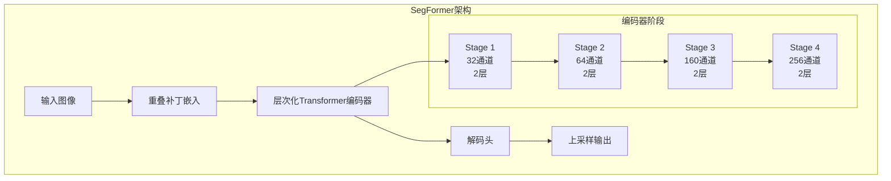
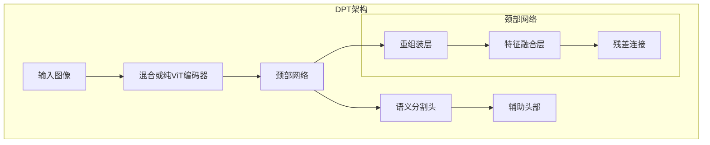
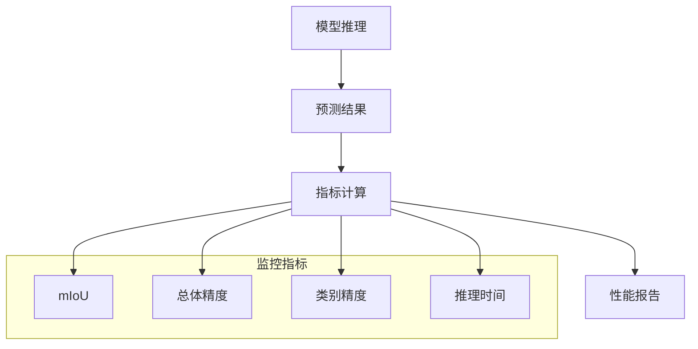

# 语义分割最佳实践

<cite>
**本文档中引用的文件**
- [modeling_dpt.py](file://src/transformers/models/dpt/modeling_dpt.py)
- [modeling_segformer.py](file://src/transformers/models/segformer/modeling_segformer.py)
- [run_semantic_segmentation.py](file://examples/pytorch/semantic-segmentation/run_semantic_segmentation.py)
- [image_segmentation.py](file://src/transformers/pipelines/image_segmentation.py)
- [configuration_dpt.py](file://src/transformers/models/dpt/configuration_dpt.py)
- [configuration_segformer.py](file://src/transformers/models/segformer/configuration_segformer.py)
- [modeling_maskformer.py](file://src/transformers/models/maskformer/modeling_maskformer.py)
- [loss_for_object_detection.py](file://src/transformers/loss/loss_for_object_detection.py)
</cite>

## 目录
1. [简介](#简介)
2. [核心架构概述](#核心架构概述)
3. [数据预处理最佳实践](#数据预处理最佳实践)
4. [损失函数选择与配置](#损失函数选择与配置)
5. [评估指标与性能监控](#评估指标与性能监控)
6. [类别不平衡处理策略](#类别不平衡处理策略)
7. [性能优化技巧](#性能优化技巧)
8. [常见问题解决方案](#常见问题解决方案)
9. [配置示例与实用建议](#配置示例与实用建议)
10. [总结](#总结)

## 简介

语义分割是计算机视觉领域的重要任务，旨在为图像中的每个像素分配语义标签。本文档基于Transformers库中的SegFormer和DPT等先进架构，提供语义分割任务的最佳实践指南。

语义分割的核心挑战包括：
- 处理复杂的像素级分类任务
- 平衡不同类别的样本分布
- 维护边缘细节和小区域的准确性
- 在保持精度的同时优化推理速度

## 核心架构概述

### SegFormer架构特点

SegFormer采用轻量级的混合架构，结合了CNN和Transformer的优势：



**图表来源**
- [modeling_segformer.py](file://src/transformers/models/segformer/modeling_segformer.py#L300-L400)

### DPT架构特点

DPT（Dense Prediction Transformer）专注于密集预测任务，具有以下特征：



**图表来源**
- [modeling_dpt.py](file://src/transformers/models/dpt/modeling_dpt.py#L700-L800)

**章节来源**
- [modeling_segformer.py](file://src/transformers/models/segformer/modeling_segformer.py#L1-L100)
- [modeling_dpt.py](file://src/transformers/models/dpt/modeling_dpt.py#L1-L100)

## 数据预处理最佳实践

### 图像预处理管道

语义分割的数据预处理需要特别注意以下几点：

#### 1. 尺寸标准化
```python
# 推荐的图像尺寸配置
image_processor = AutoImageProcessor.from_pretrained(
    model_name,
    size={"height": 512, "width": 512},
    do_resize=True,
    do_normalize=True
)
```

#### 2. 标签编码策略

**标准标签编码：**
- 使用整数索引表示类别（0, 1, 2, ..., N-1）
- 背景类通常标记为0
- 忽略索引设置为255

**类别重映射：**
```python
def reduce_labels_transform(labels: np.ndarray, **kwargs) -> np.ndarray:
    """将背景标签从0变为255，并将其他标签减1"""
    labels[labels == 0] = 255
    labels = labels - 1
    labels[labels == 254] = 255
    return labels
```

#### 3. 数据增强策略

```python
# 训练时增强
train_transforms = A.Compose([
    A.Lambda(name="reduce_labels", mask=reduce_labels_transform, p=1.0),
    A.PadIfNeeded(min_height=height, min_width=width, border_mode=0, value=255, p=1.0),
    A.RandomCrop(height=height, width=width, p=1.0),
    A.HorizontalFlip(p=0.5),
    A.Normalize(mean=image_processor.image_mean, 
                std=image_processor.image_std, 
                max_pixel_value=255.0, p=1.0),
    ToTensorV2(),
])
```

#### 4. 批处理注意事项

- 确保所有图像具有相同的尺寸
- 使用填充处理变长图像
- 设置适当的忽略索引

**章节来源**
- [run_semantic_segmentation.py](file://examples/pytorch/semantic-segmentation/run_semantic_segmentation.py#L300-L350)

## 损失函数选择与配置

### 常用损失函数对比

| 损失函数 | 适用场景 | 优势 | 劣势 |
|---------|---------|------|------|
| 交叉熵损失 | 均衡数据集 | 计算简单，收敛快 | 对类别不平衡敏感 |
| Dice损失 | 小目标检测 | 关注前景区域，对不平衡友好 | 可能导致边界模糊 |
| Focal损失 | 类别不平衡 | 加权困难样本，减少易分样本影响 | 参数调节复杂 |
| 加权交叉熵 | 类别不平衡 | 直接在损失中加入权重 | 需要准确计算类别权重 |

### 具体实现示例

#### 1. 交叉熵损失
```python
# 基础交叉熵损失
loss_fct = CrossEntropyLoss(
    ignore_index=config.semantic_loss_ignore_index
)

# 支持多标签的BCE损失
loss_fct = BCEWithLogitsLoss(reduction="none")
```

#### 2. Dice损失实现
```python
def dice_loss(inputs: Tensor, labels: Tensor, num_masks: int) -> Tensor:
    """计算DICE损失"""
    probs = inputs.sigmoid().flatten(1)
    numerator = 2 * (probs * labels).sum(-1)
    denominator = probs.sum(-1) + labels.sum(-1)
    loss = 1 - (numerator + 1) / (denominator + 1)
    return loss.sum() / num_masks
```

#### 3. Focal损失实现
```python
def sigmoid_focal_loss(inputs: Tensor, labels: Tensor, 
                      alpha: float = 0.25, gamma: float = 2) -> Tensor:
    """计算Focal损失"""
    prob = inputs.sigmoid()
    ce_loss = nn.functional.binary_cross_entropy_with_logits(
        inputs, labels, reduction="none"
    )
    p_t = prob * labels + (1 - prob) * (1 - labels)
    loss = ce_loss * ((1 - p_t) ** gamma)
    
    if alpha >= 0:
        alpha_t = alpha * labels + (1 - alpha) * (1 - labels)
        loss = alpha_t * loss
    
    return loss.mean()
```

### 辅助头部损失

对于DPT等架构，可以使用辅助头部来提高训练稳定性：

```python
# 主损失 + 辅助损失
main_loss = loss_fct(upsampled_logits, labels)
auxiliary_loss = loss_fct(upsampled_auxiliary_logits, labels)
loss = main_loss + config.auxiliary_loss_weight * auxiliary_loss
```

**章节来源**
- [modeling_dpt.py](file://src/transformers/models/dpt/modeling_dpt.py#L1150-L1180)
- [modeling_maskformer.py](file://src/transformers/models/maskformer/modeling_maskformer.py#L250-L350)

## 评估指标与性能监控

### 核心评估指标

#### 1. 平均交并比（mIoU）
```python
# 计算指标的函数
@torch.no_grad()
def compute_metrics(eval_pred):
    logits, labels = eval_pred
    logits_tensor = torch.from_numpy(logits)
    
    # 上采样到原始尺寸并获取预测类别
    logits_tensor = nn.functional.interpolate(
        logits_tensor,
        size=labels.shape[-2:],
        mode="bilinear",
        align_corners=False,
    ).argmax(dim=1)
    
    pred_labels = logits_tensor.detach().cpu().numpy()
    
    # 使用evaluate库计算指标
    metrics = metric.compute(
        predictions=pred_labels,
        references=labels,
        num_labels=len(id2label),
        ignore_index=0,
        reduce_labels=image_processor.do_reduce_labels,
    )
    
    return metrics
```

#### 2. 分类精度指标
- **总体精度（Overall Accuracy）**：正确分类的像素比例
- **交并比（IoU）**：每个类别的平均交并比
- **频率加权交并比（FWIoU）**：考虑类别频率的IoU

#### 3. 性能监控指标
```python
# 添加每个类别的指标
per_category_accuracy = metrics.pop("per_category_accuracy").tolist()
per_category_iou = metrics.pop("per_category_iou").tolist()

metrics.update({
    f"accuracy_{id2label[i]}": v 
    for i, v in enumerate(per_category_accuracy)
})
metrics.update({
    f"iou_{id2label[i]}": v 
    for i, v in enumerate(per_category_iou)
})
```

### 实时性能监控



**章节来源**
- [run_semantic_segmentation.py](file://examples/pytorch/semantic-segmentation/run_semantic_segmentation.py#L255-L290)

## 类别不平衡处理策略

### 1. 加权损失函数

#### 类别权重计算
```python
def calculate_class_weights(labels, num_classes, smooth_factor=1.0):
    """计算类别权重"""
    class_counts = np.bincount(labels.flatten(), minlength=num_classes)
    class_weights = 1.0 / (np.log(smooth_factor + class_counts))
    return torch.tensor(class_weights, dtype=torch.float32)
```

#### 加权交叉熵损失
```python
class_weighted_loss = CrossEntropyLoss(
    weight=class_weights,
    ignore_index=config.semantic_loss_ignore_index
)
```

### 2. Focal损失应用

Focal损失通过降低易分样本的影响来解决类别不平衡问题：

```python
# Focal损失参数
alpha = 0.25  # 正样本权重
gamma = 2.0   # 难度调节参数

# 计算Focal损失
focal_loss = sigmoid_focal_loss(
    inputs=logits,
    labels=targets,
    alpha=alpha,
    gamma=gamma
)
```

### 3. 在线难例挖掘（OHEM）

```python
def online_hard_example_mining(losses, top_k_ratio=0.7):
    """在线难例挖掘"""
    num_pixels = losses.numel()
    num_hard = int(top_k_ratio * num_pixels)
    
    hard_losses, _ = torch.topk(losses.view(-1), num_hard)
    return hard_losses.mean()
```

### 4. 渐进式标签平滑

```python
def progressive_label_smoothing(epoch, max_epochs, initial_smooth=0.1, final_smooth=0.5):
    """渐进式标签平滑"""
    if epoch < max_epochs // 2:
        return initial_smooth
    else:
        return initial_smooth + (final_smooth - initial_smooth) * (epoch - max_epochs//2) / (max_epochs//2)
```

**章节来源**
- [modeling_maskformer.py](file://src/transformers/models/maskformer/modeling_maskformer.py#L280-L350)

## 性能优化技巧

### 1. 多尺度推理

```python
def multi_scale_inference(model, image, scales=[1.0, 0.8, 1.2]):
    """多尺度推理"""
    predictions = []
    
    for scale in scales:
        # 缩放图像
        scaled_image = F.interpolate(
            image, 
            scale_factor=scale, 
            mode='bilinear', 
            align_corners=False
        )
        
        # 推理
        with torch.no_grad():
            output = model(scaled_image)
        
        # 上采样回原尺寸
        prediction = F.interpolate(
            output, 
            size=image.shape[2:], 
            mode='bilinear', 
            align_corners=False
        )
        predictions.append(prediction)
    
    # 平均预测结果
    return torch.mean(torch.stack(predictions), dim=0)
```

### 2. 滑动窗口预测

```python
def sliding_window_prediction(model, image, crop_size=512, stride=256):
    """滑动窗口预测"""
    batch_size, _, h, w = image.shape
    prediction = torch.zeros((batch_size, num_classes, h, w))
    count = torch.zeros((batch_size, 1, h, w))
    
    # 滑动窗口遍历
    for i in range(0, h - crop_size + stride, stride):
        for j in range(0, w - crop_size + stride, stride):
            # 提取窗口
            crop = image[:, :, i:i+crop_size, j:j+crop_size]
            
            # 推理
            with torch.no_grad():
                crop_pred = model(crop)
            
            # 合并预测
            prediction[:, :, i:i+crop_size, j:j+crop_size] += crop_pred
            count[:, :, i:i+crop_size, j:j+crop_size] += 1
    
    # 平均化
    return prediction / count
```

### 3. 结果后处理

#### 边缘平滑
```python
def edge_smoothing(mask, kernel_size=3):
    """边缘平滑处理"""
    kernel = torch.ones(1, 1, kernel_size, kernel_size) / (kernel_size * kernel_size)
    kernel = kernel.to(mask.device)
    
    smoothed = F.conv2d(mask.unsqueeze(1).float(), kernel, padding=kernel_size//2)
    return torch.clamp(smoothed, 0, 1)
```

#### 连通组件分析
```python
def remove_small_components(mask, min_size=100):
    """移除小连通组件"""
    import cv2
    import numpy as np
    
    # 转换为numpy数组
    mask_np = mask.cpu().numpy()
    
    # 查找连通组件
    num_labels, labels, stats, centroids = cv2.connectedComponentsWithStats(
        mask_np.astype(np.uint8), 8, cv2.CV_32S
    )
    
    # 移除小组件
    cleaned_mask = np.zeros_like(mask_np)
    for i in range(1, num_labels):
        if stats[i, cv2.CC_STAT_AREA] >= min_size:
            cleaned_mask[labels == i] = 1
    
    return torch.from_numpy(cleaned_mask).to(mask.device)
```

### 4. 内存优化

```python
def gradient_checkpointing(model):
    """梯度检查点优化内存使用"""
    if hasattr(model, 'gradient_checkpointing'):
        model.gradient_checkpointing_enable()
```

**章节来源**
- [run_semantic_segmentation.py](file://examples/pytorch/semantic-segmentation/run_semantic_segmentation.py#L350-L400)

## 常见问题解决方案

### 1. 边界模糊问题

**原因分析：**
- 模型感受野不足
- 上采样过程中的信息丢失
- 损失函数偏向平滑预测

**解决方案：**

#### a. 使用边界感知损失
```python
def boundary_aware_loss(logits, labels, boundary_weight=1.5):
    """边界感知损失"""
    # 计算边界掩码
    boundary = get_boundary_mask(labels)
    
    # 计算交叉熵损失
    ce_loss = CrossEntropyLoss()(logits, labels)
    
    # 加权边界损失
    weighted_loss = ce_loss + boundary_weight * (ce_loss * boundary).mean()
    
    return weighted_loss
```

#### b. 边界细化网络
```python
class BoundaryRefinementNetwork(nn.Module):
    def __init__(self, in_channels, out_channels):
        super().__init__()
        self.conv1 = nn.Conv2d(in_channels, 64, 3, padding=1)
        self.bn1 = nn.BatchNorm2d(64)
        self.conv2 = nn.Conv2d(64, out_channels, 3, padding=1)
    
    def forward(self, x):
        x = F.relu(self.bn1(self.conv1(x)))
        return self.conv2(x)
```

### 2. 小区域误分类

**解决方案：**

#### a. 多尺度特征融合
```python
def multiscale_feature_fusion(features):
    """多尺度特征融合"""
    # 特征上采样
    f1_up = F.interpolate(features[0], size=features[2].shape[2:], mode='bilinear')
    f2_up = F.interpolate(features[1], size=features[2].shape[2:], mode='bilinear')
    
    # 特征融合
    fused = features[2] + f1_up + f2_up
    
    return fused
```

#### b. 小目标检测模块
```python
class SmallObjectDetector(nn.Module):
    def __init__(self, in_channels):
        super().__init__()
        self.conv = nn.Conv2d(in_channels, in_channels, 1)
        self.sigmoid = nn.Sigmoid()
    
    def forward(self, x):
        # 检测小目标
        small_obj_map = self.sigmoid(self.conv(x))
        return small_obj_map
```

### 3. 类别不平衡导致的性能下降

**解决方案：**

#### a. 动态权重调整
```python
class DynamicWeightScheduler:
    def __init__(self, initial_weight=0.5, max_weight=2.0, schedule_steps=10000):
        self.initial_weight = initial_weight
        self.max_weight = max_weight
        self.schedule_steps = schedule_steps
        self.current_step = 0
    
    def get_weight(self):
        progress = min(self.current_step / self.schedule_steps, 1.0)
        weight = self.initial_weight + progress * (self.max_weight - self.initial_weight)
        self.current_step += 1
        return weight
```

#### b. 自适应阈值调整
```python
def adaptive_threshold_adjustment(confidence_map, target_class):
    """自适应阈值调整"""
    # 计算类别置信度
    class_confidence = confidence_map[target_class]
    
    # 动态阈值
    base_threshold = 0.5
    adjustment = 0.1 * (1.0 - class_confidence.mean())
    
    return base_threshold + adjustment
```

### 4. 训练不稳定

**解决方案：**

#### a. 学习率调度
```python
def cosine_annealing_scheduler(optimizer, epoch, max_epochs):
    """余弦退火学习率调度"""
    lr = 0.5 * optimizer.param_groups[0]['lr'] * (
        1 + math.cos(math.pi * epoch / max_epochs)
    )
    for param_group in optimizer.param_groups:
        param_group['lr'] = lr
```

#### b. 梯度裁剪
```python
def gradient_clipping(optimizer, max_norm=1.0):
    """梯度裁剪"""
    torch.nn.utils.clip_grad_norm_(model.parameters(), max_norm)
```

## 配置示例与实用建议

### 1. 基础配置模板

#### SegFormer配置
```python
# SegFormer-B0配置
segformer_config = SegformerConfig(
    num_channels=3,
    num_encoder_blocks=4,
    depths=[2, 2, 2, 2],
    sr_ratios=[8, 4, 2, 1],
    hidden_sizes=[32, 64, 160, 256],
    patch_sizes=[7, 3, 3, 3],
    strides=[4, 2, 2, 2],
    semantic_loss_ignore_index=255,
    classifier_dropout_prob=0.1,
    drop_path_rate=0.1
)
```

#### DPT配置
```python
# DPT-Large配置
dpt_config = DPTConfig(
    hidden_size=1024,
    num_hidden_layers=24,
    num_attention_heads=16,
    intermediate_size=4096,
    image_size=384,
    patch_size=16,
    semantic_loss_ignore_index=255,
    use_auxiliary_head=True,
    auxiliary_loss_weight=0.4,
    semantic_classifier_dropout=0.1
)
```

### 2. 训练配置建议

#### 学习率策略
```python
# 推荐的学习率配置
learning_rate = 6e-5  # 对于大模型
# learning_rate = 1e-4  # 对于小模型

# 权重衰减
weight_decay = 0.01

# 学习率调度
scheduler = torch.optim.lr_scheduler.CosineAnnealingLR(
    optimizer, T_max=epochs
)
```

#### 批处理大小
```python
# GPU内存较小的情况
batch_size = 4  # 单GPU
# batch_size = 2  # 双GPU

# 梯度累积
accumulation_steps = 4
```

### 3. 不同经验水平的建议

#### 初学者
1. **从预训练模型开始**：使用官方提供的预训练模型进行微调
2. **简化配置**：先使用默认配置，再逐步调整
3. **关注基本指标**：优先保证mIoU和总体精度

#### 中级用户
1. **尝试不同的损失函数组合**：实验交叉熵、Dice和Focal损失的组合
2. **优化数据增强策略**：增加几何变换和颜色变换
3. **监控训练过程**：使用TensorBoard记录指标变化

#### 高级用户
1. **自定义损失函数**：根据具体任务设计专门的损失函数
2. **模型架构优化**：尝试不同的注意力机制和特征融合策略
3. **推理优化**：实现模型量化和剪枝

### 4. 典型配置示例

#### 医学影像分割
```python
medical_config = {
    "image_size": 512,
    "loss_function": "focal_dice",
    "augmentation": {
        "rotation_range": 15,
        "zoom_range": 0.1,
        "horizontal_flip": True
    },
    "optimizer": "adamw",
    "learning_rate": 3e-4
}
```

#### 自动驾驶场景
```python
driving_config = {
    "image_size": 768,
    "focus_classes": ["road", "lane", "vehicle"],
    "loss_weights": {
        "road": 2.0,
        "lane": 3.0,
        "vehicle": 1.5
    },
    "multi_scale_training": True
}
```

**章节来源**
- [configuration_dpt.py](file://src/transformers/models/dpt/configuration_dpt.py#L139-L277)
- [configuration_segformer.py](file://src/transformers/models/segformer/configuration_segformer.py#L50-L147)

## 总结

语义分割是一个复杂而重要的计算机视觉任务，需要综合考虑模型架构、数据处理、损失函数设计和性能优化等多个方面。本文档基于Transformers库中的SegFormer和DPT等先进架构，提供了以下关键指导：

### 核心要点回顾

1. **架构选择**：SegFormer适合轻量化部署，DPT适合高精度要求的任务
2. **数据预处理**：标准化尺寸、合理标签编码、有效的数据增强
3. **损失函数**：根据任务特点选择合适的损失函数组合
4. **类别平衡**：使用加权损失、Focal损失或在线难例挖掘
5. **性能优化**：多尺度推理、滑动窗口、结果后处理
6. **问题解决**：针对性地处理边界模糊、小区域误分类等问题

### 最佳实践总结

- **从小规模开始**：先验证基本流程，再逐步优化
- **监控关键指标**：重点关注mIoU和类别精度
- **迭代改进**：根据实验结果不断调整配置
- **充分利用资源**：合理使用GPU内存和计算资源

### 未来发展方向

随着深度学习技术的发展，语义分割领域将继续朝着更高精度、更快推理速度和更好泛化能力的方向发展。建议关注以下趋势：

- 更高效的网络架构设计
- 自监督和弱监督学习方法
- 多模态融合技术
- 端到端的训练策略

通过遵循本文档提供的最佳实践，研究人员和工程师可以在语义分割任务中取得更好的成果，并为实际应用奠定坚实的基础。