# 语音识别最佳实践

<cite>
**本文档引用的文件**
- [run_speech_recognition_ctc.py](file://examples/pytorch/speech-recognition/run_speech_recognition_ctc.py)
- [automatic_speech_recognition.py](file://src/transformers/pipelines/automatic_speech_recognition.py)
- [wav2vec2/processing_wav2vec2.py](file://src/transformers/models/wav2vec2/processing_wav2vec2.py)
- [modeling_auto.py](file://src/transformers/models/auto/modeling_auto.py)
- [audio_utils.py](file://src/transformers/audio_utils.py)
- [tokenization_wav2vec2_phoneme.py](file://src/transformers/models/wav2vec2_phoneme/tokenization_wav2vec2_phoneme.py)
- [feature_extraction_clvp.py](file://src/transformers/models/clvp/feature_extraction_clvp.py)
- [feature_extraction_parakeet.py](file://src/transformers/models/parakeet/feature_extraction_parakeet.py)
</cite>

## 目录
1. [简介](#简介)
2. [项目结构概览](#项目结构概览)
3. [连接时序分类(CTC)损失函数](#连接时序分类ctc损失函数)
4. [词汇表构建与分词策略](#词汇表构建与分词策略)
5. [声学特征提取优化](#声学特征提取优化)
6. [流式识别与分块处理](#流式识别与分块处理)
7. [错误分析与调试](#错误分析与调试)
8. [性能优化建议](#性能优化建议)
9. [故障排除指南](#故障排除指南)
10. [总结](#总结)

## 简介

语音识别是将音频信号转换为文本的技术，是人工智能领域的重要应用之一。本文档基于Transformers库中的`run_speech_recognition_ctc.py`示例，深入探讨语音识别系统的设计、实现和优化最佳实践。

语音识别系统的核心挑战包括：
- 音频到文本的非线性映射
- 时间维度上的对齐问题
- 大量的词汇空间处理
- 长音频序列的处理
- 噪声和口音的鲁棒性

## 项目结构概览

Transformers语音识别模块采用模块化设计，主要包含以下核心组件：

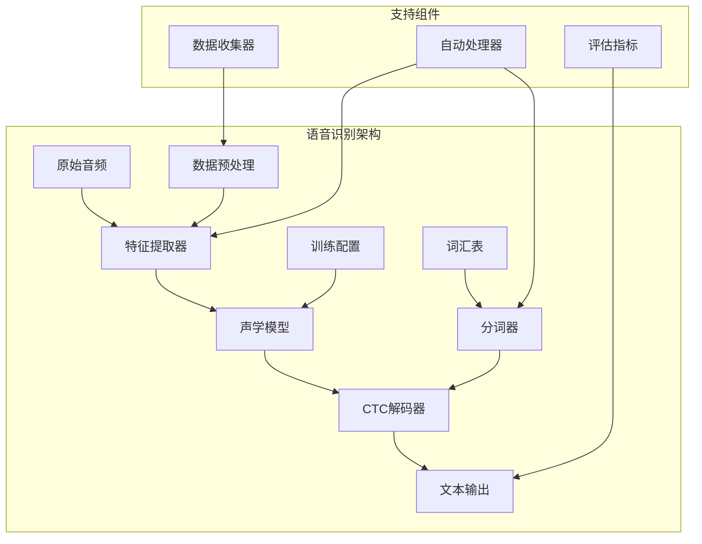

**图表来源**
- [run_speech_recognition_ctc.py](file://examples/pytorch/speech-recognition/run_speech_recognition_ctc.py#L1-L50)
- [automatic_speech_recognition.py](file://src/transformers/pipelines/automatic_speech_recognition.py#L1-L100)

**章节来源**
- [run_speech_recognition_ctc.py](file://examples/pytorch/speech-recognition/run_speech_recognition_ctc.py#L1-L100)

## 连接时序分类(CTC)损失函数

### CTC损失函数原理

CTC（Connectionist Temporal Classification）是一种专门用于序列到序列学习的损失函数，特别适用于语音识别等时间序列转录任务。

#### 核心概念

1. **标签重复问题**：CTC允许输入序列中的多个帧对应同一个输出标签
2. **空白标签**：引入特殊的空白符号来表示不产生输出的情况
3. **路径归一化**：通过前向-后向算法计算所有可能路径的概率

#### 实现细节

在`run_speech_recognition_ctc.py`中，CTC损失函数的配置包括：

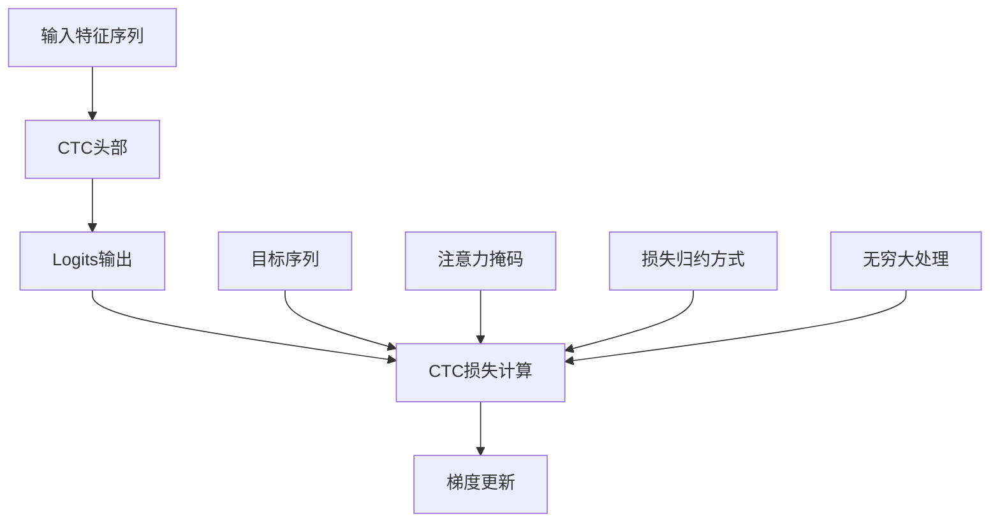

**图表来源**
- [run_speech_recognition_ctc.py](file://examples/pytorch/speech-recognition/run_speech_recognition_ctc.py#L150-L200)

#### 关键配置参数

| 参数 | 默认值 | 说明 | 最佳实践 |
|------|--------|------|----------|
| `ctc_loss_reduction` | "mean" | 损失归约方式 | 根据批次大小选择"mean"或"sum" |
| `ctc_zero_infinity` | False | 无穷大损失处理 | 长序列建议启用以避免数值不稳定 |
| `mask_time_prob` | 0.05 | 时间掩码概率 | 小于0.1以保持语义完整性 |
| `mask_feature_prob` | 0.0 | 特征掩码概率 | 可根据噪声水平调整 |

### CTC解码策略

#### 贪婪解码 vs Beam Search

1. **贪婪解码**：简单快速，但容易陷入局部最优
2. **Beam Search**：考虑多种可能性，质量更高但计算成本增加

#### 语言模型集成

通过`pyctcdecode`库集成语言模型可以显著提升识别准确率：

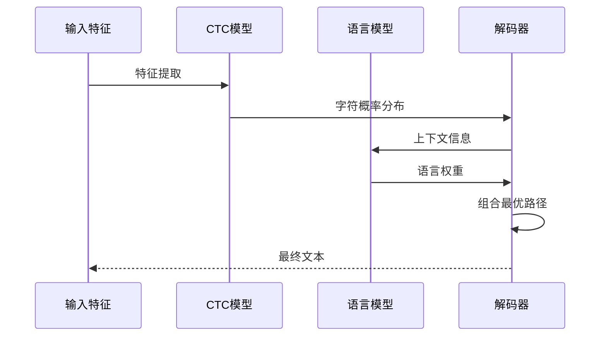

**图表来源**
- [automatic_speech_recognition.py](file://src/transformers/pipelines/automatic_speech_recognition.py#L200-L300)

**章节来源**
- [run_speech_recognition_ctc.py](file://examples/pytorch/speech-recognition/run_speech_recognition_ctc.py#L150-L250)

## 词汇表构建与分词策略

### 动态词汇表构建

语音识别需要根据训练数据动态构建词汇表，确保覆盖所有可能出现的字符和音素。

#### 构建流程

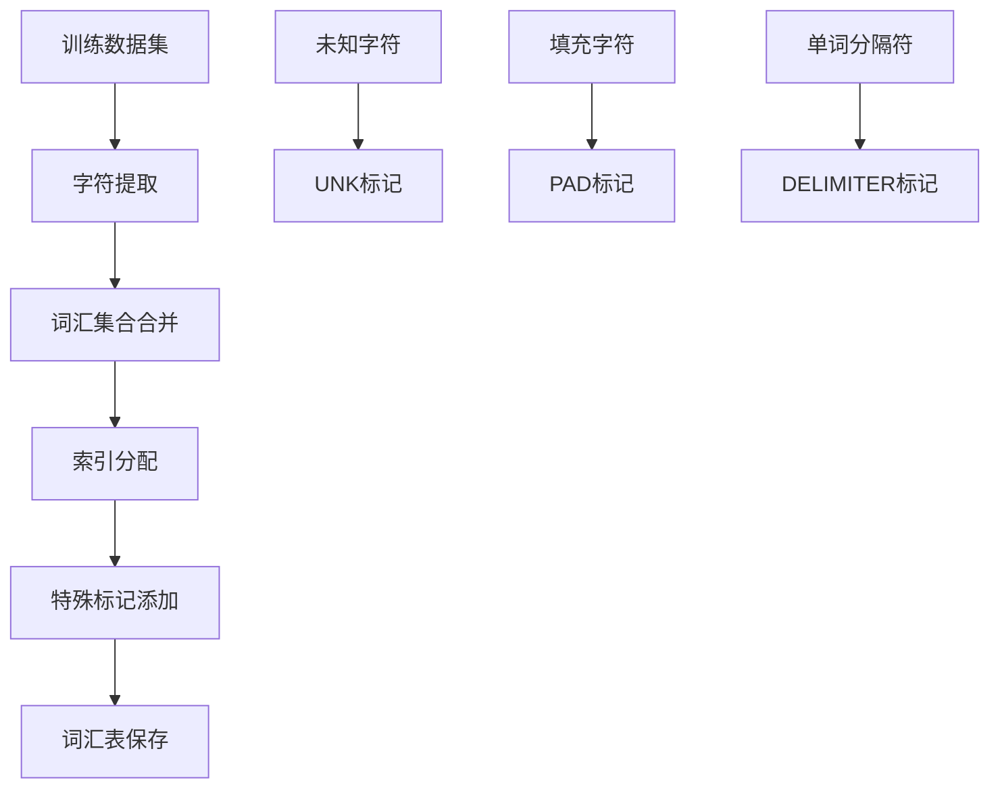

**图表来源**
- [run_speech_recognition_ctc.py](file://examples/pytorch/speech-recognition/run_speech_recognition_ctc.py#L370-L420)

#### 分词策略选择

1. **字符级分词**：最通用，适合所有语言
2. **字节对编码(BPE)**：平衡效率和准确性
3. **音素级分词**：针对特定语言优化

#### 语言模型集成

对于多语言或多方言场景，使用音素分词可以提高鲁棒性：

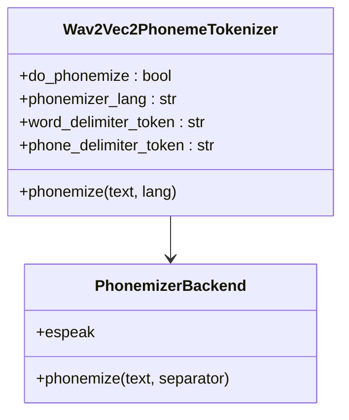

**图表来源**
- [tokenization_wav2vec2_phoneme.py](file://src/transformers/models/wav2vec2_phoneme/tokenization_wav2vec2_phoneme.py#L99-L131)

**章节来源**
- [run_speech_recognition_ctc.py](file://examples/pytorch/speech-recognition/run_speech_recognition_ctc.py#L370-L450)
- [tokenization_wav2vec2_phoneme.py](file://src/transformers/models/wav2vec2_phoneme/tokenization_wav2vec2_phoneme.py#L176-L220)

## 声学特征提取优化

### 梅尔频谱图参数设置

声学特征的质量直接影响识别性能，合理的参数配置至关重要。

#### 核心参数配置

| 参数 | 推荐值 | 说明 | 影响因素 |
|------|--------|------|----------|
| `n_fft` | 512-1024 | 快速傅里叶变换点数 | 频率分辨率与计算复杂度权衡 |
| `hop_length` | 160-320 | 帧移长度 | 时间分辨率与重叠程度 |
| `n_mel_filters` | 80-128 | 梅尔滤波器数量 | 频率分辨率与特征维度 |
| `sampling_rate` | 16kHz | 采样率 | 音频质量和计算成本 |
| `win_length` | 400-800 | 窗口长度 | 频率分辨率与时间分辨率 |

#### 特征提取流程

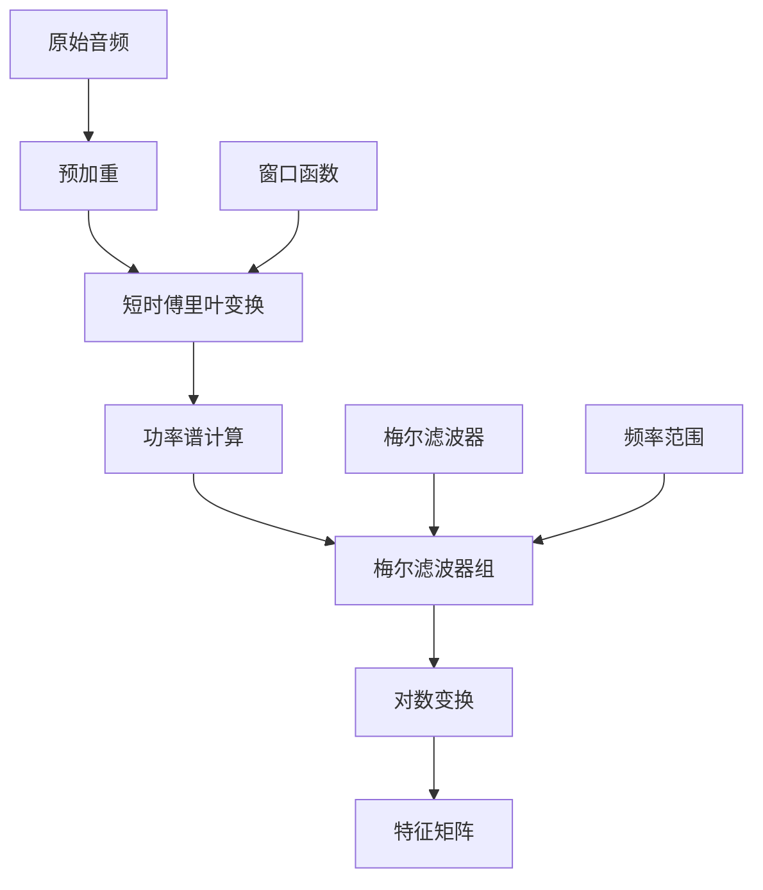

**图表来源**
- [feature_extraction_parakeet.py](file://src/transformers/models/parakeet/feature_extraction_parakeet.py#L100-L126)

#### 数据增强技术

1. **时间拉伸**：改变语速而不影响音调
2. **噪声添加**：提高鲁棒性
3. **混响模拟**：适应不同环境
4. **音高偏移**：处理不同说话人

### 特征归一化

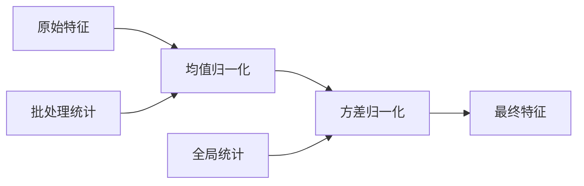

**章节来源**
- [feature_extraction_parakeet.py](file://src/transformers/models/parakeet/feature_extraction_parakeet.py#L100-L126)
- [feature_extraction_clvp.py](file://src/transformers/models/clvp/feature_extraction_clvp.py#L108-L128)

## 流式识别与分块处理

### 长音频序列处理策略

处理长音频序列需要采用分块策略，平衡内存使用和识别质量。

#### 分块处理流程

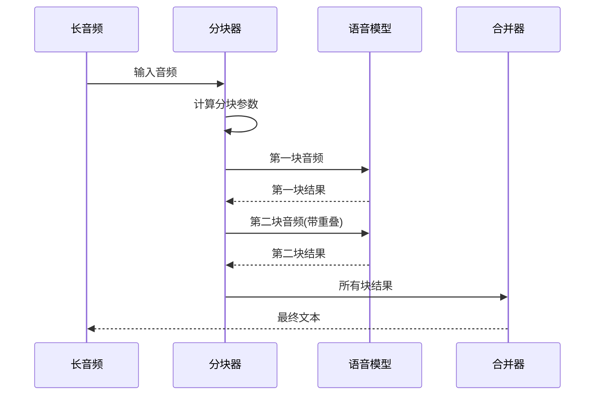

**图表来源**
- [automatic_speech_recognition.py](file://src/transformers/pipelines/automatic_speech_recognition.py#L40-L76)

#### 关键参数配置

| 参数 | 推荐值 | 说明 | 调优建议 |
|------|--------|------|----------|
| `chunk_length_s` | 30-60秒 | 单个分块长度 | 根据GPU内存调整 |
| `stride_length_s` | chunk_length/6 | 重叠长度 | 平衡精度与速度 |
| `batch_size` | 1-4 | 批处理大小 | 考虑序列长度变化 |
| `device` | cuda:0 | 计算设备 | 多GPU时指定设备 |

#### 时间戳对齐

对于需要精确时间戳的应用，重叠分块至关重要：

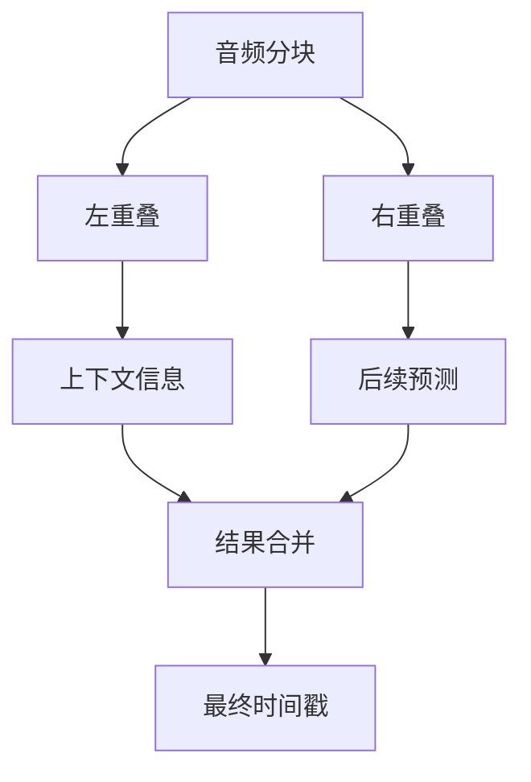

**图表来源**
- [automatic_speech_recognition.py](file://src/transformers/pipelines/automatic_speech_recognition.py#L426-L444)

**章节来源**
- [automatic_speech_recognition.py](file://src/transformers/pipelines/automatic_speech_recognition.py#L40-L100)

## 错误分析与调试

### 常见错误类型

语音识别系统中最常见的错误类型及其分析方法：

#### 插入错误（Insertion Errors）

**表现**：模型错误地添加了不存在的字符或音素
**原因**：
- 声学模型过拟合
- 特征提取不足
- 语言模型缺失

**调试方法**：
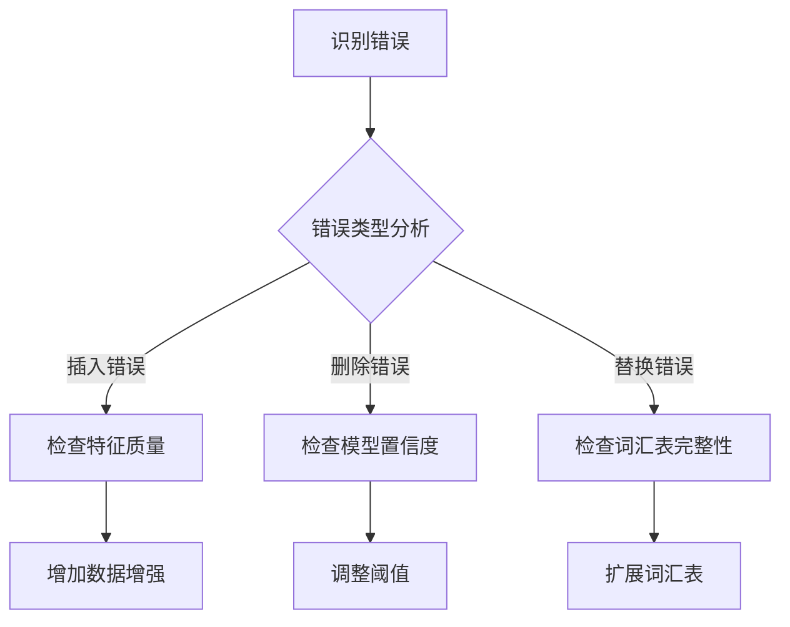

#### 删除错误（Deletion Errors）

**表现**：模型遗漏了实际存在的字符
**原因**：
- 序列过长导致信息丢失
- 噪声干扰严重
- 模型注意力不足

#### 替换错误（Substitution Errors）

**表现**：字符被错误地替换
**原因**：
- 类别混淆
- 特征相似性
- 上下文理解不足

### 性能评估指标

#### 主要评估指标

| 指标 | 公式 | 适用场景 | 改进方向 |
|------|------|----------|----------|
| WER (Word Error Rate) | (S+D+I)/N | 通用评估 | 词汇表优化、语言模型 |
| CER (Character Error Rate) | (S+D+I)/N | 字符级任务 | 特征提取、模型架构 |
| SER (Sentence Error Rate) | 错误句子数/总句子数 | 句子级评估 | 上下文建模 |

#### 错误分析工具

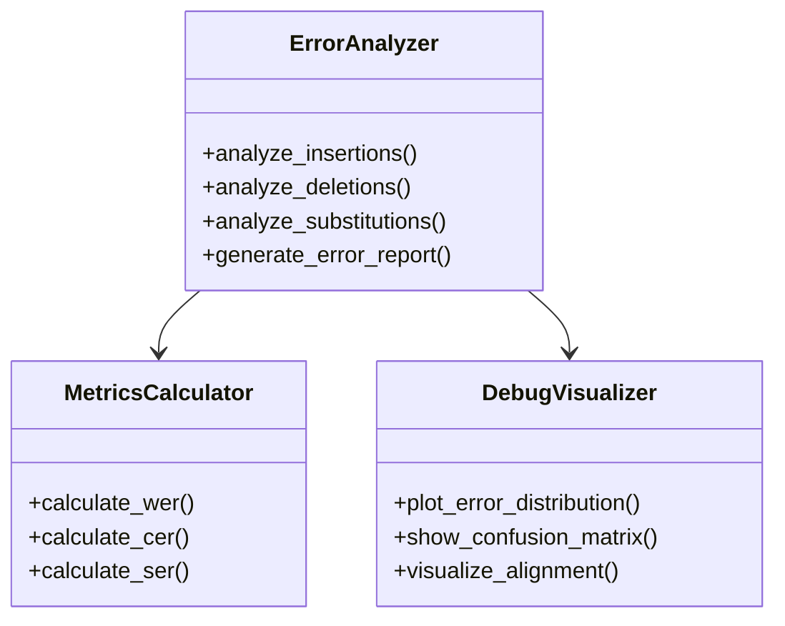

**章节来源**
- [automatic_speech_recognition.py](file://src/transformers/pipelines/automatic_speech_recognition.py#L200-L300)

## 性能优化建议

### 计算资源优化

#### 内存使用优化

1. **梯度累积**：减少批次大小以降低内存使用
2. **混合精度训练**：使用FP16减少内存占用
3. **动态序列长度**：避免固定长度填充

#### 推理加速

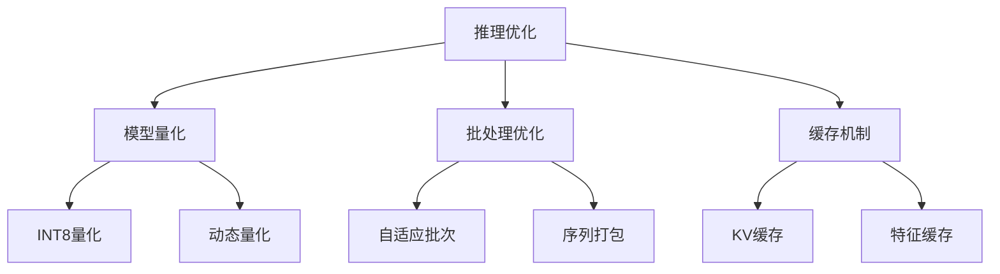

### 数据处理优化

#### 预处理流水线

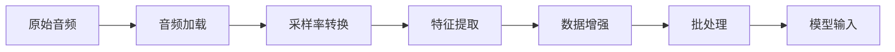

#### 缓存策略

1. **特征缓存**：避免重复计算
2. **词汇表缓存**：快速加载
3. **模型状态缓存**：加速推理

**章节来源**
- [run_speech_recognition_ctc.py](file://examples/pytorch/speech-recognition/run_speech_recognition_ctc.py#L600-L700)

## 故障排除指南

### 常见问题诊断

#### 训练问题

| 问题 | 症状 | 可能原因 | 解决方案 |
|------|------|----------|----------|
| 损失不收敛 | 损失值波动或停滞 | 学习率过高/过低 | 调整学习率或使用学习率调度 |
| 过拟合 | 验证集性能下降 | 模型复杂度过高 | 增加正则化或简化模型 |
| 数值不稳定 | NaN损失值 | 梯度爆炸 | 使用梯度裁剪 |

#### 推理问题

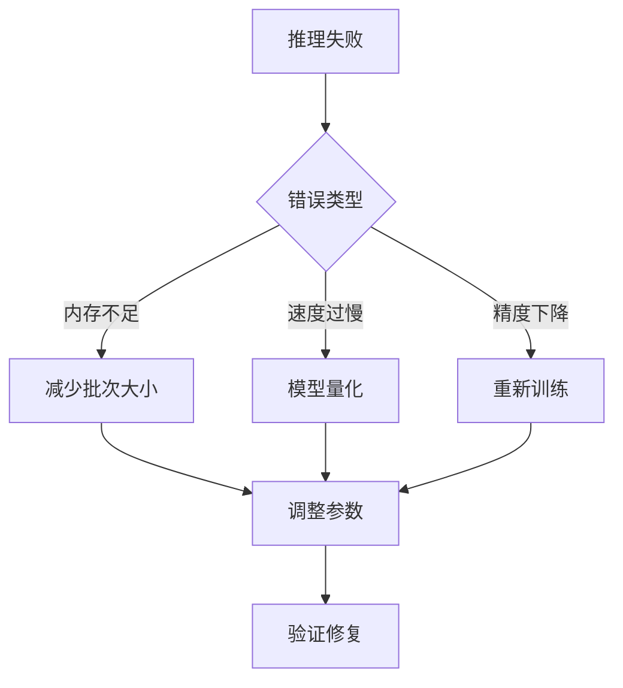

#### 调试工具

1. **日志记录**：详细的训练和推理日志
2. **可视化工具**：特征图和注意力权重可视化
3. **性能监控**：实时资源使用情况

### 最佳实践总结

1. **数据质量优先**：高质量的训练数据是成功的关键
2. **渐进式训练**：从简单任务开始，逐步增加复杂度
3. **持续监控**：建立完善的监控和评估体系
4. **版本控制**：跟踪模型和数据的变化历史

**章节来源**
- [run_speech_recognition_ctc.py](file://examples/pytorch/speech-recognition/run_speech_recognition_ctc.py#L750-L827)

## 总结

语音识别是一个复杂的多学科交叉领域，涉及信号处理、机器学习和自然语言处理等多个方面。通过本文档介绍的最佳实践，开发者可以：

1. **正确使用CTC损失函数**：理解其原理并合理配置参数
2. **构建高效的词汇表**：根据任务需求选择合适的分词策略
3. **优化声学特征提取**：掌握梅尔频谱图和其他特征的参数调优
4. **处理长序列问题**：采用分块策略平衡性能和资源消耗
5. **有效分析和调试错误**：系统性地定位和解决识别问题

随着技术的不断发展，语音识别系统将继续向着更高的准确率、更低的延迟和更好的用户体验迈进。掌握这些最佳实践将为开发高质量的语音识别应用奠定坚实的基础。