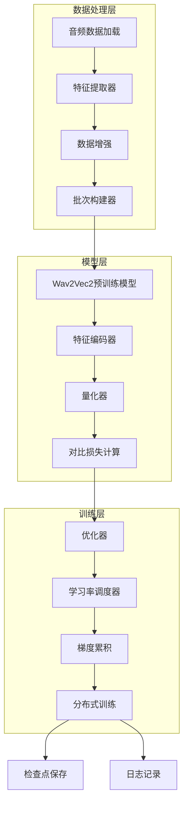
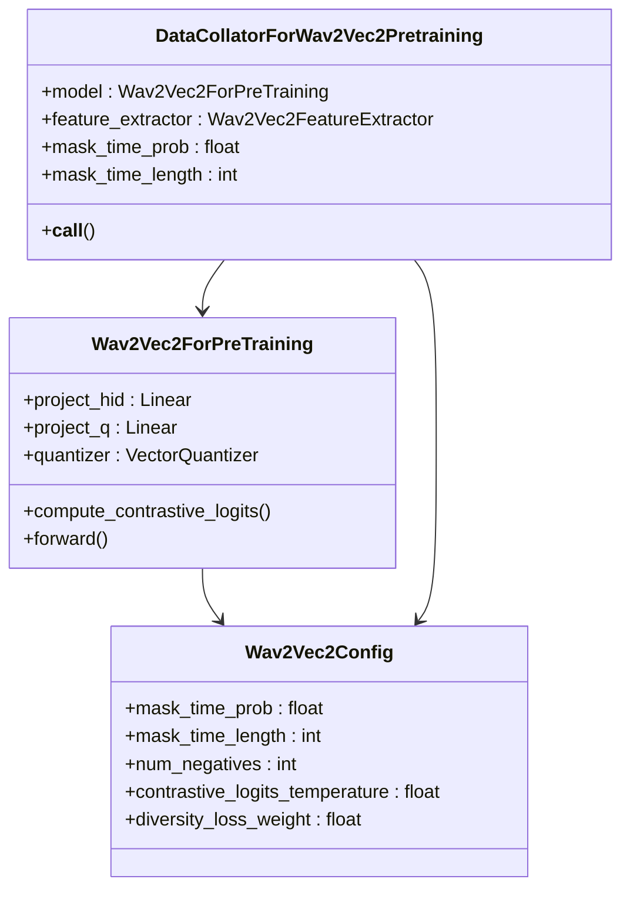
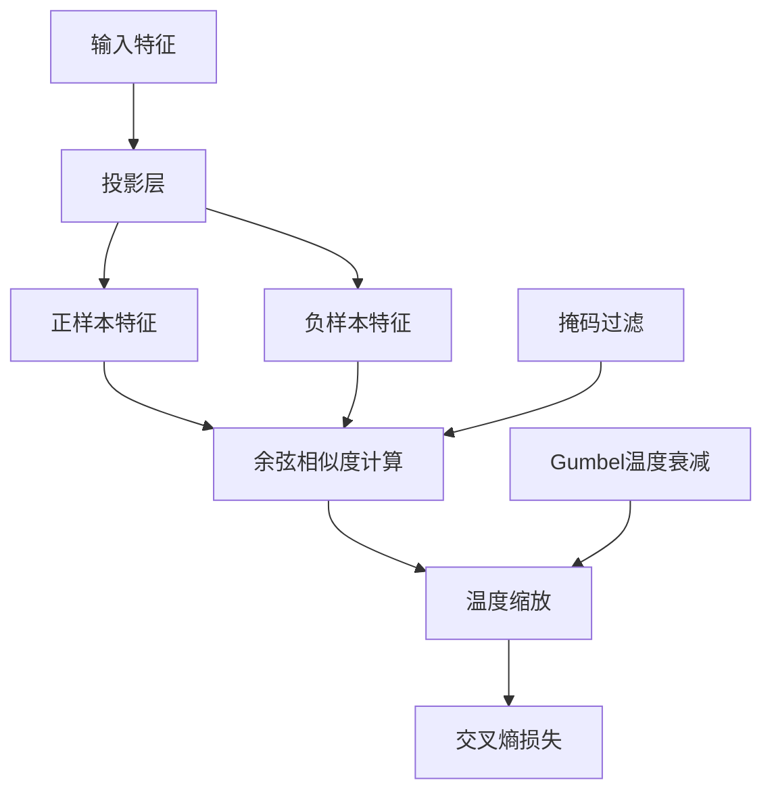
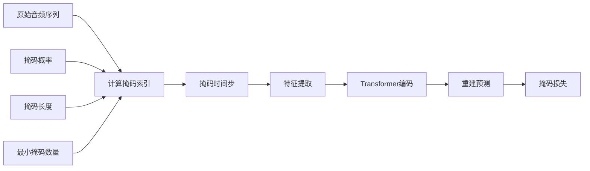
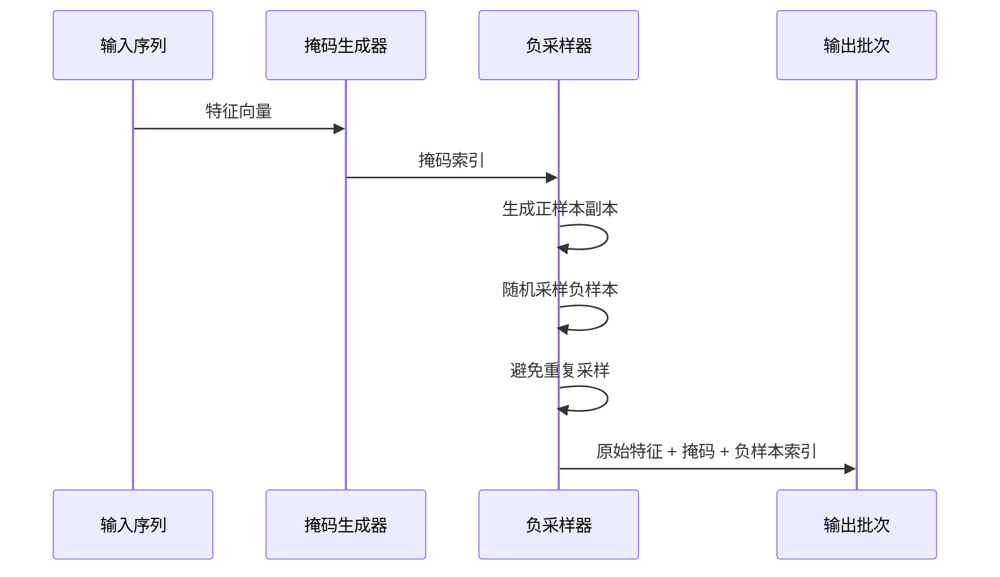
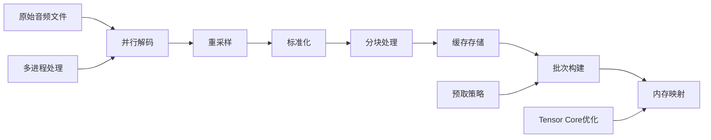
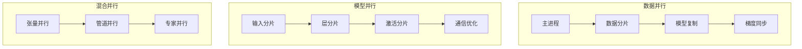
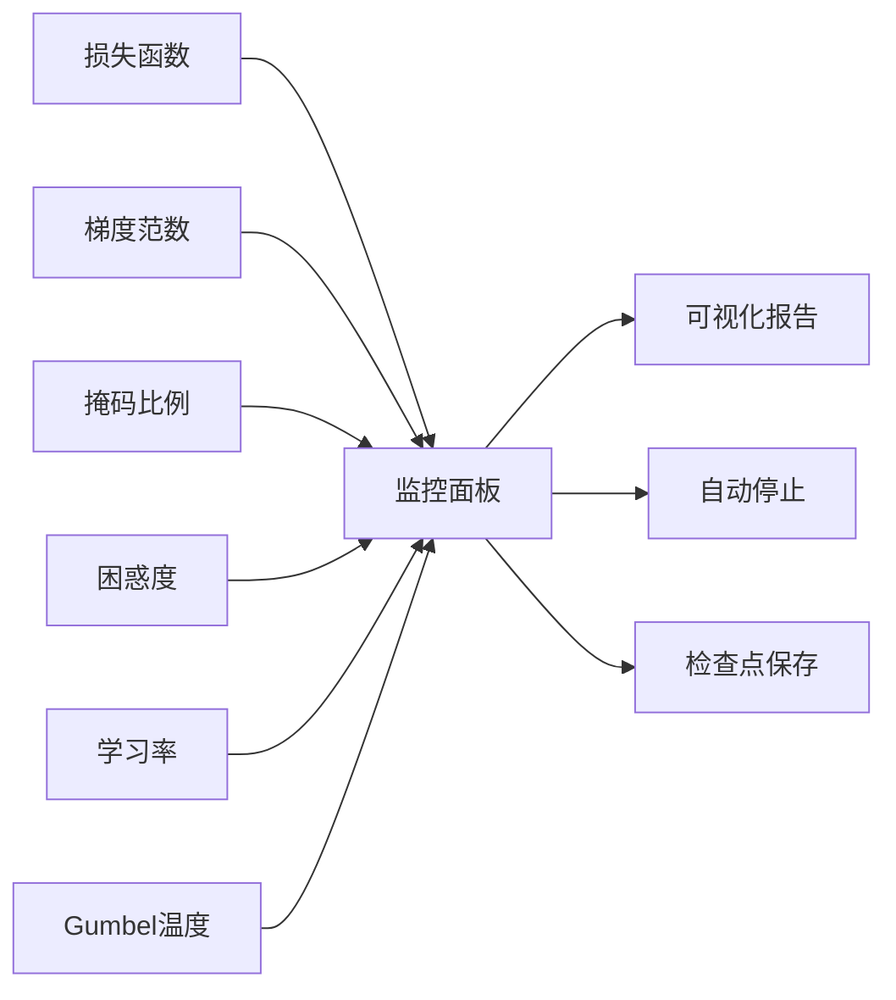
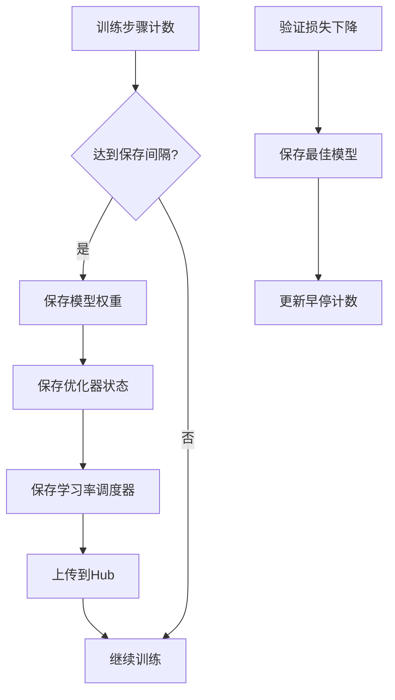
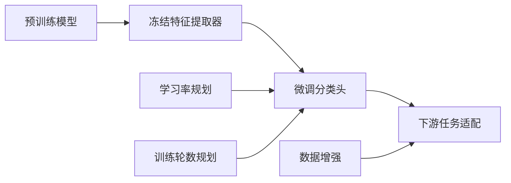

# 语音预训练最佳实践

<cite>
**本文档中引用的文件**
- [run_wav2vec2_pretraining_no_trainer.py](file://examples/pytorch/speech-pretraining/run_wav2vec2_pretraining_no_trainer.py)
- [modeling_wav2vec2.py](file://src/transformers/models/wav2vec2/modeling_wav2vec2.py)
- [configuration_wav2vec2.py](file://src/transformers/models/wav2vec2/configuration_wav2vec2.py)
- [trainer.py](file://src/transformers/trainer.py)
- [training_args.py](file://src/transformers/training_args.py)
</cite>

## 目录
1. [简介](#简介)
2. [项目结构概览](#项目结构概览)
3. [自监督学习框架](#自监督学习框架)
4. [对比学习目标设计](#对比学习目标设计)
5. [掩码预测任务实现](#掩码预测任务实现)
6. [负样本采样方法](#负样本采样方法)
7. [大规模音频数据集处理](#大规模音频数据集处理)
8. [分布式训练配置](#分布式训练配置)
9. [模型收敛监控](#模型收敛监控)
10. [检查点管理策略](#检查点管理策略)
11. [迁移学习最佳实践](#迁移学习最佳实践)
12. [性能优化建议](#性能优化建议)
13. [故障排除指南](#故障排除指南)
14. [总结](#总结)

## 简介

本文档基于Hugging Face Transformers库中的`run_wav2vec2_pretraining_no_trainer.py`示例，深入分析语音预训练任务的最佳实践。该示例展示了如何使用Wav2Vec2模型进行自监督学习，包括对比学习目标、掩码预测任务和大规模音频数据处理等关键技术。

语音预训练是现代语音识别系统的基础，通过在大量未标注音频数据上进行自监督学习，模型能够学习到丰富的语音表示，为下游任务（如语音识别、语音合成等）奠定基础。

## 项目结构概览

语音预训练项目的核心组件包括：

**图表来源**
- [run_wav2vec2_pretraining_no_trainer.py](file://examples/pytorch/speech-pretraining/run_wav2vec2_pretraining_no_trainer.py#L1-L50)
- [modeling_wav2vec2.py](file://src/transformers/models/wav2vec2/modeling_wav2vec2.py#L1450-L1600)

**章节来源**
- [run_wav2vec2_pretraining_no_trainer.py](file://examples/pytorch/speech-pretraining/run_wav2vec2_pretraining_no_trainer.py#L1-L100)

## 自监督学习框架

### 核心架构设计

Wav2Vec2采用自监督学习框架，通过对比学习和掩码预测任务实现端到端的语音表示学习。

**图表来源**
- [modeling_wav2vec2.py](file://src/transformers/models/wav2vec2/modeling_wav2vec2.py#L1450-L1600)
- [run_wav2vec2_pretraining_no_trainer.py](file://examples/pytorch/speech-pretraining/run_wav2vec2_pretraining_no_trainer.py#L250-L350)

### 预训练目标函数

模型通过以下复合损失函数进行训练：

1. **对比损失（Contrastive Loss）**：最大化正样本相似度，最小化负样本相似度
2. **多样性损失（Diversity Loss）**：鼓励代码本的均匀使用
3. **总损失**：两者的加权组合

**章节来源**
- [modeling_wav2vec2.py](file://src/transformers/models/wav2vec2/modeling_wav2vec2.py#L1560-L1650)

## 对比学习目标设计

### 温度缩放机制

对比学习采用温度缩放技术，控制概率分布的尖锐程度：

**图表来源**
- [modeling_wav2vec2.py](file://src/transformers/models/wav2vec2/modeling_wav2vec2.py#L1460-L1480)

### 温度参数优化

温度参数在训练过程中动态调整：
- 初始温度较高，促进探索
- 随着训练进行逐渐降低，提高确定性
- 使用指数衰减策略保持稳定性

**章节来源**
- [run_wav2vec2_pretraining_no_trainer.py](file://examples/pytorch/speech-pretraining/run_wav2vec2_pretraining_no_trainer.py#L650-L670)

## 掩码预测任务实现

### 时间掩码策略

掩码预测任务通过随机掩码音频特征来训练模型重建被遮蔽的部分：

**图表来源**
- [modeling_wav2vec2.py](file://src/transformers/models/wav2vec2/modeling_wav2vec2.py#L200-L230)

### 掩码参数配置

关键掩码参数及其推荐值：

| 参数 | 默认值 | 推荐范围 | 说明 |
|------|--------|----------|------|
| mask_time_prob | 0.05 | 0.1-0.65 | 每个时间步被掩码的概率 |
| mask_time_length | 10 | 5-20 | 单个掩码片段的长度 |
| mask_time_min_masks | 2 | 1-5 | 每个序列的最小掩码数量 |

**章节来源**
- [configuration_wav2vec2.py](file://src/transformers/models/wav2vec2/configuration_wav2vec2.py#L100-L130)

## 负样本采样方法

### 随机负采样算法

负样本采样是对比学习的关键环节，确保模型能够区分相似和不相似的特征：

**图表来源**
- [modeling_wav2vec2.py](file://src/transformers/models/wav2vec2/modeling_wav2vec2.py#L230-L260)

### 采样策略优化

1. **均匀分布采样**：保持负样本的统计特性
2. **避免重复**：防止采样到相同的正样本
3. **批处理优化**：利用矩阵运算加速采样过程

**章节来源**
- [modeling_wav2vec2.py](file://src/transformers/models/wav2vec2/modeling_wav2vec2.py#L230-L280)

## 大规模音频数据集处理

### 数据流水线优化

高效的数据处理流水线对于大规模预训练至关重要：

**图表来源**
- [run_wav2vec2_pretraining_no_trainer.py](file://examples/pytorch/speech-pretraining/run_wav2vec2_pretraining_no_trainer.py#L500-L600)

### 性能优化技术

1. **并行预处理**：使用多个进程同时处理音频文件
2. **内存映射**：减少内存占用，支持超大数据集
3. **缓存机制**：避免重复处理相同数据
4. **动态批处理**：根据序列长度动态调整批次大小

**章节来源**
- [run_wav2vec2_pretraining_no_trainer.py](file://examples/pytorch/speech-pretraining/run_wav2vec2_pretraining_no_trainer.py#L450-L550)

## 分布式训练配置

### 多GPU训练策略

支持多种分布式训练方案：

**图表来源**
- [trainer.py](file://src/transformers/trainer.py#L4950-L4990)

### 训练参数配置

关键分布式训练参数：

| 参数 | 推荐值 | 说明 |
|------|--------|------|
| gradient_accumulation_steps | 4-8 | 梯度累积步数 |
| per_device_train_batch_size | 4-8 | 每设备批次大小 |
| learning_rate | 5e-5 | 初始学习率 |
| warmup_steps | 500-1000 | 预热步数 |

**章节来源**
- [run_wav2vec2_pretraining_no_trainer.py](file://examples/pytorch/speech-pretraining/run_wav2vec2_pretraining_no_trainer.py#L150-L250)

## 模型收敛监控

### 关键指标跟踪

实时监控训练过程中的重要指标：

**图表来源**
- [run_wav2vec2_pretraining_no_trainer.py](file://examples/pytorch/speech-pretraining/run_wav2vec2_pretraining_no_trainer.py#L700-L750)

### 监控指标详解

1. **总损失（Loss）**：整体训练进度的综合指标
2. **对比损失（Contrastive Loss）**：对比学习效果的直接反映
3. **多样性损失（Diversity Loss）**：代码本使用的均衡性
4. **掩码比例（%_mask_idx）**：掩码预测任务的执行情况
5. **困惑度（PPL）**：模型预测的不确定性
6. **梯度范数（Grad Norm）**：训练稳定性的指标

**章节来源**
- [run_wav2vec2_pretraining_no_trainer.py](file://examples/pytorch/speech-pretraining/run_wav2vec2_pretraining_no_trainer.py#L700-L730)

## 检查点管理策略

### 检查点保存策略

智能的检查点管理确保训练过程的可靠性和可恢复性：

**图表来源**
- [run_wav2vec2_pretraining_no_trainer.py](file://examples/pytorch/speech-pretraining/run_wav2vec2_pretraining_no_trainer.py#L730-L760)

### 存储优化策略

1. **增量保存**：只保存变化的参数
2. **压缩存储**：使用量化和压缩技术
3. **版本管理**：支持多个检查点的并存
4. **云端同步**：自动备份到远程存储

**章节来源**
- [run_wav2vec2_pretraining_no_trainer.py](file://examples/pytorch/speech-pretraining/run_wav2vec2_pretraining_no_trainer.py#L730-L780)

## 迁移学习最佳实践

### 从预训练到微调

成功的迁移学习需要精心设计的学习率和训练策略：

**图表来源**
- [run_wav2vec2_pretraining_no_trainer.py](file://examples/pytorch/speech-pretraining/run_wav2vec2_pretraining_no_trainer.py#L600-L700)

### 微调参数设置

不同下游任务的推荐配置：

| 任务类型 | 学习率 | 训练轮数 | 批次大小 | 冻结层数 |
|----------|--------|----------|----------|----------|
| 语音识别 | 1e-4 | 3-5 | 16-32 | 1/3层 |
| 语音分类 | 5e-5 | 5-10 | 32-64 | 1/2层 |
| 说话人识别 | 2e-4 | 2-3 | 64-128 | 全部冻结 |

### 渐进式微调策略

1. **预热阶段**：低学习率开始，避免破坏预训练权重
2. **快速微调**：中期使用较高学习率，快速适应新任务
3. **精细调整**：后期降低学习率，进行精细化调整

**章节来源**
- [run_wav2vec2_pretraining_no_trainer.py](file://examples/pytorch/speech-pretraining/run_wav2vec2_pretraining_no_trainer.py#L600-L650)

## 性能优化建议

### 计算效率优化

1. **混合精度训练**：使用FP16减少内存占用
2. **梯度检查点**：牺牲计算换取内存节省
3. **编译优化**：使用TorchScript或FX进行图优化
4. **内存池化**：复用内存分配，减少碎片

### I/O性能优化

1. **异步数据加载**：使用多进程预处理
2. **批量读取**：减少磁盘访问次数
3. **SSD存储**：使用高速存储设备
4. **网络优化**：优化数据传输协议

## 故障排除指南

### 常见问题及解决方案

1. **内存不足**
   - 减少批次大小
   - 启用梯度检查点
   - 使用混合精度训练

2. **训练不稳定**
   - 降低学习率
   - 增加梯度裁剪
   - 检查数据质量

3. **收敛缓慢**
   - 调整学习率调度
   - 增加数据增强
   - 检查负样本质量

### 调试工具和技术

1. **可视化工具**：使用TensorBoard监控训练过程
2. **日志分析**：定期检查训练日志
3. **模型检查**：验证模型权重的合理性
4. **性能分析**：使用profiling工具识别瓶颈

## 总结

语音预训练是现代语音处理系统的重要基础，通过本文档介绍的最佳实践，可以有效地构建和训练高质量的语音预训练模型。关键要点包括：

1. **合理的对比学习目标设计**：平衡温度参数和负样本采样
2. **有效的掩码预测策略**：优化掩码参数和采样方法
3. **高效的数据处理流水线**：充分利用硬件资源
4. **稳定的分布式训练配置**：确保大规模训练的可靠性
5. **完善的监控和检查点管理**：保障训练过程的可追踪性
6. **科学的迁移学习策略**：最大化预训练模型的价值

通过遵循这些最佳实践，研究人员和工程师可以构建出性能优异、训练稳定的语音预训练模型，为后续的语音识别、语音合成等下游任务奠定坚实基础。