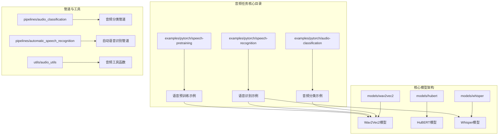
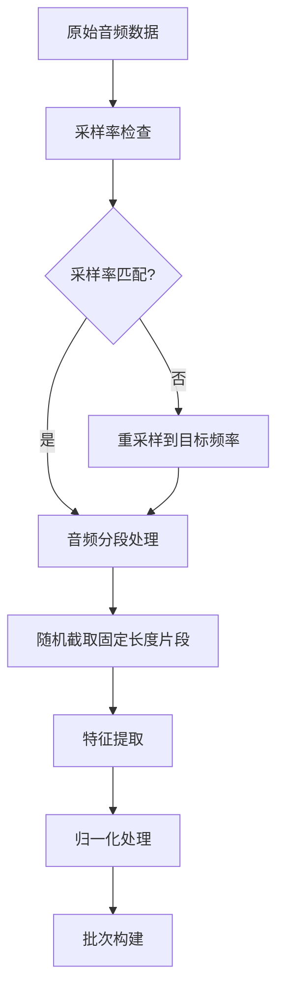
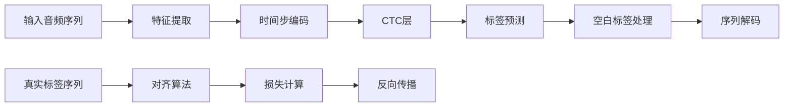
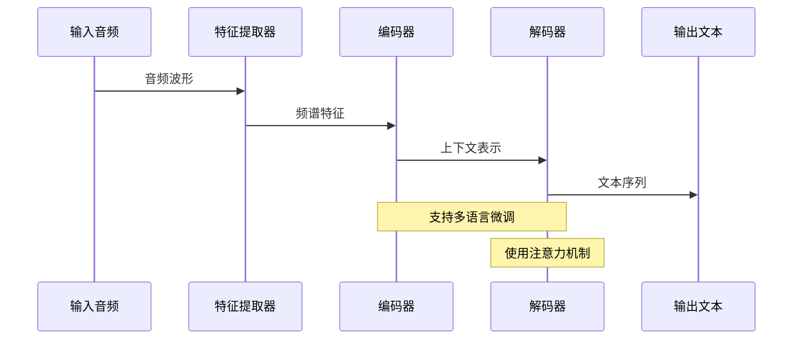
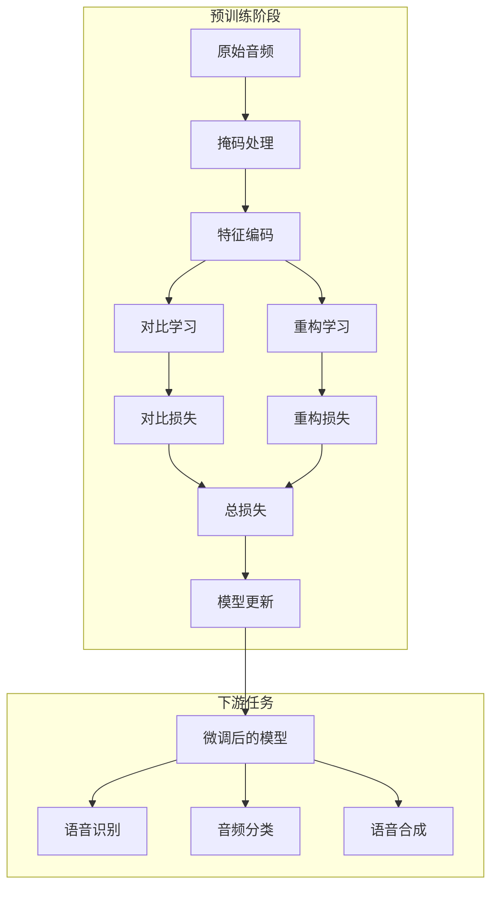
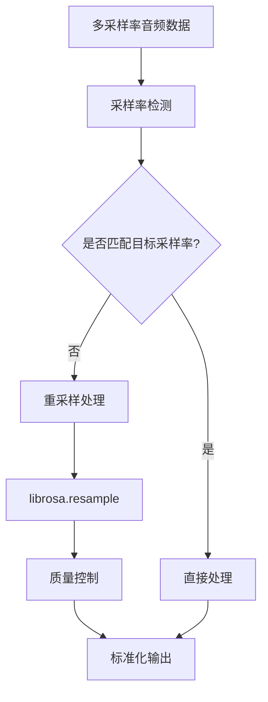
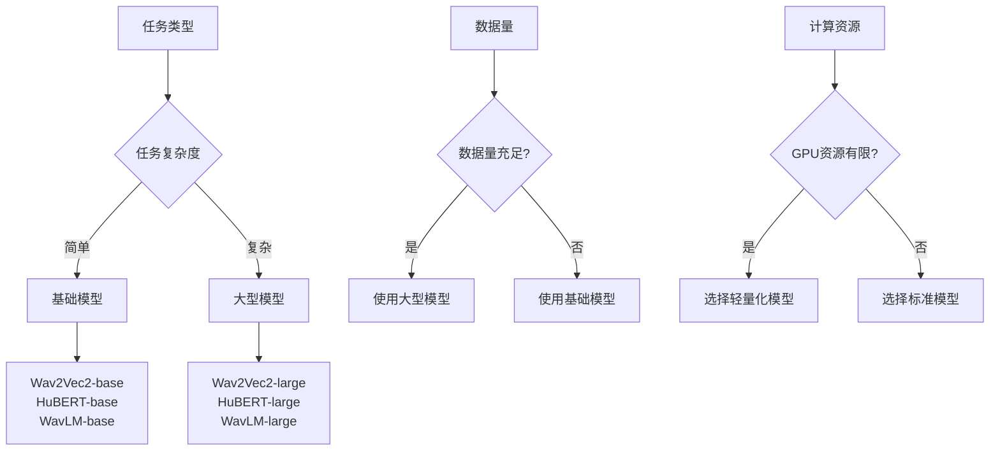
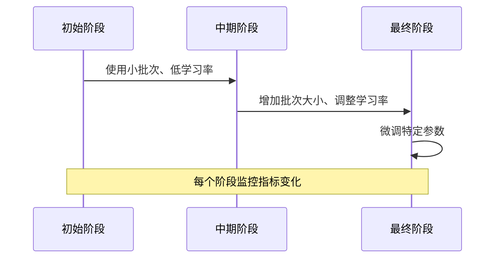
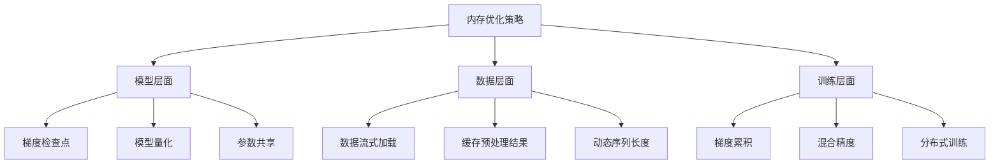
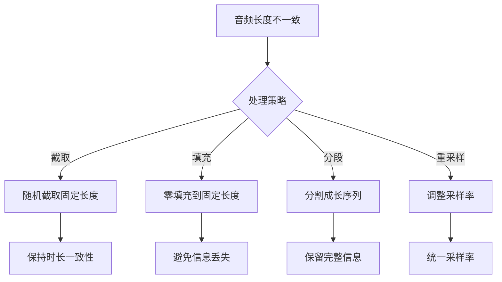

# 音频任务最佳实践

<cite>
**本文档中引用的文件**
- [run_audio_classification.py](file://examples/pytorch/audio-classification/run_audio_classification.py)
- [run_speech_recognition_ctc.py](file://examples/pytorch/speech-recognition/run_speech_recognition_ctc.py)
- [run_speech_recognition_seq2seq.py](file://examples/pytorch/speech-recognition/run_speech_recognition_seq2seq.py)
- [run_wav2vec2_pretraining_no_trainer.py](file://examples/pytorch/speech-pretraining/run_wav2vec2_pretraining_no_trainer.py)
- [audio-classification/README.md](file://examples/pytorch/audio-classification/README.md)
- [speech-recognition/README.md](file://examples/pytorch/speech-recognition/README.md)
- [speech-pretraining/README.md](file://examples/pytorch/speech-pretraining/README.md)
- [modeling_wav2vec2.py](file://src/transformers/models/wav2vec2/modeling_wav2vec2.py)
- [audio_classification.py](file://src/transformers/pipelines/audio_classification.py)
- [automatic_speech_recognition.py](file://src/transformers/pipelines/automatic_speech_recognition.py)
</cite>

## 目录
1. [简介](#简介)
2. [项目结构概览](#项目结构概览)
3. [音频分类最佳实践](#音频分类最佳实践)
4. [语音识别最佳实践](#语音识别最佳实践)
5. [语音预训练最佳实践](#语音预训练最佳实践)
6. [音频预处理与特征提取](#音频预处理与特征提取)
7. [模型选择与配置](#模型选择与配置)
8. [训练策略与优化](#训练策略与优化)
9. [性能优化技巧](#性能优化技巧)
10. [常见问题解决方案](#常见问题解决方案)
11. [实用配置示例](#实用配置示例)
12. [总结](#总结)

## 简介

本文档基于Transformers库中的实际示例，详细介绍音频任务的最佳实践方法。涵盖音频分类、语音识别和语音预训练三大核心任务，提供从数据预处理到模型部署的完整指导。

Transformers库提供了丰富的音频处理功能，支持多种音频模型架构，包括Wav2Vec2、HuBERT、Whisper等先进模型。通过合理的配置和优化策略，可以在各种音频任务上取得优异性能。

## 项目结构概览

Transformers库中的音频任务主要分布在以下目录结构中：



**图表来源**
- [run_audio_classification.py](file://examples/pytorch/audio-classification/run_audio_classification.py#L1-L50)
- [run_speech_recognition_ctc.py](file://examples/pytorch/speech-recognition/run_speech_recognition_ctc.py#L1-L50)
- [run_wav2vec2_pretraining_no_trainer.py](file://examples/pytorch/speech-pretraining/run_wav2vec2_pretraining_no_trainer.py#L1-L50)

## 音频分类最佳实践

### 核心概念与特点

音频分类是将音频信号映射到预定义类别的任务，常用于关键词检测、情感识别、语言识别等场景。Wav2Vec2等自监督预训练模型在此任务上表现出色。

### 数据预处理策略

音频分类的数据预处理需要特别注意音频长度的一致性和采样率的统一：



**图表来源**
- [run_audio_classification.py](file://examples/pytorch/audio-classification/run_audio_classification.py#L70-L120)

### 模型配置与训练

音频分类任务的关键配置参数：

| 参数名称 | 推荐值 | 说明 | 影响因素 |
|---------|--------|------|----------|
| max_length_seconds | 1-16秒 | 训练时音频片段最大长度 | 内存限制、计算效率 |
| freeze_feature_encoder | True | 是否冻结特征编码器 | 预训练模型、数据量 |
| attention_mask | False | 是否生成注意力掩码 | 模型架构、性能需求 |
| learning_rate | 3e-5 | 学习率 | 数据集大小、收敛速度 |
| batch_size | 8-32 | 批次大小 | GPU内存、梯度稳定性 |

### 性能优化技巧

1. **音频长度处理**：使用`random_subsample`函数实现动态音频截取
2. **特征冻结**：合理冻结预训练特征编码器以防止过拟合
3. **数据增强**：在训练时应用随机音频截取增加数据多样性

**章节来源**
- [run_audio_classification.py](file://examples/pytorch/audio-classification/run_audio_classification.py#L70-L150)
- [audio-classification/README.md](file://examples/pytorch/audio-classification/README.md#L20-L80)

## 语音识别最佳实践

### 连接时序分类(CTC)任务

CTC是一种专门用于序列标注任务的损失函数，特别适用于语音识别这种输入输出长度不固定的任务。

#### CTC损失函数特性



**图表来源**
- [run_speech_recognition_ctc.py](file://examples/pytorch/speech-recognition/run_speech_recognition_ctc.py#L400-L500)

#### CTC训练配置

关键参数配置表：

| 参数类别 | 参数名 | 推荐值 | 作用说明 |
|---------|--------|--------|----------|
| 损失函数 | ctc_loss_reduction | "mean" | 损失聚合方式 |
| 损失函数 | ctc_zero_infinity | False | 处理无穷大损失 |
| 掩码策略 | mask_time_prob | 0.05-0.65 | 时间维度掩码概率 |
| 掩码策略 | mask_time_length | 10 | 掩码跨度长度 |
| 数据增强 | chars_to_ignore | 特殊字符列表 | 文本预处理过滤 |

### 序列到序列(Seq2Seq)任务

Seq2Seq模型通过编码器-解码器架构直接生成文本序列，在语音翻译等任务上表现优异。

#### Whisper模型使用指南



**图表来源**
- [run_speech_recognition_seq2seq.py](file://examples/pytorch/speech-recognition/run_speech_recognition_seq2seq.py#L300-L400)

### 语音识别性能优化

1. **词汇表构建**：从训练和验证数据中自动构建词汇表
2. **批处理策略**：使用动态填充处理变长序列
3. **梯度累积**：在小批次训练时提高有效批次大小
4. **混合精度训练**：使用FP16降低内存占用

**章节来源**
- [run_speech_recognition_ctc.py](file://examples/pytorch/speech-recognition/run_speech_recognition_ctc.py#L200-L400)
- [run_speech_recognition_seq2seq.py](file://examples/pytorch/speech-recognition/run_speech_recognition_seq2seq.py#L100-L300)
- [speech-recognition/README.md](file://examples/pytorch/speech-recognition/README.md#L50-L200)

## 语音预训练最佳实践

### 自监督学习原理

语音预训练采用对比学习和重构损失相结合的方法，通过大量未标注音频数据学习通用的音频表示。



**图表来源**
- [run_wav2vec2_pretraining_no_trainer.py](file://examples/pytorch/speech-pretraining/run_wav2vec2_pretraining_no_trainer.py#L400-L600)

### 掩码策略与超参数

预训练的关键配置参数：

| 参数类型 | 参数名 | 推荐范围 | 调整建议 |
|---------|--------|----------|----------|
| 掩码策略 | mask_time_prob | 0.65 | 大多数情况下使用默认值 |
| 掩码策略 | mask_time_length | 10 | 与模型架构匹配 |
| 优化器 | learning_rate | 0.001-0.005 | 根据批次大小调整 |
| 优化器 | weight_decay | 0.01 | 防止过拟合 |
| 训练 | gradient_accumulation_steps | 4-8 | 内存受限时增加 |

### 分布式训练策略

预训练通常需要大规模分布式训练，以下是关键考虑因素：

1. **数据预处理分离**：先在单机完成预处理，再分布式加载
2. **梯度同步**：确保多GPU间的梯度正确同步
3. **检查点保存**：定期保存中间检查点避免训练中断
4. **内存管理**：合理设置批次大小和序列长度

**章节来源**
- [run_wav2vec2_pretraining_no_trainer.py](file://examples/pytorch/speech-pretraining/run_wav2vec2_pretraining_no_trainer.py#L200-L500)
- [speech-pretraining/README.md](file://examples/pytorch/speech-pretraining/README.md#L30-L100)

## 音频预处理与特征提取

### 采样率处理策略

音频预处理的第一步是确保所有音频数据具有统一的采样率：



**图表来源**
- [run_audio_classification.py](file://examples/pytorch/audio-classification/run_audio_classification.py#L200-L250)

### 频谱图处理技术

不同的音频任务需要不同的特征表示：

| 特征类型 | 适用任务 | 参数配置 | 性能特点 |
|---------|----------|----------|----------|
| Mel频谱 | 语音识别、音频分类 | n_fft=512, hop_length=160 | 对人耳感知友好 |
| MFCC | 语音识别 | n_mfcc=13 | 降维效果好 |
| 频谱图 | 音乐分类 | n_fft=2048, hop_length=512 | 保留更多细节 |
| 声纹特征 | 说话人识别 | n_mfcc=40 | 说话人相关性强 |

### 音频增强技术

为了提高模型的鲁棒性，可以应用以下增强技术：

1. **时间拉伸**：改变音频播放速度而不改变音调
2. **噪声添加**：在音频中加入背景噪声
3. **音高变换**：改变音频音高
4. **混响模拟**：模拟不同环境下的声音效果

**章节来源**
- [modeling_wav2vec2.py](file://src/transformers/models/wav2vec2/modeling_wav2vec2.py#L100-L200)

## 模型选择与配置

### 预训练模型选择指南

根据具体任务需求选择合适的预训练模型：



### 模型配置优化

不同任务的模型配置策略：

| 任务类型 | 模型架构 | 关键配置 | 注意事项 |
|---------|----------|----------|----------|
| 语音识别 | Wav2Vec2-CTC | freeze_feature_encoder=True | 防止过拟合 |
| 语音识别 | Whisper | freeze_feature_encoder=False | 充分利用预训练知识 |
| 音频分类 | Wav2Vec2 | attention_mask=False | 减少计算开销 |
| 语音合成 | SpeechT5 | 使用编码器-解码器架构 | 需要对齐训练 |

**章节来源**
- [modeling_wav2vec2.py](file://src/transformers/models/wav2vec2/modeling_wav2vec2.py#L1-L100)

## 训练策略与优化

### 渐进式训练策略

对于大规模数据集，建议采用渐进式训练策略：



### 学习率调度策略

有效的学习率调度对训练效果至关重要：

1. **预热策略**：训练初期使用较小学习率
2. **余弦退火**：周期性调整学习率
3. **早停策略**：根据验证集指标决定停止训练
4. **学习率衰减**：逐步降低学习率

### 正则化技术

为防止过拟合，可以采用以下正则化技术：

| 技术类型 | 实现方法 | 效果 | 适用场景 |
|---------|----------|------|----------|
| Dropout | attention_dropout, hidden_dropout | 防止过拟合 | 所有任务 |
| 权重衰减 | weight_decay | L2正则化 | 大规模训练 |
| 梯度裁剪 | gradient_clipping | 稳定训练 | 不稳定训练 |
| 特征冻结 | freeze_feature_encoder | 保持预训练特征 | 小数据集 |

## 性能优化技巧

### 计算资源管理

1. **批次大小优化**：根据GPU内存调整批次大小
2. **混合精度训练**：使用FP16减少内存占用
3. **梯度累积**：在内存受限时增加有效批次大小
4. **数据加载优化**：使用多进程数据加载

### 内存优化策略



### 并行化策略

1. **数据并行**：将批次数据分布到多个GPU
2. **模型并行**：将模型分布到多个设备
3. **流水线并行**：按层分布到不同设备
4. **张量并行**：在单层内并行处理

**章节来源**
- [run_wav2vec2_pretraining_no_trainer.py](file://examples/pytorch/speech-pretraining/run_wav2vec2_pretraining_no_trainer.py#L600-L800)

## 常见问题解决方案

### 音频长度不一致处理

这是音频任务中最常见的问题之一：



### 噪声数据影响处理

噪声数据会影响模型性能，需要采取相应措施：

1. **数据清洗**：移除明显异常的音频样本
2. **噪声增强**：在训练时加入噪声数据
3. **鲁棒特征**：使用对噪声不敏感的特征
4. **后处理**：使用语言模型纠正错误识别

### 内存溢出解决

当遇到CUDA内存不足时：

| 问题类型 | 解决方案 | 实施难度 | 效果评估 |
|---------|----------|----------|----------|
| 批次过大 | 减小batch_size | 低 | 显著 |
| 序列过长 | 截断或分块处理 | 中 | 中等 |
| 模型过大 | 使用梯度检查点 | 中 | 显著 |
| 数据过多 | 使用数据流式加载 | 高 | 显著 |

### 训练不稳定处理

训练过程中出现不稳定现象的解决方案：

1. **学习率调整**：降低学习率或使用更平滑的调度器
2. **梯度裁剪**：设置合理的梯度范数上限
3. **初始化改进**：使用更好的权重初始化方法
4. **正则化加强**：增加dropout或权重衰减

**章节来源**
- [run_audio_classification.py](file://examples/pytorch/audio-classification/run_audio_classification.py#L70-L120)
- [run_speech_recognition_ctc.py](file://examples/pytorch/speech-recognition/run_speech_recognition_ctc.py#L300-L400)

## 实用配置示例

### 单GPU配置示例

针对资源有限的情况，提供以下配置建议：

```bash
# 音频分类配置
python run_audio_classification.py \
    --model_name_or_path facebook/wav2vec2-base \
    --dataset_name superb \
    --dataset_config_name ks \
    --output_dir ./audio-classification-demo \
    --learning_rate 3e-5 \
    --max_length_seconds 1 \
    --per_device_train_batch_size 32 \
    --per_device_eval_batch_size 32 \
    --num_train_epochs 5 \
    --fp16

# CTC语音识别配置
python run_speech_recognition_ctc.py \
    --model_name_or_path facebook/wav2vec2-base \
    --dataset_name librispeech_asr \
    --dataset_config_name clean \
    --output_dir ./speech-recognition-demo \
    --learning_rate 3e-4 \
    --per_device_train_batch_size 8 \
    --gradient_accumulation_steps 4 \
    --num_train_epochs 10 \
    --fp16
```

### 多GPU配置示例

充分利用多GPU资源的配置：

```bash
# 多GPU音频分类
torchrun --nproc_per_node 4 run_audio_classification.py \
    --model_name_or_path facebook/wav2vec2-base \
    --dataset_name common_language \
    --output_dir ./audio-classification-multi-gpu \
    --learning_rate 3e-4 \
    --per_device_train_batch_size 8 \
    --gradient_accumulation_steps 4 \
    --num_train_epochs 10 \
    --fp16

# 多GPU语音识别
torchrun --nproc_per_node 8 run_speech_recognition_ctc.py \
    --model_name_or_path facebook/wav2vec2-large-xlsr-53 \
    --dataset_name mozilla-foundation/common_voice_17_0 \
    --dataset_config_name tr \
    --output_dir ./speech-recognition-multi-gpu \
    --learning_rate 3e-4 \
    --per_device_train_batch_size 4 \
    --gradient_accumulation_steps 2 \
    --num_train_epochs 15 \
    --fp16
```

### 预训练配置示例

大规模预训练的配置建议：

```bash
# Wav2Vec2预训练
accelerate launch run_wav2vec2_pretraining_no_trainer.py \
    --dataset_name librispeech_asr \
    --dataset_config_names clean clean other \
    --dataset_split_names train.100 train.360 train.500 \
    --model_name_or_path facebook/wav2vec2-base \
    --output_dir ./wav2vec2-pretraining \
    --max_train_steps 200000 \
    --learning_rate 0.001 \
    --per_device_train_batch_size 8 \
    --gradient_accumulation_steps 4 \
    --mask_time_prob 0.65 \
    --mask_time_length 10 \
    --gradient_checkpointing
```

### 不同经验水平的建议

#### 初学者配置（快速开始）
- 使用预训练模型进行微调
- 选择较小的模型（base级别）
- 使用默认参数开始
- 从小数据集开始实验

#### 中级用户配置（平衡性能与效率）
- 根据任务特点调整参数
- 使用中等规模模型
- 应用基本的正则化技术
- 监控训练过程指标

#### 高级用户配置（追求最优性能）
- 自定义模型架构
- 使用大规模预训练模型
- 实施复杂的正则化策略
- 进行系统性的超参数调优

**章节来源**
- [audio-classification/README.md](file://examples/pytorch/audio-classification/README.md#L20-L80)
- [speech-recognition/README.md](file://examples/pytorch/speech-recognition/README.md#L50-L200)
- [speech-pretraining/README.md](file://examples/pytorch/speech-pretraining/README.md#L30-L100)

## 总结

音频任务的最佳实践涉及多个方面的综合考虑：

1. **任务理解**：明确任务类型（分类、识别、预训练）的特点和要求
2. **数据处理**：重视音频预处理的质量和一致性
3. **模型选择**：根据任务复杂度和资源情况选择合适模型
4. **训练策略**：采用渐进式训练和适当的正则化技术
5. **性能优化**：合理利用计算资源，实施内存和计算优化
6. **问题解决**：建立系统的问题诊断和解决流程

通过遵循本文档提供的最佳实践，用户可以在各种音频任务上获得优异的性能表现。随着技术的不断发展，建议持续关注最新的研究成果和模型进展，及时更新和优化自己的音频处理管道。

成功的音频项目不仅依赖于先进的模型架构，更需要精心设计的预处理流程、合理的训练策略和有效的优化技术。希望本文档能够为您的音频任务提供有价值的参考和指导。