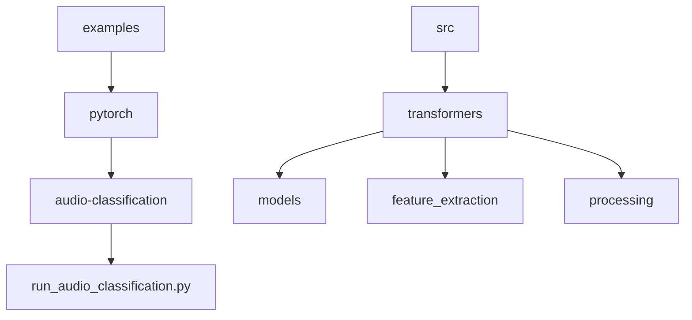
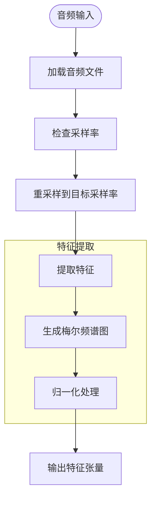
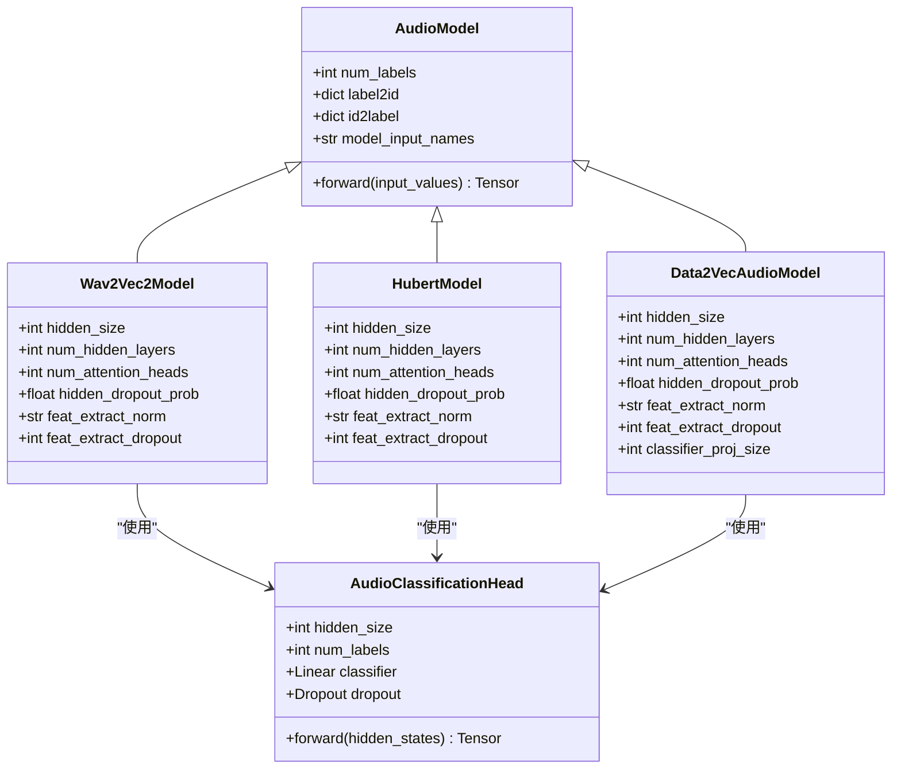
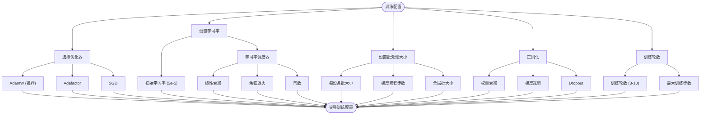
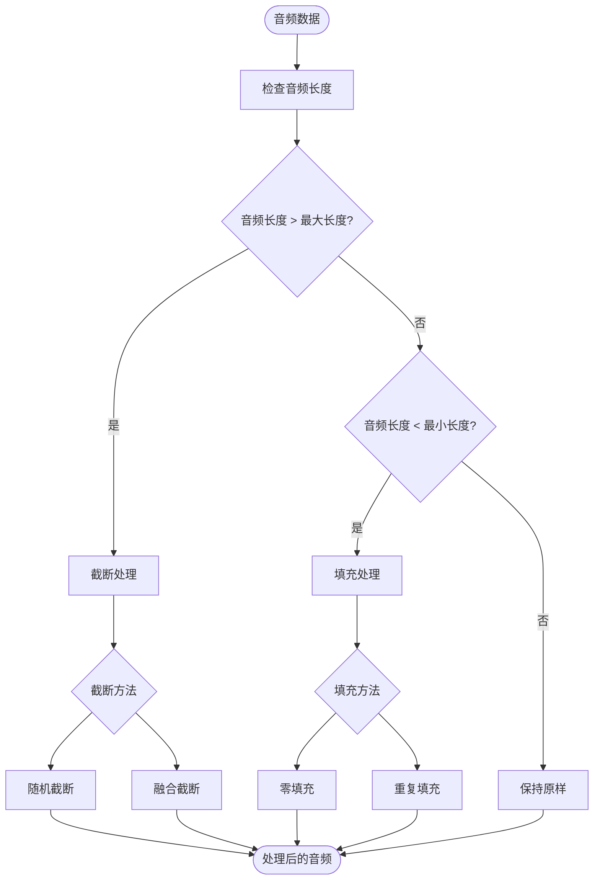
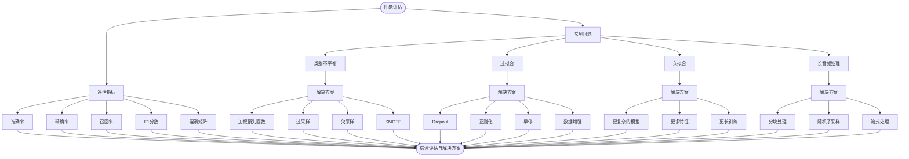

# 音频分类最佳实践

<cite>
**本文档中引用的文件**
- [run_audio_classification.py](file://examples/pytorch/audio-classification/run_audio_classification.py)
- [audio_utils.py](file://src/transformers/audio_utils.py)
- [trainer.py](file://src/transformers/trainer.py)
- [training_args.py](file://src/transformers/training_args.py)
- [modeling_auto.py](file://src/transformers/models/auto/modeling_auto.py)
- [feature_extraction_clap.py](file://src/transformers/models/clap/feature_extraction_clap.py)
- [configuration_data2vec_audio.py](file://src/transformers/models/data2vec/configuration_data2vec_audio.py)
- [modular_hubert.py](file://src/transformers/models/hubert/modular_hubert.py)
</cite>

## 目录
1. [项目结构](#项目结构)
2. [核心组件](#核心组件)
3. [音频处理流程](#音频处理流程)
4. [模型架构选择](#模型架构选择)
5. [训练配置最佳实践](#训练配置最佳实践)
6. [数据处理策略](#数据处理策略)
7. [性能评估与问题解决方案](#性能评估与问题解决方案)

## 项目结构

**图示来源**
- [run_audio_classification.py](file://examples/pytorch/audio-classification/run_audio_classification.py)
- [src/transformers](file://src/transformers)

**章节来源**
- [examples/pytorch/audio-classification](file://examples/pytorch/audio-classification)
- [src/transformers](file://src/transformers)

## 核心组件

音频分类任务的核心组件包括数据处理、特征提取、模型架构和训练流程。基于`run_audio_classification.py`示例，系统通过`AutoFeatureExtractor`和`AutoModelForAudioClassification`实现自动化配置，支持多种预训练模型的音频分类任务。

**章节来源**
- [run_audio_classification.py](file://examples/pytorch/audio-classification/run_audio_classification.py#L1-L50)
- [modeling_auto.py](file://src/transformers/models/auto/modeling_auto.py#L1608-L1636)

## 音频处理流程

音频处理流程包括音频文件加载、预处理和特征提取三个主要步骤。系统使用`datasets`库自动处理音频加载和重采样，确保输入音频具有正确的采样率。

**图示来源**
- [audio_utils.py](file://src/transformers/audio_utils.py#L434-L457)
- [feature_extraction_clap.py](file://src/transformers/models/clap/feature_extraction_clap.py#L154-L174)

**章节来源**
- [run_audio_classification.py](file://examples/pytorch/audio-classification/run_audio_classification.py#L200-L250)
- [audio_utils.py](file://src/transformers/audio_utils.py#L434-L457)

## 模型架构选择

模型架构选择是音频分类任务的关键决策点。transformers库支持多种先进的音频模型，包括Wav2Vec2、HuBERT、Data2Vec等。

**图示来源**
- [modular_hubert.py](file://src/transformers/models/hubert/modular_hubert.py#L280-L300)
- [configuration_data2vec_audio.py](file://src/transformers/models/data2vec/configuration_data2vec_audio.py#L273-L287)
- [modeling_auto.py](file://src/transformers/models/auto/modeling_auto.py#L1608-L1636)

**章节来源**
- [run_audio_classification.py](file://examples/pytorch/audio-classification/run_audio_classification.py#L350-L370)
- [modular_hubert.py](file://src/transformers/models/hubert/modular_hubert.py#L280-L300)

## 训练配置最佳实践

训练配置的最佳实践包括学习率调度、优化器选择和批处理大小设置。这些配置通过`TrainingArguments`类进行管理。

**图示来源**
- [training_args.py](file://src/transformers/training_args.py#L1-L300)
- [trainer.py](file://src/transformers/trainer.py#L1-L200)

**章节来源**
- [run_audio_classification.py](file://examples/pytorch/audio-classification/run_audio_classification.py#L370-L400)
- [training_args.py](file://src/transformers/training_args.py#L1-L300)

## 数据处理策略

处理不同音频长度的策略包括填充和截断，这些策略在数据预处理阶段实现。

**图示来源**
- [feature_extraction_clap.py](file://src/transformers/models/clap/feature_extraction_clap.py#L215-L237)
- [run_audio_classification.py](file://examples/pytorch/audio-classification/run_audio_classification.py#L100-L150)

**章节来源**
- [run_audio_classification.py](file://examples/pytorch/audio-classification/run_audio_classification.py#L100-L150)
- [feature_extraction_clap.py](file://src/transformers/models/clap/feature_extraction_clap.py#L215-L237)

## 性能评估与问题解决方案

性能评估指标和常见问题解决方案是确保模型有效性的关键。

**图示来源**
- [run_audio_classification.py](file://examples/pytorch/audio-classification/run_audio_classification.py#L327-L357)
- [trainer.py](file://src/transformers/trainer.py#L1-L200)

**章节来源**
- [run_audio_classification.py](file://examples/pytorch/audio-classification/run_audio_classification.py#L327-L357)
- [trainer.py](file://src/transformers/trainer.py#L1-L200)