# Pipeline API

<cite>
**本文档中引用的文件**
- [src/transformers/pipelines/__init__.py](file://src/transformers/pipelines/__init__.py)
- [src/transformers/pipelines/base.py](file://src/transformers/pipelines/base.py)
- [src/transformers/pipelines/text_classification.py](file://src/transformers/pipelines/text_classification.py)
- [src/transformers/pipelines/question_answering.py](file://src/transformers/pipelines/question_answering.py)
- [src/transformers/pipelines/text_generation.py](file://src/transformers/pipelines/text_generation.py)
- [src/transformers/pipelines/automatic_speech_recognition.py](file://src/transformers/pipelines/automatic_speech_recognition.py)
- [src/transformers/pipelines/pt_utils.py](file://src/transformers/pipelines/pt_utils.py)
</cite>

## 目录
1. [简介](#简介)
2. [项目结构](#项目结构)
3. [核心组件](#核心组件)
4. [架构概览](#架构概览)
5. [详细组件分析](#详细组件分析)
6. [工厂模式实现](#工厂模式实现)
7. [输入输出处理机制](#输入输出处理机制)
8. [内部执行流程](#内部执行流程)
9. [性能优化](#性能优化)
10. [故障排除指南](#故障排除指南)
11. [结论](#结论)

## 简介

Pipeline API是Hugging Face Transformers库中的高级推理接口，它为各种机器学习任务提供了统一且易于使用的API。Pipeline封装了模型、分词器、特征提取器等组件，并提供了一个简洁的接口来处理复杂的预处理和后处理任务。

Pipeline系统的核心优势包括：
- **简化使用**：用户无需手动处理模型加载、预处理和后处理
- **任务导向**：每个Pipeline针对特定任务进行了优化
- **自动适配**：根据模型自动选择合适的组件
- **批处理支持**：内置高效的批处理和内存管理
- **多模态支持**：支持文本、图像、音频等多种输入类型

## 项目结构

Pipeline模块采用模块化设计，主要包含以下核心文件：

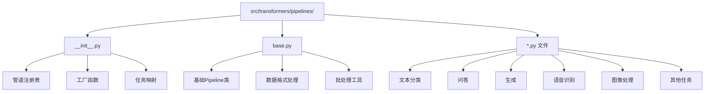

**图表来源**
- [src/transformers/pipelines/__init__.py](file://src/transformers/pipelines/__init__.py#L1-L50)
- [src/transformers/pipelines/base.py](file://src/transformers/pipelines/base.py#L1-L50)

**章节来源**
- [src/transformers/pipelines/__init__.py](file://src/transformers/pipelines/__init__.py#L1-L100)
- [src/transformers/pipelines/base.py](file://src/transformers/pipelines/base.py#L1-L100)

## 核心组件

### PipelineRegistry - 管道注册表

PipelineRegistry负责管理和维护所有可用的任务类型及其对应的Pipeline实现：

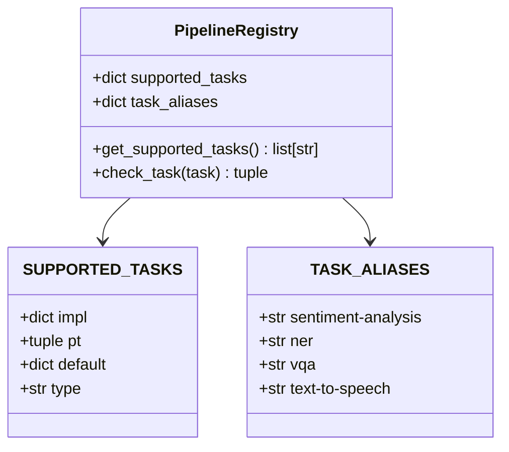

**图表来源**
- [src/transformers/pipelines/__init__.py](file://src/transformers/pipelines/__init__.py#L130-L150)

### 基础Pipeline类

所有具体Pipeline都继承自基础Pipeline类，该类定义了通用的接口和工作流程：

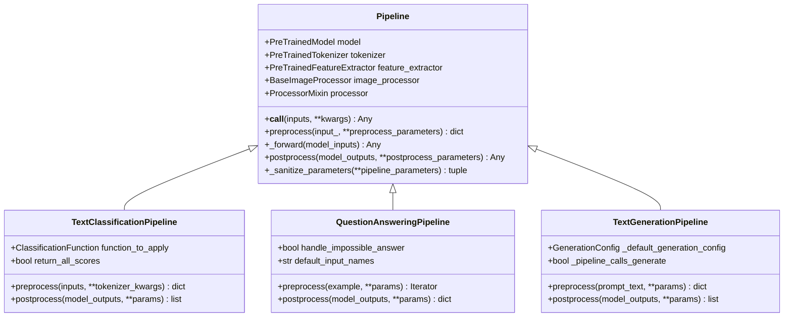

**图表来源**
- [src/transformers/pipelines/base.py](file://src/transformers/pipelines/base.py#L700-L800)
- [src/transformers/pipelines/text_classification.py](file://src/transformers/pipelines/text_classification.py#L50-L100)
- [src/transformers/pipelines/question_answering.py](file://src/transformers/pipelines/question_answering.py#L200-L250)
- [src/transformers/pipelines/text_generation.py](file://src/transformers/pipelines/text_generation.py#L50-L100)

**章节来源**
- [src/transformers/pipelines/base.py](file://src/transformers/pipelines/base.py#L700-L900)
- [src/transformers/pipelines/text_classification.py](file://src/transformers/pipelines/text_classification.py#L50-L150)

## 架构概览

Pipeline系统采用分层架构设计，从上到下包括：

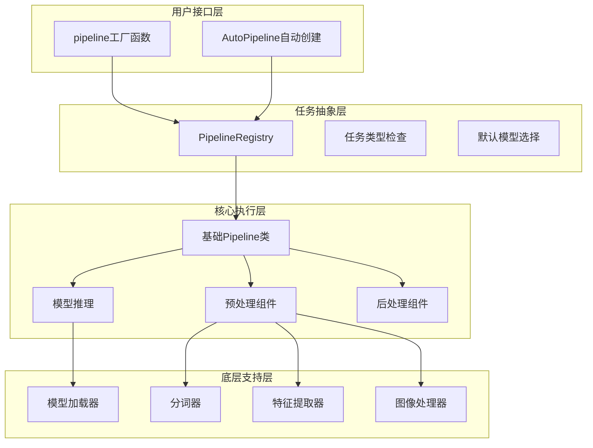

**图表来源**
- [src/transformers/pipelines/__init__.py](file://src/transformers/pipelines/__init__.py#L500-L600)
- [src/transformers/pipelines/base.py](file://src/transformers/pipelines/base.py#L1100-L1200)

## 详细组件分析

### 文本分类Pipeline

文本分类Pipeline专门用于情感分析、主题分类等任务：

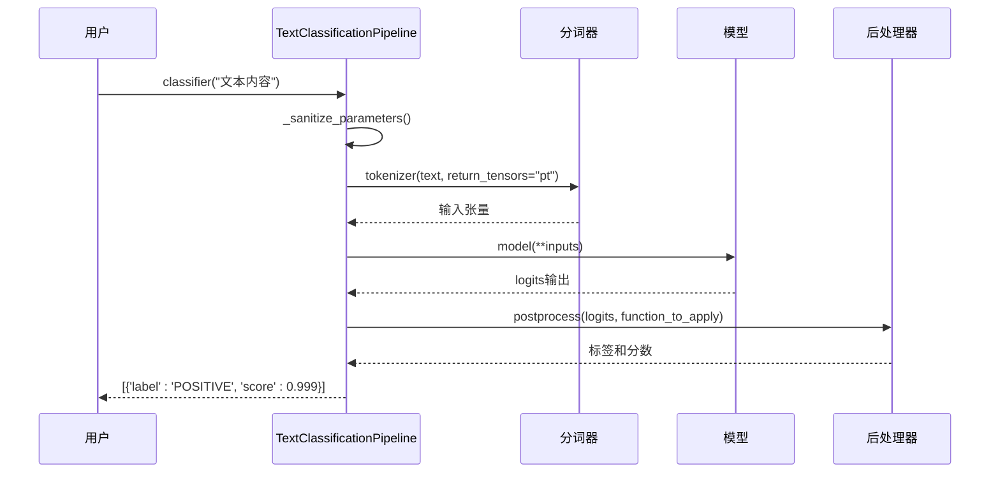

**图表来源**
- [src/transformers/pipelines/text_classification.py](file://src/transformers/pipelines/text_classification.py#L150-L200)

### 问答Pipeline

问答Pipeline处理抽取式问答任务：

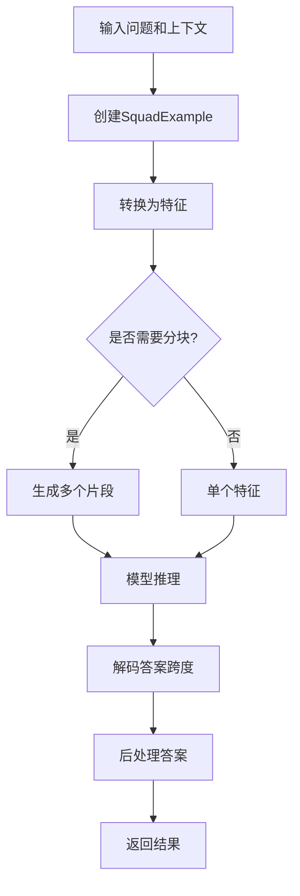

**图表来源**
- [src/transformers/pipelines/question_answering.py](file://src/transformers/pipelines/question_answering.py#L400-L500)

### 文本生成Pipeline

文本生成Pipeline支持对话和自由文本生成：

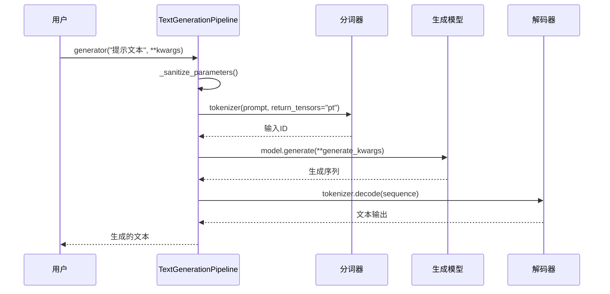

**图表来源**
- [src/transformers/pipelines/text_generation.py](file://src/transformers/pipelines/text_generation.py#L300-L400)

**章节来源**
- [src/transformers/pipelines/text_classification.py](file://src/transformers/pipelines/text_classification.py#L150-L236)
- [src/transformers/pipelines/question_answering.py](file://src/transformers/pipelines/question_answering.py#L400-L600)
- [src/transformers/pipelines/text_generation.py](file://src/transformers/pipelines/text_generation.py#L300-L540)

## 工厂模式实现

Pipeline系统采用工厂模式，通过`pipeline()`函数自动创建合适的Pipeline实例：

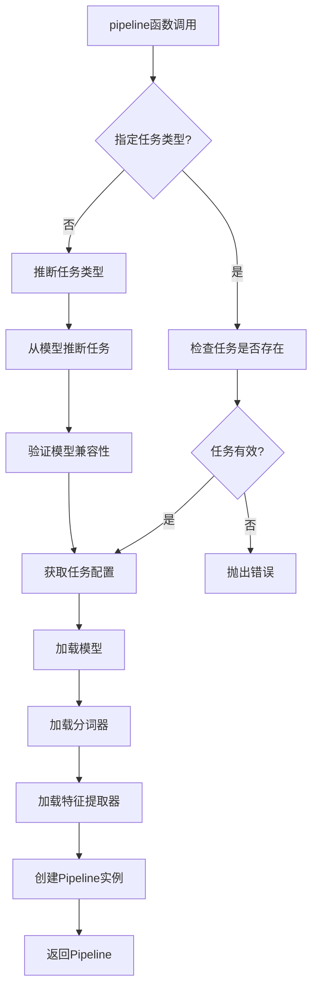

**图表来源**
- [src/transformers/pipelines/__init__.py](file://src/transformers/pipelines/__init__.py#L500-L600)

### AutoPipeline自动创建

AutoPipeline提供了更高级的自动化功能：

```python
# 自动检测任务类型
classifier = pipeline("sentiment-analysis")  # 自动选择文本分类
qa = pipeline("question-answering")         # 自动选择问答
generator = pipeline("text-generation")      # 自动选择生成
```

**章节来源**
- [src/transformers/pipelines/__init__.py](file://src/transformers/pipelines/__init__.py#L500-L800)

## 输入输出处理机制

### 预处理流程

每个Pipeline都有专门的预处理逻辑来准备模型输入：

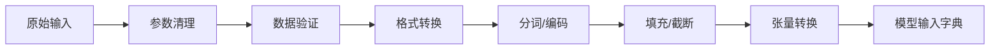

### 后处理流程

后处理负责将模型输出转换为人类可读的结果：

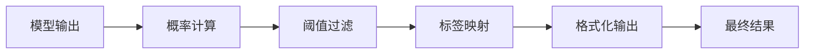

**章节来源**
- [src/transformers/pipelines/base.py](file://src/transformers/pipelines/base.py#L1100-L1300)

## 内部执行流程

Pipeline的完整执行流程遵循标准化的工作流：

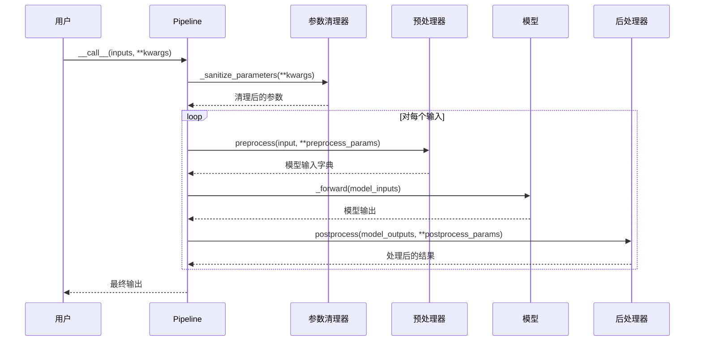

**图表来源**
- [src/transformers/pipelines/base.py](file://src/transformers/pipelines/base.py#L1200-L1300)

### 批处理机制

Pipeline支持高效的批处理以提高性能：

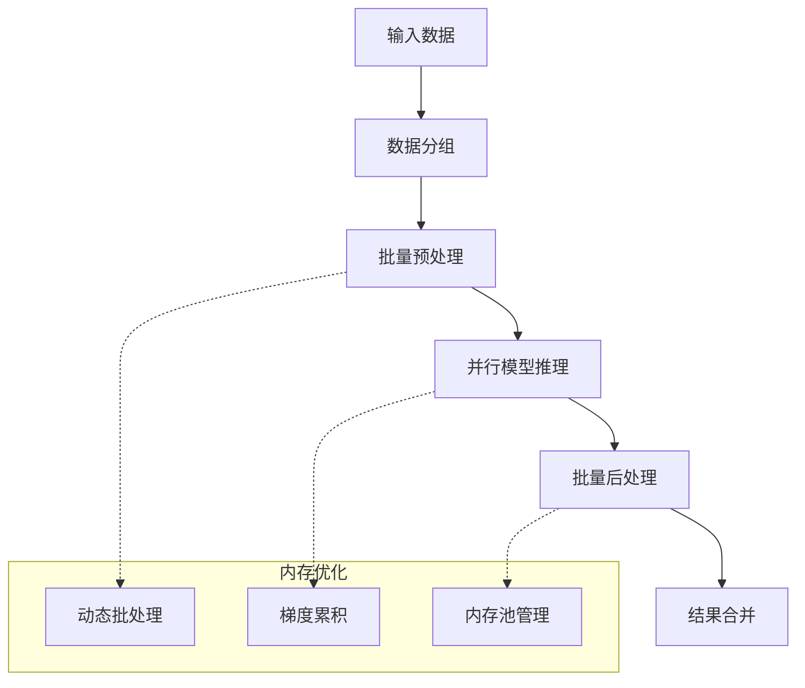

**图表来源**
- [src/transformers/pipelines/pt_utils.py](file://src/transformers/pipelines/pt_utils.py#L200-L300)

**章节来源**
- [src/transformers/pipelines/base.py](file://src/transformers/pipelines/base.py#L1200-L1400)
- [src/transformers/pipelines/pt_utils.py](file://src/transformers/pipelines/pt_utils.py#L200-L400)

## 性能优化

### 内存优化策略

1. **动态批处理**：根据可用内存动态调整批次大小
2. **梯度检查点**：在推理时减少内存使用
3. **混合精度**：使用FP16/BF16降低内存占用
4. **模型量化**：支持INT8/INT4量化

### 推理优化技术

1. **KV缓存**：在生成任务中重用键值对
2. **注意力优化**：使用Flash Attention等高效算法
3. **并行处理**：多GPU和分布式推理
4. **编译优化**：使用TorchScript或ONNX

### 批处理最佳实践

```python
# 使用批处理提高效率
results = pipeline(
    "text-classification",
    model="distilbert-base-uncased-finetuned-sst-2-english",
    batch_size=32,
    device=0
)
```

## 故障排除指南

### 常见问题及解决方案

#### 1. 内存不足错误

**问题**：CUDA out of memory
**解决方案**：
- 减少批次大小
- 使用混合精度训练
- 启用梯度检查点
- 使用CPU卸载

#### 2. 输入格式不匹配

**问题**：输入数据类型错误
**解决方案**：
- 检查输入格式是否符合Pipeline要求
- 使用正确的数据类型（字符串、列表、字典等）
- 验证模型支持的输入长度限制

#### 3. 性能问题

**问题**：推理速度慢
**解决方案**：
- 启用GPU加速
- 使用更大的批次大小
- 优化模型配置
- 考虑使用量化模型

#### 4. 输出质量差

**问题**：生成结果不理想
**解决方案**：
- 调整生成参数（temperature、top_k等）
- 使用更好的预训练模型
- 优化输入提示（prompt engineering）
- 实施后处理过滤

### 调试技巧

1. **启用详细日志**：设置`logging.set_verbosity(logging.INFO)`
2. **检查中间结果**：使用`preprocess`和`postprocess`参数
3. **验证模型兼容性**：确保模型与Pipeline匹配
4. **监控资源使用**：跟踪内存和GPU使用情况

**章节来源**
- [src/transformers/pipelines/base.py](file://src/transformers/pipelines/base.py#L1300-L1400)

## 结论

Pipeline API是Hugging Face Transformers库的核心创新之一，它成功地将复杂的机器学习任务抽象为简单易用的接口。通过工厂模式、标准化的工作流程和强大的扩展能力，Pipeline系统为用户提供了：

- **统一的API体验**：无论任务类型如何，使用方式保持一致
- **自动化的组件管理**：自动选择和配置合适的预处理组件
- **高性能的执行引擎**：内置批处理、内存优化和并行处理
- **灵活的扩展机制**：支持自定义Pipeline和组件

对于初学者，Pipeline提供了快速上手的途径；对于经验丰富的开发者，它提供了深度定制和性能优化的能力。随着Transformer技术的不断发展，Pipeline系统将继续演进，为更多任务类型提供支持，成为机器学习应用开发的重要基础设施。