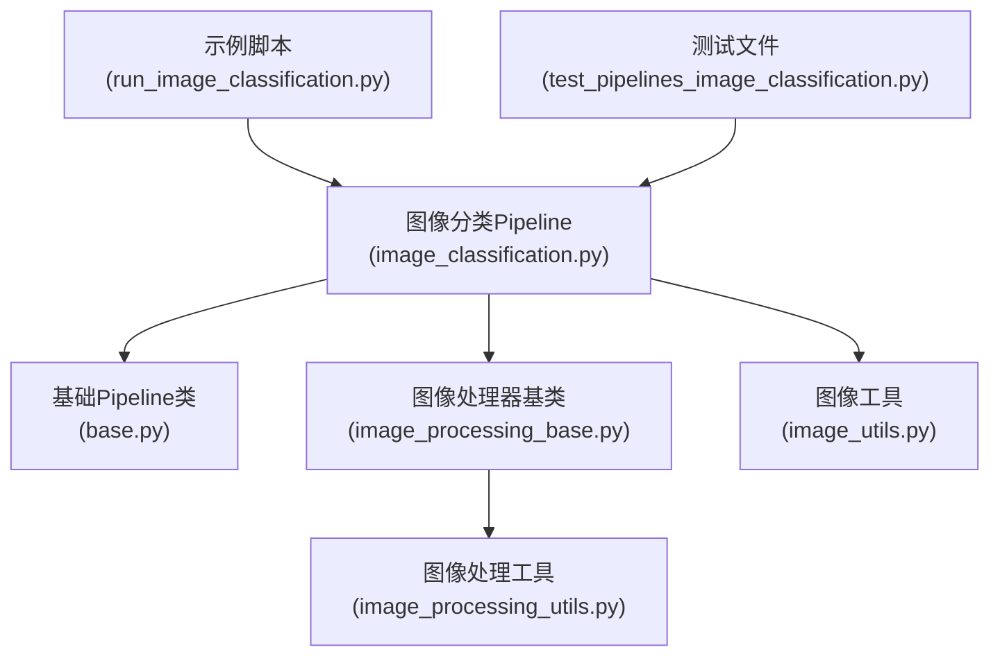
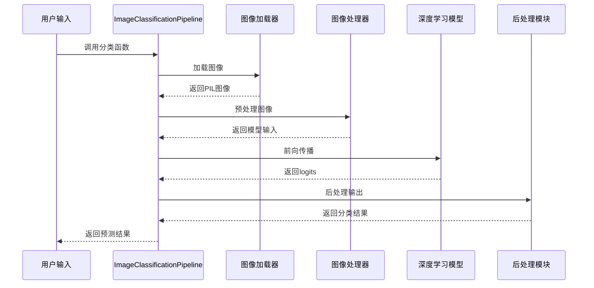
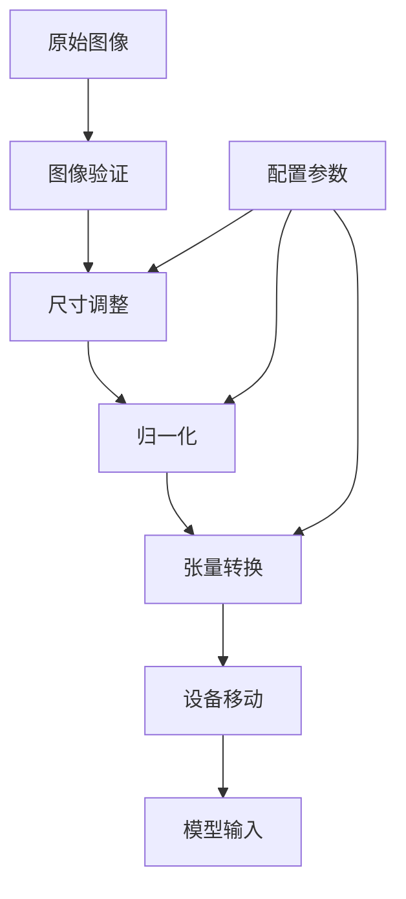
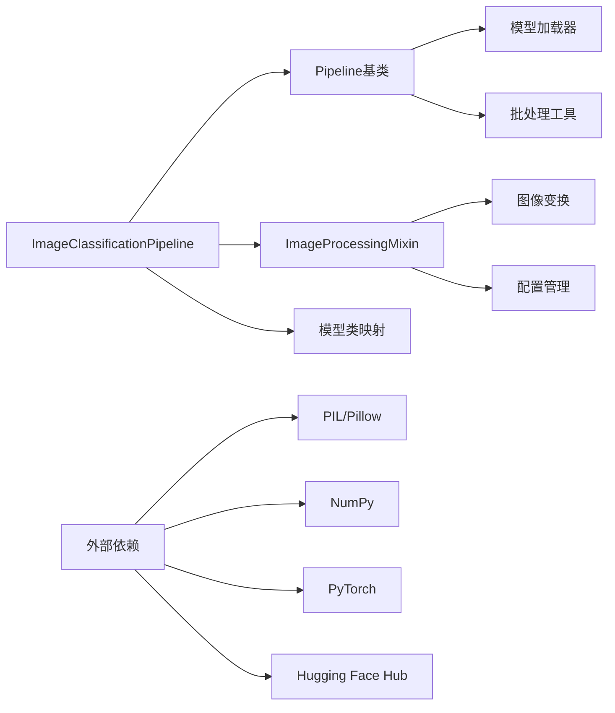

# 图像分类Pipeline详细文档

<cite>
**本文档中引用的文件**
- [image_classification.py](file://src/transformers/pipelines/image_classification.py)
- [base.py](file://src/transformers/pipelines/base.py)
- [image_processing_base.py](file://src/transformers/image_processing_base.py)
- [image_processing_utils.py](file://src/transformers/image_processing_utils.py)
- [image_utils.py](file://src/transformers/image_utils.py)
- [run_image_classification.py](file://examples/pytorch/image-classification/run_image_classification.py)
- [test_pipelines_image_classification.py](file://tests/pipelines/test_pipelines_image_classification.py)
</cite>

## 目录
1. [简介](#简介)
2. [项目结构](#项目结构)
3. [核心组件](#核心组件)
4. [架构概览](#架构概览)
5. [详细组件分析](#详细组件分析)
6. [依赖关系分析](#依赖关系分析)
7. [性能考虑](#性能考虑)
8. [故障排除指南](#故障排除指南)
9. [结论](#结论)

## 简介

图像分类Pipeline是Hugging Face Transformers库中的一个强大工具，专门用于执行图像识别任务。它提供了一个统一的接口，可以对单张或批量图像进行分类，支持多种输入格式，并集成了先进的预处理和后处理功能。

该Pipeline的核心优势包括：
- 支持多种图像输入格式（本地路径、URL、PIL图像对象）
- 自动化的图像预处理和模型输入转换
- 灵活的输出控制（top-k预测、函数应用选择）
- 高度可配置的图像处理器集成
- 性能优化选项（混合精度、量化支持）

## 项目结构

图像分类Pipeline的实现分布在多个模块中，形成了一个层次化的架构：



**图表来源**
- [image_classification.py](file://src/transformers/pipelines/image_classification.py#L1-L50)
- [base.py](file://src/transformers/pipelines/base.py#L1-L50)
- [image_processing_base.py](file://src/transformers/image_processing_base.py#L1-L50)

**章节来源**
- [image_classification.py](file://src/transformers/pipelines/image_classification.py#L1-L230)
- [base.py](file://src/transformers/pipelines/base.py#L1-L100)

## 核心组件

### ImageClassificationPipeline类

这是图像分类Pipeline的主要实现类，继承自基础Pipeline类，提供了完整的图像分类功能。

#### 主要特性
- **多输入支持**：接受字符串路径、URL链接或PIL图像对象
- **批量处理**：支持单张和批量图像分类
- **灵活输出**：可配置top-k结果数量和输出格式
- **自动类型检测**：智能识别和处理不同类型的图像输入

#### 关键属性
- `_load_processor = False`：不加载通用处理器
- `_load_image_processor = True`：必须加载图像处理器
- `_load_feature_extractor = False`：不加载特征提取器
- `_load_tokenizer = False`：不加载分词器

**章节来源**
- [image_classification.py](file://src/transformers/pipelines/image_classification.py#L77-L105)

### 图像处理器系统

图像处理器负责将原始图像转换为模型可接受的格式，包括：

#### 处理器类型
- **BaseImageProcessor**：基础图像处理器类
- **ImageProcessingMixin**：图像处理混入类
- **BatchFeature**：批处理特征容器

#### 核心方法
- `preprocess()`：图像预处理
- `rescale()`：图像重缩放
- `normalize()`：图像标准化
- `center_crop()`：中心裁剪

**章节来源**
- [image_processing_base.py](file://src/transformers/image_processing_base.py#L1-L100)
- [image_processing_utils.py](file://src/transformers/image_processing_utils.py#L1-L100)

## 架构概览

图像分类Pipeline采用经典的管道模式，包含以下主要阶段：



**图表来源**
- [image_classification.py](file://src/transformers/pipelines/image_classification.py#L175-L230)
- [base.py](file://src/transformers/pipelines/base.py#L800-L900)

## 详细组件分析

### 输入处理流程

图像分类Pipeline支持三种主要的输入格式：

#### 1. 本地文件路径
```python
# 示例：本地图片文件
classifier("path/to/image.jpg")
```

#### 2. 网络URL
```python
# 示例：网络图片链接
classifier("https://example.com/image.jpg")
```

#### 3. PIL图像对象
```python
# 示例：PIL图像对象
from PIL import Image
img = Image.open("image.jpg")
classifier(img)
```

#### 批量处理
```python
# 示例：批量图像处理
images = ["img1.jpg", "img2.jpg", "img3.jpg"]
results = classifier(images)
```

**章节来源**
- [image_classification.py](file://src/transformers/pipelines/image_classification.py#L115-L170)

### 预处理步骤详解

#### 图像加载和验证
Pipeline使用`load_image`函数处理各种图像输入格式，确保图像的有效性和一致性。

#### 图像处理器集成
图像处理器负责将原始图像转换为模型所需的张量格式：



**图表来源**
- [image_classification.py](file://src/transformers/pipelines/image_classification.py#L175-L185)

**章节来源**
- [image_classification.py](file://src/transformers/pipelines/image_classification.py#L175-L185)
- [image_utils.py](file://src/transformers/image_utils.py#L1-L100)

### 模型输出处理

#### 分类函数选择
Pipeline根据模型配置自动选择合适的分类函数：

| 模型类型 | 默认函数 | 说明 |
|---------|---------|------|
| 单标签分类 | softmax | 计算所有类别的概率分布 |
| 多标签分类 | sigmoid | 对每个标签独立计算概率 |
| 回归任务 | none | 不应用任何激活函数 |

#### Top-K结果生成
用户可以通过`top_k`参数控制返回的预测数量：

```python
# 示例：只返回前3个预测结果
results = classifier(image, top_k=3)
```

#### 输出格式
每个预测结果包含两个字段：
- `label`：预测的类别标签
- `score`：对应的置信度分数

**章节来源**
- [image_classification.py](file://src/transformers/pipelines/image_classification.py#L185-L230)

### 高级配置选项

#### 函数应用控制
用户可以手动指定输出函数：

```python
# 示例：强制使用sigmoid函数
results = classifier(image, function_to_apply="sigmoid")

# 示例：不应用任何函数
results = classifier(image, function_to_apply="none")
```

#### 超时设置
对于网络图像，可以设置加载超时：

```python
# 示例：设置5秒超时
results = classifier(url, timeout=5.0)
```

**章节来源**
- [image_classification.py](file://src/transformers/pipelines/image_classification.py#L107-L115)

## 依赖关系分析

图像分类Pipeline的依赖关系体现了模块化设计的优势：



**图表来源**
- [image_classification.py](file://src/transformers/pipelines/image_classification.py#L1-L30)
- [base.py](file://src/transformers/pipelines/base.py#L1-L50)

### 关键依赖项

#### 内部依赖
- **Pipeline基类**：提供通用的管道功能
- **图像处理器**：负责图像预处理
- **模型映射**：支持多种图像分类模型

#### 外部依赖
- **PIL/Pillow**：图像处理和格式转换
- **NumPy**：数值计算和数组操作
- **PyTorch**：深度学习框架
- **Hugging Face Hub**：模型和数据加载

**章节来源**
- [image_classification.py](file://src/transformers/pipelines/image_classification.py#L1-L30)
- [base.py](file://src/transformers/pipelines/base.py#L1-L50)

## 性能考虑

### 混合精度推理

图像分类Pipeline支持多种精度模式以优化性能：

#### 支持的精度类型
- **float32**（默认）：最高精度，最大兼容性
- **float16**：半精度，显著减少内存使用
- **bfloat16**：脑浮点精度，平衡精度和性能

#### 使用示例
```python
# 使用半精度推理
classifier = pipeline("image-classification", 
                     model="model_name", 
                     dtype=torch.float16)

# 使用脑浮点精度
classifier = pipeline("image-classification", 
                     model="model_name", 
                     dtype=torch.bfloat16)
```

### 模型量化支持

虽然图像分类Pipeline本身不直接处理量化，但它与量化工具完全兼容：

#### 可用量化方法
- **INT8量化**：8位整数量化，大幅减少模型大小
- **FP16量化**：16位浮点量化
- **动态量化**：运行时量化

#### 量化配置示例
```python
# 示例：使用量化配置
from transformers import BitsAndBytesConfig

quantization_config = BitsAndBytesConfig(
    load_in_8bit=True,
    llm_int8_threshold=6.0
)

classifier = pipeline("image-classification",
                     model="model_name",
                     quantization_config=quantization_config)
```

### 批量处理优化

#### 批处理策略
- **自动批处理**：Pipeline会自动将多个图像打包成批次
- **内存管理**：智能的内存分配和释放
- **并发处理**：支持GPU并行处理

#### 性能调优建议
1. **合理设置批次大小**：根据GPU内存调整
2. **使用适当的精度**：在精度和速度间找到平衡
3. **启用混合精度**：利用现代GPU的Tensor Core
4. **预加载模型**：避免重复的模型加载开销

## 故障排除指南

### 常见问题及解决方案

#### 1. 图像格式错误
**问题**：无法识别或加载图像文件

**解决方案**：
```python
# 检查图像格式
from PIL import Image
try:
    img = Image.open("image.jpg")
    img.verify()  # 验证图像文件完整性
except Exception as e:
    print(f"图像格式错误: {e}")
```

#### 2. 内存不足
**问题**：处理大图像或大批量图像时出现内存溢出

**解决方案**：
```python
# 方法1：降低图像分辨率
processor = AutoImageProcessor.from_pretrained(model_name)
processor.size = {"height": 224, "width": 224}

# 方法2：使用更小的批次大小
results = classifier(images, batch_size=1)
```

#### 3. 模型加载失败
**问题**：无法从Hugging Face Hub下载模型

**解决方案**：
```python
# 方法1：检查网络连接
# 方法2：使用本地缓存
classifier = pipeline("image-classification",
                     model="model_name",
                     cache_dir="./model_cache")
```

#### 4. 输出格式异常
**问题**：返回的结果格式不符合预期

**解决方案**：
```python
# 检查top_k设置
results = classifier(image, top_k=5)

# 指定输出函数
results = classifier(image, function_to_apply="softmax")
```

### 调试技巧

#### 1. 启用详细日志
```python
import logging
logging.basicConfig(level=logging.DEBUG)
```

#### 2. 检查中间结果
```python
# 手动预处理查看中间结果
processor = AutoImageProcessor.from_pretrained(model_name)
processed = processor(images, return_tensors="pt")
print(processed)
```

#### 3. 验证模型配置
```python
# 检查模型配置
model_config = AutoConfig.from_pretrained(model_name)
print(f"模型类别数: {model_config.num_labels}")
print(f"问题类型: {model_config.problem_type}")
```

**章节来源**
- [test_pipelines_image_classification.py](file://tests/pipelines/test_pipelines_image_classification.py#L1-L100)

## 结论

图像分类Pipeline是Hugging Face Transformers库中一个功能强大且易于使用的工具，它简化了图像分类任务的执行过程。通过其模块化的架构设计，用户可以轻松地进行图像分类，同时获得高度的灵活性和可扩展性。

### 主要优势
1. **易用性**：简洁的API设计，支持多种输入格式
2. **灵活性**：丰富的配置选项和自定义能力
3. **性能**：支持多种优化技术，包括混合精度和量化
4. **可靠性**：完善的错误处理和调试支持

### 最佳实践建议
1. **选择合适的模型**：根据具体任务需求选择预训练模型
2. **优化配置**：根据硬件条件调整精度和批次大小
3. **错误处理**：实现适当的异常处理机制
4. **性能监控**：定期评估和优化推理性能

通过遵循本文档提供的指导原则和最佳实践，开发者可以充分利用图像分类Pipeline的强大功能，构建高效可靠的图像识别应用程序。