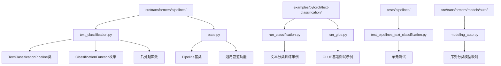
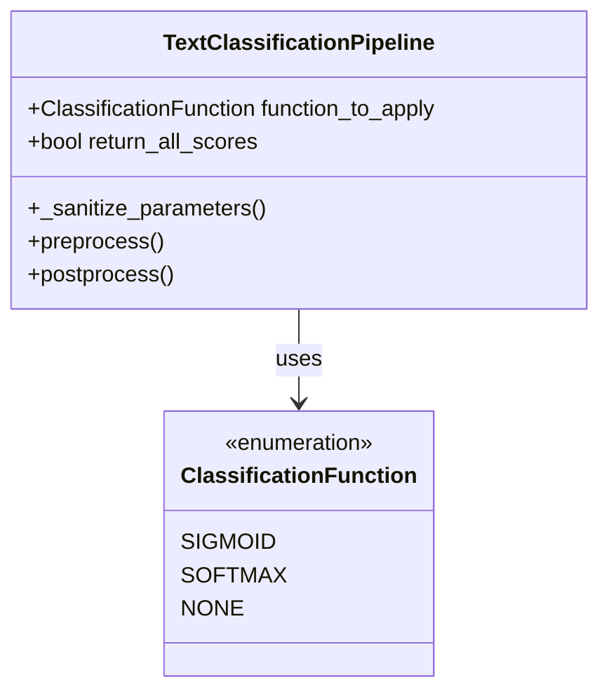
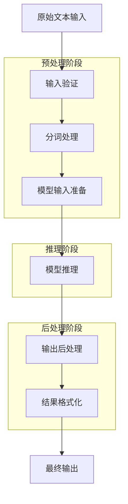
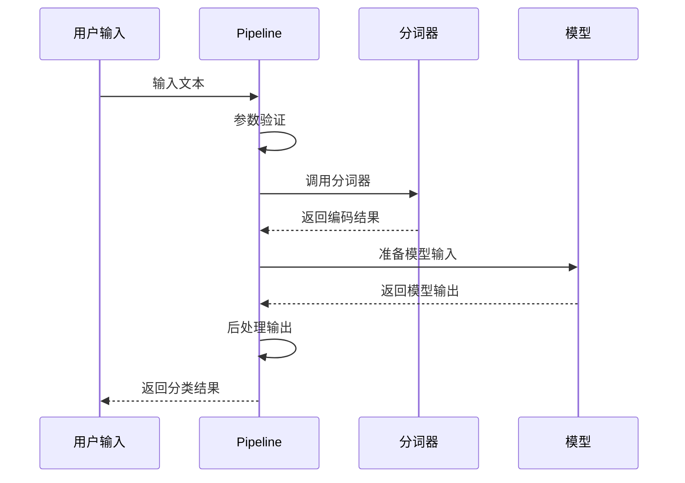
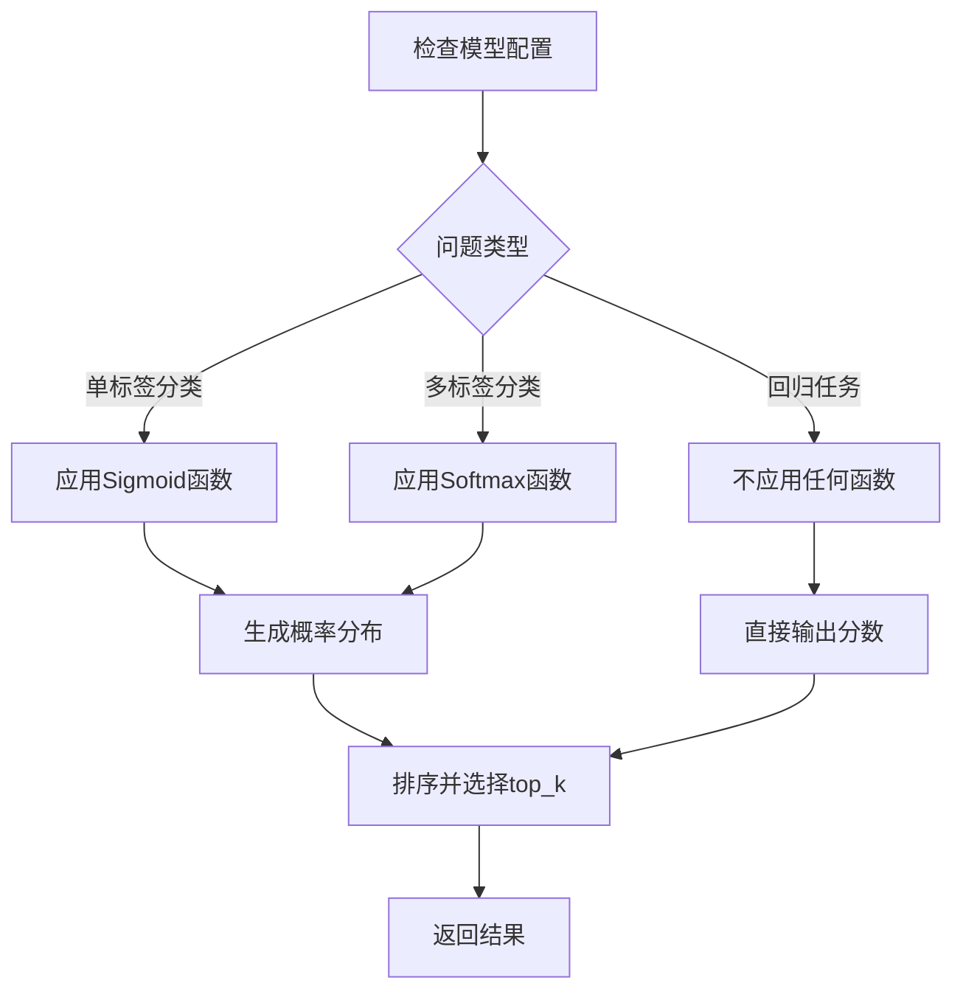
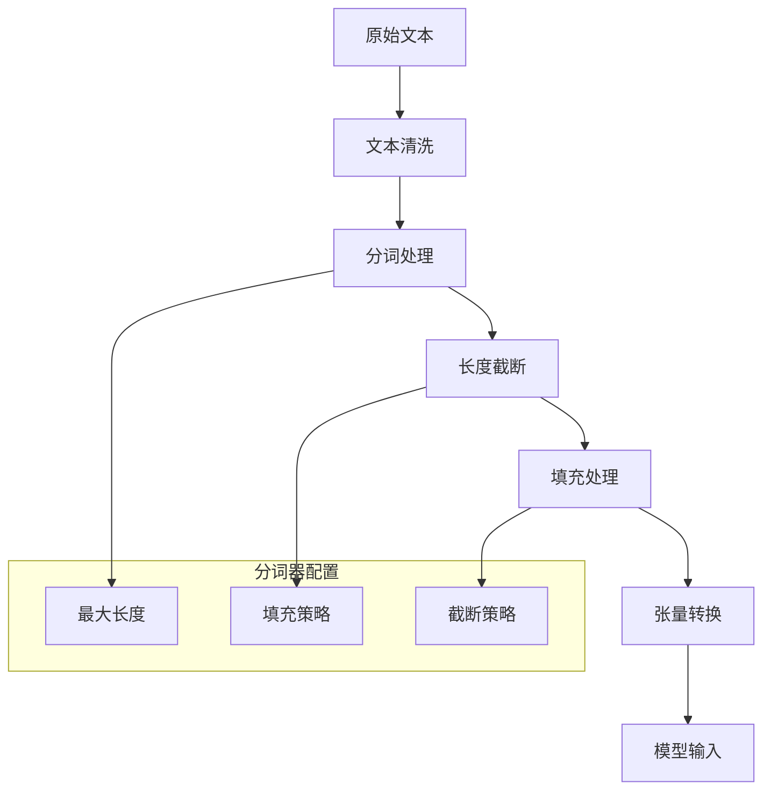
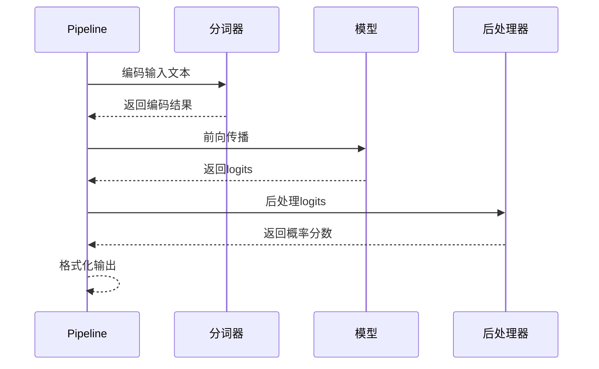

# 文本分类Pipeline详细文档

<cite>
**本文档中引用的文件**
- [text_classification.py](file://src/transformers/pipelines/text_classification.py)
- [base.py](file://src/transformers/pipelines/base.py)
- [__init__.py](file://src/transformers/pipelines/__init__.py)
- [run_classification.py](file://examples/pytorch/text-classification/run_classification.py)
- [run_glue.py](file://examples/pytorch/text-classification/run_glue.py)
- [test_pipelines_text_classification.py](file://tests/pipelines/test_pipelines_text_classification.py)
- [modeling_auto.py](file://src/transformers/models/auto/modeling_auto.py)
</cite>

## 目录
1. [简介](#简介)
2. [项目结构](#项目结构)
3. [核心组件](#核心组件)
4. [架构概览](#架构概览)
5. [详细组件分析](#详细组件分析)
6. [输入数据格式](#输入数据格式)
7. [预处理流程](#预处理流程)
8. [模型推理过程](#模型推理过程)
9. [输出结果结构](#输出结果结构)
10. [配置选项详解](#配置选项详解)
11. [实际代码示例](#实际代码示例)
12. [性能优化建议](#性能优化建议)
13. [常见问题解决方案](#常见问题解决方案)
14. [故障排除指南](#故障排除指南)
15. [结论](#结论)

## 简介

文本分类Pipeline是Hugging Face Transformers库中的一个强大工具，专门用于执行各种文本分类任务，包括情感分析、垃圾邮件检测、主题分类等。该Pipeline基于`ModelForSequenceClassification`架构，提供了简单易用的接口来加载预训练模型并进行文本分类。

### 主要特性

- **多任务支持**：支持单标签分类、多标签分类和回归任务
- **灵活的输入格式**：接受字符串、列表或字典形式的输入
- **丰富的配置选项**：提供多种参数来自定义分类行为
- **高性能推理**：支持GPU加速和批处理优化
- **广泛的模型兼容性**：与多种预训练模型无缝集成

## 项目结构

文本分类Pipeline的代码组织结构清晰，主要分布在以下目录中：



**图表来源**
- [text_classification.py](file://src/transformers/pipelines/text_classification.py#L1-L50)
- [base.py](file://src/transformers/pipelines/base.py#L1-L50)
- [run_classification.py](file://examples/pytorch/text-classification/run_classification.py#L1-L50)

## 核心组件

### TextClassificationPipeline类

这是文本分类Pipeline的核心类，继承自基础Pipeline类，提供了专门针对序列分类任务的功能。

#### 主要属性

| 属性名 | 类型 | 默认值 | 描述 |
|--------|------|--------|------|
| `_load_tokenizer` | bool | True | 是否加载分词器 |
| `return_all_scores` | bool | False | 是否返回所有预测分数 |
| `function_to_apply` | ClassificationFunction | NONE | 应用到模型输出的函数 |

#### 关键方法

- **`__init__()`**：初始化Pipeline，验证模型类型
- **`_sanitize_parameters()`**：参数清理和验证
- **`preprocess()`**：输入预处理
- **`_forward()`**：模型前向传播
- **`postprocess()`**：输出后处理

**章节来源**
- [text_classification.py](file://src/transformers/pipelines/text_classification.py#L50-L100)

### ClassificationFunction枚举

定义了可用的分类函数类型：



**图表来源**
- [text_classification.py](file://src/transformers/pipelines/text_classification.py#L25-L35)

## 架构概览

文本分类Pipeline采用标准的管道架构，遵循"输入 -> 分词 -> 模型推理 -> 后处理 -> 输出"的工作流程：



**图表来源**
- [text_classification.py](file://src/transformers/pipelines/text_classification.py#L150-L235)
- [base.py](file://src/transformers/pipelines/base.py#L700-L800)

## 详细组件分析

### 输入处理组件

#### 输入格式支持

文本分类Pipeline支持多种输入格式：

1. **单个文本**：`"This is a sample text"`
2. **文本列表**：`["Text 1", "Text 2", "Text 3"]`
3. **文本对**：`{"text": "Text A", "text_pair": "Text B"}`
4. **文本对列表**：`[{"text": "A", "text_pair": "B"}, {"text": "C", "text_pair": "D"}]`

#### 预处理流程



**图表来源**
- [text_classification.py](file://src/transformers/pipelines/text_classification.py#L150-L180)

**章节来源**
- [text_classification.py](file://src/transformers/pipelines/text_classification.py#L150-L180)

### 模型推理组件

#### 自动模型选择

Pipeline会根据模型配置自动选择合适的分类函数：



**图表来源**
- [text_classification.py](file://src/transformers/pipelines/text_classification.py#L200-L235)

#### 批处理优化

Pipeline支持批处理以提高推理效率：

- **动态批处理**：根据输入大小自动调整批次
- **内存管理**：智能的内存分配和释放
- **设备优化**：自动在CPU和GPU之间切换

**章节来源**
- [text_classification.py](file://src/transformers/pipelines/text_classification.py#L200-L235)

### 输出处理组件

#### 结果格式化

输出结果采用统一的字典格式：

| 字段名 | 类型 | 描述 |
|--------|------|------|
| `label` | str | 预测的类别标签 |
| `score` | float | 对应的概率分数 |

对于多标签分类，可以返回多个结果：

```python
# 单标签分类
[{"label": "POSITIVE", "score": 0.95}]

# 多标签分类（top_k=2）
[
    {"label": "POSITIVE", "score": 0.85},
    {"label": "NEUTRAL", "score": 0.15}
]
```

**章节来源**
- [text_classification.py](file://src/transformers/pipelines/text_classification.py#L200-L235)

## 输入数据格式

### 基本输入格式

#### 单文本分类

```python
# 基本用法
classifier = pipeline("text-classification")
result = classifier("This is a great product!")

# 输出示例
# [{'label': 'POSITIVE', 'score': 0.999}]
```

#### 多文本分类

```python
# 批量处理
texts = ["I love this!", "This is terrible", "It's okay"]
results = classifier(texts)

# 输出示例
# [
#   {'label': 'POSITIVE', 'score': 0.999},
#   {'label': 'NEGATIVE', 'score': 0.998},
#   {'label': 'NEUTRAL', 'score': 0.6}
# ]
```

#### 文本对分类

```python
# 文本对比较
pair_result = classifier({
    "text": "The movie was amazing",
    "text_pair": "I really enjoyed watching it"
})
```

### 高级输入格式

#### 自定义分词参数

```python
# 添加分词参数
result = classifier(
    "This is a test",
    truncation=True,
    max_length=512,
    padding="max_length"
)
```

#### 批量文本对

```python
# 批量文本对
pairs = [
    {"text": "Positive review", "text_pair": "Good product"},
    {"text": "Negative review", "text_pair": "Bad quality"}
]
results = classifier(pairs)
```

**章节来源**
- [text_classification.py](file://src/transformers/pipelines/text_classification.py#L128-L152)

## 预处理流程

### 分词处理

预处理阶段负责将原始文本转换为模型可理解的数字表示：



**图表来源**
- [text_classification.py](file://src/transformers/pipelines/text_classification.py#L150-L180)

### 文本标准化

预处理器会自动执行以下标准化操作：

1. **大小写转换**：根据模型要求进行大小写处理
2. **特殊字符处理**：移除或替换特殊字符
3. **空格处理**：标准化空白字符
4. **编码转换**：确保正确的字符编码

**章节来源**
- [text_classification.py](file://src/transformers/pipelines/text_classification.py#L150-L180)

## 模型推理过程

### 推理流程



**图表来源**
- [text_classification.py](file://src/transformers/pipelines/text_classification.py#L180-L200)

### 模型兼容性

Pipeline支持多种序列分类模型：

| 模型类型 | 示例模型 | 适用任务 |
|----------|----------|----------|
| BERT系列 | `bert-base-uncased` | 通用文本分类 |
| RoBERTa系列 | `roberta-base` | 高质量分类 |
| DistilBERT | `distilbert-base-uncased` | 轻量级分类 |
| ALBERT | `albert-base-v2` | 参数高效分类 |
| XLNet | `xlnet-base-cased` | 上下文感知分类 |

**章节来源**
- [modeling_auto.py](file://src/transformers/models/auto/modeling_auto.py#L1209-L1301)

## 输出结果结构

### 基本输出格式

每个分类结果都是一个包含两个字段的字典：

```python
{
    "label": "POSITIVE",      # 预测的类别
    "score": 0.999          # 置信度分数
}
```

### 高级输出选项

#### top_k参数

控制返回的结果数量：

```python
# 只返回最高分结果（默认）
result = classifier("Test text", top_k=1)

# 返回前3个结果
results = classifier("Test text", top_k=3)

# 返回所有结果
all_results = classifier("Test text", top_k=None)
```

#### return_all_scores参数（已弃用）

```python
# 已弃用的用法
results = classifier("Test text", return_all_scores=True)

# 新推荐用法
results = classifier("Test text", top_k=None)
```

### 多文本输出结构

对于批量输入，输出结构如下：

```python
# 单文本输出
[{"label": "POSITIVE", "score": 0.95}]

# 多文本输出
[
    {"label": "POSITIVE", "score": 0.95},
    {"label": "NEGATIVE", "score": 0.87},
    {"label": "NEUTRAL", "score": 0.6}
]
```

**章节来源**
- [text_classification.py](file://src/transformers/pipelines/text_classification.py#L128-L152)

## 配置选项详解

### 基础配置参数

#### device参数

指定计算设备：

```python
# 使用CPU
classifier = pipeline("text-classification", device=-1)

# 使用GPU
classifier = pipeline("text-classification", device=0)  # 第一块GPU
classifier = pipeline("text-classification", device=1)  # 第二块GPU

# 使用torch.device对象
import torch
classifier = pipeline("text-classification", device=torch.device("cuda"))
```

#### batch_size参数

控制批处理大小：

```python
# 设置批处理大小
classifier = pipeline("text-classification", batch_size=32)

# 对于小模型，可以使用更大的批次
classifier = pipeline("text-classification", batch_size=64)
```

### 高级配置选项

#### function_to_apply参数

控制输出函数的应用：

```python
# 使用默认函数（根据模型配置自动选择）
classifier = pipeline("text-classification", function_to_apply="default")

# 强制使用Sigmoid函数
classifier = pipeline("text-classification", function_to_apply="sigmoid")

# 强制使用Softmax函数  
classifier = pipeline("text-classification", function_to_apply="softmax")

# 不应用任何函数（直接输出logits）
classifier = pipeline("text-classification", function_to_apply="none")
```

#### 自定义模型配置

```python
from transformers import AutoModelForSequenceClassification, AutoTokenizer

# 加载自定义模型
model = AutoModelForSequenceClassification.from_pretrained("custom-model-path")
tokenizer = AutoTokenizer.from_pretrained("custom-model-path")

# 创建Pipeline
classifier = pipeline(
    "text-classification",
    model=model,
    tokenizer=tokenizer,
    device=0,
    batch_size=16
)
```

**章节来源**
- [text_classification.py](file://src/transformers/pipelines/text_classification.py#L70-L100)

## 实际代码示例

### 基础使用示例

#### 情感分析

```python
from transformers import pipeline

# 创建情感分析Pipeline
sentiment_analyzer = pipeline("sentiment-analysis")

# 基本情感分析
texts = [
    "I love this product! It works perfectly.",
    "This is the worst experience I've ever had.",
    "It's okay, nothing special."
]

results = sentiment_analyzer(texts)
for text, result in zip(texts, results):
    print(f"文本: {text}")
    print(f"情感: {result['label']}, 置信度: {result['score']:.3f}")
    print("---")
```

#### 多标签分类

```python
# 多标签分类示例
classifier = pipeline(
    "text-classification",
    model="joeddav/xlm-roberta-large-xnli",
    top_k=None  # 返回所有标签
)

text = "The government announced new economic policies today."
results = classifier(text)

print(f"文本: {text}")
print("可能的标签:")
for result in results[0]:
    print(f"- {result['label']}: {result['score']:.3f}")
```

### 高级使用示例

#### 文本对比较

```python
# 文本相似度分析
similarity_classifier = pipeline("text-classification")

# 比较两段文本的相似性
text_pairs = [
    {
        "text": "The weather is beautiful today",
        "text_pair": "It's a lovely day outside"
    },
    {
        "text": "I hate waiting in long lines",
        "text_pair": "Waiting takes too much of my time"
    }
]

results = similarity_classifier(text_pairs)
for pair, result in zip(text_pairs, results):
    print(f"文本1: {pair['text']}")
    print(f"文本2: {pair['text_pair']}")
    print(f"相似度: {result['label']} ({result['score']:.3f})")
    print("---")
```

#### 批量处理优化

```python
import time
from transformers import pipeline

# 创建优化的Pipeline
classifier = pipeline(
    "text-classification",
    model="distilbert-base-uncased-finetuned-sst-2-english",
    device=0,  # 使用GPU
    batch_size=32
)

# 测试批量处理性能
texts = ["Sample text " + str(i) for i in range(1000)]

start_time = time.time()
results = classifier(texts)
end_time = time.time()

print(f"处理1000个文本耗时: {end_time - start_time:.2f}秒")
print(f"平均每个文本耗时: {(end_time - start_time) / 1000:.4f}秒")
```

### 微调模型集成

#### 使用自定义微调模型

```python
from transformers import pipeline, AutoModelForSequenceClassification, AutoTokenizer

# 加载微调后的模型
model_name = "your-org/custom-text-classifier"
model = AutoModelForSequenceClassification.from_pretrained(model_name)
tokenizer = AutoTokenizer.from_pretrained(model_name)

# 创建Pipeline
custom_classifier = pipeline(
    "text-classification",
    model=model,
    tokenizer=tokenizer,
    device=0
)

# 使用自定义分类器
custom_texts = [
    "This is a custom category 1 text",
    "This belongs to category 2",
    "Another example for category 3"
]

results = custom_classifier(custom_texts)
for text, result in zip(custom_texts, results):
    print(f"文本: {text}")
    print(f"分类: {result[0]['label']}, 置信度: {result[0]['score']:.3f}")
```

**章节来源**
- [run_classification.py](file://examples/pytorch/text-classification/run_classification.py#L1-L100)
- [run_glue.py](file://examples/pytorch/text-classification/run_glue.py#L1-L100)

## 性能优化建议

### 硬件优化

#### GPU加速

```python
# 启用GPU加速
classifier = pipeline(
    "text-classification",
    device=0,  # 第一块GPU
    torch_dtype="auto"  # 自动选择精度
)

# 使用混合精度
classifier = pipeline(
    "text-classification",
    device=0,
    torch_dtype="float16"  # 半精度浮点数
)
```

#### 内存优化

```python
# 控制批处理大小以优化内存使用
classifier = pipeline(
    "text-classification",
    batch_size=8,  # 较小的批次
    device=0
)

# 对于大模型，进一步减小批次
classifier = pipeline(
    "text-classification",
    batch_size=4,
    device=0
)
```

### 软件优化

#### 模型缓存

```python
# 启用模型缓存
from transformers import pipeline

# 第一次加载会缓存模型
classifier = pipeline("text-classification", model="distilbert-base-uncased-finetuned-sst-2-english")

# 后续使用直接从缓存加载
classifier = pipeline("text-classification", model="distilbert-base-uncased-finetuned-sst-2-english")
```

#### 批量处理策略

```python
def batch_process_texts(classifier, texts, batch_size=32):
    """高效批量处理文本"""
    results = []
    for i in range(0, len(texts), batch_size):
        batch = texts[i:i + batch_size]
        batch_results = classifier(batch)
        results.extend(batch_results)
    return results

# 使用批量处理
texts = ["Text " + str(i) for i in range(1000)]
results = batch_process_texts(classifier, texts)
```

### 模型选择优化

#### 轻量级模型

```python
# 对于实时应用，使用轻量级模型
light_classifier = pipeline(
    "text-classification",
    model="distilbert-base-uncased-finetuned-sst-2-english",
    device=0
)
```

#### 大模型优化

```python
# 对于高精度需求，使用大模型但优化推理
large_classifier = pipeline(
    "text-classification",
    model="roberta-large-openai-detector",
    device=0,
    batch_size=4  # 减小批次以适应显存
)
```

**章节来源**
- [text_classification.py](file://src/transformers/pipelines/text_classification.py#L70-L100)

## 常见问题解决方案

### 长文本处理

#### 文本截断问题

```python
# 解决长文本截断问题
classifier = pipeline(
    "text-classification",
    truncation=True,
    max_length=512  # 设置最大长度
)

# 对于超长文本，可以分段处理
def process_long_text(classifier, text, max_chunk_length=512):
    """处理超长文本"""
    chunks = [text[i:i + max_chunk_length] 
              for i in range(0, len(text), max_chunk_length)]
    
    results = []
    for chunk in chunks:
        result = classifier(chunk)
        results.append(result[0])  # 只取第一个结果
    
    return results
```

#### 文本对长度不匹配

```python
# 处理文本对长度差异
def classify_text_pair(classifier, text1, text2):
    """安全地处理文本对"""
    max_length = 512
    
    # 截断较长的文本
    if len(text1) > max_length:
        text1 = text1[:max_length]
    if len(text2) > max_length:
        text2 = text2[:max_length]
    
    return classifier({
        "text": text1,
        "text_pair": text2
    })
```

### 类别不平衡处理

#### 少数类别的识别

```python
def detect_minority_classes(classifier, texts, threshold=0.7):
    """检测少数类别预测"""
    results = classifier(texts, top_k=None)
    
    minority_predictions = []
    for text, text_results in zip(texts, results):
        # 检查是否有类别置信度超过阈值
        confident_predictions = [
            result for result in text_results 
            if result['score'] > threshold
        ]
        
        if len(confident_predictions) == 0:
            minority_predictions.append(text)
    
    return minority_predictions
```

### 内存和性能问题

#### 内存不足解决

```python
# 减少内存使用的策略
def memory_efficient_classification(classifier, texts, max_texts=100):
    """内存高效的分类"""
    results = []
    
    # 分批处理避免内存溢出
    for i in range(0, len(texts), max_texts):
        batch = texts[i:i + max_texts]
        batch_results = classifier(batch)
        results.extend(batch_results)
        
        # 清理GPU缓存（如果使用GPU）
        if hasattr(classifier, 'device') and classifier.device.type == 'cuda':
            import torch
            torch.cuda.empty_cache()
    
    return results
```

#### 性能监控

```python
import time
import psutil
from transformers import pipeline

def monitor_performance(classifier, texts):
    """监控分类性能"""
    start_time = time.time()
    start_memory = psutil.Process().memory_info().rss / 1024 / 1024  # MB
    
    results = classifier(texts)
    
    end_time = time.time()
    end_memory = psutil.Process().memory_info().rss / 1024 / 1024  # MB
    
    print(f"处理 {len(texts)} 个文本:")
    print(f"耗时: {end_time - start_time:.2f} 秒")
    print(f"平均每个文本: {(end_time - start_time) / len(texts):.4f} 秒")
    print(f"内存使用: {end_memory - start_memory:.2f} MB")
    
    return results
```

**章节来源**
- [text_classification.py](file://src/transformers/pipelines/text_classification.py#L150-L180)

## 故障排除指南

### 常见错误及解决方案

#### 模型加载失败

```python
# 错误：模型下载失败
# 解决方案：检查网络连接和模型路径

try:
    classifier = pipeline("text-classification", model="distilbert-base-uncased-finetuned-sst-2-english")
except Exception as e:
    print(f"加载失败: {e}")
    # 尝试使用本地模型
    classifier = pipeline("text-classification", model="./local-model-path")
```

#### 设备不兼容

```python
# 错误：CUDA设备不可用
# 解决方案：自动回退到CPU

def safe_pipeline_creation(task, model, device=None):
    """安全创建Pipeline"""
    try:
        if device is not None:
            return pipeline(task, model=model, device=device)
        else:
            return pipeline(task, model=model)
    except Exception as e:
        print(f"设备错误: {e}")
        print("尝试使用CPU...")
        return pipeline(task, model=model, device=-1)
```

#### 输入格式错误

```python
# 错误：输入格式不正确
# 解决方案：验证输入格式

def validate_input(texts):
    """验证输入格式"""
    if isinstance(texts, str):
        return [texts]
    elif isinstance(texts, list):
        if all(isinstance(x, str) for x in texts):
            return texts
        elif all(isinstance(x, dict) and "text" in x for x in texts):
            return texts
    raise ValueError("输入格式不正确")

# 安全使用
try:
    validated_texts = validate_input(input_data)
    results = classifier(validated_texts)
except ValueError as e:
    print(f"输入验证失败: {e}")
```

### 调试技巧

#### 逐步调试

```python
def debug_pipeline(classifier, text):
    """调试Pipeline执行流程"""
    print("开始调试...")
    
    # 1. 验证输入
    print(f"输入文本: {text}")
    
    # 2. 检查分词器
    print(f"分词器类型: {type(classifier.tokenizer)}")
    print(f"最大长度: {classifier.tokenizer.model_max_length}")
    
    # 3. 检查模型
    print(f"模型类型: {type(classifier.model)}")
    print(f"类别数量: {classifier.model.config.num_labels}")
    
    # 4. 执行推理
    try:
        result = classifier(text)
        print(f"推理结果: {result}")
        return result
    except Exception as e:
        print(f"推理失败: {e}")
        return None
```

#### 性能分析

```python
import cProfile
import pstats

def profile_pipeline(classifier, texts):
    """性能分析"""
    profiler = cProfile.Profile()
    
    profiler.enable()
    results = classifier(texts)
    profiler.disable()
    
    stats = pstats.Stats(profiler)
    stats.sort_stats('cumulative')
    stats.print_stats(10)  # 显示前10个最耗时的操作
    
    return results
```

**章节来源**
- [text_classification.py](file://src/transformers/pipelines/text_classification.py#L70-L100)

## 结论

文本分类Pipeline是Hugging Face Transformers库中一个功能强大且易于使用的工具，它简化了文本分类任务的实施过程。通过本文档的详细介绍，我们了解了：

### 主要优势

1. **易用性**：简单的API设计，无需复杂的配置
2. **灵活性**：支持多种输入格式和配置选项
3. **性能**：内置优化的批处理和设备管理
4. **兼容性**：与大量预训练模型无缝集成

### 最佳实践总结

1. **选择合适的模型**：根据任务需求和性能要求选择模型
2. **优化配置**：合理设置设备、批次大小等参数
3. **处理边界情况**：妥善处理长文本和异常输入
4. **监控性能**：定期评估和优化推理性能

### 发展方向

随着自然语言处理技术的不断发展，文本分类Pipeline将继续演进，预期会在以下方面有所改进：

- 更高效的模型架构
- 更好的多语言支持
- 更强的上下文理解能力
- 更优的推理速度

通过掌握本文档提供的知识和技巧，用户可以充分发挥文本分类Pipeline的强大功能，在各种文本分类任务中取得优异的成果。