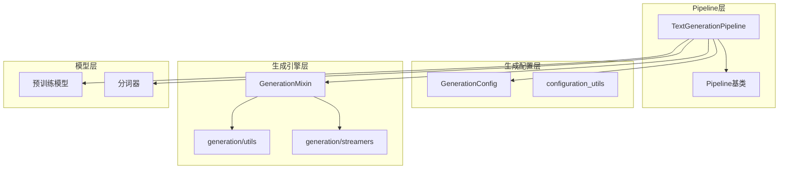
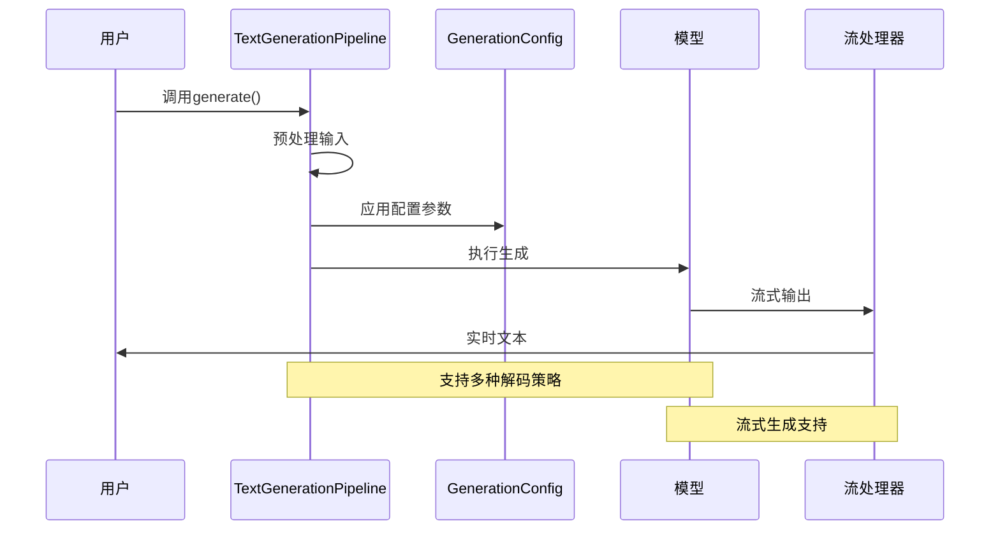
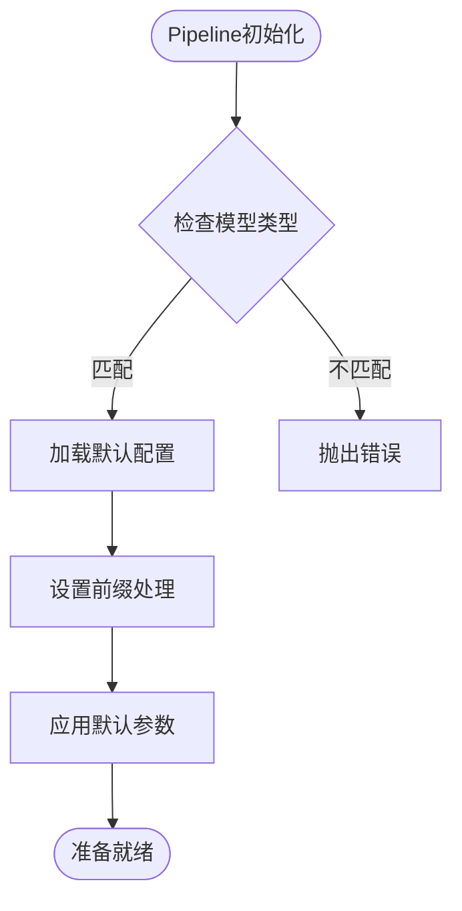
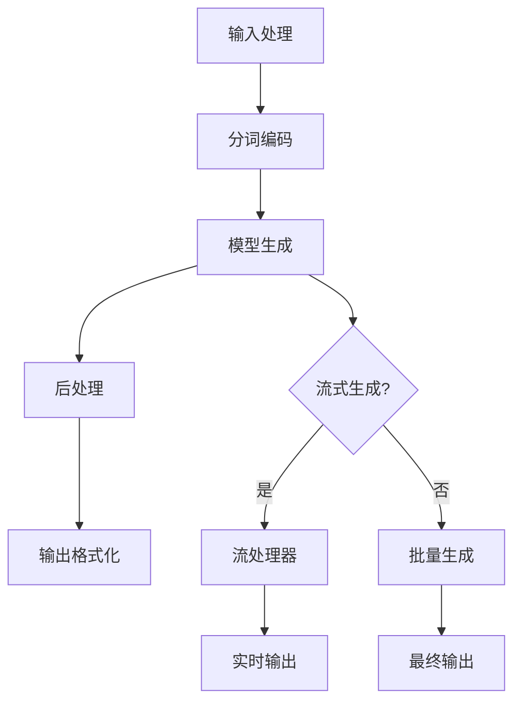
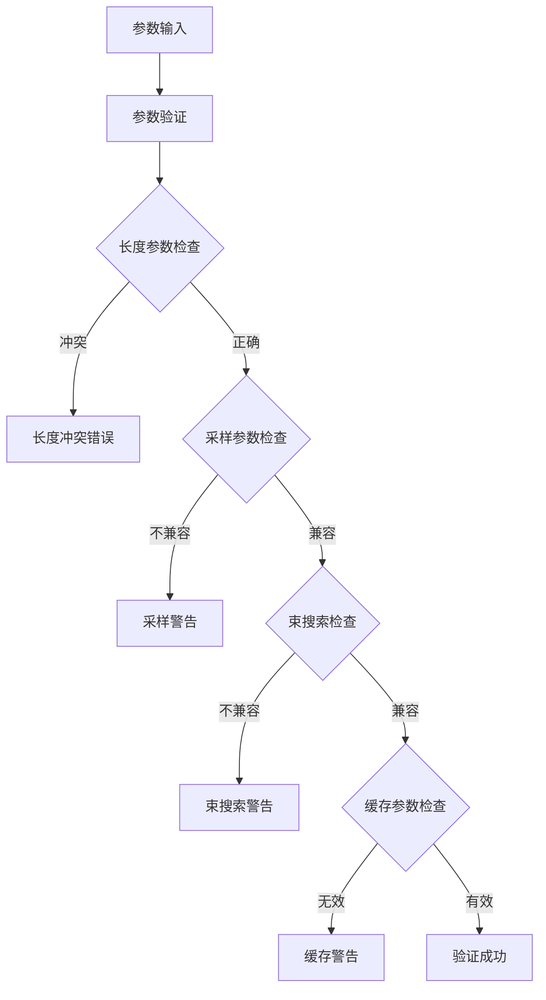
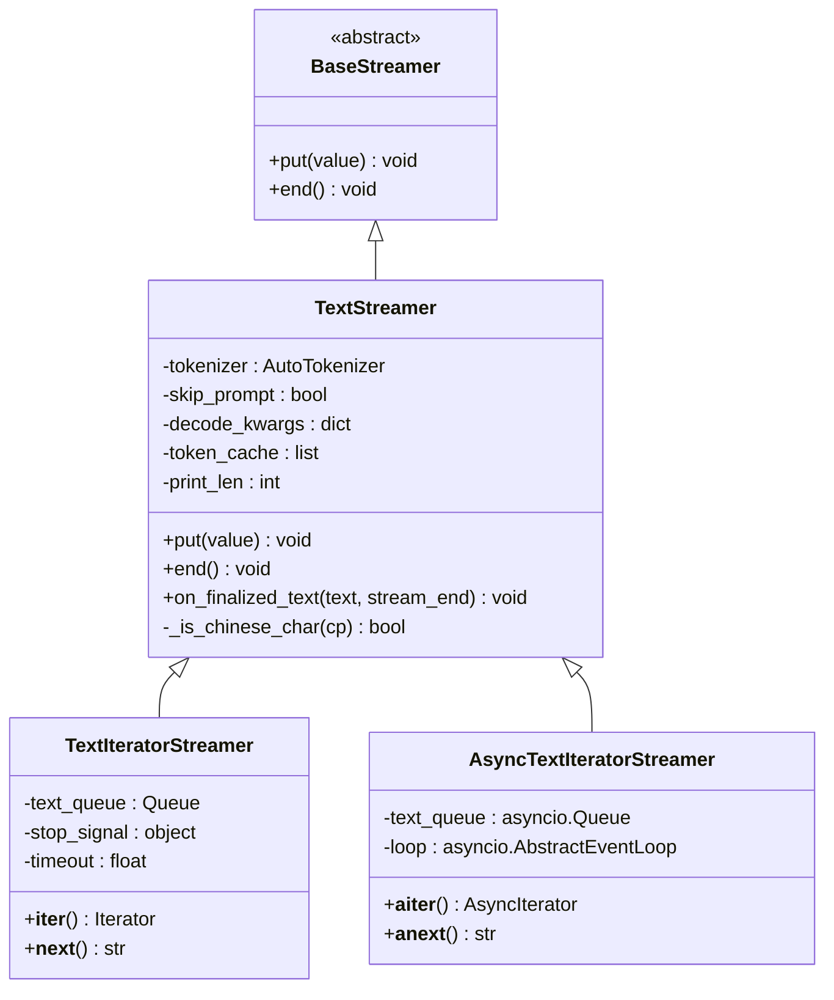
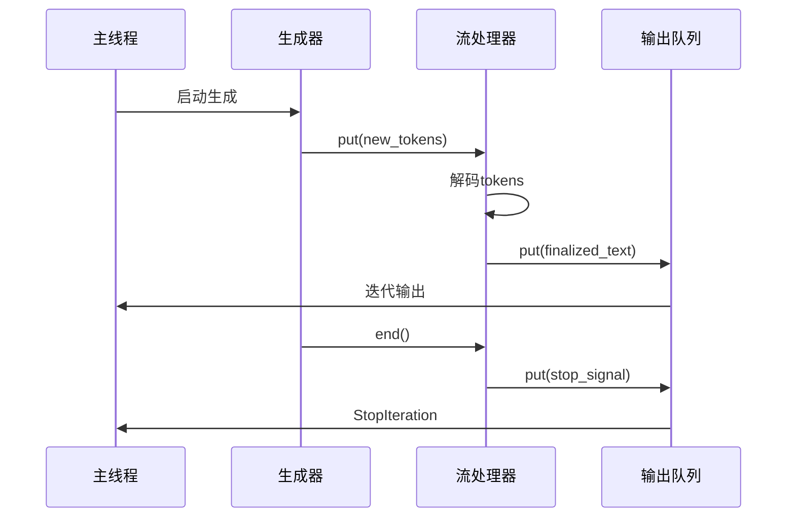

# 文本生成Pipeline详细文档

<cite>
**本文档中引用的文件**
- [text_generation.py](file://src/transformers/pipelines/text_generation.py)
- [configuration_utils.py](file://src/transformers/generation/configuration_utils.py)
- [utils.py](file://src/transformers/generation/utils.py)
- [streamers.py](file://src/transformers/generation/streamers.py)
- [run_generation.py](file://examples/pytorch/text-generation/run_generation.py)
- [test_pipelines_text_generation.py](file://tests/pipelines/test_pipelines_text_generation.py)
</cite>

## 目录
1. [简介](#简介)
2. [项目结构](#项目结构)
3. [核心组件](#核心组件)
4. [架构概览](#架构概览)
5. [详细组件分析](#详细组件分析)
6. [生成配置参数详解](#生成配置参数详解)
7. [实际使用示例](#实际使用示例)
8. [流式生成功能](#流式生成功能)
9. [性能优化技巧](#性能优化技巧)
10. [故障排除指南](#故障排除指南)
11. [总结](#总结)

## 简介

文本生成Pipeline是Hugging Face Transformers库中的核心组件之一，专门用于处理各种语言模型的文本生成任务。它支持从简单的文本补全到复杂的对话生成等多种应用场景，提供了灵活且强大的配置选项来满足不同用户的需求。

该Pipeline基于`GenerationMixin`类构建，集成了先进的生成策略，包括贪婪解码、采样、束搜索等多种解码方法。通过与`GenerationConfig`的深度集成，用户可以精确控制生成过程的各个方面，从基本的长度限制到高级的采样参数调优。

## 项目结构

文本生成Pipeline的实现分布在多个模块中，形成了一个层次化的架构：



**图表来源**
- [text_generation.py](file://src/transformers/pipelines/text_generation.py#L37-L62)
- [configuration_utils.py](file://src/transformers/generation/configuration_utils.py#L106-L122)
- [utils.py](file://src/transformers/generation/utils.py#L400-L500)

**章节来源**
- [text_generation.py](file://src/transformers/pipelines/text_generation.py#L1-L50)
- [configuration_utils.py](file://src/transformers/generation/configuration_utils.py#L1-L100)

## 核心组件

### TextGenerationPipeline类

`TextGenerationPipeline`是整个文本生成系统的核心入口点，继承自基础Pipeline类并实现了特定的文本生成逻辑。

主要特性：
- 支持单个或批量文本输入
- 自动检测和处理聊天格式输入
- 集成前缀处理和长序列截断功能
- 提供多种输出格式选项

### GenerationConfig配置系统

`GenerationConfig`类提供了统一的生成参数管理机制，包含了所有影响生成行为的参数：

- **长度控制参数**：`max_length`, `max_new_tokens`, `min_length`, `min_new_tokens`
- **采样策略参数**：`temperature`, `top_k`, `top_p`, `do_sample`
- **束搜索参数**：`num_beams`, `early_stopping`, `length_penalty`
- **重复控制参数**：`repetition_penalty`, `no_repeat_ngram_size`
- **特殊令牌参数**：`pad_token_id`, `bos_token_id`, `eos_token_id`

### 流式生成系统

流式生成系统通过`BaseStreamer`接口提供实时文本生成能力，支持同步和异步两种模式：

- **TextStreamer**：直接输出到控制台的简单流处理器
- **TextIteratorStreamer**：非阻塞迭代器模式的流处理器
- **AsyncTextIteratorStreamer**：异步迭代器模式的流处理器

**章节来源**
- [text_generation.py](file://src/transformers/pipelines/text_generation.py#L37-L100)
- [configuration_utils.py](file://src/transformers/generation/configuration_utils.py#L106-L200)
- [streamers.py](file://src/transformers/generation/streamers.py#L25-L50)

## 架构概览

文本生成Pipeline采用分层架构设计，确保了良好的可扩展性和维护性：



**图表来源**
- [text_generation.py](file://src/transformers/pipelines/text_generation.py#L200-L300)
- [utils.py](file://src/transformers/generation/utils.py#L400-L500)

## 详细组件分析

### 文本生成Pipeline实现

#### 初始化和配置

Pipeline的初始化过程包括模型类型检查、前缀处理设置和默认配置加载：



**图表来源**
- [text_generation.py](file://src/transformers/pipelines/text_generation.py#L100-L150)

#### 输入预处理

输入预处理阶段负责将原始文本转换为模型可接受的格式：

- **文本输入**：直接编码为token序列
- **聊天输入**：应用聊天模板格式化消息
- **前缀处理**：为特定模型添加上下文前缀
- **长度控制**：处理超长序列的截断策略

#### 生成执行

生成执行阶段是Pipeline的核心，协调模型推理和后处理：



**图表来源**
- [text_generation.py](file://src/transformers/pipelines/text_generation.py#L350-L450)

**章节来源**
- [text_generation.py](file://src/transformers/pipelines/text_generation.py#L100-L200)

### GenerationConfig配置详解

#### 参数分类和作用

GenerationConfig将生成参数按功能分为几个主要类别：

| 参数类别 | 主要参数 | 功能描述 |
|---------|---------|---------|
| **长度控制** | `max_length`, `max_new_tokens`, `min_length`, `min_new_tokens` | 控制生成序列的长度范围 |
| **采样策略** | `temperature`, `top_k`, `top_p`, `do_sample` | 影响生成的随机性和创造性 |
| **束搜索** | `num_beams`, `early_stopping`, `length_penalty` | 控制束搜索的行为和质量 |
| **重复控制** | `repetition_penalty`, `no_repeat_ngram_size` | 防止重复内容生成 |
| **特殊令牌** | `pad_token_id`, `bos_token_id`, `eos_token_id` | 定义特殊标记的ID |

#### 参数验证和约束

GenerationConfig实现了严格的参数验证机制：



**图表来源**
- [configuration_utils.py](file://src/transformers/generation/configuration_utils.py#L600-L700)

**章节来源**
- [configuration_utils.py](file://src/transformers/generation/configuration_utils.py#L106-L300)

### 流式生成系统

#### 基础流处理器

`BaseStreamer`定义了流式生成的基本接口：



**图表来源**
- [streamers.py](file://src/transformers/generation/streamers.py#L25-L100)

#### 流式生成工作流程

流式生成通过多线程或异步方式实现实时文本输出：



**图表来源**
- [streamers.py](file://src/transformers/generation/streamers.py#L150-L250)

**章节来源**
- [streamers.py](file://src/transformers/generation/streamers.py#L25-L150)

## 生成配置参数详解

### 基本长度控制参数

#### max_new_tokens vs max_length

这两个参数控制生成序列的长度，但有不同的优先级和行为：

- **max_new_tokens**：指定最多生成的新token数量（忽略输入长度）
- **max_length**：指定生成序列的总最大长度（包括输入）

当两者都设置时，`max_new_tokens`具有更高优先级。

#### min_new_tokens 和 min_length

这些参数设置了生成序列的最小长度要求，确保生成内容不会过于简短。

### 采样策略参数

#### temperature（温度参数）

温度参数控制生成的随机性：

- **temperature = 1.0**：标准采样，保持原始概率分布
- **temperature < 1.0**：降低随机性，倾向于选择高概率token
- **temperature > 1.0**：增加随机性，允许低概率token被选择

#### top_k 和 top_p（核采样）

这两种方法都是为了限制候选token的选择范围：

- **top_k**：只考虑概率最高的k个token
- **top_p**：累积概率达到p的最小token集合

#### do_sample（是否采样）

决定是否使用采样策略：
- `False`：使用贪婪解码（总是选择最高概率token）
- `True`：使用采样策略（根据概率分布随机选择）

### 束搜索参数

#### num_beams（束大小）

束搜索的束大小决定了同时跟踪的候选序列数量：

- **num_beams = 1**：等同于贪婪解码
- **num_beams > 1**：使用束搜索，提高生成质量但增加计算成本

#### early_stopping（提前停止）

控制束搜索的停止条件：
- `True`：一旦找到足够数量的完成候选，立即停止
- `False`：使用启发式方法，当找到更好候选的可能性很小时才停止
- `"never"`：执行完整的束搜索算法

#### length_penalty（长度惩罚）

对生成序列长度的指数级惩罚：

- **length_penalty > 1.0**：鼓励更长的序列
- **length_penalty < 1.0**：鼓励更短的序列

### 重复控制参数

#### repetition_penalty（重复惩罚）

对重复token的惩罚因子：

- **repetition_penalty = 1.0**：无惩罚
- **repetition_penalty > 1.0**：惩罚重复token
- **repetition_penalty < 1.0**：鼓励重复（不常用）

#### no_repeat_ngram_size（禁止重复n-gram）

防止生成指定长度的重复n-gram：

- **no_repeat_ngram_size = 0**：不限制
- **no_repeat_ngram_size > 0**：禁止长度为size的重复n-gram

**章节来源**
- [configuration_utils.py](file://src/transformers/generation/configuration_utils.py#L156-L250)

## 实际使用示例

### 基础文本补全

最简单的文本生成示例展示了Pipeline的基本用法：

```python
# 基础文本补全
generator = pipeline("text-generation", model="gpt2")
result = generator("The future of artificial intelligence", 
                   max_new_tokens=50, 
                   do_sample=True, 
                   temperature=0.7)
```

### 对话生成

对于对话模型，Pipeline支持聊天格式输入：

```python
# 对话生成示例
chat_generator = pipeline("text-generation", model="microsoft/DialoGPT-medium")
conversation = [
    {"role": "user", "content": "你好，请介绍一下自己"},
    {"role": "assistant", "content": "我是AI助手，很高兴为您服务"},
    {"role": "user", "content": "你能做什么？"}
]
response = chat_generator(conversation, max_new_tokens=100)
```

### 创意写作

通过调整采样参数可以获得更具创造性的输出：

```python
# 创意写作示例
creative_writer = pipeline("text-generation", model="gpt2")
story = creative_writer(
    "在一个遥远的星球上",
    max_new_tokens=200,
    temperature=0.9,      # 高温度增加创造性
    top_p=0.9,           # 核采样限制候选
    repetition_penalty=1.1, # 防止重复
    do_sample=True
)
```

### 批量生成

Pipeline支持批量处理多个输入：

```python
# 批量生成示例
batch_prompts = [
    "人工智能的未来",
    "气候变化的影响",
    "量子计算的发展"
]
results = generator(batch_prompts, 
                   num_return_sequences=2,
                   max_new_tokens=100)
```

### 不同解码策略对比

```python
# 贪婪解码
greedy_result = generator(prompt, do_sample=False)

# 多样性采样
diverse_result = generator(prompt, 
                         do_sample=True, 
                         temperature=0.8, 
                         top_p=0.9)

# 束搜索
beam_result = generator(prompt, 
                       num_beams=3, 
                       early_stopping=True)
```

**章节来源**
- [run_generation.py](file://examples/pytorch/text-generation/run_generation.py#L200-L300)
- [test_pipelines_text_generation.py](file://tests/pipelines/test_pipelines_text_generation.py#L30-L80)

## 流式生成功能

### 基础流式生成

流式生成允许实时显示生成的文本，无需等待完整生成完成：

```python
# 基础流式生成示例
from transformers import TextStreamer

streamer = TextStreamer(tokenizer, skip_prompt=True)
output = model.generate(**inputs, streamer=streamer, max_new_tokens=100)
```

### 非阻塞流式生成

使用`TextIteratorStreamer`实现非阻塞的流式生成：

```python
# 非阻塞流式生成示例
from transformers import TextIteratorStreamer
from threading import Thread

streamer = TextIteratorStreamer(tokenizer, skip_prompt=True)
generation_kwargs = dict(inputs, streamer=streamer, max_new_tokens=100)
thread = Thread(target=model.generate, kwargs=generation_kwargs)
thread.start()

generated_text = ""
for new_text in streamer:
    generated_text += new_text
    print(new_text, end="", flush=True)
```

### 异步流式生成

对于需要异步处理的应用，可以使用`AsyncTextIteratorStreamer`：

```python
# 异步流式生成示例
import asyncio
from transformers import AsyncTextIteratorStreamer

async def generate_text():
    streamer = AsyncTextIteratorStreamer(tokenizer, skip_prompt=True)
    generation_kwargs = dict(inputs, streamer=streamer, max_new_tokens=100)
    
    thread = Thread(target=model.generate, kwargs=generation_kwargs)
    thread.start()
    
    async for new_text in streamer:
        print(new_text, end="", flush=True)

asyncio.run(generate_text())
```

### 流式生成的优势

1. **用户体验**：实时显示生成结果，提升交互体验
2. **资源利用**：可以在生成过程中进行其他计算
3. **中断处理**：可以随时中断生成过程
4. **内存效率**：避免一次性加载大量生成内容

### 流式生成的最佳实践

```python
# 流式生成最佳实践
class CustomStreamer(TextStreamer):
    def __init__(self, tokenizer, callback=None, **kwargs):
        super().__init__(tokenizer, **kwargs)
        self.callback = callback
    
    def on_finalized_text(self, text, stream_end=False):
        super().on_finalized_text(text, stream_end)
        if self.callback:
            self.callback(text, stream_end)

# 使用自定义流处理器
def text_callback(text, is_end):
    if is_end:
        print(f"\n生成完成！")
    else:
        print(f"新文本: {text}")

streamer = CustomStreamer(tokenizer, callback=text_callback)
```

**章节来源**
- [streamers.py](file://src/transformers/generation/streamers.py#L150-L300)

## 性能优化技巧

### 缓存管理

#### KV缓存优化

现代语言模型使用键值（KV）缓存来加速生成过程：

```python
# 缓存配置示例
from transformers import GenerationConfig

config = GenerationConfig(
    use_cache=True,
    cache_implementation="static",  # 或 "dynamic"
    cache_config={"max_cache_len": 2048}
)

# 在生成时使用
outputs = model.generate(inputs, generation_config=config)
```

#### 缓存策略选择

| 缓存类型 | 优势 | 劣势 | 适用场景 |
|---------|------|------|---------|
| **静态缓存** | 内存固定，速度快 | 内存占用大 | 固定长度生成 |
| **动态缓存** | 内存动态分配 | 速度稍慢 | 变长生成 |
| **量化缓存** | 内存占用小 | 精度可能损失 | 内存受限环境 |

### 批处理优化

#### 批量生成策略

```python
# 批量生成优化示例
def batch_generate(prompts, batch_size=4):
    results = []
    for i in range(0, len(prompts), batch_size):
        batch = prompts[i:i+batch_size]
        batch_results = generator(batch, 
                                max_new_tokens=100,
                                num_return_sequences=1)
        results.extend(batch_results)
    return results
```

#### 动态批处理

```python
# 动态批处理示例
from transformers import DynamicCache

def dynamic_batch_generation(prompts, max_tokens_per_batch=2000):
    current_batch = []
    current_length = 0
    
    for prompt in prompts:
        prompt_length = len(tokenizer(prompt)["input_ids"])
        if current_length + prompt_length > max_tokens_per_batch:
            # 处理当前批次
            results = generator(current_batch, max_new_tokens=100)
            yield results
            current_batch = []
            current_length = 0
        
        current_batch.append(prompt)
        current_length += prompt_length
    
    # 处理剩余批次
    if current_batch:
        results = generator(current_batch, max_new_tokens=100)
        yield results
```

### 内存优化

#### 梯度检查点

```python
# 内存优化示例
from torch.utils.checkpoint import checkpoint

class OptimizedGenerationModel(nn.Module):
    def __init__(self, model):
        super().__init__()
        self.model = model
    
    def forward(self, input_ids, **kwargs):
        return checkpoint(self.model, input_ids, **kwargs)
```

#### 混合精度训练

```python
# 混合精度示例
from torch.cuda.amp import autocast

@autocast()
def generate_with_amp(model, inputs):
    return model.generate(inputs, max_new_tokens=100)
```

### 并行化策略

#### 数据并行

```python
# 数据并行示例
from torch.nn.parallel import DistributedDataParallel

model = DistributedDataParallel(model)
results = model.generate(inputs, max_new_tokens=100)
```

#### 流水线并行

```python
# 流水线并行示例
from accelerate import init_empty_weights, load_checkpoint_and_dispatch

with init_empty_weights():
    model = MyModel.from_config(config)

model = load_checkpoint_and_dispatch(
    model, 
    checkpoint_path, 
    device_map="auto"
)
```

**章节来源**
- [utils.py](file://src/transformers/generation/utils.py#L100-L200)

## 故障排除指南

### 常见问题及解决方案

#### 重复文本生成问题

**问题描述**：生成的文本出现重复片段

**解决方案**：
```python
# 设置重复惩罚
config = GenerationConfig(
    repetition_penalty=1.2,  # 增加惩罚
    no_repeat_ngram_size=3,  # 禁止3-gram重复
    temperature=0.8          # 适当降低温度
)

# 或者使用top_p采样
config = GenerationConfig(
    do_sample=True,
    top_p=0.9,
    temperature=0.7
)
```

#### 生成长度控制问题

**问题描述**：生成的文本过长或过短

**解决方案**：
```python
# 精确控制生成长度
config = GenerationConfig(
    max_new_tokens=100,      # 最大新token数
    min_new_tokens=20,       # 最小新token数
    length_penalty=1.1       # 长度惩罚
)

# 或使用max_length
config = GenerationConfig(
    max_length=150,          # 总长度限制
    max_new_tokens=None      # 清除新token限制
)
```

#### 内存不足问题

**问题描述**：生成过程中出现内存溢出

**解决方案**：
```python
# 内存优化配置
config = GenerationConfig(
    use_cache=True,
    cache_implementation="dynamic",  # 动态缓存
    max_new_tokens=50,               # 减少生成长度
    temperature=0.7                  # 适度温度
)

# 分批处理
def safe_generate(text, max_length=100):
    try:
        return model.generate(
            tokenizer(text, return_tensors="pt").input_ids,
            max_new_tokens=max_length,
            generation_config=config
        )
    except RuntimeError as e:
        if "out of memory" in str(e):
            # 减少max_new_tokens重新尝试
            return model.generate(
                tokenizer(text, return_tensors="pt").input_ids,
                max_new_tokens=max_length // 2,
                generation_config=config
            )
        raise
```

#### 生成质量不佳问题

**问题描述**：生成的文本质量不高，缺乏连贯性

**解决方案**：
```python
# 质量优化配置
config = GenerationConfig(
    do_sample=True,
    temperature=0.8,        # 适中的温度
    top_p=0.9,             # 核采样
    top_k=50,              # 限制候选
    repetition_penalty=1.1, # 防止重复
    num_beams=3,           # 束搜索
    early_stopping=True    # 提前停止
)

# 使用更好的模型
better_model = pipeline(
    "text-generation",
    model="gpt-j-6b",      # 更大的模型
    tokenizer="gpt2"
)
```

### 调试技巧

#### 生成过程监控

```python
# 生成过程监控示例
class DebugStreamer(TextStreamer):
    def __init__(self, tokenizer, **kwargs):
        super().__init__(tokenizer, **kwargs)
        self.token_count = 0
        self.start_time = time.time()
    
    def on_finalized_text(self, text, stream_end=False):
        super().on_finalized_text(text, stream_end)
        self.token_count += len(text.split())
        
        if not stream_end:
            elapsed = time.time() - self.start_time
            tokens_per_second = self.token_count / elapsed
            print(f"已生成 {self.token_count} tokens, 速度: {tokens_per_second:.2f} tokens/s")
```

#### 输出验证

```python
# 输出验证示例
def validate_output(output, expected_keywords=None):
    text = output[0]["generated_text"]
    
    # 检查长度
    if len(text) < 50:
        print("警告：生成文本过短")
    
    # 检查关键词
    if expected_keywords:
        missing = [kw for kw in expected_keywords if kw.lower() not in text.lower()]
        if missing:
            print(f"警告：缺少关键词：{missing}")
    
    # 检查语法
    if text.count(".") < 1:
        print("警告：可能缺少句号")
    
    return True
```

### 性能分析

#### 生成时间分析

```python
# 性能分析示例
import time

def analyze_generation_performance(model, inputs, config):
    start_time = time.time()
    
    # 预热
    _ = model.generate(inputs, max_new_tokens=10, generation_config=config)
    
    # 实际测量
    start_time = time.time()
    outputs = model.generate(inputs, max_new_tokens=100, generation_config=config)
    end_time = time.time()
    
    generation_time = end_time - start_time
    tokens_generated = sum(len(out["generated_text"].split()) for out in outputs)
    tokens_per_second = tokens_generated / generation_time
    
    print(f"生成时间: {generation_time:.2f}s")
    print(f"生成token数: {tokens_generated}")
    print(f"生成速度: {tokens_per_second:.2f} tokens/s")
    
    return {
        "generation_time": generation_time,
        "tokens_generated": tokens_generated,
        "tokens_per_second": tokens_per_second
    }
```

**章节来源**
- [test_pipelines_text_generation.py](file://tests/pipelines/test_pipelines_text_generation.py#L300-L400)

## 总结

文本生成Pipeline是Hugging Face Transformers库中功能强大且灵活的组件，为各种文本生成任务提供了统一而高效的解决方案。通过深入理解其架构设计、配置参数和使用技巧，开发者可以：

1. **高效实现**：快速集成文本生成功能到各种应用中
2. **精细控制**：通过丰富的配置参数精确控制生成行为
3. **性能优化**：利用缓存、批处理等技术提升生成效率
4. **实时交互**：通过流式生成提供优秀的用户体验
5. **质量保证**：通过调试工具和验证机制确保生成质量

随着大语言模型技术的不断发展，文本生成Pipeline也在持续演进，为AI应用的开发提供了坚实的基础。掌握这些核心概念和实践技巧，将有助于开发者更好地利用这一强大的工具来构建创新的AI应用。