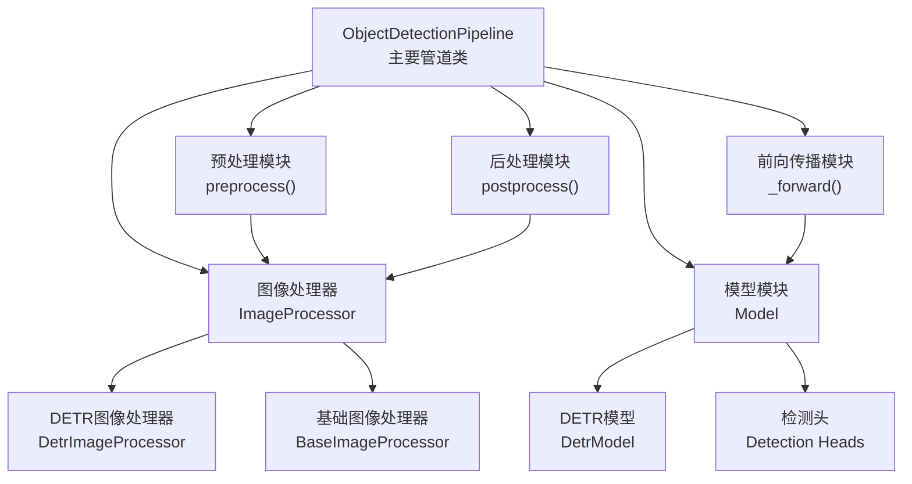
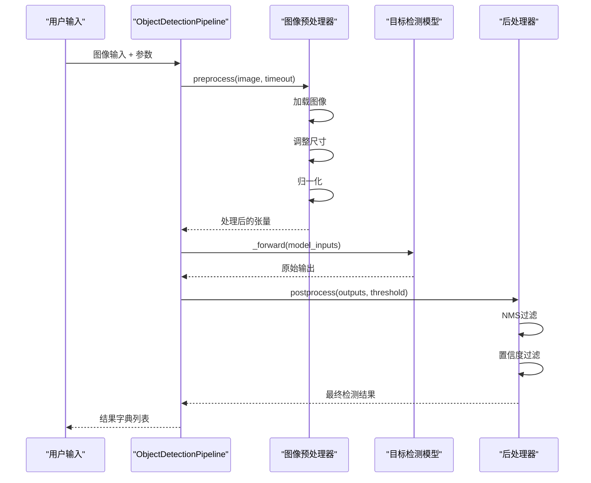
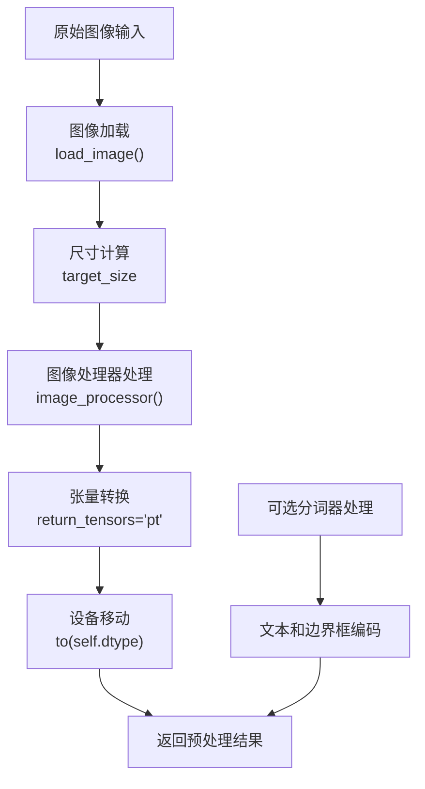
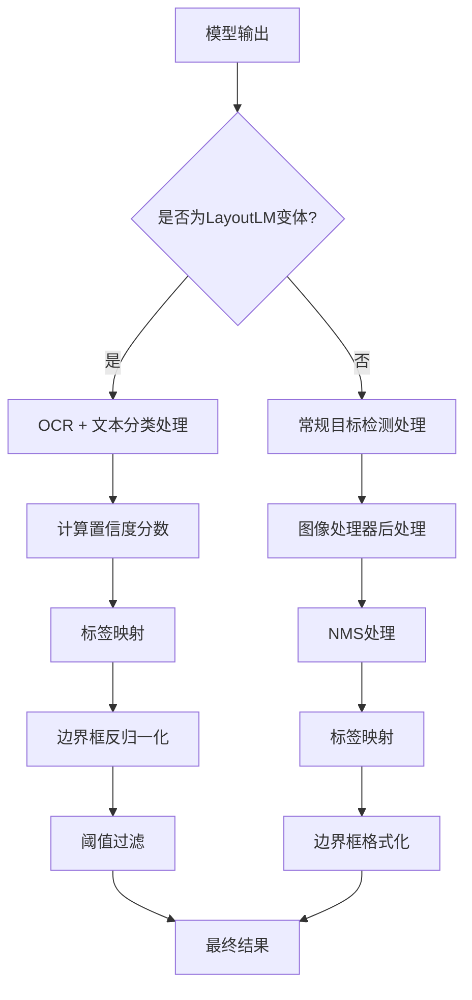
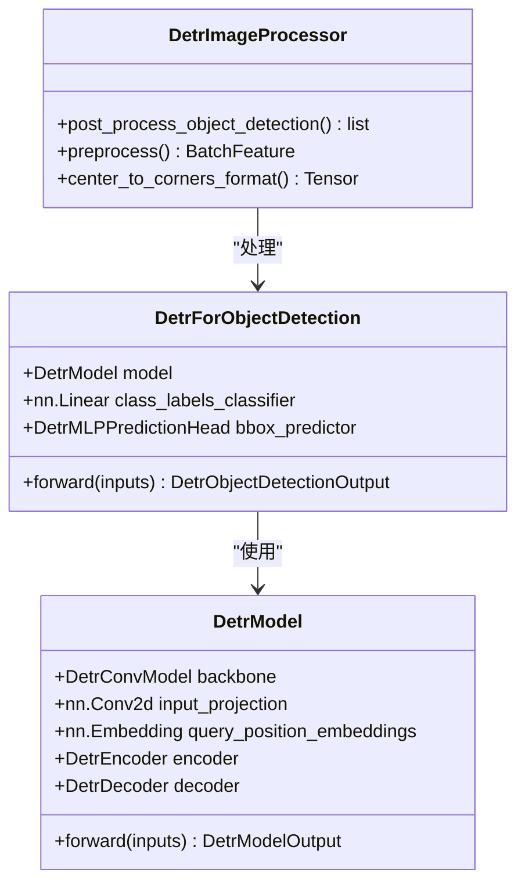
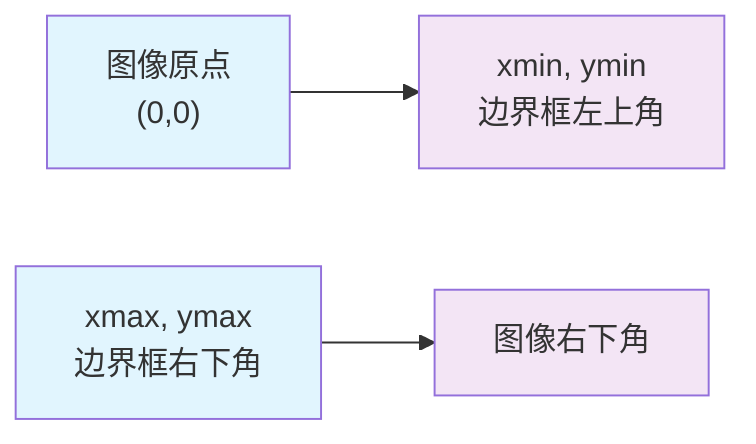
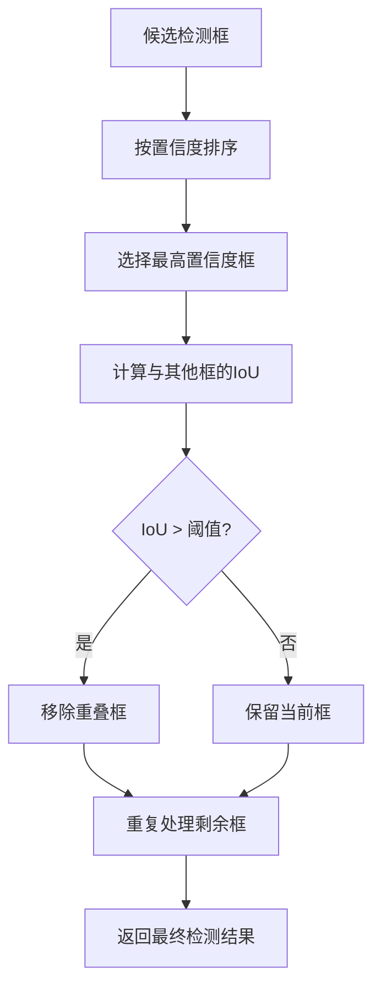

# 目标检测Pipeline

<cite>
**本文档中引用的文件**
- [object_detection.py](file://src/transformers/pipelines/object_detection.py)
- [run_object_detection.py](file://examples/pytorch/object-detection/run_object_detection.py)
- [image_processing_detr.py](file://src/transformers/models/detr/image_processing_detr.py)
- [modeling_detr.py](file://src/transformers/models/detr/modeling_detr.py)
- [image_processing_utils.py](file://src/transformers/image_processing_utils.py)
- [test_pipelines_object_detection.py](file://tests/pipelines/test_pipelines_object_detection.py)
</cite>

## 目录
1. [简介](#简介)
2. [项目结构](#项目结构)
3. [核心组件](#核心组件)
4. [架构概览](#架构概览)
5. [详细组件分析](#详细组件分析)
6. [输出结果结构](#输出结果结构)
7. [参数配置](#参数配置)
8. [后处理步骤](#后处理步骤)
9. [模型集成](#模型集成)
10. [实际使用示例](#实际使用示例)
11. [性能优化](#性能优化)
12. [常见挑战与解决方案](#常见挑战与解决方案)
13. [总结](#总结)

## 简介

目标检测Pipeline是Transformers库中专门用于物体识别和定位的强大工具。它基于先进的深度学习模型（如DETR），能够准确地检测图像中的多个物体，并提供每个检测到的物体的边界框坐标、类别标签和置信度分数。

该Pipeline支持多种输入格式，包括本地图片路径、HTTP链接和PIL图像对象，并提供了灵活的参数配置选项，使用户能够根据具体需求调整检测灵敏度和性能。

## 项目结构

目标检测Pipeline的实现分布在以下关键模块中：



**图表来源**
- [object_detection.py](file://src/transformers/pipelines/object_detection.py#L25-L196)
- [image_processing_detr.py](file://src/transformers/models/detr/image_processing_detr.py#L1-L199)

**章节来源**
- [object_detection.py](file://src/transformers/pipelines/object_detection.py#L1-L198)

## 核心组件

### ObjectDetectionPipeline类

这是目标检测Pipeline的核心类，继承自基础Pipeline类，专门负责物体检测任务的完整流程。

#### 主要特性：
- 支持单张和批量图像输入
- 自动处理不同类型的图像输入（URL、本地路径、PIL图像）
- 集成图像预处理和模型推理
- 提供灵活的后处理配置

#### 关键属性：
- `_load_image_processor = True`：启用图像处理器
- `_load_feature_extractor = False`：不加载特征提取器
- `_load_tokenizer = None`：根据模型类型决定是否加载分词器

**章节来源**
- [object_detection.py](file://src/transformers/pipelines/object_detection.py#L25-L196)

## 架构概览

目标检测Pipeline采用标准的机器学习管道架构，包含三个主要阶段：



**图表来源**
- [object_detection.py](file://src/transformers/pipelines/object_detection.py#L120-L196)

## 详细组件分析

### 预处理模块

预处理模块负责将原始图像转换为模型可接受的格式：



**图表来源**
- [object_detection.py](file://src/transformers/pipelines/object_detection.py#L120-L135)

#### 预处理步骤详解：

1. **图像加载**：支持多种输入格式，自动处理超时
2. **尺寸计算**：记录原始图像尺寸用于后续坐标转换
3. **图像标准化**：使用模型指定的均值和标准差
4. **张量准备**：转换为PyTorch张量格式

**章节来源**
- [object_detection.py](file://src/transformers/pipelines/object_detection.py#L120-L135)

### 后处理模块

后处理模块是目标检测Pipeline的核心，负责从模型输出中提取有意义的检测结果：



**图表来源**
- [object_detection.py](file://src/transformers/pipelines/object_detection.py#L137-L196)

#### 后处理关键步骤：

1. **置信度计算**：使用softmax函数将logits转换为概率
2. **标签映射**：将数字标签转换为人类可读的类别名称
3. **边界框处理**：将相对坐标转换为绝对像素坐标
4. **阈值过滤**：移除低置信度的检测结果

**章节来源**
- [object_detection.py](file://src/transformers/pipelines/object_detection.py#L137-L196)

### DETR模型架构

DETR（DEtection TRansformer）是目标检测Pipeline中常用的先进模型架构：



**图表来源**
- [modeling_detr.py](file://src/transformers/models/detr/modeling_detr.py#L1012-L1245)
- [image_processing_detr.py](file://src/transformers/models/detr/image_processing_detr.py#L1-L199)

**章节来源**
- [modeling_detr.py](file://src/transformers/models/detr/modeling_detr.py#L1012-L1245)

## 输出结果结构

目标检测Pipeline的输出是一个包含检测结果的字典列表，每个检测结果包含以下关键信息：

| 字段名 | 类型 | 描述 | 示例 |
|--------|------|------|------|
| `score` | float | 检测置信度分数，范围[0,1] | 0.9982 |
| `label` | str | 检测到的物体类别标签 | "remote", "couch", "cat" |
| `box` | dict | 边界框坐标信息 | {"xmin": 40, "ymin": 70, "xmax": 175, "ymax": 117} |

### 边界框坐标系统

边界框使用左上角坐标系，坐标值表示相对于原始图像的像素位置：



**图表来源**
- [object_detection.py](file://src/transformers/pipelines/object_detection.py#L180-L196)

**章节来源**
- [object_detection.py](file://src/transformers/pipelines/object_detection.py#L137-L196)

## 参数配置

### threshold参数

`threshold`参数是控制检测灵敏度的关键配置项：

#### 参数作用：
- **默认值**：0.5
- **取值范围**：[0, 1]
- **影响**：过滤掉置信度低于阈值的检测结果

#### 使用场景：
- **高精度需求**：设置较高阈值（0.7-0.9）以减少误检
- **召回率优先**：设置较低阈值（0.3-0.5）以捕获更多物体
- **平衡模式**：使用默认值0.5作为起点

#### 调优建议：
```python
# 高精度场景
results = detector(image, threshold=0.7)

# 快速检测
results = detector(image, threshold=0.3)

# 批量处理
results = detector(images, threshold=0.5)
```

### timeout参数

`timeout`参数控制网络图像加载的超时时间：

#### 默认行为：
- **无限制**：默认值为None，可能阻塞等待
- **推荐设置**：设置合理的超时时间（如5秒）

#### 实际应用：
```python
# 设置超时避免长时间等待
results = detector("http://example.com/large-image.jpg", timeout=5.0)
```

**章节来源**
- [object_detection.py](file://src/transformers/pipelines/object_detection.py#L58-L65)

## 后处理步骤

### 非极大值抑制（NMS）

虽然当前的ObjectDetectionPipeline没有显式实现NMS，但许多底层图像处理器（如DETR）在其后处理函数中实现了NMS逻辑：



### 置信度过滤

置信度过滤是最基本的后处理步骤：

```python
# 过滤逻辑（伪代码）
filtered_results = []
for detection in all_detections:
    if detection['score'] > threshold:
        filtered_results.append(detection)
```

### 坐标转换

从模型输出的归一化坐标转换为原始图像的实际像素坐标：

```python
# 坐标转换公式
def convert_coordinates(box, image_size):
    height, width = image_size
    return {
        'xmin': int(box[0] * width),
        'ymin': int(box[1] * height),
        'xmax': int(box[2] * width),
        'ymax': int(box[3] * height)
    }
```

**章节来源**
- [object_detection.py](file://src/transformers/pipelines/object_detection.py#L137-L196)

## 模型集成

### DETR模型集成

DETR（DEtection TRansformer）是目标检测Pipeline中最常用的模型架构：

#### 模型特点：
- **端到端检测**：无需复杂的锚点机制
- **Transformer架构**：利用注意力机制进行特征提取
- **高质量检测**：在COCO等基准数据集上表现优异

#### 集成方式：
```python
from transformers import pipeline

# 加载DETR模型
detector = pipeline("object-detection", model="facebook/detr-resnet-50")

# 使用模型进行检测
results = detector("image.jpg")
```

### 其他支持的模型

除了DETR，Pipeline还支持其他目标检测模型：

| 模型类型 | 示例模型 | 特点 |
|----------|----------|------|
| DETR系列 | facebook/detr-resnet-50 | 优秀的检测质量 |
| RT-DETR | facebook/rt-detr-resnet-50 | 更快的推理速度 |
| Grounding DINO | shilongliu/GroundingDINO | 支持文本引导检测 |

**章节来源**
- [object_detection.py](file://src/transformers/pipelines/object_detection.py#L47-L55)

## 实际使用示例

### 基础使用示例

```python
from transformers import pipeline

# 创建检测器
detector = pipeline("object-detection", model="facebook/detr-resnet-50")

# 单图像检测
result = detector("image.jpg")
print(result)

# 批量检测
images = ["image1.jpg", "image2.jpg", "image3.jpg"]
results = detector(images)
```

### 高级配置示例

```python
# 自定义阈值
high_confidence_results = detector("image.jpg", threshold=0.8)

# 处理网络图像
web_image_results = detector("https://example.com/image.jpg", timeout=10.0)

# 批量处理带阈值
batch_results = detector(images, threshold=0.6)
```

### 可视化检测结果

```python
from PIL import Image, ImageDraw

def visualize_detections(image_path, detections):
    image = Image.open(image_path)
    draw = ImageDraw.Draw(image)
    
    for detection in detections:
        box = detection['box']
        label = detection['label']
        score = detection['score']
        
        # 绘制边界框
        draw.rectangle([
            box['xmin'], box['ymin'],
            box['xmax'], box['ymax']
        ], outline="red", width=2)
        
        # 添加标签
        text = f"{label}: {score:.2f}"
        draw.text((box['xmin'], box['ymin']-15), text, fill="red")
    
    return image
```

**章节来源**
- [object_detection.py](file://src/transformers/pipelines/object_detection.py#L30-L45)

## 性能优化

### 处理小物体检测

对于包含大量小物体的图像，可以采取以下优化策略：

#### 1. 调整输入尺寸
```python
# 使用更大的输入尺寸以更好地检测小物体
image_processor = AutoImageProcessor.from_pretrained(
    "facebook/detr-resnet-50",
    size={"height": 800, "width": 800}
)
```

#### 2. 降低检测阈值
```python
# 更宽松的阈值有助于检测小物体
results = detector(image, threshold=0.3)
```

### 提高检测速度

#### 1. 使用轻量级模型
```python
# 使用MobileNetV3作为骨干网络的轻量级DETR
detector = pipeline("object-detection", 
                   model="facebook/detr-mobilevit-small")
```

#### 2. 减少输入分辨率
```python
# 降低输入分辨率以提高速度
image_processor = AutoImageProcessor.from_pretrained(
    "facebook/detr-resnet-50",
    size={"height": 300, "width": 300}
)
```

#### 3. 批量处理
```python
# 批量处理比逐个处理更快
batch_results = detector(images_batch)
```

### 内存优化

#### 1. 使用半精度
```python
# 使用FP16减少内存占用
detector = pipeline("object-detection", 
                   model="facebook/detr-resnet-50",
                   torch_dtype=torch.float16)
```

#### 2. 分批处理大图像
```python
# 对于大图像，考虑分块处理
def process_large_image(image_path, chunk_size=512):
    # 实现图像分块处理逻辑
    pass
```

## 常见挑战与解决方案

### 重叠物体处理

当多个物体相互重叠时，检测结果可能出现问题：

#### 解决方案：
1. **调整NMS阈值**：降低IoU阈值以保留更多重叠检测
2. **多尺度检测**：使用不同尺度的输入图像
3. **后处理过滤**：手动检查和合并重叠检测

```python
# 多尺度检测示例
def multi_scale_detection(detector, image, scales=[1.0, 1.5, 2.0]):
    all_detections = []
    
    for scale in scales:
        scaled_image = resize_image(image, scale)
        detections = detector(scaled_image, threshold=0.5)
        # 调整坐标以匹配原始图像
        all_detections.extend(detections)
    
    # 应用NMS去除重复检测
    return apply_nms(all_detections, iou_threshold=0.5)
```

### 误检率控制

#### 1. 提高检测阈值
```python
# 严格过滤减少误检
strict_results = detector(image, threshold=0.7)
```

#### 2. 使用更精确的模型
```python
# 使用更高精度的模型
detector = pipeline("object-detection", 
                   model="facebook/detr-resnet-101")
```

#### 3. 后处理验证
```python
def validate_detections(image, detections):
    validated_detections = []
    
    for detection in detections:
        # 添加额外的验证逻辑
        if is_valid_detection(image, detection):
            validated_detections.append(detection)
    
    return validated_detections
```

### 小物体检测优化

#### 1. 输入增强
```python
# 数据增强策略
train_augmentations = A.Compose([
    A.Resize(height=800, width=800),
    A.HorizontalFlip(p=0.5),
    A.RandomBrightnessContrast(p=0.2),
], bbox_params=A.BboxParams(format="coco"))
```

#### 2. 模型微调
```python
# 微调模型以改善小物体检测
def fine_tune_small_object_detection():
    # 实现小物体检测的微调逻辑
    pass
```

### 批量处理优化

#### 1. 并行处理
```python
import concurrent.futures

def batch_process_parallel(images, detector, max_workers=4):
    with concurrent.futures.ThreadPoolExecutor(max_workers=max_workers) as executor:
        futures = [executor.submit(detector, img) for img in images]
        results = [future.result() for future in futures]
    return results
```

#### 2. 流水线处理
```python
def pipeline_processing(images, detector):
    # 实现流水线处理逻辑
    pass
```

## 总结

目标检测Pipeline是Transformers库中功能强大且易于使用的物体检测工具。它通过以下关键特性为用户提供了完整的解决方案：

### 核心优势：
1. **易用性**：简洁的API设计，支持多种输入格式
2. **灵活性**：丰富的参数配置选项，适应不同应用场景
3. **扩展性**：支持多种先进的目标检测模型
4. **性能**：优化的处理流程，支持批量和并行处理

### 技术特点：
- 基于DETR等先进Transformer架构
- 完整的预处理和后处理流程
- 灵活的阈值控制机制
- 支持批量和单图像处理

### 应用场景：
- 计算机视觉研究
- 自动驾驶系统
- 安防监控
- 医学影像分析
- 工业质检

通过合理配置参数和采用适当的优化策略，目标检测Pipeline能够在各种复杂场景中提供准确可靠的物体检测能力，是现代计算机视觉应用的理想选择。