# 自动语音识别Pipeline

<cite>
**本文档中引用的文件**
- [automatic_speech_recognition.py](file://src/transformers/pipelines/automatic_speech_recognition.py)
- [audio_utils.py](file://src/transformers/pipelines/audio_utils.py)
- [whisper/feature_extraction_whisper.py](file://src/transformers/models/whisper/feature_extraction_whisper.py)
- [wav2vec2/feature_extraction_wav2vec2.py](file://src/transformers/models/wav2vec2/feature_extraction_wav2vec2.py)
- [speech_to_text/modeling_speech_to_text.py](file://src/transformers/models/speech_to_text/modeling_speech_to_text.py)
- [whisper/modeling_whisper.py](file://src/transformers/models/whisper/modeling_whisper.py)
- [wav2vec2/modeling_wav2vec2.py](file://src/transformers/models/wav2vec2/modeling_wav2vec2.py)
- [test_pipelines_automatic_speech_recognition.py](file://tests/pipelines/test_pipelines_automatic_speech_recognition.py)
</cite>

## 目录
1. [简介](#简介)
2. [项目结构](#项目结构)
3. [核心组件](#核心组件)
4. [架构概览](#架构概览)
5. [详细组件分析](#详细组件分析)
6. [依赖关系分析](#依赖关系分析)
7. [性能考虑](#性能考虑)
8. [故障排除指南](#故障排除指南)
9. [结论](#结论)

## 简介

自动语音识别（ASR）Pipeline是Transformers库中用于将音频转换为文本的核心组件。该Pipeline支持多种音频格式、不同的采样率，并提供了从单个音频文件到批量音频数据的完整处理流程。它集成了先进的语音识别模型，如Whisper和Wav2Vec2，支持实时转录和流式处理功能。

该Pipeline的主要特点包括：
- 支持多种音频输入格式（本地文件、URL、原始音频数据）
- 智能音频预处理和格式转换
- 分块处理大音频文件以优化内存使用
- 实时流式ASR功能
- 时间戳生成和语言检测
- 批量处理能力

## 项目结构

ASR Pipeline的实现分布在多个模块中，形成了一个层次化的架构：

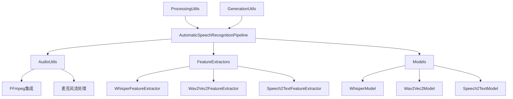

**图表来源**
- [automatic_speech_recognition.py](file://src/transformers/pipelines/automatic_speech_recognition.py#L1-L50)
- [audio_utils.py](file://src/transformers/pipelines/audio_utils.py#L1-L30)

**章节来源**
- [automatic_speech_recognition.py](file://src/transformers/pipelines/automatic_speech_recognition.py#L1-L100)

## 核心组件

### AutomaticSpeechRecognitionPipeline类

这是ASR Pipeline的核心类，继承自`ChunkPipeline`，负责整个语音识别流程的协调：

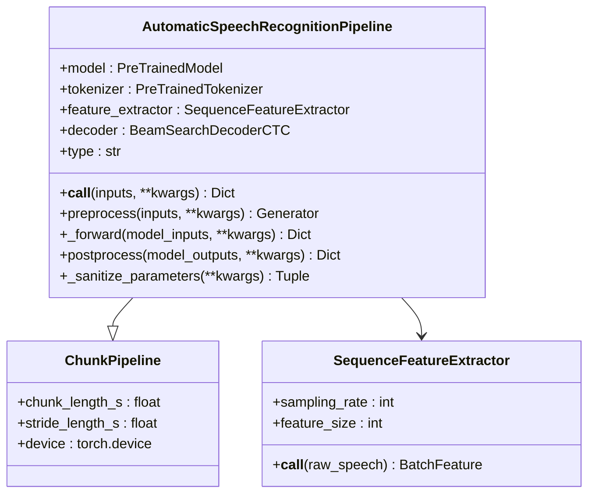

**图表来源**
- [automatic_speech_recognition.py](file://src/transformers/pipelines/automatic_speech_recognition.py#L111-L200)

### 音频工具模块

音频工具模块提供了与外部音频处理工具的接口，特别是FFmpeg：

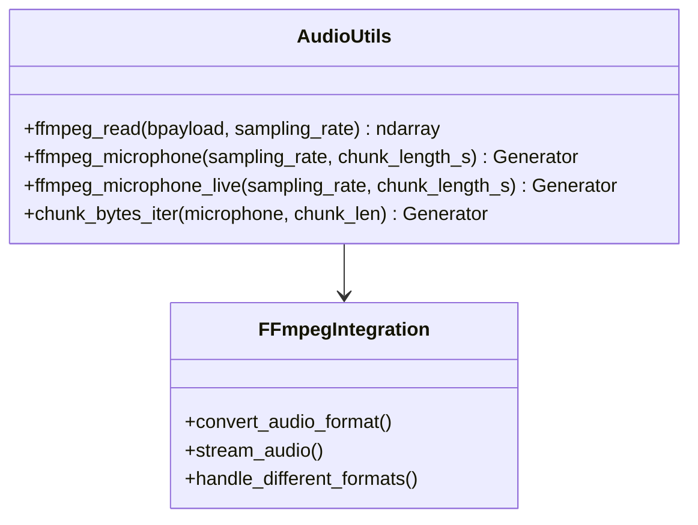

**图表来源**
- [audio_utils.py](file://src/transformers/pipelines/audio_utils.py#L10-L50)

**章节来源**
- [automatic_speech_recognition.py](file://src/transformers/pipelines/automatic_speech_recognition.py#L111-L300)
- [audio_utils.py](file://src/transformers/pipelines/audio_utils.py#L1-L100)

## 架构概览

ASR Pipeline采用模块化设计，将音频处理、特征提取、模型推理和后处理分离：

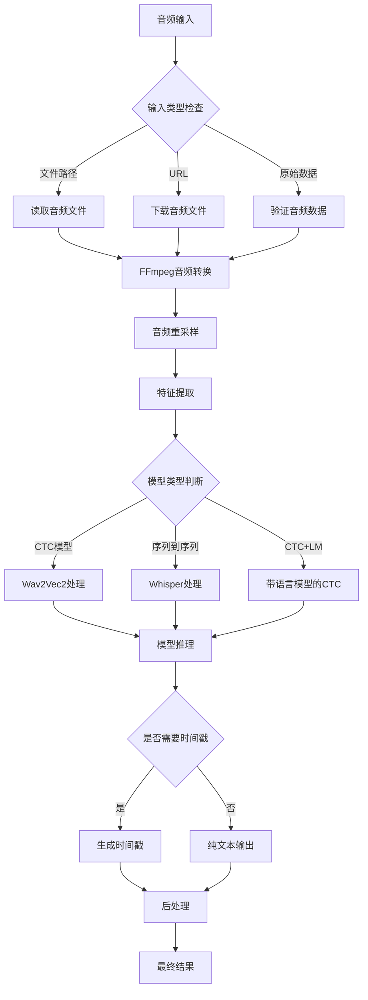

**图表来源**
- [automatic_speech_recognition.py](file://src/transformers/pipelines/automatic_speech_recognition.py#L350-L450)

## 详细组件分析

### 音频输入处理

ASR Pipeline支持多种音频输入格式，通过智能的预处理流程确保音频数据符合模型要求：

#### 输入格式支持

| 输入类型 | 描述 | 处理方式 |
|---------|------|----------|
| 文件路径字符串 | 本地音频文件路径 | 使用FFmpeg读取并转换格式 |
| URL字符串 | 远程音频文件地址 | 下载后使用FFmpeg处理 |
| 字节数据 | 原始音频字节流 | 直接传递给FFmpeg进行格式转换 |
| NumPy数组 | 原始音频数据 | 检查维度并进行必要的转换 |
| 字典格式 | 包含采样率和音频数据 | 提取音频数据并进行重采样 |

#### 采样率转换机制

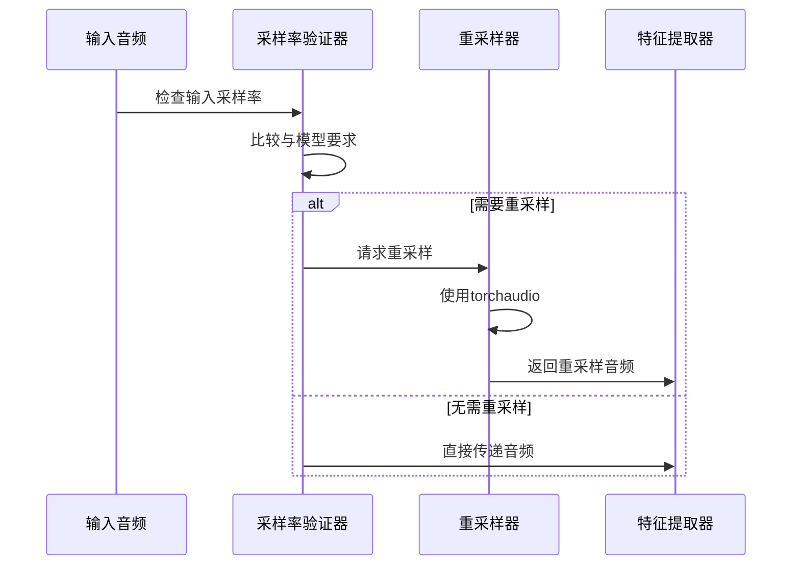

**图表来源**
- [automatic_speech_recognition.py](file://src/transformers/pipelines/automatic_speech_recognition.py#L450-L500)

### 特征提取器集成

不同模型使用不同的特征提取策略：

#### Whisper特征提取器

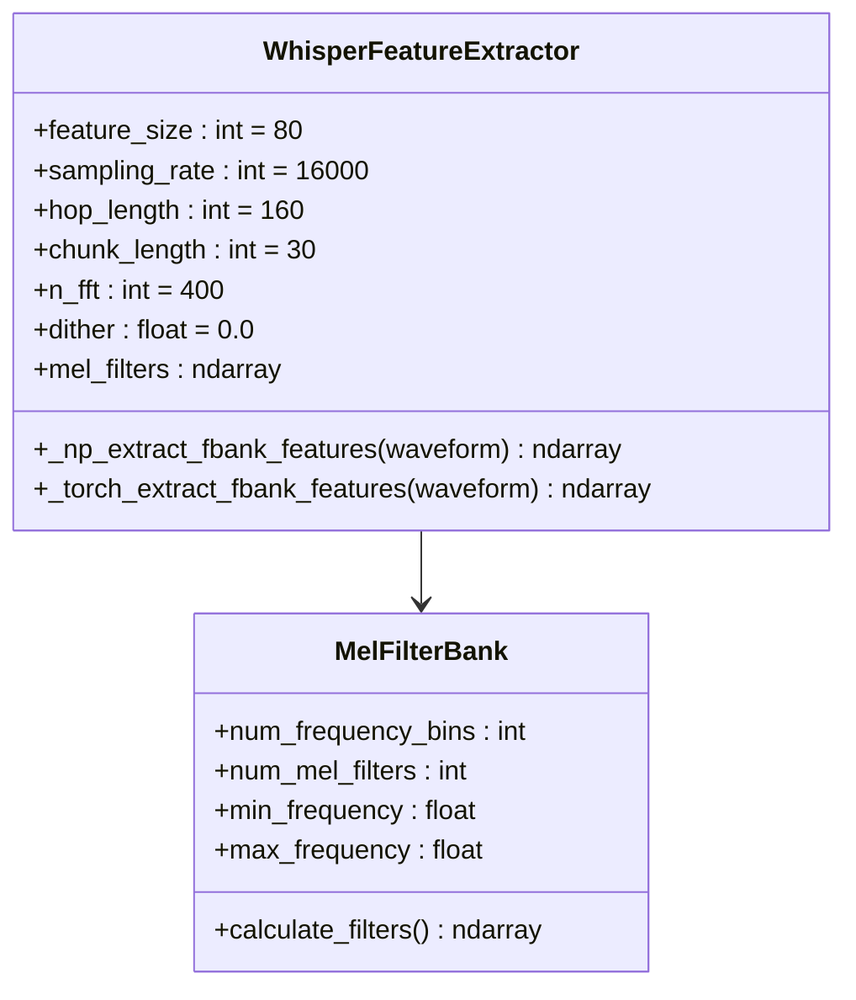

**图表来源**
- [whisper/feature_extraction_whisper.py](file://src/transformers/models/whisper/feature_extraction_whisper.py#L40-L100)

#### Wav2Vec2特征提取器

Wav2Vec2使用简单的波形特征提取：

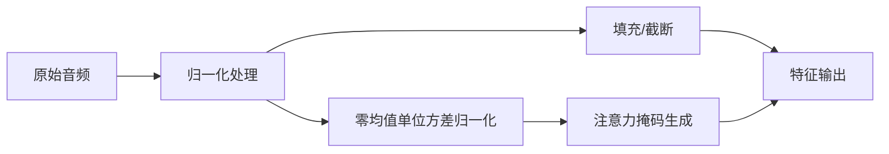

**图表来源**
- [wav2vec2/feature_extraction_wav2vec2.py](file://src/transformers/models/wav2vec2/feature_extraction_wav2vec2.py#L80-L150)

### 分块处理机制

对于长音频文件，ASR Pipeline实现了智能分块处理：

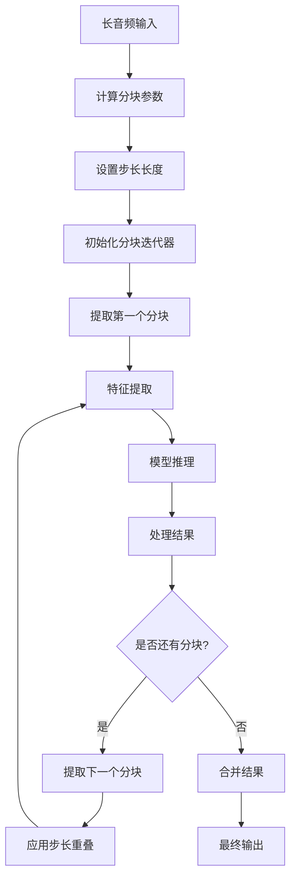

**图表来源**
- [automatic_speech_recognition.py](file://src/transformers/pipelines/automatic_speech_recognition.py#L40-L76)

**章节来源**
- [automatic_speech_recognition.py](file://src/transformers/pipelines/automatic_speech_recognition.py#L350-L500)
- [whisper/feature_extraction_whisper.py](file://src/transformers/models/whisper/feature_extraction_whisper.py#L1-L100)

### 流式ASR功能

ASR Pipeline支持实时流式处理，特别适用于麦克风输入：

#### 实时流处理流程

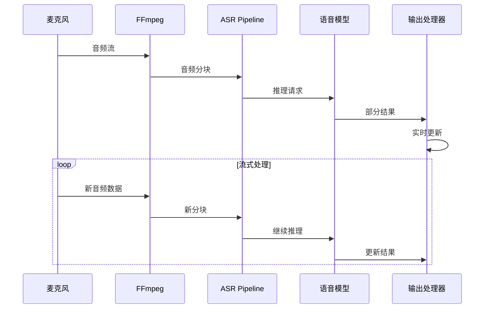

**图表来源**
- [audio_utils.py](file://src/transformers/pipelines/audio_utils.py#L147-L200)

### 时间戳生成

ASR Pipeline支持精确的时间戳生成，这对于字幕制作和语音分析非常重要：

#### 时间戳类型

| 时间戳类型 | 适用模型 | 精度 | 用途 |
|-----------|----------|------|------|
| 字符级 | CTC模型 | 单字符 | 精确到每个音素 |
| 单词级 | CTC模型 | 整个单词 | 语义级别的定位 |
| 段落级 | Whisper模型 | 文本段落 | 上下文理解 |
| 词元级 | Whisper模型 | 词元边界 | 亚词级别分析 |

**章节来源**
- [automatic_speech_recognition.py](file://src/transformers/pipelines/automatic_speech_recognition.py#L500-L600)

## 依赖关系分析

ASR Pipeline的依赖关系体现了其模块化设计的优势：

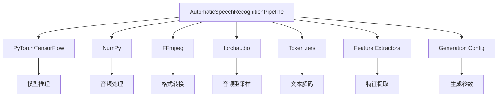

**图表来源**
- [automatic_speech_recognition.py](file://src/transformers/pipelines/automatic_speech_recognition.py#L15-L30)

### 关键依赖项

#### 必需依赖
- **PyTorch或TensorFlow**: 用于模型推理
- **NumPy**: 数值计算和音频处理
- **FFmpeg**: 音频格式转换和流处理
- **torchaudio**: 高级音频处理功能

#### 可选依赖
- **pyctcdecode**: CTC模型的语言模型增强
- **librosa**: 替代音频处理方案
- **sentencepiece**: 专门的分词工具

**章节来源**
- [automatic_speech_recognition.py](file://src/transformers/pipelines/automatic_speech_recognition.py#L15-L30)

## 性能考虑

### 内存优化策略

ASR Pipeline采用了多种内存优化技术：

#### 分块处理优化
- 动态调整分块大小以适应可用内存
- 智能步长管理减少重复计算
- 流式处理避免大文件内存占用

#### 设备选择优化
- 自动检测GPU可用性
- 智能设备分配策略
- 内存使用监控和调整

### 批量处理性能

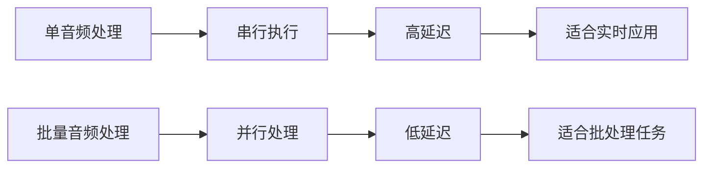

### 性能调优建议

#### 对于长音频处理
1. **合理设置分块参数**: 根据可用内存调整`chunk_length_s`和`stride_length_s`
2. **使用适当的步长**: 平衡处理速度和准确性
3. **启用混合精度**: 在支持的硬件上使用FP16

#### 对于实时ASR
1. **优化麦克风设置**: 选择合适的采样率和缓冲区大小
2. **启用流式处理**: 使用`ffmpeg_microphone_live`函数
3. **减少预处理开销**: 预先配置好所有参数

## 故障排除指南

### 常见问题及解决方案

#### 音频格式问题

**问题**: 不支持的音频格式
**解决方案**: 
- 确保安装了FFmpeg
- 使用支持的格式（WAV、MP3、FLAC等）
- 检查音频编码参数

#### 内存不足错误

**问题**: 处理大音频文件时内存溢出
**解决方案**:
- 减小`chunk_length_s`参数
- 启用分块处理
- 使用更小的模型

#### 识别准确性问题

**问题**: 识别结果不准确
**解决方案**:
- 检查音频质量（信噪比、采样率）
- 调整模型参数（beam search宽度）
- 使用语言特定的模型

#### 实时处理延迟

**问题**: 流式ASR延迟过高
**解决方案**:
- 减少分块长度
- 优化麦克风缓冲区设置
- 使用GPU加速

### 调试技巧

#### 启用详细日志
```python
import logging
logging.getLogger("transformers.pipelines.automatic_speech_recognition").setLevel(logging.DEBUG)
```

#### 性能监控
- 监控内存使用情况
- 测量处理时间
- 分析瓶颈所在

**章节来源**
- [automatic_speech_recognition.py](file://src/transformers/pipelines/automatic_speech_recognition.py#L600-L673)

## 结论

Transformers库的自动语音识别Pipeline提供了一个功能强大且灵活的语音转文本解决方案。通过模块化设计，它能够处理各种音频输入格式，支持实时流式处理，并提供了丰富的配置选项以满足不同应用场景的需求。

### 主要优势

1. **广泛的兼容性**: 支持多种音频格式和输入源
2. **高性能**: 优化的内存管理和并行处理
3. **灵活性**: 可配置的参数和多种处理模式
4. **易用性**: 简洁的API设计和丰富的文档

### 应用场景

- **实时语音转录**: 会议记录、播客转文字
- **批量音频处理**: 大规模内容标注、语音数据分析
- **多语言支持**: 全球化应用的语言识别
- **实时交互**: 语音助手、无障碍应用

### 未来发展方向

- 更高效的模型压缩技术
- 改进的噪声鲁棒性
- 更好的多模态融合
- 边缘设备优化

通过深入理解ASR Pipeline的设计原理和实现细节，开发者可以更好地利用这一强大的工具来构建高质量的语音识别应用。