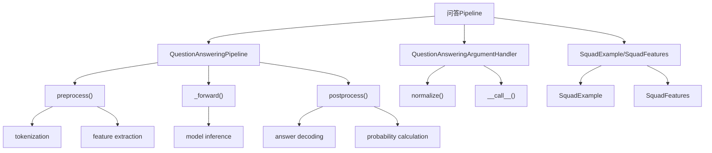
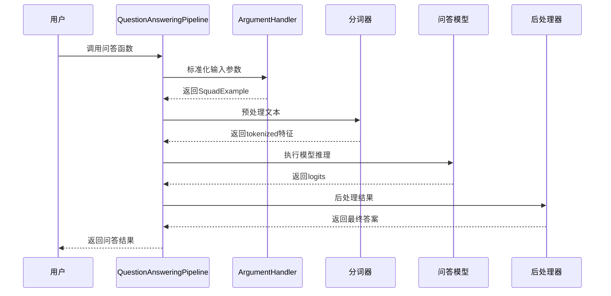
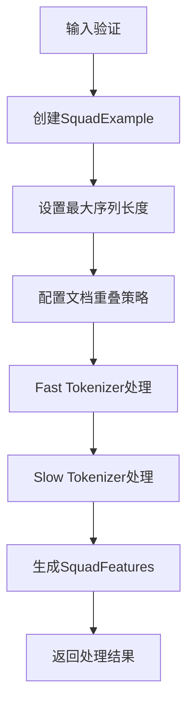
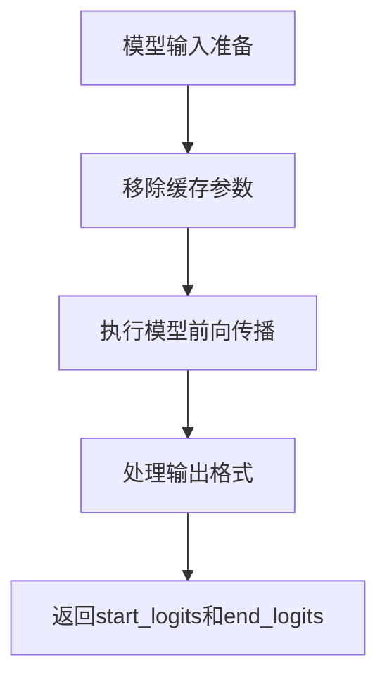
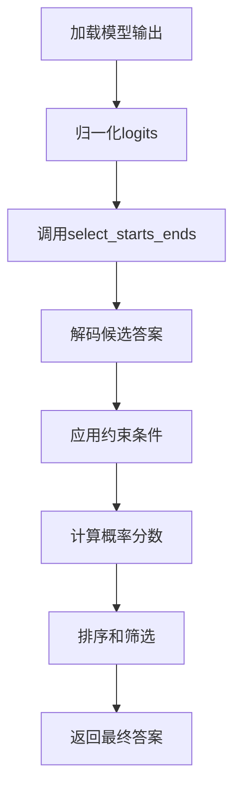
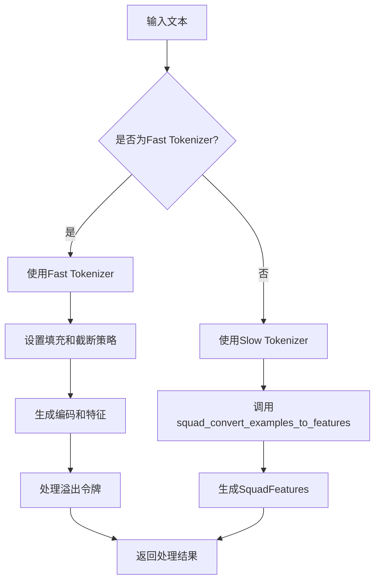
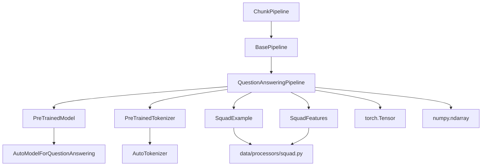

# 问答Pipeline详细文档

<cite>
**本文档中引用的文件**
- [question_answering.py](file://src/transformers/pipelines/question_answering.py)
- [test_pipelines_question_answering.py](file://tests/pipelines/test_pipelines_question_answering.py)
- [squad.py](file://src/transformers/data/processors/squad.py)
- [base.py](file://src/transformers/pipelines/base.py)
- [run_qa.py](file://examples/pytorch/question-answering/run_qa.py)
</cite>

## 目录
1. [简介](#简介)
2. [项目结构](#项目结构)
3. [核心组件](#核心组件)
4. [架构概览](#架构概览)
5. [详细组件分析](#详细组件分析)
6. [依赖关系分析](#依赖关系分析)
7. [性能考虑](#性能考虑)
8. [故障排除指南](#故障排除指南)
9. [结论](#结论)

## 简介

问答Pipeline是transformers库中专门用于抽取式问答任务的核心组件。它能够从给定的上下文中提取出准确的答案，支持单个和批量问题处理，并提供了丰富的配置选项来满足不同场景的需求。

该Pipeline实现了完整的问答处理流程，包括：
- 输入格式标准化和验证
- 文本预处理和tokenization
- 模型推理和答案解码
- 输出后处理和答案排序
- 多种配置参数控制

## 项目结构

问答Pipeline在transformers库中的组织结构如下：



**图表来源**
- [question_answering.py](file://src/transformers/pipelines/question_answering.py#L1-L50)

**章节来源**
- [question_answering.py](file://src/transformers/pipelines/question_answering.py#L1-L100)

## 核心组件

### QuestionAnsweringPipeline类

这是问答Pipeline的主要实现类，继承自`ChunkPipeline`基类，负责整个问答处理流程的协调。

主要功能：
- 模型初始化和类型检查
- 输入参数标准化
- 预处理、推理和后处理的完整流程管理
- 支持多种输入格式（字典、列表、生成器等）

### QuestionAnsweringArgumentHandler类

专门负责处理用户输入参数的标准化和验证。

核心职责：
- 验证输入参数的有效性
- 将不同格式的输入转换为统一的`SquadExample`对象
- 支持批量处理和单个处理
- 提供向后兼容性支持

### Squad数据结构

问答Pipeline使用SQuAD格式的数据结构来表示问题和上下文：

- **SquadExample**: 表示单个问答样本
- **SquadFeatures**: 表示经过tokenization后的特征

**章节来源**
- [question_answering.py](file://src/transformers/pipelines/question_answering.py#L150-L294)
- [squad.py](file://src/transformers/data/processors/squad.py#L589-L716)

## 架构概览

问答Pipeline采用模块化设计，遵循经典的NLP处理流水线模式：



**图表来源**
- [question_answering.py](file://src/transformers/pipelines/question_answering.py#L300-L400)

## 详细组件分析

### 输入格式要求

问答Pipeline支持多种输入格式，确保灵活性和易用性：

#### 基本格式
```python
# 字典格式
result = pipeline({
    'question': '问题内容',
    'context': '上下文内容'
})

# 关键字参数格式
result = pipeline(question='问题', context='上下文')
```

#### 批量处理格式
```python
# 单个问题对应多个上下文
results = pipeline(
    question=['问题1', '问题2'],
    context=['上下文1', '上下文2']
)

# 多个问题对应单个上下文
results = pipeline(
    question=['问题1', '问题2'],
    context='共享上下文'
)
```

#### 验证规则
- `question`和`context`字段必须存在且非空
- 支持字符串或字符串列表
- 批量处理时，问题和上下文长度必须匹配

**章节来源**
- [question_answering.py](file://src/transformers/pipelines/question_answering.py#L150-L220)

### 内部处理流程

#### 预处理阶段



**图表来源**
- [question_answering.py](file://src/transformers/pipelines/question_answering.py#L350-L450)

预处理阶段的关键步骤：

1. **输入验证**: 确保问题和上下文的有效性
2. **SquadExample创建**: 将输入转换为标准格式
3. **序列长度配置**: 设置最大序列长度和问题长度限制
4. **文档重叠策略**: 处理长文档的分块策略
5. **Tokenization**: 使用Fast或Slow分词器进行处理

#### 模型推理阶段



**图表来源**
- [question_answering.py](file://src/transformers/pipelines/question_answering.py#L470-L490)

#### 后处理阶段

后处理阶段是最复杂的部分，负责从模型输出中提取最终答案：



**图表来源**
- [question_answering.py](file://src/transformers/pipelines/question_answering.py#L510-L620)

**章节来源**
- [question_answering.py](file://src/transformers/pipelines/question_answering.py#L350-L510)

### 关键参数详解

#### max_answer_len
- **作用**: 限制预测答案的最大长度
- **默认值**: 15
- **影响**: 影响答案的精确度和召回率
- **使用场景**: 防止过长答案的产生

#### handle_impossible_answer
- **作用**: 是否允许返回"无法回答"的答案
- **默认值**: False
- **影响**: 控制模型对不确定情况的处理
- **使用场景**: 在上下文不充分时提供合理的拒绝机制

#### top_k
- **作用**: 返回最佳答案的数量
- **默认值**: 1
- **影响**: 提供多个候选答案
- **使用场景**: 需要多个备选答案的场景

#### doc_stride
- **作用**: 长文档分块时的重叠步长
- **默认值**: 128
- **影响**: 平衡精度和计算效率
- **使用场景**: 处理超长文档

**章节来源**
- [question_answering.py](file://src/transformers/pipelines/question_answering.py#L295-L350)

### 概率分数和置信度计算

问答Pipeline通过复杂的算法计算答案的置信度分数：

#### 分数计算公式
```python
# 计算每个候选答案的分数
scores_flat = candidates.flatten()
idx_sort = np.argsort(-scores_flat)[:top_k]

# 概率归一化
start_probs = np.exp(start - start.max())
start_probs = start_probs / start_probs.sum()
end_probs = np.exp(end - end.max())
end_probs = end_probs / end_probs.sum()
```

#### 置信度评估
- **概率分布**: 基于softmax计算的token级概率
- **联合概率**: start和end概率的乘积
- **约束过滤**: 排除不合理答案（长度超限、顺序错误等）
- **排序机制**: 按分数降序排列

**章节来源**
- [question_answering.py](file://src/transformers/pipelines/question_answering.py#L30-L120)

### 实际代码示例

#### 基础问答示例
```python
from transformers import pipeline

# 初始化问答管道
qa_pipeline = pipeline("question-answering")

# 基本问答
result = qa_pipeline(
    question="什么是Transformer？",
    context="Transformer是一种基于注意力机制的深度学习模型架构，由Vaswani等人在2017年提出。"
)

print(result)
# 输出示例: {'score': 0.987, 'start': 0, 'end': 11, 'answer': 'Transformer'}
```

#### 批量问答处理
```python
# 批量处理多个问题
questions = [
    "Transformer是谁提出的？",
    "Transformer首次发表在哪一年？",
    "Transformer的主要特点是什么？"
]

contexts = [
    "Transformer是一种基于注意力机制的深度学习模型架构，由Vaswani等人在2017年提出。",
    "Transformer是一种基于注意力机制的深度学习模型架构，由Vaswani等人在2017年提出。",
    "Transformer是一种基于注意力机制的深度学习模型架构，由Vaswani等人在2017年提出。"
]

results = qa_pipeline(
    question=questions,
    context=contexts
)

for i, result in enumerate(results):
    print(f"问题{i+1}: {questions[i]}")
    print(f"答案: {result['answer']}")
    print(f"置信度: {result['score']:.3f}")
    print()
```

#### 高级配置示例
```python
# 配置问答管道
qa_pipeline = pipeline(
    "question-answering",
    model="distilbert-base-uncased-distilled-squad",
    tokenizer="distilbert-base-uncased"
)

# 使用高级参数
result = qa_pipeline(
    question="Transformer的主要特点是什么？",
    context="Transformer是一种基于注意力机制的深度学习模型架构，由Vaswani等人在2017年提出。",
    top_k=3,                    # 返回3个最佳答案
    max_answer_len=50,          # 最大答案长度
    handle_impossible_answer=True,  # 允许无法回答的情况
    align_to_words=True         # 对齐到单词边界
)
```

**章节来源**
- [test_pipelines_question_answering.py](file://tests/pipelines/test_pipelines_question_answering.py#L80-L150)

### 内部处理流程详解

#### Tokenization处理

问答Pipeline支持两种不同的tokenization方式：

1. **Fast Tokenizer**: 使用Hugging Face的快速分词器
2. **Slow Tokenizer**: 使用传统的Python实现



**图表来源**
- [question_answering.py](file://src/transformers/pipelines/question_answering.py#L350-L450)

#### 特征提取

对于Fast Tokenizer，Pipeline会生成以下特征：
- `input_ids`: token的ID序列
- `attention_mask`: 注意力掩码
- `token_type_ids`: token类型标识
- `p_mask`: 答案候选掩码
- `offsets`: 字符偏移映射

#### 答案解码

答案解码过程包括：

1. **候选生成**: 从start和end logits生成所有可能的答案候选
2. **约束过滤**: 应用长度和顺序约束
3. **概率计算**: 计算每个候选的置信度分数
4. **排序选择**: 按分数排序并选择最佳答案

**章节来源**
- [question_answering.py](file://src/transformers/pipelines/question_answering.py#L450-L620)

## 依赖关系分析

问答Pipeline与transformers库中的其他组件有着密切的依赖关系：



**图表来源**
- [question_answering.py](file://src/transformers/pipelines/question_answering.py#L1-L30)

主要依赖项：
- **模型**: 支持所有`ModelForQuestionAnswering`类型的模型
- **分词器**: 支持所有预训练的分词器
- **数据结构**: 基于SQuAD格式的标准数据结构
- **数学库**: NumPy用于数值计算
- **深度学习框架**: PyTorch作为后端

**章节来源**
- [question_answering.py](file://src/transformers/pipelines/question_answering.py#L1-L50)

## 性能考虑

### 计算优化

1. **批处理支持**: 自动检测并利用批处理能力
2. **内存管理**: 及时释放中间计算结果
3. **设备优化**: 自动选择最优计算设备

### 参数调优建议

1. **max_seq_len**: 根据硬件能力调整，平衡精度和速度
2. **doc_stride**: 较大的值提高精度但增加计算成本
3. **top_k**: 较小的值提高响应速度

### 大规模部署考虑

1. **模型量化**: 使用INT8或FP16量化减少内存占用
2. **缓存机制**: 缓存常用的分词结果
3. **并发处理**: 利用多线程处理多个请求

## 故障排除指南

### 常见问题及解决方案

#### 1. 输入格式错误
**问题**: `ValueError: question cannot be empty`
**解决方案**: 确保问题和上下文都提供且非空

#### 2. 模型不兼容
**问题**: `TypeError: check_model_type()`
**解决方案**: 使用专门为问答任务微调的模型

#### 3. 内存不足
**问题**: CUDA out of memory
**解决方案**: 减少`max_seq_len`或使用更小的模型

#### 4. 答案质量差
**问题**: 返回的答案不准确
**解决方案**: 调整`max_answer_len`或使用更大的模型

### 调试技巧

1. **启用详细日志**: 设置`logging.set_verbosity(logging.INFO)`
2. **检查中间结果**: 在各个处理阶段打印关键变量
3. **可视化tokenization**: 使用分词器的可视化功能

**章节来源**
- [test_pipelines_question_answering.py](file://tests/pipelines/test_pipelines_question_answering.py#L470-L547)

## 结论

问答Pipeline是transformers库中功能强大且易于使用的问答系统实现。它通过模块化的架构设计，提供了完整的抽取式问答解决方案，支持多种输入格式、丰富的配置选项和高效的处理流程。

### 主要优势

1. **易用性**: 简洁的API设计，支持多种输入格式
2. **灵活性**: 丰富的配置参数满足不同需求
3. **性能**: 优化的处理流程和批处理支持
4. **可扩展性**: 模块化设计便于定制和扩展

### 适用场景

- 文档问答系统
- 知识库查询
- 客服机器人
- 教育辅助工具
- 信息检索系统

### 发展方向

随着大语言模型的发展，问答Pipeline将继续演进，支持更复杂的问答任务和更智能的答案生成机制。同时，也会持续优化性能和用户体验，为用户提供更好的问答体验。