# 零样本分类Pipeline详细文档

<cite>
**本文档中引用的文件**
- [zero_shot_classification.py](file://src/transformers/pipelines/zero_shot_classification.py)
- [test_pipelines_zero_shot.py](file://tests/pipelines/test_pipelines_zero_shot.py)
- [__init__.py](file://src/transformers/pipelines/__init__.py)
- [modeling_auto.py](file://src/transformers/models/auto/modeling_auto.py)
- [zero_shot_image_classification.py](file://src/transformers/pipelines/zero_shot_image_classification.py)
- [zero_shot_audio_classification.py](file://src/transformers/pipelines/zero_shot_audio_classification.py)
</cite>

## 目录
1. [简介](#简介)
2. [项目结构](#项目结构)
3. [核心组件](#核心组件)
4. [架构概览](#架构概览)
5. [详细组件分析](#详细组件分析)
6. [候选标签系统](#候选标签系统)
7. [假设模板机制](#假设模板机制)
8. [NLI模型集成](#nli模型集成)
9. [概率分布与排序](#概率分布与排序)
10. [实际应用示例](#实际应用示例)
11. [性能优化](#性能优化)
12. [故障排除指南](#故障排除指南)
13. [结论](#结论)

## 简介

零样本分类Pipeline是Hugging Face Transformers库中的一个强大功能，它允许在没有特定任务训练的情况下对文本进行分类。该Pipeline基于自然语言推理（NLI）模型，通过将候选标签转换为假设（hypothesis）并将其与输入序列组合，实现灵活的文本分类能力。

### 主要特性

- **无需预训练**：不依赖特定任务的训练数据
- **高度灵活性**：可动态指定候选标签
- **多模态支持**：支持文本、图像和音频分类
- **概率输出**：提供每个标签的概率分数
- **多种分类模式**：支持单标签和多标签分类

## 项目结构

零样本分类Pipeline的核心文件结构如下：

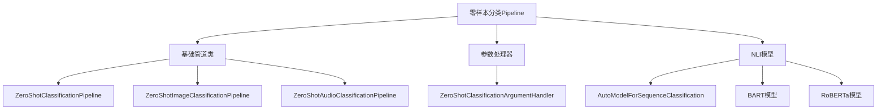

**图表来源**
- [zero_shot_classification.py](file://src/transformers/pipelines/zero_shot_classification.py#L1-L50)
- [zero_shot_image_classification.py](file://src/transformers/pipelines/zero_shot_image_classification.py#L1-L50)

**章节来源**
- [zero_shot_classification.py](file://src/transformers/pipelines/zero_shot_classification.py#L1-L268)
- [__init__.py](file://src/transformers/pipelines/__init__.py#L235-L245)

## 核心组件

零样本分类Pipeline由以下核心组件构成：

### 1. 参数处理器（Argument Handler）
负责解析和验证输入参数，包括候选标签和假设模板。

### 2. 主管道类（Main Pipeline Class）
实现完整的分类流程，包括预处理、前向传播和后处理。

### 3. NLI模型集成
利用经过NLI任务微调的语言模型进行推理。

### 4. 概率计算引擎
处理模型输出并生成最终的分类结果。

**章节来源**
- [zero_shot_classification.py](file://src/transformers/pipelines/zero_shot_classification.py#L13-L37)
- [zero_shot_classification.py](file://src/transformers/pipelines/zero_shot_classification.py#L45-L95)

## 架构概览

零样本分类Pipeline采用模块化架构设计，遵循标准的管道模式：

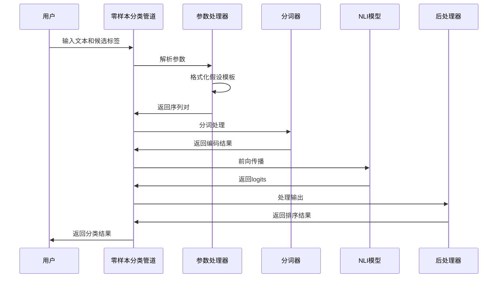

**图表来源**
- [zero_shot_classification.py](file://src/transformers/pipelines/zero_shot_classification.py#L174-L268)

## 详细组件分析

### 零样本分类管道类

主管道类实现了完整的分类工作流程：

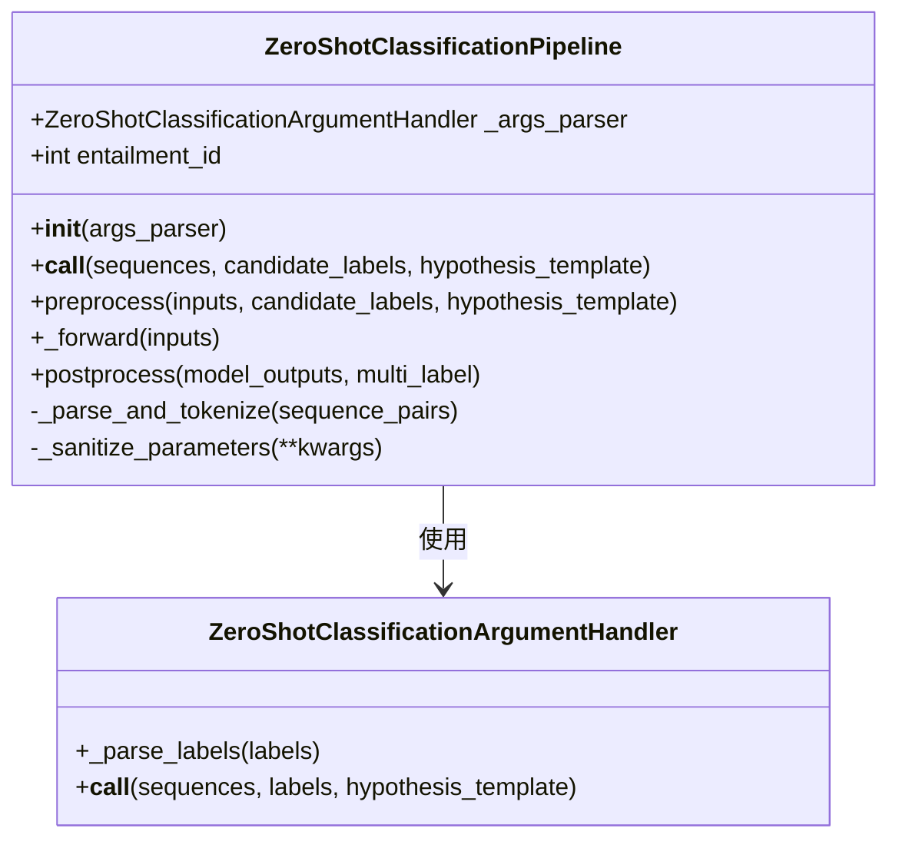

**图表来源**
- [zero_shot_classification.py](file://src/transformers/pipelines/zero_shot_classification.py#L45-L95)
- [zero_shot_classification.py](file://src/transformers/pipelines/zero_shot_classification.py#L13-L37)

#### 关键方法分析

1. **__call__ 方法**：主要入口点，处理用户输入
2. **preprocess 方法**：将输入转换为模型可接受的格式
3. **_forward 方法**：执行模型推理
4. **postprocess 方法**：处理模型输出并生成最终结果

**章节来源**
- [zero_shot_classification.py](file://src/transformers/pipelines/zero_shot_classification.py#L174-L268)

### 参数处理器详解

参数处理器负责：
- 解析候选标签字符串
- 验证假设模板格式
- 生成序列对列表

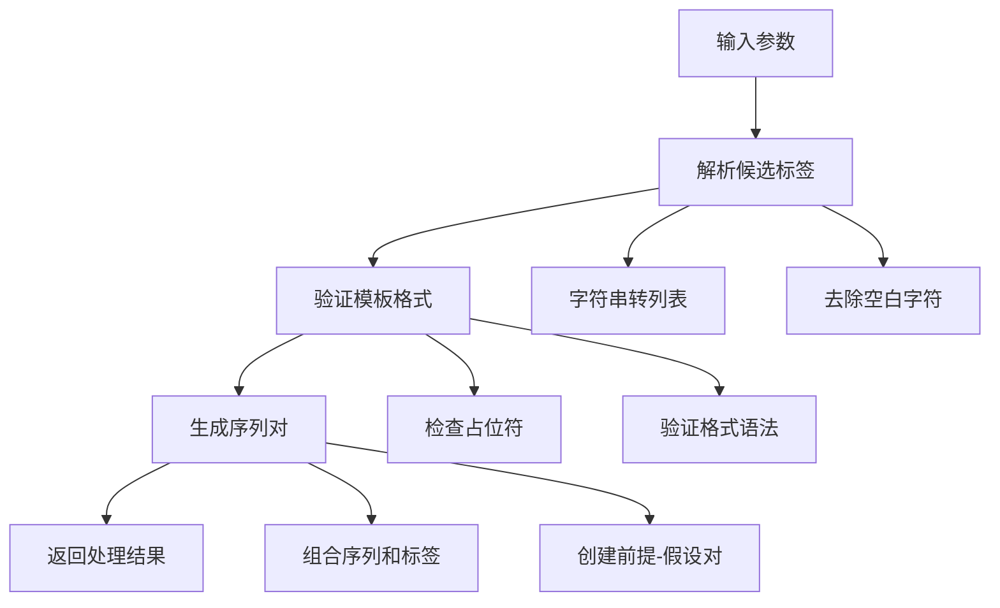

**图表来源**
- [zero_shot_classification.py](file://src/transformers/pipelines/zero_shot_classification.py#L13-L37)

**章节来源**
- [zero_shot_classification.py](file://src/transformers/pipelines/zero_shot_classification.py#L13-L37)

## 候选标签系统

### 标签格式规范

候选标签可以以多种格式提供：

| 格式类型 | 示例 | 描述 |
|---------|------|------|
| 字符串 | `"politics, health, science"` | 逗号分隔的标签字符串 |
| 列表 | `["politics", "health", "science"]` | Python列表格式 |
| 单个标签 | `"politics"` | 单一标签 |

### 标签解析机制

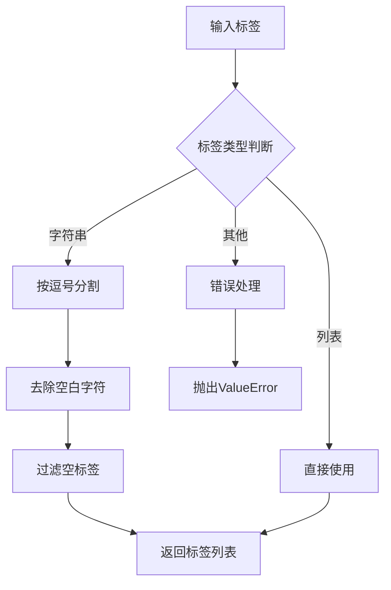

**图表来源**
- [zero_shot_classification.py](file://src/transformers/pipelines/zero_shot_classification.py#L18-L22)

**章节来源**
- [zero_shot_classification.py](file://src/transformers/pipelines/zero_shot_classification.py#L18-L22)

## 假设模板机制

### 默认模板设计

默认假设模板为："This example is {}."，其中{}是标签插入位置的占位符。

### 模板配置选项

| 参数 | 类型 | 默认值 | 描述 |
|------|------|--------|------|
| hypothesis_template | str | "This example is {}." | 假设模板字符串 |
| multi_label | bool | False | 是否允许多标签分类 |

### 模板验证机制

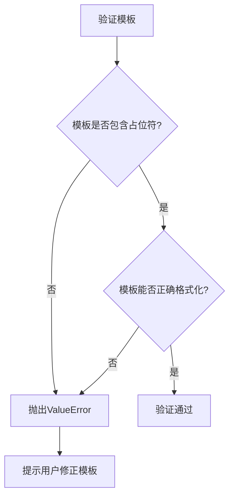

**图表来源**
- [zero_shot_classification.py](file://src/transformers/pipelines/zero_shot_classification.py#L24-L32)

### 自定义模板示例

不同任务场景下的模板设计：

| 任务类型 | 模板示例 | 适用场景 |
|---------|----------|----------|
| 文本分类 | "This text is about {}." | 通用文本分类 |
| 情感分析 | "This review expresses {} sentiment." | 情绪识别 |
| 语言检测 | "This text is written in {}." | 多语言识别 |
| 主题提取 | "The main theme of this text is {}." | 主题建模 |

**章节来源**
- [zero_shot_classification.py](file://src/transformers/pipelines/zero_shot_classification.py#L174-L191)

## NLI模型集成

### 支持的模型类型

零样本分类Pipeline基于经过NLI任务微调的模型：

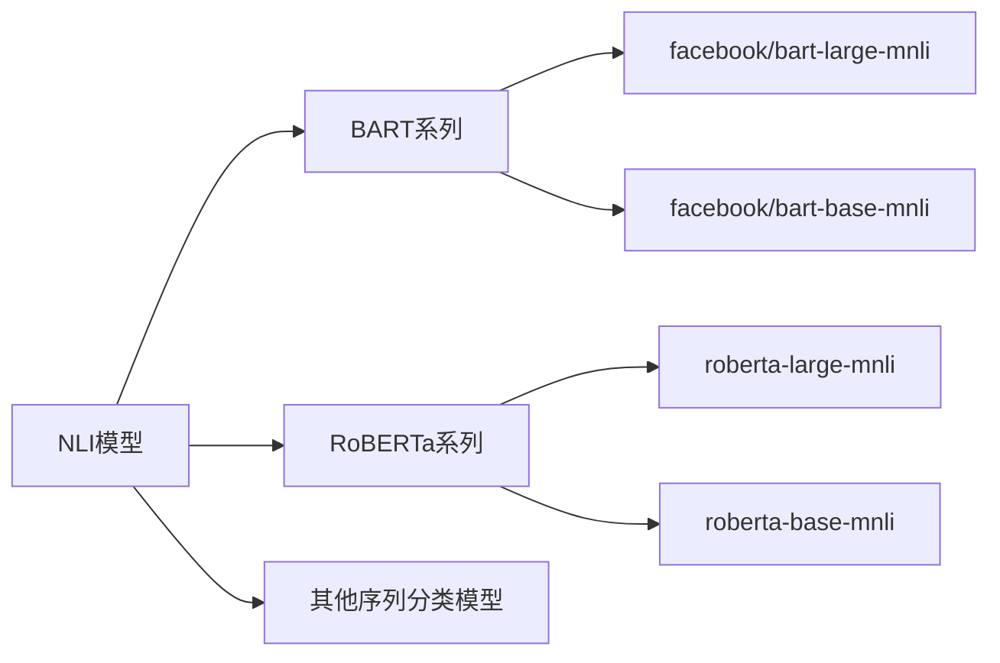

**图表来源**
- [__init__.py](file://src/transformers/pipelines/__init__.py#L241-L242)

### 推理机制

NLI模型通过以下步骤进行推理：

1. **前提-假设对构建**：将输入序列与每个候选标签组合
2. **序列编码**：使用分词器对组合序列进行编码
3. **模型推理**：输入到NLI模型获得logits
4. **标签映射**：从logits中提取蕴含（entailment）分数

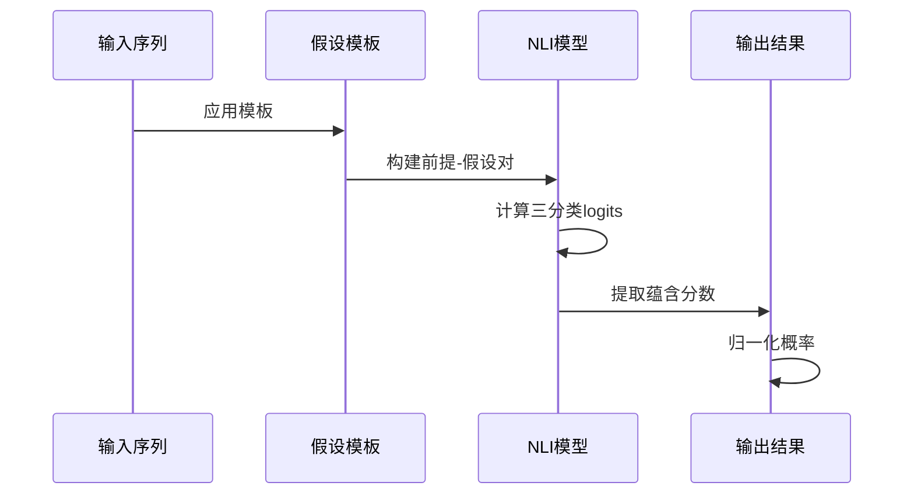

**图表来源**
- [zero_shot_classification.py](file://src/transformers/pipelines/zero_shot_classification.py#L249-L266)

### 蕴含标签识别

系统自动识别模型配置中的蕴含标签：

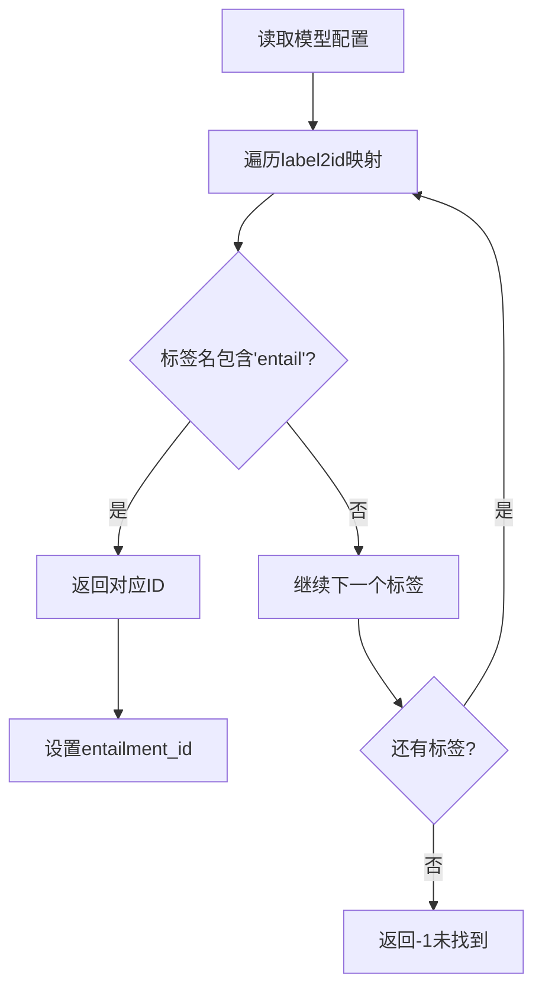

**图表来源**
- [zero_shot_classification.py](file://src/transformers/pipelines/zero_shot_classification.py#L87-L95)

**章节来源**
- [zero_shot_classification.py](file://src/transformers/pipelines/zero_shot_classification.py#L87-L95)

## 概率分布与排序

### 单标签分类

对于单标签分类，系统使用全局softmax归一化：

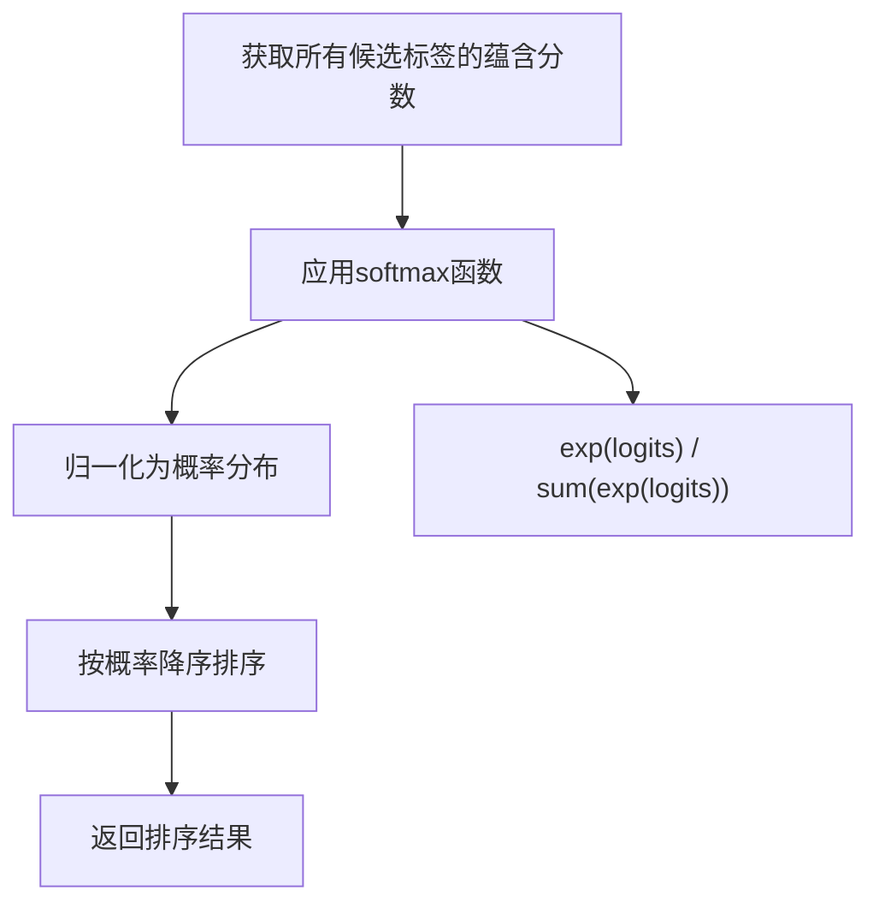

### 多标签分类

对于多标签分类，每个标签独立进行二分类：

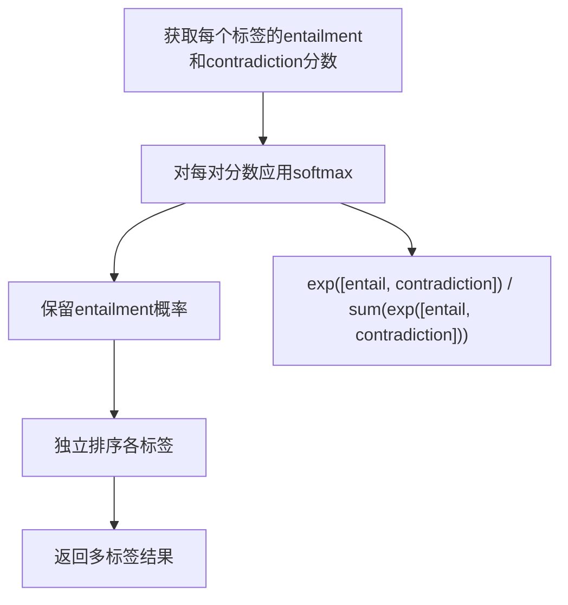

**图表来源**
- [zero_shot_classification.py](file://src/transformers/pipelines/zero_shot_classification.py#L249-L266)

### 概率计算公式

| 分类模式 | 计算公式 | 特点 |
|---------|----------|------|
| 单标签 | P(label_i) = exp(logit_i) / Σ(exp(logit_j)) | 概率和为1 |
| 多标签 | P(entailment) = exp(entail_logit) / (exp(entail_logit) + exp(contradict_logit)) | 独立概率 |

**章节来源**
- [zero_shot_classification.py](file://src/transformers/pipelines/zero_shot_classification.py#L249-L266)

## 实际应用示例

### 基础文本分类

```python
# 基础用法示例
from transformers import pipeline

classifier = pipeline("zero-shot-classification", 
                     model="facebook/bart-large-mnli")

result = classifier(
    "I have a problem with my iPhone that needs to be resolved asap!",
    candidate_labels=["urgent", "not urgent", "phone", "tablet", "computer"]
)
```

### 情感分析应用

```python
# 情感分析示例
sentiment_classifier = pipeline("zero-shot-classification",
                               model="facebook/bart-large-mnli")

text = "The movie was absolutely fantastic! I loved every minute of it."

sentiments = sentiment_classifier(
    text,
    candidate_labels=["positive", "negative", "neutral"],
    hypothesis_template="This text expresses {} sentiment."
)
```

### 多标签分类

```python
# 多标签分类示例
topic_classifier = pipeline("zero-shot-classification",
                           model="facebook/bart-large-mnli")

article = "The government announced new policies to combat climate change."

topics = topic_classifier(
    article,
    candidate_labels=["politics", "environment", "technology", "economy", "health"],
    multi_label=True
)
```

### 不同模板的应用

```python
# 不同模板的对比
texts = [
    "The new smartphone features advanced AI capabilities.",
    "This book explores quantum physics in simple terms."
]

templates = [
    "This text is about {}.",
    "The topic of this text is {}.",
    "This paragraph discusses {}."
]

for template in templates:
    result = classifier(
        texts[0],
        candidate_labels=["technology", "science", "literature"],
        hypothesis_template=template
    )
    print(f"Template: {template}\nResult: {result}\n")
```

**章节来源**
- [test_pipelines_zero_shot.py](file://tests/pipelines/test_pipelines_zero_shot.py#L58-L77)

## 性能优化

### 模板设计最佳实践

1. **简洁性原则**：模板应尽量简短，避免复杂结构
2. **语义一致性**：确保模板语义与任务目标一致
3. **上下文相关**：根据具体应用场景调整模板内容

### 标签选择策略

| 策略 | 适用场景 | 优势 | 注意事项 |
|------|----------|------|----------|
| 精确标签 | 明确分类任务 | 结果准确 | 可能遗漏相关类别 |
| 广泛标签 | 探索性分析 | 覆盖面广 | 结果可能不够精确 |
| 层次标签 | 多级分类 | 结构清晰 | 实现复杂度高 |

### 性能调优建议

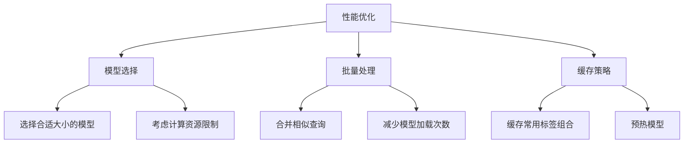

### 内存优化

- **序列截断**：合理设置最大长度
- **批处理优化**：平衡内存使用和处理速度
- **模型量化**：考虑使用量化版本模型

## 故障排除指南

### 常见问题及解决方案

| 问题类型 | 症状 | 原因 | 解决方案 |
|---------|------|------|----------|
| 模板错误 | ValueError异常 | 模板缺少占位符 | 添加{}或类似占位符 |
| 标签为空 | ValueError | 候选标签列表为空 | 提供至少一个有效标签 |
| 模型加载失败 | ImportError | 模型不可用 | 检查模型名称和网络连接 |
| 性能问题 | 处理缓慢 | 模型过大或批次过小 | 优化模型选择和批处理大小 |

### 错误诊断流程

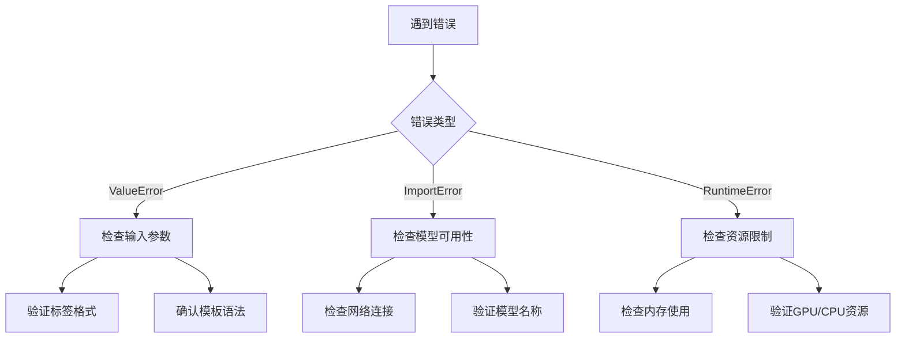

### 调试技巧

1. **逐步验证**：先测试简单输入，再处理复杂情况
2. **参数检查**：仔细检查所有输入参数的格式和内容
3. **日志分析**：关注警告信息和错误堆栈
4. **版本兼容**：确保使用的模型和库版本兼容

**章节来源**
- [test_pipelines_zero_shot.py](file://tests/pipelines/test_pipelines_zero_shot.py#L104-L131)

## 结论

零样本分类Pipeline为自然语言处理提供了强大的无监督分类能力。通过基于NLI模型的设计，它能够在无需特定任务训练的情况下实现灵活的文本分类。关键优势包括：

### 技术优势
- **灵活性**：支持动态标签定义和自定义模板
- **准确性**：基于预训练NLI模型的高质量推理
- **易用性**：简洁的API设计和丰富的配置选项

### 应用价值
- **快速原型**：无需训练即可进行概念验证
- **多领域适应**：适用于各种文本分类任务
- **成本效益**：减少标注和训练成本

### 发展方向
随着大语言模型的发展，零样本分类技术将继续演进，在更多模态和更复杂的任务中发挥重要作用。未来的改进可能包括更好的模板学习算法、更高效的推理机制以及更广泛的多模态支持。

通过深入理解零样本分类Pipeline的实现原理和最佳实践，开发者可以充分利用这一强大工具，在各种应用场景中实现创新的文本分类解决方案。