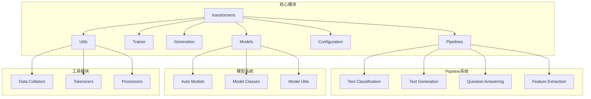
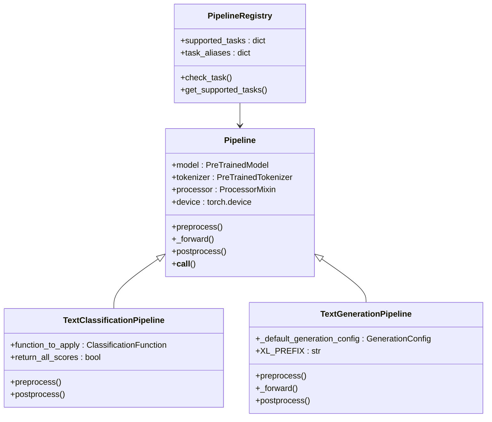
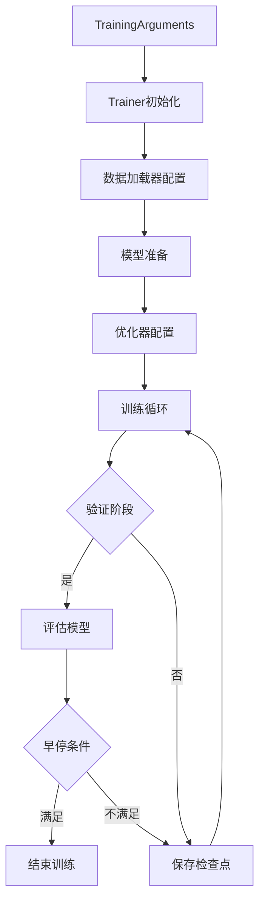
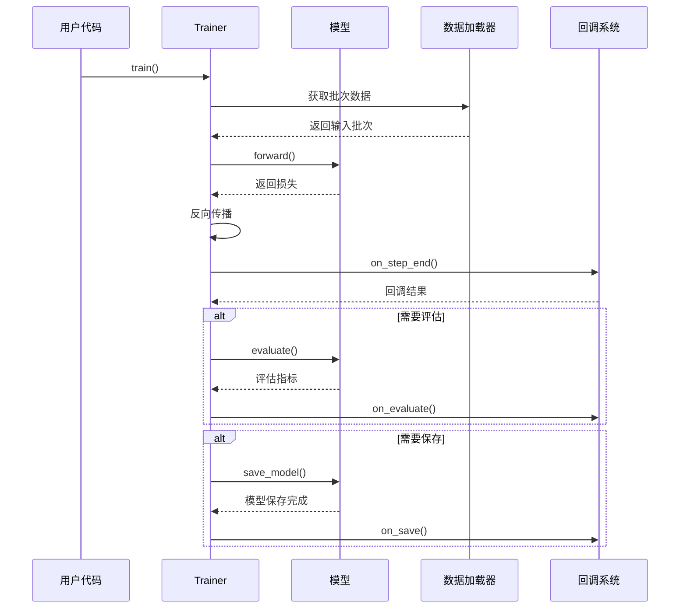
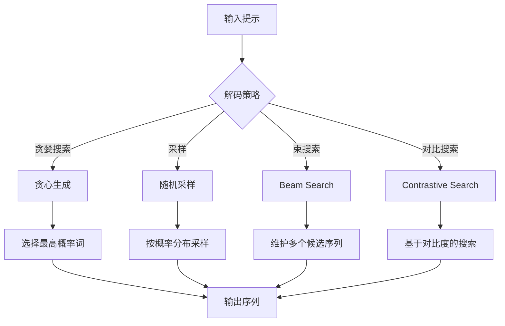
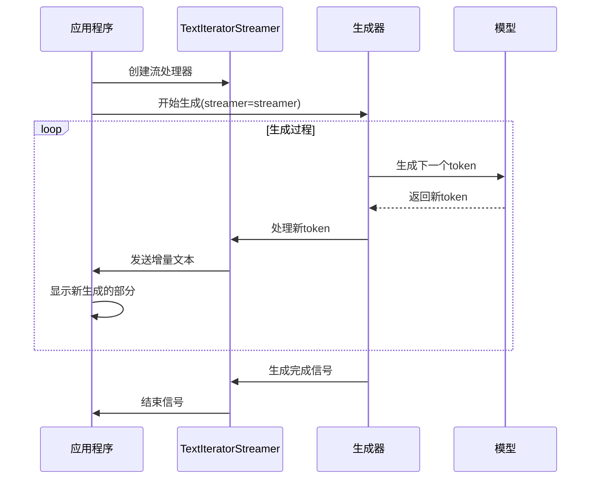
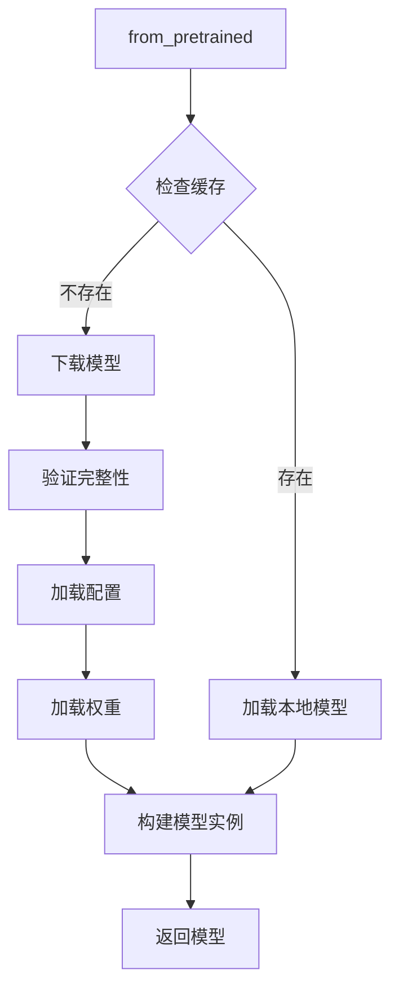
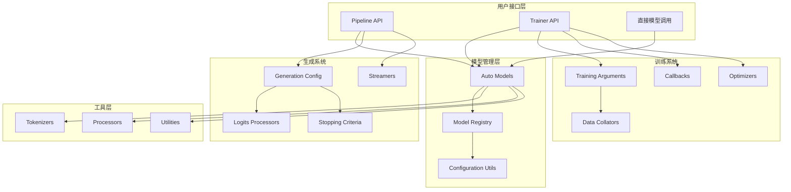

# 核心概念

<cite>
**本文档中引用的文件**
- [src/transformers/__init__.py](file://src/transformers/__init__.py)
- [src/transformers/pipelines/__init__.py](file://src/transformers/pipelines/__init__.py)
- [src/transformers/pipelines/base.py](file://src/transformers/pipelines/base.py)
- [src/transformers/pipelines/text_classification.py](file://src/transformers/pipelines/text_classification.py)
- [src/transformers/pipelines/text_generation.py](file://src/transformers/pipelines/text_generation.py)
- [src/transformers/trainer.py](file://src/transformers/trainer.py)
- [src/transformers/training_args.py](file://src/transformers/training_args.py)
- [src/transformers/generation/__init__.py](file://src/transformers/generation/__init__.py)
- [src/transformers/generation/configuration_utils.py](file://src/transformers/generation/configuration_utils.py)
- [src/transformers/generation/streamers.py](file://src/transformers/generation/streamers.py)
- [src/transformers/models/auto/__init__.py](file://src/transformers/models/auto/__init__.py)
- [src/transformers/models/auto/modeling_auto.py](file://src/transformers/models/auto/modeling_auto.py)
- [src/transformers/configuration_utils.py](file://src/transformers/configuration_utils.py)
- [src/transformers/modeling_utils.py](file://src/transformers/modeling_utils.py)
</cite>

## 目录
1. [简介](#简介)
2. [项目结构概览](#项目结构概览)
3. [Pipeline API系统](#pipeline-api系统)
4. [Trainer训练系统](#trainer训练系统)
5. [生成系统](#生成系统)
6. [模型架构基础](#模型架构基础)
7. [核心组件关系图](#核心组件关系图)
8. [常见问题与解决方案](#常见问题与解决方案)
9. [总结](#总结)

## 简介

Transformers库是Hugging Face开发的深度学习框架，专门用于自然语言处理任务。它提供了统一的接口来处理各种AI模型，支持从简单的文本分类到复杂的对话系统等多种应用场景。本文档将深入探讨transformers库的核心概念，包括Pipeline API、Trainer系统、生成系统和模型架构等关键组件。

## 项目结构概览

Transformers库采用模块化设计，主要分为以下几个核心部分：



**图表来源**
- [src/transformers/__init__.py](file://src/transformers/__init__.py#L50-L150)
- [src/transformers/pipelines/__init__.py](file://src/transformers/pipelines/__init__.py#L100-L200)

**章节来源**
- [src/transformers/__init__.py](file://src/transformers/__init__.py#L1-L100)

## Pipeline API系统

### 设计原理

Pipeline API是transformers库中最直观的用户接口，它封装了模型加载、预处理、推理和后处理的完整流程。Pipeline的设计遵循以下原则：

1. **统一接口**：所有任务类型都通过相同的API调用
2. **自动配置**：根据任务类型自动选择合适的模型和处理器
3. **可扩展性**：支持自定义任务和模型
4. **易用性**：简化了模型使用的复杂性

### 架构组成



**图表来源**
- [src/transformers/pipelines/base.py](file://src/transformers/pipelines/base.py#L50-L150)
- [src/transformers/pipelines/text_classification.py](file://src/transformers/pipelines/text_classification.py#L40-L80)
- [src/transformers/pipelines/text_generation.py](file://src/transformers/pipelines/text_generation.py#L40-L80)

### 支持的任务类型

transformers库支持超过50种不同的任务类型，涵盖了文本、图像、音频等多个模态：

| 任务类型 | 描述 | 示例 |
|---------|------|------|
| 文本分类 | 将文本分类到预定义类别 | 情感分析、主题分类 |
| 文本生成 | 生成连贯的文本序列 | 对话系统、文本续写 |
| 问答系统 | 回答基于上下文的问题 | 阅读理解、FAQ系统 |
| 填充掩码 | 预测被掩码的词语 | 语言建模、完形填空 |
| 实体识别 | 识别文本中的命名实体 | 人名、地名、组织名 |
| 特征提取 | 提取文本的向量表示 | 文本相似度、聚类分析 |

### 使用模式

#### 基础使用
```python
# 加载默认模型进行情感分析
classifier = pipeline("sentiment-analysis")
result = classifier("I love this product!")

# 多样本批量处理
results = classifier([
    "This is amazing!",
    "I'm not sure how I feel about this.",
    "Terrible experience."
])
```

#### 自定义配置
```python
# 指定特定模型和配置
generator = pipeline(
    "text-generation",
    model="gpt2",
    tokenizer="gpt2",
    device=0,
    max_length=100
)
```

**章节来源**
- [src/transformers/pipelines/__init__.py](file://src/transformers/pipelines/__init__.py#L150-L300)
- [src/transformers/pipelines/text_classification.py](file://src/transformers/pipelines/text_classification.py#L1-L100)

## Trainer训练系统

### 功能概述

Trainer系统是一个完整的训练框架，提供了从数据准备到模型评估的全流程支持。它解决了分布式训练、内存优化、检查点管理等复杂问题。

### 核心特性



**图表来源**
- [src/transformers/trainer.py](file://src/transformers/trainer.py#L200-L400)
- [src/transformers/training_args.py](file://src/transformers/training_args.py#L100-L200)

### 训练参数配置

TrainingArguments类包含了训练过程中的所有配置选项：

| 参数类别 | 主要参数 | 描述 |
|---------|---------|------|
| 基本设置 | output_dir, num_train_epochs | 输出目录和训练轮数 |
| 批处理 | per_device_train_batch_size, gradient_accumulation_steps | 批大小和梯度累积 |
| 优化 | learning_rate, weight_decay | 学习率和权重衰减 |
| 调度 | lr_scheduler_type, warmup_steps | 学习率调度策略 |
| 评估 | evaluation_strategy, eval_steps | 评估频率和策略 |
| 保存 | save_strategy, save_steps | 检查点保存策略 |
| 日志 | logging_dir, logging_steps | 日志记录配置 |

### 训练流程



**图表来源**
- [src/transformers/trainer.py](file://src/transformers/trainer.py#L400-L600)

### 回调系统

Trainer提供了灵活的回调系统，允许在训练过程中执行自定义操作：

```python
# 自定义回调示例
class CustomCallback(TrainerCallback):
    def on_step_end(self, args, state, control, **kwargs):
        if state.global_step % 100 == 0:
            print(f"Step {state.global_step}: Loss = {state.log_history[-1]['loss']}")
```

**章节来源**
- [src/transformers/trainer.py](file://src/transformers/trainer.py#L1-L200)
- [src/transformers/training_args.py](file://src/transformers/training_args.py#L1-L200)

## 生成系统

### 工作机制

生成系统负责控制模型的文本生成过程，提供了多种解码策略和生成配置选项。

### 解码策略



**图表来源**
- [src/transformers/generation/configuration_utils.py](file://src/transformers/generation/configuration_utils.py#L50-L100)

### 生成配置

GenerationConfig类提供了丰富的生成参数控制：

| 参数类别 | 主要参数 | 功能描述 |
|---------|---------|----------|
| 长度控制 | max_length, max_new_tokens, min_length | 控制生成序列长度 |
| 采样策略 | do_sample, temperature, top_k, top_p | 控制随机性和多样性 |
| 束搜索 | num_beams, early_stopping, length_penalty | 束搜索相关参数 |
| 停止条件 | max_time, stop_strings | 生成停止条件 |
| 缓存优化 | use_cache, cache_implementation | KV缓存配置 |

### 流式输出

生成系统支持实时流式输出，特别适用于交互式应用：



**图表来源**
- [src/transformers/generation/streamers.py](file://src/transformers/generation/streamers.py#L195-L230)

### 流式输出示例

```python
from transformers import AutoModelForCausalLM, AutoTokenizer, TextIteratorStreamer
from threading import Thread

# 初始化模型和分词器
model = AutoModelForCausalLM.from_pretrained("gpt2")
tokenizer = AutoTokenizer.from_pretrained("gpt2")
inputs = tokenizer("The future of AI is", return_tensors="pt")

# 创建流处理器
streamer = TextIteratorStreamer(tokenizer, skip_prompt=True)

# 在单独线程中启动生成
generation_kwargs = dict(inputs, streamer=streamer, max_new_tokens=200)
thread = Thread(target=model.generate, kwargs=generation_kwargs)
thread.start()

# 实时获取生成的文本
generated_text = ""
for new_text in streamer:
    generated_text += new_text
    print(new_text, end="", flush=True)
```

**章节来源**
- [src/transformers/generation/configuration_utils.py](file://src/transformers/generation/configuration_utils.py#L1-L200)
- [src/transformers/generation/streamers.py](file://src/transformers/generation/streamers.py#L1-L150)

## 模型架构基础

### 模型加载机制

transformers库提供了统一的模型加载接口，支持从本地文件、Hugging Face Hub或自定义源加载模型：



**图表来源**
- [src/transformers/modeling_utils.py](file://src/transformers/modeling_utils.py#L4260-L4290)

### Auto模型系统

Auto模型系统提供了自动化的模型选择和加载功能：

```python
# 自动选择适合任务的模型
from transformers import AutoModel, AutoTokenizer, AutoConfig

# 加载配置
config = AutoConfig.from_pretrained("bert-base-uncased")

# 加载分词器
tokenizer = AutoTokenizer.from_pretrained("bert-base-uncased")

# 加载模型
model = AutoModel.from_pretrained("bert-base-uncased")
```

### 模型保存与加载

```python
# 保存模型
model.save_pretrained("./my_model_directory")
tokenizer.save_pretrained("./my_model_directory")

# 加载模型
model = AutoModel.from_pretrained("./my_model_directory")
tokenizer = AutoTokenizer.from_pretrained("./my_model_directory")
```

### 自定义模型

```python
# 定义自定义配置
class CustomConfig(PreTrainedConfig):
    model_type = "custom_model"
    
    def __init__(self, hidden_size=768, num_layers=12, **kwargs):
        super().__init__(**kwargs)
        self.hidden_size = hidden_size
        self.num_layers = num_layers

# 注册自定义模型
from transformers import AutoConfig, AutoModel
        
AutoConfig.register("custom_model", CustomConfig)
AutoModel.register(CustomConfig, CustomModel)
```

**章节来源**
- [src/transformers/modeling_utils.py](file://src/transformers/modeling_utils.py#L1-L200)
- [src/transformers/configuration_utils.py](file://src/transformers/configuration_utils.py#L1-L200)

## 核心组件关系图



**图表来源**
- [src/transformers/__init__.py](file://src/transformers/__init__.py#L50-L200)
- [src/transformers/pipelines/__init__.py](file://src/transformers/pipelines/__init__.py#L100-L200)

## 常见问题与解决方案

### 性能优化

1. **内存优化**
   - 使用混合精度训练（fp16/bf16）
   - 启用梯度检查点
   - 使用模型并行

2. **计算优化**
   - 启用Flash Attention
   - 使用编译优化（torch.compile）
   - 批处理优化

3. **I/O优化**
   - 使用更快的存储设备
   - 并行数据加载
   - 缓存频繁访问的数据

### 内存管理

```python
# 内存优化示例
training_args = TrainingArguments(
    output_dir="./results",
    per_device_train_batch_size=4,  # 减小批大小
    gradient_accumulation_steps=8,   # 增加梯度累积步数
    fp16=True,                      # 启用混合精度
    dataloader_pin_memory=False,    # 禁用内存固定
)
```

### 分布式训练

```python
# 单机多卡训练
training_args = TrainingArguments(
    output_dir="./results",
    per_device_train_batch_size=2,
    gradient_accumulation_steps=4,
    dataloader_num_workers=4,
    remove_unused_columns=False,
    push_to_hub=False,
    report_to="none",
)
```

### 常见错误解决

1. **CUDA内存不足**
   - 减少批大小
   - 启用梯度检查点
   - 使用CPU卸载

2. **模型加载失败**
   - 检查网络连接
   - 验证模型文件完整性
   - 使用本地缓存

3. **生成质量差**
   - 调整温度参数
   - 使用更好的解码策略
   - 增加模型规模

## 总结

Transformers库通过其精心设计的核心概念，为深度学习应用提供了强大而灵活的基础设施：

1. **Pipeline API**提供了简单易用的高级接口，适合快速原型开发和生产部署
2. **Trainer系统**提供了完整的训练框架，支持大规模分布式训练
3. **生成系统**控制着模型的文本生成过程，支持多种解码策略和流式输出
4. **模型架构基础**确保了模型的一致性和可扩展性

这些组件相互协作，形成了一个完整的AI应用开发生态系统。无论是初学者还是经验丰富的开发者，都能在这个框架中找到适合自己需求的解决方案。随着transformers库的持续发展，这些核心概念将继续演进，为AI技术的发展提供更强大的支撑。