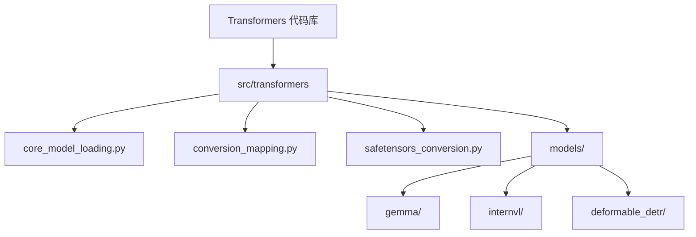
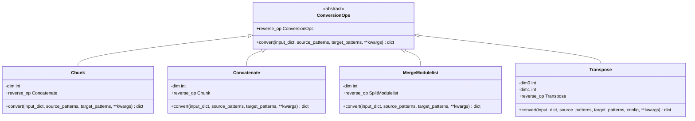

# 权重转换器

<cite>
**本文档引用的文件**   
- [conversion_mapping.py](file://src/transformers/conversion_mapping.py)
- [core_model_loading.py](file://src/transformers/core_model_loading.py)
- [safetensors_conversion.py](file://src/transformers/safetensors_conversion.py)
- [modeling_utils.py](file://src/transformers/modeling_utils.py)
- [convert_gemma_weights_to_hf.py](file://src/transformers/models/gemma/convert_gemma_weights_to_hf.py)
- [convert_deformable_detr_to_pytorch.py](file://src/transformers/models/deformable_detr/convert_deformable_detr_to_pytorch.py)
- [convert_internvl_weights_to_hf.py](file://src/transformers/models/internvl/convert_internvl_weights_to_hf.py)
</cite>

## 目录
1. [项目结构](#项目结构)
2. [核心组件](#核心组件)
3. [权重转换架构](#权重转换架构)
4. [权重转换操作](#权重转换操作)
5. [模型特定转换](#模型特定转换)
6. [自动转换与兼容性](#自动转换与兼容性)

## 项目结构
Transformers代码库的项目结构清晰地组织了权重转换相关的功能。核心的权重转换逻辑主要位于`src/transformers`目录下，特别是`core_model_loading.py`和`conversion_mapping.py`文件中。`models`子目录包含了针对特定模型（如Gemma、InternVL等）的专用权重转换脚本。此外，`safetensors_conversion.py`文件处理了从传统PyTorch二进制格式到更安全的safetensors格式的自动转换。



**Diagram sources**
- [conversion_mapping.py](file://src/transformers/conversion_mapping.py)
- [core_model_loading.py](file://src/transformers/core_model_loading.py)

**Section sources**
- [conversion_mapping.py](file://src/transformers/conversion_mapping.py)
- [core_model_loading.py](file://src/transformers/core_model_loading.py)

## 核心组件
权重转换器的核心功能由`core_model_loading.py`中的`WeightConverter`和`WeightRenaming`类实现。`WeightConverter`用于执行复杂的权重转换操作，如张量的拼接、分块和转置，而`WeightRenaming`则用于简单的键名重命名。这些类通过`conversion_mapping.py`文件中定义的映射规则进行配置，该文件为不同的模型类型（如Mixtral、Qwen2-MoE）定义了特定的转换策略。`convert_and_load_state_dict_in_model`函数是整个转换过程的入口点，它协调了从检查点加载状态字典、应用转换规则到最终将权重加载到模型中的所有步骤。

**Section sources**
- [core_model_loading.py](file://src/transformers/core_model_loading.py#L566-L679)
- [conversion_mapping.py](file://src/transformers/conversion_mapping.py#L42-L243)

## 权重转换架构
权重转换器的架构设计为一个灵活且可扩展的系统。其核心是一个基于映射的转换引擎，该引擎根据模型类型查找并应用预定义的转换规则。这些规则由`WeightConverter`或`WeightRenaming`对象的列表组成，每个对象都指定了源模式、目标模式以及要执行的操作。转换过程是异步的，利用线程池来并行化I/O操作，从而提高大型模型的加载效率。对于需要张量并行（Tensor Parallelism）的模型，系统还集成了`shard_tensor`功能，可以在加载时对权重进行分片。

```mermaid
graph TD
A[加载检查点] --> B[获取转换映射]
B --> C{是特定模型吗?}
C --> |是| D[应用模型特定映射]
C --> |否| E[应用通用映射]
D --> F[应用转换操作]
E --> F
F --> G[异步加载张量]
G --> H[应用TP分片 (可选)]
H --> I[加载到模型]
```

**Diagram sources**
- [core_model_loading.py](file://src/transformers/core_model_loading.py#L889-L1150)
- [conversion_mapping.py](file://src/transformers/conversion_mapping.py#L249-L335)

## 权重转换操作
权重转换器支持多种原子操作，这些操作通过`ConversionOps`基类实现。关键操作包括：
- **Chunk**: 沿指定维度将一个张量分割成多个相等大小的块。常用于将合并的`qkv`权重拆分为独立的`q`、`k`、`v`权重。
- **Concatenate**: 沿指定维度连接多个张量。常用于将MoE模型中专家的`gate`和`up`投影权重合并。
- **MergeModulelist**: 将模块列表中的张量堆叠成一个张量，通常与`Concatenate`结合使用。
- **Transpose**: 转置张量的两个维度。
- **ErnieFuseAndSplitTextVisionExperts**: 一个复杂的操作，用于处理像ERNIE-VL-MoE这样的多模态MoE模型，它将文本和视觉专家的权重进行融合和拆分。



**Diagram sources**
- [core_model_loading.py](file://src/transformers/core_model_loading.py#L85-L441)

## 模型特定转换
对于许多模型，需要编写专用的转换脚本来处理其独特的检查点格式。例如，`convert_gemma_weights_to_hf.py`脚本将Google的Gemma模型权重转换为Hugging Face格式。该脚本会处理`qkv_proj`权重的拆分，并将嵌入权重同时复制到`lm_head`。类似地，`convert_internvl_weights_to_hf.py`脚本处理InternVL模型，将`attn.qkv`权重拆分为`q_proj`、`k_proj`和`v_proj`。这些脚本通常包含一个`write_model`函数，该函数加载原始状态字典，应用转换逻辑，然后使用`save_pretrained`保存为标准格式。

**Section sources**
- [convert_gemma_weights_to_hf.py](file://src/transformers/models/gemma/convert_gemma_weights_to_hf.py)
- [convert_internvl_weights_to_hf.py](file://src/transformers/models/internvl/convert_internvl_weights_to_hf.py)

## 自动转换与兼容性
为了提高用户体验，系统实现了从PyTorch `.bin` 文件到 `safetensors` 格式的自动转换。当用户尝试加载一个只有`.bin`文件的模型时，`auto_conversion`函数会被触发。它会通过调用一个外部服务（`safetensors-convert.hf.space`）在后台创建一个包含`safetensors`变体的拉取请求（PR）。此功能确保了用户可以无缝地使用更安全的`safetensors`格式，而无需手动干预。此外，系统还维护了一个`legacy`映射，用于处理旧的命名约定，如将`LayerNorm.gamma`重命名为`LayerNorm.weight`，从而保证了向后兼容性。

**Section sources**
- [safetensors_conversion.py](file://src/transformers/safetensors_conversion.py)
- [conversion_mapping.py](file://src/transformers/conversion_mapping.py#L190-L223)