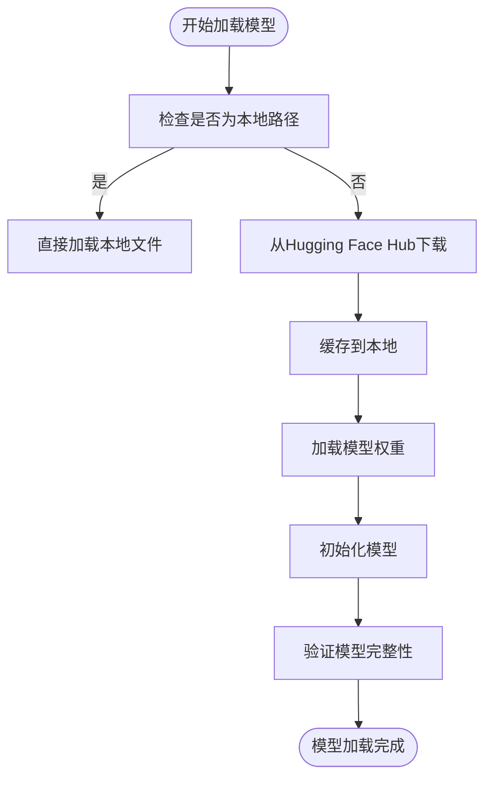
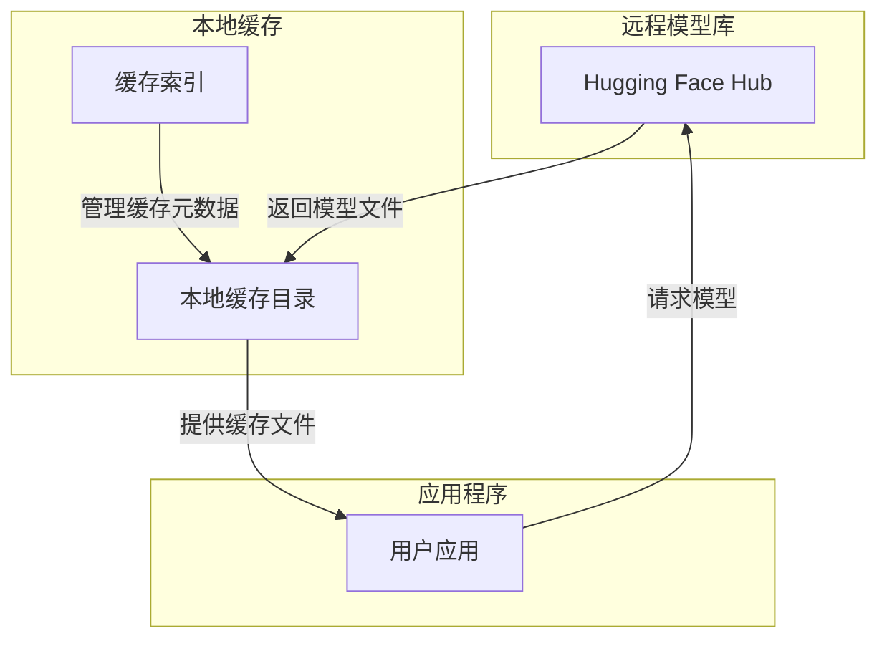
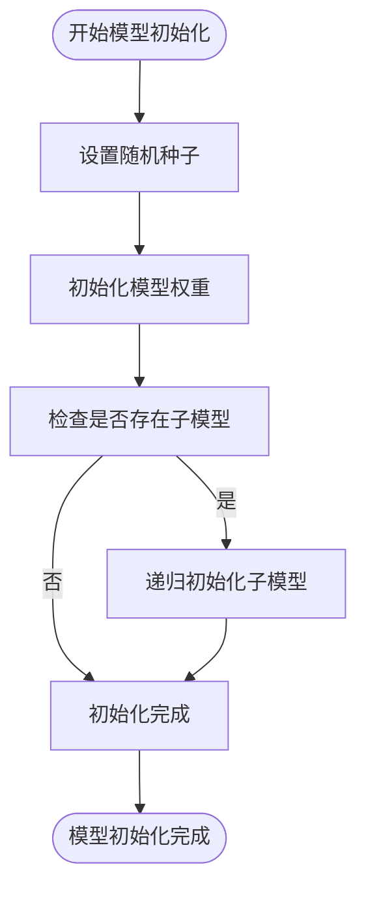
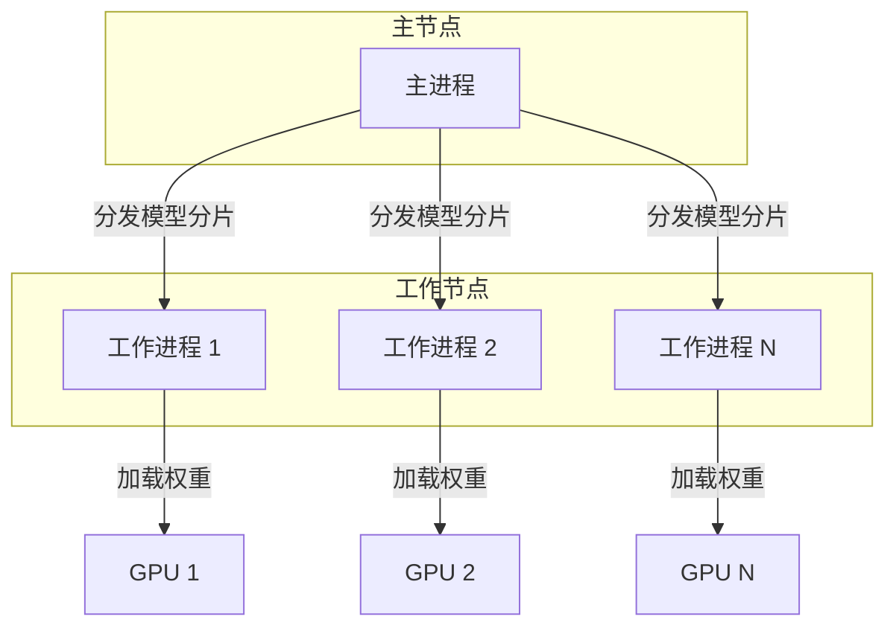
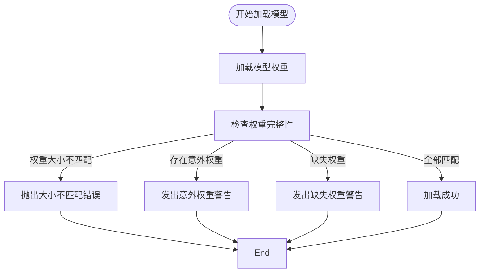
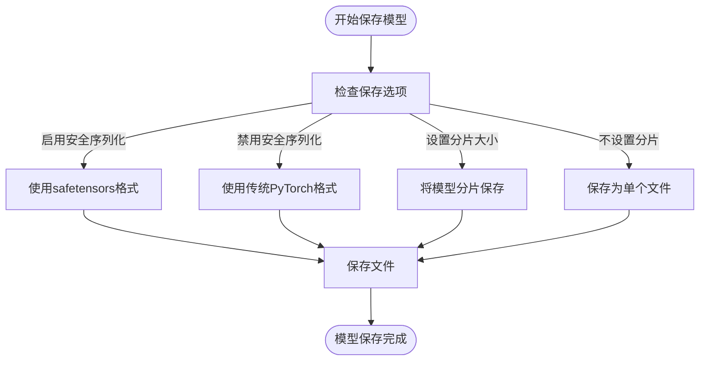
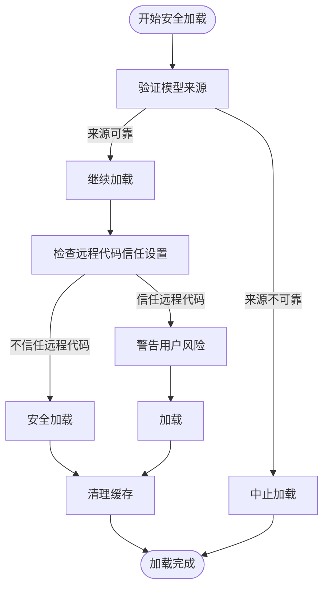

# 模型加载与保存

<cite>
**本文档中引用的文件**   
- [modeling_utils.py](file://src/transformers/modeling_utils.py)
- [hub.py](file://src/transformers/utils/hub.py)
- [configuration_utils.py](file://src/transformers/configuration_utils.py)
- [dynamic_module_utils.py](file://src/transformers/dynamic_module_utils.py)
</cite>

## 目录
1. [简介](#简介)
2. [核心加载与保存机制](#核心加载与保存机制)
3. [模型缓存与Hugging Face Hub集成](#模型缓存与hugging-face-hub集成)
4. [权重初始化与随机种子控制](#权重初始化与随机种子控制)
5. [分布式与并行加载](#分布式与并行加载)
6. [错误处理与警告](#错误处理与警告)
7. [高级加载选项与性能优化](#高级加载选项与性能优化)
8. [安全加载指南](#安全加载指南)

## 简介
本文档详细介绍了transformers库中模型的序列化和反序列化机制，重点分析了`from_pretrained()`和`save_pretrained()`方法的实现细节。文档涵盖了从本地或远程加载模型权重、处理不同格式的模型文件（如PyTorch、TensorFlow、Flax）、模型缓存机制、Hugging Face Hub集成、模型版本管理、缓存清理、模型权重初始化策略、随机种子控制等内容。同时提供了实际代码示例，展示了如何加载特定版本的模型、处理加载过程中的错误和警告、自定义加载路径，以及模型并行和分布式加载的特殊考虑。

## 核心加载与保存机制

transformers库通过`from_pretrained()`和`save_pretrained()`方法实现了模型的加载与保存功能。`from_pretrained()`方法用于从预训练模型配置中实例化一个模型，支持从Hugging Face模型库或本地目录加载。`save_pretrained()`方法则用于将模型及其配置文件保存到指定目录，以便后续重新加载。

**Diagram sources**
- [modeling_utils.py](file://src/transformers/modeling_utils.py#L4000-L4200)
- [hub.py](file://src/transformers/utils/hub.py#L300-L500)

**Section sources**
- [modeling_utils.py](file://src/transformers/modeling_utils.py#L4000-L4200)
- [hub.py](file://src/transformers/utils/hub.py#L300-L500)

## 模型缓存与Hugging Face Hub集成

transformers库通过Hugging Face Hub实现了模型的远程加载和缓存机制。当从远程加载模型时，系统会自动将模型文件下载并缓存到本地，以便后续快速访问。缓存路径可以通过环境变量进行配置，如`HF_HOME`、`HF_HUB_CACHE`等。

**Diagram sources**
- [hub.py](file://src/transformers/utils/hub.py#L300-L500)
- [modeling_utils.py](file://src/transformers/modeling_utils.py#L1000-L1200)

**Section sources**
- [hub.py](file://src/transformers/utils/hub.py#L300-L500)
- [modeling_utils.py](file://src/transformers/modeling_utils.py#L1000-L1200)

## 权重初始化与随机种子控制

transformers库提供了完善的权重初始化和随机种子控制机制，确保实验的可复现性。模型权重的初始化通过`_init_weights`方法实现，该方法会递归地初始化模型中所有模块的权重。随机种子的控制则通过`set_seed`函数实现，确保在不同运行中产生相同的随机数序列。

**Diagram sources**
- [modeling_utils.py](file://src/transformers/modeling_utils.py#L2663-L2679)
- [modeling_utils.py](file://src/transformers/modeling_utils.py#L2681-L2701)

**Section sources**
- [modeling_utils.py](file://src/transformers/modeling_utils.py#L2663-L2679)
- [modeling_utils.py](file://src/transformers/modeling_utils.py#L2681-L2701)

## 分布式与并行加载

transformers库支持分布式和并行加载，通过`device_map`参数可以指定模型各部分在不同设备上的分布。这对于大模型的加载和推理尤为重要，可以有效利用多GPU或多节点的计算资源。

**Diagram sources**
- [modeling_utils.py](file://src/transformers/modeling_utils.py#L4000-L4200)
- [integrations/tensor_parallel.py](file://src/transformers/integrations/tensor_parallel.py#L1111-L1138)

**Section sources**
- [modeling_utils.py](file://src/transformers/modeling_utils.py#L4000-L4200)
- [integrations/tensor_parallel.py](file://src/transformers/integrations/tensor_parallel.py#L1111-L1138)

## 错误处理与警告

transformers库在模型加载过程中提供了详细的错误处理和警告机制。当加载过程中出现权重大小不匹配、意外的权重键或缺失的权重键时，系统会抛出相应的错误或警告，帮助用户诊断问题。

**Diagram sources**
- [modeling_utils.py](file://src/transformers/modeling_utils.py#L4853-L4871)
- [modeling_utils.py](file://src/transformers/modeling_utils.py#L4000-L4200)

**Section sources**
- [modeling_utils.py](file://src/transformers/modeling_utils.py#L4853-L4871)
- [modeling_utils.py](file://src/transformers/modeling_utils.py#L4000-L4200)

## 高级加载选项与性能优化

transformers库提供了多种高级加载选项和性能优化技巧。通过`safe_serialization`参数可以启用安全序列化，使用`safetensors`格式保存模型，提高加载速度和安全性。通过`max_shard_size`参数可以控制模型分片的大小，优化大模型的加载性能。

**Diagram sources**
- [modeling_utils.py](file://src/transformers/modeling_utils.py#L3447-L3870)
- [hub.py](file://src/transformers/utils/hub.py#L300-L500)

**Section sources**
- [modeling_utils.py](file://src/transformers/modeling_utils.py#L3447-L3870)
- [hub.py](file://src/transformers/utils/hub.py#L300-L500)

## 安全加载指南

为了确保模型加载的安全性，建议遵循以下指南：使用`trust_remote_code=False`默认设置，避免执行远程代码；验证模型来源的可靠性；定期清理缓存以释放磁盘空间；使用版本控制确保模型的一致性。

**Diagram sources**
- [modeling_utils.py](file://src/transformers/modeling_utils.py#L4000-L4200)
- [dynamic_module_utils.py](file://src/transformers/dynamic_module_utils.py#L363-L385)

**Section sources**
- [modeling_utils.py](file://src/transformers/modeling_utils.py#L4000-L4200)
- [dynamic_module_utils.py](file://src/transformers/dynamic_module_utils.py#L363-L385)