# 模型架构

<cite>
**本文档中引用的文件**  
- [modeling_utils.py](file://src/transformers/modeling_utils.py)
- [configuration_utils.py](file://src/transformers/configuration_utils.py)
- [modeling_outputs.py](file://src/transformers/modeling_outputs.py)
- [bert/modeling_bert.py](file://src/transformers/models/bert/modeling_bert.py)
- [auto_factory.py](file://src/transformers/models/auto/auto_factory.py)
</cite>

## 目录
1. [引言](#引言)
2. [模型架构概述](#模型架构概述)
3. [核心基类设计](#核心基类设计)
4. [配置类结构与自定义](#配置类结构与自定义)
5. [模型输出设计模式](#模型输出设计模式)
6. [模型保存与加载机制](#模型保存与加载机制)
7. [权重共享与参数初始化](#权重共享与参数初始化)
8. [使用指南与最佳实践](#使用指南与最佳实践)
9. [结论](#结论)

## 引言
transformers库提供了一套统一的接口来处理各种预训练模型，其核心架构设计旨在实现模型的可扩展性、一致性和易用性。本文档深入探讨了transformers库中模型架构的设计原理和实现细节，重点介绍ModelMixin和PreTrainedModel基类的设计，配置类的结构与作用，以及模型输出的设计模式。通过详细分析这些核心组件，为开发者提供从基础使用到高级定制的全面指导。

## 模型架构概述
transformers库的模型架构基于面向对象的设计原则，通过继承和组合的方式构建了灵活且可扩展的模型体系。核心架构由三个主要组件构成：PreTrainedModel基类、PreTrainedConfig配置类和ModelOutput输出类。这些组件共同构成了一个完整的模型生态系统，支持从模型定义、配置管理到输出处理的全流程。

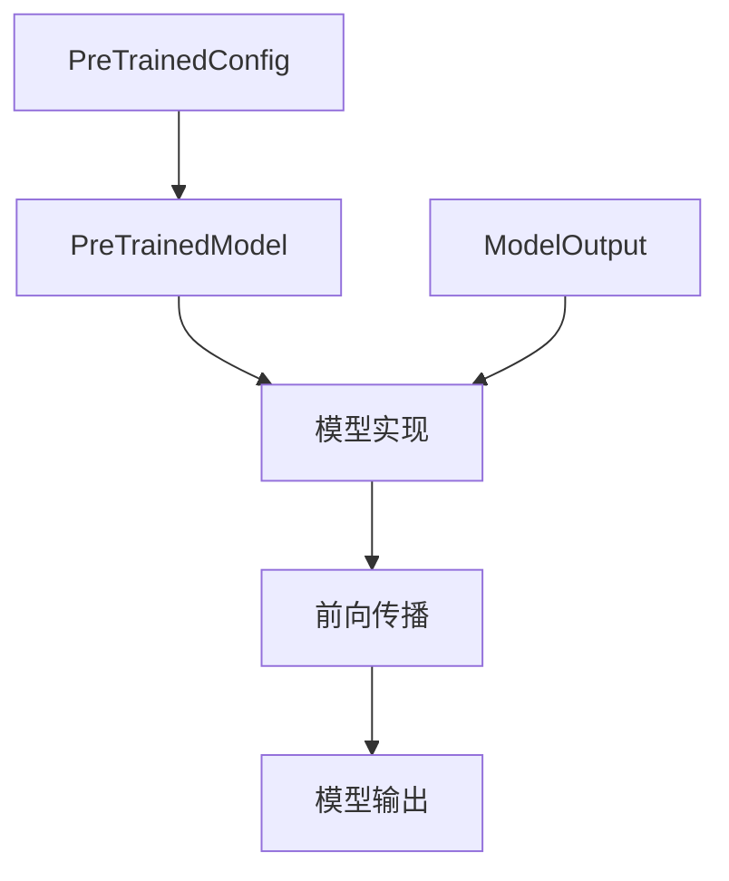

**Diagram sources**
- [modeling_utils.py](file://src/transformers/modeling_utils.py#L1643-L1839)
- [configuration_utils.py](file://src/transformers/configuration_utils.py#L100-L400)
- [modeling_outputs.py](file://src/transformers/modeling_outputs.py#L0-L200)

## 核心基类设计
transformers库的核心基类设计体现了高度的抽象和复用原则。PreTrainedModel作为所有模型的基类，继承自PyTorch的nn.Module，并融合了多个功能混入类（Mixin），提供了统一的模型接口和功能。

### PreTrainedModel基类
PreTrainedModel是所有预训练模型的基类，它不仅继承了PyTorch的nn.Module，还融合了EmbeddingAccessMixin、ModuleUtilsMixin、PushToHubMixin和PeftAdapterMixin等多个功能混入类。这种设计模式使得PreTrainedModel能够提供丰富的功能，包括嵌入访问、模块工具、模型推送和适配器集成等。

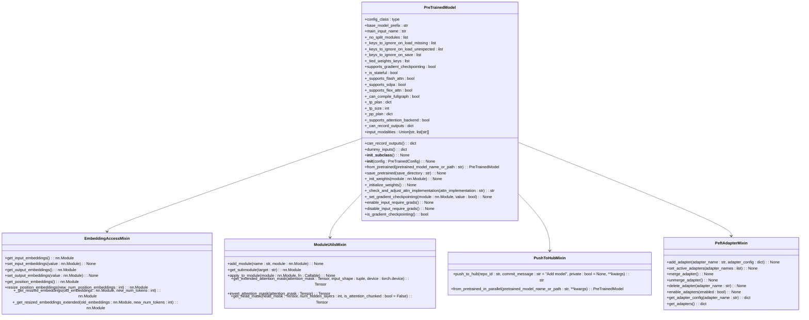

**Diagram sources**
- [modeling_utils.py](file://src/transformers/modeling_utils.py#L1643-L1839)

**Section sources**
- [modeling_utils.py](file://src/transformers/modeling_utils.py#L1643-L1839)

### ModelMixin设计模式
ModelMixin设计模式在transformers库中扮演着重要角色，它通过混入（Mixin）的方式为模型添加特定功能。例如，GenerationMixin为模型添加了生成能力，使得模型能够进行文本生成任务。这种设计模式允许在不修改基类的情况下，灵活地为模型添加新功能。

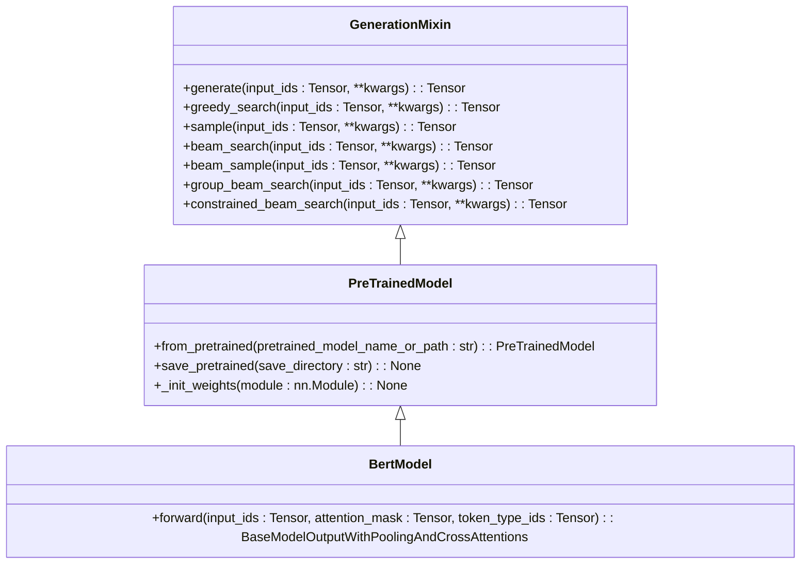

**Diagram sources**
- [auto_factory.py](file://src/transformers/models/auto/auto_factory.py#L487-L512)
- [modeling_utils.py](file://src/transformers/modeling_utils.py#L1643-L1839)

**Section sources**
- [auto_factory.py](file://src/transformers/models/auto/auto_factory.py#L487-L512)
- [modeling_utils.py](file://src/transformers/modeling_utils.py#L1643-L1839)

## 配置类结构与自定义
PreTrainedConfig类是transformers库中所有模型配置的基类，它负责存储和管理模型的配置参数。通过继承PreTrainedConfig，每个模型可以定义自己的配置类，从而实现配置的定制化。

### 配置类结构
PreTrainedConfig类定义了一系列通用的配置参数，包括模型类型、词汇表大小、隐藏层大小、注意力头数等。这些参数在模型初始化时被使用，并可以通过配置文件或代码进行修改。

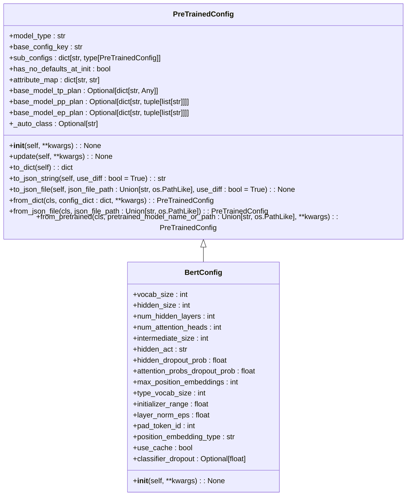

**Diagram sources**
- [configuration_utils.py](file://src/transformers/configuration_utils.py#L100-L400)

**Section sources**
- [configuration_utils.py](file://src/transformers/configuration_utils.py#L100-L400)

### 自定义模型配置
自定义模型配置是transformers库灵活性的重要体现。通过继承PreTrainedConfig，开发者可以定义自己的配置类，以适应特定的模型需求。例如，BertConfig类继承了PreTrainedConfig，并添加了BERT模型特有的配置参数。

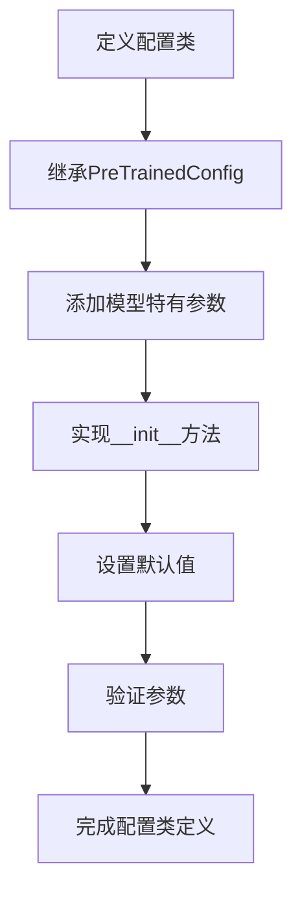

**Diagram sources**
- [configuration_utils.py](file://src/transformers/configuration_utils.py#L100-L400)

**Section sources**
- [configuration_utils.py](file://src/transformers/configuration_utils.py#L100-L400)

## 模型输出设计模式
ModelOutput类是transformers库中所有模型输出的基类，它通过数据类（dataclass）的方式定义了模型输出的结构。这种设计模式使得模型输出既具有良好的可读性，又便于访问和处理。

### ModelOutput设计原理
ModelOutput类的设计基于Python的数据类特性，通过@dataclass装饰器自动生成__init__、__repr__等方法。这使得模型输出对象可以像普通对象一样使用，同时保持了数据结构的清晰性。

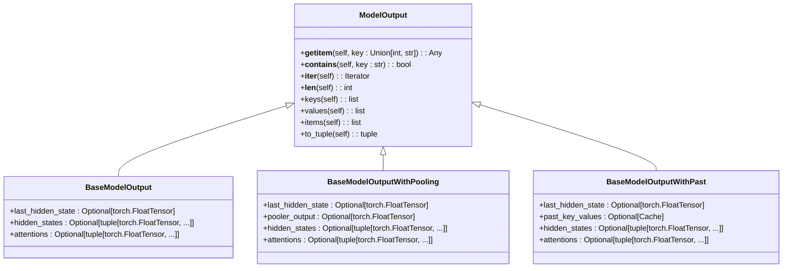

**Diagram sources**
- [modeling_outputs.py](file://src/transformers/modeling_outputs.py#L0-L200)

**Section sources**
- [modeling_outputs.py](file://src/transformers/modeling_outputs.py#L0-L200)

### 处理和访问中间输出
模型的中间输出对于调试和分析模型行为非常重要。通过设置output_hidden_states和output_attentions参数，可以获取模型的隐藏状态和注意力权重。这些输出可以通过ModelOutput对象的属性直接访问。

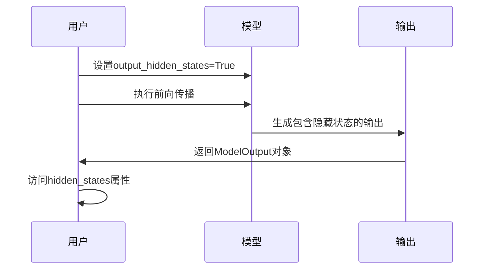

**Diagram sources**
- [modeling_outputs.py](file://src/transformers/modeling_outputs.py#L0-L200)

**Section sources**
- [modeling_outputs.py](file://src/transformers/modeling_outputs.py#L0-L200)

## 模型保存与加载机制
transformers库提供了完善的模型保存和加载机制，支持多种格式和场景。通过save_pretrained和from_pretrained方法，可以方便地将模型保存到磁盘或从磁盘加载。

### 模型保存
模型保存机制通过save_pretrained方法实现，该方法将模型的权重和配置文件保存到指定目录。支持安全序列化（safe_serialization）选项，以确保模型文件的安全性。

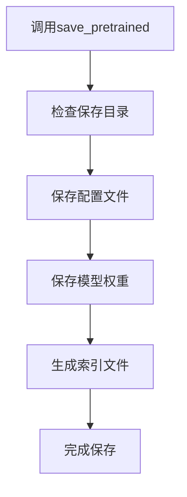

**Diagram sources**
- [modeling_utils.py](file://src/transformers/modeling_utils.py#L3437-L3463)

**Section sources**
- [modeling_utils.py](file://src/transformers/modeling_utils.py#L3437-L3463)

### 模型加载
模型加载机制通过from_pretrained方法实现，该方法从指定路径加载模型的权重和配置文件。支持从本地文件系统或远程仓库加载模型，并可以指定设备映射和量化配置。

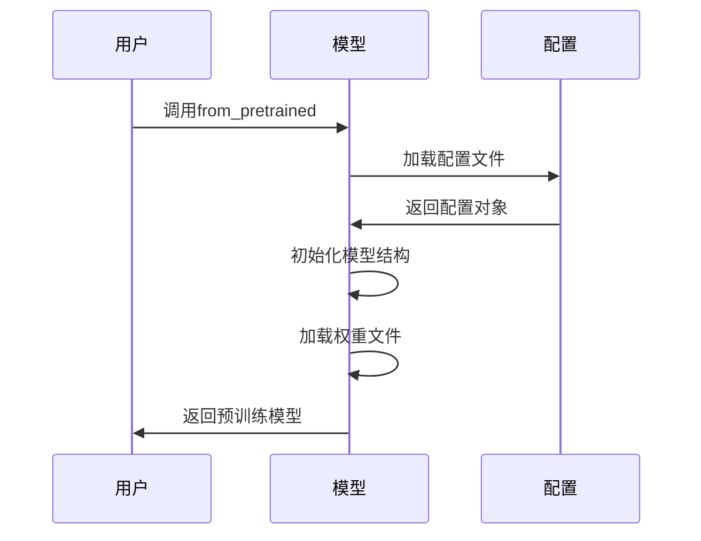

**Diagram sources**
- [modeling_utils.py](file://src/transformers/modeling_utils.py#L4264-L4287)

**Section sources**
- [modeling_utils.py](file://src/transformers/modeling_utils.py#L4264-L4287)

## 权重共享与参数初始化
transformers库中的权重共享和参数初始化策略对于模型性能和训练效率至关重要。通过合理的权重共享和初始化，可以提高模型的收敛速度和泛化能力。

### 权重共享机制
权重共享是transformers库中常见的优化技术，特别是在编码器-解码器架构中。通过共享输入和输出嵌入的权重，可以减少模型参数数量，提高训练效率。

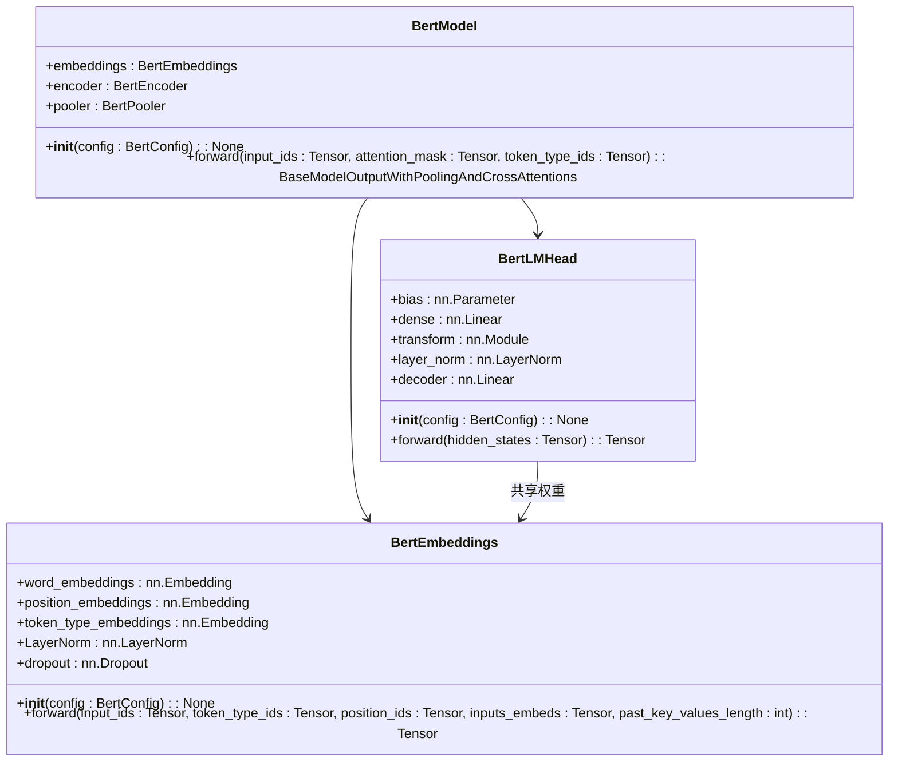

**Diagram sources**
- [modeling_bert.py](file://src/transformers/models/bert/modeling_bert.py#L0-L199)

**Section sources**
- [modeling_bert.py](file://src/transformers/models/bert/modeling_bert.py#L0-L199)

### 参数初始化策略
参数初始化策略对于模型训练的稳定性和收敛速度至关重要。transformers库提供了多种初始化方法，包括均匀分布、正态分布、截断正态分布等，并支持自定义初始化函数。

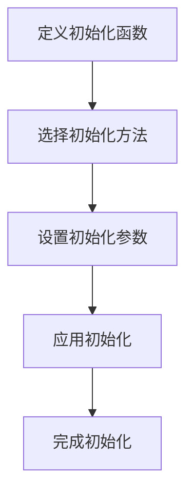

**Diagram sources**
- [modeling_utils.py](file://src/transformers/modeling_utils.py#L1643-L1839)

**Section sources**
- [modeling_utils.py](file://src/transformers/modeling_utils.py#L1643-L1839)

## 使用指南与最佳实践
本节为初学者和经验丰富的开发者提供使用transformers库的最佳实践指南，涵盖从基础使用到高级定制的各个方面。

### 基础使用指南
对于初学者，建议从加载预训练模型和执行前向传播开始。通过简单的API调用，可以快速实现模型的推理功能。

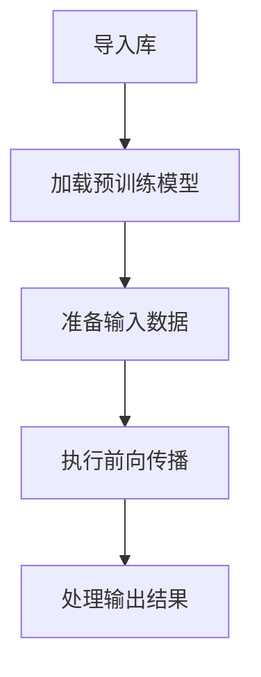

**Section sources**
- [modeling_utils.py](file://src/transformers/modeling_utils.py#L4264-L4287)

### 高级定制指导
对于经验丰富的开发者，可以通过继承PreTrainedModel和PreTrainedConfig来创建自定义模型。同时，利用ModelMixin设计模式可以灵活地为模型添加新功能。

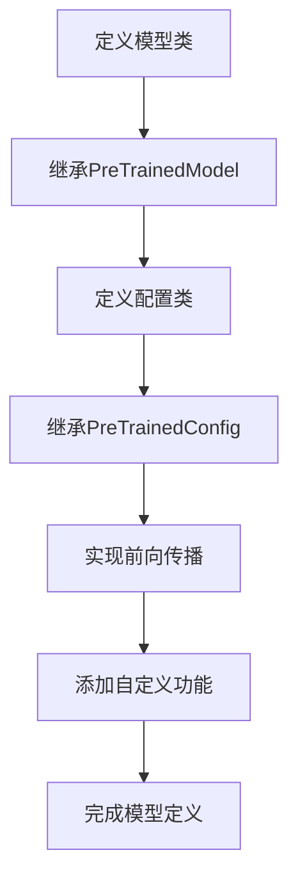

**Section sources**
- [modeling_utils.py](file://src/transformers/modeling_utils.py#L1643-L1839)
- [configuration_utils.py](file://src/transformers/configuration_utils.py#L100-L400)

### 兼容性与版本控制
在使用transformers库时，需要注意模型的兼容性和版本控制。建议使用最新的稳定版本，并定期更新依赖库以获得最新的功能和修复。

**Section sources**
- [modeling_utils.py](file://src/transformers/modeling_utils.py#L1643-L1839)

### 迁移学习最佳实践
迁移学习是transformers库的核心应用场景之一。通过在预训练模型基础上进行微调，可以快速适应新的任务。建议使用适当的微调策略，如学习率调度、梯度裁剪等，以提高模型性能。

**Section sources**
- [modeling_utils.py](file://src/transformers/modeling_utils.py#L1643-L1839)

## 结论
transformers库的模型架构设计体现了高度的抽象和复用原则，通过PreTrainedModel、PreTrainedConfig和ModelOutput等核心组件，构建了一个灵活且可扩展的模型生态系统。本文档详细介绍了这些核心组件的设计原理和实现细节，为开发者提供了从基础使用到高级定制的全面指导。通过理解和应用这些设计模式，开发者可以更有效地利用transformers库，构建高性能的自然语言处理应用。