# 自定义模型

<cite>
**本文档引用的文件**
- [src/transformers/models/auto/__init__.py](file://src/transformers/models/auto/__init__.py)
- [src/transformers/configuration_utils.py](file://src/transformers/configuration_utils.py)
- [src/transformers/modeling_utils.py](file://src/transformers/modeling_utils.py)
- [src/transformers/models/auto/modeling_auto.py](file://src/transformers/models/auto/modeling_auto.py)
- [src/transformers/models/auto/configuration_auto.py](file://src/transformers/models/auto/configuration_auto.py)
- [src/transformers/models/auto/auto_factory.py](file://src/transformers/models/auto/auto_factory.py)
- [src/transformers/modeling_outputs.py](file://src/transformers/modeling_outputs.py)
- [src/transformers/generation/utils.py](file://src/transformers/generation/utils.py)
- [src/transformers/models/bert/modeling_bert.py](file://src/transformers/models/bert/modeling_bert.py)
- [src/transformers/models/bert/configuration_bert.py](file://src/transformers/models/bert/configuration_bert.py)
</cite>

## 目录
1. [简介](#简介)
2. [项目结构概览](#项目结构概览)
3. [核心组件](#核心组件)
4. [架构概览](#架构概览)
5. [详细组件分析](#详细组件分析)
6. [依赖关系分析](#依赖关系分析)
7. [性能考虑](#性能考虑)
8. [故障排除指南](#故障排除指南)
9. [结论](#结论)

## 简介

Transformers库提供了一个强大而灵活的框架，用于在自然语言处理任务中实现和部署自定义模型。本指南将深入探讨如何在transformers生态系统中创建、注册和使用自定义模型，涵盖从基础概念到高级扩展的所有方面。

该库采用模块化设计，支持多种模型架构，包括编码器-解码器、仅编码器和仅解码器模型。通过统一的API接口，用户可以轻松地在不同模型之间切换，并利用预训练权重进行迁移学习。

## 项目结构概览

Transformers库的模型相关文件主要位于以下目录结构中：

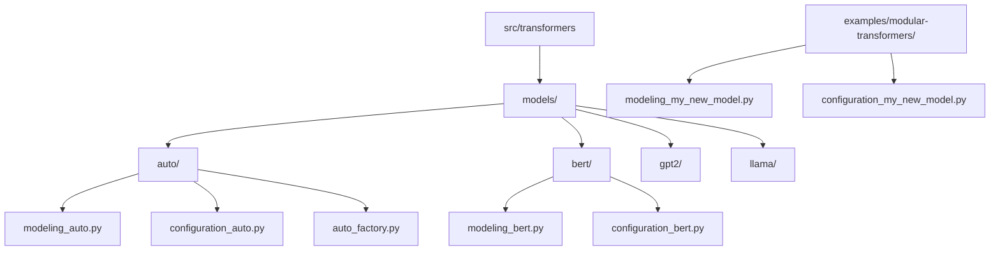

**图表来源**
- [src/transformers/models/auto/modeling_auto.py](file://src/transformers/models/auto/modeling_auto.py#L1-L50)
- [src/transformers/models/bert/modeling_bert.py](file://src/transformers/models/bert/modeling_bert.py#L1-L50)

**章节来源**
- [src/transformers/models/auto/__init__.py](file://src/transformers/models/auto/__init__.py#L1-L34)
- [src/transformers/models/auto/modeling_auto.py](file://src/transformers/models/auto/modeling_auto.py#L1-L100)

## 核心组件

### 配置系统

配置系统是模型的核心组成部分，负责管理模型的所有超参数和配置选项。

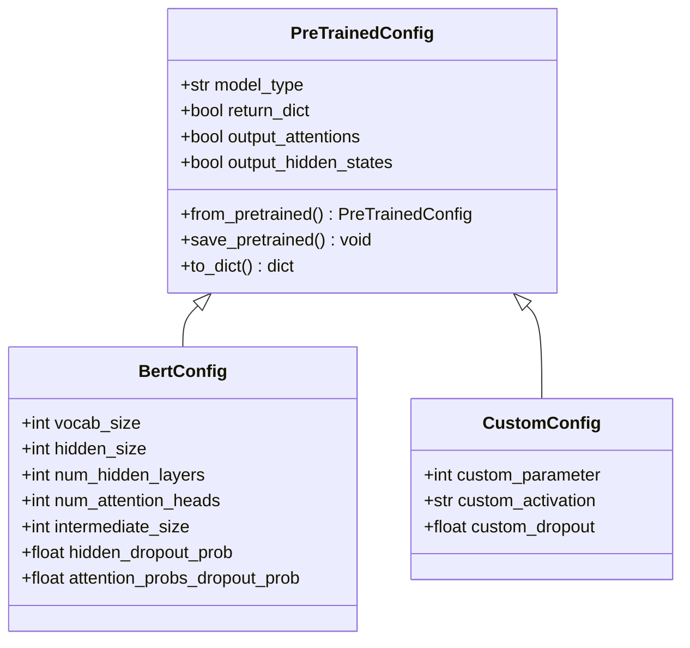

**图表来源**
- [src/transformers/configuration_utils.py](file://src/transformers/configuration_utils.py#L80-L200)
- [src/transformers/models/bert/configuration_bert.py](file://src/transformers/models/bert/configuration_bert.py#L20-L127)

### 模型基类

所有模型都继承自`PreTrainedModel`基类，该类提供了模型加载、保存和推理的基本功能。

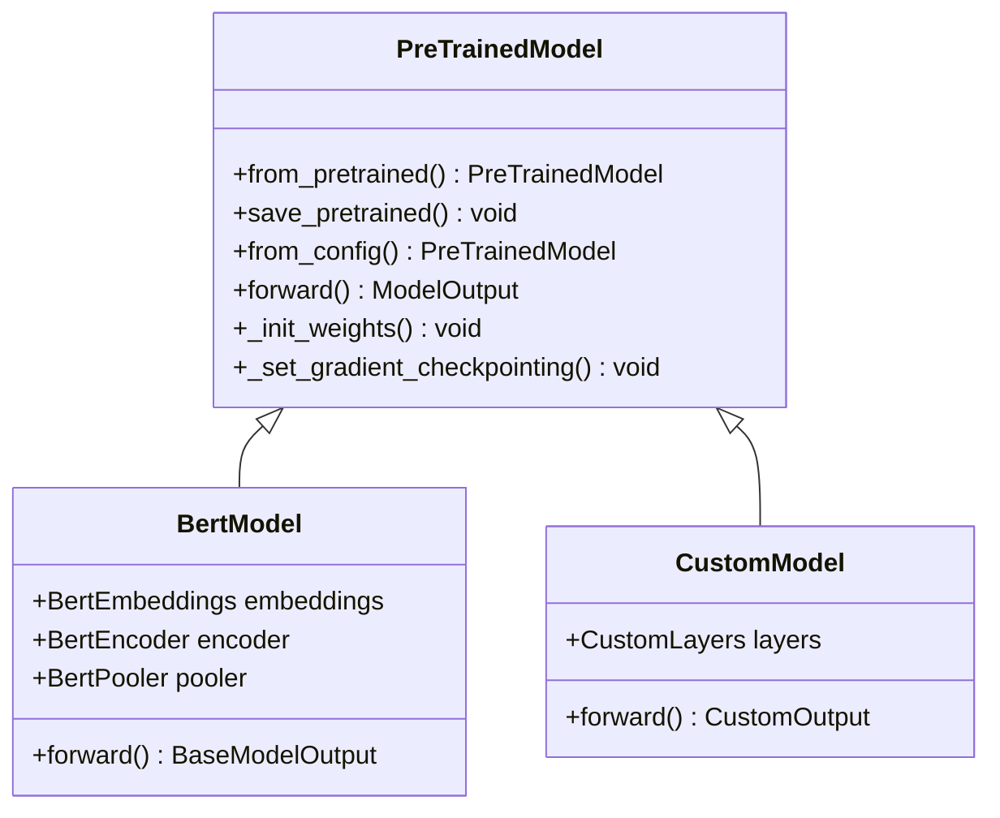

**图表来源**
- [src/transformers/modeling_utils.py](file://src/transformers/modeling_utils.py#L1-L200)
- [src/transformers/models/bert/modeling_bert.py](file://src/transformers/models/bert/modeling_bert.py#L1-L100)

**章节来源**
- [src/transformers/configuration_utils.py](file://src/transformers/configuration_utils.py#L80-L300)
- [src/transformers/modeling_utils.py](file://src/transformers/modeling_utils.py#L1-L300)

## 架构概览

Transformers库采用分层架构设计，支持多种模型类型和任务：

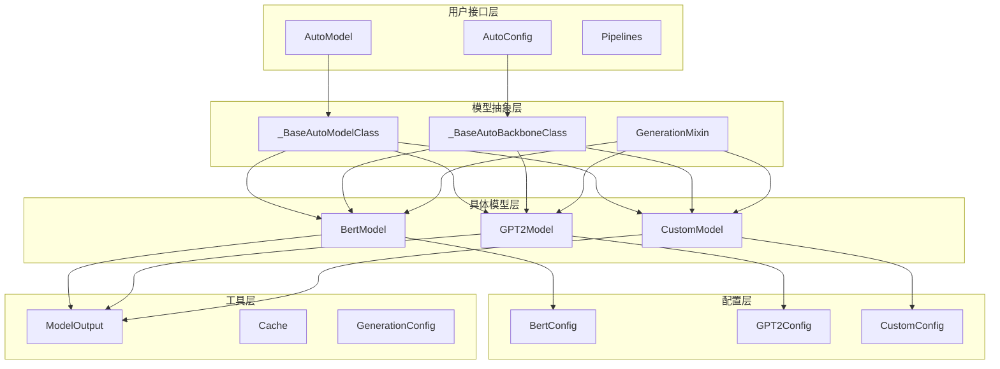

**图表来源**
- [src/transformers/models/auto/modeling_auto.py](file://src/transformers/models/auto/modeling_auto.py#L1-L100)
- [src/transformers/models/auto/auto_factory.py](file://src/transformers/models/auto/auto_factory.py#L1-L100)

## 详细组件分析

### 自定义配置类的创建

创建自定义配置类是实现新模型的第一步。以下是完整的创建流程：

#### 1. 基础配置类结构

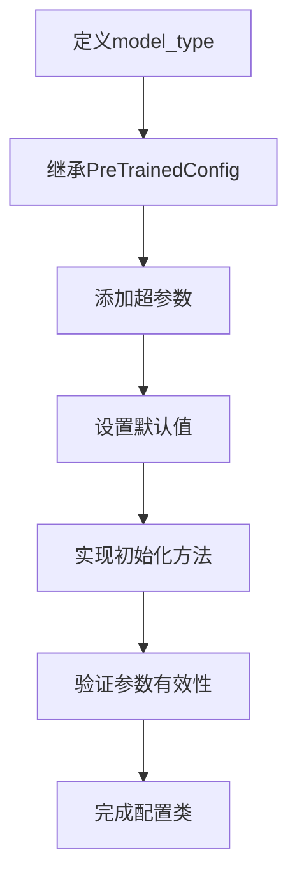

**图表来源**
- [src/transformers/models/bert/configuration_bert.py](file://src/transformers/models/bert/configuration_bert.py#L20-L127)

#### 2. 配置类的关键特性

| 特性 | 描述 | 示例 |
|------|------|------|
| model_type | 模型标识符 | `"custom_model"` |
| 参数验证 | 确保参数范围有效 | `vocab_size > 0` |
| 默认值设置 | 提供合理的默认配置 | `hidden_size=768` |
| 序列化支持 | 支持JSON序列化 | `to_json_string()` |
| 版本兼容性 | 处理配置版本差异 | `transformers_version` |

#### 3. 高级配置特性

对于复杂的模型，配置类可以包含子配置和嵌套结构：

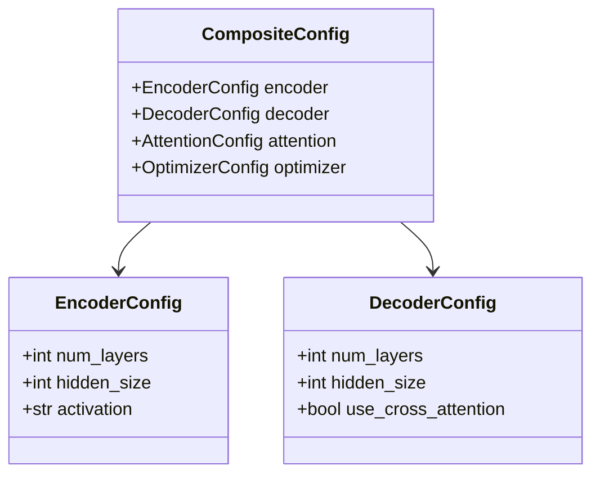

**章节来源**
- [src/transformers/configuration_utils.py](file://src/transformers/configuration_utils.py#L80-L400)

### 自定义模型类的实现

#### 1. 继承结构和必需方法

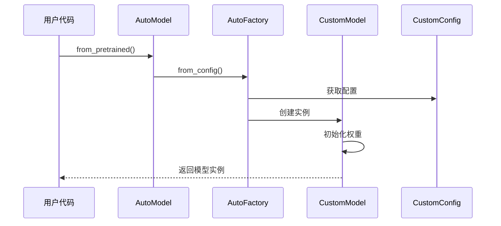

**图表来源**
- [src/transformers/models/auto/auto_factory.py](file://src/transformers/models/auto/auto_factory.py#L150-L250)

#### 2. forward()方法的实现要求

forward()方法是模型的核心，必须满足以下要求：

| 要求 | 描述 | 实现方式 |
|------|------|----------|
| 输入处理 | 接受标准输入格式 | `input_ids`, `attention_mask` |
| 输出标准化 | 返回ModelOutput对象 | 使用`@dataclass`装饰器 |
| 缓存支持 | 支持KV缓存加速 | 处理`past_key_values`参数 |
| 注意力掩码 | 正确处理注意力掩码 | 使用`create_attention_mask()` |
| 设备兼容 | 在不同设备上正常工作 | 使用`to(device)`方法 |

#### 3. Mixin类的使用

为了增强模型功能，可以使用各种Mixin类：

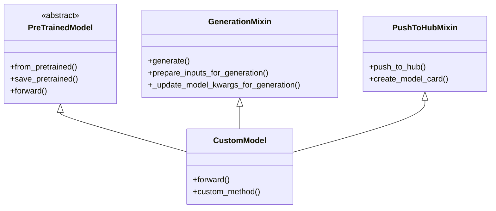

**图表来源**
- [src/transformers/generation/utils.py](file://src/transformers/generation/utils.py#L345-L356)

**章节来源**
- [src/transformers/modeling_utils.py](file://src/transformers/modeling_utils.py#L1-L500)
- [src/transformers/generation/utils.py](file://src/transformers/generation/utils.py#L345-L400)

### 模型注册机制

#### 1. 自动模型发现流程

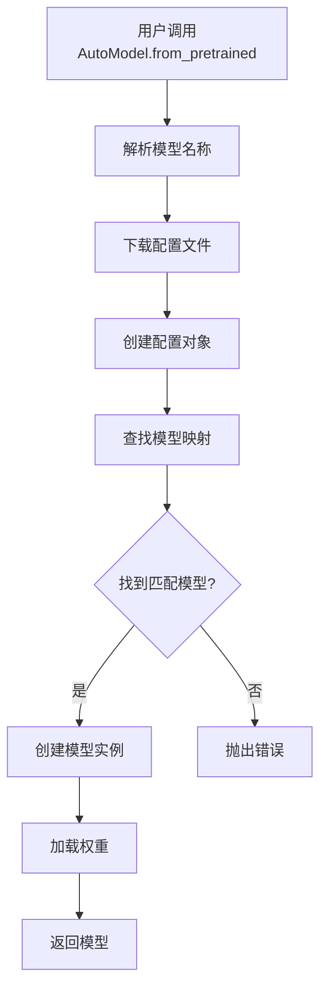

**图表来源**
- [src/transformers/models/auto/auto_factory.py](file://src/transformers/models/auto/auto_factory.py#L150-L300)

#### 2. 注册自定义模型

注册自定义模型需要以下步骤：

| 步骤 | 方法 | 说明 |
|------|------|------|
| 1. 定义配置映射 | `CONFIG_MAPPING_NAMES` | 添加模型类型到配置类的映射 |
| 2. 定义模型映射 | `MODEL_MAPPING_NAMES` | 添加模型类型到模型类的映射 |
| 3. 注册模型 | `AutoModel.register()` | 动态注册模型类 |
| 4. 测试注册 | `AutoModel.from_config()` | 验证注册是否成功 |

#### 3. 动态模型注册

对于远程代码模型，支持动态注册：

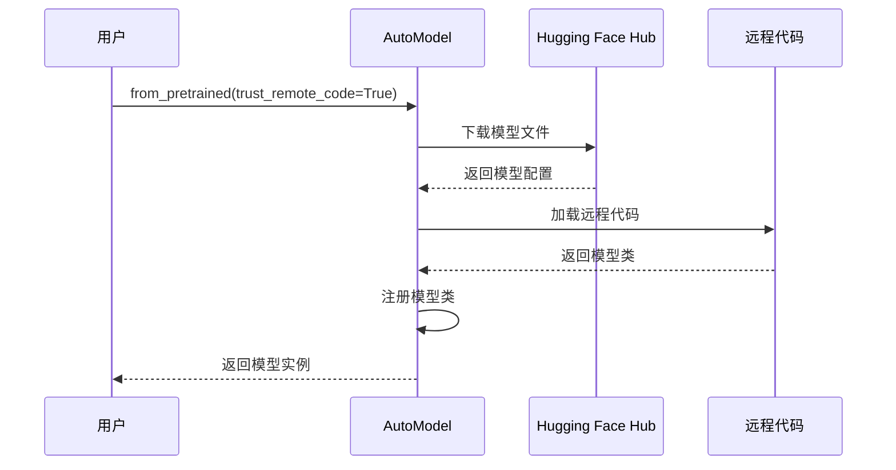

**章节来源**
- [src/transformers/models/auto/modeling_auto.py](file://src/transformers/models/auto/modeling_auto.py#L1-L200)
- [src/transformers/models/auto/auto_factory.py](file://src/transformers/models/auto/auto_factory.py#L150-L400)

### 模型输出系统

#### 1. ModelOutput数据类

模型输出使用专门的数据类来确保一致性和可读性：

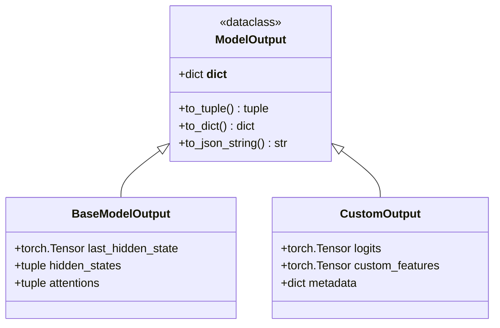

**图表来源**
- [src/transformers/modeling_outputs.py](file://src/transformers/modeling_outputs.py#L1-L100)

#### 2. 输出类型的分类

| 输出类型 | 用途 | 主要字段 |
|----------|------|----------|
| BaseModelOutput | 基础模型输出 | `last_hidden_state`, `hidden_states`, `attentions` |
| CausalLMOutput | 因果语言建模 | `logits`, `loss`, `hidden_states` |
| MaskedLMOutput | 掩码语言建模 | `logits`, `loss`, `hidden_states` |
| SequenceClassifierOutput | 序列分类 | `logits`, `loss`, `hidden_states` |
| TokenClassifierOutput | 标记分类 | `logits`, `loss`, `hidden_states` |

**章节来源**
- [src/transformers/modeling_outputs.py](file://src/transformers/modeling_outputs.py#L1-L200)

### 权重初始化最佳实践

#### 1. 初始化策略

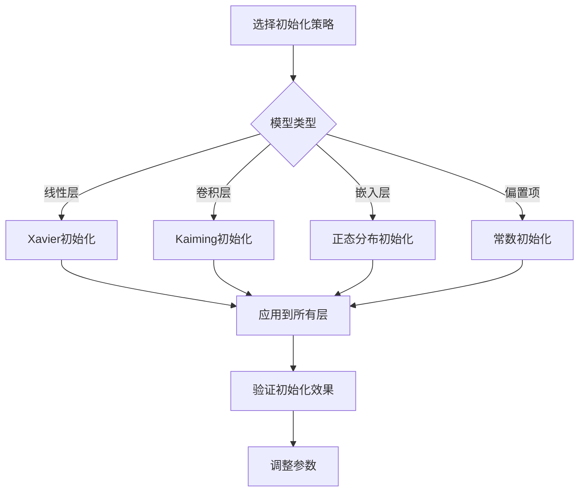

#### 2. 参数命名约定

| 前缀 | 含义 | 示例 |
|------|------|------|
| `weight` | 权重矩阵 | `self.linear.weight` |
| `bias` | 偏置向量 | `self.linear.bias` |
| `gamma` | 归一化缩放 | `self.layer_norm.weight` |
| `beta` | 归一化偏移 | `self.layer_norm.bias` |
| `embed_tokens` | 词嵌入 | `self.embed_tokens.weight` |

#### 3. 初始化函数表

| 函数名 | 分布类型 | 适用场景 | 参数 |
|--------|----------|----------|------|
| `nn.init.xavier_uniform_` | 均匀分布 | 全连接层 | `gain=1.0` |
| `nn.init.xavier_normal_` | 正态分布 | 全连接层 | `gain=1.0` |
| `nn.init.kaiming_uniform_` | 均匀分布 | 卷积层 | `mode='fan_in'` |
| `nn.init.kaiming_normal_` | 正态分布 | 卷积层 | `mode='fan_in'` |
| `nn.init.normal_` | 正态分布 | 嵌入层 | `mean=0.0, std=0.02` |
| `nn.init.constant_` | 常数值 | 偏置项 | `val=0.0` |

**章节来源**
- [src/transformers/modeling_utils.py](file://src/transformers/modeling_utils.py#L150-L300)

## 依赖关系分析

### 模块间依赖关系

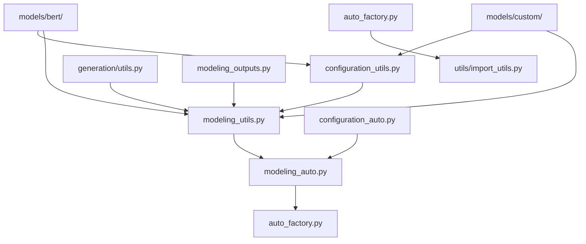

**图表来源**
- [src/transformers/configuration_utils.py](file://src/transformers/configuration_utils.py#L1-L50)
- [src/transformers/modeling_utils.py](file://src/transformers/modeling_utils.py#L1-L50)

### 外部依赖

| 依赖库 | 版本要求 | 用途 |
|--------|----------|------|
| torch | >=1.8.0 | 深度学习框架 |
| numpy | >=1.17.0 | 数值计算 |
| transformers | >=4.0.0 | 主要库 |
| sentencepiece | >=0.1.90 | 分词处理 |
| tokenizers | >=0.10.0 | 文本处理 |

**章节来源**
- [src/transformers/configuration_utils.py](file://src/transformers/configuration_utils.py#L1-L100)
- [src/transformers/modeling_utils.py](file://src/transformers/modeling_utils.py#L1-L100)

## 性能考虑

### 内存优化

1. **梯度检查点**：通过重新计算中间激活来减少内存使用
2. **混合精度训练**：使用FP16或BF16减少内存占用
3. **模型并行**：将大型模型分布在多个GPU上
4. **动态批处理**：根据序列长度动态调整批大小

### 计算优化

1. **注意力优化**：使用Flash Attention等高效实现
2. **量化技术**：使用INT8或INT4量化模型
3. **编译优化**：使用TorchScript或FX Graph模式
4. **算子融合**：合并多个操作以减少内核启动开销

### 推理优化

1. **KV缓存**：缓存键值对以加速自回归生成
2. **连续批处理**：批量处理不同长度的序列
3. **动态形状**：支持动态序列长度
4. **硬件特定优化**：针对特定硬件的优化

## 故障排除指南

### 常见问题及解决方案

#### 1. 模型注册失败

**问题**：自定义模型无法被AutoModel识别
**解决方案**：
- 检查`model_type`是否唯一且正确
- 确认配置类和模型类已正确导入
- 验证注册语句是否执行

#### 2. 权重加载错误

**问题**：预训练权重与模型不匹配
**解决方案**：
- 检查配置参数是否一致
- 验证权重文件完整性
- 使用`strict=False`加载权重

#### 3. 内存不足

**问题**：大模型训练时内存溢出
**解决方案**：
- 启用梯度检查点
- 减少批大小
- 使用混合精度训练
- 启用CPU卸载

#### 4. 性能问题

**问题**：模型推理速度慢
**解决方案**：
- 使用量化模型
- 启用注意力优化
- 使用KV缓存
- 检查硬件利用率

**章节来源**
- [src/transformers/modeling_utils.py](file://src/transformers/modeling_utils.py#L4800-L5000)

## 结论

Transformers库提供了一个强大而灵活的框架，用于实现和部署自定义模型。通过理解其核心架构、配置系统、模型注册机制和最佳实践，开发者可以有效地创建符合需求的自定义模型。

关键要点：
1. **模块化设计**：清晰的分层架构便于扩展和维护
2. **统一接口**：AutoModel系统提供了一致的API体验
3. **灵活性**：支持从简单到复杂的各种模型架构
4. **性能优化**：内置多种优化技术和工具
5. **社区生态**：活跃的社区和丰富的预训练模型资源

对于初学者，建议从简单的模型开始，逐步掌握配置、实现和注册的完整流程。对于有经验的开发者，可以探索更高级的扩展模式，如自定义注意力机制、混合架构设计和性能优化技巧。

通过遵循本指南中的最佳实践和设计原则，可以创建高质量、高性能的自定义模型，充分利用transformers库的强大功能。