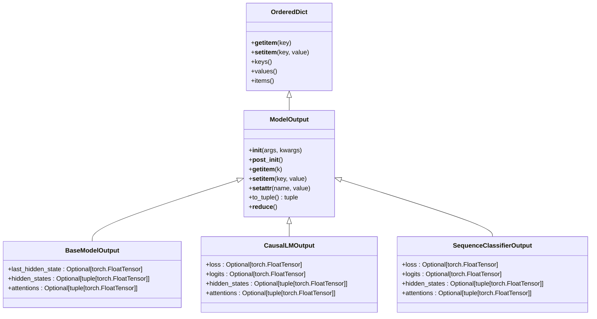
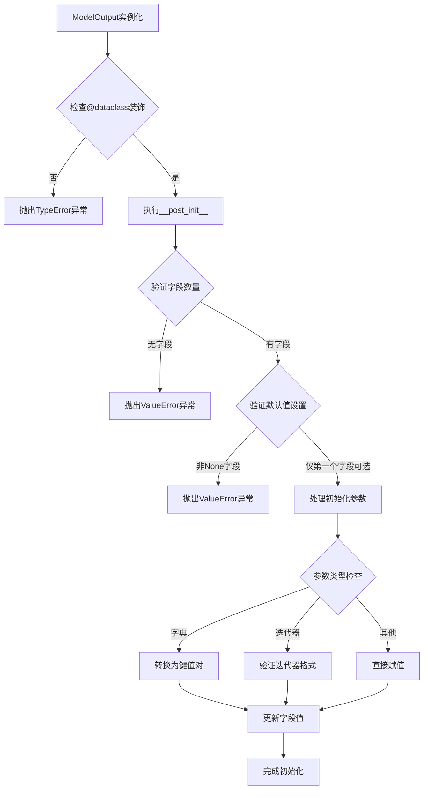
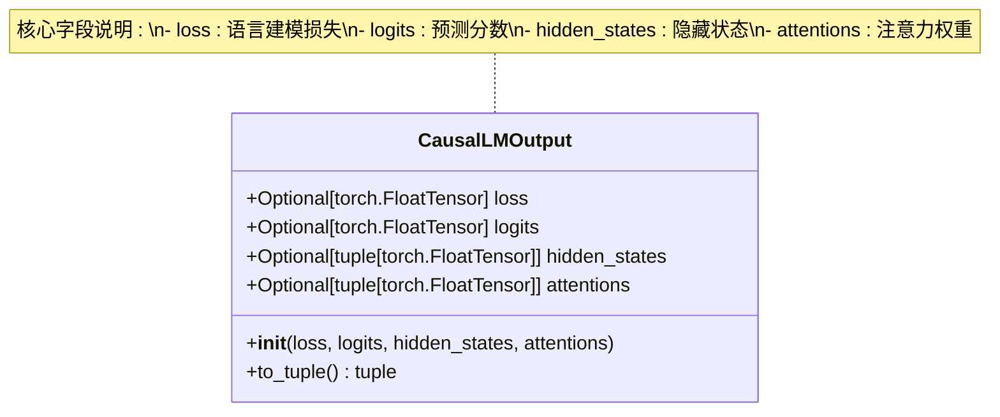
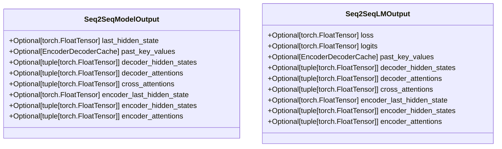
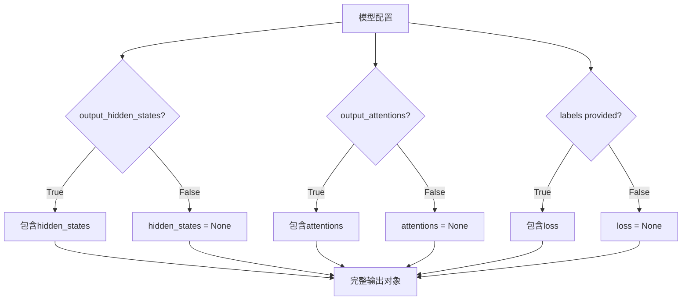
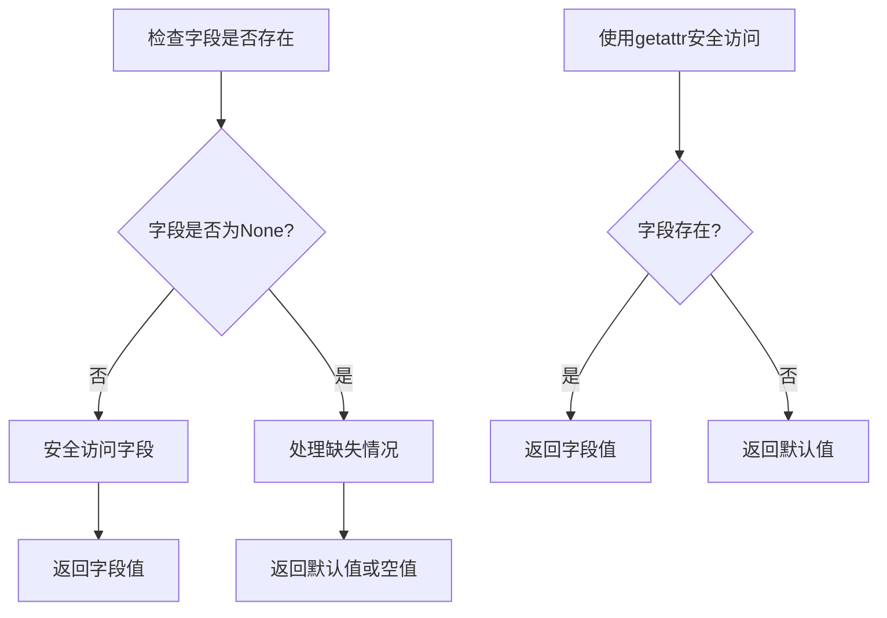
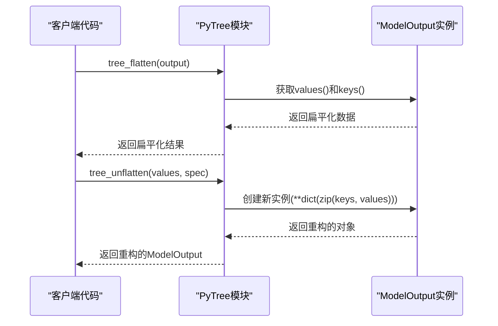
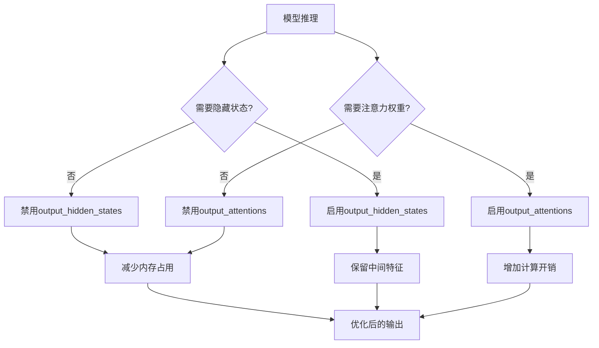

# 输出处理

<cite>
**本文档中引用的文件**
- [modeling_outputs.py](file://src/transformers/modeling_outputs.py)
- [generic.py](file://src/transformers/utils/generic.py)
- [test_model_output.py](file://tests/utils/test_model_output.py)
</cite>

## 目录
1. [简介](#简介)
2. [ModelOutput基类架构](#modeloutput基类架构)
3. [命名元组与数据类的结合使用](#命名元组与数据类的结合使用)
4. [核心输出类详解](#核心输出类详解)
5. [输出字段的可选性与嵌套结构](#输出字段的可选性与嵌套结构)
6. [安全访问输出字段的方法](#安全访问输出字段的方法)
7. [模型输出的序列化与跨框架兼容性](#模型输出的序列化与跨框架兼容性)
8. [实际使用示例](#实际使用示例)
9. [性能优化与最佳实践](#性能优化与最佳实践)
10. [故障排除指南](#故障排除指南)

## 简介

Transformers库中的模型输出系统是一个精心设计的数据结构体系，旨在为各种自然语言处理任务提供统一且灵活的结果表示方式。该系统的核心是`ModelOutput`基类，它结合了Python命名元组(namedtuple)的简洁性和数据类(dataclass)的功能性，为模型输出提供了类型安全、易于访问且向后兼容的解决方案。

模型输出系统的主要特点包括：
- 统一的输出格式，支持多种任务类型
- 类型安全的字段访问
- 字典和元组式的索引访问
- 可选字段的优雅处理
- 向后兼容性保证
- 分布式训练的梯度同步支持

## ModelOutput基类架构

### 基类设计原理

`ModelOutput`继承自`OrderedDict`，这种设计选择体现了对传统字典语义的尊重，同时引入了现代Python数据类的功能特性。



**图表来源**
- [generic.py](file://src/transformers/utils/generic.py#L223-L364)
- [modeling_outputs.py](file://src/transformers/modeling_outputs.py#L25-L100)

### 初始化与验证机制

`ModelOutput`的初始化过程包含严格的验证机制，确保子类正确使用`@dataclass`装饰器：

**节来源**
- [generic.py](file://src/transformers/utils/generic.py#L246-L273)

关键验证步骤：
1. 检查子类是否使用`@dataclass`装饰器
2. 验证字段数量和默认值设置
3. 处理特殊初始化参数（字典、迭代器等）

## 命名元组与数据类的结合使用

### 设计哲学

Transformers库巧妙地结合了两种不同的数据组织方式：

**命名元组的优势**：
- 位置访问：通过索引或切片访问字段
- 内存效率：轻量级的数据容器
- 兼容性：与传统Python代码良好兼容

**数据类的优势**：
- 类型注解：明确的字段类型定义
- 默认值：可选字段的优雅处理
- 方法扩展：可以添加自定义方法

### 实现细节



**图表来源**
- [generic.py](file://src/transformers/utils/generic.py#L274-L330)

**节来源**
- [generic.py](file://src/transformers/utils/generic.py#L223-L364)

## 核心输出类详解

### 基础输出类层次结构

Transformers库提供了多个专门化的输出类，每个都针对特定的任务类型进行了优化：

| 输出类 | 主要用途 | 核心字段 | 特殊功能 |
|--------|----------|----------|----------|
| `BaseModelOutput` | 基础模型输出 | `last_hidden_state`, `hidden_states`, `attentions` | 支持隐藏状态和注意力权重 |
| `CausalLMOutput` | 因果语言建模 | `loss`, `logits`, `hidden_states`, `attentions` | 包含损失计算结果 |
| `SequenceClassifierOutput` | 序列分类 | `loss`, `logits`, `hidden_states`, `attentions` | 适用于文本分类任务 |
| `TokenClassifierOutput` | 标记分类 | `loss`, `logits`, `hidden_states`, `attentions` | 用于命名实体识别等任务 |
| `QuestionAnsweringModelOutput` | 问答任务 | `loss`, `start_logits`, `end_logits` | 提供答案起始和结束位置 |

### CausalLMOutput详细分析

`CausalLMOutput`是最常用的输出类之一，广泛应用于文本生成任务：



**图表来源**
- [modeling_outputs.py](file://src/transformers/modeling_outputs.py#L950-L992)

**节来源**
- [modeling_outputs.py](file://src/transformers/modeling_outputs.py#L950-L992)

### 序列到序列输出类

对于编码器-解码器架构的模型，如翻译或摘要任务，提供了专门的输出类：



**图表来源**
- [modeling_outputs.py](file://src/transformers/modeling_outputs.py#L800-L880)

**节来源**
- [modeling_outputs.py](file://src/transformers/modeling_outputs.py#L800-L880)

## 输出字段的可选性与嵌套结构

### 可选字段的设计原则

所有输出类都采用`Optional`类型注解，这反映了模型配置的灵活性：



### 嵌套结构的处理

输出对象支持复杂的嵌套结构，特别是在多层隐藏状态和注意力权重的情况下：

**节来源**
- [modeling_outputs.py](file://src/transformers/modeling_outputs.py#L25-L100)

## 安全访问输出字段的方法

### 字段访问模式

Transformers库提供了多种安全访问输出字段的方法：

#### 1. 属性访问（推荐）
```python
# 推荐的安全访问方式
logits = output.logits
hidden_states = output.hidden_states
```

#### 2. 字典式访问
```python
# 字符串键访问
logits = output['logits']
```

#### 3. 索引访问
```python
# 位置访问（忽略None值）
first_field = output[0]      # 获取第一个非None字段
sliced_fields = output[:2]   # 获取前两个非None字段
```

### 条件访问模式



### 错误处理策略

常见的访问错误及解决方案：

| 错误类型 | 原因 | 解决方案 |
|----------|------|----------|
| `AttributeError` | 访问不存在的字段 | 使用条件检查或`getattr()` |
| `KeyError` | 字典式访问不存在的键 | 使用`in`操作符检查或`get()`方法 |
| `TypeError` | 尝试解包ModelOutput | 使用`to_tuple()`方法 |

**节来源**
- [test_model_output.py](file://tests/utils/test_model_output.py#L45-L124)

## 模型输出的序列化与跨框架兼容性

### PyTorch PyTree支持

Transformers库为`ModelOutput`提供了完整的PyTorch PyTree支持，这对于分布式训练至关重要：



**图表来源**
- [generic.py](file://src/transformers/utils/generic.py#L370-L397)

### 序列化机制

`ModelOutput`实现了自定义的序列化逻辑：

**节来源**
- [generic.py](file://src/transformers/utils/generic.py#L353-L364)

### 跨框架兼容性

输出系统设计时考虑了与其他深度学习框架的兼容性：
- 支持PyTorch张量的自动序列化
- 提供标准Python数据类型的转换接口
- 保持与NumPy数组的互操作性

## 实际使用示例

### 文本分类任务

```python
# 基本使用模式
from transformers import AutoTokenizer, AutoModelForSequenceClassification

tokenizer = AutoTokenizer.from_pretrained("bert-base-uncased")
model = AutoModelForSequenceClassification.from_pretrained("bert-base-uncased")

inputs = tokenizer("Hello world", return_tensors="pt")
outputs = model(**inputs, output_hidden_states=True, output_attentions=True)

# 安全访问logits
logits = outputs.logits if hasattr(outputs, 'logits') else None

# 访问隐藏状态
if outputs.hidden_states is not None:
    last_hidden_state = outputs.hidden_states[-1]
```

### 文本生成任务

```python
# 语言模型输出处理
from transformers import AutoTokenizer, AutoModelForCausalLM

tokenizer = AutoTokenizer.from_pretrained("gpt2")
model = AutoModelForCausalLM.from_pretrained("gpt2")

inputs = tokenizer("The future of AI", return_tensors="pt")
outputs = model.generate(**inputs, return_dict_in_generate=True, output_scores=True)

# 处理生成的logits
if hasattr(outputs, 'scores'):
    next_token_logits = outputs.scores[0]  # 第一个位置的预测
```

### 多任务学习场景

```python
# 同时获取多个输出
outputs = model(**inputs, 
                output_hidden_states=True, 
                output_attentions=True,
                return_dict=True)

# 统一处理所有可能的输出
def process_model_output(outputs):
    results = {}
    
    # 处理logits
    if hasattr(outputs, 'logits'):
        results['predictions'] = torch.argmax(outputs.logits, dim=-1)
    
    # 处理隐藏状态
    if outputs.hidden_states is not None:
        results['last_hidden'] = outputs.hidden_states[-1]
    
    # 处理注意力权重
    if outputs.attentions is not None:
        results['attention_weights'] = outputs.attentions
    
    return results
```

### 中间层特征提取

```python
# 提取特定层的特征
def extract_layer_features(outputs, layer_idx=-1):
    """从输出中提取指定层的特征"""
    if outputs.hidden_states is not None:
        return outputs.hidden_states[layer_idx]
    return None

# 提取注意力特征
def extract_attention_patterns(outputs, layer_idx=0):
    """提取特定层的注意力模式"""
    if outputs.attentions is not None:
        return outputs.attentions[layer_idx]
    return None
```

## 性能优化与最佳实践

### 内存使用优化



### 最佳实践建议

#### 1. 按需获取输出
```python
# 只在需要时启用额外输出
model(**inputs, output_hidden_states=False, output_attentions=False)
```

#### 2. 批量处理优化
```python
# 使用to_tuple()进行批量处理
def process_batch(outputs_list):
    # 将所有输出转换为元组以便批量处理
    tuples = [output.to_tuple() for output in outputs_list]
    return tuples
```

#### 3. 内存管理
```python
# 及时释放不需要的输出
def process_with_memory_efficiency(model, inputs):
    outputs = model(**inputs)
    
    # 只保留必要的信息
    result = {
        'logits': outputs.logits,
        'predictions': torch.argmax(outputs.logits, dim=-1)
    }
    
    # 清理不必要的字段
    del outputs.hidden_states
    del outputs.attentions
    
    return result
```

### 性能监控

```python
# 监控输出大小
def monitor_output_size(outputs):
    total_size = 0
    for field_name, field_value in outputs.items():
        if field_value is not None:
            if hasattr(field_value, 'shape'):
                size = field_value.element_size() * field_value.nelement()
                print(f"{field_name}: {size / 1024**2:.2f} MB")
                total_size += size
    
    print(f"Total output size: {total_size / 1024**2:.2f} MB")
    return total_size
```

## 故障排除指南

### 常见问题与解决方案

#### 1. TypeError: 'ModelOutput' object is not iterable

**问题描述**：尝试直接解包`ModelOutput`对象

**解决方案**：
```python
# 错误做法
logits, hidden_states = outputs  # 抛出TypeError

# 正确做法
logits = outputs.logits
hidden_states = outputs.hidden_states

# 或者使用to_tuple()
fields = outputs.to_tuple()
```

#### 2. AttributeError: 'ModelOutput' object has no attribute

**问题描述**：访问不存在的字段

**解决方案**：
```python
# 使用hasattr检查
if hasattr(outputs, 'logits'):
    logits = outputs.logits

# 或使用getattr带默认值
logits = getattr(outputs, 'logits', None)
```

#### 3. 内存不足错误

**问题描述**：启用过多的输出导致内存溢出

**解决方案**：
```python
# 减少输出内容
outputs = model(**inputs, 
                output_hidden_states=False,  # 禁用隐藏状态
                output_attentions=False)     # 禁用注意力权重
```

#### 4. 分布式训练中的梯度同步问题

**问题描述**：在DistributedDataParallel中出现梯度同步错误

**解决方案**：
```python
# 确保使用正确的返回字典格式
outputs = model(**inputs, return_dict=True)

# PyTorch会自动处理ModelOutput的梯度同步
```

### 调试技巧

```python
# 输出结构调试
def debug_model_output(outputs):
    print(f"Output type: {type(outputs)}")
    print(f"Available fields: {list(outputs.keys())}")
    print(f"Total fields: {len(outputs)}")
    
    for field_name, field_value in outputs.items():
        if field_value is not None:
            if hasattr(field_value, 'shape'):
                print(f"{field_name}: {field_value.shape}")
            else:
                print(f"{field_name}: {type(field_value)}")
        else:
            print(f"{field_name}: None")

# 使用示例
debug_model_output(outputs)
```

### 单元测试示例

```python
# 测试输出的完整性
def test_model_output_integrity(outputs):
    """测试ModelOutput的完整性"""
    
    # 检查是否包含必需字段
    assert hasattr(outputs, 'logits'), "logits字段缺失"
    
    # 检查logits形状
    if outputs.logits is not None:
        assert len(outputs.logits.shape) == 2, "logits形状不正确"
    
    # 检查隐藏状态
    if outputs.hidden_states is not None:
        assert isinstance(outputs.hidden_states, tuple), "hidden_states应为元组"
        assert len(outputs.hidden_states) > 0, "hidden_states为空"
    
    # 检查注意力权重
    if outputs.attentions is not None:
        assert isinstance(outputs.attentions, tuple), "attentions应为元组"
        assert len(outputs.attentions) > 0, "attentions为空"
    
    print("ModelOutput完整性检查通过")
```

**节来源**
- [test_model_output.py](file://tests/utils/test_model_output.py#L25-L197)

## 结论

Transformers库的模型输出处理系统代表了现代深度学习框架设计的最佳实践。通过`ModelOutput`基类的创新设计，它成功地平衡了类型安全性、易用性和向后兼容性。该系统不仅为开发者提供了强大而灵活的工具，还为研究和生产环境中的模型部署奠定了坚实的基础。

掌握这些输出处理技术对于有效使用Transformers库至关重要。无论是初学者还是经验丰富的开发者，都应该熟悉这些概念和最佳实践，以充分发挥模型的潜力并避免常见的陷阱。

随着Transformers生态系统的不断发展，模型输出系统也在持续演进，为更复杂的应用场景提供支持。理解其设计原理和使用方法，将有助于开发者更好地适应未来的变化并构建更强大的AI应用。