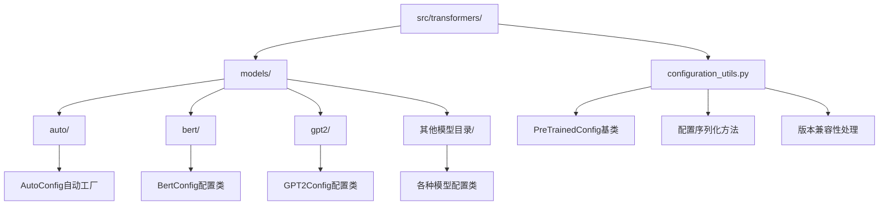
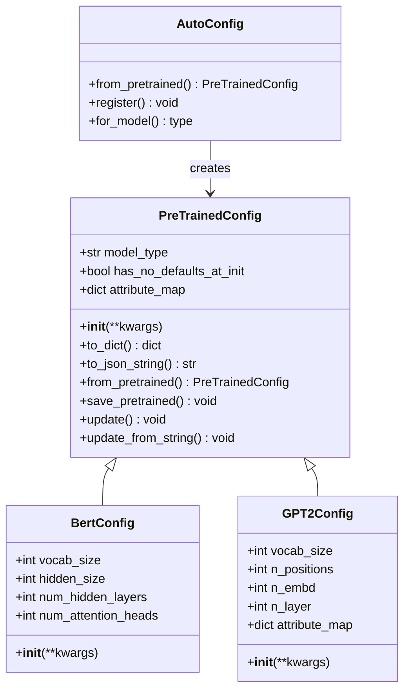
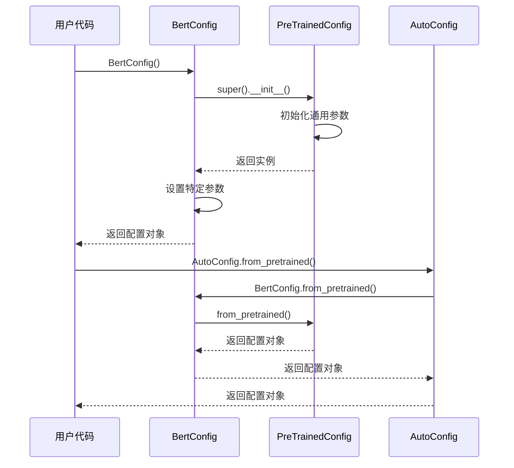
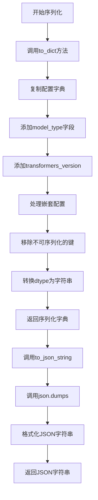
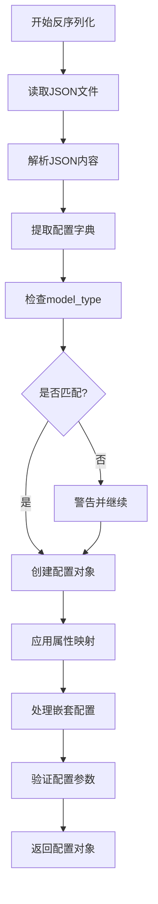
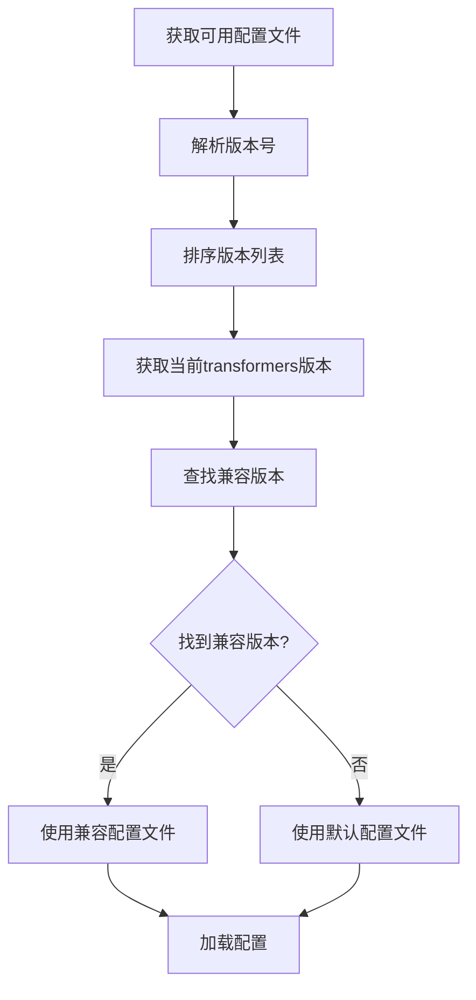
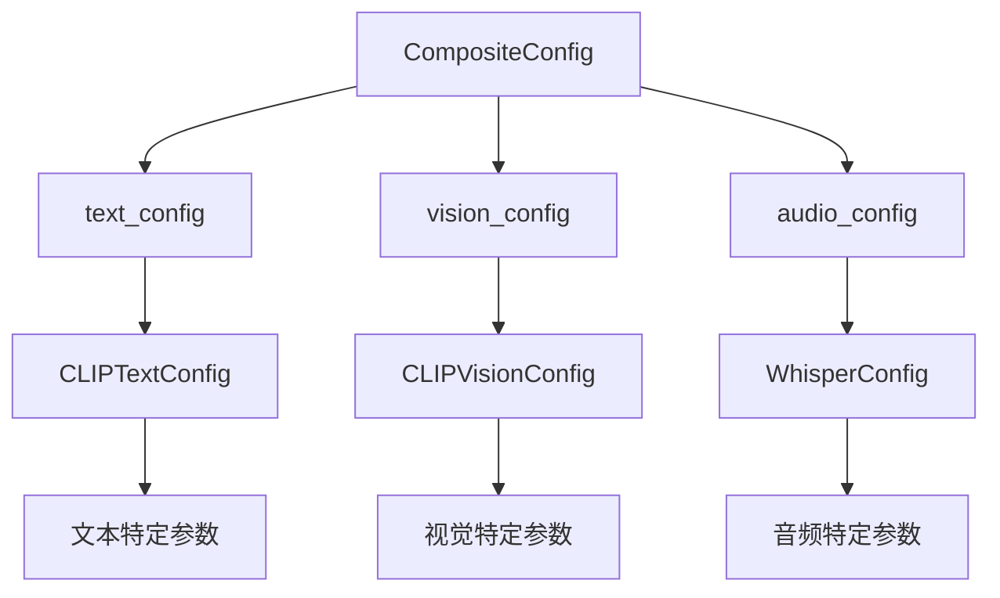
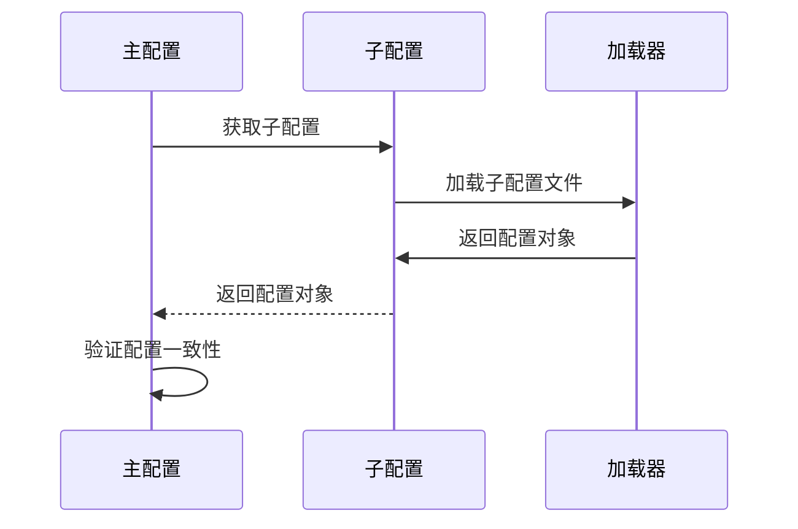
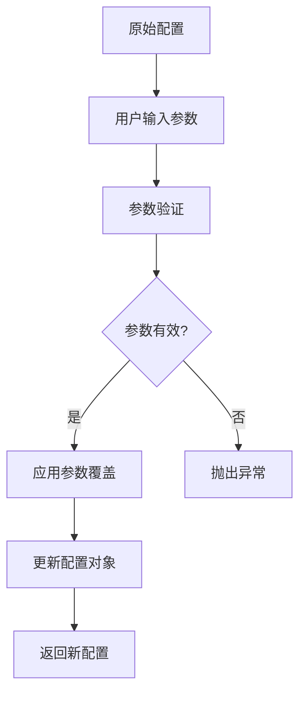
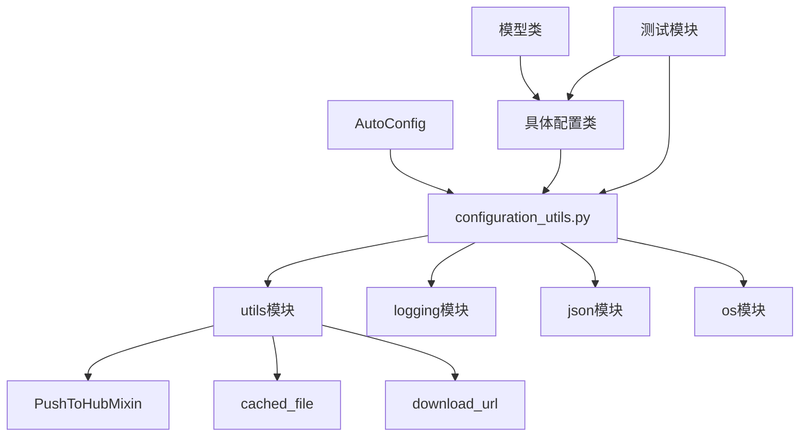

# 配置管理

<cite>
**本文档中引用的文件**
- [configuration_utils.py](file://src/transformers/configuration_utils.py)
- [bert/configuration_bert.py](file://src/transformers/models/bert/configuration_bert.py)
- [gpt2/configuration_gpt2.py](file://src/transformers/models/gpt2/configuration_gpt2.py)
- [test_configuration_common.py](file://tests/test_configuration_common.py)
- [custom_configuration.py](file://utils/test_module/custom_configuration.py)
</cite>

## 目录
1. [简介](#简介)
2. [项目结构](#项目结构)
3. [核心组件](#核心组件)
4. [架构概览](#架构概览)
5. [详细组件分析](#详细组件分析)
6. [依赖关系分析](#依赖关系分析)
7. [性能考虑](#性能考虑)
8. [故障排除指南](#故障排除指南)
9. [结论](#结论)

## 简介

transformers库中的配置管理系统是一个强大而灵活的框架，用于管理和控制机器学习模型的各种超参数和设置。该系统的核心是`PreTrainedConfig`基类，它提供了统一的接口来处理所有模型配置，支持从预训练模型加载配置、保存自定义配置、以及在不同版本之间保持兼容性。

配置管理系统的主要特点包括：
- 统一的配置基类设计
- 自动化的配置序列化和反序列化
- 版本兼容性管理
- 支持嵌套和复合配置
- 动态配置参数覆盖
- 与Auto类系统的无缝集成

## 项目结构

transformers库的配置管理相关文件主要分布在以下目录结构中：

**图表来源**
- [configuration_utils.py](file://src/transformers/configuration_utils.py#L1-L50)
- [bert/configuration_bert.py](file://src/transformers/models/bert/configuration_bert.py#L1-L30)

**章节来源**
- [configuration_utils.py](file://src/transformers/configuration_utils.py#L1-L100)

## 核心组件

### PreTrainedConfig基类

`PreTrainedConfig`是整个配置系统的核心基类，它定义了所有模型配置的基本结构和行为。该类提供了以下关键功能：

#### 基本属性和特性

| 属性名称 | 类型 | 描述 | 默认值 |
|---------|------|------|--------|
| model_type | str | 模型类型标识符 | "" |
| has_no_defaults_at_init | bool | 是否可以在无参数初始化 | False |
| keys_to_ignore_at_inference | list[str] | 推理时忽略的键列表 | [] |
| attribute_map | dict[str, str] | 属性名称映射表 | {} |
| base_model_tp_plan | dict[str, Any] | 张量并行计划 | None |
| base_model_pp_plan | dict[str, tuple[list[str]]] | 流水线并行计划 | None |

#### 核心方法

配置系统提供了多个核心方法来处理配置的生命周期：

- **序列化方法**：`to_dict()`, `to_json_string()`, `to_json_file()`
- **反序列化方法**：`from_pretrained()`, `from_dict()`, `from_json_file()`
- **更新方法**：`update()`, `update_from_string()`
- **比较方法**：`__eq__()`, `__repr__()`

**章节来源**
- [configuration_utils.py](file://src/transformers/configuration_utils.py#L50-L200)

## 架构概览

配置管理系统采用分层架构设计，从底层的通用配置功能到上层的具体模型配置类：

**图表来源**
- [configuration_utils.py](file://src/transformers/configuration_utils.py#L50-L150)
- [bert/configuration_bert.py](file://src/transformers/models/bert/configuration_bert.py#L20-L80)
- [gpt2/configuration_gpt2.py](file://src/transformers/models/gpt2/configuration_gpt2.py#L20-L100)

## 详细组件分析

### 配置继承和覆盖机制

#### 基类继承模式

每个具体的模型配置类都继承自`PreTrainedConfig`基类，并重写特定的类属性：

**图表来源**
- [bert/configuration_bert.py](file://src/transformers/models/bert/configuration_bert.py#L70-L120)
- [configuration_utils.py](file://src/transformers/configuration_utils.py#L400-L500)

#### 属性映射机制

配置系统使用`attribute_map`来处理不同模型之间的属性名称差异：

| 映射前属性名 | 映射后属性名 | 适用模型 |
|-------------|-------------|----------|
| hidden_size | n_embd | GPT2Config |
| max_position_embeddings | n_positions | GPT2Config |
| num_attention_heads | n_head | GPT2Config |
| num_hidden_layers | n_layer | GPT2Config |

**章节来源**
- [gpt2/configuration_gpt2.py](file://src/transformers/models/gpt2/configuration_gpt2.py#L107-L115)

### 配置序列化和反序列化

#### 序列化流程

配置的序列化过程包含多个步骤以确保数据完整性和兼容性：

**图表来源**
- [configuration_utils.py](file://src/transformers/configuration_utils.py#L850-L950)

#### 反序列化流程

配置的反序列化过程负责从存储的配置文件重建配置对象：

**图表来源**
- [configuration_utils.py](file://src/transformers/configuration_utils.py#L700-L800)

**章节来源**
- [configuration_utils.py](file://src/transformers/configuration_utils.py#L850-L1000)

### 配置版本兼容性

#### 版本检测机制

配置系统实现了智能的版本检测机制，确保向后兼容性：

**图表来源**
- [configuration_utils.py](file://src/transformers/configuration_utils.py#L1210-L1240)

#### 兼容性处理策略

| 处理策略 | 适用场景 | 实现方式 |
|---------|----------|----------|
| 默认值回退 | 新增参数未提供 | 在基类中设置默认值 |
| 属性映射 | 名称变更 | 使用attribute_map |
| 条件加载 | 功能移除 | 在加载时跳过 |
| 警告提示 | 不推荐用法 | 记录警告日志 |

**章节来源**
- [configuration_utils.py](file://src/transformers/configuration_utils.py#L1210-L1297)

### 嵌套配置系统

#### 复合配置模式

对于复杂的多模态模型，配置系统支持嵌套配置结构：

**图表来源**
- [test_configuration_common.py](file://tests/test_configuration_common.py#L115-L155)

#### 子配置管理

配置系统提供了专门的方法来处理子配置：

**图表来源**
- [test_configuration_common.py](file://tests/test_configuration_common.py#L125-L155)

**章节来源**
- [test_configuration_common.py](file://tests/test_configuration_common.py#L115-L180)

### 动态配置生成

#### 参数覆盖机制

配置系统支持在运行时动态修改配置参数：

**图表来源**
- [configuration_utils.py](file://src/transformers/configuration_utils.py#L950-L1050)

#### 字符串参数更新

系统提供了便捷的字符串格式参数更新功能：

| 输入格式 | 示例 | 解析结果 |
|---------|------|----------|
| 键值对 | "hidden_size=768" | {"hidden_size": 768} |
| 多参数 | "vocab_size=30000,num_layers=12" | {"vocab_size": 30000, "num_layers": 12} |
| 布尔值 | "use_cache=true" | {"use_cache": True} |

**章节来源**
- [configuration_utils.py](file://src/transformers/configuration_utils.py#L950-L1020)

## 依赖关系分析

配置管理系统的依赖关系体现了清晰的分层架构：

**图表来源**
- [configuration_utils.py](file://src/transformers/configuration_utils.py#L15-L40)

**章节来源**
- [configuration_utils.py](file://src/transformers/configuration_utils.py#L1-L50)

## 性能考虑

### 内存优化策略

配置系统采用了多种内存优化技术：

1. **延迟加载**：仅在需要时加载配置文件
2. **缓存机制**：避免重复下载相同的配置文件
3. **增量序列化**：使用`use_diff=True`减少存储空间
4. **类型转换优化**：高效处理dtype转换

### 序列化性能

| 操作类型 | 时间复杂度 | 空间复杂度 | 优化建议 |
|---------|-----------|-----------|----------|
| to_dict | O(n) | O(n) | 使用use_diff减少数据量 |
| to_json_string | O(n) | O(n) | 批量处理多个配置 |
| from_pretrained | O(1) | O(1) | 利用缓存机制 |
| update | O(k) | O(1) | k为更新参数数量 |

## 故障排除指南

### 常见配置问题

#### 配置加载失败

**问题症状**：`OSError: Can't load the configuration`  
**可能原因**：
- 配置文件路径错误
- 文件权限问题
- 网络连接问题

**解决方案**：
1. 检查文件路径是否正确
2. 验证文件权限设置
3. 尝试本地缓存配置文件

#### 版本兼容性问题

**问题症状**：`ValueError: The config parameter 'xxx' was not understood`  
**可能原因**：
- transformers版本不匹配
- 配置文件格式过时

**解决方案**：
1. 更新到最新版本的transformers
2. 重新下载配置文件
3. 检查配置参数的有效性

#### 嵌套配置加载问题

**问题症状**：子配置加载失败或类型不匹配  
**可能原因**：
- 子配置类未正确注册
- 配置文件结构不完整

**解决方案**：
1. 确保子配置类已注册
2. 验证配置文件完整性
3. 使用正确的加载方法

**章节来源**
- [configuration_utils.py](file://src/transformers/configuration_utils.py#L600-L700)

## 结论

transformers库的配置管理系统是一个设计精良、功能完备的框架，它成功地解决了机器学习模型配置管理中的诸多挑战。通过`PreTrainedConfig`基类的统一接口设计，系统实现了：

1. **一致性**：所有模型配置遵循相同的设计模式
2. **可扩展性**：易于添加新的模型配置类
3. **兼容性**：良好的版本向后兼容性
4. **灵活性**：支持动态配置参数覆盖
5. **易用性**：简洁直观的API设计

该系统不仅为初学者提供了清晰的配置操作指南，也为经验丰富的开发者提供了高级配置模式和动态配置生成的技术支持。通过合理的架构设计和完善的测试覆盖，配置管理系统确保了transformers库的稳定性和可靠性。

对于未来的改进方向，可以考虑：
- 进一步优化大型配置文件的加载性能
- 增强配置验证和错误诊断能力
- 扩展对更多模型架构的支持
- 提供更丰富的配置模板和示例