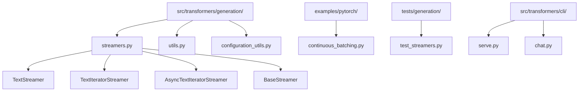
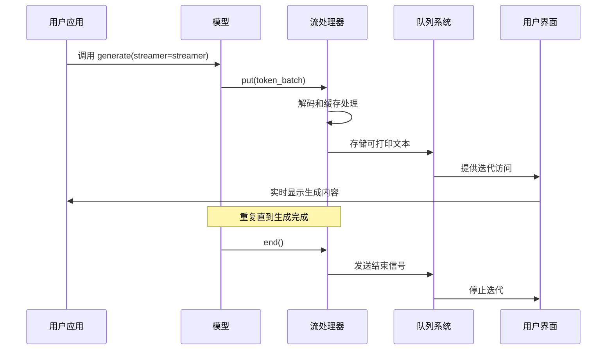
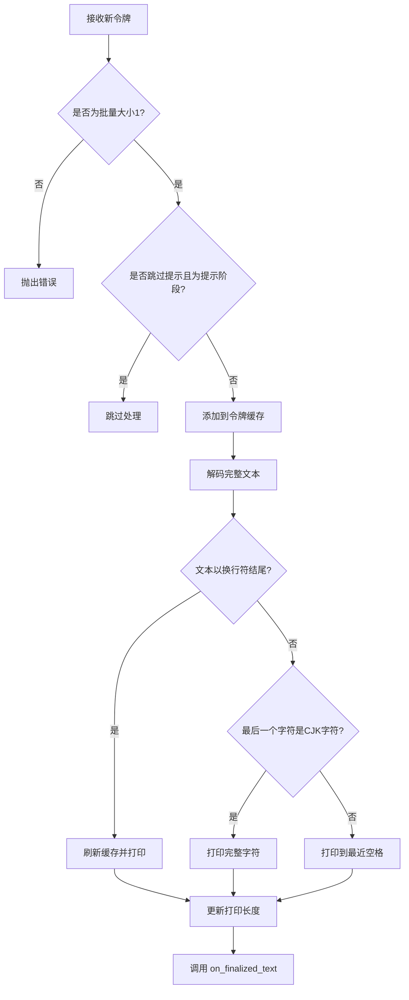
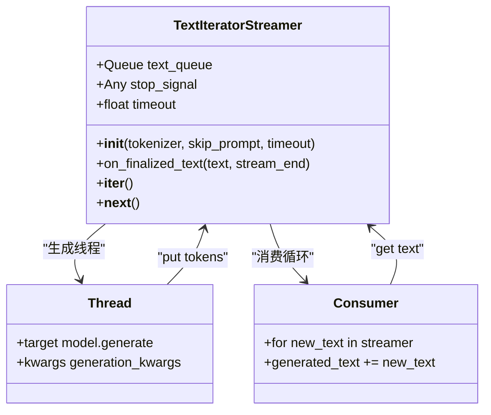
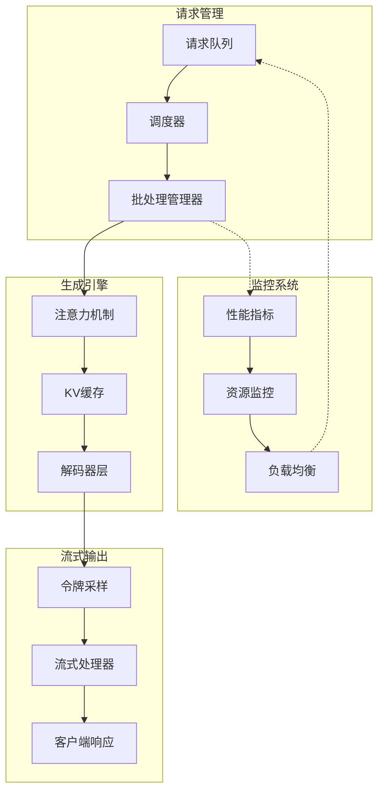
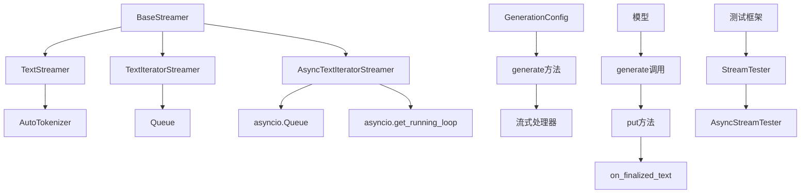

# 流式生成

<cite>
**本文档中引用的文件**
- [streamers.py](file://src/transformers/generation/streamers.py)
- [utils.py](file://src/transformers/generation/utils.py)
- [configuration_utils.py](file://src/transformers/generation/configuration_utils.py)
- [continuous_batching.py](file://examples/pytorch/continuous_batching.py)
- [test_streamers.py](file://tests/generation/test_streamers.py)
- [serve.py](file://src/transformers/cli/serve.py)
- [chat.py](file://src/transformers/cli/chat.py)
</cite>

## 目录
1. [简介](#简介)
2. [项目结构](#项目结构)
3. [核心组件](#核心组件)
4. [架构概览](#架构概览)
5. [详细组件分析](#详细组件分析)
6. [依赖关系分析](#依赖关系分析)
7. [性能考虑](#性能考虑)
8. [故障排除指南](#故障排除指南)
9. [结论](#结论)

## 简介

Transformers库中的流式生成机制是一个强大的功能，允许模型在生成文本时实时输出结果，而不是等待整个序列生成完成后再返回。这种机制对于构建实时应用程序（如聊天机器人、实时翻译系统、交互式对话界面）至关重要。

流式生成的核心优势包括：
- **降低感知延迟**：用户可以立即看到部分生成的内容
- **提升用户体验**：提供更自然的交互体验
- **资源优化**：支持非阻塞的异步处理
- **灵活的应用场景**：适用于各种需要实时响应的场景

## 项目结构

Transformers库中的流式生成相关文件主要分布在以下目录结构中：



**图表来源**
- [streamers.py](file://src/transformers/generation/streamers.py#L1-L319)
- [utils.py](file://src/transformers/generation/utils.py#L1-L199)

## 核心组件

Transformers库提供了三个主要的流式处理器类，每个都有其特定的用途和优势：

### BaseStreamer 基础流处理器
所有流式处理器的基础抽象类，定义了基本的接口规范。

### TextStreamer 文本流处理器
最简单的流式处理器，直接将生成的文本打印到标准输出。

### TextIteratorStreamer 迭代器流处理器  
将生成的文本存储在队列中，支持非阻塞的迭代访问。

### AsyncTextIteratorStreamer 异步迭代器流处理器
基于异步IO的高级流式处理器，支持真正的异步操作。

**章节来源**
- [streamers.py](file://src/transformers/generation/streamers.py#L25-L319)

## 架构概览

流式生成的整体架构展示了从模型调用到最终输出的完整流程：



**图表来源**
- [streamers.py](file://src/transformers/generation/streamers.py#L50-L229)
- [utils.py](file://src/transformers/generation/utils.py#L2500-L2600)

## 详细组件分析

### TextStreamer 组件分析

TextStreamer是最基础的流式处理器，专门设计用于实时打印生成的文本。

#### 核心特性
- **智能缓存管理**：维护令牌缓存以确保完整的单词输出
- **多语言支持**：特别优化了对中文字符的支持
- **提示跳过**：可选择跳过输入提示的输出
- **解码控制**：支持自定义解码参数

#### 工作原理



**图表来源**
- [streamers.py](file://src/transformers/generation/streamers.py#L84-L135)

**章节来源**
- [streamers.py](file://src/transformers/generation/streamers.py#L50-L135)

### TextIteratorStreamer 组件分析

TextIteratorStreamer提供了更灵活的流式处理方式，通过队列系统支持非阻塞的迭代访问。

#### 关键特性
- **线程安全**：使用Queue确保多线程环境下的安全性
- **超时控制**：支持可配置的超时机制
- **迭代协议**：实现了Python的迭代器协议
- **分离式处理**：生成过程与消费过程完全分离

#### 使用模式



**图表来源**
- [streamers.py](file://src/transformers/generation/streamers.py#L145-L229)

**章节来源**
- [streamers.py](file://src/transformers/generation/streamers.py#L145-L229)

### AsyncTextIteratorStreamer 组件分析

AsyncTextIteratorStreamer是最高级的流式处理器，专为现代异步应用设计。

#### 异步特性
- **真正的异步支持**：使用asyncio.Queue和异步迭代器
- **事件循环集成**：与运行中的事件循环无缝协作
- **超时异常处理**：提供明确的超时错误类型
- **线程安全的异步操作**：确保跨线程的安全性

#### 异步工作流程

```mermaid
sequenceDiagram
participant App as 应用程序
participant Loop as 事件循环
participant Streamer as AsyncTextIteratorStreamer
participant Thread as 生成线程
App->>Loop : async for new_text in streamer
Loop->>Streamer : __anext__()
Streamer->>Loop : asyncio.wait_for(queue.get())
Thread->>Streamer : put(tokens)
Streamer->>Loop : 返回新文本
Loop->>App : yield new_text
Note over App,Thread : 重复直到生成完成
Thread->>Streamer : put(stop_signal)
Streamer->>Loop : StopAsyncIteration
Loop->>App : 结束异步循环
```

**图表来源**
- [streamers.py](file://src/transformers/generation/streamers.py#L232-L319)

**章节来源**
- [streamers.py](file://src/transformers/generation/streamers.py#L232-L319)

### 连续批处理流式生成

连续批处理（Continuous Batching）是另一种重要的流式生成技术，特别适用于高并发场景。

#### 连续批处理架构



**图表来源**
- [continuous_batching.py](file://examples/pytorch/continuous_batching.py#L1-L199)
- [utils.py](file://src/transformers/generation/utils.py#L2400-L2500)

**章节来源**
- [continuous_batching.py](file://examples/pytorch/continuous_batching.py#L1-L199)

## 依赖关系分析

流式生成系统的依赖关系展现了复杂的组件交互：



**图表来源**
- [streamers.py](file://src/transformers/generation/streamers.py#L1-L319)
- [utils.py](file://src/transformers/generation/utils.py#L1-L199)

**章节来源**
- [streamers.py](file://src/transformers/generation/streamers.py#L1-L319)
- [utils.py](file://src/transformers/generation/utils.py#L1-L199)

## 性能考虑

### 内存使用情况

流式生成在内存使用方面有以下特点：

| 组件 | 内存占用 | 优化策略 |
|------|----------|----------|
| TextStreamer | 低 | 缓存大小可控 |
| TextIteratorStreamer | 中等 | 队列大小限制 |
| AsyncTextIteratorStreamer | 中等 | 异步队列优化 |
| 连续批处理 | 高 | KV缓存复用 |

### 延迟优化

不同流式处理器的延迟特性对比：

- **TextStreamer**：最低延迟，但受限于同步输出
- **TextIteratorStreamer**：中等延迟，支持非阻塞访问
- **AsyncTextIteratorStreamer**：最高延迟开销，但支持真正的异步
- **连续批处理**：复杂度高，但支持大规模并发

### 最佳实践建议

1. **实时应用**：优先使用TextStreamer或TextIteratorStreamer
2. **Web应用**：推荐AsyncTextIteratorStreamer
3. **高并发场景**：考虑连续批处理方案
4. **内存敏感**：控制队列大小和缓存策略

## 故障排除指南

### 常见问题及解决方案

#### 1. 流式生成不工作
**症状**：文本一次性全部输出，没有实时效果
**原因**：未正确设置streamer参数
**解决**：确保在generate调用中传递正确的streamer实例

#### 2. 多线程问题
**症状**：在多线程环境中出现竞态条件
**原因**：队列访问未正确同步
**解决**：使用TextIteratorStreamer而非直接继承BaseStreamer

#### 3. 异步超时
**症状**：AsyncTextIteratorStreamer抛出TimeoutError
**原因**：生成速度过慢或网络延迟
**解决**：调整timeout参数或检查生成配置

#### 4. 内存泄漏
**症状**：长时间运行后内存持续增长
**原因**：队列未正确清理
**解决**：确保正确调用streamer的清理逻辑

**章节来源**
- [test_streamers.py](file://tests/generation/test_streamers.py#L1-L175)

## 结论

Transformers库的流式生成机制提供了强大而灵活的文本生成能力，支持从简单的实时输出到复杂的异步应用场景。通过合理选择不同的流式处理器，开发者可以根据具体需求构建高效的实时应用。

关键要点：
- **TextStreamer**适合简单的实时输出需求
- **TextIteratorStreamer**提供更好的并发支持
- **AsyncTextIteratorStreamer**支持现代异步应用
- **连续批处理**适用于高并发生产环境

随着AI应用对实时性的要求不断提高，流式生成技术将继续发挥重要作用，为用户提供更加流畅和自然的交互体验。