# 解码策略

<cite>
**本文档引用的文件**
- [src/transformers/generation/utils.py](file://src/transformers/generation/utils.py)
- [src/transformers/generation/logits_process.py](file://src/transformers/generation/logits_process.py)
- [src/transformers/generation/configuration_utils.py](file://src/transformers/generation/configuration_utils.py)
- [src/transformers/generation/stopping_criteria.py](file://src/transformers/generation/stopping_criteria.py)
- [src/transformers/generation/candidate_generator.py](file://src/transformers/generation/candidate_generator.py)
- [tests/generation/test_utils.py](file://tests/generation/test_utils.py)
</cite>

## 目录
1. [简介](#简介)
2. [解码策略概览](#解码策略概览)
3. [核心解码方法](#核心解码方法)
4. [Logits处理器详解](#logits处理器详解)
5. [停止条件机制](#停止条件机制)
6. [辅助生成策略](#辅助生成策略)
7. [性能优化与权衡](#性能优化与权衡)
8. [实际应用指南](#实际应用指南)
9. [总结](#总结)

## 简介

transformers库提供了丰富而灵活的文本生成解码策略，涵盖了从基础的贪婪搜索到复杂的束搜索和随机采样等多种方法。这些策略通过不同的概率分布调整和约束机制，在生成质量、多样性和计算效率之间实现平衡。

## 解码策略概览

transformers库中的解码策略主要分为以下几类：

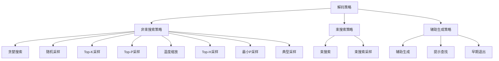

**图表来源**
- [src/transformers/generation/utils.py](file://src/transformers/generation/utils.py#L130-L145)
- [src/transformers/generation/configuration_utils.py](file://src/transformers/generation/configuration_utils.py#L70-L85)

## 核心解码方法

### 贪婪搜索（Greedy Search）

贪婪搜索是最简单的解码策略，每次选择概率最高的词汇项。

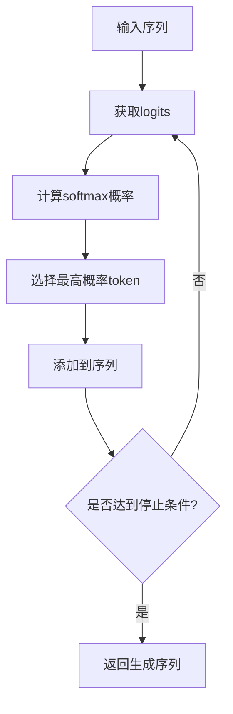

**图表来源**
- [src/transformers/generation/utils.py](file://src/transformers/generation/utils.py#L2890-L2895)

**特点：**
- **优势**：计算速度快，结果可重现
- **劣势**：缺乏多样性，容易陷入重复模式
- **适用场景**：对速度要求高且对多样性要求不高的任务

**节来源**
- [src/transformers/generation/utils.py](file://src/transformers/generation/utils.py#L2775-L2974)

### 随机采样（Multinomial Sampling）

随机采样根据词汇表的概率分布随机选择下一个token。

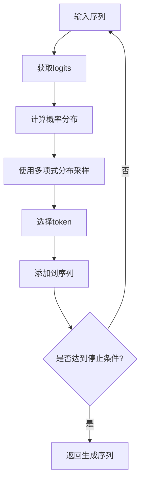

**图表来源**
- [src/transformers/generation/utils.py](file://src/transformers/generation/utils.py#L2930-L2935)

**特点：**
- **优势**：具有多样性，避免重复
- **劣势**：可能产生低质量内容
- **适用场景**：创意写作、对话系统等需要多样性的任务

**节来源**
- [src/transformers/generation/utils.py](file://src/transformers/generation/utils.py#L2775-L2974)

### 束搜索（Beam Search）

束搜索维护多个候选序列，通过贪心策略选择最优的扩展路径。

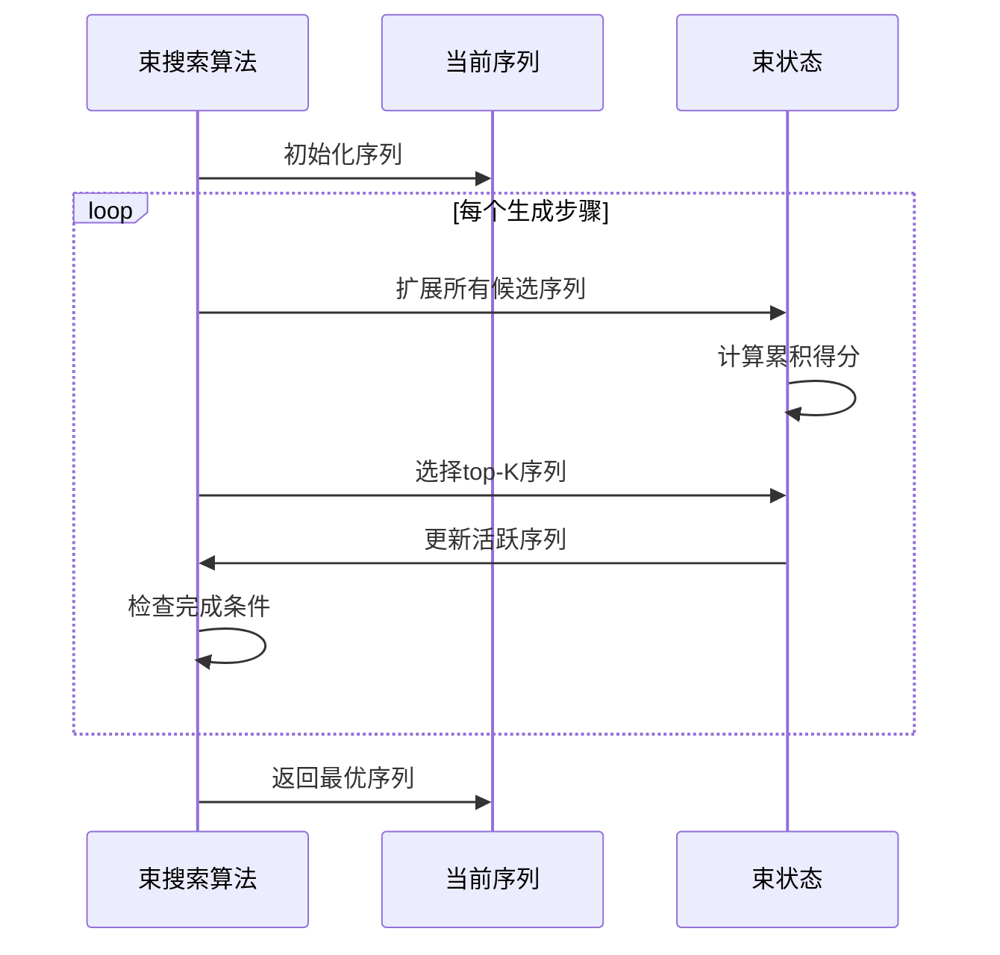

**图表来源**
- [src/transformers/generation/utils.py](file://src/transformers/generation/utils.py#L3204-L3461)

**特点：**
- **优势**：在质量和多样性之间取得平衡
- **劣势**：计算复杂度高，内存消耗大
- **适用场景**：机器翻译、摘要生成等对质量要求较高的任务

**节来源**
- [src/transformers/generation/utils.py](file://src/transformers/generation/utils.py#L3204-L3461)

## Logits处理器详解

Logits处理器是transformers库中用于修改模型输出分布的核心组件，通过各种策略控制生成过程。

### 温度缩放（Temperature Scaling）

温度缩放通过调整概率分布的"锐度"来控制生成的随机性。

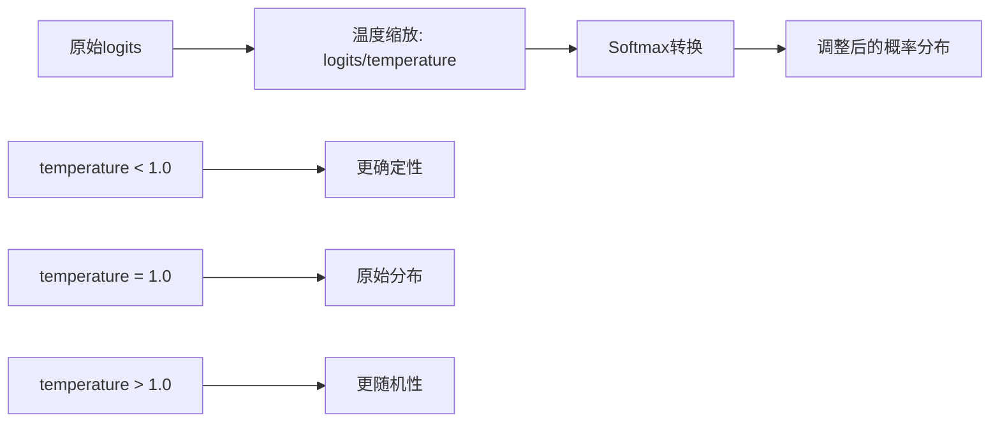

**图表来源**
- [src/transformers/generation/logits_process.py](file://src/transformers/generation/logits_process.py#L250-L290)

**参数说明：**
- `temperature < 1.0`: 减少随机性，使分布更尖锐
- `temperature = 1.0`: 保持原始分布
- `temperature > 1.0`: 增加随机性，使分布更平坦

**节来源**
- [src/transformers/generation/logits_process.py](file://src/transformers/generation/logits_process.py#L250-L290)

### Top-K采样

Top-K采样只保留概率最高的K个token，其余设置为负无穷。

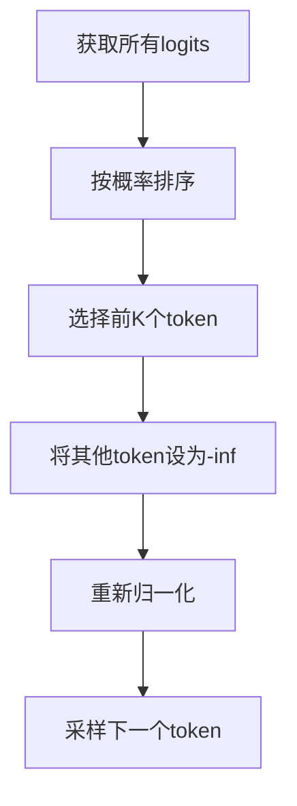

**图表来源**
- [src/transformers/generation/logits_process.py](file://src/transformers/generation/logits_process.py#L420-L450)

**特点：**
- 控制候选token数量
- 避免低概率token的干扰
- 参数K的选择影响生成质量

**节来源**
- [src/transformers/generation/logits_process.py](file://src/transformers/generation/logits_process.py#L420-L450)

### Top-P采样（Nucleus Sampling）

Top-P采样动态选择累积概率达到阈值P的token集合。

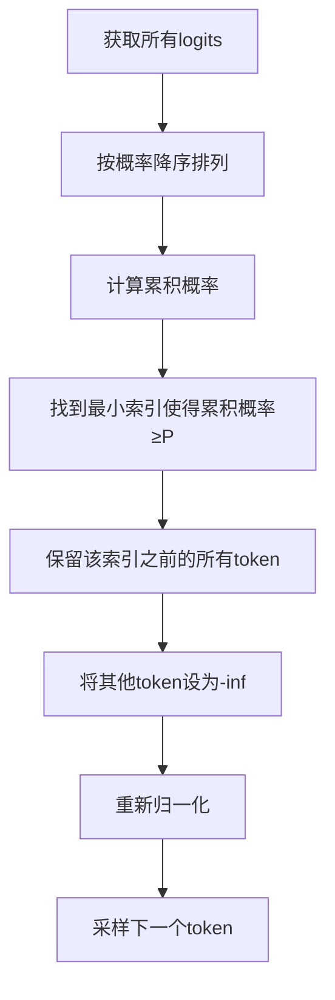

**图表来源**
- [src/transformers/generation/logits_process.py](file://src/transformers/generation/logits_process.py#L495-L530)

**优势：**
- 动态调整候选集大小
- 自适应处理不同分布
- 在质量和多样性间平衡

**节来源**
- [src/transformers/generation/logits_process.py](file://src/transformers/generation/logits_process.py#L495-L530)

### Top-H采样

Top-H采样基于熵约束进行自适应token筛选。

```mermaid
flowchart TD
A[获取top-N logits] --> B[构建概率分布]
B --> C[计算熵阈值τ = H(p) × top_h]
C --> D[累积熵计算]
D --> E[停止条件：累积熵≤τ]
E --> F[保留符合条件的token]
F --> G[过滤其他token]
```

**图表来源**
- [src/transformers/generation/logits_process.py](file://src/transformers/generation/logits_process.py#L631-L663)

**特点：**
- 基于熵的自适应筛选
- 平衡探索与利用
- 提供更好的多样性控制

**节来源**
- [src/transformers/generation/logits_process.py](file://src/transformers/generation/logits_process.py#L631-L663)

### 最小P采样

最小P采样根据最高概率token的比例动态调整阈值。

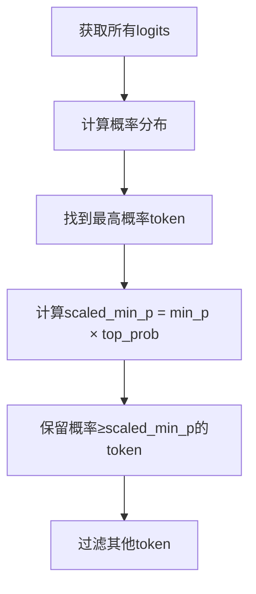

**图表来源**
- [src/transformers/generation/logits_process.py](file://src/transformers/generation/logits_process.py#L700-L730)

**优势：**
- 对置信度高的输出更加保守
- 对不确定的输出更加开放
- 更好的质量稳定性

**节来源**
- [src/transformers/generation/logits_process.py](file://src/transformers/generation/logits_process.py#L700-L730)

### 典型采样（Typical Sampling）

典型采样优先选择接近平均熵的token。

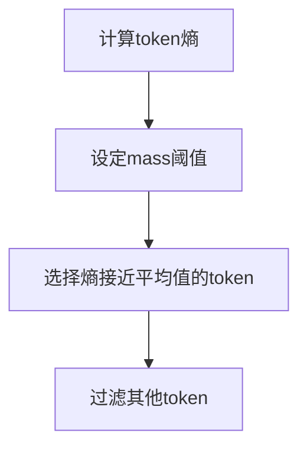

**图表来源**
- [src/transformers/generation/logits_process.py](file://src/transformers/generation/logits_process.py#L750-L780)

**特点：**
- 基于语言学直觉
- 避免极端概率token
- 提供更自然的生成

**节来源**
- [src/transformers/generation/logits_process.py](file://src/transformers/generation/logits_process.py#L750-L780)

## 停止条件机制

停止条件控制生成过程何时终止，确保生成质量和效率。

### 最大长度限制

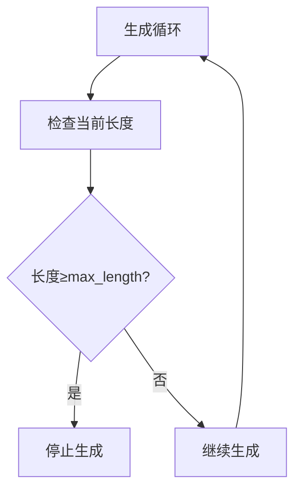

**图表来源**
- [src/transformers/generation/stopping_criteria.py](file://src/transformers/generation/stopping_criteria.py#L50-L70)

### 特定字符串停止

基于预定义字符串的停止条件。

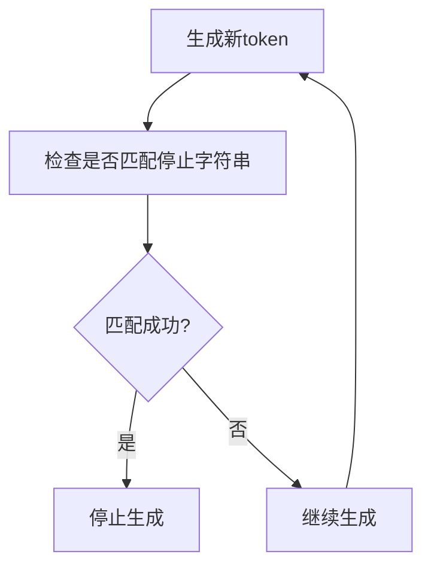

**图表来源**
- [src/transformers/generation/stopping_criteria.py](file://src/transformers/generation/stopping_criteria.py#L100-L200)

### 置信度停止

基于辅助模型置信度的动态停止。

**节来源**
- [src/transformers/generation/stopping_criteria.py](file://src/transformers/generation/stopping_criteria.py#L50-L521)

## 辅助生成策略

辅助生成通过使用较小的辅助模型来加速主模型的推理过程。

### 辅助生成架构

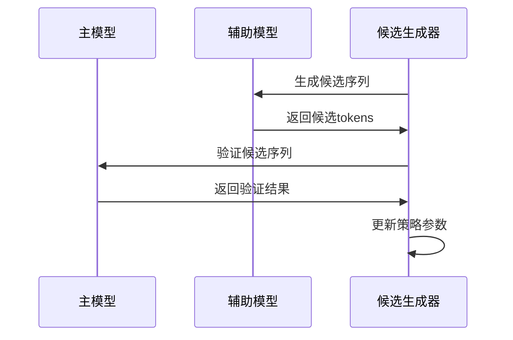

**图表来源**
- [src/transformers/generation/candidate_generator.py](file://src/transformers/generation/candidate_generator.py#L50-L150)

### 不同分词器的通用辅助生成

处理主模型和辅助模型使用不同分词器的情况。

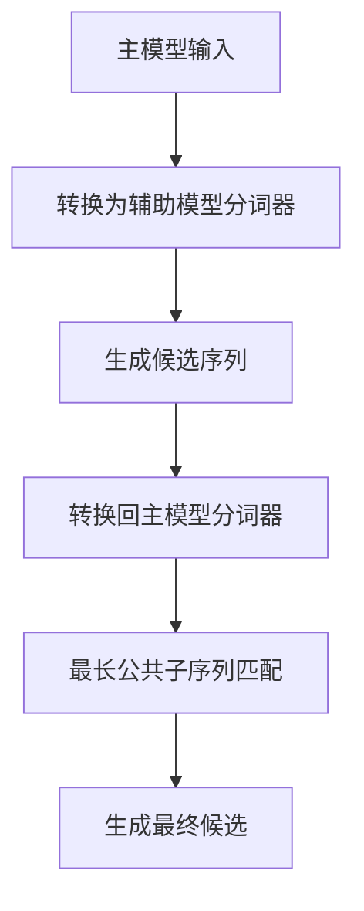

**图表来源**
- [src/transformers/generation/candidate_generator.py](file://src/transformers/generation/candidate_generator.py#L400-L500)

**节来源**
- [src/transformers/generation/candidate_generator.py](file://src/transformers/generation/candidate_generator.py#L50-L799)

## 性能优化与权衡

### 计算效率对比

| 解码策略 | 时间复杂度 | 内存复杂度 | 可重现性 | 多样性 |
|---------|-----------|-----------|----------|--------|
| 贪婪搜索 | O(V) | O(1) | 完全 | 低 |
| 随机采样 | O(V) | O(1) | 不完全 | 高 |
| 束搜索 | O(bV) | O(b) | 完全 | 中等 |
| Top-K采样 | O(V log V) | O(V) | 不完全 | 中等 |
| Top-P采样 | O(V log V) | O(V) | 不完全 | 中等 |

**注释：**
- V: 词汇表大小
- b: 束宽度

### 生成质量评估

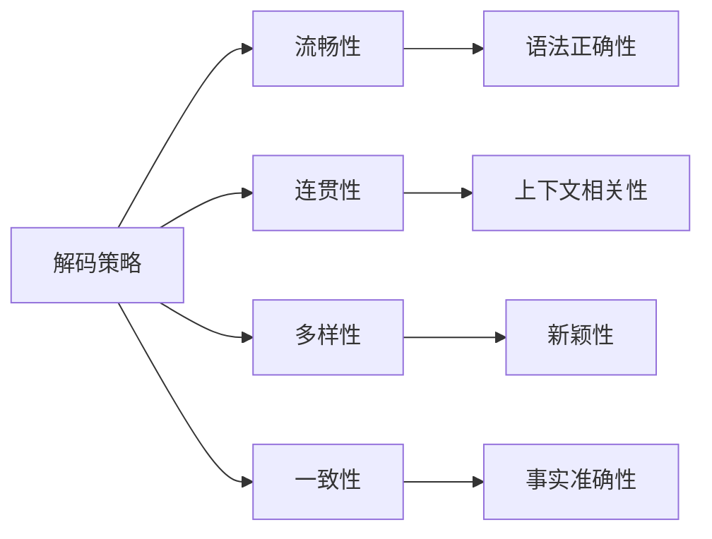

## 实际应用指南

### 组合策略的最佳实践

1. **高质量生成**：
   ```
   束搜索 + Top-P采样 + 温度缩放
   ```

2. **多样化生成**：
   ```
   随机采样 + Top-K采样 + 温度缩放
   ```

3. **快速生成**：
   ```
   贪婪搜索 + 熵惩罚
   ```

4. **创意写作**：
   ```
   随机采样 + 最小P采样 + 典型采样
   ```

### 参数调优建议

| 场景 | 温度 | Top-K | Top-P | 束宽度 |
|------|------|-------|-------|--------|
| 机器翻译 | 0.7-1.0 | 50 | 0.9 | 4-8 |
| 文本摘要 | 0.8-1.2 | 40 | 0.95 | 2-4 |
| 创意写作 | 1.0-1.5 | 10-30 | 0.8-0.9 | 1 |
| 技术文档 | 0.5-0.8 | 50 | 0.9 | 6-12 |

### 代码示例模板

```python
# 高质量生成配置
generation_config = GenerationConfig(
    do_sample=True,
    temperature=0.8,
    top_p=0.9,
    top_k=50,
    num_beams=4,
    max_new_tokens=100,
    repetition_penalty=1.1
)

# 多样化生成配置
generation_config = GenerationConfig(
    do_sample=True,
    temperature=1.2,
    top_k=30,
    max_new_tokens=100
)

# 快速生成配置
generation_config = GenerationConfig(
    do_sample=False,
    num_beams=1,
    max_new_tokens=50
)
```

## 总结

transformers库的解码策略体系提供了从简单到复杂的完整解决方案。通过理解各种策略的特点和适用场景，开发者可以根据具体需求选择合适的解码方法，并通过参数调优实现最佳的生成效果。

关键要点：
1. **策略选择**：根据质量vs效率的需求权衡
2. **参数调优**：通过实验确定最佳参数组合
3. **组合使用**：多种策略结合往往能获得更好效果
4. **监控评估**：持续监控生成质量和性能指标

这种灵活而强大的解码策略框架使得transformers库能够适应各种文本生成任务的需求，从简单的问答到复杂的创意写作都能提供相应的解决方案。