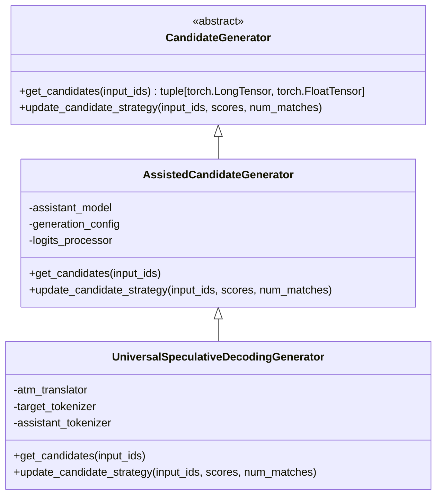
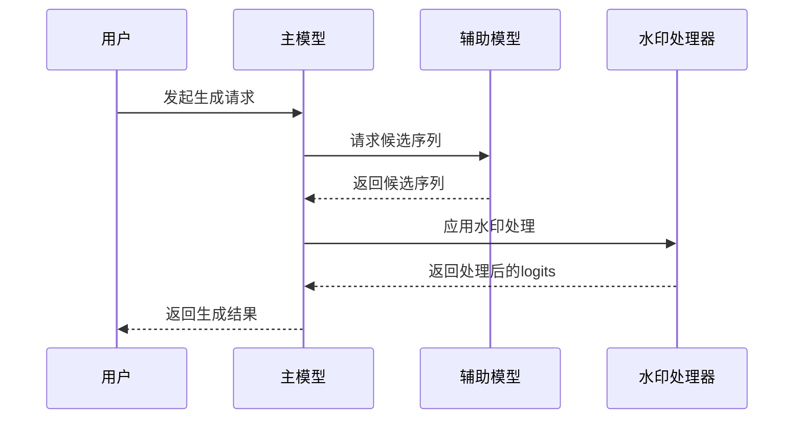
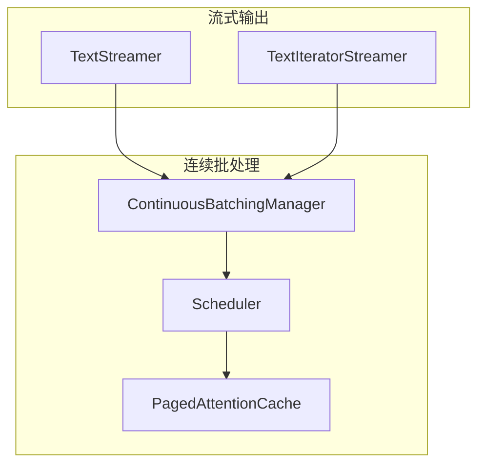

# 辅助解码技术

<cite>
**本文档中引用的文件**  
- [utils.py](file://src/transformers/generation/utils.py)
- [logits_process.py](file://src/transformers/generation/logits_process.py)
- [candidate_generator.py](file://src/transformers/generation/candidate_generator.py)
- [watermarking.py](file://src/transformers/generation/watermarking.py)
- [configuration_utils.py](file://src/transformers/generation/configuration_utils.py)
- [streamers.py](file://src/transformers/generation/streamers.py)
- [continuous_batching/__init__.py](file://src/transformers/generation/continuous_batching/__init__.py)
</cite>

## 目录
1. [引言](#引言)
2. [核心组件](#核心组件)
3. [辅助生成技术](#辅助生成技术)
4. [水印技术](#水印技术)
5. [生成配置与模式](#生成配置与模式)
6. [流式输出与连续批处理](#流式输出与连续批处理)
7. [结论](#结论)

## 引言
辅助解码技术是现代大型语言模型生成系统中的关键组成部分，旨在提高文本生成的效率、质量和安全性。这些技术通过引入辅助模型、概率调整机制和约束条件，优化了传统的自回归解码过程。在Transformers库中，辅助解码技术主要体现在辅助生成、水印检测、流式输出和连续批处理等方面。这些技术共同构成了一个完整的文本生成生态系统，支持从基础的贪婪解码到复杂的多模型协作生成的各种场景。

## 核心组件
Transformers库中的辅助解码技术由多个核心组件构成，这些组件协同工作以实现高效的文本生成。主要组件包括生成混入类（GenerationMixin）、Logits处理器、停止条件、候选生成器和流式输出器。生成混入类为模型提供了统一的生成接口，支持多种解码策略。Logits处理器负责在生成过程中调整模型输出的概率分布，实现温度采样、Top-K过滤等功能。停止条件组件定义了生成过程何时终止，支持基于长度、时间和特定字符串的停止策略。候选生成器实现了辅助生成和推测解码等高级技术。流式输出器则支持实时文本流式传输，适用于交互式应用。

**Section sources**
- [utils.py](file://src/transformers/generation/utils.py#L1-L200)
- [logits_process.py](file://src/transformers/generation/logits_process.py#L1-L200)
- [stopping_criteria.py](file://src/transformers/generation/stopping_criteria.py#L1-L200)

## 辅助生成技术
辅助生成技术通过使用较小的辅助模型来加速主模型的文本生成过程。这种技术的核心思想是让辅助模型预测可能的后续token序列，然后由主模型验证这些预测。如果预测正确，就可以一次性生成多个token，从而减少主模型的调用次数。在Transformers库中，`AssistedCandidateGenerator`类实现了这一功能，它利用一个较小的模型生成候选序列，并通过主模型进行验证。`UniversalSpeculativeDecodingGenerator`类进一步扩展了这一概念，支持不同tokenizer的辅助和主模型之间的推测解码。这些技术显著提高了生成速度，特别是在长文本生成场景中表现出色。

**Diagram sources**
- [candidate_generator.py](file://src/transformers/generation/candidate_generator.py#L41-L1163)

**Section sources**
- [candidate_generator.py](file://src/transformers/generation/candidate_generator.py#L41-L1163)
- [test_candidate_generator.py](file://tests/generation/test_candidate_generator.py#L253-L283)

## 水印技术
水印技术用于在生成的文本中嵌入不可见的标识，以便后续检测文本是否由AI生成。这种技术对于内容溯源和版权保护具有重要意义。在Transformers库中，`WatermarkLogitsProcessor`类实现了文本水印功能，它通过调整模型输出logits的方式，在生成过程中选择特定的"绿色"token序列。`WatermarkDetector`类则用于检测文本中的水印，通过分析token序列的统计特性来判断文本是否包含水印。`SynthIDTextWatermarkDetector`提供了更高级的水印检测功能。这些技术基于论文《A Watermark for Large Language Models》实现，能够在不影响文本质量的前提下嵌入和检测水印。

**Diagram sources**
- [watermarking.py](file://src/transformers/generation/watermarking.py#L1-L200)
- [logits_process.py](file://src/transformers/generation/logits_process.py#L2625-L2945)

**Section sources**
- [watermarking.py](file://src/transformers/generation/watermarking.py#L1-L200)
- [logits_process.py](file://src/transformers/generation/logits_process.py#L2625-L2945)
- [CLAUDE.md](file://src/transformers/generation/CLAUDE.md#L231-L246)

## 生成配置与模式
生成配置与模式管理是辅助解码技术的基础，它定义了生成过程的各种参数和策略。`GenerationConfig`类提供了统一的配置管理，支持贪婪搜索、束搜索、采样等多种生成模式。`GenerationMode`枚举类定义了不同的生成模式，包括贪婪搜索、束搜索、辅助生成等。配置系统支持通过JSON文件保存和加载，便于在不同环境间共享配置。这些配置参数控制着生成过程的各个方面，如最大长度、最小长度、采样温度、Top-K值等。通过灵活的配置管理，用户可以根据具体应用场景选择最优的生成策略。

**Section sources**
- [configuration_utils.py](file://src/transformers/generation/configuration_utils.py#L1-L200)
- [utils.py](file://src/transformers/generation/utils.py#L156-L176)

## 流式输出与连续批处理
流式输出与连续批处理技术解决了实时交互和高吞吐量生成的需求。`TextStreamer`和`TextIteratorStreamer`类实现了文本的实时流式输出，适用于聊天机器人等交互式应用。连续批处理系统通过`ContinuousBatchingManager`和`Scheduler`类实现，支持FIFO和预填充优先等调度策略。`PagedAttentionCache`优化了内存使用，提高了批处理效率。这些技术使得系统能够同时处理多个生成请求，显著提高了资源利用率和响应速度。对于需要实时反馈的应用场景，这些技术提供了关键的支持。

**Diagram sources**
- [streamers.py](file://src/transformers/generation/streamers.py#L1-L200)
- [continuous_batching/__init__.py](file://src/transformers/generation/continuous_batching/__init__.py#L1-L31)

**Section sources**
- [streamers.py](file://src/transformers/generation/streamers.py#L1-L200)
- [continuous_batching/__init__.py](file://src/transformers/generation/continuous_batching/__init__.py#L1-L31)

## 结论
辅助解码技术在现代语言模型生成系统中扮演着至关重要的角色。通过辅助生成、水印检测、流式输出和连续批处理等技术的综合应用，Transformers库提供了一个强大而灵活的文本生成框架。这些技术不仅提高了生成效率和质量，还增强了系统的安全性和实用性。未来，随着模型规模的不断扩大和应用场景的日益复杂，辅助解码技术将继续演进，为更智能、更高效的文本生成提供支持。开发者可以根据具体需求选择合适的辅助解码技术，构建高性能的生成应用。