# 高级生成控制

<cite>
**本文档中引用的文件**
- [stopping_criteria.py](file://src/transformers/generation/stopping_criteria.py)
- [logits_process.py](file://src/transformers/generation/logits_process.py)
- [utils.py](file://src/transformers/generation/utils.py)
- [configuration_utils.py](file://src/transformers/generation/configuration_utils.py)
- [streamers.py](file://src/transformers/generation/streamers.py)
- [test_logits_process.py](file://tests/generation/test_logits_process.py)
- [test_stopping_criteria.py](file://tests/generation/test_stopping_criteria.py)
- [continuous_api.py](file://src/transformers/generation/continuous_batching/continuous_api.py)
</cite>

## 目录
1. [简介](#简介)
2. [项目结构概览](#项目结构概览)
3. [核心组件分析](#核心组件分析)
4. [架构概览](#架构概览)
5. [详细组件分析](#详细组件分析)
6. [依赖关系分析](#依赖关系分析)
7. [性能考虑](#性能考虑)
8. [故障排除指南](#故障排除指南)
9. [结论](#结论)

## 简介

Transformers库提供了强大而灵活的生成控制机制，允许开发者通过自定义逻辑精确控制文本生成过程。本文档深入探讨了两个核心方面：停止条件（Stopping Criteria）和logits处理器（Logits Processors），以及它们在高级生成场景中的应用。

生成控制是现代大语言模型的关键特性，它使开发者能够：
- 实现复杂的停止逻辑（基于内容、长度、时间等）
- 自定义生成概率分布（避免特定词汇、强制包含关键词）
- 处理复杂生成场景（格式化输出、约束解码、多轮对话）
- 优化生成性能和质量

## 项目结构概览

Transformers生成控制系统的组织结构体现了清晰的职责分离和模块化设计：

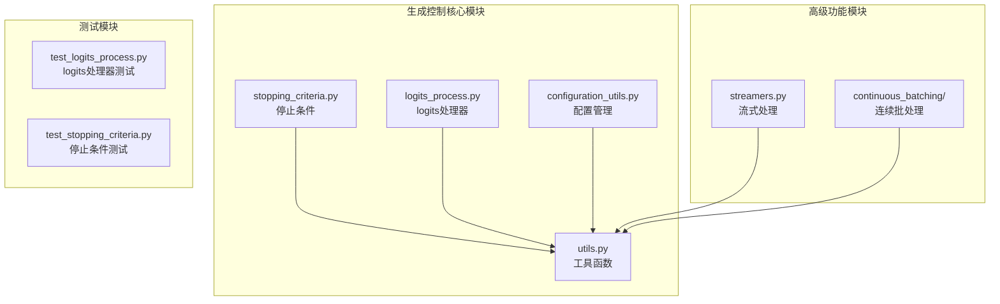

**图表来源**
- [stopping_criteria.py](file://src/transformers/generation/stopping_criteria.py#L1-L50)
- [logits_process.py](file://src/transformers/generation/logits_process.py#L1-L50)
- [utils.py](file://src/transformers/generation/utils.py#L1-L50)

**章节来源**
- [stopping_criteria.py](file://src/transformers/generation/stopping_criteria.py#L1-L100)
- [logits_process.py](file://src/transformers/generation/logits_process.py#L1-L100)

## 核心组件分析

### 停止条件系统

停止条件系统提供了多种内置的停止策略，并支持自定义实现：

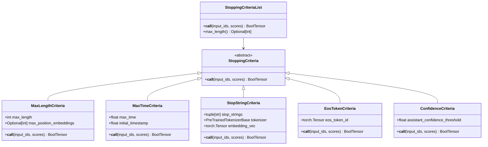

**图表来源**
- [stopping_criteria.py](file://src/transformers/generation/stopping_criteria.py#L30-L150)
- [stopping_criteria.py](file://src/transformers/generation/stopping_criteria.py#L480-L521)

### Logits处理器系统

Logits处理器系统提供了强大的概率分布修改能力：

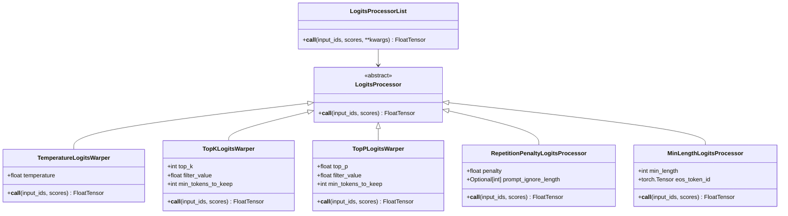

**图表来源**
- [logits_process.py](file://src/transformers/generation/logits_process.py#L40-L120)
- [logits_process.py](file://src/transformers/generation/logits_process.py#L70-L110)

**章节来源**
- [stopping_criteria.py](file://src/transformers/generation/stopping_criteria.py#L30-L200)
- [logits_process.py](file://src/transformers/generation/logits_process.py#L40-L200)

## 架构概览

生成控制系统采用分层架构设计，确保了灵活性和可扩展性：

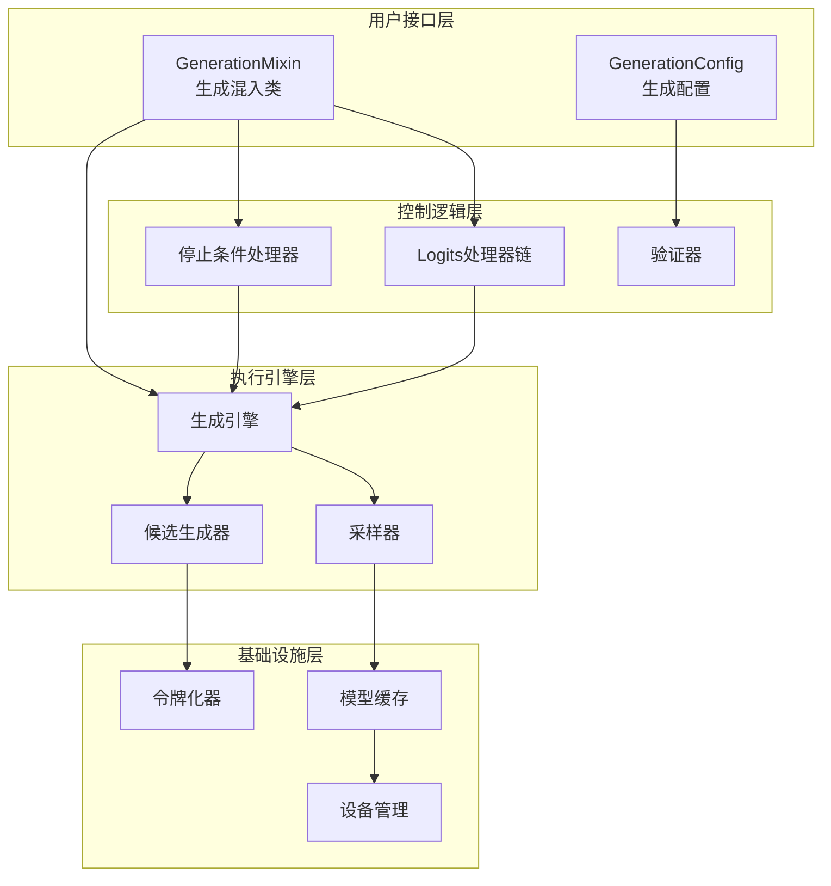

**图表来源**
- [utils.py](file://src/transformers/generation/utils.py#L400-L500)
- [configuration_utils.py](file://src/transformers/generation/configuration_utils.py#L100-L200)

## 详细组件分析

### 停止条件实现机制

#### MaxLengthCriteria - 基于长度的停止

最大长度停止条件是最基础也是最常用的停止策略：

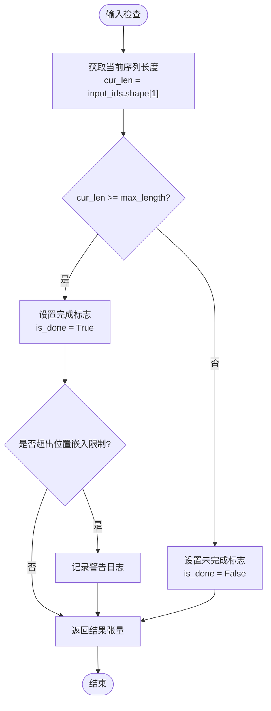

**图表来源**
- [stopping_criteria.py](file://src/transformers/generation/stopping_criteria.py#L50-L70)

#### StopStringCriteria - 基于内容的停止

字符串停止条件是最复杂的停止策略之一，实现了高效的字符串匹配算法：

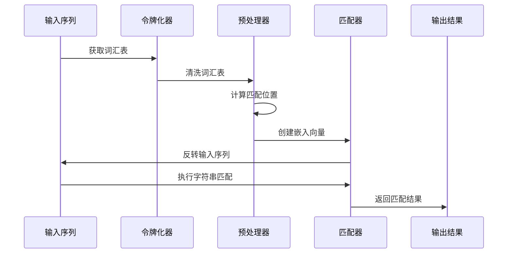

**图表来源**
- [stopping_criteria.py](file://src/transformers/generation/stopping_criteria.py#L125-L200)

#### 自定义停止条件实现

开发者可以通过继承`StoppingCriteria`基类来创建自定义停止条件：

```python
# 示例：基于置信度的停止条件
class CustomConfidenceCriteria(StoppingCriteria):
    def __init__(self, confidence_threshold: float):
        self.confidence_threshold = confidence_threshold
    
    def __call__(self, input_ids: torch.LongTensor, 
                 scores: torch.FloatTensor, **kwargs) -> torch.BoolTensor:
        # 计算当前token的概率
        probs = torch.softmax(scores, dim=-1)
        current_prob = probs[0, input_ids[0, -1]]
        
        # 如果概率低于阈值，则停止
        return current_prob < self.confidence_threshold
```

**章节来源**
- [stopping_criteria.py](file://src/transformers/generation/stopping_criteria.py#L50-L150)
- [stopping_criteria.py](file://src/transformers/generation/stopping_criteria.py#L475-L521)

### Logits处理器扩展能力

#### TemperatureLogitsWarper - 概率调节

温度处理器通过缩放logits来控制生成的随机性：

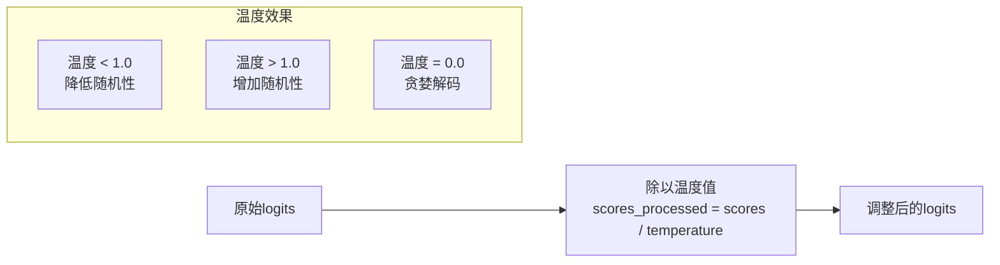

**图表来源**
- [logits_process.py](file://src/transformers/generation/logits_process.py#L250-L280)

#### RepetitionPenaltyLogitsProcessor - 重复惩罚

重复惩罚处理器防止生成过程中的重复内容：

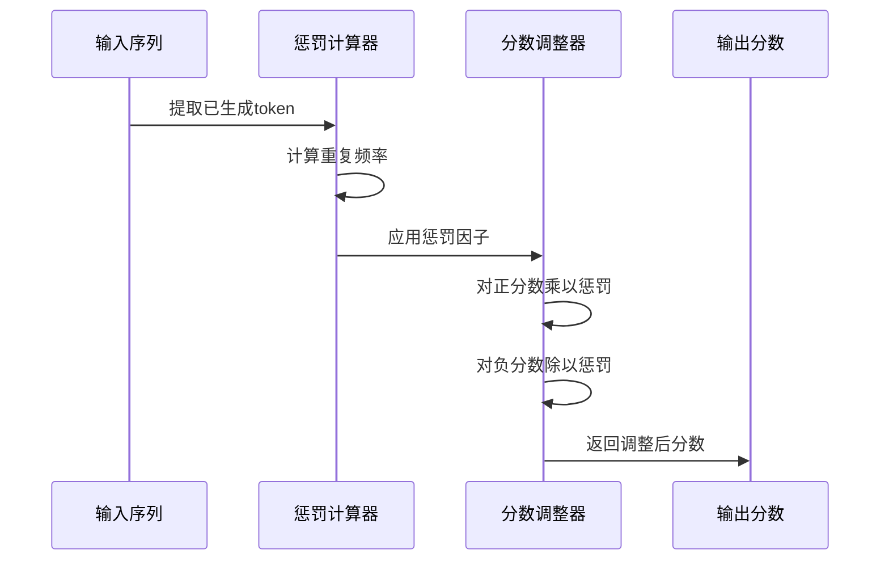

**图表来源**
- [logits_process.py](file://src/transformers/generation/logits_process.py#L350-L420)

#### 自定义Logits处理器实现

开发者可以创建专门的logits处理器来满足特定需求：

```python
# 示例：关键词强制处理器
class KeywordEnforcerLogitsProcessor(LogitsProcessor):
    def __init__(self, keywords: List[str], tokenizer: PreTrainedTokenizer):
        self.keywords = keywords
        self.keyword_ids = self._get_keyword_ids(tokenizer)
    
    def _get_keyword_ids(self, tokenizer: PreTrainedTokenizer) -> List[int]:
        # 将关键词转换为token ID
        return [tokenizer.encode(kw, add_special_tokens=False)[0] 
                for kw in self.keywords]
    
    def __call__(self, input_ids: torch.LongTensor, 
                 scores: torch.FloatTensor) -> torch.FloatTensor:
        # 强制包含关键词
        for kw_id in self.keyword_ids:
            scores[:, kw_id] = scores[:, kw_id] + 10.0  # 提高概率
        return scores
```

**章节来源**
- [logits_process.py](file://src/transformers/generation/logits_process.py#L250-L350)
- [logits_process.py](file://src/transformers/generation/logits_process.py#L350-L450)

### 复杂生成场景实现

#### 格式化输出生成

通过组合多个logits处理器实现格式化输出：

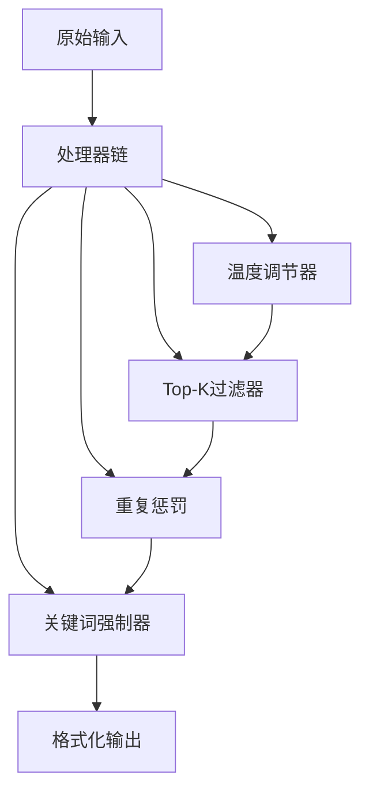

**图表来源**
- [utils.py](file://src/transformers/generation/utils.py#L1280-L1350)

#### 约束解码实现

约束解码允许在生成过程中限制词汇选择：

```python
# 示例：前缀约束处理器
class PrefixConstrainedLogitsProcessor(LogitsProcessor):
    def __init__(self, prefix_allowed_tokens_fn: Callable, num_prefix_tokens: int):
        self.prefix_allowed_tokens_fn = prefix_allowed_tokens_fn
        self.num_prefix_tokens = num_prefix_tokens
    
    def __call__(self, input_ids: torch.LongTensor, 
                 scores: torch.FloatTensor) -> torch.FloatTensor:
        batch_size = input_ids.shape[0]
        
        for i in range(batch_size):
            # 获取当前批次的前缀
            prefix_tokens = input_ids[i, -self.num_prefix_tokens:]
            
            # 获取允许的token列表
            allowed_tokens = self.prefix_allowed_tokens_fn(i, prefix_tokens)
            
            # 禁用不允许的token
            all_tokens = torch.arange(scores.shape[1], device=scores.device)
            disallowed_tokens = torch.tensor([
                token for token in all_tokens 
                if token not in allowed_tokens
            ], device=scores.device)
            
            scores[i, disallowed_tokens] = -float('inf')
        
        return scores
```

#### 多轮对话管理

多轮对话需要维护上下文状态和适当的停止条件：

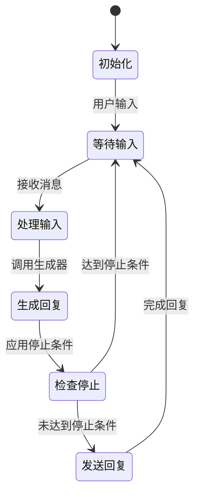

**章节来源**
- [utils.py](file://src/transformers/generation/utils.py#L1280-L1400)

### 流式处理和连续批处理

#### TextStreamer - 实时流式输出

流式处理器提供了实时生成文本显示的能力：

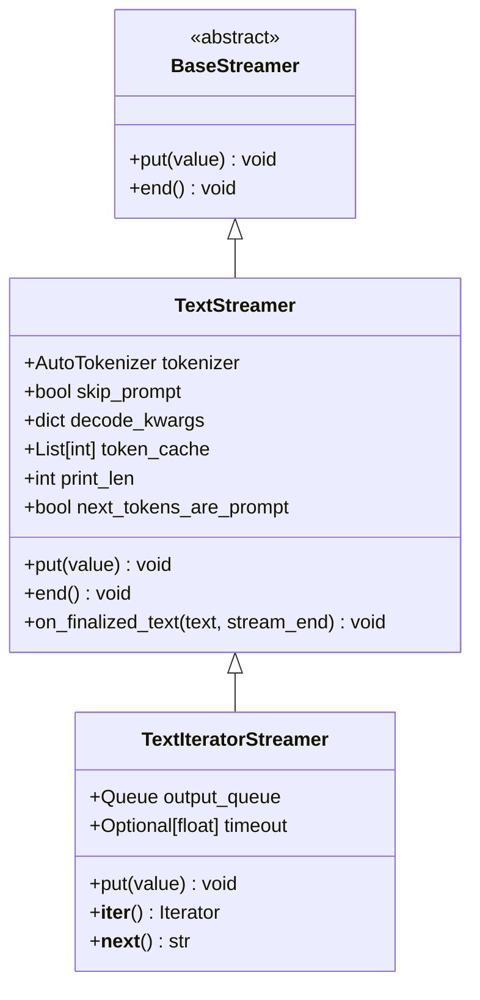

**图表来源**
- [streamers.py](file://src/transformers/generation/streamers.py#L20-L100)

#### 连续批处理架构

连续批处理系统允许多个请求并发处理：

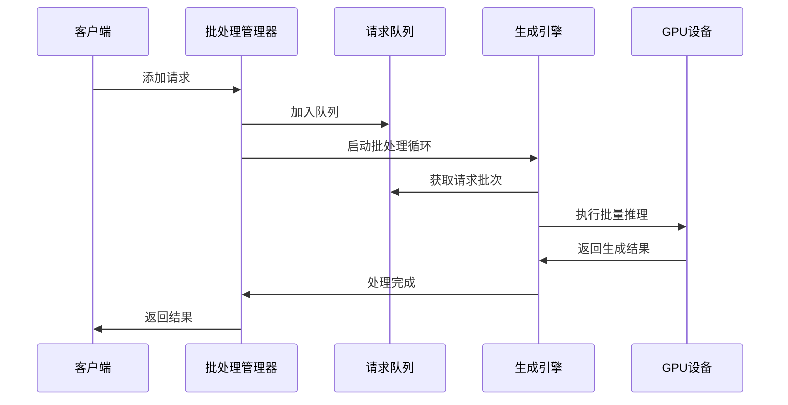

**图表来源**
- [continuous_api.py](file://src/transformers/generation/continuous_batching/continuous_api.py#L827-L863)

**章节来源**
- [streamers.py](file://src/transformers/generation/streamers.py#L20-L150)
- [continuous_api.py](file://src/transformers/generation/continuous_batching/continuous_api.py#L697-L729)

## 依赖关系分析

生成控制系统具有清晰的依赖层次结构：

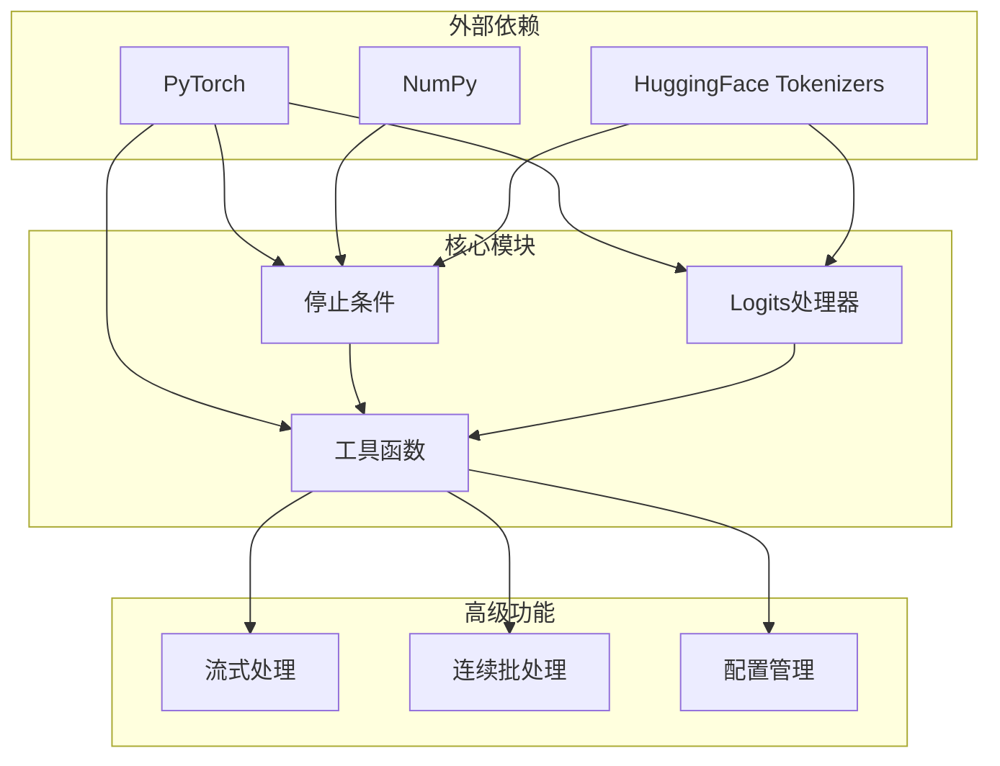

**图表来源**
- [utils.py](file://src/transformers/generation/utils.py#L1-L50)
- [configuration_utils.py](file://src/transformers/generation/configuration_utils.py#L1-L50)

**章节来源**
- [utils.py](file://src/transformers/generation/utils.py#L1-L100)
- [configuration_utils.py](file://src/transformers/generation/configuration_utils.py#L1-L100)

## 性能考虑

### 内存优化策略

1. **梯度检查点**：在长序列生成中使用
2. **KV缓存优化**：动态调整缓存大小
3. **批处理优化**：智能批次大小调整

### 计算效率提升

1. **CUDA图优化**：减少内核启动开销
2. **混合精度训练**：加速推理过程
3. **注意力优化**：使用Flash Attention等技术

### 并发处理优化

1. **异步处理**：非阻塞生成
2. **流水线并行**：重叠计算和通信
3. **动态批处理**：根据负载调整批次

## 故障排除指南

### 常见问题及解决方案

#### 停止条件不生效

**问题描述**：自定义停止条件没有按预期工作

**可能原因**：
1. 停止条件优先级问题
2. 条件判断逻辑错误
3. 设备不匹配

**解决方案**：
```python
# 检查停止条件配置
print(f"当前停止条件: {stopping_criteria}")
print(f"最大长度: {stopping_criteria.max_length}")

# 验证条件逻辑
result = custom_criteria(input_ids, scores)
print(f"条件结果: {result}")
```

#### Logits处理器冲突

**问题描述**：多个logits处理器之间产生冲突

**解决方案**：
```python
# 检查处理器顺序
processors = LogitsProcessorList([
    RepetitionPenaltyLogitsProcessor(penalty=1.2),
    TemperatureLogitsWarper(temperature=0.8),
    TopKLogitsWarper(top_k=50)
])

# 验证每个处理器的效果
for processor in processors:
    print(f"处理器: {processor.__class__.__name__}")
    scores = processor(input_ids, scores)
```

#### 内存泄漏问题

**问题描述**：长时间运行后内存使用持续增长

**解决方案**：
1. 使用`torch.cuda.empty_cache()`清理GPU内存
2. 检查是否有未释放的张量引用
3. 调整批处理大小

**章节来源**
- [test_stopping_criteria.py](file://tests/generation/test_stopping_criteria.py#L119-L149)
- [test_logits_process.py](file://tests/generation/test_logits_process.py#L815-L848)

## 结论

Transformers库的生成控制系统提供了强大而灵活的控制机制，通过停止条件和logits处理器的组合，开发者可以实现复杂的生成逻辑。系统的设计体现了以下特点：

1. **模块化设计**：清晰的职责分离使得系统易于理解和扩展
2. **高度可配置**：丰富的参数选项满足不同应用场景需求
3. **性能优化**：多层次的优化策略确保高效运行
4. **扩展性强**：简单的接口设计支持自定义扩展

通过深入理解这些机制，开发者可以构建出更加智能和可控的生成应用，从简单的文本补全到复杂的对话系统，都能找到合适的解决方案。随着模型能力的不断提升，这些控制机制将继续发挥重要作用，帮助我们更好地利用大语言模型的潜力。