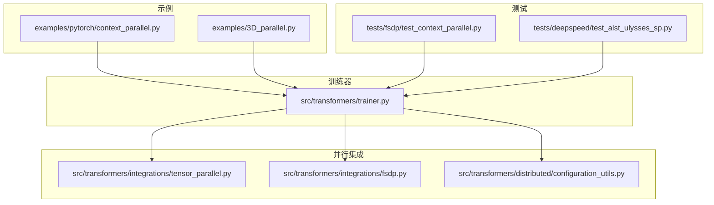
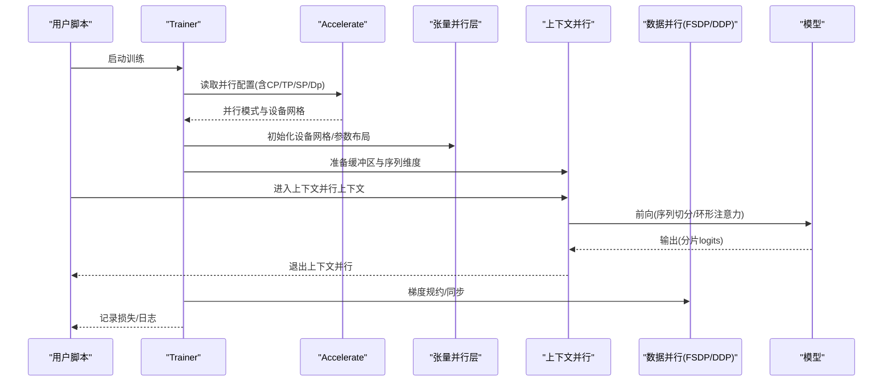
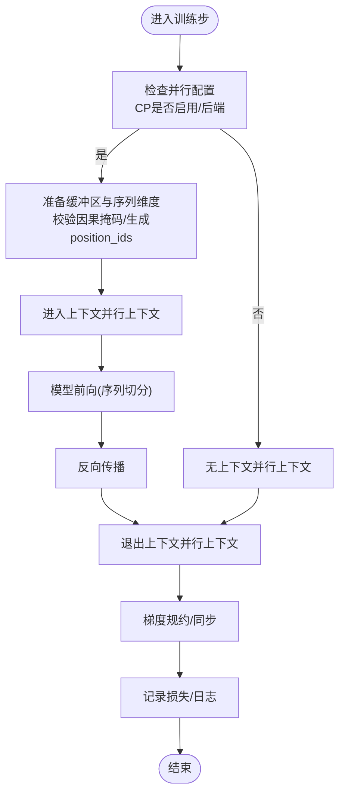
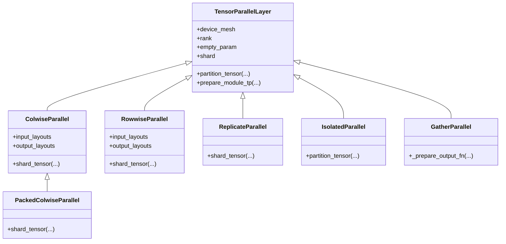
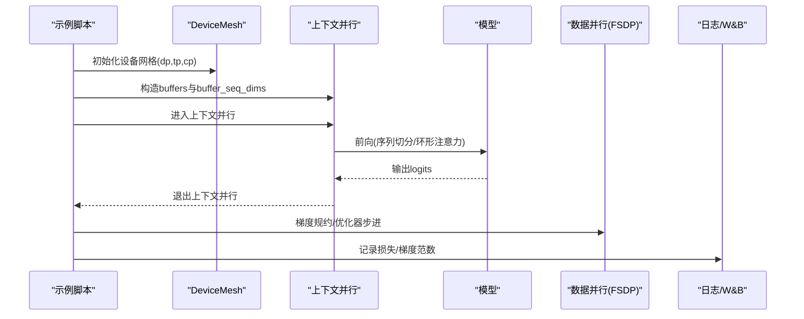
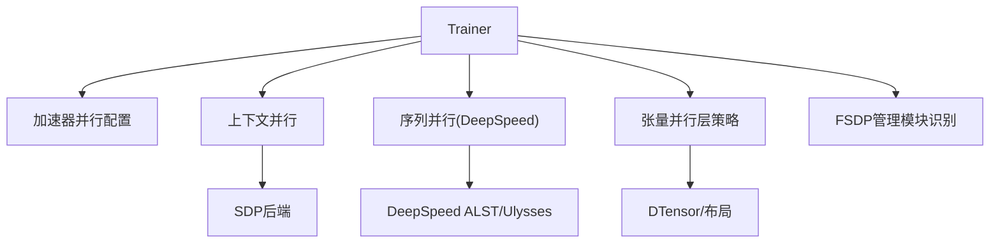

# 专家并行

<cite>
**本文引用的文件**
- [examples/pytorch/context_parallel.py](file://examples/pytorch/context_parallel.py)
- [examples/3D_parallel.py](file://examples/3D_parallel.py)
- [src/transformers/integrations/tensor_parallel.py](file://src/transformers/integrations/tensor_parallel.py)
- [src/transformers/trainer.py](file://src/transformers/trainer.py)
- [tests/fsdp/test_context_parallel.py](file://tests/fsdp/test_context_parallel.py)
- [tests/deepspeed/test_alst_ulysses_sp.py](file://tests/deepspeed/test_alst_ulysses_sp.py)
- [src/transformers/integrations/fsdp.py](file://src/transformers/integrations/fsdp.py)
- [src/transformers/distributed/configuration_utils.py](file://src/transformers/distributed/configuration_utils.py)
</cite>

## 目录
1. [简介](#简介)
2. [项目结构](#项目结构)
3. [核心组件](#核心组件)
4. [架构总览](#架构总览)
5. [详细组件分析](#详细组件分析)
6. [依赖关系分析](#依赖关系分析)
7. [性能考量](#性能考量)
8. [故障排查指南](#故障排查指南)
9. [结论](#结论)
10. [附录](#附录)

## 简介
本文件系统性梳理了仓库中“专家并行”（专家并行、张量并行、上下文并行、序列并行）相关的实现与使用方式，覆盖从训练器集成、分布式设备网格、张量并行层策略、到上下文并行与序列并行在加速框架中的协同工作流程。文档以循序渐进的方式呈现，既面向需要快速上手的用户，也提供深入到代码级的架构与数据流分析，帮助读者理解多维并行如何在实际训练中协同工作。

## 项目结构
围绕“专家并行”的关键目录与文件：
- 示例脚本：演示上下文并行、张量并行与数据并行的组合使用
  - examples/pytorch/context_parallel.py：上下文并行最小示例
  - examples/3D_parallel.py：张量并行+数据并行+上下文并行的综合示例
- 训练器集成：Trainer 对并行维度的感知与损失聚合
  - src/transformers/trainer.py：并行尺寸获取、上下文并行输入准备、损失上下文管理
- 张量并行：设备网格初始化、参数切分与布局策略
  - src/transformers/integrations/tensor_parallel.py：张量并行层策略、设备网格初始化、权重打包与切分
- 测试用例：验证上下文并行与序列并行的一致性
  - tests/fsdp/test_context_parallel.py：对比启用/禁用上下文并行的损失一致性
  - tests/deepspeed/test_alst_ulysses_sp.py：对比启用/禁用序列并行的损失一致性
- 分布式配置：基础分布式配置基类
  - src/transformers/distributed/configuration_utils.py：分布式配置基类
- FSDP 集成：FSDP 管理模块识别
  - src/transformers/integrations/fsdp.py：FSDP 管理模块识别与开关

图表来源
- [examples/pytorch/context_parallel.py](file://examples/pytorch/context_parallel.py#L1-L95)
- [examples/3D_parallel.py](file://examples/3D_parallel.py#L1-L120)
- [src/transformers/trainer.py](file://src/transformers/trainer.py#L2180-L2379)
- [src/transformers/integrations/tensor_parallel.py](file://src/transformers/integrations/tensor_parallel.py#L1-L120)
- [src/transformers/integrations/fsdp.py](file://src/transformers/integrations/fsdp.py#L1-L54)
- [src/transformers/distributed/configuration_utils.py](file://src/transformers/distributed/configuration_utils.py#L1-L112)
- [tests/fsdp/test_context_parallel.py](file://tests/fsdp/test_context_parallel.py#L53-L165)
- [tests/deepspeed/test_alst_ulysses_sp.py](file://tests/deepspeed/test_alst_ulysses_sp.py#L93-L130)

章节来源
- [examples/pytorch/context_parallel.py](file://examples/pytorch/context_parallel.py#L1-L95)
- [examples/3D_parallel.py](file://examples/3D_parallel.py#L1-L120)
- [src/transformers/trainer.py](file://src/transformers/trainer.py#L2180-L2379)
- [src/transformers/integrations/tensor_parallel.py](file://src/transformers/integrations/tensor_parallel.py#L1-L120)
- [src/transformers/integrations/fsdp.py](file://src/transformers/integrations/fsdp.py#L1-L54)
- [src/transformers/distributed/configuration_utils.py](file://src/transformers/distributed/configuration_utils.py#L1-L112)
- [tests/fsdp/test_context_parallel.py](file://tests/fsdp/test_context_parallel.py#L53-L165)
- [tests/deepspeed/test_alst_ulysses_sp.py](file://tests/deepspeed/test_alst_ulysses_sp.py#L93-L130)

## 核心组件
- 上下文并行（Context Parallelism）
  - 在 FSDP2 中通过环形注意力（Ring Attention）将序列切分为多个片段，跨进程轮转计算，提升长序列吞吐。
  - 训练器在启用时对输入进行缓冲区与序列维度标注，并校验因果掩码与 SDPA 注意力实现。
- 张量并行（Tensor Parallelism）
  - 基于设备网格（Device Mesh），对模型参数按列/行方向切分，配合 DTensor 布局与重分布，实现层内并行。
  - 提供多种并行风格（Colwise、Rowwise、Replicate、Isolated、Gather 等）以适配不同算子与量化需求。
- 序列并行（Sequence Parallelism）
  - 在 DeepSpeed 中通过 ALST/Ulysses 将序列维度切分，与上下文并行互补，共同支撑超长序列训练。
- 数据并行（Data Parallelism）
  - 通过 FSDP 或 DDP 对模型副本进行梯度同步，与 TP/CP/SP 组合形成 3D/4D 并行拓扑。

章节来源
- [src/transformers/trainer.py](file://src/transformers/trainer.py#L2180-L2379)
- [src/transformers/integrations/tensor_parallel.py](file://src/transformers/integrations/tensor_parallel.py#L447-L1207)
- [examples/3D_parallel.py](file://examples/3D_parallel.py#L90-L120)
- [tests/fsdp/test_context_parallel.py](file://tests/fsdp/test_context_parallel.py#L53-L165)
- [tests/deepspeed/test_alst_ulysses_sp.py](file://tests/deepspeed/test_alst_ulysses_sp.py#L93-L130)

## 架构总览
下图展示了“专家并行”在训练过程中的整体交互：训练器根据并行配置选择是否启用上下文并行；张量并行在模型加载阶段完成设备网格与参数布局初始化；示例脚本演示了如何在前向与反向之间正确包裹上下文并行上下文，以及如何在 DP/TP/CP 组合下进行梯度规约与日志记录。

图表来源
- [src/transformers/trainer.py](file://src/transformers/trainer.py#L3657-L3747)
- [src/transformers/integrations/tensor_parallel.py](file://src/transformers/integrations/tensor_parallel.py#L1-L120)
- [examples/3D_parallel.py](file://examples/3D_parallel.py#L268-L310)
- [src/transformers/integrations/fsdp.py](file://src/transformers/integrations/fsdp.py#L1-L54)

## 详细组件分析

### 训练器对并行维度的感知与损失聚合
- 获取并行尺寸
  - get_cp_size/get_tp_size/get_sp_size：从加速器并行配置或模型/DeepSpeed配置中读取 CP/TP/SP 尺寸。
  - get_total_train_batch_size：基于 world_size、tp_size、cp_size、sp_size 计算总批大小，用于步数与日志换算。
- 上下文并行输入准备
  - _prepare_context_parallel_inputs：当 CP 启用且后端为 torch 时，校验注意力实现为 SDPA；自动补齐 shift_labels 与 position_ids；收集输入/标签/注意力掩码等作为缓冲区参与 CP 切分。
  - compute_loss_context_manager：封装混合精度等上下文。
- 训练步
  - training_step：在 CP 上下文中执行前向与反向，随后调用加速器 backward；Trainer 负责损失归一化与多卡平均。

图表来源
- [src/transformers/trainer.py](file://src/transformers/trainer.py#L2180-L2379)
- [src/transformers/trainer.py](file://src/transformers/trainer.py#L3657-L3747)
- [src/transformers/trainer.py](file://src/transformers/trainer.py#L3768-L3838)

章节来源
- [src/transformers/trainer.py](file://src/transformers/trainer.py#L2180-L2379)
- [src/transformers/trainer.py](file://src/transformers/trainer.py#L3657-L3747)
- [src/transformers/trainer.py](file://src/transformers/trainer.py#L3768-L3838)

### 张量并行层策略与设备网格
- 设备网格初始化
  - initialize_tensor_parallelism：检测加速器类型与环境变量，初始化进程组与设备网格，支持 CPU/XPU/HPU/CUDA 等后端。
- 权重切分与打包
  - get_tensor_shard：通用张量切分逻辑，支持不整除与空分片场景。
  - get_packed_weights/repack_weights：对 packed 权重（如 gate_up_proj）进行切分与重组，保证各 GPU 获取等量的 gate/up 投影。
- 并行风格类
  - TensorParallelLayer 及其派生类（ColwiseParallel、RowwiseParallel、ReplicateParallel、IsolatedParallel、GatherParallel、PackedColwiseParallel）定义输入/输出布局、切分策略与 DTensor 注入/回收。
  - distribute_module：注册前向钩子，将输入转换为 DTensor 并按布局重分布，输出按需 all_reduce/gather。

图表来源
- [src/transformers/integrations/tensor_parallel.py](file://src/transformers/integrations/tensor_parallel.py#L447-L1207)

章节来源
- [src/transformers/integrations/tensor_parallel.py](file://src/transformers/integrations/tensor_parallel.py#L1-L120)
- [src/transformers/integrations/tensor_parallel.py](file://src/transformers/integrations/tensor_parallel.py#L121-L322)
- [src/transformers/integrations/tensor_parallel.py](file://src/transformers/integrations/tensor_parallel.py#L323-L446)
- [src/transformers/integrations/tensor_parallel.py](file://src/transformers/integrations/tensor_parallel.py#L447-L1207)

### 上下文并行示例与数据并行协同
- 最小示例（单机多卡）
  - 使用 torch.distributed.device_mesh 初始化设备网格，DDP 包装模型，上下文并行包裹前向，手动构造 shift_labels 与 position_ids，loss 在上下文外计算并反传。
- 综合示例（TP/DP/CP）
  - 创建三维设备网格（dp, tp, cp），在前向中根据 cp_mesh 决定是否启用上下文并行；使用 SDP 后端；在 DP/CP 维度进行梯度规约与损失规约；保存检查点。

图表来源
- [examples/pytorch/context_parallel.py](file://examples/pytorch/context_parallel.py#L27-L95)
- [examples/3D_parallel.py](file://examples/3D_parallel.py#L90-L120)
- [examples/3D_parallel.py](file://examples/3D_parallel.py#L268-L310)

章节来源
- [examples/pytorch/context_parallel.py](file://examples/pytorch/context_parallel.py#L1-L95)
- [examples/3D_parallel.py](file://examples/3D_parallel.py#L1-L120)
- [examples/3D_parallel.py](file://examples/3D_parallel.py#L268-L310)

### 序列并行（DeepSpeed ALST/Ulysses）与上下文并行对比测试
- 上下文并行测试：通过 accelerate 启动两次训练，一次启用 CP（cp_size=世界规模），一次禁用 CP，比较损失曲线一致性。
- 序列并行测试：对比启用/禁用序列并行（SP）的损失曲线，验证序列切分仅改变计算路径而不影响数值稳定性。

章节来源
- [tests/fsdp/test_context_parallel.py](file://tests/fsdp/test_context_parallel.py#L53-L165)
- [tests/deepspeed/test_alst_ulysses_sp.py](file://tests/deepspeed/test_alst_ulysses_sp.py#L93-L130)

## 依赖关系分析
- 训练器依赖加速器的并行配置，动态决定是否启用上下文并行与序列并行后端（torch/Deepspeed）。
- 张量并行依赖 torch.distributed 的设备网格与 DTensor 布局能力，结合不同并行风格类实现参数切分与输出规约。
- 示例脚本依赖 torch.distributed.tensor.experimental 的上下文并行 API 与 SDP 后端切换。
- FSDP 集成提供模块管理识别，便于在生成等场景中避免混合 Tensor/DTensor 错误。

图表来源
- [src/transformers/trainer.py](file://src/transformers/trainer.py#L2180-L2379)
- [src/transformers/integrations/tensor_parallel.py](file://src/transformers/integrations/tensor_parallel.py#L447-L1207)
- [examples/3D_parallel.py](file://examples/3D_parallel.py#L268-L310)
- [src/transformers/integrations/fsdp.py](file://src/transformers/integrations/fsdp.py#L1-L54)

章节来源
- [src/transformers/trainer.py](file://src/transformers/trainer.py#L2180-L2379)
- [src/transformers/integrations/tensor_parallel.py](file://src/transformers/integrations/tensor_parallel.py#L447-L1207)
- [examples/3D_parallel.py](file://examples/3D_parallel.py#L268-L310)
- [src/transformers/integrations/fsdp.py](file://src/transformers/integrations/fsdp.py#L1-L54)

## 性能考量
- 上下文并行适合长序列训练，通过环形注意力减少通信开销；需确保注意力掩码为因果掩码，且使用 SDPA 后端。
- 张量并行的切分策略应与算子兼容（如某些 FP8 算子不支持 DTensor 并行，可采用本地 Colwise/Rowwise + Gather 的组合）。
- 序列并行与上下文并行可叠加使用，但需注意损失聚合与梯度规约的顺序，避免重复规约或遗漏规约。
- 在多维并行下，建议使用设备网格扁平化（如 dp_cp）进行统一规约，减少跨网格通信复杂度。

## 故障排查指南
- 上下文并行报错“仅支持 SDPA 注意力”
  - 现象：当注意力实现非 SDPA 时触发错误。
  - 处理：确保模型配置使用 SDPA，或在训练器中启用 torch 后端的上下文并行。
- 上下文并行报错“仅支持因果注意力掩码”
  - 现象：提供的 attention_mask 非因果掩码。
  - 处理：使用默认因果掩码或确保数据构造为下三角矩阵。
- 张量并行权重切分异常
  - 现象：packed 权重切分后布局不一致导致全量重建失败。
  - 处理：使用 get_packed_weights 与 repack_weights 正确切分与重组。
- 梯度规约不一致
  - 现象：DP/CP 维度规约顺序不当导致数值偏差。
  - 处理：在示例脚本中参考 all_reduce_grads 的实现，先 to_local 再规约再还原为 DTensor。

章节来源
- [src/transformers/trainer.py](file://src/transformers/trainer.py#L3657-L3747)
- [src/transformers/integrations/tensor_parallel.py](file://src/transformers/integrations/tensor_parallel.py#L191-L322)
- [examples/3D_parallel.py](file://examples/3D_parallel.py#L355-L381)

## 结论
该仓库提供了从训练器到示例脚本、再到张量并行层策略的完整“专家并行”实现链路。通过设备网格与多维并行（TP/DP/CP/SP）的协同，既能高效处理长序列，又能充分利用多 GPU 资源。建议在实际工程中：
- 明确并行拓扑与通信策略，优先保证因果掩码与 SDPA 后端；
- 针对算子特性选择合适的张量并行风格（如 FP8 场景下的本地 Colwise/Rowwise + Gather）；
- 在多维并行下统一梯度规约路径，避免跨网格通信瓶颈。

## 附录
- 关键实现路径参考
  - 上下文并行输入准备：[src/transformers/trainer.py](file://src/transformers/trainer.py#L3657-L3747)
  - 训练步上下文管理：[src/transformers/trainer.py](file://src/transformers/trainer.py#L3768-L3838)
  - 张量并行设备网格初始化：[src/transformers/integrations/tensor_parallel.py](file://src/transformers/integrations/tensor_parallel.py#L45-L118)
  - 权重切分与打包：[src/transformers/integrations/tensor_parallel.py](file://src/transformers/integrations/tensor_parallel.py#L191-L322)
  - 张量并行层策略类：[src/transformers/integrations/tensor_parallel.py](file://src/transformers/integrations/tensor_parallel.py#L447-L1207)
  - 上下文并行示例：[examples/pytorch/context_parallel.py](file://examples/pytorch/context_parallel.py#L27-L95)
  - 综合示例（TP/DP/CP）：[examples/3D_parallel.py](file://examples/3D_parallel.py#L90-L120)
  - 损失一致性测试（CP/SP）：[tests/fsdp/test_context_parallel.py](file://tests/fsdp/test_context_parallel.py#L53-L165)、[tests/deepspeed/test_alst_ulysses_sp.py](file://tests/deepspeed/test_alst_ulysses_sp.py#L93-L130)
  - FSDP 管理模块识别：[src/transformers/integrations/fsdp.py](file://src/transformers/integrations/fsdp.py#L1-L54)
  - 分布式配置基类：[src/transformers/distributed/configuration_utils.py](file://src/transformers/distributed/configuration_utils.py#L1-L112)