# 分布式训练

<cite>
**本文档中引用的文件**  
- [trainer.py](file://src/transformers/trainer.py)
- [training_args.py](file://src/transformers/training_args.py)
- [deepspeed.py](file://src/transformers/integrations/deepspeed.py)
- [fsdp.py](file://src/transformers/integrations/fsdp.py)
- [accelerate.py](file://src/transformers/integrations/accelerate.py)
- [tensor_parallel.py](file://src/transformers/integrations/tensor_parallel.py)
- [distributed_training.py](file://examples/training/distributed_training.py)
- [ds_config_zero2.json](file://tests/deepspeed/ds_config_zero2.json)
- [ds_config_zero3.json](file://tests/deepspeed/ds_config_zero3.json)
- [modeling_utils.py](file://src/transformers/modeling_utils.py)
</cite>

## 目录
1. [简介](#简介)
2. [分布式训练架构](#分布式训练架构)
3. [Trainer API中的分布式训练](#trainer-api中的分布式训练)
4. [分布式训练策略](#分布式训练策略)
5. [与分布式框架的集成](#与分布式框架的集成)
6. [分布式环境配置](#分布式环境配置)
7. [梯度同步与模型状态管理](#梯度同步与模型状态管理)
8. [检查点保存机制](#检查点保存机制)
9. [不同规模训练任务的最佳实践](#不同规模训练任务的最佳实践)
10. [常见问题诊断与解决方案](#常见问题诊断与解决方案)
11. [性能监控与调试工具](#性能监控与调试工具)
12. [结论](#结论)

## 简介

分布式训练是现代深度学习系统中处理大规模模型和数据集的关键技术。在transformers库中，通过Trainer API提供了对多GPU和多节点训练的全面支持，使研究人员和工程师能够高效地训练大型语言模型。本文档详细介绍了transformers库中的分布式训练功能，包括数据并行、模型并行和流水线并行等策略，以及与Accelerate、DeepSpeed和FSDP等分布式训练框架的集成方法。

transformers库的分布式训练功能建立在PyTorch的分布式通信原语之上，通过抽象化复杂的底层细节，为用户提供了一个简洁而强大的接口。无论是小规模的多GPU训练还是大规模的集群训练，该库都提供了相应的配置选项和最佳实践建议，帮助用户优化训练效率和资源利用率。

**Section sources**
- [trainer.py](file://src/transformers/trainer.py#L0-L5224)
- [training_args.py](file://src/transformers/training_args.py#L1800-L2000)

## 分布式训练架构

transformers库的分布式训练架构基于模块化设计，将不同的分布式策略实现为可插拔的组件。核心架构由Trainer类、TrainingArguments类和各种集成模块组成，这些组件协同工作以实现高效的分布式训练。

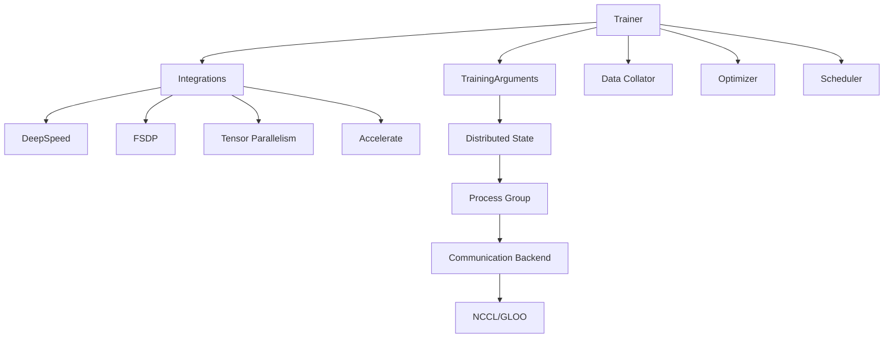

**Diagram sources**
- [trainer.py](file://src/transformers/trainer.py#L0-L5224)
- [training_args.py](file://src/transformers/training_args.py#L1800-L2000)
- [deepspeed.py](file://src/transformers/integrations/deepspeed.py#L0-L199)
- [fsdp.py](file://src/transformers/integrations/fsdp.py#L0-L53)

**Section sources**
- [trainer.py](file://src/transformers/trainer.py#L0-L5224)
- [training_args.py](file://src/transformers/training_args.py#L1800-L2000)

## Trainer API中的分布式训练

Trainer API是transformers库中进行分布式训练的核心接口。通过TrainingArguments类的配置，用户可以轻松地启用和配置各种分布式训练模式。Trainer类自动处理分布式环境的初始化、进程组的创建和通信后端的配置。

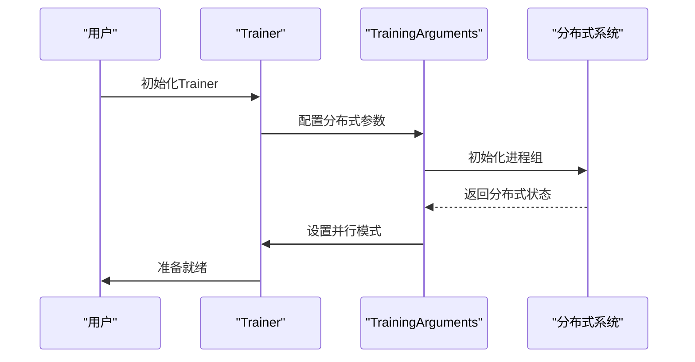

**Diagram sources**
- [trainer.py](file://src/transformers/trainer.py#L3734-L3764)
- [training_args.py](file://src/transformers/training_args.py#L1866-L1889)

**Section sources**
- [trainer.py](file://src/transformers/trainer.py#L3734-L3764)
- [training_args.py](file://src/transformers/training_args.py#L1866-L1889)

## 分布式训练策略

transformers库支持多种分布式训练策略，包括数据并行、模型并行和流水线并行。每种策略都有其适用场景和优缺点，用户可以根据具体的硬件配置和模型规模选择合适的策略。

### 数据并行

数据并行是最常见的分布式训练策略，它将训练数据分割到多个设备上，每个设备持有完整的模型副本。在每个训练步骤中，各个设备计算其数据子集的梯度，然后通过全归约操作（All-Reduce）同步梯度。

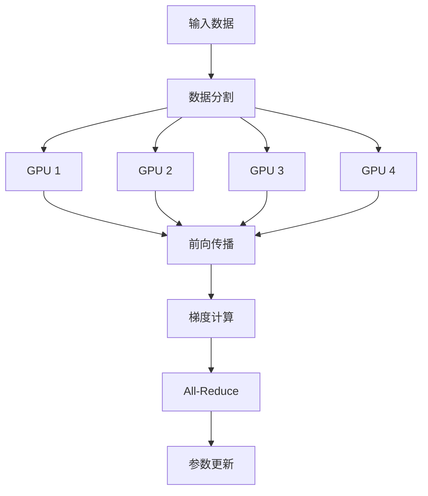

**Diagram sources**
- [trainer.py](file://src/transformers/trainer.py#L3734-L3764)

### 模型并行

模型并行将模型的不同部分分配到不同的设备上，适用于单个设备无法容纳整个模型的场景。这种策略可以进一步分为张量并行和流水线并行。

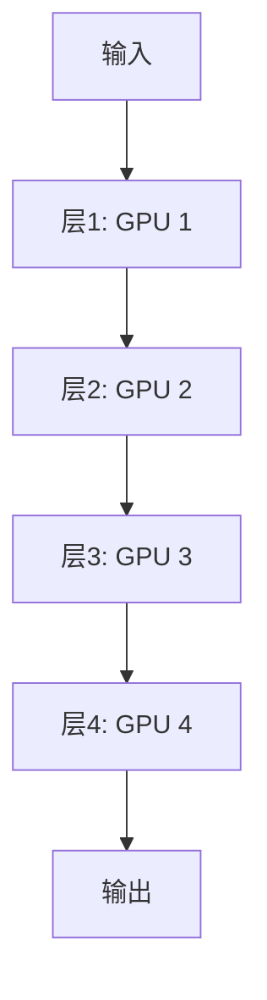

**Diagram sources**
- [tensor_parallel.py](file://src/transformers/integrations/tensor_parallel.py#L765-L783)

### 流水线并行

流水线并行结合了数据并行和模型并行的优点，将模型按层分割到不同的设备上，并在设备间形成流水线。这种方法可以有效提高设备利用率，特别是在大规模模型训练中。

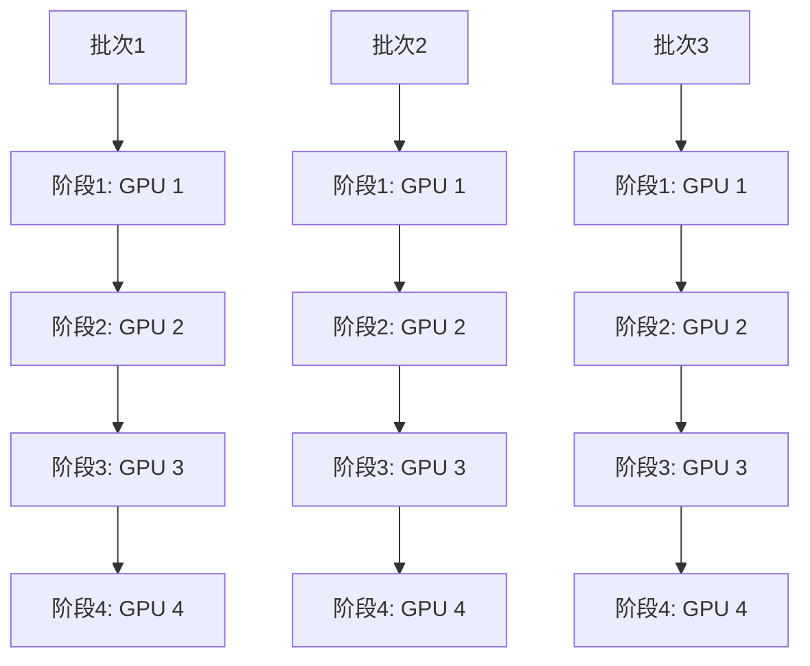

**Diagram sources**
- [3D_parallel.py](file://examples/3D_parallel.py#L0-L23)

**Section sources**
- [3D_parallel.py](file://examples/3D_parallel.py#L0-L23)
- [tensor_parallel.py](file://src/transformers/integrations/tensor_parallel.py#L765-L783)

## 与分布式框架的集成

transformers库与多个分布式训练框架进行了深度集成，包括Accelerate、DeepSpeed和FSDP。这些集成使得用户可以轻松地利用这些框架的高级功能，如零冗余优化器（ZeRO）、混合精度训练和梯度检查点。

### DeepSpeed集成

DeepSpeed集成通过配置文件来控制分布式训练的行为。transformers库支持DeepSpeed的各个优化级别，从ZeRO-2到ZeRO-3，允许用户根据内存和计算资源的限制进行权衡。

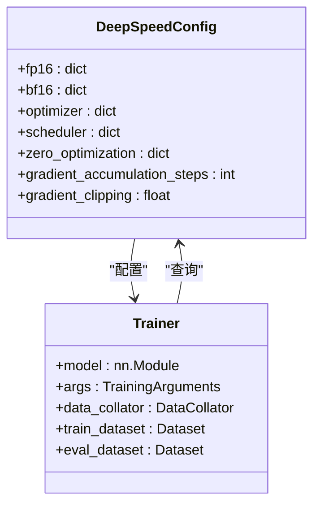

**Diagram sources**
- [deepspeed.py](file://src/transformers/integrations/deepspeed.py#L0-L199)
- [ds_config_zero2.json](file://tests/deepspeed/ds_config_zero2.json)
- [ds_config_zero3.json](file://tests/deepspeed/ds_config_zero3.json)

### FSDP集成

FSDP（Fully Sharded Data Parallel）集成提供了更细粒度的内存优化，通过将模型参数、梯度和优化器状态分片到所有参与的设备上，显著减少了每个设备的内存占用。

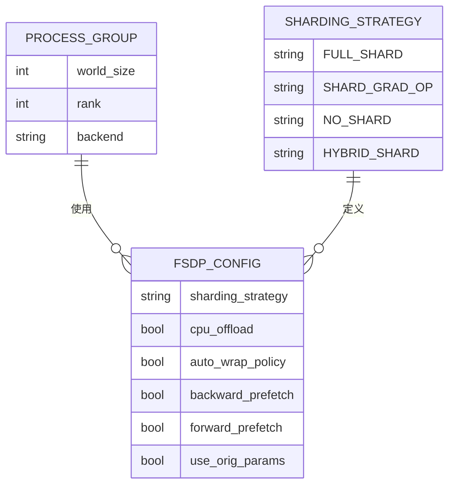

**Diagram sources**
- [fsdp.py](file://src/transformers/integrations/fsdp.py#L0-L53)
- [trainer.py](file://src/transformers/trainer.py#L3184-L3212)

### Accelerate集成

Accelerate集成提供了更高级别的抽象，使得用户可以轻松地在不同的硬件平台和分布式策略之间切换。通过简单的配置更改，用户可以在单GPU、多GPU和多节点设置之间无缝迁移。

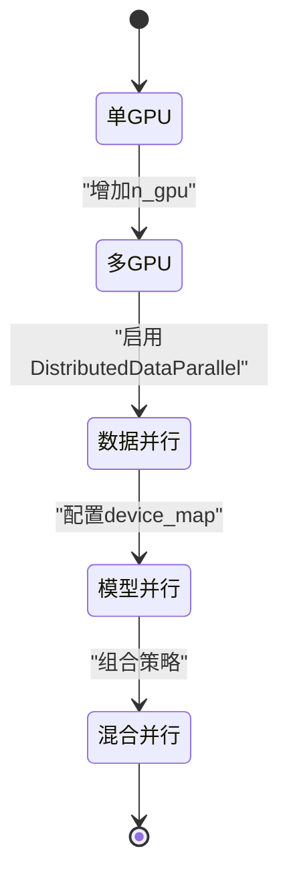

**Diagram sources**
- [accelerate.py](file://src/transformers/integrations/accelerate.py#L0-L199)

**Section sources**
- [deepspeed.py](file://src/transformers/integrations/deepspeed.py#L0-L199)
- [fsdp.py](file://src/transformers/integrations/fsdp.py#L0-L53)
- [accelerate.py](file://src/transformers/integrations/accelerate.py#L0-L199)
- [ds_config_zero2.json](file://tests/deepspeed/ds_config_zero2.json)
- [ds_config_zero3.json](file://tests/deepspeed/ds_config_zero3.json)

## 分布式环境配置

正确配置分布式环境是成功进行分布式训练的前提。transformers库提供了多种方式来设置分布式环境，包括环境变量、命令行参数和配置文件。

### 进程组初始化

分布式训练的第一步是初始化进程组，这通常通过torch.distributed.init_process_group函数完成。transformers库自动处理这一过程，但用户需要正确设置相关的环境变量。

```python
import torch.distributed as dist

def init_process_group(backend, rank, world_size):
    dist.init_process_group(backend, rank=rank, world_size=world_size)
```

**Section sources**
- [distributed_training.py](file://examples/training/distributed_training.py#L0-L46)

### 通信后端配置

PyTorch支持多种通信后端，包括NCCL（用于GPU）、GLOO（用于CPU）和MPI。选择合适的通信后端对于训练性能至关重要。

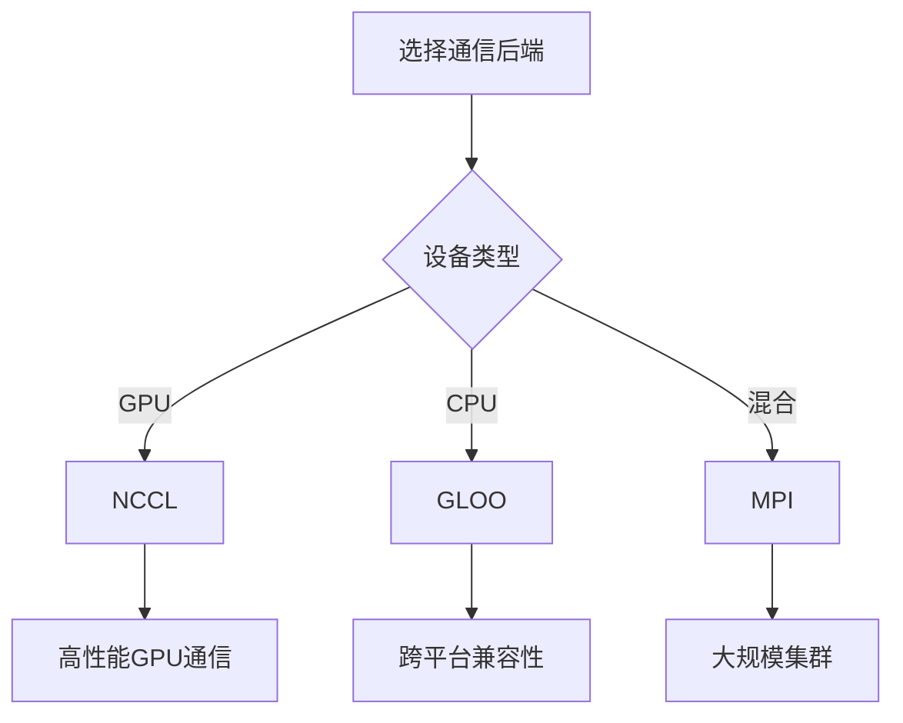

**Section sources**
- [distributed_training.py](file://examples/training/distributed_training.py#L0-L46)

## 梯度同步与模型状态管理

在分布式训练中，梯度同步和模型状态管理是确保训练正确性和效率的关键环节。transformers库通过集成PyTorch的分布式原语，提供了高效的梯度同步机制。

### 梯度同步机制

梯度同步通常通过All-Reduce操作完成，该操作将所有设备上的梯度聚合并平均，然后将结果广播回所有设备。这种机制确保了所有设备上的模型参数保持一致。

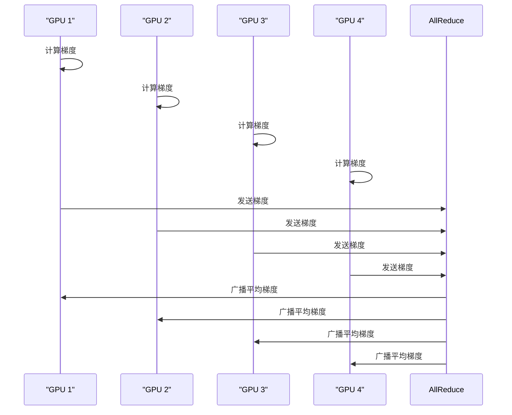

**Section sources**
- [trainer.py](file://src/transformers/trainer.py#L3734-L3764)

### 模型状态管理

在大规模分布式训练中，模型状态（包括参数、梯度和优化器状态）的管理变得尤为重要。FSDP和DeepSpeed等框架通过分片和卸载技术，有效地管理了这些状态，减少了内存占用。

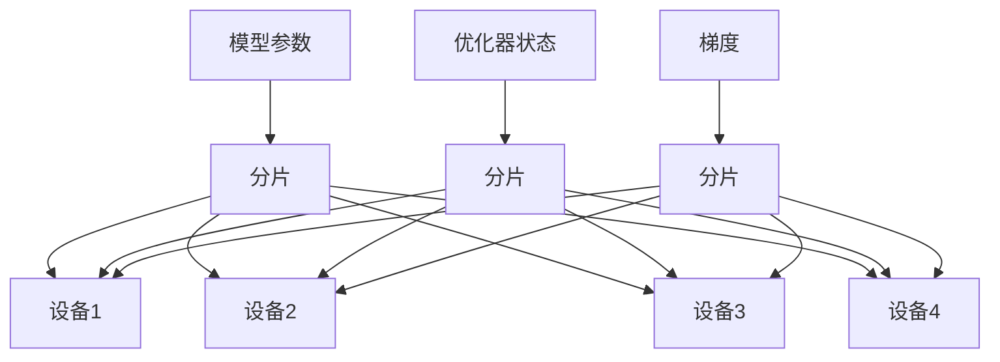

**Section sources**
- [fsdp.py](file://src/transformers/integrations/fsdp.py#L0-L53)
- [deepspeed.py](file://src/transformers/integrations/deepspeed.py#L0-L199)

## 检查点保存机制

在分布式训练中，检查点的保存和加载需要特别注意，以确保所有设备上的状态一致。transformers库提供了多种检查点保存策略，适应不同的分布式训练场景。

### 分片检查点保存

对于大规模模型，单个检查点文件可能过大，难以管理和传输。分片检查点将模型状态分割到多个文件中，提高了可管理性和容错性。

```python
def save_sharded_checkpoint(state_dict, save_directory, max_shard_size):
    # 将state_dict分割为多个分片
    # 每个分片大小不超过max_shard_size
    # 保存每个分片到单独的文件
    pass
```

**Section sources**
- [modeling_utils.py](file://src/transformers/modeling_utils.py#L3785-L3836)

### 全局检查点保存

在某些情况下，可能需要保存完整的模型状态，以便在单设备上恢复训练。全局检查点会将所有分片聚合为一个完整的模型。

```python
def load_full_checkpoint(sharded_checkpoints):
    # 加载所有分片
    # 聚合为完整的state_dict
    # 返回完整的模型状态
    pass
```

**Section sources**
- [modeling_utils.py](file://src/transformers/modeling_utils.py#L3811-L3836)

## 不同规模训练任务的最佳实践

根据训练任务的规模和可用资源，应采用不同的分布式训练策略和配置。以下是针对不同规模训练任务的最佳实践建议。

### 小规模多GPU训练

对于小规模多GPU训练，数据并行通常是最佳选择。通过DistributedDataParallel（DDP），可以简单高效地利用多个GPU进行训练。

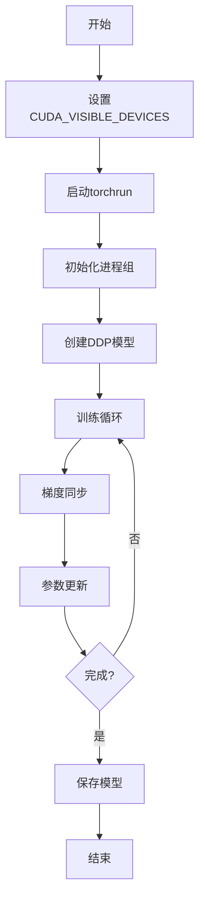

**Section sources**
- [trainer.py](file://src/transformers/trainer.py#L3734-L3764)

### 大规模集群训练

对于大规模集群训练，应结合多种并行策略，如数据并行、模型并行和流水线并行。同时，利用DeepSpeed或FSDP的高级优化功能，如ZeRO-3和梯度检查点，以最大化资源利用率。

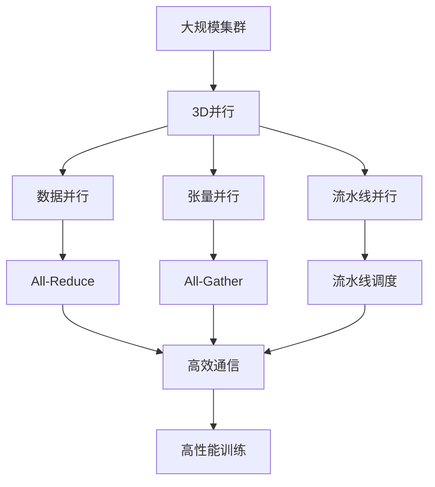

**Section sources**
- [3D_parallel.py](file://examples/3D_parallel.py#L0-L23)
- [tensor_parallel.py](file://src/transformers/integrations/tensor_parallel.py#L1111-L1138)

## 常见问题诊断与解决方案

在分布式训练过程中，可能会遇到各种问题，如通信错误、梯度不一致和性能瓶颈。以下是一些常见问题的诊断方法和解决方案。

### 通信错误

通信错误通常由网络配置不当或进程组初始化失败引起。检查以下方面：

- 确保所有节点可以相互访问
- 验证MASTER_ADDR和MASTER_PORT设置正确
- 检查防火墙设置是否阻止了通信端口

```python
# 检查进程组是否正确初始化
if dist.is_initialized():
    print(f"Rank {dist.get_rank()} of {dist.get_world_size()}")
else:
    print("Process group not initialized")
```

**Section sources**
- [distributed_training.py](file://examples/training/distributed_training.py#L0-L46)

### 梯度不一致

梯度不一致可能导致训练不稳定或收敛困难。确保：

- 所有设备使用相同的随机种子
- 数据加载器的shuffle设置一致
- 模型初始化在所有设备上相同

```python
# 设置随机种子
torch.manual_seed(args.seed)
np.random.seed(args.seed)
random.seed(args.seed)
```

**Section sources**
- [trainer.py](file://src/transformers/trainer.py#L3734-L3764)

### 性能瓶颈

性能瓶颈可能由多种因素引起，包括：

- 通信开销过大
- 数据加载速度不足
- GPU利用率不均衡

使用性能分析工具识别瓶颈，并相应调整配置。

**Section sources**
- [trainer_pt_utils.py](file://src/transformers/trainer_pt_utils.py#L866-L895)

## 性能监控与调试工具

有效的性能监控和调试是优化分布式训练效率的关键。transformers库提供了多种工具来帮助用户监控训练过程和诊断问题。

### 内存使用监控

监控GPU内存使用情况，确保没有内存泄漏或过度使用。

```python
if torch.cuda.is_available():
    print(f"GPU内存使用: {torch.cuda.memory_allocated() / 1024**3:.2f} GB")
    print(f"GPU内存峰值: {torch.cuda.max_memory_allocated() / 1024**3:.2f} GB")
```

**Section sources**
- [integration_utils.py](file://src/transformers/integrations/integration_utils.py#L1008-L1024)

### 训练速度监控

监控训练速度，包括每秒处理的样本数和步骤数。

```python
def speed_metrics(split, start_time, num_samples=None, num_steps=None):
    runtime = time.time() - start_time
    result = {f"{split}_runtime": round(runtime, 4)}
    if num_samples is not None:
        result[f"{split}_samples_per_second"] = round(num_samples / runtime, 3)
    if num_steps is not None:
        result[f"{split}_steps_per_second"] = round(num_steps / runtime, 3)
    return result
```

**Section sources**
- [trainer_utils.py](file://src/transformers/trainer_utils.py#L341-L387)

### 调试工具

使用调试工具来诊断训练中的问题，如梯度爆炸或消失。

```python
# 检查梯度范数
total_norm = 0
for p in model.parameters():
    if p.grad is not None:
        param_norm = p.grad.data.norm(2)
        total_norm += param_norm.item() ** 2
total_norm = total_norm ** (1. / 2)
print(f"梯度范数: {total_norm}")
```

**Section sources**
- [trainer_pt_utils.py](file://src/transformers/trainer_pt_utils.py#L767-L809)

## 结论

transformers库提供了强大而灵活的分布式训练功能，支持多种并行策略和分布式框架。通过合理配置和优化，用户可以在各种规模的硬件上高效地训练大型语言模型。本文档详细介绍了分布式训练的各个方面，从基本概念到高级优化技术，为用户提供了全面的指导。

在实际应用中，建议根据具体的硬件配置和模型规模选择合适的分布式策略。对于小规模训练，数据并行通常足够；而对于大规模模型，应考虑结合多种并行策略和高级优化技术。同时，充分利用性能监控和调试工具，持续优化训练效率。

随着模型规模的不断增长，分布式训练技术将继续发展。transformers库将持续集成最新的研究成果和技术进步，为用户提供最先进的分布式训练解决方案。