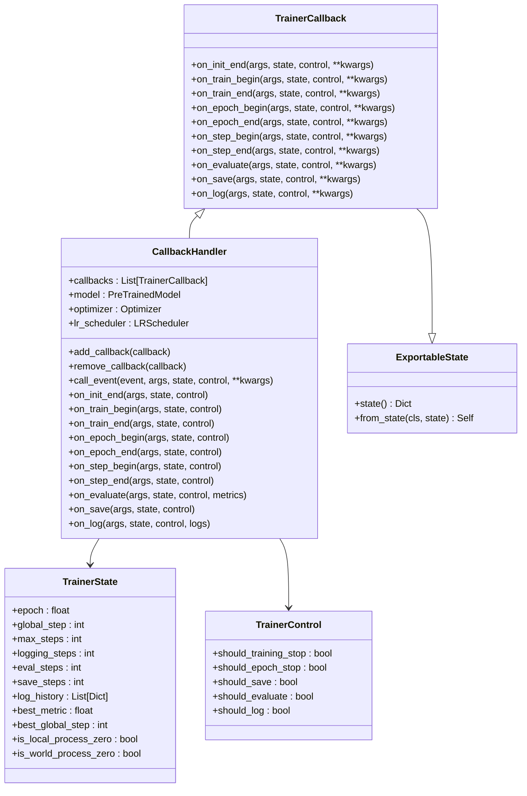
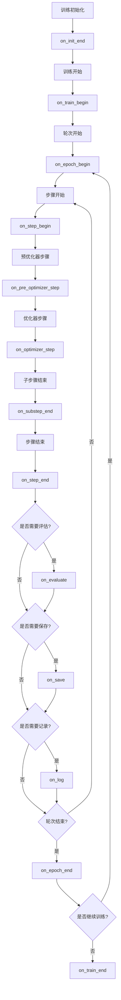
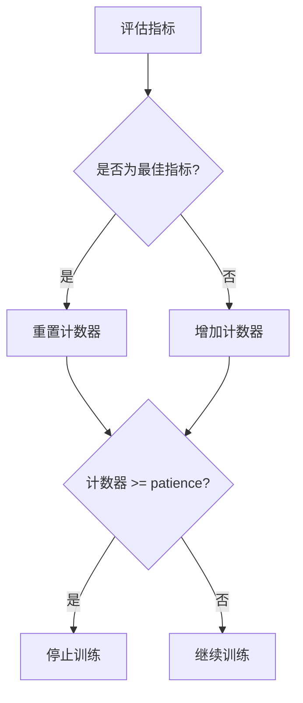

# 回调系统

<cite>
**本文档中引用的文件**
- [trainer_callback.py](file://src/transformers/trainer_callback.py)
- [trainer.py](file://src/transformers/trainer.py)
- [integration_utils.py](file://src/transformers/integrations/integration_utils.py)
- [test_trainer_callback.py](file://tests/trainer/test_trainer_callback.py)
- [optimization.py](file://src/transformers/optimization.py)
</cite>

## 目录
1. [简介](#简介)
2. [回调系统架构](#回调系统架构)
3. [核心组件详解](#核心组件详解)
4. [回调事件生命周期](#回调事件生命周期)
5. [内置回调类型](#内置回调类型)
6. [自定义回调开发](#自定义回调开发)
7. [回调组合与高级用法](#回调组合与高级用法)
8. [性能考虑与最佳实践](#性能考虑与最佳实践)
9. [故障排除指南](#故障排除指南)
10. [总结](#总结)

## 简介

Transformers库的回调系统是一个强大而灵活的机制，允许开发者在训练过程中插入自定义逻辑来监控训练状态、保存检查点、调整超参数和记录指标。回调系统通过事件驱动的方式，在训练的不同阶段触发相应的处理函数，为深度学习训练提供了高度可定制化的解决方案。

回调系统的核心优势包括：
- **非侵入性**：无需修改训练循环代码即可添加功能
- **模块化设计**：每个回调专注于特定功能，便于维护和扩展
- **事件驱动**：支持在训练的各个关键节点执行自定义逻辑
- **状态管理**：提供完整的训练状态跟踪和控制能力

## 回调系统架构

回调系统采用分层架构设计，主要包含以下核心组件：



**图表来源**
- [trainer_callback.py](file://src/transformers/trainer_callback.py#L295-L423)
- [trainer_callback.py](file://src/transformers/trainer_callback.py#L424-L565)

**章节来源**
- [trainer_callback.py](file://src/transformers/trainer_callback.py#L295-L565)

## 核心组件详解

### TrainerCallback基类

`TrainerCallback`是所有回调类的基类，定义了回调系统的核心接口。它提供了在训练不同阶段被调用的事件方法：



**图表来源**
- [trainer_callback.py](file://src/transformers/trainer_callback.py#L295-L423)

### CallbackHandler管理器

`CallbackHandler`负责协调多个回调的执行顺序和状态传递。它维护回调列表并按顺序调用每个回调的相应事件方法。

### TrainerState状态管理

`TrainerState`类封装了训练过程中的所有状态信息，包括当前轮次、全局步数、最佳指标值等。这些状态信息在每个回调事件中都可用。

### TrainerControl控制流

`TrainerControl`类用于控制训练流程的执行，通过设置布尔标志来决定是否停止训练、保存模型、进行评估或记录日志。

**章节来源**
- [trainer_callback.py](file://src/transformers/trainer_callback.py#L35-L294)

## 回调事件生命周期

回调系统在训练过程中触发一系列事件，每个事件都有特定的用途和可用参数：

### 初始化阶段事件

| 事件名称 | 触发时机 | 主要用途 | 可用参数 |
|---------|---------|---------|---------|
| `on_init_end` | Trainer初始化完成时 | 设置初始状态、验证配置 | `args`, `state`, `control` |
| `on_train_begin` | 训练开始前 | 准备训练环境、初始化资源 | `args`, `state`, `control` |

### 训练阶段事件

| 事件名称 | 触发时机 | 主要用途 | 可用参数 |
|---------|---------|---------|---------|
| `on_epoch_begin` | 每个轮次开始时 | 轮次级别的初始化 | `args`, `state`, `control` |
| `on_epoch_end` | 每个轮次结束时 | 轮次级别的清理和评估 | `args`, `state`, `control` |
| `on_step_begin` | 每个训练步骤开始时 | 步骤级别的准备工作 | `args`, `state`, `control` |
| `on_step_end` | 每个训练步骤结束时 | 步骤级别的后处理 | `args`, `state`, `control` |
| `on_pre_optimizer_step` | 优化器步骤前 | 梯度监控、梯度裁剪 | `args`, `state`, `control` |
| `on_optimizer_step` | 优化器步骤后 | 参数更新后的处理 | `args`, `state`, `control` |

### 结束阶段事件

| 事件名称 | 触发时机 | 主要用途 | 可用参数 |
|---------|---------|---------|---------|
| `on_evaluate` | 评估完成后 | 评估结果处理 | `args`, `state`, `control`, `metrics` |
| `on_save` | 模型保存后 | 保存后的后处理 | `args`, `state`, `control` |
| `on_log` | 日志记录后 | 自定义日志处理 | `args`, `state`, `control`, `logs` |
| `on_train_end` | 训练结束后 | 清理工作、最终报告 | `args`, `state`, `control` |

**章节来源**
- [trainer_callback.py](file://src/transformers/trainer_callback.py#L295-L423)

## 内置回调类型

### 默认回调

#### DefaultFlowCallback
负责处理训练的基本流程控制，包括日志记录、评估和检查点保存的策略。

#### ProgressCallback
显示训练进度条，提供可视化的训练进度监控。

#### PrinterCallback
简单地打印日志信息到控制台。

### 监控回调

#### EarlyStoppingCallback
实现早停机制，当指定指标在一定轮次内没有改善时自动停止训练。



**图表来源**
- [trainer_callback.py](file://src/transformers/trainer_callback.py#L680-L767)

### 集成回调

#### TensorBoardCallback
将训练日志发送到TensorBoard进行可视化。

#### WandbCallback
集成Weights & Biases进行实验跟踪和可视化。

#### NeptuneCallback
集成Neptune AI进行机器学习实验管理。

#### MLflowCallback
集成MLflow进行实验跟踪和模型管理。

**章节来源**
- [trainer_callback.py](file://src/transformers/trainer_callback.py#L555-L767)
- [integration_utils.py](file://src/transformers/integrations/integration_utils.py#L570-L769)

## 自定义回调开发

### 基础自定义回调

创建自定义回调类需要继承`TrainerCallback`基类并实现所需的事件方法：

```python
class CustomLoggingCallback(TrainerCallback):
    def __init__(self, log_level='INFO'):
        self.log_level = log_level
        self.custom_metrics = []
    
    def on_log(self, args, state, control, logs=None, **kwargs):
        # 自定义日志处理逻辑
        if logs is not None:
            self.custom_metrics.append(logs.copy())
            # 过滤敏感信息
            logs.pop('total_flos', None)
            print(f"[Custom Log - {self.log_level}] Step {state.global_step}: {logs}")
        
        # 返回control对象（可选）
        return control
```

### 状态保持回调

对于需要在训练过程中保持状态的回调，可以继承`ExportableState`类：

```python
class LearningRateMonitorCallback(TrainerCallback, ExportableState):
    def __init__(self, lr_threshold=1e-5):
        self.lr_threshold = lr_threshold
        self.lr_history = []
        self.stopped_by_lr = False
    
    def on_step_end(self, args, state, control, **kwargs):
        current_lr = self._get_current_lr()
        self.lr_history.append(current_lr)
        
        # 检查是否达到学习率阈值
        if current_lr < self.lr_threshold:
            self.stopped_by_lr = True
            control.should_training_stop = True
        
        return control
    
    def state(self):
        return {
            "args": {
                "lr_threshold": self.lr_threshold,
            },
            "attributes": {
                "lr_history": self.lr_history,
                "stopped_by_lr": self.stopped_by_lr,
            }
        }
```

### 复杂监控回调

```python
class AdvancedMetricsCallback(TrainerCallback):
    def __init__(self, window_size=10):
        self.window_size = window_size
        self.loss_window = deque(maxlen=window_size)
        self.accuracy_window = deque(maxlen=window_size)
        self.patience = 5
        self.no_improvement_count = 0
    
    def on_log(self, args, state, control, logs=None, **kwargs):
        if logs and 'loss' in logs:
            self.loss_window.append(logs['loss'])
            
            # 计算移动平均
            if len(self.loss_window) == self.window_size:
                avg_loss = sum(self.loss_window) / self.window_size
                print(f"Moving average loss: {avg_loss:.4f}")
                
                # 检查是否需要早停
                if len(self.loss_window) >= 2:
                    recent_avg = sum(list(self.loss_window)[-2:]) / 2
                    if avg_loss > recent_avg:
                        self.no_improvement_count += 1
                        if self.no_improvement_count >= self.patience:
                            print("Stopping training due to no improvement")
                            control.should_training_stop = True
                    else:
                        self.no_improvement_count = 0
    
    def on_evaluate(self, args, state, control, metrics, **kwargs):
        if 'eval_accuracy' in metrics:
            self.accuracy_window.append(metrics['eval_accuracy'])
            if len(self.accuracy_window) == self.window_size:
                avg_accuracy = sum(self.accuracy_window) / self.window_size
                print(f"Moving average accuracy: {avg_accuracy:.4f}")
```

**章节来源**
- [trainer_callback.py](file://src/transformers/trainer_callback.py#L170-L294)

## 回调组合与高级用法

### 回调优先级和执行顺序

回调按照添加的顺序依次执行，前面的回调可以影响后面的回调行为：

```python
# 创建多个回调
progress_cb = ProgressCallback()
early_stop_cb = EarlyStoppingCallback(patience=3)
custom_log_cb = CustomLoggingCallback()

# 按优先级顺序添加
trainer.add_callback(progress_cb)           # 最先执行
trainer.add_callback(custom_log_cb)         # 中间执行
trainer.add_callback(early_stop_cb)         # 最后执行

# 执行顺序：progress_cb -> custom_log_cb -> early_stop_cb
```

### 条件执行回调

```python
class ConditionalCallback(TrainerCallback):
    def __init__(self, condition_func):
        self.condition_func = condition_func
    
    def on_step_end(self, args, state, control, **kwargs):
        if self.condition_func(state, args):
            # 执行条件相关的操作
            print(f"Condition met at step {state.global_step}")
        
        return control
```

### 回调链模式

```python
class CallbackChain(TrainerCallback):
    def __init__(self, callbacks):
        self.callbacks = callbacks
    
    def on_train_begin(self, args, state, control, **kwargs):
        for callback in self.callbacks:
            control = callback.on_train_begin(args, state, control, **kwargs)
        return control
    
    def on_step_end(self, args, state, control, **kwargs):
        for callback in self.callbacks:
            control = callback.on_step_end(args, state, control, **kwargs)
        return control
```

### 动态回调管理

```python
class DynamicCallbackManager(TrainerCallback):
    def __init__(self):
        self.active_callbacks = {}
    
    def add_callback(self, name, callback):
        self.active_callbacks[name] = callback
    
    def remove_callback(self, name):
        if name in self.active_callbacks:
            del self.active_callbacks[name]
    
    def on_step_end(self, args, state, control, **kwargs):
        for name, callback in self.active_callbacks.items():
            control = callback.on_step_end(args, state, control, **kwargs)
        return control
```

**章节来源**
- [trainer_callback.py](file://src/transformers/trainer_callback.py#L424-L565)

## 性能考虑与最佳实践

### 回调性能优化

1. **避免阻塞操作**：回调应该快速执行，避免长时间的I/O操作
2. **内存管理**：及时释放不需要的数据，特别是大型数据结构
3. **条件检查**：使用条件语句减少不必要的计算

```python
class OptimizedCallback(TrainerCallback):
    def __init__(self, log_every_n_steps=100):
        self.log_every_n_steps = log_every_n_steps
        self.large_data = None
    
    def on_step_end(self, args, state, control, **kwargs):
        # 使用条件检查减少计算
        if state.global_step % self.log_every_n_steps == 0:
            # 只在需要时创建大型数据结构
            if self.large_data is None:
                self.large_data = self._create_large_data()
            
            # 快速处理
            self._process_data(self.large_data)
        
        # 及时清理
        if self.large_data is not None and state.global_step % 1000 == 0:
            self.large_data = None
        
        return control
```

### 异常处理

```python
class RobustCallback(TrainerCallback):
    def on_step_end(self, args, state, control, **kwargs):
        try:
            # 可能出错的操作
            self._perform_operation()
        except Exception as e:
            logger.error(f"Callback error at step {state.global_step}: {e}")
            # 不要中断训练流程
            pass
        
        return control
```

### 分布式环境下的回调

```python
class DistributedCallback(TrainerCallback):
    def on_log(self, args, state, control, logs=None, **kwargs):
        # 只在主进程中执行
        if state.is_world_process_zero:
            self._log_to_main_process(logs)
        
        return control
    
    def on_save(self, args, state, control, **kwargs):
        # 在分布式环境中确保同步
        if state.is_world_process_zero:
            self._save_model()
        
        # 等待所有进程
        if torch.distributed.is_initialized():
            torch.distributed.barrier()
        
        return control
```

## 故障排除指南

### 常见问题及解决方案

#### 1. 回调未被调用

**问题**：自定义回调没有在预期的时间点被调用。

**解决方案**：
- 确保正确继承`TrainerCallback`基类
- 检查回调是否已添加到`trainer.callbacks`
- 验证事件方法签名是否正确

```python
# 错误示例
class BadCallback:
    def on_step_end(self, state, control):  # 缺少args参数
        pass

# 正确示例
class GoodCallback(TrainerCallback):
    def on_step_end(self, args, state, control, **kwargs):
        pass
```

#### 2. 回调冲突

**问题**：多个回调在同一事件中产生冲突。

**解决方案**：
- 使用`control`对象进行协调
- 实现回调间的通信机制
- 明确回调的职责边界

```python
class CoordinatedCallback(TrainerCallback):
    def __init__(self):
        self.should_skip = False
    
    def on_step_end(self, args, state, control, **kwargs):
        if self.should_skip:
            return control
        
        # 执行回调逻辑
        self._do_work()
        
        # 设置跳过标志
        self.should_skip = True
        
        return control
```

#### 3. 状态丢失

**问题**：训练恢复时回调状态不正确。

**解决方案**：
- 继承`ExportableState`类
- 实现`state()`和`from_state()`方法
- 确保状态序列化安全

```python
class StatefulCallback(TrainerCallback, ExportableState):
    def __init__(self):
        self.internal_state = {}
    
    def state(self):
        return {
            "args": {},  # 如果有参数需要保存
            "attributes": {
                "internal_state": self.internal_state.copy(),
            }
        }
    
    @classmethod
    def from_state(cls, state):
        instance = cls()
        instance.internal_state = state["attributes"]["internal_state"]
        return instance
```

#### 4. 性能问题

**问题**：回调导致训练速度显著下降。

**解决方案**：
- 减少回调中的计算量
- 使用采样策略
- 避免频繁的I/O操作

```python
class PerformanceOptimizedCallback(TrainerCallback):
    def __init__(self):
        self.log_counter = 0
        self.log_interval = 100
    
    def on_step_end(self, args, state, control, **kwargs):
        self.log_counter += 1
        if self.log_counter >= self.log_interval:
            self._expensive_operation()
            self.log_counter = 0
        
        return control
```

**章节来源**
- [test_trainer_callback.py](file://tests/trainer/test_trainer_callback.py#L184-L250)

## 总结

Transformers库的回调系统提供了一个强大而灵活的框架，用于在训练过程中插入自定义逻辑。通过理解回调系统的架构和事件生命周期，开发者可以：

1. **增强训练监控**：实时跟踪训练进度和模型性能
2. **实现自动化策略**：如早停、学习率调度、检查点管理
3. **集成外部工具**：如TensorBoard、Wandb等实验跟踪平台
4. **构建自定义功能**：满足特定的训练需求和业务逻辑

关键要点：
- 回调系统基于事件驱动架构，提供清晰的生命周期管理
- `CallbackHandler`负责回调的协调和状态传递
- 合理的回调设计应考虑性能、可靠性和可维护性
- 状态保持回调通过继承`ExportableState`实现持久化

通过掌握这些概念和技巧，开发者可以充分利用回调系统的力量，构建更加智能和高效的训练流程。