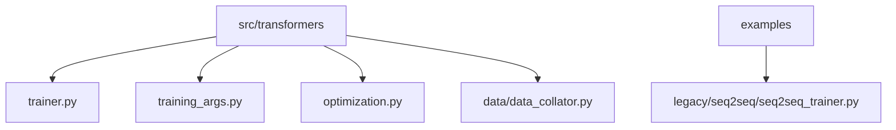
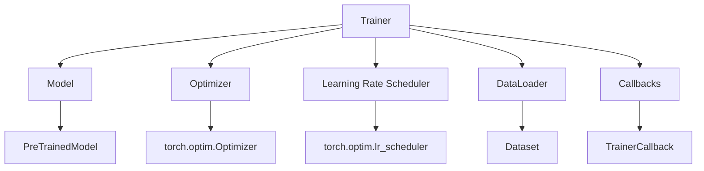
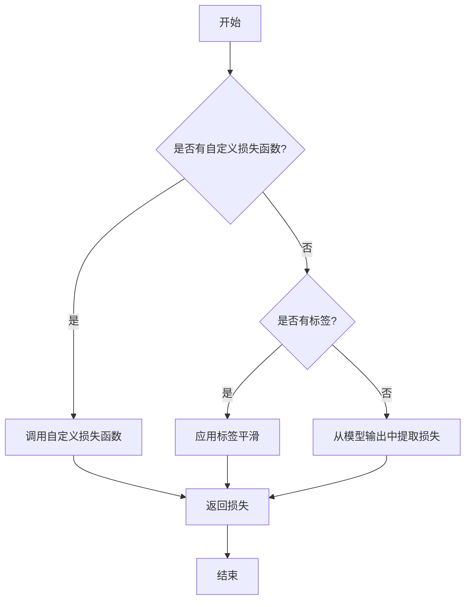
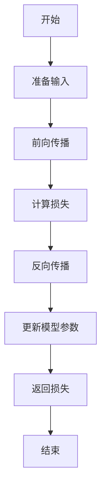
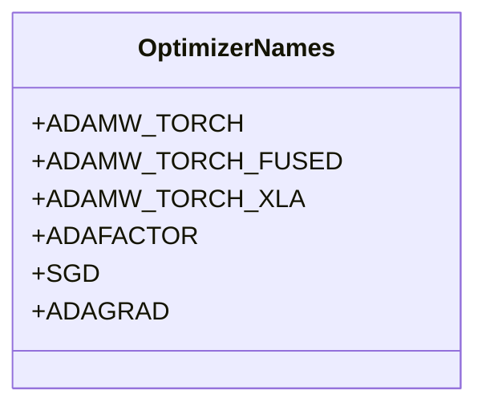
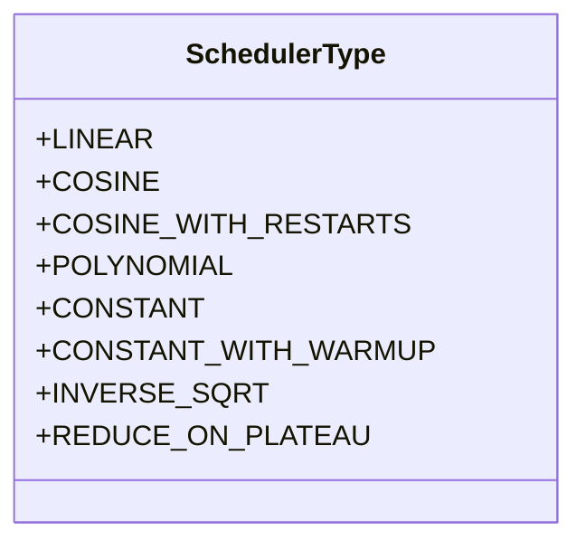
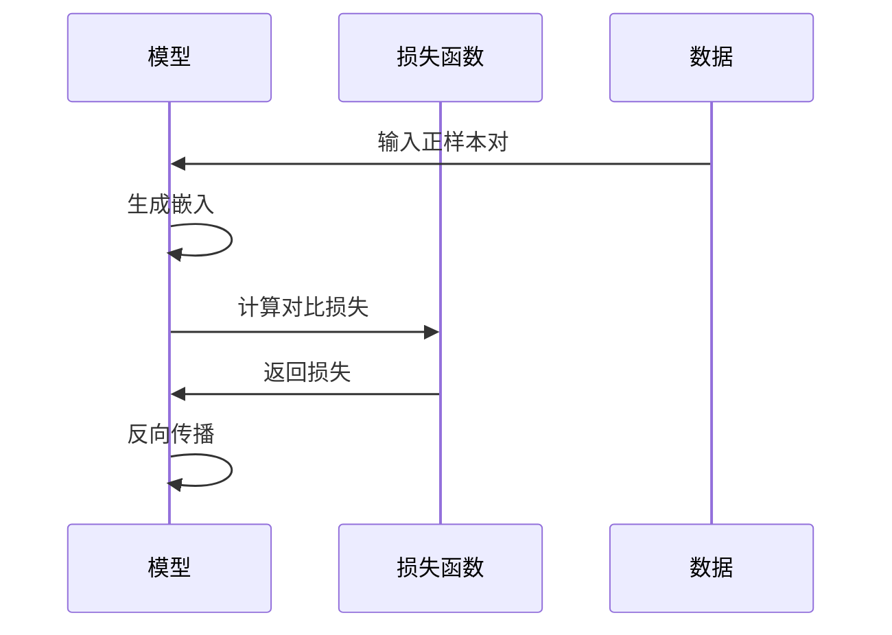
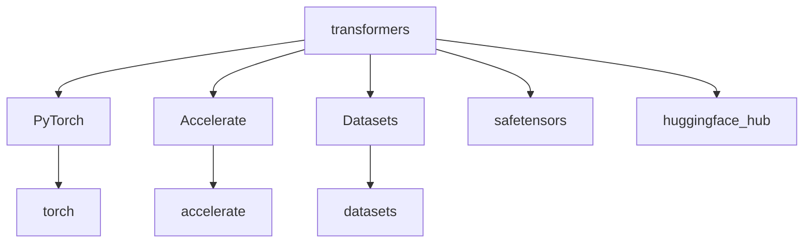

# 自定义训练

<cite>
**本文档引用的文件**   
- [trainer.py](file://src/transformers/trainer.py)
- [training_args.py](file://src/transformers/training_args.py)
- [optimization.py](file://src/transformers/optimization.py)
- [data_collator.py](file://src/transformers/data/data_collator.py)
- [seq2seq_trainer.py](file://examples/legacy/seq2seq/seq2seq_trainer.py)
</cite>

## 目录
1. [简介](#简介)
2. [项目结构](#项目结构)
3. [核心组件](#核心组件)
4. [架构概述](#架构概述)
5. [详细组件分析](#详细组件分析)
6. [依赖分析](#依赖分析)
7. [性能考虑](#性能考虑)
8. [故障排除指南](#故障排除指南)
9. [结论](#结论)

## 简介
本文档旨在为高级用户提供在transformers库中实现自定义训练循环的全面指导。重点介绍如何继承Trainer类并重写关键方法（如compute_loss、training_step和evaluation_step）以实现特定的训练逻辑。文档详细说明了如何集成自定义损失函数、优化器和学习率调度器，并提供多个高级训练技术的实现示例，如对抗训练、知识蒸馏、多任务学习和对比学习。此外，文档还展示了如何处理特殊的数据格式和复杂的模型架构，为需要精细控制训练过程的用户提供指导。

## 项目结构
transformers库的项目结构组织良好，主要组件位于src/transformers目录下。核心训练功能主要集中在trainer.py文件中，而训练参数则在training_args.py中定义。优化器和学习率调度器的实现位于optimization.py文件中，数据整理器则在data/data_collator.py中实现。示例代码位于examples目录下，提供了各种任务的实现示例。

**Diagram sources**
- [trainer.py](file://src/transformers/trainer.py)
- [training_args.py](file://src/transformers/training_args.py)
- [optimization.py](file://src/transformers/optimization.py)
- [data_collator.py](file://src/transformers/data/data_collator.py)
- [seq2seq_trainer.py](file://examples/legacy/seq2seq/seq2seq_trainer.py)

**Section sources**
- [trainer.py](file://src/transformers/trainer.py)
- [training_args.py](file://src/transformers/training_args.py)

## 核心组件
Trainer类是transformers库中训练循环的核心组件。它提供了一个简单但功能完整的训练和评估循环，针对transformers模型进行了优化。通过继承Trainer类并重写其方法，用户可以实现自定义的训练逻辑。TrainingArguments类用于配置训练参数，而各种优化器和学习率调度器则通过optimization.py文件中的函数进行配置。

**Section sources**
- [trainer.py](file://src/transformers/trainer.py#L288-L5222)
- [training_args.py](file://src/transformers/training_args.py#L200-L400)

## 架构概述
transformers库的训练架构基于PyTorch，利用Accelerate库进行分布式训练和混合精度训练。Trainer类作为主要的训练控制器，负责管理训练循环、优化器、学习率调度器和数据加载器。通过回调机制，用户可以在训练过程中的各个阶段插入自定义行为。

**Diagram sources**
- [trainer.py](file://src/transformers/trainer.py#L288-L5222)

## 详细组件分析

### Trainer类分析
Trainer类是实现自定义训练循环的基础。通过继承该类并重写其方法，用户可以实现特定的训练逻辑。

#### compute_loss方法

**Diagram sources**
- [trainer.py](file://src/transformers/trainer.py#L3796-L3873)

#### training_step方法

**Diagram sources**
- [trainer.py](file://src/transformers/trainer.py#L3725-L3794)

### 自定义优化器和学习率调度器
transformers库提供了多种优化器和学习率调度器，用户可以通过TrainingArguments进行配置。

#### 优化器配置

**Diagram sources**
- [training_args.py](file://src/transformers/training_args.py#L100-L200)

#### 学习率调度器

**Diagram sources**
- [optimization.py](file://src/transformers/optimization.py#L578-L601)

**Section sources**
- [trainer.py](file://src/transformers/trainer.py#L3796-L3873)
- [training_args.py](file://src/transformers/training_args.py#L100-L200)
- [optimization.py](file://src/transformers/optimization.py#L578-L601)

### 高级训练技术
transformers库支持多种高级训练技术，如对抗训练、知识蒸馏、多任务学习和对比学习。

#### 对比学习

**Diagram sources**
- [d_fine/modeling_d_fine.py](file://src/transformers/models/d_fine/modeling_d_fine.py#L968-L1002)
- [rt_detr/modeling_rt_detr.py](file://src/transformers/models/rt_detr/modeling_rt_detr.py#L349-L365)

**Section sources**
- [d_fine/modeling_d_fine.py](file://src/transformers/models/d_fine/modeling_d_fine.py#L968-L1002)
- [rt_detr/modeling_rt_detr.py](file://src/transformers/models/rt_detr/modeling_rt_detr.py#L349-L365)

## 依赖分析
transformers库的训练功能依赖于多个外部库，包括PyTorch、Accelerate、Datasets等。这些依赖关系通过setup.py文件进行管理。

**Diagram sources**
- [setup.py](file://setup.py)

**Section sources**
- [setup.py](file://setup.py)

## 性能考虑
在实现自定义训练循环时，需要考虑多个性能因素，包括内存管理、计算效率和分布式训练。

### 内存管理
- 使用混合精度训练减少内存占用
- 合理设置批量大小和梯度累积步数
- 及时清理GPU缓存

### 计算效率
- 使用合适的优化器和学习率调度器
- 利用分布式训练加速训练过程
- 优化数据加载器的配置

## 故障排除指南
在实现自定义训练循环时，可能会遇到各种问题。以下是一些常见问题的解决方案：

### 梯度爆炸或消失
- 使用梯度裁剪
- 调整学习率
- 使用合适的初始化方法

### 内存不足
- 减小批量大小
- 使用梯度累积
- 启用混合精度训练

**Section sources**
- [trainer.py](file://src/transformers/trainer.py#L3725-L3794)
- [trainer.py](file://src/transformers/trainer.py#L3796-L3873)

## 结论
通过继承Trainer类并重写其关键方法，用户可以在transformers库中实现高度自定义的训练循环。文档详细介绍了如何集成自定义损失函数、优化器和学习率调度器，并提供了多种高级训练技术的实现示例。通过合理配置训练参数和优化性能，用户可以在复杂训练场景下保持高效。