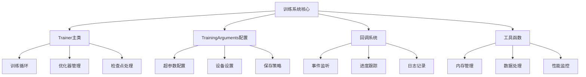
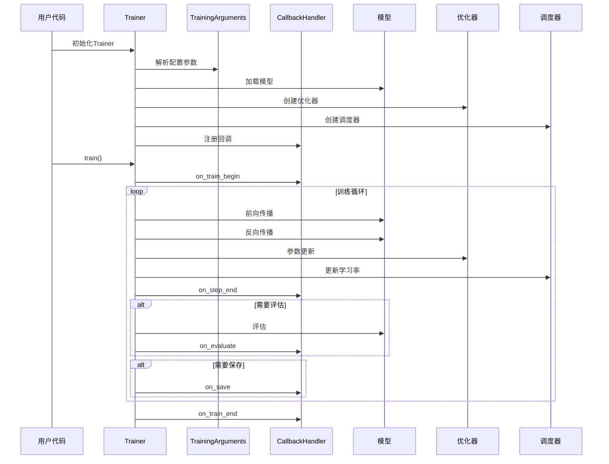
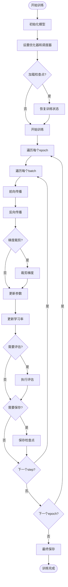
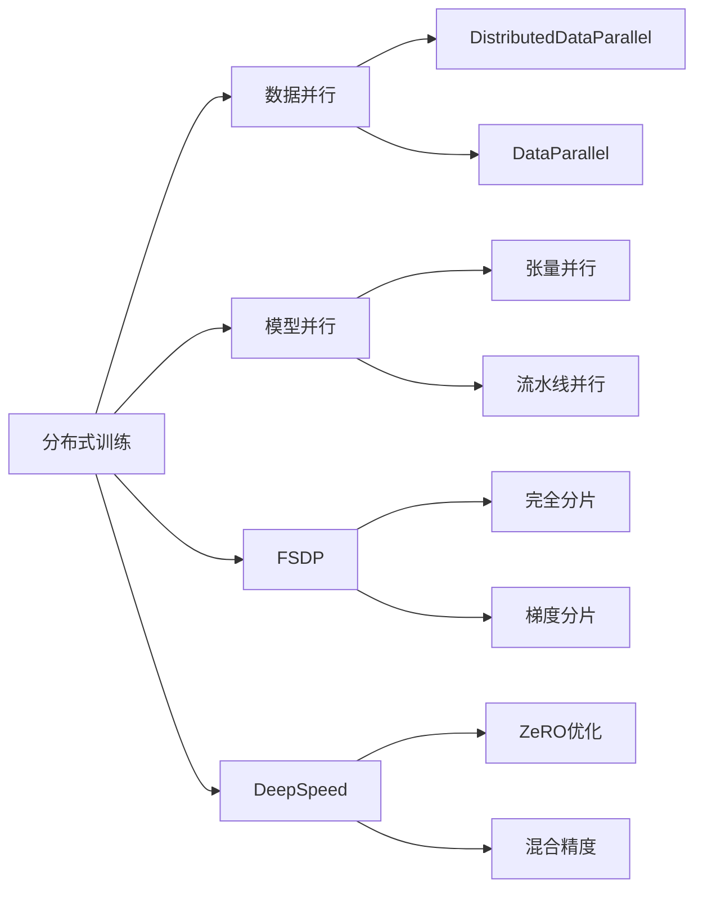
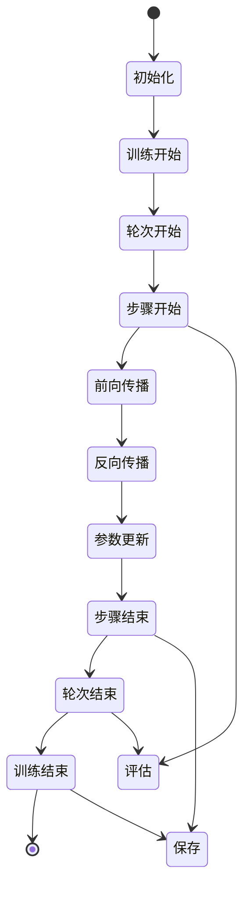
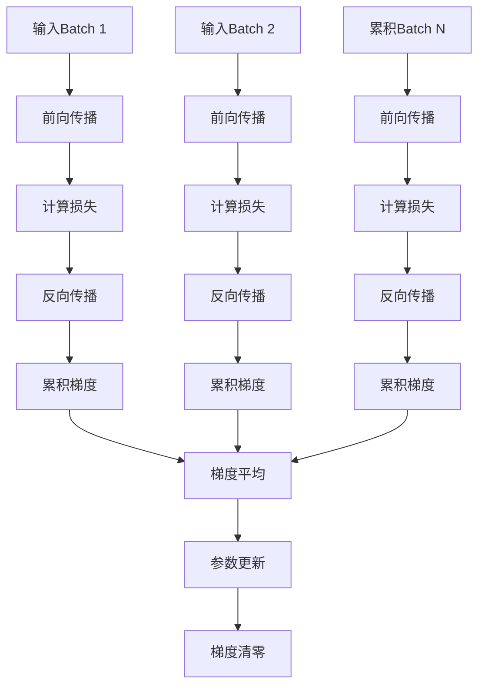
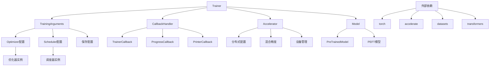

# 训练系统

<cite>
**本文档引用的文件**
- [trainer.py](file://src/transformers/trainer.py)
- [training_args.py](file://src/transformers/training_args.py)
- [trainer_callback.py](file://src/transformers/trainer_callback.py)
- [trainer_utils.py](file://src/transformers/trainer_utils.py)
- [optimization.py](file://src/transformers/optimization.py)
- [run_glue.py](file://examples/pytorch/text-classification/run_glue.py)
- [test_fsdp.py](file://tests/fsdp/test_fsdp.py)
</cite>

## 目录
1. [简介](#简介)
2. [项目结构](#项目结构)
3. [核心组件](#核心组件)
4. [架构概览](#架构概览)
5. [详细组件分析](#详细组件分析)
6. [依赖关系分析](#依赖关系分析)
7. [性能考虑](#性能考虑)
8. [故障排除指南](#故障排除指南)
9. [结论](#结论)

## 简介

Transformers库中的训练系统是一个功能强大且高度可配置的训练框架，基于PyTorch构建，专门为Transformer模型的微调和训练而设计。该系统的核心是`Trainer`类，它提供了完整的训练循环管理、优化器配置、学习率调度、回调机制和分布式训练支持。

训练系统的主要特点包括：
- 完整的训练生命周期管理
- 多种优化器和学习率调度器支持
- 分布式训练和混合精度训练
- 灵活的回调机制
- 自动检查点管理和恢复
- 高级训练功能如梯度累积和梯度检查点

## 项目结构

训练系统的核心文件组织如下：



**图表来源**
- [trainer.py](file://src/transformers/trainer.py#L1-L100)
- [training_args.py](file://src/transformers/training_args.py#L1-L50)
- [trainer_callback.py](file://src/transformers/trainer_callback.py#L1-L50)

**章节来源**
- [trainer.py](file://src/transformers/trainer.py#L1-L200)
- [training_args.py](file://src/transformers/training_args.py#L1-L100)

## 核心组件

### Trainer类 - 主训练引擎

`Trainer`类是整个训练系统的核心，负责协调所有训练相关的操作。它继承了PyTorch的灵活性，同时提供了高级的抽象层来简化训练流程。

主要职责包括：
- 模型训练和评估的完整生命周期管理
- 数据加载器的自动配置和管理
- 优化器和学习率调度器的初始化
- 检查点的自动保存和恢复
- 分布式训练的支持
- 回调机制的执行

### TrainingArguments - 配置中心

`TrainingArguments`类提供了训练过程的所有配置选项，采用数据类设计，便于序列化和传递。

关键配置类别：
- **基础训练参数**：学习率、批次大小、训练轮数等
- **优化器配置**：优化器类型、权重衰减、动量参数等
- **学习率调度**：调度器类型、预热步数、衰减参数等
- **保存和日志**：保存策略、日志频率、评估策略等
- **分布式训练**：多GPU配置、深度优先分片数据并行(FSDP)、DeepSpeed集成等

### 回调系统 - 事件驱动架构

回调系统采用事件驱动架构，允许在训练过程的关键节点插入自定义逻辑。

核心回调类型：
- **默认流程回调**：处理标准的日志、评估和保存事件
- **进度跟踪回调**：显示训练进度条和指标
- **早期停止回调**：根据验证指标自动停止训练
- **自定义回调**：用户定义的训练逻辑

**章节来源**
- [trainer.py](file://src/transformers/trainer.py#L200-L400)
- [training_args.py](file://src/transformers/training_args.py#L200-L400)
- [trainer_callback.py](file://src/transformers/trainer_callback.py#L200-L400)

## 架构概览

训练系统采用模块化架构，各组件通过清晰的接口进行交互：



**图表来源**
- [trainer.py](file://src/transformers/trainer.py#L2000-L2200)
- [trainer_callback.py](file://src/transformers/trainer_callback.py#L600-L700)

## 详细组件分析

### 训练循环核心

训练循环是`Trainer`类的核心功能，负责执行完整的训练流程：



**图表来源**
- [trainer.py](file://src/transformers/trainer.py#L2200-L2400)

### 优化器和调度器系统

训练系统支持多种优化器和学习率调度器：

#### 支持的优化器类型

| 优化器名称 | 描述 | 适用场景 |
|------------|------|----------|
| `adamw_torch` | 标准AdamW优化器 | 通用训练任务 |
| `adamw_torch_fused` | 熔合版本AdamW | 性能优化 |
| `adafactor` | Adafactor优化器 | 内存效率高 |
| `adamw_bnb_8bit` | BitsAndBytes 8位优化器 | 内存受限环境 |
| `galore_adamw` | GaLore低秩优化器 | 大模型训练 |
| `apollo_adamw` | APOLLO优化器 | 高效大模型训练 |

#### 学习率调度器类型

| 调度器类型 | 数学公式 | 特点 |
|------------|----------|------|
| `linear` | `lr = initial_lr * (1 - step/max_steps)` | 线性衰减 |
| `cosine` | `lr = initial_lr * 0.5 * (1 + cos(π * step/max_steps))` | 余弦衰减 |
| `constant` | `lr = initial_lr` | 恒定学习率 |
| `constant_with_warmup` | 预热后恒定 | 先增后恒 |
| `cosine_with_restarts` | 余弦重启 | 多次重启 |

**章节来源**
- [trainer.py](file://src/transformers/trainer.py#L1600-L1800)
- [optimization.py](file://src/transformers/optimization.py#L1-L200)

### 分布式训练支持

训练系统提供了完整的分布式训练支持：

#### 多种分布式策略



**图表来源**
- [trainer.py](file://src/transformers/trainer.py#L1800-L2000)

#### FSDP配置选项

| 配置项 | 描述 | 默认值 |
|--------|------|--------|
| `full_shard` | 完全分片参数、梯度和优化器状态 | 否 |
| `shard_grad_op` | 仅分片梯度和优化器状态 | 否 |
| `hybrid_shard` | 节点内完全分片，跨节点复制 | 否 |
| `offload` | 将参数和梯度卸载到CPU | 否 |
| `activation_checkpointing` | 激活检查点 | 否 |

**章节来源**
- [trainer.py](file://src/transformers/trainer.py#L500-L600)
- [test_fsdp.py](file://tests/fsdp/test_fsdp.py#L1-L100)

### 回调机制详解

回调系统提供了灵活的事件处理机制：

#### 回调事件类型



**图表来源**
- [trainer_callback.py](file://src/transformers/trainer_callback.py#L400-L600)

#### 自定义回调示例

```python
class CustomCallback(TrainerCallback):
    def on_step_end(self, args, state, control, **kwargs):
        # 在每个步骤结束时执行自定义逻辑
        if state.global_step % 100 == 0:
            print(f"Step {state.global_step} completed")
    
    def on_evaluate(self, args, state, control, metrics, **kwargs):
        # 在评估完成后执行自定义逻辑
        print(f"Evaluation metrics: {metrics}")
```

**章节来源**
- [trainer_callback.py](file://src/transformers/trainer_callback.py#L300-L500)

### 混合精度训练

训练系统支持多种精度训练模式：

#### 支持的精度类型

| 精度类型 | 内存节省 | 计算速度 | 精度损失 |
|----------|----------|----------|----------|
| `fp32` | 无 | 基准 | 无 |
| `fp16` | ~50% | +15-30% | 可控 |
| `bf16` | ~50% | +15-30% | 最小 |
| `fp8` | ~75% | +30-50% | 较大 |

#### 自动混合精度配置

```python
# FP16配置
training_args = TrainingArguments(
    fp16=True,
    fp16_opt_level="O1",  # O0, O1, O2, O3
    fp16_backend="auto",   # auto, apex, native
)

# BF16配置
training_args = TrainingArguments(
    bf16=True,
    bf16_full_eval=True,   # 评估时使用BF16
)
```

**章节来源**
- [trainer.py](file://src/transformers/trainer.py#L1000-L1200)

### 梯度累积和检查点

#### 梯度累积机制



**图表来源**
- [trainer.py](file://src/transformers/trainer.py#L2400-L2600)

#### 梯度检查点配置

```python
training_args = TrainingArguments(
    gradient_checkpointing=True,
    gradient_checkpointing_kwargs={
        "use_reentrant": False,
        "preserve_rng_state": True,
    }
)
```

**章节来源**
- [trainer.py](file://src/transformers/trainer.py#L1400-L1600)

## 依赖关系分析

训练系统的依赖关系复杂但结构清晰：



**图表来源**
- [trainer.py](file://src/transformers/trainer.py#L1-L100)
- [training_args.py](file://src/transformers/training_args.py#L1-L50)

### 关键依赖说明

| 依赖包 | 版本要求 | 用途 |
|--------|----------|------|
| `torch` | >= 1.8.0 | 核心深度学习框架 |
| `accelerate` | >= 0.12.0 | 分布式训练和混合精度 |
| `datasets` | >= 1.8.0 | 数据集处理 |
| `evaluate` | - | 评估指标计算 |

**章节来源**
- [trainer.py](file://src/transformers/trainer.py#L50-L150)
- [training_args.py](file://src/transformers/training_args.py#L50-L150)

## 性能考虑

### 内存优化策略

1. **梯度检查点**：减少激活内存占用
2. **混合精度训练**：降低显存需求
3. **FSDP分片**：分布式参数存储
4. **动态批处理大小**：自动调整批大小以适应内存

### 计算优化技巧

1. **熔合操作**：优化算子组合
2. **异步I/O**：数据加载与计算重叠
3. **编译优化**：PyTorch 2.0编译支持
4. **缓存策略**：结果缓存和复用

### 网络优化

1. **梯度压缩**：减少通信开销
2. **分层通信**：优化通信拓扑
3. **带宽感知**：自适应批大小调整

## 故障排除指南

### 常见训练问题及解决方案

#### 过拟合问题

**症状**：训练损失持续下降，但验证损失上升

**解决方案**：
```python
training_args = TrainingArguments(
    # 增加正则化
    weight_decay=0.01,
    # 使用dropout
    dropout=0.1,
    # 提前停止
    load_best_model_at_end=True,
    metric_for_best_model="eval_loss",
    # 减少训练轮数
    num_train_epochs=10,
)
```

#### 梯度爆炸问题

**症状**：训练过程中出现NaN或Inf损失值

**解决方案**：
```python
training_args = TrainingArguments(
    # 设置梯度裁剪
    max_grad_norm=1.0,
    # 使用更小的学习率
    learning_rate=1e-5,
    # 启用梯度检查
    logging_nan_inf_filter=True,
)
```

#### 收敛缓慢问题

**症状**：训练损失下降非常缓慢

**解决方案**：
```python
training_args = TrainingArguments(
    # 增加学习率
    learning_rate=5e-4,
    # 使用预热
    warmup_steps=1000,
    # 更积极的调度器
    lr_scheduler_type="cosine",
    # 增加批大小
    per_device_train_batch_size=32,
)
```

#### 内存不足问题

**症状**：CUDA out of memory错误

**解决方案**：
```python
training_args = TrainingArguments(
    # 减少批大小
    per_device_train_batch_size=4,
    # 启用梯度累积
    gradient_accumulation_steps=8,
    # 使用混合精度
    fp16=True,
    # 启用梯度检查点
    gradient_checkpointing=True,
    # 使用FSDP
    fsdp="full_shard auto_wrap",
)
```

### 调试工具和技巧

#### 启用调试模式

```python
training_args = TrainingArguments(
    debug=["underflow_overflow", "tpu_metrics_debug"],
    logging_steps=1,  # 频繁日志
    save_steps=100,   # 频繁保存
)
```

#### 性能分析

```python
# 启用内存跟踪
training_args = TrainingArguments(
    skip_memory_metrics=False,
    # 记录详细指标
    report_to=["tensorboard", "wandb"],
)
```

**章节来源**
- [trainer_utils.py](file://src/transformers/trainer_utils.py#L600-L800)
- [trainer.py](file://src/transformers/trainer.py#L2800-L3000)

## 结论

Transformers库的训练系统是一个功能完备、高度可配置的训练框架，为研究人员和开发者提供了强大的工具来训练各种规模的Transformer模型。其模块化设计使得用户可以根据具体需求选择合适的组件，而丰富的配置选项确保了系统能够适应不同的硬件环境和训练场景。

系统的主要优势包括：

1. **完整性**：涵盖了从数据准备到模型部署的完整训练流程
2. **灵活性**：支持多种优化器、调度器和分布式策略
3. **可扩展性**：通过回调机制支持自定义训练逻辑
4. **易用性**：简洁的API设计降低了使用门槛
5. **高性能**：内置多种优化技术提升训练效率

对于初学者，建议从简单的文本分类任务开始，逐步掌握基本配置；对于有经验的开发者，可以深入研究分布式训练、混合精度和自定义优化策略等高级功能。随着模型规模的不断增长，训练系统也在持续演进，为更大规模的模型训练提供支持。