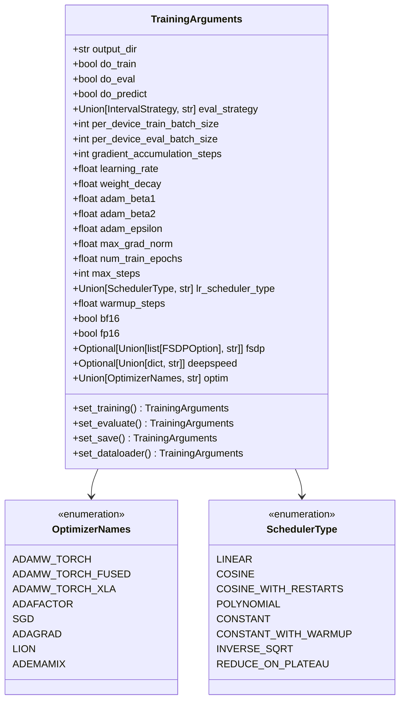
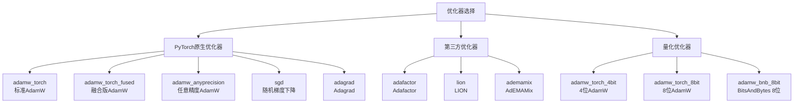
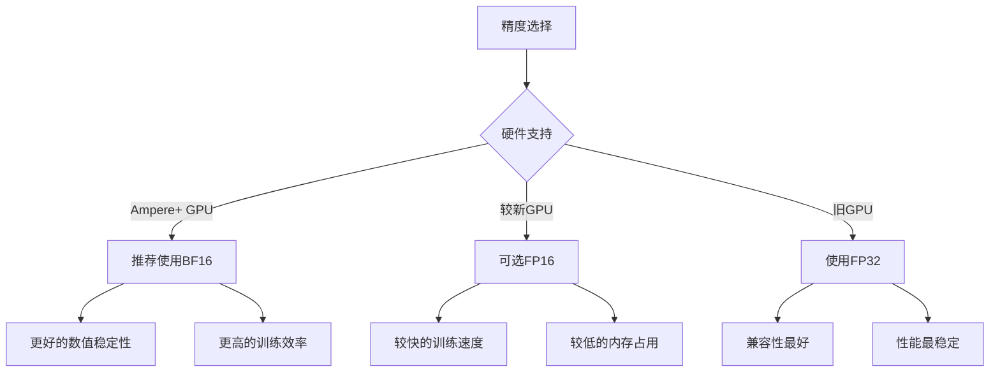
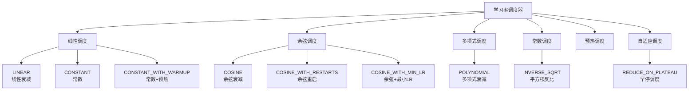
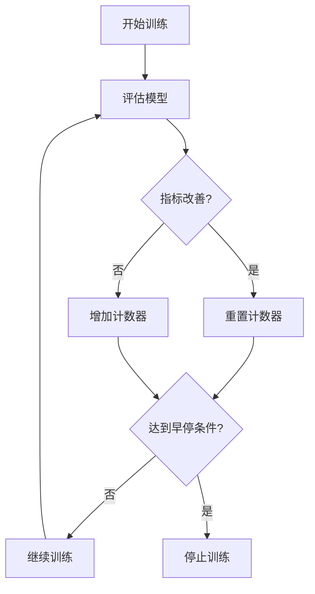
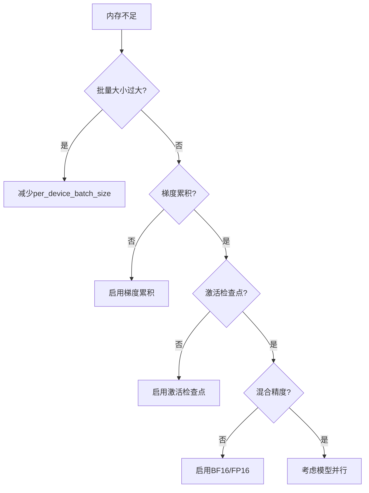

# 训练配置

<cite>
**本文档中引用的文件**
- [training_args.py](file://src/transformers/training_args.py)
- [trainer.py](file://src/transformers/trainer.py)
- [optimization.py](file://src/transformers/optimization.py)
- [trainer_callback.py](file://src/transformers/trainer_callback.py)
- [distributed_training.py](file://examples/training/distributed_training.py)
- [test_trainer.py](file://tests/trainer/test_trainer.py)
</cite>

## 目录
1. [简介](#简介)
2. [TrainingArguments类概述](#trainingarguments类概述)
3. [训练参数配置](#训练参数配置)
4. [优化器参数配置](#优化器参数配置)
5. [分布式训练配置](#分布式训练配置)
6. [混合精度训练配置](#混合精度训练配置)
7. [学习率调度配置](#学习率调度配置)
8. [早停机制配置](#早停机制配置)
9. [完整配置示例](#完整配置示例)
10. [常见问题诊断](#常见问题诊断)
11. [最佳实践建议](#最佳实践建议)

## 简介

TrainingArguments是Hugging Face Transformers库中用于配置训练过程的核心类。它提供了超过100个参数，涵盖了从基础训练设置到高级分布式训练的各种需求。本文档将详细介绍每个配置参数的作用、使用方法以及最佳实践。

## TrainingArguments类概述

TrainingArguments类是一个数据类，继承自Python的`dataclass`，提供了结构化的参数管理方式。该类支持命令行参数解析、JSON配置文件读取等多种配置方式。



**图表来源**
- [training_args.py](file://src/transformers/training_args.py#L200-L400)

**章节来源**
- [training_args.py](file://src/transformers/training_args.py#L200-L400)

## 训练参数配置

### 基础训练参数

#### 输出目录配置
- `output_dir`: 模型检查点和预测结果的输出目录，默认为"trainer_output"
- `do_train`: 是否执行训练，默认为False
- `do_eval`: 是否在验证集上进行评估，默认为False
- `do_predict`: 是否对测试集进行预测，默认为False

#### 批量大小配置
- `per_device_train_batch_size`: 每个设备的训练批量大小，默认为8
- `per_device_eval_batch_size`: 每个设备的评估批量大小，默认为8
- `gradient_accumulation_steps`: 梯度累积步数，默认为1

**重要概念：有效批量大小计算**
```
有效批量大小 = per_device_train_batch_size × 设备数量 × gradient_accumulation_steps
```

#### 训练轮次配置
- `num_train_epochs`: 总训练轮次，默认为3.0
- `max_steps`: 最大训练步数，如果大于0则覆盖`num_train_epochs`，默认为-1

### 数据加载器配置

#### 数据处理参数
- `dataloader_drop_last`: 是否丢弃最后一个不完整的批次，默认为False
- `dataloader_num_workers`: 数据加载的工作进程数，默认为0
- `dataloader_pin_memory`: 是否固定内存，默认为True
- `dataloader_persistent_workers`: 是否保持工作进程持久化，默认为False
- `dataloader_prefetch_factor`: 每个工作进程预取的批次数量，默认为None

#### 数据采样配置
- `auto_find_batch_size`: 是否自动查找适合内存的批量大小，默认为False
- `ignore_data_skip`: 恢复训练时是否跳过数据，默认为False
- `data_seed`: 数据采样的随机种子，默认为None

**章节来源**
- [training_args.py](file://src/transformers/training_args.py#L400-L600)

## 优化器参数配置

### AdamW优化器参数

#### 核心参数
- `learning_rate`: 初始学习率，默认为5e-5
- `weight_decay`: 权重衰减系数，默认为0.0
- `adam_beta1`: AdamW优化器的beta1参数，默认为0.9
- `adam_beta2`: AdamW优化器的beta2参数，默认为0.999
- `adam_epsilon`: AdamW优化器的epsilon参数，默认为1e-8

#### 梯度控制参数
- `max_grad_norm`: 最大梯度范数，用于梯度裁剪，默认为1.0

### 优化器选择

TrainingArguments支持多种优化器：



**图表来源**
- [training_args.py](file://src/transformers/training_args.py#L140-L200)

### 优化器特定配置

#### Adafactor优化器参数
- `scale_parameter`: 是否缩放参数，默认为True
- `relative_step`: 是否使用相对步长，默认为True
- `warmup_init`: 是否使用预热初始化，默认为False

#### Lion优化器参数
- `betas`: 动量参数，默认为(0.9, 0.999)

**章节来源**
- [training_args.py](file://src/transformers/training_args.py#L600-L800)

## 分布式训练配置

### 数据并行训练

#### DistributedDataParallel (DDP) 配置
- `ddp_backend`: DDP后端类型，可选值："nccl", "gloo", "mpi", "ccl", "hccl", "cncl", "mccl"
- `ddp_find_unused_parameters`: 是否查找未使用的参数，默认为None
- `ddp_bucket_cap_mb`: DDP桶容量（MB），默认为None
- `ddp_broadcast_buffers`: 是否广播缓冲区，默认为None
- `ddp_timeout`: 分布式超时时间（秒），默认为1800

#### 多GPU训练配置
- `local_rank`: 本地进程排名，通常由启动脚本设置
- `world_size`: 总进程数量
- `rank`: 全局进程排名

### 模型并行训练

#### Fully Sharded Data Parallel (FSDP)
FSDP是一种模型并行技术，支持将大型模型分片存储在多个GPU上。

##### FSDP选项
- `fsdp`: 可选值：
  - `"full_shard"`: 完全分片参数、梯度和优化器状态
  - `"shard_grad_op"`: 分片优化器状态和梯度
  - `"hybrid_shard"`: 节点内完全分片，节点间复制参数
  - `"hybrid_shard_zero2"`: 节点内分片梯度，节点间复制参数
  - `"offload"`: 将参数和梯度卸载到CPU
  - `"auto_wrap"`: 自动递归包装层

##### FSDP配置参数
- `fsdp_config`: FSDP配置字典或JSON文件路径
- `fsdp_version`: FSDP版本，默认为1
- `min_num_params`: 默认自动包装的最小参数数量
- `transformer_layer_cls_to_wrap`: 要包装的Transformer层类名列表
- `backward_prefetch`: 后向预取模式
- `forward_prefetch`: 前向预取模式
- `limit_all_gathers`: 限制所有收集操作
- `use_orig_params`: 使用原始参数
- `sync_module_states`: 同步模块状态
- `cpu_ram_efficient_loading`: CPU内存高效加载
- `activation_checkpointing`: 激活检查点

### DeepSpeed集成

#### DeepSpeed配置
- `deepspeed`: DeepSpeed配置字典或JSON文件路径
- 支持ZeRO优化器状态分片、梯度分片和参数分片

#### DeepSpeed配置示例
```json
{
  "train_batch_size": 32,
  "gradient_accumulation_steps": 1,
  "fp16": {
    "enabled": true,
    "loss_scale": 0,
    "loss_scale_window": 1000,
    "hysteresis": 2,
    "min_loss_scale": 1
  },
  "zero_optimization": {
    "stage": 2,
    "allgather_partitions": true,
    "allgather_bucket_size": 2e8,
    "overlap_comm": true,
    "reduce_scatter": true,
    "reduce_bucket_size": 2e8,
    "contiguous_gradients": true
  }
}
```

**章节来源**
- [training_args.py](file://src/transformers/training_args.py#L800-L1200)

## 混合精度训练配置

### 精度类型选择

#### BF16混合精度
- `bf16`: 是否使用BF16混合精度，默认为False
- `bf16_full_eval`: 是否使用全BF16评估，默认为False

**BF16优势**：
- 更好的数值稳定性
- 更高的训练速度
- 更低的内存占用
- 需要Ampere架构或更高版本的NVIDIA GPU

#### FP16混合精度
- `fp16`: 是否使用FP16混合精度，默认为False
- `fp16_full_eval`: 是否使用全FP16评估，默认为False

**FP16特点**：
- 较低的数值稳定性
- 更快的训练速度
- 更少的内存占用
- 需要较新的GPU架构

### TF32支持

- `tf32`: 是否启用TF32模式，默认为None
- 仅在Ampere架构及更新的GPU上可用

### 精度配置注意事项



**图表来源**
- [training_args.py](file://src/transformers/training_args.py#L949-L1027)

**章节来源**
- [training_args.py](file://src/transformers/training_args.py#L949-L1027)

## 学习率调度配置

### 调度器类型

TrainingArguments支持多种学习率调度策略：



**图表来源**
- [optimization.py](file://src/transformers/optimization.py#L578-L601)

### 调度器参数配置

#### 基础参数
- `lr_scheduler_type`: 学习率调度器类型，默认为"linear"
- `lr_scheduler_kwargs`: 调度器特定参数字典

#### 预热配置
- `warmup_steps`: 预热步数，默认为0
- `warmup_ratio`: 预热比例（替代warmup_steps）

#### 调度器特定参数

##### 余弦调度器
```python
lr_scheduler_kwargs = {
    "num_cycles": 0.5,  # 循环次数
    "min_lr": 1e-6      # 最小学习率
}
```

##### 多项式调度器
```python
lr_scheduler_kwargs = {
    "power": 1.0,       # 多项式幂次
    "min_lr": 0.0       # 最小学习率
}
```

##### 早停调度器
```python
lr_scheduler_kwargs = {
    "factor": 0.1,      # 衰减因子
    "patience": 10,     # 早停耐心值
    "threshold": 1e-4,  # 阈值
    "cooldown": 0       # 冷却期
}
```

### 学习率调度最佳实践

#### 小数据集训练
- 使用较小的学习率（1e-4到5e-4）
- 较长的预热期（10%-20%的总步数）
- 余弦衰减或常数+预热调度器

#### 大规模预训练
- 使用较大的学习率（1e-3到5e-3）
- 较短的预热期（1%-5%的总步数）
- 线性衰减或多项式衰减调度器

#### 微调任务
- 中等学习率（1e-5到1e-4）
- 中等预热期（5%-15%的总步数）
- 余弦衰减或线性衰减调度器

**章节来源**
- [optimization.py](file://src/transformers/optimization.py#L578-L719)

## 早停机制配置

### 早停回调函数

TrainingArguments支持通过`load_best_model_at_end`参数实现早停机制：

#### 基础配置
- `load_best_model_at_end`: 是否在训练结束时加载最佳模型，默认为False
- `metric_for_best_model`: 用于比较模型质量的指标，默认为"loss"
- `greater_is_better`: 指标越大越好，默认根据指标名称自动判断

#### 早停参数
- `early_stopping_patience`: 连续多少次评估指标未改善时停止训练
- `early_stopping_threshold`: 指标改善的最小阈值

### 早停配置示例

```python
from transformers import TrainingArguments, EarlyStoppingCallback

# 基础早停配置
training_args = TrainingArguments(
    output_dir="./results",
    load_best_model_at_end=True,
    metric_for_best_model="accuracy",
    greater_is_better=True,
    evaluation_strategy="epoch",
    save_strategy="epoch",
    eval_steps=100,
    save_steps=100,
    early_stopping_patience=3,
    early_stopping_threshold=0.001
)

# 使用早停回调函数
callbacks = [EarlyStoppingCallback(
    early_stopping_patience=5,
    early_stopping_threshold=0.0001
)]
```

### 早停策略



**图表来源**
- [trainer_callback.py](file://src/transformers/trainer_callback.py#L693-L766)

**章节来源**
- [trainer_callback.py](file://src/transformers/trainer_callback.py#L693-L766)

## 完整配置示例

### 小数据集微调配置

适用于文本分类、情感分析等小规模任务：

```python
from transformers import TrainingArguments

# 小数据集微调配置
small_dataset_args = TrainingArguments(
    output_dir="./small_dataset_results",
    do_train=True,
    do_eval=True,
    per_device_train_batch_size=16,
    per_device_eval_batch_size=32,
    gradient_accumulation_steps=2,
    learning_rate=2e-5,
    weight_decay=0.01,
    num_train_epochs=5,
    warmup_steps=100,
    warmup_ratio=0.1,
    evaluation_strategy="epoch",
    save_strategy="epoch",
    load_best_model_at_end=True,
    metric_for_best_model="accuracy",
    greater_is_better=True,
    logging_dir="./logs",
    logging_steps=10,
    seed=42,
    fp16=True,
    dataloader_num_workers=4,
    remove_unused_columns=False
)
```

### 大规模预训练配置

适用于语言模型预训练：

```python
# 大规模预训练配置
large_pretrain_args = TrainingArguments(
    output_dir="./large_pretrain_results",
    do_train=True,
    do_eval=True,
    per_device_train_batch_size=32,
    per_device_eval_batch_size=32,
    gradient_accumulation_steps=4,
    learning_rate=1e-4,
    weight_decay=0.01,
    num_train_epochs=3,
    warmup_steps=10000,
    warmup_ratio=0.05,
    evaluation_strategy="steps",
    eval_steps=500,
    save_strategy="steps",
    save_steps=1000,
    save_total_limit=3,
    load_best_model_at_end=True,
    metric_for_best_model="loss",
    greater_is_better=False,
    logging_dir="./logs",
    logging_steps=100,
    seed=42,
    bf16=True,
    dataloader_num_workers=8,
    dataloader_pin_memory=True,
    dataloader_prefetch_factor=2,
    gradient_checkpointing=True,
    gradient_checkpointing_kwargs={
        "use_reentrant": False
    }
)
```

### 多GPU分布式训练配置

```python
# 多GPU分布式训练配置
distributed_args = TrainingArguments(
    output_dir="./distributed_results",
    do_train=True,
    do_eval=True,
    per_device_train_batch_size=16,
    per_device_eval_batch_size=16,
    gradient_accumulation_steps=1,
    learning_rate=5e-5,
    weight_decay=0.01,
    num_train_epochs=3,
    warmup_steps=500,
    evaluation_strategy="steps",
    eval_steps=500,
    save_strategy="steps",
    save_steps=1000,
    load_best_model_at_end=True,
    metric_for_best_model="loss",
    logging_dir="./logs",
    logging_steps=50,
    seed=42,
    fp16=True,
    dataloader_num_workers=4,
    ddp_backend="nccl",
    ddp_find_unused_parameters=False,
    ddp_bucket_cap_mb=25,
    ddp_timeout=1800
)
```

### FSDP模型并行配置

```python
# FSDP模型并行配置
fsdp_args = TrainingArguments(
    output_dir="./fsdp_results",
    do_train=True,
    do_eval=True,
    per_device_train_batch_size=8,
    per_device_eval_batch_size=8,
    gradient_accumulation_steps=1,
    learning_rate=1e-4,
    weight_decay=0.01,
    num_train_epochs=3,
    warmup_steps=1000,
    evaluation_strategy="steps",
    eval_steps=500,
    save_strategy="steps",
    save_steps=1000,
    load_best_model_at_end=True,
    metric_for_best_model="loss",
    logging_dir="./logs",
    logging_steps=100,
    seed=42,
    bf16=True,
    dataloader_num_workers=4,
    fsdp="full_shard auto_wrap",
    fsdp_config={
        "fsdp_transformer_layer_cls_to_wrap": ["BertLayer", "GPT2Block"],
        "backward_prefetch": "backward_pre",
        "forward_prefetch": False,
        "limit_all_gathers": True,
        "use_orig_params": False,
        "cpu_ram_efficient_loading": True,
        "activation_checkpointing": True
    }
)
```

### DeepSpeed ZeRO配置

```python
# DeepSpeed ZeRO配置
deepspeed_args = TrainingArguments(
    output_dir="./deepspeed_results",
    do_train=True,
    do_eval=True,
    per_device_train_batch_size=16,
    per_device_eval_batch_size=16,
    gradient_accumulation_steps=1,
    learning_rate=5e-5,
    weight_decay=0.01,
    num_train_epochs=3,
    warmup_steps=1000,
    evaluation_strategy="steps",
    eval_steps=500,
    save_strategy="steps",
    save_steps=1000,
    load_best_model_at_end=True,
    metric_for_best_model="loss",
    logging_dir="./logs",
    logging_steps=100,
    seed=42,
    dataloader_num_workers=4,
    deepspeed="./ds_config_zero2.json"
)
```

## 常见问题诊断

### 内存不足问题

#### 问题症状
- CUDA out of memory错误
- 训练过程中断
- 系统响应缓慢

#### 解决策略



#### 具体解决方案

1. **调整批量大小**
```python
# 减少批量大小
training_args = TrainingArguments(
    per_device_train_batch_size=4,  # 从16减少到4
    gradient_accumulation_steps=8,   # 从1增加到8
    # 其他参数保持不变
)
```

2. **启用梯度累积**
```python
training_args = TrainingArguments(
    gradient_accumulation_steps=4,  # 模拟更大的批量大小
    # 其他参数保持不变
)
```

3. **启用激活检查点**
```python
training_args = TrainingArguments(
    gradient_checkpointing=True,
    gradient_checkpointing_kwargs={
        "use_reentrant": False
    },
    # 其他参数保持不变
)
```

4. **使用混合精度**
```python
training_args = TrainingArguments(
    bf16=True,  # 或者 fp16=True
    # 其他参数保持不变
)
```

### 训练不稳定问题

#### 问题症状
- 损失值震荡
- 梯度爆炸
- 模型发散

#### 解决策略

1. **降低学习率**
```python
training_args = TrainingArguments(
    learning_rate=1e-5,  # 从5e-5降低到1e-5
    # 其他参数保持不变
)
```

2. **启用梯度裁剪**
```python
training_args = TrainingArguments(
    max_grad_norm=1.0,  # 设置梯度最大范数
    # 其他参数保持不变
)
```

3. **调整预热策略**
```python
training_args = TrainingArguments(
    warmup_steps=500,    # 增加预热步数
    warmup_ratio=0.1,    # 增加预热比例
    # 其他参数保持不变
)
```

### 收敛缓慢问题

#### 问题症状
- 损失下降缓慢
- 需要大量训练时间
- 性能提升不明显

#### 解决策略

1. **调整学习率调度**
```python
training_args = TrainingArguments(
    lr_scheduler_type="cosine",  # 使用余弦调度
    lr_scheduler_kwargs={
        "num_cycles": 0.5,
        "min_lr": 1e-6
    },
    # 其他参数保持不变
)
```

2. **优化批量大小**
```python
training_args = TrainingArguments(
    per_device_train_batch_size=32,  # 根据硬件调整
    gradient_accumulation_steps=1,    # 根据内存调整
    # 其他参数保持不变
)
```

3. **使用更合适的优化器**
```python
training_args = TrainingArguments(
    optim="adamw_torch_fused",  # 使用融合优化器
    # 其他参数保持不变
)
```

### 分布式训练问题

#### 通信超时
```python
training_args = TrainingArguments(
    ddp_timeout=3600,  # 增加超时时间
    # 其他参数保持不变
)
```

#### 数据同步问题
```python
training_args = TrainingArguments(
    dataloader_drop_last=True,  # 确保批次大小一致
    # 其他参数保持不变
)
```

**章节来源**
- [training_args.py](file://src/transformers/training_args.py#L1508-L1531)

## 最佳实践建议

### 参数选择指南

#### 不同任务的最佳配置

| 任务类型 | 学习率范围 | 批量大小 | 预热比例 | 调度器类型 |
|---------|-----------|----------|----------|-----------|
| 文本分类 | 1e-5 - 5e-5 | 16 - 32 | 0.1 - 0.2 | Linear/Cosine |
| 语言建模 | 5e-5 - 2e-4 | 32 - 64 | 0.05 - 0.1 | Cosine |
| 机器翻译 | 1e-5 - 1e-4 | 16 - 32 | 0.1 - 0.2 | Constant+Warmup |
| 图像分类 | 1e-4 - 5e-4 | 64 - 128 | 0.05 - 0.1 | Cosine |

#### 硬件适配建议

| GPU类型 | 推荐配置 | 注意事项 |
|---------|----------|----------|
| V100/A100 | BF16 + 大批量 | 充分利用精度优势 |
| T4/Titan | FP16 + 中等批量 | 平衡性能和精度 |
| GTX 1080/2080 | FP16 + 小批量 | 注意内存限制 |
| CPU训练 | FP32 + 小批量 | 性能优先考虑 |

### 性能优化建议

#### 训练速度优化
1. **使用融合优化器**
```python
training_args = TrainingArguments(
    optim="adamw_torch_fused",  # 融合优化器更快
    # 其他参数保持不变
)
```

2. **启用编译加速**
```python
training_args = TrainingArguments(
    torch_compile=True,  # PyTorch 2.0编译
    torch_compile_backend="inductor",  # 使用inductor后端
    # 其他参数保持不变
)
```

3. **优化数据加载**
```python
training_args = TrainingArguments(
    dataloader_num_workers=8,  # 多进程数据加载
    dataloader_pin_memory=True,  # 固定内存
    dataloader_prefetch_factor=2,  # 预取批次
    # 其他参数保持不变
)
```

#### 内存优化建议
1. **渐进式批量大小**
```python
training_args = TrainingArguments(
    auto_find_batch_size=True,  # 自动查找最优批量大小
    # 其他参数保持不变
)
```

2. **激活检查点**
```python
training_args = TrainingArguments(
    gradient_checkpointing=True,
    gradient_checkpointing_kwargs={
        "use_reentrant": False
    },
    # 其他参数保持不变
)
```

3. **模型并行**
```python
training_args = TrainingArguments(
    fsdp="full_shard auto_wrap",  # FSDP模型并行
    fsdp_config={
        "min_num_params": 1e6,
        "activation_checkpointing": True
    },
    # 其他参数保持不变
)
```

### 实验管理建议

#### 日志和监控
```python
training_args = TrainingArguments(
    logging_dir="./experiments/logs",
    logging_steps=100,
    logging_first_step=True,
    report_to=["tensorboard", "wandb"],  # 多平台日志
    # 其他参数保持不变
)
```

#### 检查点策略
```python
training_args = TrainingArguments(
    save_strategy="steps",
    save_steps=1000,
    save_total_limit=3,  # 保留最近3个检查点
    save_safetensors=True,  # 使用安全张量格式
    # 其他参数保持不变
)
```

#### 模型版本控制
```python
training_args = TrainingArguments(
    run_name="experiment_001",  # 实验标识
    report_to=["wandb"],  # 实验跟踪
    push_to_hub=True,  # 推送到Hugging Face Hub
    hub_model_id="your-username/experiment-name",
    # 其他参数保持不变
)
```

### 调试和故障排除

#### 启用调试模式
```python
training_args = TrainingArguments(
    debug="underflow_overflow",  # 检测溢出问题
    # 其他参数保持不变
)
```

#### 内存监控
```python
training_args = TrainingArguments(
    skip_memory_metrics=False,  # 记录内存使用
    # 其他参数保持不变
)
```

#### 分布式调试
```python
training_args = TrainingArguments(
    log_on_each_node=True,  # 在每个节点记录日志
    ddp_find_unused_parameters=True,  # 查找未使用参数
    # 其他参数保持不变
)
```

通过遵循这些最佳实践，您可以更有效地配置和运行Transformer模型的训练过程，获得更好的训练效果和更高的效率。