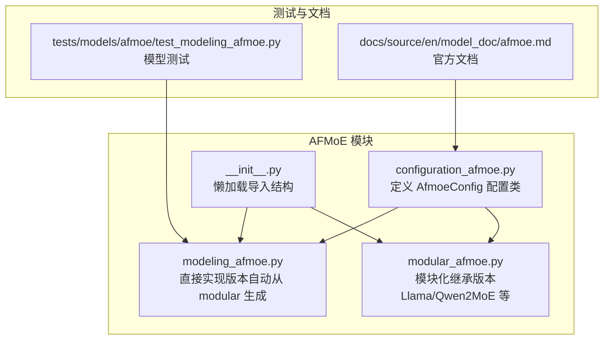
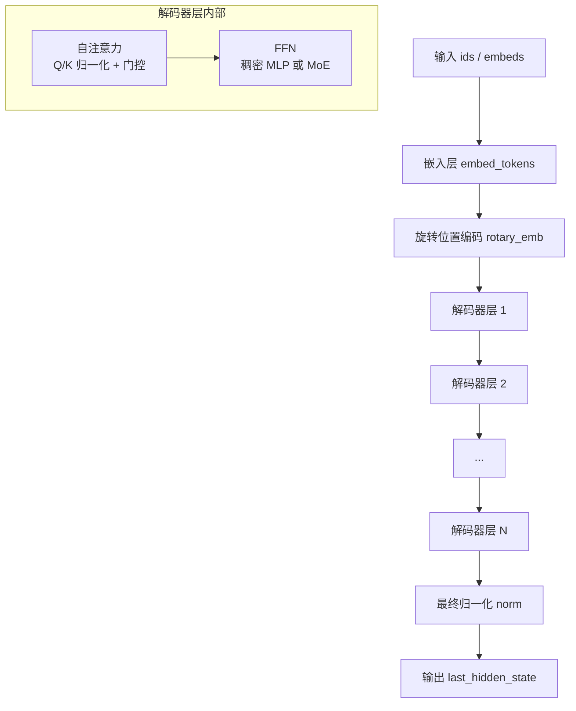
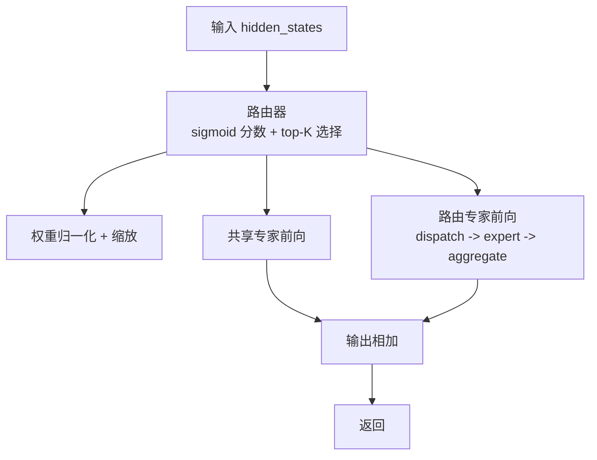
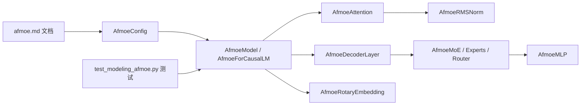

# AFMoE 模型

<cite>
**本文引用的文件**
- [src/transformers/models/afmoe/__init__.py](file://src/transformers/models/afmoe/__init__.py)
- [src/transformers/models/afmoe/configuration_afmoe.py](file://src/transformers/models/afmoe/configuration_afmoe.py)
- [src/transformers/models/afmoe/modeling_afmoe.py](file://src/transformers/models/afmoe/modeling_afmoe.py)
- [src/transformers/models/afmoe/modular_afmoe.py](file://src/transformers/models/afmoe/modular_afmoe.py)
- [tests/models/afmoe/test_modeling_afmoe.py](file://tests/models/afmoe/test_modeling_afmoe.py)
- [docs/source/en/model_doc/afmoe.md](file://docs/source/en/model_doc/afmoe.md)
</cite>

## 目录
1. [简介](#简介)
2. [项目结构](#项目结构)
3. [核心组件](#核心组件)
4. [架构总览](#架构总览)
5. [详细组件分析](#详细组件分析)
6. [依赖关系分析](#依赖关系分析)
7. [性能考量](#性能考量)
8. [故障排查指南](#故障排查指南)
9. [结论](#结论)
10. [附录](#附录)

## 简介
AFMoE（Arcee 基础混合专家）是一个基于 Llama 架构扩展的仅解码器 Transformer 模型，引入了稀疏 MoE（Mixture of Experts）机制，并结合共享专家、令牌选择路由、Q/K 归一化与门控、滑动窗口与全注意力混合模式等特性，以在长上下文与高效推理之间取得平衡。该模型支持 Flash Attention 2、SDPA、梯度检查点、量化等主流优化能力，并提供从配置到前向推理、到因果语言建模的完整实现。

## 项目结构
AFMoE 的核心代码位于 transformers 库的 models 子模块中，采用“配置 + 模型实现”的组织方式，并提供两种实现路径：直接实现版与模块化继承版。文档与测试分别位于 docs 与 tests 目录。

图表来源
- [src/transformers/models/afmoe/configuration_afmoe.py](file://src/transformers/models/afmoe/configuration_afmoe.py#L1-L211)
- [src/transformers/models/afmoe/modeling_afmoe.py](file://src/transformers/models/afmoe/modeling_afmoe.py#L1-L714)
- [src/transformers/models/afmoe/modular_afmoe.py](file://src/transformers/models/afmoe/modular_afmoe.py#L1-L472)
- [src/transformers/models/afmoe/__init__.py](file://src/transformers/models/afmoe/__init__.py#L1-L28)
- [tests/models/afmoe/test_modeling_afmoe.py](file://tests/models/afmoe/test_modeling_afmoe.py#L1-L124)
- [docs/source/en/model_doc/afmoe.md](file://docs/source/en/model_doc/afmoe.md#L1-L131)

章节来源
- [src/transformers/models/afmoe/__init__.py](file://src/transformers/models/afmoe/__init__.py#L1-L28)
- [src/transformers/models/afmoe/configuration_afmoe.py](file://src/transformers/models/afmoe/configuration_afmoe.py#L1-L211)
- [src/transformers/models/afmoe/modeling_afmoe.py](file://src/transformers/models/afmoe/modeling_afmoe.py#L1-L714)
- [src/transformers/models/afmoe/modular_afmoe.py](file://src/transformers/models/afmoe/modular_afmoe.py#L1-L472)
- [tests/models/afmoe/test_modeling_afmoe.py](file://tests/models/afmoe/test_modeling_afmoe.py#L1-L124)
- [docs/source/en/model_doc/afmoe.md](file://docs/source/en/model_doc/afmoe.md#L1-L131)

## 核心组件
- 配置类：AfmoeConfig 定义词表大小、隐藏维度、中间维度、层数、注意力头数、RoPE 参数、MoE 专家数量与路由策略、滑动窗口与全局注意力频率、是否启用缓存、muP 输入缩放等。
- 模型主体：AfmoeModel 是解码器堆叠，包含嵌入层、旋转位置编码、多层解码器层、最终归一化。
- 因果语言建模：AfmoeForCausalLM 在模型基础上添加 lm_head 并实现损失计算与生成接口。
- 解码器层：AfmoeDecoderLayer 包含自注意力（带 Q/K 归一化与门控）、双归一化（预/后）、以及按层切换的 MoE 或稠密 MLP。
- MoE 组件：AfmoeTokenChoiceRouter（令牌选择 top-K 路由）、AfmoeExperts（专家容器）、AfmoeMoE（共享专家 + 路由专家聚合）。
- 注意力：AfmoeAttention 支持滑动窗口与全注意力切换、Q/K 归一化、输出门控。
- 归一化与激活：AfmoeRMSNorm、AfmoeMLP（门控式 MLP）。
- 工具与掩码：旋转位置编码、因果掩码与滑动窗口因果掩码创建、注意力前向函数。

章节来源
- [src/transformers/models/afmoe/configuration_afmoe.py](file://src/transformers/models/afmoe/configuration_afmoe.py#L1-L211)
- [src/transformers/models/afmoe/modeling_afmoe.py](file://src/transformers/models/afmoe/modeling_afmoe.py#L1-L714)
- [src/transformers/models/afmoe/modular_afmoe.py](file://src/transformers/models/afmoe/modular_afmoe.py#L1-L472)

## 架构总览
AFMoE 的整体数据流从输入 token 或嵌入开始，经过嵌入与旋转位置编码，逐层执行解码器层（注意力 + FFN），并在最后进行归一化与输出投影。注意力层根据配置在滑动窗口与全注意力之间切换；FFN 层在前若干层使用稠密 MLP，在后续层切换为 MoE（共享专家 + 路由专家）。

图表来源
- [src/transformers/models/afmoe/modeling_afmoe.py](file://src/transformers/models/afmoe/modeling_afmoe.py#L542-L714)

章节来源
- [src/transformers/models/afmoe/modeling_afmoe.py](file://src/transformers/models/afmoe/modeling_afmoe.py#L542-L714)

## 详细组件分析

### 配置类：AfmoeConfig
- 关键参数
  - 词表、最大长度、隐藏维度、中间维度、层数、注意力头数、头维度、激活函数、归一化 epsilon、是否缓存、词嵌入是否与输出对齐、RoPE theta/参数、MoE 专家数、每令牌专家数、共享专家数、路由缩放、全局注意力频率、滑动窗口、注意力 dropout、muP 启用。
- 层类型映射
  - 可通过全局频率或显式列表指定每层的注意力类型（滑动窗口或全注意力），默认按频率自动生成。
- 推理忽略键
  - 推理时忽略 past_key_values 键，便于流水线并行计划。

章节来源
- [src/transformers/models/afmoe/configuration_afmoe.py](file://src/transformers/models/afmoe/configuration_afmoe.py#L1-L211)

### 模型主体：AfmoeModel
- 前向流程
  - 输入校验与缓存初始化
  - 嵌入与位置 ID 计算
  - 构造因果掩码（全注意力与滑动窗口两种）
  - 可选 muP 输入缩放
  - 逐层调用解码器层（按层类型选择掩码）
  - 最终归一化
- 输出
  - 返回 last_hidden_state 与可选 past_key_values。

章节来源
- [src/transformers/models/afmoe/modeling_afmoe.py](file://src/transformers/models/afmoe/modeling_afmoe.py#L566-L637)

### 因果语言建模：AfmoeForCausalLM
- 结构
  - 组合 AfmoeModel 与 lm_head，实现文本生成与损失计算。
- 前向
  - 调用模型前向得到隐藏状态
  - 只对需要的 logits 切片计算，避免不必要的上溢
  - 可选计算损失

章节来源
- [src/transformers/models/afmoe/modeling_afmoe.py](file://src/transformers/models/afmoe/modeling_afmoe.py#L639-L714)

### 解码器层：AfmoeDecoderLayer
- 结构
  - 自注意力（Q/K 归一化、门控、滑动窗口/全注意力）
  - 双归一化（输入/后注意力）
  - FFN（预/后归一化）
  - 可切换：前若干层稠密 MLP，之后 MoE
- 前向
  - 残差连接贯穿注意力与 FFN
  - 根据层索引决定是否启用 MoE

章节来源
- [src/transformers/models/afmoe/modeling_afmoe.py](file://src/transformers/models/afmoe/modeling_afmoe.py#L434-L501)

### 注意力：AfmoeAttention
- 特性
  - 支持滑动窗口与全注意力切换
  - Q/K 归一化（RMSNorm）
  - 输出门控（sigmoid gate）
  - 支持多种注意力实现后端（eager/SDPA/FlashAttention 等）
- 前向
  - 计算 Q/K/V，归一化后应用 RoPE（仅滑动窗口层）
  - 更新 KV 缓存（可选）
  - 选择注意力接口并计算输出

章节来源
- [src/transformers/models/afmoe/modeling_afmoe.py](file://src/transformers/models/afmoe/modeling_afmoe.py#L316-L432)

### MoE 组件
- 路由器：AfmoeTokenChoiceRouter
  - 对每个令牌计算专家分数（sigmoid），top-K 选择，归一化权重，可选缩放
- 专家集合：AfmoeExperts
  - 将令牌路由决策排序，按专家分组，逐个专家前向，加权聚合回原形状
- MoE 主体：AfmoeMoE
  - 共享专家（始终激活）+ 路由专家（按令牌选择），输出相加

图表来源
- [src/transformers/models/afmoe/modeling_afmoe.py](file://src/transformers/models/afmoe/modeling_afmoe.py#L147-L267)

章节来源
- [src/transformers/models/afmoe/modeling_afmoe.py](file://src/transformers/models/afmoe/modeling_afmoe.py#L147-L267)

### 归一化与激活
- AfmoeRMSNorm：RMS 归一化，保持数值稳定
- AfmoeMLP：门控式 MLP（gate × up -> act -> down）

章节来源
- [src/transformers/models/afmoe/modeling_afmoe.py](file://src/transformers/models/afmoe/modeling_afmoe.py#L110-L146)

### 旋转位置编码
- AfmoeRotaryEmbedding：基于配置的 RoPE 初始化与动态更新，支持不同 RoPE 类型

章节来源
- [src/transformers/models/afmoe/modeling_afmoe.py](file://src/transformers/models/afmoe/modeling_afmoe.py#L45-L109)

### 模块化实现对比：modular_afmoe.py
- 采用继承策略，复用 Llama/RMSNorm/Qwen2MoE 等组件，减少重复实现
- 与直接实现版本在功能上等价，便于与现有生态模型对齐与转换

章节来源
- [src/transformers/models/afmoe/modular_afmoe.py](file://src/transformers/models/afmoe/modular_afmoe.py#L1-L472)

## 依赖关系分析
- 配置依赖：AfmoeConfig 继承 PreTrainedConfig，使用 RopeParameters、layer_type_validation 等工具
- 模型依赖：AfmoeModel/AfmoeForCausalLM 依赖注意力掩码构建、缓存、激活函数、归一化、MoE 组件
- 注意力后端：支持多种注意力实现（eager/SDPA/FlashAttention/flex），通过统一接口调度
- 文档与测试：官方文档提供使用示例与架构说明；测试覆盖基础功能与跳过项（如打包场景不适用）

图表来源
- [src/transformers/models/afmoe/configuration_afmoe.py](file://src/transformers/models/afmoe/configuration_afmoe.py#L1-L211)
- [src/transformers/models/afmoe/modeling_afmoe.py](file://src/transformers/models/afmoe/modeling_afmoe.py#L1-L714)
- [docs/source/en/model_doc/afmoe.md](file://docs/source/en/model_doc/afmoe.md#L1-L131)
- [tests/models/afmoe/test_modeling_afmoe.py](file://tests/models/afmoe/test_modeling_afmoe.py#L1-L124)

章节来源
- [src/transformers/models/afmoe/configuration_afmoe.py](file://src/transformers/models/afmoe/configuration_afmoe.py#L1-L211)
- [src/transformers/models/afmoe/modeling_afmoe.py](file://src/transformers/models/afmoe/modeling_afmoe.py#L1-L714)
- [docs/source/en/model_doc/afmoe.md](file://docs/source/en/model_doc/afmoe.md#L1-L131)
- [tests/models/afmoe/test_modeling_afmoe.py](file://tests/models/afmoe/test_modeling_afmoe.py#L1-L124)

## 性能考量
- 滑动窗口注意力：在长序列中显著降低注意力复杂度，适合长上下文任务
- 全注意力周期性插入：在关键层保留全局上下文感知能力
- MoE 稀疏性：通过共享专家与路由专家组合，既保证稳定性又提升容量
- Q/K 归一化与门控：改善训练稳定性与数值精度
- 多注意力后端：支持 SDPA、FlashAttention 等加速路径
- 梯度检查点：可降低显存占用，适合大模型推理/训练
- muP 输入缩放：在某些设置下有助于参数初始化与收敛

[本节为通用指导，不直接分析具体文件]

## 故障排查指南
- 输入与掩码
  - 确保 input_ids 与 inputs_embeds 二选一，且 attention_mask 与缓存位置一致
- 缓存与位置
  - 使用 use_cache 时确保 past_key_values 初始化；position_ids 与 cache_position 一致性
- 打包与 RoPE
  - 当前实现对键/查询归一化与打包场景存在限制，测试中对相关场景进行了跳过
- 模型输出差异
  - MoE 输出具有随机性，测试中对等价性比较进行了跳过
- 权重初始化
  - 路由器与专家偏置初始化为零，确保初始路由稳定

章节来源
- [tests/models/afmoe/test_modeling_afmoe.py](file://tests/models/afmoe/test_modeling_afmoe.py#L100-L124)
- [src/transformers/models/afmoe/modeling_afmoe.py](file://src/transformers/models/afmoe/modeling_afmoe.py#L533-L541)

## 结论
AFMoE 在标准 Transformer 基础上引入了共享专家与令牌选择路由的 MoE 机制，并结合 Q/K 归一化、注意力门控、滑动窗口与全注意力混合、双归一化等设计，兼顾了长上下文效率与训练稳定性。其配置灵活、实现清晰，并提供了从配置到生成的完整链路，适合在需要稀疏扩展与高效推理的任务中使用。

[本节为总结性内容，不直接分析具体文件]

## 附录
- 官方文档与使用示例参见文档文件
- 测试覆盖基础功能，部分场景因实现特性而跳过

章节来源
- [docs/source/en/model_doc/afmoe.md](file://docs/source/en/model_doc/afmoe.md#L1-L131)
- [tests/models/afmoe/test_modeling_afmoe.py](file://tests/models/afmoe/test_modeling_afmoe.py#L1-L124)