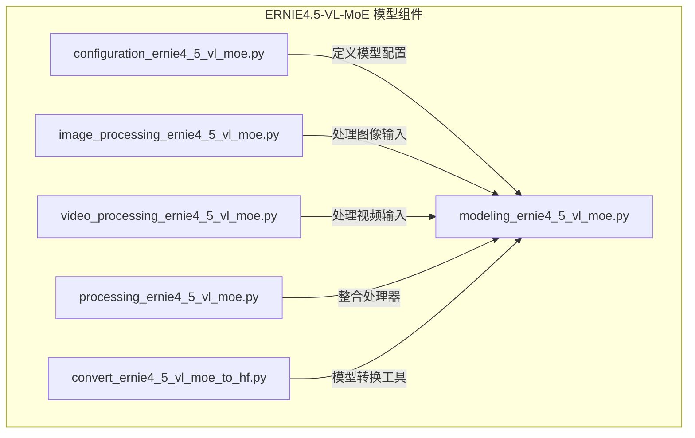
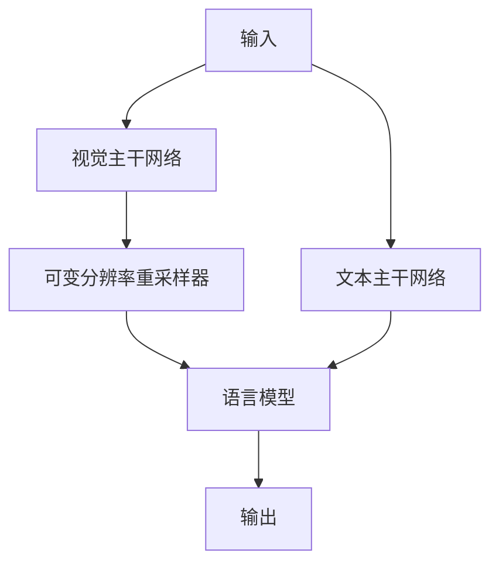
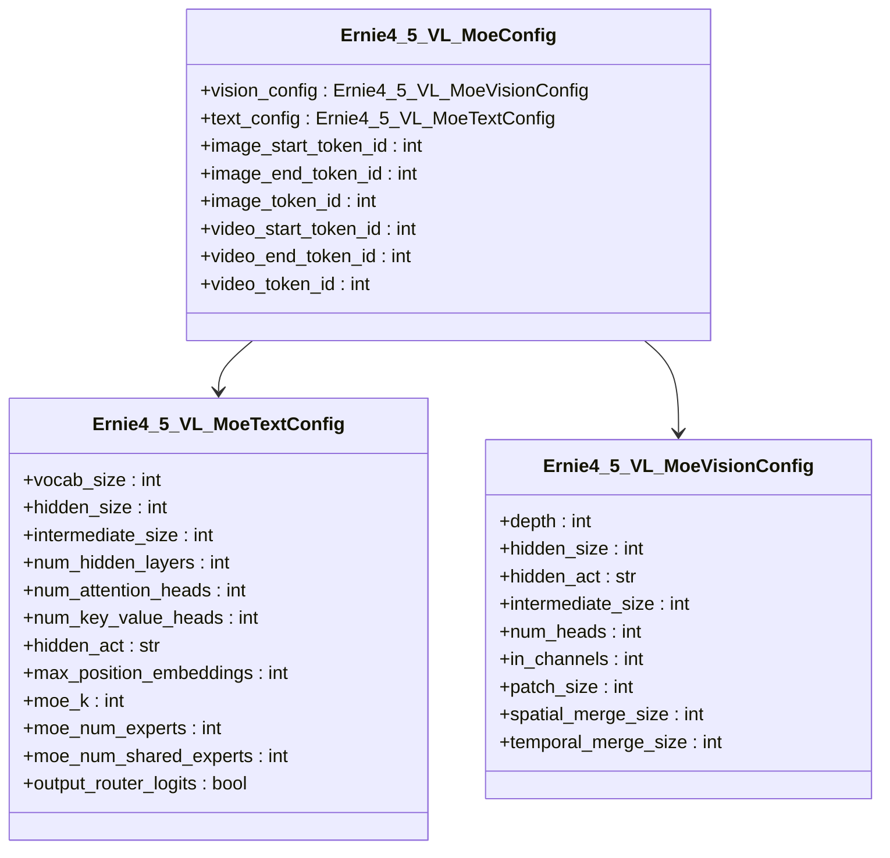
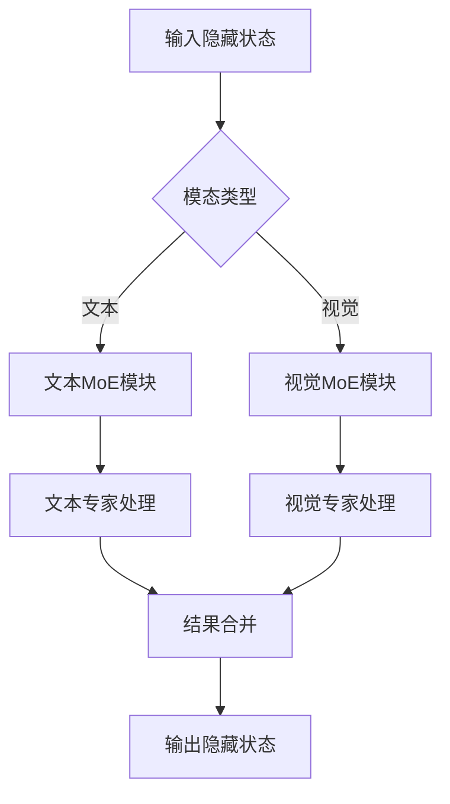
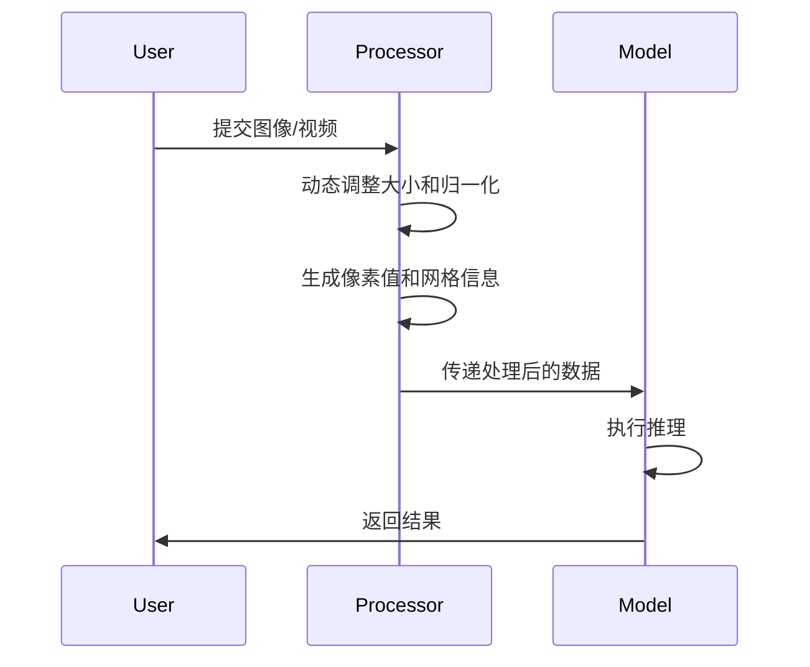
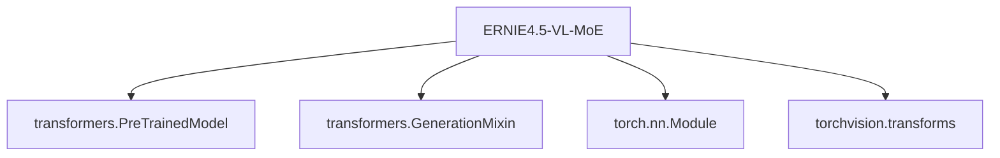

# ERNIE4.5-VL-MoE 模型

<cite>
**本文档中引用的文件**   
- [configuration_ernie4_5_vl_moe.py](file://src/transformers/models/ernie4_5_vl_moe/configuration_ernie4_5_vl_moe.py)
- [modeling_ernie4_5_vl_moe.py](file://src/transformers/models/ernie4_5_vl_moe/modeling_ernie4_5_vl_moe.py)
- [image_processing_ernie4_5_vl_moe.py](file://src/transformers/models/ernie4_5_vl_moe/image_processing_ernie4_5_vl_moe.py)
- [video_processing_ernie4_5_vl_moe.py](file://src/transformers/models/ernie4_5_vl_moe/video_processing_ernie4_5_vl_moe.py)
- [processing_ernie4_5_vl_moe.py](file://src/transformers/models/ernie4_5_vl_moe/processing_ernie4_5_vl_moe.py)
- [convert_ernie4_5_vl_moe_to_hf.py](file://src/transformers/models/ernie4_5_vl_moe/convert_ernie4_5_vl_moe_to_hf.py)
</cite>

## 目录
1. [简介](#简介)
2. [项目结构](#项目结构)
3. [核心组件](#核心组件)
4. [架构概述](#架构概述)
5. [详细组件分析](#详细组件分析)
6. [依赖分析](#依赖分析)
7. [性能考虑](#性能考虑)
8. [故障排除指南](#故障排除指南)
9. [结论](#结论)

## 简介
ERNIE4.5-VL-MoE 是一个先进的多模态大语言模型，结合了视觉和语言处理能力，并采用了混合专家（Mixture of Experts, MoE）架构。该模型能够处理文本、图像和视频输入，通过模态隔离的专家系统实现高效的多模态理解。模型的核心设计包括一个文本主干网络和一个视觉主干网络，通过可变分辨率重采样器进行连接。其独特的3D位置编码机制和动态图像/视频处理流程使其在多模态任务中表现出色。

## 项目结构
ERNIE4.5-VL-MoE 模型的实现位于 `src/transformers/models/ernie4_5_vl_moe/` 目录下，包含配置、建模、图像/视频处理和转换工具等核心组件。该结构遵循Hugging Face Transformers库的模块化设计原则，将不同功能分离到独立的文件中，便于维护和扩展。

**Diagram sources**
- [configuration_ernie4_5_vl_moe.py](file://src/transformers/models/ernie4_5_vl_moe/configuration_ernie4_5_vl_moe.py)
- [modeling_ernie4_5_vl_moe.py](file://src/transformers/models/ernie4_5_vl_moe/modeling_ernie4_5_vl_moe.py)
- [image_processing_ernie4_5_vl_moe.py](file://src/transformers/models/ernie4_5_vl_moe/image_processing_ernie4_5_vl_moe.py)
- [video_processing_ernie4_5_vl_moe.py](file://src/transformers/models/ernie4_5_vl_moe/video_processing_ernie4_5_vl_moe.py)
- [processing_ernie4_5_vl_moe.py](file://src/transformers/models/ernie4_5_vl_moe/processing_ernie4_5_vl_moe.py)
- [convert_ernie4_5_vl_moe_to_hf.py](file://src/transformers/models/ernie4_5_vl_moe/convert_ernie4_5_vl_moe_to_hf.py)

**Section sources**
- [configuration_ernie4_5_vl_moe.py](file://src/transformers/models/ernie4_5_vl_moe/configuration_ernie4_5_vl_moe.py)
- [modeling_ernie4_5_vl_moe.py](file://src/transformers/models/ernie4_5_vl_moe/modeling_ernie4_5_vl_moe.py)
- [image_processing_ernie4_5_vl_moe.py](file://src/transformers/models/ernie4_5_vl_moe/image_processing_ernie4_5_vl_moe.py)
- [video_processing_ernie4_5_vl_moe.py](file://src/transformers/models/ernie4_5_vl_moe/video_processing_ernie4_5_vl_moe.py)
- [processing_ernie4_5_vl_moe.py](file://src/transformers/models/ernie4_5_vl_moe/processing_ernie4_5_vl_moe.py)
- [convert_ernie4_5_vl_moe_to_hf.py](file://src/transformers/models/ernie4_5_vl_moe/convert_ernie4_5_vl_moe_to_hf.py)

## 核心组件
ERNIE4.5-VL-MoE 模型的核心组件包括配置系统、文本和视觉主干网络、混合专家（MoE）模块以及多模态处理器。配置系统通过 `Ernie4_5_VL_MoeConfig` 类管理模型的超参数，文本主干网络基于Transformer架构，视觉主干网络采用Vision Transformer，而MoE模块则实现了模态隔离的专家系统，允许模型在处理不同模态数据时激活不同的专家网络。

**Section sources**
- [configuration_ernie4_5_vl_moe.py](file://src/transformers/models/ernie4_5_vl_moe/configuration_ernie4_5_vl_moe.py)
- [modeling_ernie4_5_vl_moe.py](file://src/transformers/models/ernie4_5_vl_moe/modeling_ernie4_5_vl_moe.py)

## 架构概述
ERNIE4.5-VL-MoE 模型采用分层架构，由文本主干网络、视觉主干网络和连接两者的可变分辨率重采样器组成。文本主干网络负责处理语言信息，视觉主干网络处理图像和视频特征，重采样器则将视觉特征映射到与文本特征相匹配的维度。模型通过 `Ernie4_5_VL_MoeForConditionalGeneration` 类提供完整的条件生成能力。

**Diagram sources**
- [modeling_ernie4_5_vl_moe.py](file://src/transformers/models/ernie4_5_vl_moe/modeling_ernie4_5_vl_moe.py)

## 详细组件分析
### 配置系统分析
ERNIE4.5-VL-MoE 的配置系统由三个主要配置类组成：`Ernie4_5_VL_MoeConfig`、`Ernie4_5_VL_MoeTextConfig` 和 `Ernie4_5_VL_MoeVisionConfig`。这些类分别管理整体模型、文本主干和视觉主干的配置参数。配置系统支持模态特定的参数设置，如文本的 `moe_k`（每个token选择的专家数量）和视觉的 `spatial_merge_size`（空间合并大小）。

**Diagram sources**
- [configuration_ernie4_5_vl_moe.py](file://src/transformers/models/ernie4_5_vl_moe/configuration_ernie4_5_vl_moe.py)

**Section sources**
- [configuration_ernie4_5_vl_moe.py](file://src/transformers/models/ernie4_5_vl_moe/configuration_ernie4_5_vl_moe.py)

### 混合专家（MoE）模块分析
ERNIE4.5-VL-MoE 的核心创新在于其混合专家模块，该模块实现了模态隔离的专家系统。`Ernie4_5_VL_MoeMoeBlock` 类包含文本专家和视觉专家两个独立的 `Ernie4_5_VL_MoeSparseMoeBlock` 实例，确保文本token只通过文本专家，视觉token只通过视觉专家。这种设计提高了模型的效率和多模态处理能力。

**Diagram sources**
- [modeling_ernie4_5_vl_moe.py](file://src/transformers/models/ernie4_5_vl_moe/modeling_ernie4_5_vl_moe.py)

**Section sources**
- [modeling_ernie4_5_vl_moe.py](file://src/transformers/models/ernie4_5_vl_moe/modeling_ernie4_5_vl_moe.py)

### 图像和视频处理分析
ERNIE4.5-VL-MoE 提供了专门的图像和视频处理器，`Ernie4_5_VL_MoeImageProcessor` 和 `Ernie4_5_VL_MoeVideoProcessor`。这些处理器负责将原始图像和视频数据转换为模型可接受的格式，包括动态调整大小、归一化和生成网格信息。视频处理器还包含在帧上绘制时间戳的特殊功能。

**Diagram sources**
- [image_processing_ernie4_5_vl_moe.py](file://src/transformers/models/ernie4_5_vl_moe/image_processing_ernie4_5_vl_moe.py)
- [video_processing_ernie4_5_vl_moe.py](file://src/transformers/models/ernie4_5_vl_moe/video_processing_ernie4_5_vl_moe.py)

**Section sources**
- [image_processing_ernie4_5_vl_moe.py](file://src/transformers/models/ernie4_5_vl_moe/image_processing_ernie4_5_vl_moe.py)
- [video_processing_ernie4_5_vl_moe.py](file://src/transformers/models/ernie4_5_vl_moe/video_processing_ernie4_5_vl_moe.py)

## 依赖分析
ERNIE4.5-VL-MoE 模型依赖于Hugging Face Transformers库的核心功能，包括配置管理、模型基类和处理工具。模型通过 `Ernie4_5_VL_MoePreTrainedModel` 继承自 `PreTrainedModel`，并使用 `GenerationMixin` 提供生成能力。此外，模型依赖于 `torch` 和 `torchvision` 进行张量操作和视频处理。

**Diagram sources**
- [modeling_ernie4_5_vl_moe.py](file://src/transformers/models/ernie4_5_vl_moe/modeling_ernie4_5_vl_moe.py)

**Section sources**
- [modeling_ernie4_5_vl_moe.py](file://src/transformers/models/ernie4_5_vl_moe/modeling_ernie4_5_vl_moe.py)

## 性能考虑
ERNIE4.5-VL-MoE 模型在设计时考虑了多种性能优化。其MoE架构允许模型在保持大规模参数的同时，通过稀疏激活机制减少计算开销。动态图像调整大小算法 `smart_resize` 确保输入图像在保持长宽比的同时满足最小和最大像素要求，优化了计算效率。此外，模型支持梯度检查点以减少内存占用。

## 故障排除指南
在使用ERNIE4.5-VL-MoE模型时，可能会遇到一些常见问题。如果出现图像/视频token与特征不匹配的错误，应检查 `get_placeholder_mask` 函数的输入。对于视频处理中的时间戳绘制问题，应确保 `draw_on_frames` 参数与 `torch.compile` 的使用兼容。模型转换时，应使用 `convert_ernie4_5_vl_moe_to_hf.py` 脚本确保配置和处理器的正确转换。

**Section sources**
- [modeling_ernie4_5_vl_moe.py](file://src/transformers/models/ernie4_5_vl_moe/modeling_ernie4_5_vl_moe.py)
- [convert_ernie4_5_vl_moe_to_hf.py](file://src/transformers/models/ernie4_5_vl_moe/convert_ernie4_5_vl_moe_to_hf.py)

## 结论
ERNIE4.5-VL-MoE 是一个功能强大的多模态大语言模型，通过创新的混合专家架构和模态隔离设计，在处理文本、图像和视频数据方面表现出色。其模块化的实现和与Hugging Face生态系统的良好集成使其易于使用和扩展。该模型为多模态理解和生成任务提供了先进的解决方案，具有广泛的应用前景。