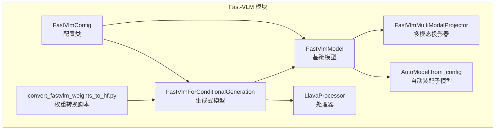
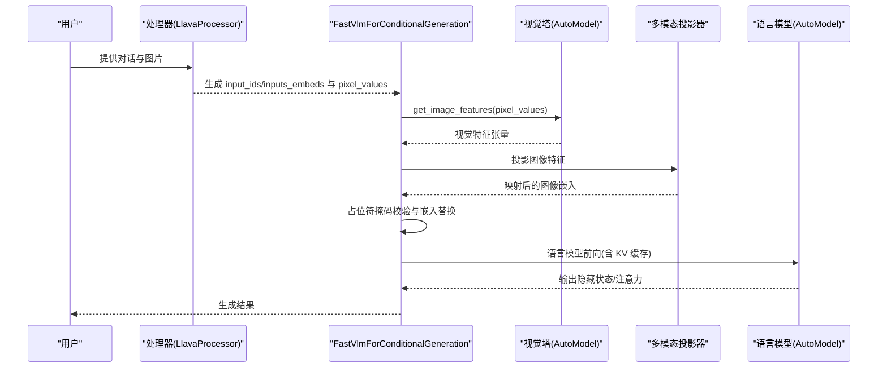
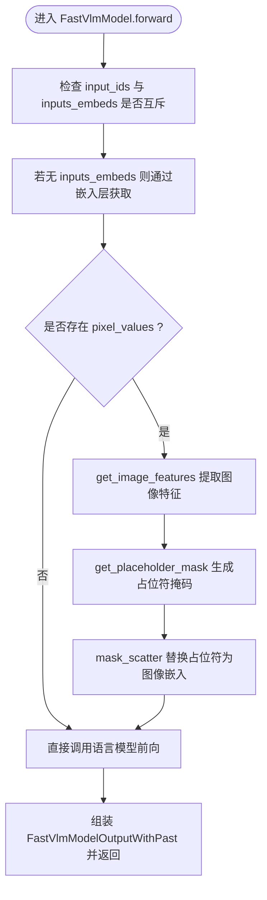
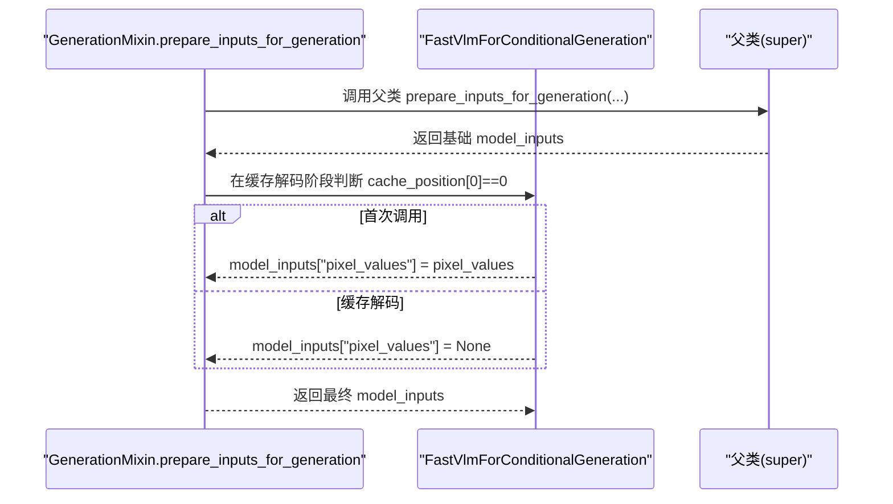
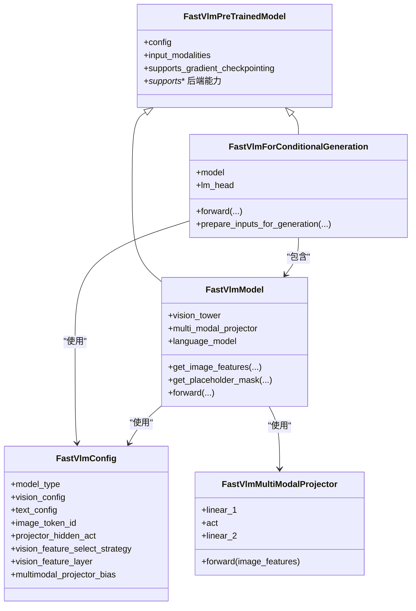

# Fast-VLM 模型

<cite>
**本文引用的文件**
- [src/transformers/models/fast_vlm/__init__.py](file://src/transformers/models/fast_vlm/__init__.py)
- [src/transformers/models/fast_vlm/configuration_fast_vlm.py](file://src/transformers/models/fast_vlm/configuration_fast_vlm.py)
- [src/transformers/models/fast_vlm/modeling_fast_vlm.py](file://src/transformers/models/fast_vlm/modeling_fast_vlm.py)
- [src/transformers/models/fast_vlm/modular_fast_vlm.py](file://src/transformers/models/fast_vlm/modular_fast_vlm.py)
- [src/transformers/models/fast_vlm/convert_fastvlm_weights_to_hf.py](file://src/transformers/models/fast_vlm/convert_fastvlm_weights_to_hf.py)
- [tests/models/fast_vlm/test_modeling_fast_vlm.py](file://tests/models/fast_vlm/test_modeling_fast_vlm.py)
- [docs/source/en/model_doc/fast_vlm.md](file://docs/source/en/model_doc/fast_vlm.md)
</cite>

## 目录
1. [简介](#简介)
2. [项目结构](#项目结构)
3. [核心组件](#核心组件)
4. [架构总览](#架构总览)
5. [详细组件分析](#详细组件分析)
6. [依赖关系分析](#依赖关系分析)
7. [性能与优化特性](#性能与优化特性)
8. [故障排查指南](#故障排查指南)
9. [结论](#结论)
10. [附录：权重转换与部署](#附录权重转换与部署)

## 简介
Fast-VLM 是一个高效的视觉语言模型（Vision-Language Model），采用新型混合视觉编码器 FastViTHD，通过可重参数化卷积层、缩放输入分辨率以及减少视觉标记数量，在保持高精度的同时显著降低延迟与计算开销。该模型在 Hugging Face Transformers 中由 FastVLM 家族提供支持，包含配置类、基础模型与生成式模型，并配套了从原始仓库权重到 HF 格式的转换脚本。

## 项目结构
Fast-VLM 的核心代码位于 transformers 库的 fast_vlm 子模块中，主要文件包括：
- 配置类：定义视觉与文本子模型配置、图像占位符等关键超参
- 基础模型与生成式模型：封装视觉塔、多模态投影器与语言模型的组合逻辑
- 模块化模板：用于自动生成配置与模型代码
- 权重转换脚本：将 Apple 原始仓库权重转换为 HF 可加载格式
- 测试与文档：覆盖功能测试、集成测试与用户使用说明

图表来源
- [src/transformers/models/fast_vlm/configuration_fast_vlm.py](file://src/transformers/models/fast_vlm/configuration_fast_vlm.py#L24-L138)
- [src/transformers/models/fast_vlm/modeling_fast_vlm.py](file://src/transformers/models/fast_vlm/modeling_fast_vlm.py#L38-L110)
- [src/transformers/models/fast_vlm/convert_fastvlm_weights_to_hf.py](file://src/transformers/models/fast_vlm/convert_fastvlm_weights_to_hf.py#L124-L215)

章节来源
- [src/transformers/models/fast_vlm/__init__.py](file://src/transformers/models/fast_vlm/__init__.py#L1-L28)
- [src/transformers/models/fast_vlm/configuration_fast_vlm.py](file://src/transformers/models/fast_vlm/configuration_fast_vlm.py#L24-L138)
- [src/transformers/models/fast_vlm/modeling_fast_vlm.py](file://src/transformers/models/fast_vlm/modeling_fast_vlm.py#L38-L110)
- [src/transformers/models/fast_vlm/modular_fast_vlm.py](file://src/transformers/models/fast_vlm/modular_fast_vlm.py#L33-L140)
- [src/transformers/models/fast_vlm/convert_fastvlm_weights_to_hf.py](file://src/transformers/models/fast_vlm/convert_fastvlm_weights_to_hf.py#L124-L215)

## 核心组件
- FastVlmConfig：定义视觉与文本子模型配置、图像占位符 token、多模态投影器激活函数、视觉特征选择策略与层数等；默认使用 fastvit_mci3 视觉塔与 Qwen2 文本塔。
- FastVlmMultiModalProjector：将视觉特征映射到文本嵌入维度的两层线性投影器，支持可选偏置。
- FastVlmPreTrainedModel：继承自通用预训练基类，声明输入模态、缓存与注意力后端能力等。
- FastVlmModel：组合视觉塔、投影器与语言模型，负责图像特征提取、占位符掩码与拼接、语言模型前向传播。
- FastVlmForConditionalGeneration：在基础模型之上添加语言建模头，支持训练与推理，具备生成式接口与 KV 缓存。

章节来源
- [src/transformers/models/fast_vlm/configuration_fast_vlm.py](file://src/transformers/models/fast_vlm/configuration_fast_vlm.py#L24-L138)
- [src/transformers/models/fast_vlm/modeling_fast_vlm.py](file://src/transformers/models/fast_vlm/modeling_fast_vlm.py#L38-L110)
- [src/transformers/models/fast_vlm/modeling_fast_vlm.py](file://src/transformers/models/fast_vlm/modeling_fast_vlm.py#L110-L248)
- [src/transformers/models/fast_vlm/modeling_fast_vlm.py](file://src/transformers/models/fast_vlm/modeling_fast_vlm.py#L280-L456)

## 架构总览
Fast-VLM 的整体架构由“视觉编码器 + 多模态投影器 + 语言模型”三部分组成。图像输入经视觉塔输出特征，再通过投影器映射到文本嵌入空间；随后将图像占位符替换为投影后的图像嵌入，送入语言模型完成上下文理解与生成。

图表来源
- [src/transformers/models/fast_vlm/modeling_fast_vlm.py](file://src/transformers/models/fast_vlm/modeling_fast_vlm.py#L117-L248)
- [src/transformers/models/fast_vlm/modeling_fast_vlm.py](file://src/transformers/models/fast_vlm/modeling_fast_vlm.py#L280-L456)

## 详细组件分析

### 配置类 FastVlmConfig
- 关键属性
  - vision_config/text_config：分别指定视觉与文本子模型配置，默认视觉使用 fastvit_mci3，文本使用 Qwen2
  - image_token_id：图像占位符 token 的索引
  - projector_hidden_act：投影器激活函数
  - vision_feature_select_strategy/vision_feature_layer：视觉特征选择策略与层数（当前仅支持 full 与 -1）
  - multimodal_projector_bias：投影器是否使用偏置
- 默认行为
  - 若未显式传入子配置，会自动构造默认的视觉与文本配置
  - 对不支持的策略或层数会抛出错误
- 与 AutoConfig/CONFIG_MAPPING 的集成，确保可动态装配不同子模型

章节来源
- [src/transformers/models/fast_vlm/configuration_fast_vlm.py](file://src/transformers/models/fast_vlm/configuration_fast_vlm.py#L24-L138)

### 多模态投影器 FastVlmMultiModalProjector
- 结构
  - 两层线性层，中间使用配置指定的激活函数
  - 输入维度来自视觉配置的 hidden_size，输出维度对齐文本配置的 hidden_size
- 作用
  - 将视觉特征从视觉嵌入空间映射到语言模型嵌入空间，便于后续拼接与统一处理

章节来源
- [src/transformers/models/fast_vlm/modeling_fast_vlm.py](file://src/transformers/models/fast_vlm/modeling_fast_vlm.py#L38-L56)

### 基础模型 FastVlmModel
- 组成
  - 视觉塔：AutoModel.from_config(config.vision_config)
  - 多模态投影器：FastVlmMultiModalProjector(config)
  - 语言模型：AutoModel.from_config(config.text_config)
- 图像特征提取
  - 调用视觉塔得到输出，按 FastVLM 的混合结构特殊处理最后隐藏状态
  - 展平并转置后进行投影，返回图像特征列表
- 占位符掩码
  - 依据 image_token_id 在 input_ids 或 inputs_embeds 上生成布尔掩码
  - 校验占位符数量与图像特征总量一致，否则报错
- 前向流程
  - 支持 input_ids 或 inputs_embeds 二选一
  - 当存在 pixel_values 时，先提取图像特征并替换占位符，再调用语言模型前向
  - 返回包含 last_hidden_state、past_key_values、hidden_states、attentions 与 image_hidden_states 的输出对象

图表来源
- [src/transformers/models/fast_vlm/modeling_fast_vlm.py](file://src/transformers/models/fast_vlm/modeling_fast_vlm.py#L181-L248)

章节来源
- [src/transformers/models/fast_vlm/modeling_fast_vlm.py](file://src/transformers/models/fast_vlm/modeling_fast_vlm.py#L110-L248)

### 生成式模型 FastVlmForConditionalGeneration
- 组成
  - 包含 FastVlmModel 与 lm_head 线性层
  - 继承 GenerationMixin，支持 generate 接口
- 前向流程
  - 先调用内部 model 前向，得到隐藏状态
  - 根据 logits_to_keep 参数仅计算必要位置的 logits，避免不必要的上溢
  - 计算损失（当提供 labels 时）
- 生成输入准备
  - prepare_inputs_for_generation 会在缓存解码阶段根据 cache_position 决定是否携带 pixel_values

图表来源
- [src/transformers/models/fast_vlm/modeling_fast_vlm.py](file://src/transformers/models/fast_vlm/modeling_fast_vlm.py#L424-L453)

章节来源
- [src/transformers/models/fast_vlm/modeling_fast_vlm.py](file://src/transformers/models/fast_vlm/modeling_fast_vlm.py#L280-L456)

### 模块化模板与自动生成
- modular_fast_vlm.py 提供了与 modeling_fast_vlm.py 对应的模块化定义，用于自动生成配置与模型代码
- 自动生成文件带有明确的“不要手动编辑”注释，强调通过模板生成而非手工维护

章节来源
- [src/transformers/models/fast_vlm/modular_fast_vlm.py](file://src/transformers/models/fast_vlm/modular_fast_vlm.py#L1-L274)

## 依赖关系分析
- AutoModel.from_config：用于按配置动态装配视觉与文本子模型
- CONFIG_MAPPING/AutoConfig：用于解析与实例化子模型类型
- GenerationMixin：为生成式模型提供 generate 接口与 KV 缓存支持
- 缓存与注意力后端：支持 flash_attn、sdpa、flex_attn 等后端能力声明

图表来源
- [src/transformers/models/fast_vlm/configuration_fast_vlm.py](file://src/transformers/models/fast_vlm/configuration_fast_vlm.py#L24-L138)
- [src/transformers/models/fast_vlm/modeling_fast_vlm.py](file://src/transformers/models/fast_vlm/modeling_fast_vlm.py#L38-L110)
- [src/transformers/models/fast_vlm/modeling_fast_vlm.py](file://src/transformers/models/fast_vlm/modeling_fast_vlm.py#L110-L248)
- [src/transformers/models/fast_vlm/modeling_fast_vlm.py](file://src/transformers/models/fast_vlm/modeling_fast_vlm.py#L280-L456)

章节来源
- [src/transformers/models/fast_vlm/modeling_fast_vlm.py](file://src/transformers/models/fast_vlm/modeling_fast_vlm.py#L38-L110)
- [src/transformers/models/fast_vlm/modeling_fast_vlm.py](file://src/transformers/models/fast_vlm/modeling_fast_vlm.py#L110-L248)
- [src/transformers/models/fast_vlm/modeling_fast_vlm.py](file://src/transformers/models/fast_vlm/modeling_fast_vlm.py#L280-L456)

## 性能与优化特性
- 视觉编码器 FastViTHD：通过可重参数化卷积与缩放输入分辨率，减少视觉标记数量，提升 TTFT（首 token 时间）与整体效率
- 注意力后端：默认使用 SDPA；视觉子模型仅支持 eager 注意力，因此会自动回退到 eager；如需在语言解码器中使用其他注意力实现，需单独设置
- KV 缓存：支持 past_key_values，配合生成式接口实现高效增量解码
- 半精度与设备映射：推荐使用半精度与设备映射以获得更佳吞吐
- 批处理提示：建议使用左对齐填充以提升批处理生成的准确性

章节来源
- [docs/source/en/model_doc/fast_vlm.md](file://docs/source/en/model_doc/fast_vlm.md#L40-L60)
- [src/transformers/models/fast_vlm/modeling_fast_vlm.py](file://src/transformers/models/fast_vlm/modeling_fast_vlm.py#L58-L73)
- [src/transformers/models/fast_vlm/modeling_fast_vlm.py](file://src/transformers/models/fast_vlm/modeling_fast_vlm.py#L181-L248)

## 故障排查指南
- 图像占位符与图像特征数量不匹配
  - 现象：当输入中的图像占位符数量与投影后的图像特征总量不一致时会抛出错误
  - 处理：确保每张图对应一个占位符，且输入图像数量与占位符数量一致
- 多图像输入
  - 现象：同一提示中同时输入多张图像但占位符未按张数对齐可能导致错误
  - 处理：为每张图像提供对应的占位符，或将多图像拼接到单个批次中
- 注意力实现设置
  - 现象：全局设置注意力实现可能在视觉子模型上导致不兼容
  - 处理：仅对文本配置设置注意力实现，避免对整个模型设置
- 生成输入准备
  - 现象：缓存解码阶段仍携带 pixel_values 可能导致重复或不一致
  - 处理：遵循 prepare_inputs_for_generation 的逻辑，首次调用保留 pixel_values，缓存阶段置空

章节来源
- [tests/models/fast_vlm/test_modeling_fast_vlm.py](file://tests/models/fast_vlm/test_modeling_fast_vlm.py#L195-L225)
- [src/transformers/models/fast_vlm/modeling_fast_vlm.py](file://src/transformers/models/fast_vlm/modeling_fast_vlm.py#L424-L453)
- [docs/source/en/model_doc/fast_vlm.md](file://docs/source/en/model_doc/fast_vlm.md#L40-L60)

## 结论
Fast-VLM 通过混合视觉编码器与轻量化投影路径，在保证性能的前提下显著提升了推理效率与 TTFT 表现。其模块化设计与自动生成机制使得配置与模型扩展更加便捷；配套的处理器与转换脚本则降低了从原始权重迁移到 HF 生态的门槛。对于批量与生成场景，建议遵循文档中的填充与注意力实现建议，以获得最佳效果。

## 附录：权重转换与部署
- 转换脚本功能
  - 下载原始权重，映射键名，修正网络层级命名，适配视觉与文本子模型结构
  - 重新初始化与填充新增的图像 token 嵌入，确保与下游处理器一致
  - 进行前向验证，确保输出形状与部分 logits 与原仓库对齐
- 使用步骤
  - 准备文本与视觉子模型配置
  - 创建 FastVlmConfig 与处理器（LlavaProcessor）
  - 加载并转换权重，推送至 Hub 或本地保存
- 注意事项
  - 为复现原仓库 logits，建议使用浮点精度；半精度下由于底层实现差异可能出现微小误差
  - 不同规模的检查点（如 0.5B/1.5B/7B）在词表大小与期望形状上有所不同，需按脚本中的断言进行核对

章节来源
- [src/transformers/models/fast_vlm/convert_fastvlm_weights_to_hf.py](file://src/transformers/models/fast_vlm/convert_fastvlm_weights_to_hf.py#L124-L215)
- [src/transformers/models/fast_vlm/convert_fastvlm_weights_to_hf.py](file://src/transformers/models/fast_vlm/convert_fastvlm_weights_to_hf.py#L217-L248)
- [docs/source/en/model_doc/fast_vlm.md](file://docs/source/en/model_doc/fast_vlm.md#L156-L164)