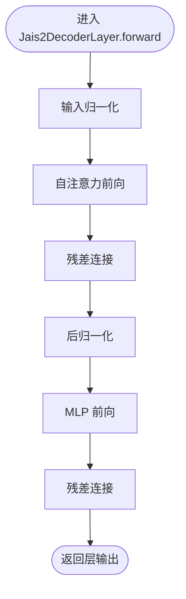

# Jais2 模型

<cite>
**本文引用的文件**
- [src/transformers/models/jais2/__init__.py](file://src/transformers/models/jais2/__init__.py)
- [src/transformers/models/jais2/configuration_jais2.py](file://src/transformers/models/jais2/configuration_jais2.py)
- [src/transformers/models/jais2/modeling_jais2.py](file://src/transformers/models/jais2/modeling_jais2.py)
- [src/transformers/models/jais2/modular_jais2.py](file://src/transformers/models/jais2/modular_jais2.py)
- [tests/models/jais2/test_modeling_jais2.py](file://tests/models/jais2/test_modeling_jais2.py)
- [docs/source/en/model_doc/jais2.md](file://docs/source/en/model_doc/jais2.md)
</cite>

## 目录
1. [简介](#简介)
2. [项目结构](#项目结构)
3. [核心组件](#核心组件)
4. [架构总览](#架构总览)
5. [详细组件分析](#详细组件分析)
6. [依赖关系分析](#依赖关系分析)
7. [性能与优化建议](#性能与优化建议)
8. [故障排查指南](#故障排查指南)
9. [结论](#结论)
10. [附录](#附录)

## 简介
Jais2 是一个基于 Transformer 架构的阿拉伯语大语言模型，强调对阿拉伯语方言、文化与现代表达的理解。其关键特性包括：
- 使用 LayerNorm 而非 RMSNorm
- 使用 ReLU² 激活函数
- 使用旋转位置嵌入（RoPE）

该实现由配置类、预训练基座模型、因果语言模型以及模块化生成脚本组成，并提供自动文档与测试覆盖。

**章节来源**
- [docs/source/en/model_doc/jais2.md](file://docs/source/en/model_doc/jais2.md#L18-L41)

## 项目结构
Jais2 模块位于 transformers 库的 models 子目录下，采用“按模型分包”的组织方式，包含以下文件：
- 配置：定义模型超参与并行计划
- 基础建模：实现注意力、MLP、解码层、模型主体与因果 LM
- 模块化模板：通过继承 Llama/Nemotron 组件快速生成可维护的实现
- 导出入口：延迟加载模块结构，便于按需导入
- 测试与文档：验证推理与生成行为，提供官方文档

**图表来源**
- [src/transformers/models/jais2/__init__.py](file://src/transformers/models/jais2/__init__.py#L1-L28)
- [src/transformers/models/jais2/configuration_jais2.py](file://src/transformers/models/jais2/configuration_jais2.py#L1-L153)
- [src/transformers/models/jais2/modeling_jais2.py](file://src/transformers/models/jais2/modeling_jais2.py#L1-L487)
- [src/transformers/models/jais2/modular_jais2.py](file://src/transformers/models/jais2/modular_jais2.py#L1-L197)
- [tests/models/jais2/test_modeling_jais2.py](file://tests/models/jais2/test_modeling_jais2.py#L1-L128)
- [docs/source/en/model_doc/jais2.md](file://docs/source/en/model_doc/jais2.md#L1-L41)

**章节来源**
- [src/transformers/models/jais2/__init__.py](file://src/transformers/models/jais2/__init__.py#L1-L28)
- [src/transformers/models/jais2/configuration_jais2.py](file://src/transformers/models/jais2/configuration_jais2.py#L1-L153)
- [src/transformers/models/jais2/modeling_jais2.py](file://src/transformers/models/jais2/modeling_jais2.py#L1-L487)
- [src/transformers/models/jais2/modular_jais2.py](file://src/transformers/models/jais2/modular_jais2.py#L1-L197)
- [tests/models/jais2/test_modeling_jais2.py](file://tests/models/jais2/test_modeling_jais2.py#L1-L128)
- [docs/source/en/model_doc/jais2.md](file://docs/source/en/model_doc/jais2.md#L1-L41)

## 核心组件
- Jais2Config：定义词表大小、隐藏维度、中间维度、层数、注意力头数与 KV 头数、激活函数、最大长度、初始化范围、归一化 epsilon、是否缓存、特殊 token ID、是否绑定词嵌入、注意力/MLP 偏置、注意力 dropout、头维度、RoPE 参数等；并提供张量并行与流水线并行计划。
- Jais2Attention：多头注意力，支持分组查询注意力（GQA），使用 RoPE 对 Q/K 嵌入旋转，支持多种注意力后端（如 eager、flash、sdpa、flex）。
- Jais2MLP：两层前馈网络，上投影到中间维，激活后下投影回隐藏维。
- Jais2DecoderLayer：层内结构为“输入归一化 + 自注意力 + 残差”和“后归一化 + MLP + 残差”。
- Jais2Model：嵌入层 + 多层解码器 + 归一化，支持动态缓存与因果掩码。
- Jais2ForCausalLM：在 Jais2Model 基础上添加输出投影（语言模型头），支持梯度检查点与并行计划。
- Jais2PreTrainedModel：统一的预训练模型基类能力（如编译、记录输出、后端支持等）。
- Jais2RotaryEmbedding：计算 RoPE 的逆频率与动态更新，返回 cos/sin 以供注意力使用。

**章节来源**
- [src/transformers/models/jais2/configuration_jais2.py](file://src/transformers/models/jais2/configuration_jais2.py#L28-L152)
- [src/transformers/models/jais2/modeling_jais2.py](file://src/transformers/models/jais2/modeling_jais2.py#L43-L486)
- [src/transformers/models/jais2/modular_jais2.py](file://src/transformers/models/jais2/modular_jais2.py#L32-L196)

## 架构总览
Jais2 的整体架构遵循标准的自回归语言模型范式：嵌入层将 token 映射为向量，随后通过若干解码层堆叠，每层包含自注意力与 MLP，最终经归一化与输出线性层得到词表分布。

**图表来源**
- [src/transformers/models/jais2/modeling_jais2.py](file://src/transformers/models/jais2/modeling_jais2.py#L330-L486)

## 详细组件分析

### 配置类：Jais2Config
- 关键参数
  - 词表大小、隐藏维度、中间维度、层数、注意力头数与 KV 头数、激活函数、最大序列长度、初始化范围、归一化 epsilon、是否缓存、pad/bos/eos ID、是否绑定词嵌入、注意力/MLP 偏置、注意力 dropout、头维度、RoPE 参数。
- 并行计划
  - 张量并行（TP）：Q/K/V/O 投影列并行，Up/Down 投影列/行并行。
  - 流水线并行（PP）：嵌入、层列表、归一化阶段的输入/输出张量规划。
- 推理忽略键：推理时忽略 past_key_values。

**图表来源**
- [src/transformers/models/jais2/configuration_jais2.py](file://src/transformers/models/jais2/configuration_jais2.py#L28-L152)

**章节来源**
- [src/transformers/models/jais2/configuration_jais2.py](file://src/transformers/models/jais2/configuration_jais2.py#L28-L152)

### 注意力与旋转位置嵌入：Jais2Attention 与 Jais2RotaryEmbedding
- Jais2Attention
  - 支持 GQA（num_key_value_groups），通过重复 KV 实现与 Q 对齐。
  - 使用 RoPE 对 Q/K 进行旋转嵌入，支持多种注意力后端（eager/flash/sdpa/flex）。
  - 支持 past_key_values 缓存与 cache_position。
- Jais2RotaryEmbedding
  - 根据配置选择默认或高级 RoPE 初始化函数，动态更新 cos/sin。
  - 强制使用 float32 计算以提升数值稳定性。

**图表来源**
- [src/transformers/models/jais2/modeling_jais2.py](file://src/transformers/models/jais2/modeling_jais2.py#L130-L244)
- [src/transformers/models/jais2/modeling_jais2.py](file://src/transformers/models/jais2/modeling_jais2.py#L265-L347)

**章节来源**
- [src/transformers/models/jais2/modeling_jais2.py](file://src/transformers/models/jais2/modeling_jais2.py#L130-L244)
- [src/transformers/models/jais2/modeling_jais2.py](file://src/transformers/models/jais2/modeling_jais2.py#L265-L347)

### 解码层与 MLP：Jais2DecoderLayer 与 Jais2MLP
- Jais2DecoderLayer
  - 结构：输入归一化 + 自注意力 + 残差；后归一化 + MLP + 残差。
  - 支持 use_cache/past_key_values/position_ids/cache_position。
- Jais2MLP
  - 两层线性变换，中间使用配置指定的激活函数。

**图表来源**
- [src/transformers/models/jais2/modeling_jais2.py](file://src/transformers/models/jais2/modeling_jais2.py#L201-L244)

**章节来源**
- [src/transformers/models/jais2/modeling_jais2.py](file://src/transformers/models/jais2/modeling_jais2.py#L43-L128)
- [src/transformers/models/jais2/modeling_jais2.py](file://src/transformers/models/jais2/modeling_jais2.py#L201-L244)

### 模型主体与因果 LM：Jais2Model 与 Jais2ForCausalLM
- Jais2Model
  - 嵌入层 + 多层解码器 + LayerNorm。
  - 动态构建因果掩码，支持缓存位置与 past_key_values。
- Jais2ForCausalLM
  - 在 Jais2Model 基础上加 lm_head，支持梯度检查点与并行计划。
  - 仅在需要时计算 logits，避免不必要的上溢。

**图表来源**
- [src/transformers/models/jais2/modeling_jais2.py](file://src/transformers/models/jais2/modeling_jais2.py#L246-L486)

**章节来源**
- [src/transformers/models/jais2/modeling_jais2.py](file://src/transformers/models/jais2/modeling_jais2.py#L330-L486)

### 模块化模板：modular_jais2.py
- 通过继承 LlamaConfig/LlamaModel/LlamaDecoderLayer/LlamaForCausalLM 与 NemotronMLP，快速生成 Jais2 的配置与模型结构。
- 重写 LayerNorm 与部分并行计划，保持与主实现一致的接口与行为。

**图表来源**
- [src/transformers/models/jais2/modular_jais2.py](file://src/transformers/models/jais2/modular_jais2.py#L32-L196)

**章节来源**
- [src/transformers/models/jais2/modular_jais2.py](file://src/transformers/models/jais2/modular_jais2.py#L32-L196)

## 依赖关系分析
- 内部依赖
  - modeling_jais2.py 依赖配置类、激活函数、缓存、掩码工具、注意力后端、RoPE 工具、预训练模型基类与输出类型。
  - __init__.py 使用延迟模块加载机制，按需导入配置与建模模块。
- 外部依赖
  - 与 Llama/Nemotron 的模块化模板存在继承关系，确保与上游实现的一致性。
- 并行与加速
  - 支持多种注意力后端（eager/flash/sdpa/flex），并提供 TP/PP 计划，便于大规模部署。

**图表来源**
- [src/transformers/models/jais2/__init__.py](file://src/transformers/models/jais2/__init__.py#L1-L28)
- [src/transformers/models/jais2/configuration_jais2.py](file://src/transformers/models/jais2/configuration_jais2.py#L1-L153)
- [src/transformers/models/jais2/modeling_jais2.py](file://src/transformers/models/jais2/modeling_jais2.py#L1-L487)
- [src/transformers/models/jais2/modular_jais2.py](file://src/transformers/models/jais2/modular_jais2.py#L1-L197)
- [tests/models/jais2/test_modeling_jais2.py](file://tests/models/jais2/test_modeling_jais2.py#L1-L128)
- [docs/source/en/model_doc/jais2.md](file://docs/source/en/model_doc/jais2.md#L1-L41)

**章节来源**
- [src/transformers/models/jais2/__init__.py](file://src/transformers/models/jais2/__init__.py#L1-L28)
- [src/transformers/models/jais2/modeling_jais2.py](file://src/transformers/models/jais2/modeling_jais2.py#L1-L487)
- [src/transformers/models/jais2/modular_jais2.py](file://src/transformers/models/jais2/modular_jais2.py#L1-L197)
- [tests/models/jais2/test_modeling_jais2.py](file://tests/models/jais2/test_modeling_jais2.py#L1-L128)
- [docs/source/en/model_doc/jais2.md](file://docs/source/en/model_doc/jais2.md#L1-L41)

## 性能与优化建议
- 注意力后端选择
  - 在支持的硬件上优先启用 flash/sdpa/flex 后端，以获得更优吞吐与显存效率。
- 梯度检查点
  - 预训练基类已支持梯度检查点，可在显存受限场景下降低内存占用。
- 并行策略
  - 利用 TP/PP 计划进行水平扩展，结合设备映射与半精度推理以提升吞吐。
- 掩码与缓存
  - 使用动态缓存与因果掩码，减少无效计算；在生成模式下合理设置 use_cache 可显著降低重复计算。
- 激活函数
  - ReLU² 激活函数在某些任务上可能带来更好的数值稳定性，但需结合具体任务评估收益。

[本节为通用指导，不直接分析具体文件]

## 故障排查指南
- 输入校验错误
  - 当 input_ids 与 inputs_embeds 同时缺失或同时提供时会触发错误提示，应确保二选一。
- 设备与 dtype
  - 集成测试使用半精度与设备映射，若出现 OOM 或精度问题，可调整 dtype 与设备映射策略。
- 期望输出核对
  - 单元测试提供了预期 logits 与生成文本断言，可据此定位模型实现差异或外部环境问题。

**章节来源**
- [src/transformers/models/jais2/modeling_jais2.py](file://src/transformers/models/jais2/modeling_jais2.py#L348-L367)
- [tests/models/jais2/test_modeling_jais2.py](file://tests/models/jais2/test_modeling_jais2.py#L85-L128)

## 结论
Jais2 通过清晰的配置与建模分离、模块化模板与完善的测试文档，实现了对阿拉伯语场景友好的大模型架构。其 LayerNorm、ReLU² 激活与 RoPE 的组合，以及丰富的并行与注意力后端支持，使其在性能与可扩展性方面具备良好基础。建议在实际部署中结合硬件能力选择合适的注意力后端与并行策略，并利用测试用例验证推理与生成一致性。

[本节为总结性内容，不直接分析具体文件]

## 附录
- 官方文档与示例
  - 文档页面提供了配置、模型与因果 LM 的自动文档条目，便于查阅 API 说明。
- 测试参考
  - 单元测试覆盖了基本功能与生成一致性，集成测试展示了从预训练权重加载与推理的完整流程。

**章节来源**
- [docs/source/en/model_doc/jais2.md](file://docs/source/en/model_doc/jais2.md#L18-L41)
- [tests/models/jais2/test_modeling_jais2.py](file://tests/models/jais2/test_modeling_jais2.py#L1-L128)