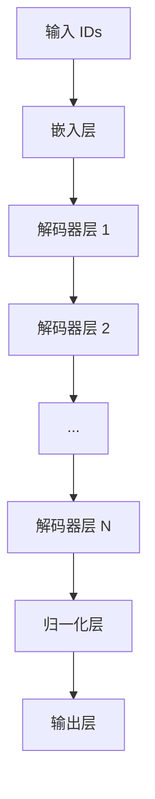
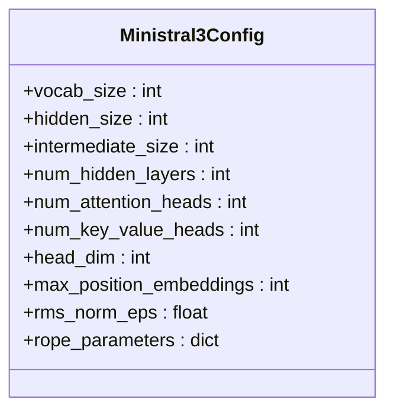
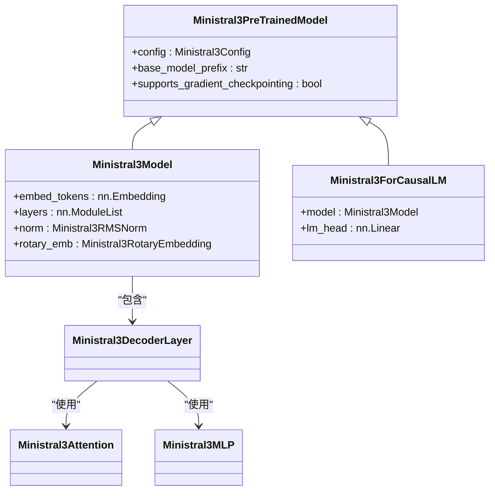
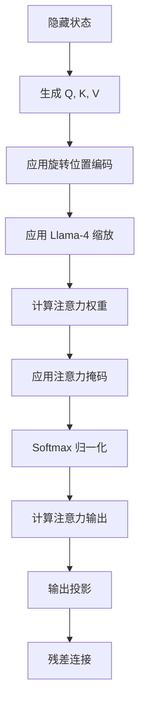
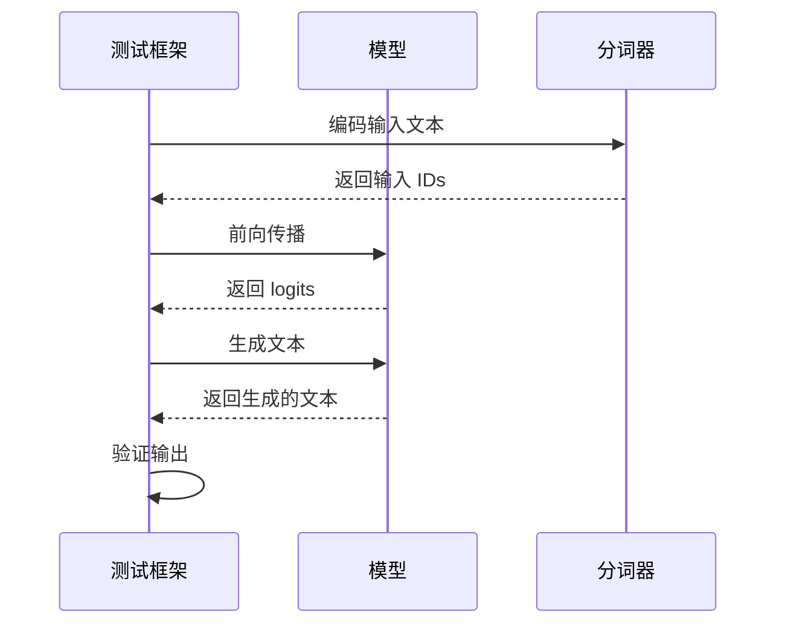

# Ministral3 模型

<cite>
**本文档中引用的文件**   
- [configuration_ministral3.py](file://src/transformers/models/ministral3/configuration_ministral3.py)
- [modeling_ministral3.py](file://src/transformers/models/ministral3/modeling_ministral3.py)
- [modular_ministral3.py](file://src/transformers/models/ministral3/modular_ministral3.py)
- [convert_ministral3_weights_to_hf.py](file://src/transformers/models/ministral3/convert_ministral3_weights_to_hf.py)
- [test_modeling_ministral3.py](file://tests/models/ministral3/test_modeling_ministral3.py)
- [ministral3.md](file://docs/source/en/model_doc/ministral3.md)
</cite>

## 目录
1. [简介](#简介)
2. [核心架构](#核心架构)
3. [配置参数](#配置参数)
4. [模型实现](#模型实现)
5. [注意力机制](#注意力机制)
6. [权重转换](#权重转换)
7. [测试与验证](#测试与验证)
8. [使用示例](#使用示例)

## 简介

Ministral3 是一个高效的小型语言模型，属于 Ministral 3 系列。该模型专为边缘设备部署而设计，能够在各种硬件上运行。Ministral3 支持视觉功能，能够分析图像并提供基于视觉内容的见解，同时支持多种语言，包括英语、法语、西班牙语、德语、意大利语、葡萄牙语、荷兰语、中文、日语、韩语和阿拉伯语。

该模型具有以下关键特性：
- **视觉能力**：支持图像分析和视觉内容理解
- **多语言支持**：支持数十种语言
- **系统提示**：对系统提示有强支持
- **智能代理能力**：原生支持函数调用和 JSON 输出
- **边缘优化**：在小规模设备上提供最佳性能
- **大上下文窗口**：支持 256k 的上下文窗口
- **开源许可**：采用 Apache 2.0 许可证

**Section sources**
- [ministral3.md](file://docs/source/en/model_doc/ministral3.md#L22-L40)

## 核心架构

Ministral3 模型基于 Transformer 架构，采用了现代化的深度学习技术。模型的核心组件包括嵌入层、多个解码器层和归一化层。每个解码器层包含自注意力机制和前馈神经网络。

模型的主要架构特点包括：
- 使用 RMS 归一化（RMSNorm）而非传统的 LayerNorm
- 采用分组查询注意力（Grouped Query Attention）机制
- 支持滑动窗口注意力
- 使用旋转位置编码（RoPE）进行位置信息编码



**Diagram sources **
- [modeling_ministral3.py](file://src/transformers/models/ministral3/modeling_ministral3.py#L347-L423)

## 配置参数

Ministral3 模型的配置参数定义了模型的架构和行为。主要配置参数包括：

| 参数 | 默认值 | 描述 |
|------|-------|------|
| vocab_size | 131072 | 词汇表大小 |
| hidden_size | 4096 | 嵌入和隐藏状态的维度 |
| intermediate_size | 14336 | 前馈层的维度 |
| num_hidden_layers | 34 | 解码器层数量 |
| num_attention_heads | 32 | 注意力头数量 |
| num_key_value_heads | 8 | 键值头数量 |
| head_dim | 128 | 注意力头维度 |
| max_position_embeddings | 262144 | 最大序列长度 |
| rms_norm_eps | 1e-5 | RMS 归一化的 epsilon 值 |



**Diagram sources **
- [configuration_ministral3.py](file://src/transformers/models/ministral3/configuration_ministral3.py#L27-L201)

**Section sources**
- [configuration_ministral3.py](file://src/transformers/models/ministral3/configuration_ministral3.py#L27-L201)

## 模型实现

Ministral3 模型的实现基于模块化设计，继承了 Mistral 模型的基本架构，并进行了特定的优化和修改。模型的主要实现类包括：

- `Ministral3Model`：基础模型类
- `Ministral3ForCausalLM`：因果语言模型类
- `Ministral3ForSequenceClassification`：序列分类模型类
- `Ministral3ForTokenClassification`：标记分类模型类
- `Ministral3ForQuestionAnswering`：问答模型类

模型的实现采用了以下关键技术：
- 模块化继承：从 Mistral 模型继承并扩展功能
- 自动文档生成：使用 `@auto_docstring` 装饰器自动生成文档
- 梯度检查点：支持梯度检查点以减少内存使用
- 闪存注意力：支持闪存注意力机制以提高性能



**Diagram sources **
- [modeling_ministral3.py](file://src/transformers/models/ministral3/modeling_ministral3.py#L263-L521)

**Section sources**
- [modeling_ministral3.py](file://src/transformers/models/ministral3/modeling_ministral3.py#L263-L521)

## 注意力机制

Ministral3 模型的注意力机制是其性能的关键。模型采用了改进的自注意力机制，主要特点包括：

1. **分组查询注意力**：通过 `num_key_value_heads` 参数控制，当 `num_key_value_heads < num_attention_heads` 时使用分组查询注意力
2. **旋转位置编码**：使用 Yarn 类型的 RoPE 编码，支持长序列
3. **Llama-4 缩放**：在注意力计算中应用 Llama-4 缩放因子

注意力机制的实现细节：
- 查询、键和值通过线性投影生成
- 使用旋转位置编码对查询和键进行位置信息编码
- 应用 Llama-4 缩放因子调整查询
- 支持缓存机制以提高推理效率



**Diagram sources **
- [modeling_ministral3.py](file://src/transformers/models/ministral3/modeling_ministral3.py#L115-L179)

**Section sources**
- [modeling_ministral3.py](file://src/transformers/models/ministral3/modeling_ministral3.py#L115-L179)

## 权重转换

Ministral3 模型提供了从原始权重格式转换为 Hugging Face 格式的工具。权重转换脚本 `convert_ministral3_weights_to_hf.py` 负责将模型权重从原始格式转换为标准的 Hugging Face 格式。

转换过程包括：
1. 读取原始配置文件和权重文件
2. 映射权重键名到 Hugging Face 格式
3. 转换配置参数
4. 保存转换后的模型和分词器

主要转换映射：
- `output.weight` → `lm_head.weight`
- `norm.weight` → `model.norm.weight`
- `tok_embeddings.weight` → `model.embed_tokens.weight`
- `layers.*.attention_norm.weight` → `model.layers.*.input_layernorm.weight`

**Section sources**
- [convert_ministral3_weights_to_hf.py](file://src/transformers/models/ministral3/convert_ministral3_weights_to_hf.py#L38-L73)

## 测试与验证

Ministral3 模型包含完整的测试套件，确保模型的正确性和性能。测试主要包括：

1. **模型测试**：验证模型的基本功能和输出
2. **集成测试**：验证模型在实际场景中的表现
3. **精度测试**：验证模型输出的数值精度

测试特点：
- 使用 `CausalLMModelTest` 基类进行测试
- 包含不同设备上的测试用例
- 验证模型生成的 logits 和文本输出



**Diagram sources **
- [test_modeling_ministral3.py](file://tests/models/ministral3/test_modeling_ministral3.py#L47-L135)

**Section sources**
- [test_modeling_ministral3.py](file://tests/models/ministral3/test_modeling_ministral3.py#L47-L135)

## 使用示例

Ministral3 模型可以通过 Hugging Face Transformers 库轻松使用。以下是一个基本的使用示例：

```python
from transformers import AutoTokenizer, Ministral3ForCausalLM

# 加载分词器和模型
tokenizer = AutoTokenizer.from_pretrained("meta-ministral3/Ministral3-2-7b-hf")
model = Ministral3ForCausalLM.from_pretrained("meta-ministral3/Ministral3-2-7b-hf")

# 准备输入
input_text = "Hello, how are you?"
inputs = tokenizer(input_text, return_tensors="pt")

# 生成输出
outputs = model.generate(**inputs, max_length=50)
result = tokenizer.decode(outputs[0], skip_special_tokens=True)
```

对于多模态任务，可以使用支持图像的版本：

```python
from transformers import Mistral3ForConditionalGeneration, MistralCommonBackend

# 加载多模态模型
model = Mistral3ForConditionalGeneration.from_pretrained("mistralai/Ministral-3-3B-Instruct-2512", device_map="auto")
tokenizer = MistralCommonBackend.from_pretrained("mistralai/Ministral-3-3B-Instruct-2512")

# 处理包含图像的输入
messages = [
    {
        "role": "user",
        "content": [
            {"type": "text", "text": "What action do you think I should take?"},
            {"type": "image_url", "image_url": {"url": "image_url"}}
        ],
    },
]

# 生成响应
tokenized = tokenizer.apply_chat_template(messages, return_tensors="pt", return_dict=True)
output = model.generate(**tokenized, max_new_tokens=512)
```

**Section sources**
- [ministral3.md](file://docs/source/en/model_doc/ministral3.md#L43-L84)