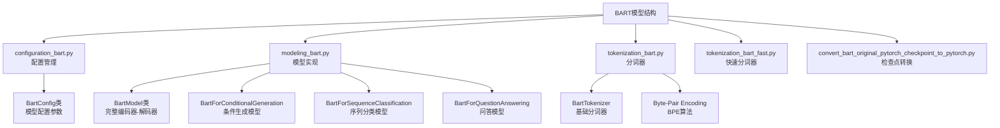
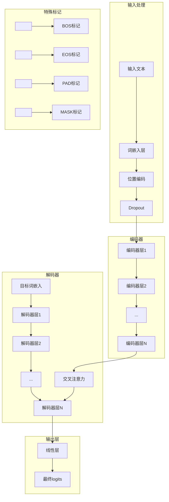
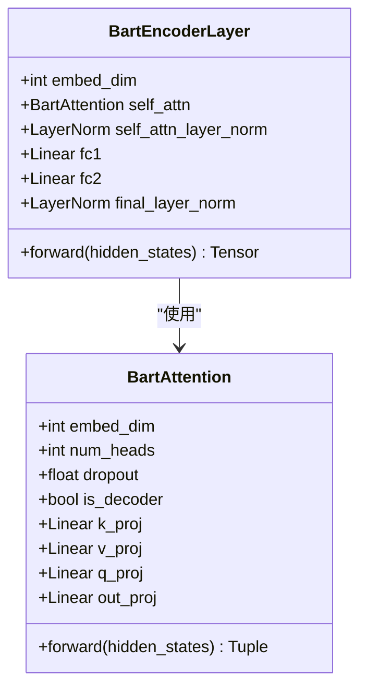
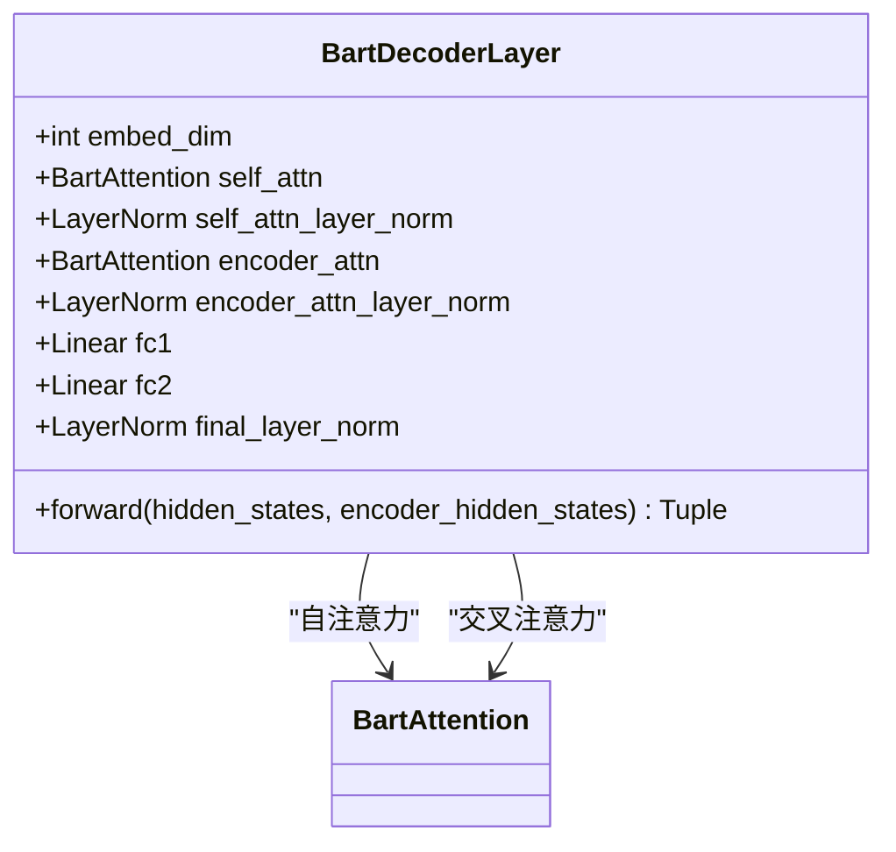
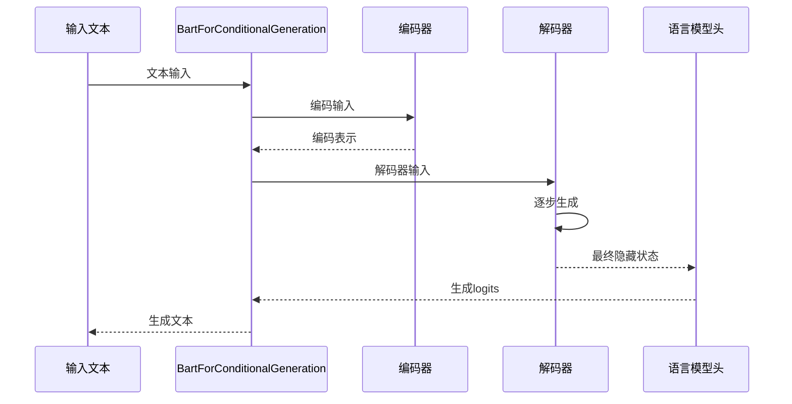
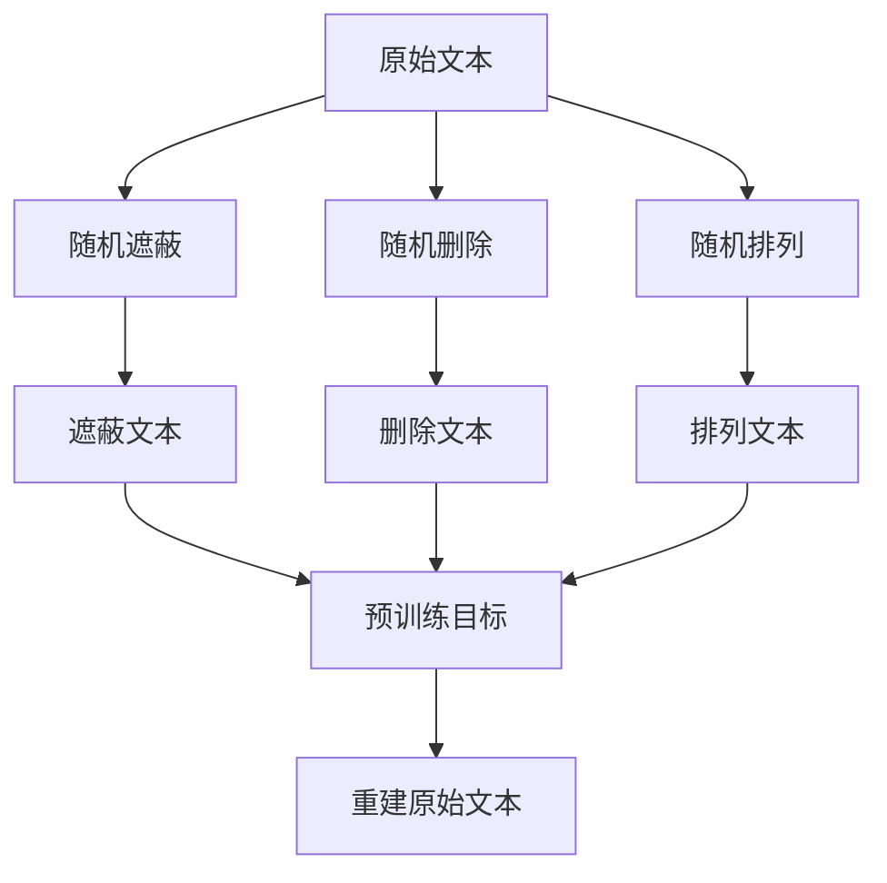

# BART模型

<cite>
**本文档中引用的文件**
- [configuration_bart.py](file://src/transformers/models/bart/configuration_bart.py)
- [modeling_bart.py](file://src/transformers/models/bart/modeling_bart.py)
- [tokenization_bart.py](file://src/transformers/models/bart/tokenization_bart.py)
- [run_summarization.py](file://examples/pytorch/summarization/run_summarization.py)
- [test_modeling_bart.py](file://tests/models/bart/test_modeling_bart.py)
</cite>

## 目录
1. [简介](#简介)
2. [项目结构](#项目结构)
3. [核心组件](#核心组件)
4. [架构概览](#架构概览)
5. [详细组件分析](#详细组件分析)
6. [预训练机制](#预训练机制)
7. [使用示例](#使用示例)
8. [性能考虑](#性能考虑)
9. [故障排除指南](#故障排除指南)
10. [结论](#结论)

## 简介

BART（Bidirectional and Auto-Regressive Transformers）是一种基于Transformer的编码器-解码器架构，专门设计用于文本生成任务。它通过随机遮蔽、删除和排列文本来进行预训练，使其能够有效地处理各种自然语言处理任务，包括文本摘要、机器翻译、文本修复等。

BART的核心创新在于其去噪自编码器框架，该框架通过破坏输入文本并要求模型重建原始文本来学习强大的上下文表示。这种预训练策略使得BART在多种下游任务上表现出色。

## 项目结构

BART模型的实现位于`src/transformers/models/bart/`目录下，包含以下核心文件：



**图表来源**
- [configuration_bart.py](file://src/transformers/models/bart/configuration_bart.py#L1-L178)
- [modeling_bart.py](file://src/transformers/models/bart/modeling_bart.py#L1-L200)
- [tokenization_bart.py](file://src/transformers/models/bart/tokenization_bart.py#L1-L100)

**章节来源**
- [configuration_bart.py](file://src/transformers/models/bart/configuration_bart.py#L1-L178)
- [modeling_bart.py](file://src/transformers/models/bart/modeling_bart.py#L1-L200)
- [tokenization_bart.py](file://src/transformers/models/bart/tokenization_bart.py#L1-L100)

## 核心组件

### BartConfig配置类

BartConfig是BART模型的核心配置类，定义了所有重要的超参数：

| 参数名称 | 默认值 | 类型 | 描述 |
|---------|--------|------|------|
| vocab_size | 50265 | int | 词汇表大小 |
| d_model | 1024 | int | 模型维度 |
| encoder_layers | 12 | int | 编码器层数 |
| decoder_layers | 12 | int | 解码器层数 |
| encoder_attention_heads | 16 | int | 编码器注意力头数 |
| decoder_attention_heads | 16 | int | 解码器注意力头数 |
| encoder_ffn_dim | 4096 | int | 编码器前馈网络维度 |
| decoder_ffn_dim | 4096 | int | 解码器前馈网络维度 |
| dropout | 0.1 | float | Dropout概率 |
| attention_dropout | 0.0 | float | 注意力Dropout概率 |
| max_position_embeddings | 1024 | int | 最大位置嵌入长度 |

### 主要模型类

BART提供了多个预训练模型变体：

- **BartModel**: 基础的编码器-解码器模型
- **BartForConditionalGeneration**: 条件生成模型，支持文本摘要和翻译
- **BartForSequenceClassification**: 序列分类模型
- **BartForQuestionAnswering**: 问答模型
- **BartForCausalLM**: 自回归语言模型

**章节来源**
- [configuration_bart.py](file://src/transformers/models/bart/configuration_bart.py#L40-L178)
- [modeling_bart.py](file://src/transformers/models/bart/modeling_bart.py#L900-L1044)

## 架构概览

BART采用标准的编码器-解码器架构，具有以下特点：



**图表来源**
- [modeling_bart.py](file://src/transformers/models/bart/modeling_bart.py#L667-L701)
- [modeling_bart.py](file://src/transformers/models/bart/modeling_bart.py#L262-L283)

**章节来源**
- [modeling_bart.py](file://src/transformers/models/bart/modeling_bart.py#L900-L1044)

## 详细组件分析

### BartEncoder编码器

编码器由多个BartEncoderLayer堆叠而成，每个层包含：



**图表来源**
- [modeling_bart.py](file://src/transformers/models/bart/modeling_bart.py#L262-L283)
- [modeling_bart.py](file://src/transformers/models/bart/modeling_bart.py#L150-L220)

### BartDecoder解码器

解码器结构与编码器类似，但增加了交叉注意力机制：



**图表来源**
- [modeling_bart.py](file://src/transformers/models/bart/modeling_bart.py#L667-L701)
- [modeling_bart.py](file://src/transformers/models/bart/modeling_bart.py#L337-L362)

### BartForConditionalGeneration条件生成模型

这是最常用的BART模型变体，支持文本生成任务：



**图表来源**
- [modeling_bart.py](file://src/transformers/models/bart/modeling_bart.py#L1052-L1232)
- [modeling_bart.py](file://src/transformers/models/bart/modeling_bart.py#L1000-L1044)

**章节来源**
- [modeling_bart.py](file://src/transformers/models/bart/modeling_bart.py#L667-L701)
- [modeling_bart.py](file://src/transformers/models/bart/modeling_bart.py#L1052-L1232)

## 预训练机制

### 去噪自编码器框架

BART采用去噪自编码器（Denoising Autoencoder）进行预训练，通过以下三种方式破坏输入文本：

1. **随机遮蔽（Masking）**: 随机选择一定比例的token并用[MASK]标记替换
2. **随机删除（Deletion）**: 随机删除某些token
3. **随机排列（Permutation）**: 打乱句子中连续片段的顺序



### 预训练损失函数

BART使用掩码语言建模（MLM）损失进行预训练：

$$\mathcal{L} = -\frac{1}{N}\sum_{i=1}^{N}\sum_{j=1}^{V}\mathbb{I}(y_{ij} \neq -100)\log P(x_{ij} = y_{ij} | \hat{x}_{i})$$

其中：
- $N$ 是批次大小
- $V$ 是词汇表大小
- $y_{ij}$ 是真实标签
- $\hat{x}_{i}$ 是模型预测
- $\mathbb{I}$ 是指示函数

**章节来源**
- [modeling_bart.py](file://src/transformers/models/bart/modeling_bart.py#L1052-L1232)

## 使用示例

### 加载预训练模型

```python
from transformers import AutoTokenizer, BartForConditionalGeneration

# 加载预训练模型和分词器
tokenizer = AutoTokenizer.from_pretrained("facebook/bart-large-cnn")
model = BartForConditionalGeneration.from_pretrained("facebook/bart-large-cnn")
```

### 文本摘要示例

以下是使用BART进行文本摘要的具体实现：

```python
# 文本摘要示例
ARTICLE_TO_SUMMARIZE = """
PG&E stated it scheduled the blackouts in response to forecasts for high winds 
amid dry conditions. The aim is to reduce the risk of wildfires. Nearly 800 thousand customers were 
scheduled to be affected by the shutoffs which were expected to last through at least midday tomorrow.
"""

# 分词和编码
inputs = tokenizer([ARTICLE_TO_SUMMARIZE], max_length=1024, return_tensors="pt")

# 生成摘要
summary_ids = model.generate(
    inputs["input_ids"], 
    num_beams=2, 
    min_length=0, 
    max_length=20
)

# 解码结果
summary = tokenizer.batch_decode(summary_ids, skip_special_tokens=True, clean_up_tokenization_spaces=False)[0]
print(summary)
```

### 微调配置

```python
# 微调配置示例
from transformers import BartConfig

# 自定义配置
config = BartConfig(
    vocab_size=50000,
    d_model=768,
    encoder_layers=6,
    decoder_layers=6,
    encoder_attention_heads=12,
    decoder_attention_heads=12,
    encoder_ffn_dim=3072,
    decoder_ffn_dim=3072,
    dropout=0.1,
    attention_dropout=0.1,
    max_position_embeddings=1024
)

# 创建模型
model = BartForConditionalGeneration(config)
```

### 特殊标记处理

BartTokenizer支持以下特殊标记：

| 标记类型 | 标记符号 | 用途 |
|---------|----------|------|
| BOS | `<s>` | 句子开始标记 |
| EOS | `</s>` | 句子结束标记 |
| PAD | `<pad>` | 填充标记 |
| MASK | `<mask>` | 掩码标记 |
| UNK | `<unk>` | 未知标记 |

**章节来源**
- [modeling_bart.py](file://src/transformers/models/bart/modeling_bart.py#L1052-L1232)
- [tokenization_bart.py](file://src/transformers/models/bart/tokenization_bart.py#L100-L200)

## 性能考虑

### 内存占用

BART模型的内存占用主要取决于以下因素：

1. **模型大小**: 不同版本的BART模型（base、large、xl）具有不同的参数量
2. **序列长度**: 更长的输入序列会显著增加内存使用
3. **批次大小**: 批次大小直接影响显存占用

### 性能优化建议

1. **梯度检查点**: 启用梯度检查点以减少内存使用
2. **混合精度**: 使用FP16或BF16精度训练
3. **模型并行**: 在多GPU环境中使用模型并行
4. **动态批处理**: 使用动态批处理调整序列长度

### 模型变体对比

| 模型版本 | 参数量 | 内存占用 | 推理速度 | 适用场景 |
|---------|--------|----------|----------|----------|
| BART-base | ~400M | ~1.5GB | 快速 | 资源受限环境 |
| BART-large | ~1.4B | ~5.5GB | 中等 | 平衡性能和资源 |
| BART-xl | ~3.5B | ~13GB | 较慢 | 高质量需求 |

## 故障排除指南

### 常见问题及解决方案

1. **内存不足错误**
   - 减少批次大小
   - 使用梯度累积
   - 启用CPU offloading

2. **分词问题**
   - 检查特殊标记的使用
   - 确认词汇表兼容性
   - 处理未登录词

3. **训练不稳定**
   - 调整学习率
   - 使用学习率调度器
   - 检查数据预处理

### 调试工具

```python
# 模型配置验证
def validate_bart_config(config):
    assert config.d_model % config.encoder_attention_heads == 0, "d_model必须能被注意力头数整除"
    assert config.max_position_embeddings > 0, "最大位置嵌入必须大于0"
    assert config.dropout >= 0 and config.dropout < 1, "Dropout概率应在[0,1)范围内"
```

**章节来源**
- [configuration_bart.py](file://src/transformers/models/bart/configuration_bart.py#L40-L178)
- [test_modeling_bart.py](file://tests/models/bart/test_modeling_bart.py#L113-L142)

## 结论

BART模型作为一种强大的编码器-解码器架构，在多种自然语言处理任务中展现出色性能。其独特的去噪自编码器预训练机制使其能够学习丰富的上下文表示，同时保持灵活的架构设计。

通过合理配置模型参数、优化训练过程和正确使用特殊标记，开发者可以在各种应用场景中充分利用BART的强大能力。随着模型规模的不断扩展和优化技术的进步，BART将继续在自然语言处理领域发挥重要作用。