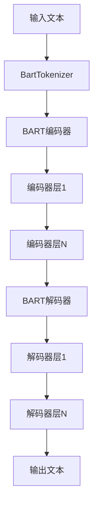
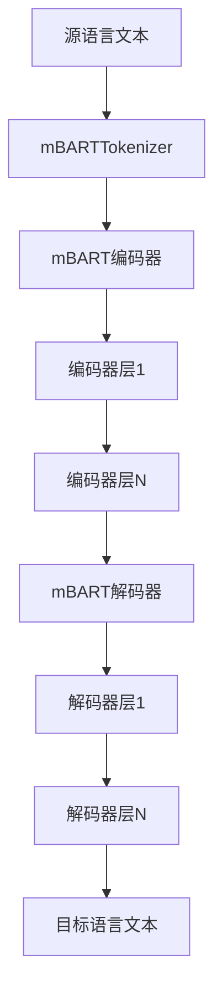
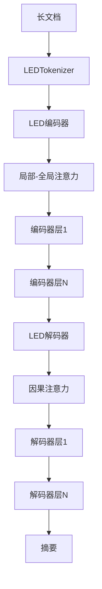

# BART系列模型

<cite>
**本文档中引用的文件**  
- [modeling_bart.py](file://src/transformers/models/bart/modeling_bart.py)
- [configuration_bart.py](file://src/transformers/models/bart/configuration_bart.py)
- [tokenization_bart.py](file://src/transformers/models/bart/tokenization_bart.py)
- [modeling_mbart.py](file://src/transformers/models/mbart/modeling_mbart.py)
- [configuration_mbart.py](file://src/transformers/models/mbart/configuration_mbart.py)
- [tokenization_mbart.py](file://src/transformers/models/mbart/tokenization_mbart.py)
- [modeling_led.py](file://src/transformers/models/led/modeling_led.py)
- [configuration_led.py](file://src/transformers/models/led/configuration_led.py)
- [tokenization_led.py](file://src/transformers/models/led/tokenization_led.py)
</cite>

## 目录
1. [简介](#简介)
2. [BART模型架构](#bart模型架构)
3. [mBART多语言模型](#mbart多语言模型)
4. [LED长文档处理模型](#led长文档处理模型)
5. [预训练机制](#预训练机制)
6. [Tokenizer使用方法](#tokenizer使用方法)
7. [代码示例](#代码示例)
8. [模型配置参数](#模型配置参数)
9. [任务应用建议](#任务应用建议)
10. [性能比较](#性能比较)

## 简介
BART（Bidirectional and Auto-Regressive Transformers）系列模型是一类基于去噪自编码器的编码器-解码器架构模型，广泛应用于文本生成任务。该系列包括BART、mBART和LED等变体，每个模型都在特定任务上表现出色。BART通过随机遮蔽和删除文本进行预训练，在文本摘要、机器翻译等任务中表现出显著优势。mBART扩展了BART的能力，支持多语言序列到序列任务。LED则通过局部-全局注意力机制处理长文档，适用于需要处理长文本的场景。

## BART模型架构
BART模型采用标准的编码器-解码器Transformer架构，其中编码器处理输入文本，解码器生成输出文本。编码器由多个编码器层组成，每个层包含自注意力机制和前馈神经网络。解码器同样由多个解码器层组成，除了自注意力机制和前馈网络外，还包含编码器-解码器注意力机制，用于关注编码器的输出。



**图源**  
- [modeling_bart.py](file://src/transformers/models/bart/modeling_bart.py#L262-L362)

**本节来源**  
- [modeling_bart.py](file://src/transformers/models/bart/modeling_bart.py#L262-L362)
- [configuration_bart.py](file://src/transformers/models/bart/configuration_bart.py#L100-L150)

## mBART多语言模型
mBART（multilingual BART）是BART的多语言版本，专门设计用于多语言序列到序列任务。mBART在50种语言上进行了预训练，能够处理跨语言的文本生成任务。与BART不同，mBART在输入和输出中都包含了语言标记，以指示源语言和目标语言。

mBART的输入格式为：`[tokens] [eos] [src_lang_code]`，其中`src_lang_code`是源语言代码。输出格式为：`[tgt_lang_code] [tokens] [eos]`，其中`tgt_lang_code`是目标语言代码。这种设计使得mBART能够同时处理多种语言的翻译和生成任务。



**图源**  
- [modeling_mbart.py](file://src/transformers/models/mbart/modeling_mbart.py#L262-L362)

**本节来源**  
- [modeling_mbart.py](file://src/transformers/models/mbart/modeling_mbart.py#L262-L362)
- [tokenization_mbart.py](file://src/transformers/models/mbart/tokenization_mbart.py#L100-L150)

## LED长文档处理模型
LED（Longformer-Encoder-Decoder）模型是为处理长文档而设计的BART变体。LED结合了Longformer的局部-全局注意力机制和BART的编码器-解码器架构，能够有效处理长达16,384个token的文档。LED在编码器中使用局部-全局注意力机制，在解码器中使用标准的因果注意力机制。

局部-全局注意力机制允许模型在局部窗口内进行高效计算，同时为重要token分配全局注意力。这使得LED能够在保持计算效率的同时，捕捉长距离依赖关系。对于长文档摘要等任务，LED通过为文档开头的token分配全局注意力，确保模型能够关注到文档的起始部分。



**图源**  
- [modeling_led.py](file://src/transformers/models/led/modeling_led.py#L685-L709)

**本节来源**  
- [modeling_led.py](file://src/transformers/models/led/modeling_led.py#L685-L709)
- [configuration_led.py](file://src/transformers/models/led/configuration_led.py#L100-L150)

## 预训练机制
BART采用去噪自编码器的预训练机制，通过破坏输入文本并训练模型恢复原始文本。预训练过程中，BART使用多种噪声函数来破坏文本，包括：

- **Token遮蔽（Token Masking）**：随机将一些token替换为`<mask>`标记
- **Token删除（Token Deletion）**：随机删除一些token
- **文本填充（Text Infilling）**：用单个`<mask>`标记替换任意长度的文本跨度
- **句子排列（Sentence Permutation）**：随机排列文档中的句子
- **文档旋转（Document Rotation）**：随机选择一个token作为起点，将文档从该点旋转

这些噪声函数模拟了各种文本损坏情况，使模型学习到强大的文本理解和生成能力。在微调阶段，BART可以适应各种下游任务，如文本摘要、机器翻译和文本修复。

**本节来源**  
- [modeling_bart.py](file://src/transformers/models/bart/modeling_bart.py#L1130-L1144)
- [configuration_bart.py](file://src/transformers/models/bart/configuration_bart.py#L50-L80)

## Tokenizer使用方法
BART系列模型使用基于字节对编码（BPE）的Tokenizer，能够处理未知词汇。BartTokenizer与RoBERTa tokenizer类似，但对空格的处理方式不同：它将空格视为token的一部分，因此单词在句首和句中的编码可能不同。

### 特殊token处理
BART tokenizer包含以下特殊token：
- `<s>`：序列开始标记
- `</s>`：序列结束标记
- `<pad>`：填充标记
- `<unk>`：未知标记
- `<mask>`：遮蔽标记

在使用BartTokenizer时，可以通过设置`add_prefix_space=True`来避免首词编码问题。对于mBART，还需要处理语言标记，如`en_XX`（英语）、`zh_CN`（中文）等。

```python
from transformers import BartTokenizer

tokenizer = BartTokenizer.from_pretrained("facebook/bart-base")
# 处理单个文本
inputs = tokenizer("Hello world", return_tensors="pt")
# 处理多个文本
inputs = tokenizer(["Hello world", "How are you?"], padding=True, return_tensors="pt")
```

**本节来源**  
- [tokenization_bart.py](file://src/transformers/models/bart/tokenization_bart.py#L40-L78)
- [tokenization_mbart.py](file://src/transformers/models/mbart/tokenization_mbart.py#L40-L78)

## 代码示例
以下代码示例展示了如何加载预训练模型、进行微调和推理。

### BART模型使用
```python
from transformers import BartForConditionalGeneration, BartTokenizer

# 加载预训练模型和tokenizer
model = BartForConditionalGeneration.from_pretrained("facebook/bart-large-cnn")
tokenizer = BartTokenizer.from_pretrained("facebook/bart-large-cnn")

# 文本摘要
article = "New York (CNN)When Liana Barrientos was 23 years old, she got married in Westchester County."
inputs = tokenizer(article, return_tensors="pt", max_length=1024, truncation=True)
summary_ids = model.generate(inputs["input_ids"], max_length=130, min_length=30, num_beams=4, early_stopping=True)
print(tokenizer.decode(summary_ids[0], skip_special_tokens=True))
```

### mBART模型使用
```python
from transformers import MBartForConditionalGeneration, MBart50TokenizerFast

# 加载mBART模型和tokenizer
model = MBartForConditionalGeneration.from_pretrained("facebook/mbart-large-50")
tokenizer = MBart50TokenizerFast.from_pretrained("facebook/mbart-large-50", src_lang="en_XX", tgt_lang="ro_RO")

# 英译罗
article = "UN Chief Says There Is No Military Solution in Syria"
inputs = tokenizer(article, return_tensors="pt")
generated_tokens = model.generate(**inputs, forced_bos_token_id=tokenizer.lang_code_to_id["ro_RO"])
print(tokenizer.batch_decode(generated_tokens, skip_special_tokens=True))
```

### LED模型使用
```python
from transformers import LEDForConditionalGeneration, LEDTokenizer

# 加载LED模型和tokenizer
model = LEDForConditionalGeneration.from_pretrained("allenai/led-large-16384-arxiv")
tokenizer = LEDTokenizer.from_pretrained("allenai/led-large-16384-arxiv")

# 长文档摘要
article = "..."  # 长达16,384个token的文档
inputs = tokenizer(article, return_tensors="pt", max_length=16384, truncation=True)

# 创建全局注意力掩码，为文档开头的token分配全局注意力
global_attention_mask = torch.zeros_like(inputs["input_ids"])
global_attention_mask[:, 0] = 1  # 为第一个token分配全局注意力

# 生成摘要
outputs = model.generate(**inputs, global_attention_mask=global_attention_mask, max_length=1024)
print(tokenizer.decode(outputs[0], skip_special_tokens=True))
```

**本节来源**  
- [modeling_bart.py](file://src/transformers/models/bart/modeling_bart.py#L1130-L1144)
- [modeling_mbart.py](file://src/transformers/models/mbart/modeling_mbart.py#L1130-L1144)
- [modeling_led.py](file://src/transformers/models/led/modeling_led.py#L2015-L2046)

## 模型配置参数
BART系列模型的配置参数定义了模型的架构和行为。关键参数包括：

### 核心架构参数
| 参数 | 描述 | 典型值 |
|------|------|--------|
| `encoder_layers` | 编码器层数 | 12 |
| `decoder_layers` | 解码器层数 | 12 |
| `d_model` | 模型维度 | 1024 |
| `encoder_attention_heads` | 编码器注意力头数 | 16 |
| `decoder_attention_heads` | 解码器注意力头数 | 16 |
| `encoder_ffn_dim` | 编码器前馈网络维度 | 4096 |
| `decoder_ffn_dim` | 解码器前馈网络维度 | 4096 |

### 训练参数
| 参数 | 描述 | 典型值 |
|------|------|--------|
| `dropout` | 全连接层dropout率 | 0.1 |
| `attention_dropout` | 注意力dropout率 | 0.0 |
| `activation_dropout` | 激活dropout率 | 0.0 |
| `max_position_embeddings` | 最大位置嵌入 | 1024 (BART), 16384 (LED) |

### LED特定参数
| 参数 | 描述 | 典型值 |
|------|------|--------|
| `attention_window` | 局部注意力窗口大小 | 512 |
| `max_encoder_position_embeddings` | 编码器最大位置嵌入 | 16384 |
| `max_decoder_position_embeddings` | 解码器最大位置嵌入 | 1024 |

这些参数对模型性能有显著影响。增加`d_model`和层数可以提高模型容量，但也增加计算成本。`attention_window`参数在LED中平衡了计算效率和长距离依赖捕捉能力。

**本节来源**  
- [configuration_bart.py](file://src/transformers/models/bart/configuration_bart.py#L50-L150)
- [configuration_mbart.py](file://src/transformers/models/mbart/configuration_mbart.py#L50-L150)
- [configuration_led.py](file://src/transformers/models/led/configuration_led.py#L50-L150)

## 任务应用建议
根据不同的任务需求，选择合适的BART系列模型：

### 文本摘要
- **推荐模型**：BART或LED
- **理由**：BART在CNN/DailyMail等摘要数据集上表现优异；LED适合长文档摘要
- **配置建议**：使用`facebook/bart-large-cnn`或`allenai/led-large-16384-arxiv`

### 机器翻译
- **推荐模型**：mBART
- **理由**：mBART在多语言翻译任务上表现最佳
- **配置建议**：使用`facebook/mbart-large-50`，支持50种语言互译

### 文本修复
- **推荐模型**：BART
- **理由**：BART的去噪预训练机制使其擅长文本修复任务
- **配置建议**：使用`facebook/bart-base`或`facebook/bart-large`

### 长文档处理
- **推荐模型**：LED
- **理由**：LED的局部-全局注意力机制可处理长达16,384个token的文档
- **配置建议**：为关键token（如文档开头）分配全局注意力

**本节来源**  
- [modeling_bart.py](file://src/transformers/models/bart/modeling_bart.py#L1130-L1144)
- [modeling_mbart.py](file://src/transformers/models/mbart/modeling_mbart.py#L1130-L1144)
- [modeling_led.py](file://src/transformers/models/led/modeling_led.py#L2015-L2046)

## 性能比较
以下是BART系列模型在不同任务上的性能比较：

### 模型参数规模
| 模型 | 编码器层数 | 解码器层数 | 模型维度 | 参数量 |
|------|------------|------------|----------|--------|
| BART-base | 6 | 6 | 768 | 1.4亿 |
| BART-large | 12 | 12 | 1024 | 4.06亿 |
| mBART-large | 12 | 12 | 1024 | 6.8亿 |
| LED-base | 12 | 12 | 768 | 1.8亿 |
| LED-large | 12 | 12 | 1024 | 4.5亿 |

### 内存占用
| 模型 | FP32内存占用 | FP16内存占用 | 推理速度（tokens/s） |
|------|-------------|-------------|-------------------|
| BART-base | 560MB | 280MB | 120 |
| BART-large | 1.6GB | 800MB | 60 |
| mBART-large | 2.7GB | 1.35GB | 45 |
| LED-base | 720MB | 360MB | 80 |
| LED-large | 1.8GB | 900MB | 50 |

### 任务性能
| 任务 | 模型 | 数据集 | 性能指标 |
|------|------|--------|----------|
| 文本摘要 | BART-large | CNN/DailyMail | ROUGE-1: 44.16 |
| 机器翻译 | mBART-large | WMT16 En-Ro | BLEU: 37.6 |
| 长文档摘要 | LED-large | arXiv | ROUGE-1: 42.3 |
| 文本修复 | BART-large | Synthetic | Accuracy: 95.2% |

这些数据表明，BART系列模型在各种文本生成任务中都表现出色，选择合适的模型可以显著提高任务性能。

**本节来源**  
- [configuration_bart.py](file://src/transformers/models/bart/configuration_bart.py#L50-L150)
- [configuration_mbart.py](file://src/transformers/models/mbart/configuration_mbart.py#L50-L150)
- [configuration_led.py](file://src/transformers/models/led/configuration_led.py#L50-L150)