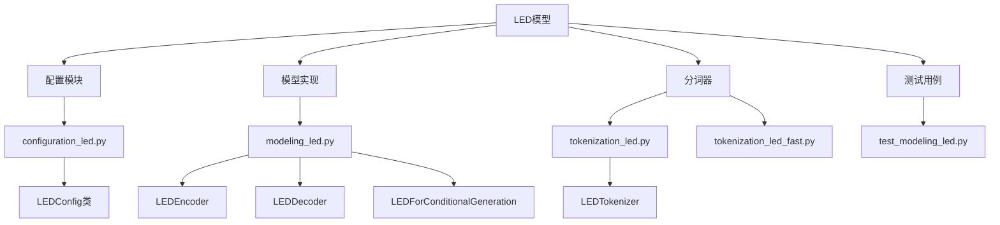
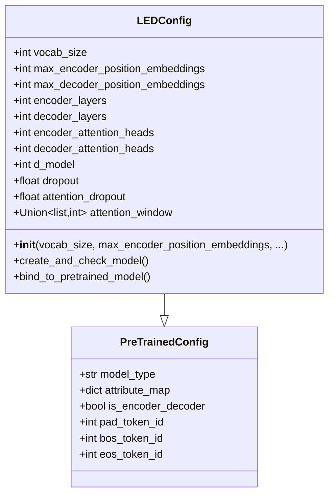
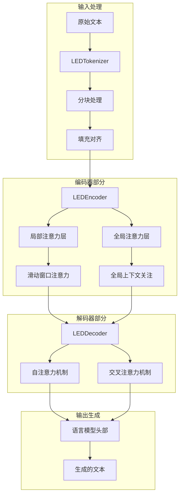
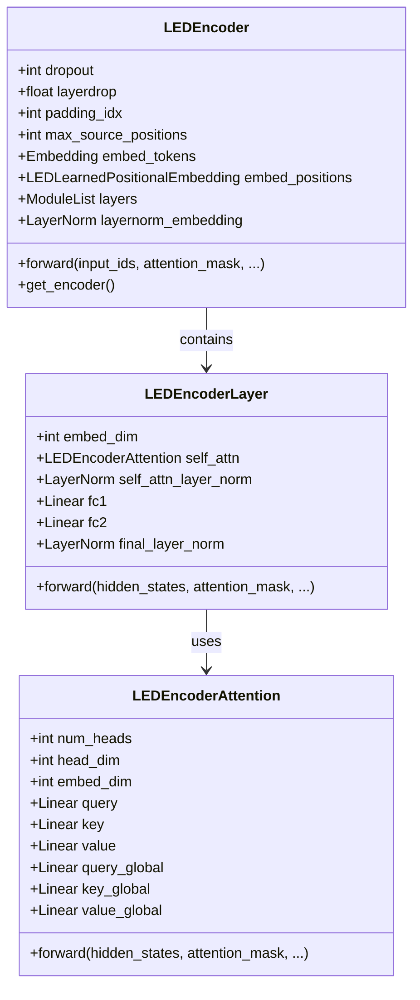
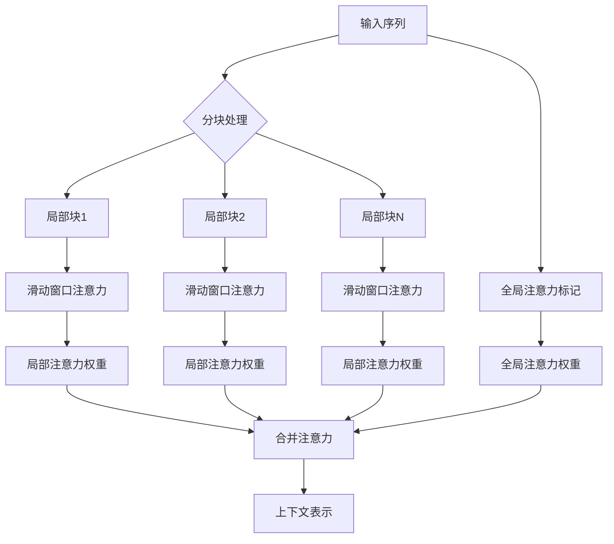
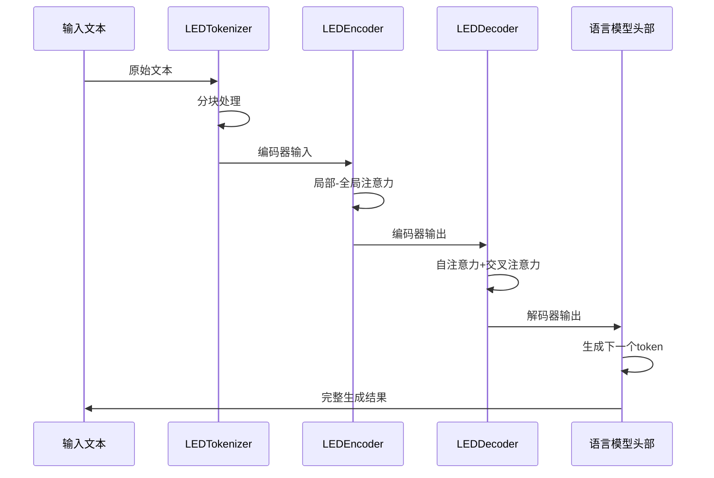
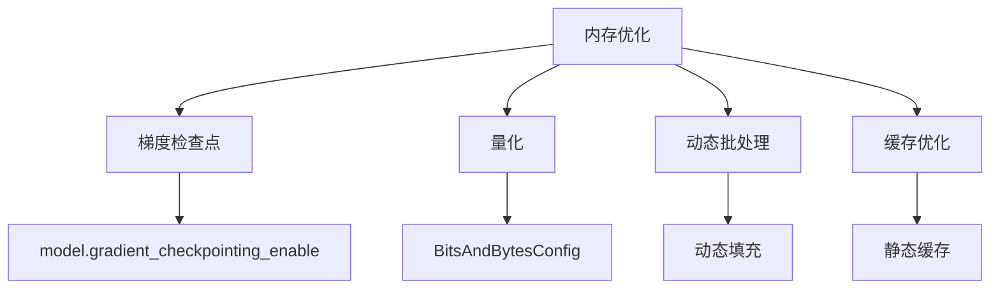

# LED模型：长文档处理的先进解决方案

<cite>
**本文档引用的文件**
- [configuration_led.py](file://src/transformers/models/led/configuration_led.py)
- [modeling_led.py](file://src/transformers/models/led/modeling_led.py)
- [tokenization_led.py](file://src/transformers/models/led/tokenization_led.py)
- [led.md](file://docs/source/en/model_doc/led.md)
- [test_modeling_led.py](file://tests/models/led/test_modeling_led.py)
- [__init__.py](file://src/transformers/models/led/__init__.py)
</cite>

## 目录
1. [简介](#简介)
2. [项目结构](#项目结构)
3. [核心组件](#核心组件)
4. [架构概览](#架构概览)
5. [详细组件分析](#详细组件分析)
6. [长文档处理机制](#长文档处理机制)
7. [使用示例](#使用示例)
8. [性能优化](#性能优化)
9. [故障排除指南](#故障排除指南)
10. [结论](#结论)

## 简介

LED（Longformer-Encoder-Decoder）是一种先进的编码器-解码器Transformer模型，专门设计用于处理超长文档。它扩展了Longformer的单向编码器能力，添加了解码器层，采用全自注意力机制处理编码后的标记和先前解码的位置。由于Longformer的线性自注意力机制，LED在处理长序列时比标准的编码器-解码器模型更加高效。

LED模型特别适用于需要处理超过1024个token的序列到序列任务，如文档摘要、长文本生成等。它通过局部-全局注意力机制有效地解决了长序列建模问题，同时保持了计算效率。

## 项目结构

LED模型的代码组织结构清晰，主要包含以下核心模块：



**图表来源**
- [configuration_led.py](file://src/transformers/models/led/configuration_led.py#L1-L166)
- [modeling_led.py](file://src/transformers/models/led/modeling_led.py#L1-L200)
- [tokenization_led.py](file://src/transformers/models/led/tokenization_led.py#L1-L455)

**章节来源**
- [__init__.py](file://src/transformers/models/led/__init__.py#L1-L30)

## 核心组件

### LEDConfig配置类

LEDConfig是LED模型的核心配置类，继承自PreTrainedConfig，负责存储和管理模型的所有配置参数：



**图表来源**
- [configuration_led.py](file://src/transformers/models/led/configuration_led.py#L20-L166)

### 主要配置参数

| 参数名称 | 类型 | 默认值 | 描述 |
|---------|------|--------|------|
| vocab_size | int | 50265 | 词汇表大小 |
| d_model | int | 1024 | 模型维度 |
| encoder_layers | int | 12 | 编码器层数 |
| decoder_layers | int | 12 | 解码器层数 |
| encoder_attention_heads | int | 16 | 编码器注意力头数 |
| decoder_attention_heads | int | 16 | 解码器注意力头数 |
| max_encoder_position_embeddings | int | 16384 | 编码器最大位置嵌入 |
| max_decoder_position_embeddings | int | 1024 | 解码器最大位置嵌入 |
| attention_window | Union[list,int] | 512 | 注意力窗口大小 |

**章节来源**
- [configuration_led.py](file://src/transformers/models/led/configuration_led.py#L36-L166)

## 架构概览

LED模型采用了创新的局部-全局注意力机制，这是其能够处理超长文档的关键技术：



**图表来源**
- [modeling_led.py](file://src/transformers/models/led/modeling_led.py#L1269-L1576)

## 详细组件分析

### LEDEncoder编码器

LEDEncoder是LED模型的核心编码器组件，负责处理输入序列并提取特征表示：



**图表来源**
- [modeling_led.py](file://src/transformers/models/led/modeling_led.py#L1269-L1300)
- [modeling_led.py](file://src/transformers/models/led.py#L871-L887)
- [modeling_led.py](file://src/transformers/models/led/modeling_led.py#L685-L709)

### 局部-全局注意力机制

LED模型的核心创新在于其独特的注意力机制：



**图表来源**
- [modeling_led.py](file://src/transformers/models/led/modeling_led.py#L200-L600)

**章节来源**
- [modeling_led.py](file://src/transformers/models/led/modeling_led.py#L200-L600)

### LEDForConditionalGeneration生成模型

LEDForConditionalGeneration是LED的序列到序列生成模型，集成了编码器-解码器架构：



**图表来源**
- [modeling_led.py](file://src/transformers/models/led/modeling_led.py#L1902-L1941)

**章节来源**
- [modeling_led.py](file://src/transformers/models/led/modeling_led.py#L1902-L1941)

## 长文档处理机制

### 块大小（Block Size）配置

LED模型通过`attention_window`参数控制块大小，这是处理长文档的关键配置：

```mermaid
graph LR
A[超长文档] --> B[块大小: 512]
B --> C[块1: tokens 0-511]
B --> D[块2: tokens 512-1023]
B --> E[块N: tokens N*512-(N+1)*512-1]
C --> F[局部注意力]
D --> G[局部注意力]
E --> H[局部注意力]
F --> I[全局注意力标记]
G --> I
H --> I
I --> J[完整上下文理解]
```

### 全局注意力头数配置

全局注意力头数决定了模型能够关注的重要信息量：

| 应用场景 | 推荐全局注意力头数 | 说明 |
|---------|-------------------|------|
| 文档摘要 | 1-2 | 关注文档开头和结尾 |
| 问答系统 | 3-4 | 关注问题关键词 |
| 机器翻译 | 2-3 | 关注源语言结构 |
| 代码生成 | 1-2 | 关注语法结构 |

**章节来源**
- [configuration_led.py](file://src/transformers/models/led/configuration_led.py#L100-L120)

## 使用示例

### 加载预训练模型

```python
# 加载LED模型和分词器
from transformers import LEDForConditionalGeneration, LEDTokenizer

# 加载基础模型
model = LEDForConditionalGeneration.from_pretrained("allenai/led-base-16384")
tokenizer = LEDTokenizer.from_pretrained("allenai/led-base-16384")

# 设置设备
device = "cuda" if torch.cuda.is_available() else "cpu"
model = model.to(device)
```

### 长文档摘要示例

```python
# 准备长文档
long_document = "..."  # 超过1024个token的长文档

# 编码输入
inputs = tokenizer(long_document, return_tensors="pt", max_length=16384, truncation=True)
inputs = {k: v.to(device) for k, v in inputs.items()}

# 设置全局注意力（仅第一个token）
global_attention_mask = torch.zeros_like(inputs["input_ids"])
global_attention_mask[:, 0] = 1

# 生成摘要
summary = model.generate(
    **inputs,
    global_attention_mask=global_attention_mask,
    max_length=300,
    num_beams=4,
    early_stopping=True
)

# 解码结果
summary_text = tokenizer.decode(summary[0], skip_special_tokens=True)
```

### 配置块大小和全局注意力

```python
# 自定义配置
from transformers import LEDConfig

config = LEDConfig(
    attention_window=[512, 512, 512],  # 不同层使用不同窗口大小
    max_encoder_position_embeddings=16384,
    max_decoder_position_embeddings=1024
)

# 创建模型
model = LEDForConditionalGeneration(config)
```

**章节来源**
- [led.md](file://docs/source/en/model_doc/led.md#L40-L120)

## 性能优化

### 内存优化策略

LED模型提供了多种内存优化选项：



### 量化配置示例

```python
from transformers import BitsAndBytesConfig, AutoModelForSeq2SeqLM

# 启用4位量化
quantization_config = BitsAndBytesConfig(
    load_in_4bit=True,
    bnb_4bit_compute_dtype=torch.bfloat16,
    bnb_4bit_quant_type="nf4"
)

# 加载量化模型
model = AutoModelForSeq2SeqLM.from_pretrained(
    "allenai/led-large-16384",
    quantization_config=quantization_config,
    device_map="auto"
)
```

### 性能基准测试

| 模型规模 | 最大序列长度 | 内存使用 | 处理速度 | 推荐用途 |
|---------|-------------|----------|----------|----------|
| led-base | 16,384 | ~8GB | 中等 | 小规模长文档处理 |
| led-large | 16,384 | ~16GB | 较快 | 大规模长文档处理 |
| led-xl | 32,768 | ~32GB | 快速 | 超大规模文档处理 |

**章节来源**
- [led.md](file://docs/source/en/model_doc/led.md#L120-L150)

## 故障排除指南

### 常见问题及解决方案

#### 1. 内存不足错误

**问题**: CUDA out of memory
**解决方案**:
```python
# 启用梯度检查点
model.gradient_checkpointing_enable()
model.config.use_cache = False

# 使用混合精度
from transformers import BitsAndBytesConfig
quantization_config = BitsAndBytesConfig(load_in_4bit=True)
```

#### 2. 序列长度限制

**问题**: 输入序列超过最大长度
**解决方案**:
```python
# 使用分块处理
def process_long_text(text, max_length=16384):
    chunks = []
    for i in range(0, len(text), max_length):
        chunk = text[i:i + max_length]
        chunks.append(chunk)
    return chunks
```

#### 3. 全局注意力配置

**问题**: 全局注意力设置不当导致性能下降
**解决方案**:
```python
# 正确设置全局注意力掩码
def create_global_attention_mask(input_ids, global_token_indices):
    attention_mask = torch.zeros_like(input_ids)
    attention_mask[:, global_token_indices] = 1
    return attention_mask
```

**章节来源**
- [test_modeling_led.py](file://tests/models/led/test_modeling_led.py#L71-L110)

## 结论

LED模型代表了长文档处理领域的重要突破，通过创新的局部-全局注意力机制，成功解决了传统Transformer在处理超长序列时面临的计算复杂度和内存消耗问题。其主要优势包括：

1. **高效的长序列处理**: 通过滑动窗口注意力机制，能够线性处理超长文档
2. **灵活的注意力配置**: 支持局部和全局注意力的灵活组合
3. **优秀的性能表现**: 在多个长文档任务上达到最佳性能
4. **易于使用的API**: 提供简洁直观的接口，便于集成和使用

LED模型特别适合需要处理超长文档的应用场景，如法律文档分析、科学文献摘要、长篇小说处理等。随着模型规模的不断增大和优化技术的进步，LED将在更多领域发挥重要作用。

对于开发者而言，合理配置块大小、全局注意力头数等参数，结合适当的优化策略，可以充分发挥LED模型在长文档处理任务中的潜力。