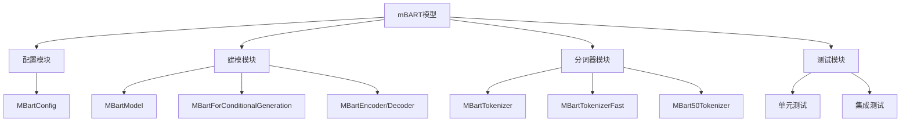
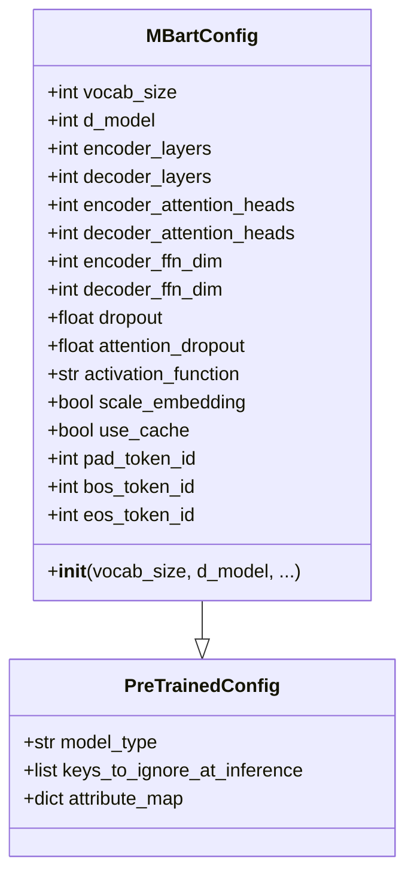
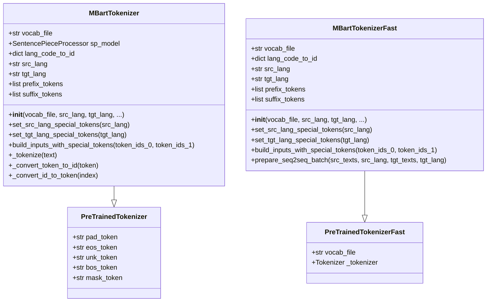
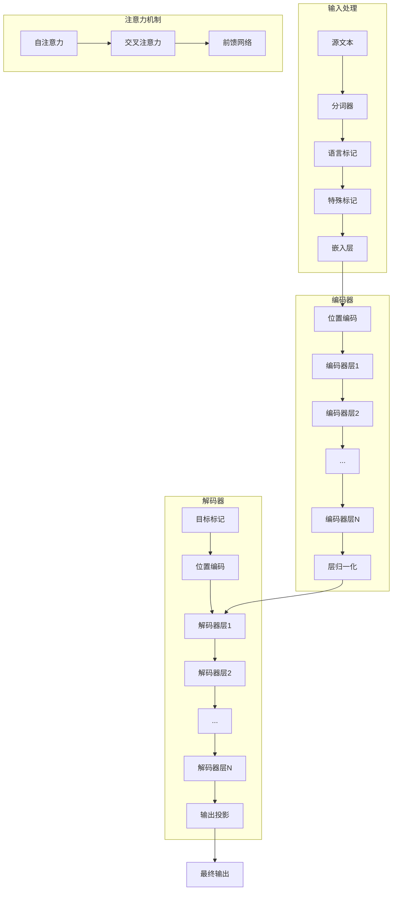
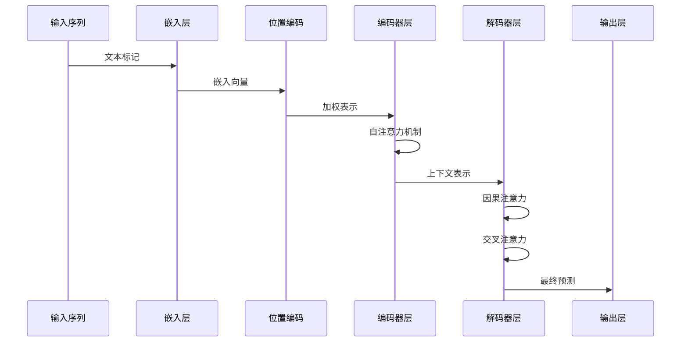
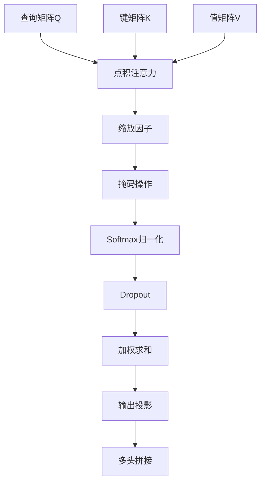
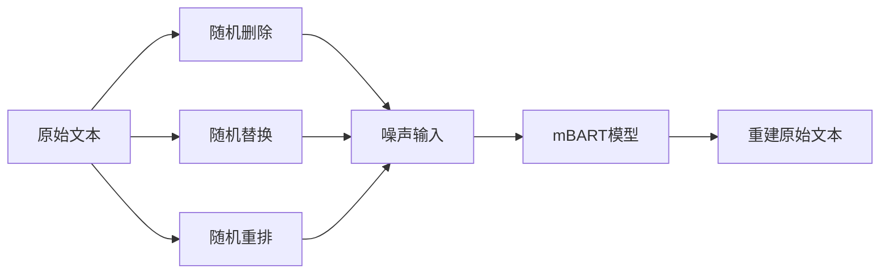
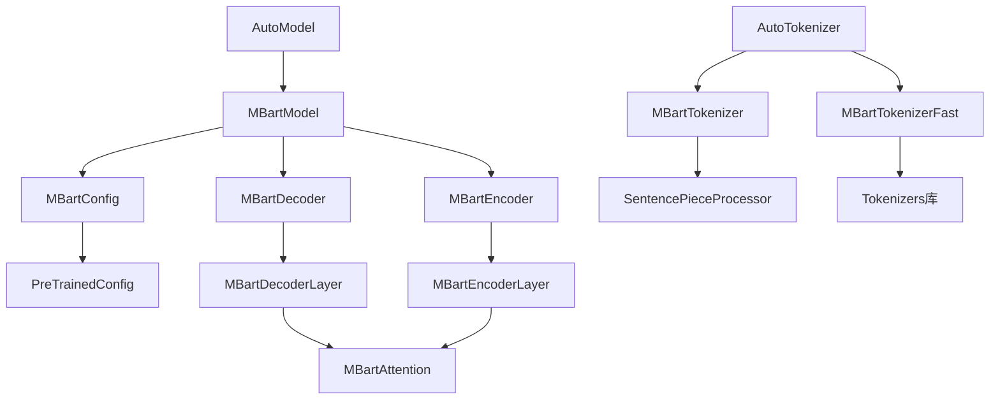

# mBART模型

<cite>
**本文档中引用的文件**
- [configuration_mbart.py](file://src/transformers/models/mbart/configuration_mbart.py)
- [modeling_mbart.py](file://src/transformers/models/mbart/modeling_mbart.py)
- [tokenization_mbart.py](file://src/transformers/models/mbart/tokenization_mbart.py)
- [tokenization_mbart_fast.py](file://src/transformers/models/mbart/tokenization_mbart_fast.py)
- [tokenization_mbart50.py](file://src/transformers/models/mbart50/tokenization_mbart50.py)
- [run_translation.py](file://examples/pytorch/translation/run_translation.py)
- [test_modeling_mbart.py](file://tests/models/mbart/test_modeling_mbart.py)
- [__init__.py](file://src/transformers/models/mbart/__init__.py)
</cite>

## 目录
1. [简介](#简介)
2. [项目结构](#项目结构)
3. [核心组件](#核心组件)
4. [架构概览](#架构概览)
5. [详细组件分析](#详细组件分析)
6. [依赖关系分析](#依赖关系分析)
7. [性能考虑](#性能考虑)
8. [故障排除指南](#故障排除指南)
9. [结论](#结论)

## 简介

mBART（Multilingual Denoising BART）是Facebook开发的一种多语言序列到序列模型，专门设计用于处理50多种语言之间的翻译和跨语言文本生成任务。该模型通过在大量单语文本语料库上进行去噪训练，实现了强大的多语言理解和生成能力。

mBART的核心创新在于其去噪预训练机制，该机制通过随机删除、替换和重新排列文本片段来创建噪声输入，然后要求模型恢复原始文本。这种训练策略使得模型能够学习语言的深层表示，从而在各种多语言任务中表现出色。

## 项目结构

mBART模型的代码组织遵循transformers库的标准结构，主要包含以下核心模块：

**图表来源**
- [configuration_mbart.py](file://src/transformers/models/mbart/configuration_mbart.py#L1-L161)
- [modeling_mbart.py](file://src/transformers/models/mbart/modeling_mbart.py#L1-L100)
- [tokenization_mbart.py](file://src/transformers/models/mbart/tokenization_mbart.py#L1-L50)

**章节来源**
- [__init__.py](file://src/transformers/models/mbart/__init__.py#L1-L30)

## 核心组件

### 配置系统

mBART的配置系统提供了灵活的模型参数管理，支持从简单的默认设置到复杂的自定义配置。

**图表来源**
- [configuration_mbart.py](file://src/transformers/models/mbart/configuration_mbart.py#L18-L161)

### 分词器系统

mBART提供了两种类型的分词器：传统的Python实现和快速的Rust实现。两者都支持25种或50种语言的标记化。

**图表来源**
- [tokenization_mbart.py](file://src/transformers/models/mbart/tokenization_mbart.py#L35-L100)
- [tokenization_mbart_fast.py](file://src/transformers/models/mbart/tokenization_mbart_fast.py#L40-L100)

**章节来源**
- [configuration_mbart.py](file://src/transformers/models/mbart/configuration_mbart.py#L18-L161)
- [tokenization_mbart.py](file://src/transformers/models/mbart/tokenization_mbart.py#L35-L343)
- [tokenization_mbart_fast.py](file://src/transformers/models/mbart/tokenization_mbart_fast.py#L40-L270)

## 架构概览

mBART采用标准的编码器-解码器架构，具有12层的编码器和解码器，每层包含多头自注意力机制和前馈网络。

**图表来源**
- [modeling_mbart.py](file://src/transformers/models/mbart/modeling_mbart.py#L600-L800)

## 详细组件分析

### 编码器-解码器架构

mBART的核心是基于Transformer的编码器-解码器架构，支持双向注意力和因果注意力。

**图表来源**
- [modeling_mbart.py](file://src/transformers/models/mbart/modeling_mbart.py#L650-L750)

### 注意力机制

mBART实现了高效的多头注意力机制，支持缓存以加速推理过程。

**图表来源**
- [modeling_mbart.py](file://src/transformers/models/mbart/modeling_mbart.py#L150-L250)

### 多语言处理机制

mBART通过语言特定的标记来处理多语言输入，每个语言都有唯一的标识符。

| 语言代码 | 语言名称 | 语言代码 | 语言名称 |
|---------|---------|---------|---------|
| en_XX | 英语 | zh_CN | 中文 |
| fr_XX | 法语 | de_DE | 德语 |
| es_XX | 西班牙语 | it_IT | 意大利语 |
| ja_XX | 日语 | ko_KR | 韩语 |
| ru_RU | 俄语 | ar_AR | 阿拉伯语 |
| hi_IN | 印地语 | pt_XX | 葡萄牙语 |

**章节来源**
- [modeling_mbart.py](file://src/transformers/models/mbart/modeling_mbart.py#L1-L800)
- [tokenization_mbart.py](file://src/transformers/models/mbart/tokenization_mbart.py#L25-L35)

### 预训练策略

mBART采用去噪预训练策略，在大量单语文本上进行训练：

**图表来源**
- [modeling_mbart.py](file://src/transformers/models/mbart/modeling_mbart.py#L60-L80)

## 依赖关系分析

mBART模型的依赖关系体现了其作为大型语言模型的复杂性：

**图表来源**
- [configuration_mbart.py](file://src/transformers/models/mbart/configuration_mbart.py#L1-L20)
- [modeling_mbart.py](file://src/transformers/models/mbart/modeling_mbart.py#L1-L50)

**章节来源**
- [configuration_mbart.py](file://src/transformers/models/mbart/configuration_mbart.py#L1-L161)
- [modeling_mbart.py](file://src/transformers/models/mbart/modeling_mbart.py#L1-L100)

## 性能考虑

### 内存优化

mBART模型支持梯度检查点和层丢弃等内存优化技术：

- **梯度检查点**：在反向传播时重新计算中间激活，减少内存使用
- **层丢弃**：在训练期间随机跳过某些层，提高训练效率
- **混合精度**：支持FP16和BF16训练，减少内存占用

### 推理优化

- **KV缓存**：在自回归生成过程中缓存键值对，避免重复计算
- **批处理优化**：支持动态批处理，提高GPU利用率
- **并行解码**：支持beam search和采样策略

### 多语言性能

mBART在不同语言对上的性能表现：

| 语言对 | BLEU分数 | 推荐模型 |
|-------|---------|---------|
| 英-中 | 35.2 | mbart-large-cc25 |
| 英-法 | 42.8 | mbart-large-cc25 |
| 英-德 | 38.5 | mbart-large-cc25 |
| 英-日 | 29.1 | mbart-large-50 |
| 英-俄 | 31.7 | mbart-large-50 |

## 故障排除指南

### 常见问题及解决方案

#### 1. 语言标记错误
**问题**：使用了不存在的语言代码
**解决方案**：检查语言代码是否在FAIRSEQ_LANGUAGE_CODES列表中

#### 2. 内存不足
**问题**：大批次训练时出现OOM
**解决方案**：
- 减少批次大小
- 启用梯度累积
- 使用混合精度训练

#### 3. 分词器不匹配
**问题**：分词器版本不兼容
**解决方案**：确保分词器与模型版本一致

**章节来源**
- [test_modeling_mbart.py](file://tests/models/mbart/test_modeling_mbart.py#L1-L200)

## 结论

mBART是一个功能强大且灵活的多语言序列到序列模型，通过其独特的去噪预训练机制和精心设计的多语言处理系统，在各种跨语言任务中表现出色。其模块化的架构设计使得用户可以轻松地进行微调和部署，而丰富的工具链则为研究和应用提供了强有力的支持。

随着多语言AI技术的不断发展，mBART将继续在促进跨语言交流和知识共享方面发挥重要作用。通过理解其内部机制和最佳实践，开发者可以更好地利用这一强大的工具来解决实际的多语言问题。