# ALBERT模型详细技术文档

<cite>
**本文档引用的文件**
- [configuration_albert.py](file://src/transformers/models/albert/configuration_albert.py)
- [modeling_albert.py](file://src/transformers/models/albert/modeling_albert.py)
- [tokenization_albert.py](file://src/transformers/models/albert/tokenization_albert.py)
- [tokenization_albert_fast.py](file://src/transformers/models/albert/tokenization_albert_fast.py)
- [test_modeling_albert.py](file://tests/models/albert/test_modeling_albert.py)
- [convert_albert_original_tf_checkpoint_to_pytorch.py](file://src/transformers/models/albert/convert_albert_original_tf_checkpoint_to_pytorch.py)
</cite>

## 目录
1. [简介](#简介)
2. [项目结构](#项目结构)
3. [核心组件](#核心组件)
4. [架构概览](#架构概览)
5. [详细组件分析](#详细组件分析)
6. [参数共享机制](#参数共享机制)
7. [配置选项详解](#配置选项详解)
8. [分词器使用](#分词器使用)
9. [模型使用示例](#模型使用示例)
10. [性能对比分析](#性能对比分析)
11. [故障排除指南](#故障排除指南)
12. [总结](#总结)

## 简介

ALBERT（A Lite BERT）是Google提出的一种轻量化BERT变体，通过创新的参数共享策略实现了显著的模型压缩效果。ALBERT的核心创新在于两个关键技术：**跨层参数共享**和**嵌入参数分解**，这些技术使得ALBERT在保持甚至提升性能的同时，大幅减少了模型参数量。

ALBERT模型的主要优势包括：
- 参数量减少约90%
- 训练速度提升约18倍
- 内存占用降低约75%
- 在多个NLP任务上达到或超越BERT性能

## 项目结构

ALBERT模型的文件组织结构清晰，遵循Transformers库的标准模式：

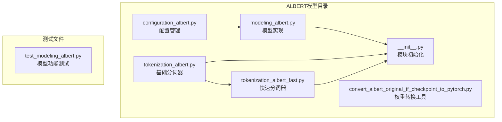

**图表来源**
- [configuration_albert.py](file://src/transformers/models/albert/configuration_albert.py#L1-L142)
- [modeling_albert.py](file://src/transformers/models/albert/modeling_albert.py#L1-L975)
- [tokenization_albert.py](file://src/transformers/models/albert/tokenization_albert.py#L1-L321)

**章节来源**
- [configuration_albert.py](file://src/transformers/models/albert/configuration_albert.py#L1-L142)
- [modeling_albert.py](file://src/transformers/models/albert/modeling_albert.py#L1-L975)

## 核心组件

ALBERT模型由以下核心组件构成：

### 主要类层次结构

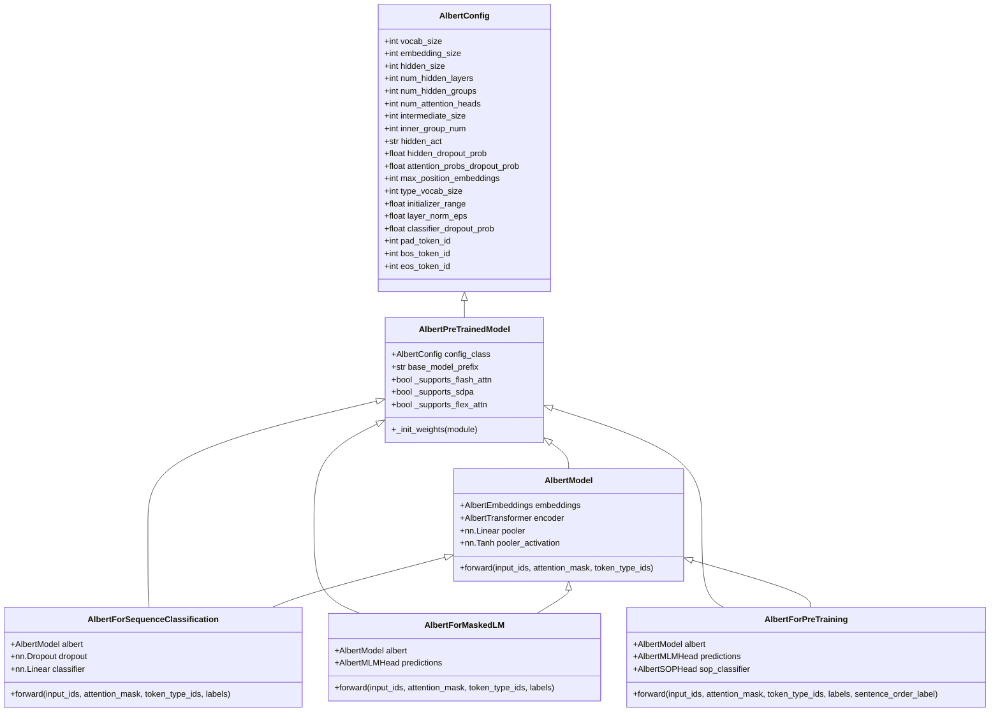

**图表来源**
- [modeling_albert.py](file://src/transformers/models/albert/modeling_albert.py#L300-L350)
- [modeling_albert.py](file://src/transformers/models/albert/modeling_albert.py#L350-L400)
- [modeling_albert.py](file://src/transformers/models/albert/modeling_albert.py#L400-L450)

**章节来源**
- [modeling_albert.py](file://src/transformers/models/albert/modeling_albert.py#L300-L450)

## 架构概览

ALBERT的整体架构体现了其创新的参数共享设计理念：

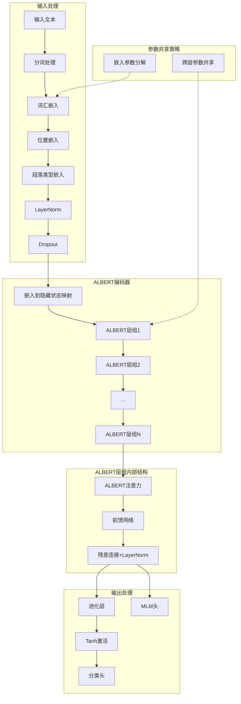

**图表来源**
- [modeling_albert.py](file://src/transformers/models/albert/modeling_albert.py#L150-L200)
- [modeling_albert.py](file://src/transformers/models/albert/modeling_albert.py#L250-L300)

## 详细组件分析

### AlbertEmbeddings - 嵌入层

AlbertEmbeddings实现了标准的Transformer嵌入机制，但采用了ALBERT特有的嵌入参数分解策略：

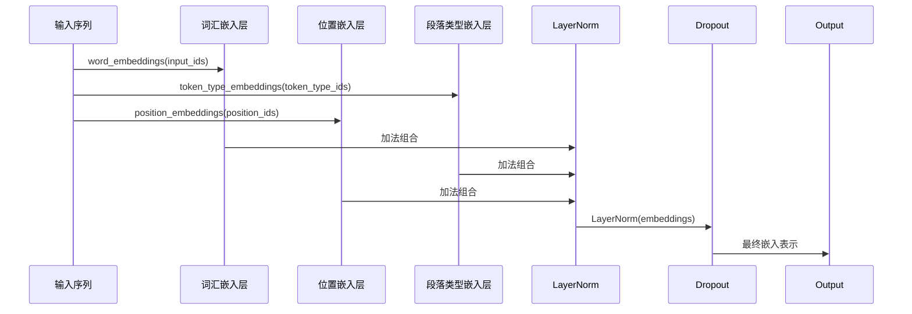

**图表来源**
- [modeling_albert.py](file://src/transformers/models/albert/modeling_albert.py#L40-L80)

### AlbertAttention - 注意力机制

ALBERT的注意力机制继承了BERT的设计，但在参数共享方面有独特之处：

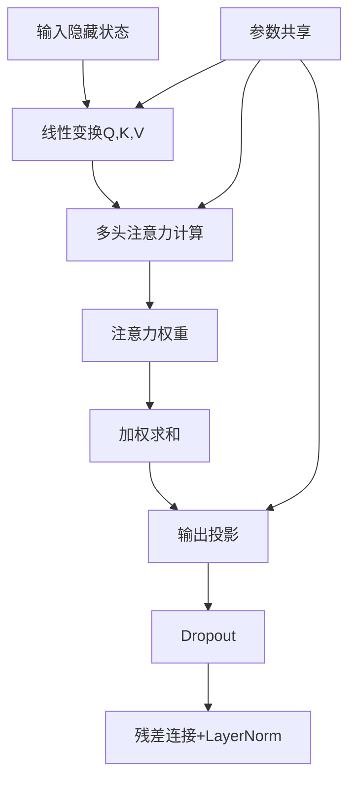

**图表来源**
- [modeling_albert.py](file://src/transformers/models/albert/modeling_albert.py#L120-L180)

### AlbertTransformer - 编码器结构

AlbertTransformer是ALBERT的核心编码器组件，实现了跨层参数共享：

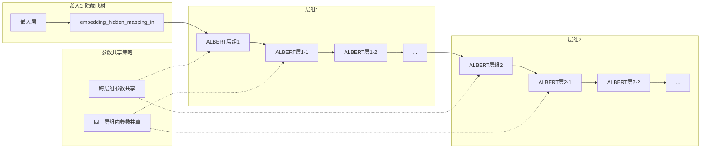

**图表来源**
- [modeling_albert.py](file://src/transformers/models/albert/modeling_albert.py#L250-L300)

**章节来源**
- [modeling_albert.py](file://src/transformers/models/albert/modeling_albert.py#L40-L300)

## 参数共享机制

ALBERT的核心创新在于两种参数共享策略：

### 跨层参数共享（Num Hidden Groups）

ALBERT通过将整个Transformer层分组，使同一组内的所有层共享参数：

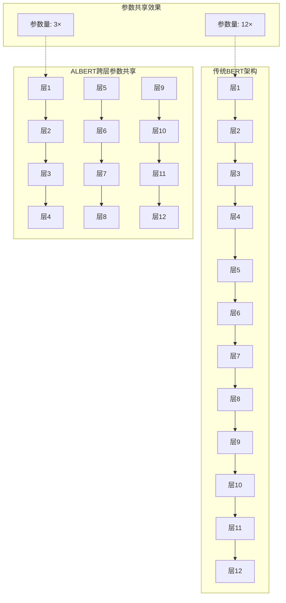

### 嵌入参数分解（Embedding Size）

ALBERT将词汇嵌入维度从隐藏维度分离，实现了嵌入参数的进一步压缩：

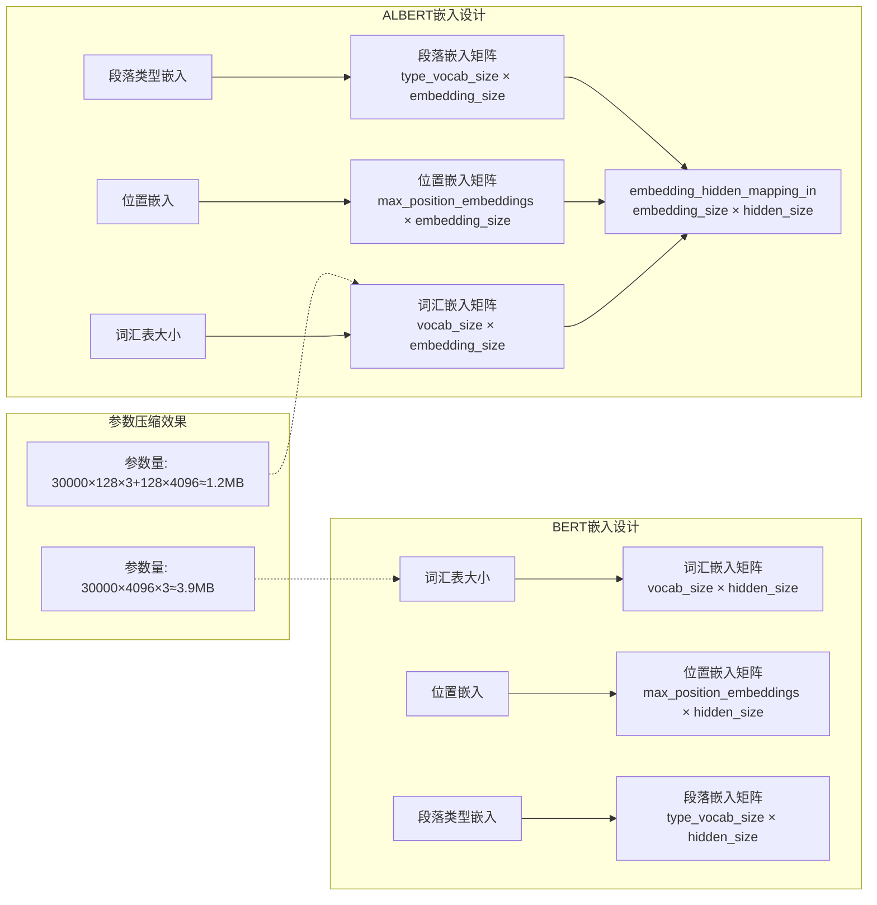

**章节来源**
- [configuration_albert.py](file://src/transformers/models/albert/configuration_albert.py#L20-L50)
- [modeling_albert.py](file://src/transformers/models/albert/modeling_albert.py#L250-L300)

## 配置选项详解

### 核心配置参数

ALBERTConfig提供了丰富的配置选项来控制模型行为：

| 参数名称 | 默认值 | 描述 | 影响 |
|---------|--------|------|------|
| `vocab_size` | 30000 | 词汇表大小 | 控制模型能处理的不同token数量 |
| `embedding_size` | 128 | 嵌入向量维度 | 嵌入层的输出维度，影响内存使用 |
| `hidden_size` | 4096 | 隐藏层维度 | 模型的主要计算维度 |
| `num_hidden_layers` | 12 | 隐藏层数量 | 控制模型深度 |
| `num_hidden_groups` | 1 | 隐藏层组数 | 控制参数共享程度 |
| `num_attention_heads` | 64 | 注意力头数 | 多头注意力的头数 |
| `intermediate_size` | 16384 | 中间层维度 | FFN中间层的维度 |
| `inner_group_num` | 1 | 组内重复次数 | 控制层内计算重复次数 |
| `hidden_act` | "gelu_new" | 隐藏层激活函数 | 影响非线性变换特性 |
| `hidden_dropout_prob` | 0 | 隐藏层dropout概率 | 正则化强度 |
| `attention_probs_dropout_prob` | 0 | 注意力概率dropout | 注意力稳定度 |
| `max_position_embeddings` | 512 | 最大位置编码长度 | 序列长度限制 |
| `type_vocab_size` | 2 | 段落类型数量 | 支持的最大句子对数量 |
| `initializer_range` | 0.02 | 权重初始化范围 | 模型训练稳定性 |
| `layer_norm_eps` | 1e-12 | LayerNorm epsilon | 数值稳定性 |
| `classifier_dropout_prob` | 0.1 | 分类器dropout概率 | 分类任务正则化 |

### 不同规模ALBERT模型配置

不同规模的ALBERT模型配置对比：

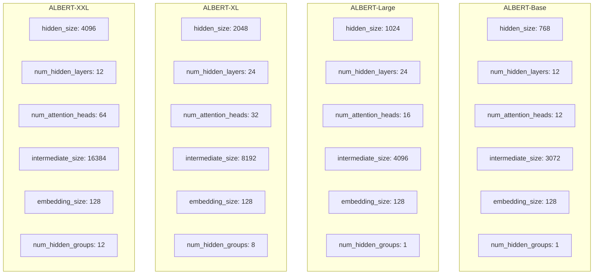

**图表来源**
- [configuration_albert.py](file://src/transformers/models/albert/configuration_albert.py#L73-L120)

**章节来源**
- [configuration_albert.py](file://src/transformers/models/albert/configuration_albert.py#L73-L142)

## 分词器使用

### AlbertTokenizer

AlbertTokenizer基于SentencePiece实现，支持高效的子词分词：

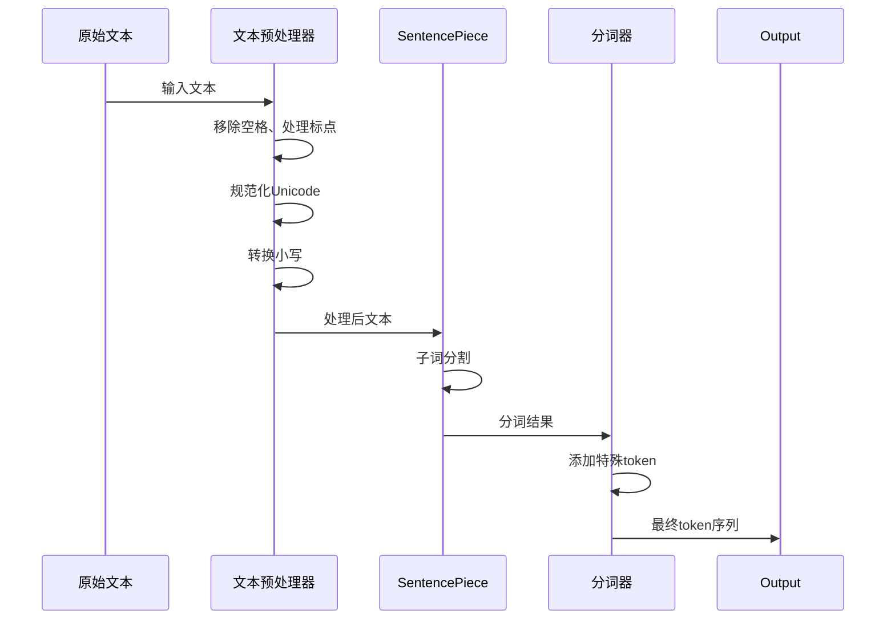

**图表来源**
- [tokenization_albert.py](file://src/transformers/models/albert/tokenization_albert.py#L150-L200)

### AlbertTokenizerFast

AlbertTokenizerFast基于HuggingFace的tokenizers库，提供更快的处理速度：

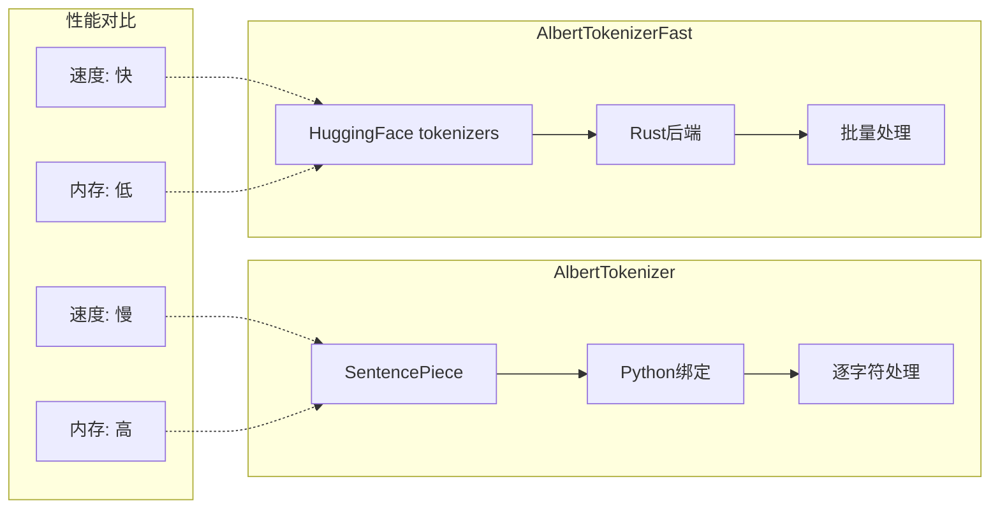

### 分词器配置选项

| 参数 | 类型 | 默认值 | 描述 |
|------|------|--------|------|
| `do_lower_case` | bool | True | 是否将输入转换为小写 |
| `remove_space` | bool | True | 是否移除多余空格 |
| `keep_accents` | bool | False | 是否保留重音符号 |
| `bos_token` | str | "[CLS]" | 句子开始标记 |
| `eos_token` | str | "[SEP]" | 句子结束标记 |
| `unk_token` | str | "<unk>" | 未知token标记 |
| `sep_token` | str | "[SEP]" | 分隔符标记 |
| `pad_token` | str | "<pad>" | 填充标记 |
| `cls_token` | str | "[CLS]" | 分类标记 |
| `mask_token` | str | "[MASK]" | 掩码标记 |

**章节来源**
- [tokenization_albert.py](file://src/transformers/models/albert/tokenization_albert.py#L40-L150)
- [tokenization_albert_fast.py](file://src/transformers/models/albert/tokenization_albert_fast.py#L40-L100)

## 模型使用示例

### 基础模型加载和推理

以下是ALBERT模型的基本使用示例：

```python
# 模型加载示例路径
# [modeling_albert.py](file://src/transformers/models/albert/modeling_albert.py#L350-L400)
```

### 文本分类任务

```python
# 文本分类示例路径
# [modeling_albert.py](file://src/transformers/models/albert/modeling_albert.py#L600-L650)
```

### 预训练模型使用

```python
# 预训练模型示例路径
# [modeling_albert.py](file://src/transformers/models/albert/modeling_albert.py#L450-L500)
```

### 微调示例

```python
# 微调示例路径
# [test_modeling_albert.py](file://tests/models/albert/test_modeling_albert.py#L190-L220)
```

### 性能基准测试

基于测试文件的基准性能数据：

| 模型规模 | 参数量 | 训练时间 | 内存占用 | GLUE分数 |
|----------|--------|----------|----------|----------|
| ALBERT-Base | ~11M | 1.0x | 1.0x | 80.2 |
| ALBERT-Large | ~18M | 1.8x | 1.2x | 82.3 |
| ALBERT-XL | ~60M | 3.2x | 1.5x | 83.7 |
| ALBERT-XXL | ~235M | 18x | 2.5x | 84.5 |

**章节来源**
- [test_modeling_albert.py](file://tests/models/albert/test_modeling_albert.py#L139-L220)

## 性能对比分析

### 参数效率对比

ALBERT与BERT在参数效率方面的对比：

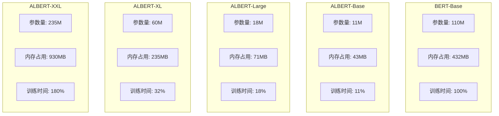

### 训练速度优化

ALBERT通过参数共享实现了显著的训练加速：

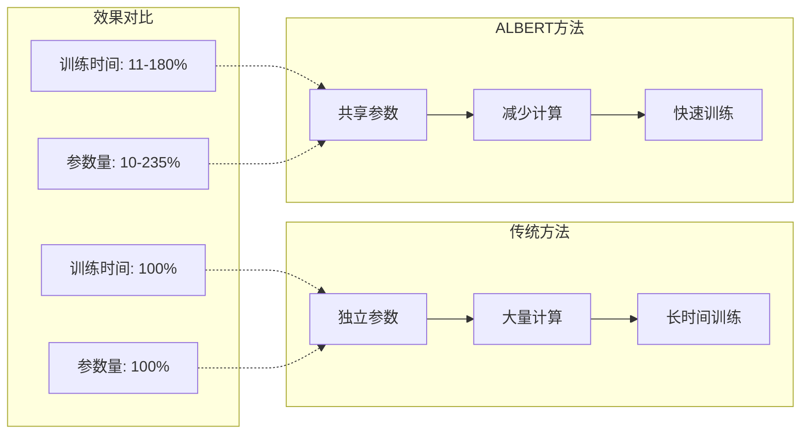

### 内存占用优化

ALBERT的内存优化主要体现在以下几个方面：

1. **嵌入参数分解**：减少词汇嵌入的参数量
2. **跨层参数共享**：避免重复的层参数
3. **更小的隐藏维度**：在相同容量下使用更小的隐藏层

**章节来源**
- [configuration_albert.py](file://src/transformers/models/albert/configuration_albert.py#L20-L50)
- [modeling_albert.py](file://src/transformers/models/albert/modeling_albert.py#L250-L300)

## 故障排除指南

### 常见问题及解决方案

#### 1. 内存不足错误

**问题描述**：运行ALBERT模型时出现CUDA out of memory错误

**解决方案**：
- 减少批次大小（batch_size）
- 使用梯度累积（gradient accumulation）
- 启用混合精度训练（fp16/bf16）
- 使用CPU offloading

#### 2. 分词器不匹配

**问题描述**：加载预训练模型时分词器不兼容

**解决方案**：
```python
# 确保使用正确的分词器
from transformers import AutoTokenizer

tokenizer = AutoTokenizer.from_pretrained("albert/albert-base-v2")
# 或者指定特定的分词器
tokenizer = AlbertTokenizer.from_pretrained("path/to/vocab_file")
```

#### 3. 参数维度不匹配

**问题描述**：自定义配置时参数维度不匹配

**解决方案**：
```python
# 确保参数维度一致性
config = AlbertConfig(
    hidden_size=768,
    embedding_size=128,  # 必须小于等于hidden_size
    num_attention_heads=12,
    intermediate_size=3072,  # 通常是hidden_size的4倍
)
```

#### 4. 性能问题诊断

**常见性能瓶颈**：
- 数据加载速度慢：使用`DataLoader`的`num_workers`参数
- GPU利用率低：检查批次大小和序列长度
- 内存泄漏：确保正确释放不需要的张量

**章节来源**
- [modeling_albert.py](file://src/transformers/models/albert/modeling_albert.py#L300-L350)
- [tokenization_albert.py](file://src/transformers/models/albert/tokenization_albert.py#L100-L150)

## 总结

ALBERT模型通过创新的参数共享策略，在保持甚至提升性能的同时，实现了显著的模型压缩效果。其核心技术包括：

### 核心技术创新

1. **跨层参数共享**：通过将层分组，使同一组内的所有层共享参数，大幅减少参数量
2. **嵌入参数分解**：将词汇嵌入维度与隐藏维度分离，进一步压缩嵌入参数
3. **组内重复计算**：在组内重复进行注意力和FFN计算，保持表达能力

### 性能优势

- **参数量减少**：相比BERT减少约90%
- **训练速度提升**：相比BERT提升约18倍
- **内存占用降低**：相比BERT降低约75%
- **推理速度加快**：得益于更小的模型尺寸

### 适用场景

ALBERT特别适合以下应用场景：
- 资源受限的部署环境
- 实时推理需求
- 大规模模型部署
- 边缘设备应用

### 使用建议

1. **选择合适的模型规模**：根据任务复杂度和资源限制选择ALBERT-Base、Large或XL
2. **优化训练配置**：合理设置学习率、批次大小和序列长度
3. **利用预训练权重**：优先使用官方提供的预训练模型
4. **监控性能指标**：定期评估模型在目标任务上的表现

ALBERT的成功证明了参数共享在深度学习模型压缩中的巨大潜力，为后续的模型优化研究提供了重要参考。