# BERT模型

<cite>
**本文档中引用的文件**
- [configuration_bert.py](file://src/transformers/models/bert/configuration_bert.py)
- [modeling_bert.py](file://src/transformers/models/bert/modeling_bert.py)
- [tokenization_bert.py](file://src/transformers/models/bert/tokenization_bert.py)
- [tokenization_bert_fast.py](file://src/transformers/models/bert/tokenization_bert_fast.py)
- [test_modeling_bert.py](file://tests/models/bert/test_modeling_bert.py)
- [run_glue.py](file://examples/pytorch/text-classification/run_glue.py)
</cite>

## 目录
1. [简介](#简介)
2. [项目结构](#项目结构)
3. [核心组件](#核心组件)
4. [架构概览](#架构概览)
5. [详细组件分析](#详细组件分析)
6. [预训练任务](#预训练任务)
7. [下游任务应用](#下游任务应用)
8. [性能优化](#性能优化)
9. [故障排除指南](#故障排除指南)
10. [结论](#结论)

## 简介

BERT（Bidirectional Encoder Representations from Transformers）是Google在2018年提出的一种革命性的预训练语言表示模型。它通过双向Transformer编码器架构，在大量文本数据上进行无监督预训练，然后在各种自然语言处理任务上进行微调，取得了突破性的性能提升。

BERT的核心创新在于：
- **双向上下文理解**：同时考虑左侧和右侧的上下文信息
- **预训练+微调范式**：通过大规模预训练学习通用语言表示
- **多层Transformer编码器**：利用自注意力机制捕捉复杂的语言模式

## 项目结构

BERT模型在transformers库中的组织结构如下：

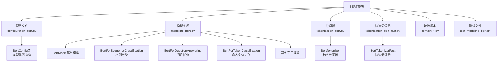

**图表来源**
- [configuration_bert.py](file://src/transformers/models/bert/configuration_bert.py#L1-L127)
- [modeling_bert.py](file://src/transformers/models/bert/modeling_bert.py#L1-L1461)
- [tokenization_bert.py](file://src/transformers/models/bert/tokenization_bert.py#L1-L479)
- [tokenization_bert_fast.py](file://src/transformers/models/bert/tokenization_bert_fast.py#L1-L147)

**章节来源**
- [configuration_bert.py](file://src/transformers/models/bert/configuration_bert.py#L1-L127)
- [modeling_bert.py](file://src/transformers/models/bert/modeling_bert.py#L1-L1461)
- [tokenization_bert.py](file://src/transformers/models/bert/tokenization_bert.py#L1-L479)
- [tokenization_bert_fast.py](file://src/transformers/models/bert/tokenization_bert_fast.py#L1-L147)

## 核心组件

BERT模型由以下核心组件构成：

### 1. 配置系统（BertConfig）
负责管理模型的所有超参数和配置选项。

### 2. 基础模型（BertModel）
提供双向Transformer编码器的核心功能。

### 3. 专用模型头
为不同下游任务提供特定的输出层：
- 序列分类：情感分析、文本分类
- 问答任务：阅读理解
- 命名实体识别：实体标注
- 语言建模：掩码语言建模

### 4. 分词系统
支持两种分词器：
- BertTokenizer：Python实现的标准分词器
- BertTokenizerFast：基于Rust的快速分词器

**章节来源**
- [configuration_bert.py](file://src/transformers/models/bert/configuration_bert.py#L15-L127)
- [modeling_bert.py](file://src/transformers/models/bert/modeling_bert.py#L600-L700)
- [tokenization_bert.py](file://src/transformers/models/bert/tokenization_bert.py#L60-L150)
- [tokenization_bert_fast.py](file://src/transformers/models/bert/tokenization_bert_fast.py#L25-L80)

## 架构概览

BERT采用双向Transformer编码器架构，其整体设计如下：

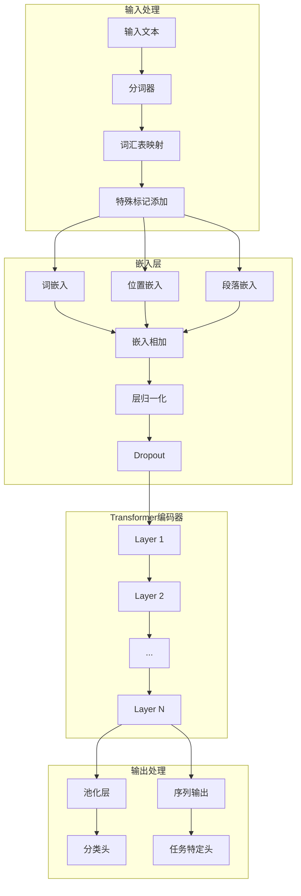

**图表来源**
- [modeling_bert.py](file://src/transformers/models/bert/modeling_bert.py#L60-L120)
- [modeling_bert.py](file://src/transformers/models/bert/modeling_bert.py#L600-L700)

## 详细组件分析

### BertEmbeddings：嵌入层实现

嵌入层是BERT的第一层，负责将输入的token转换为高维向量表示：

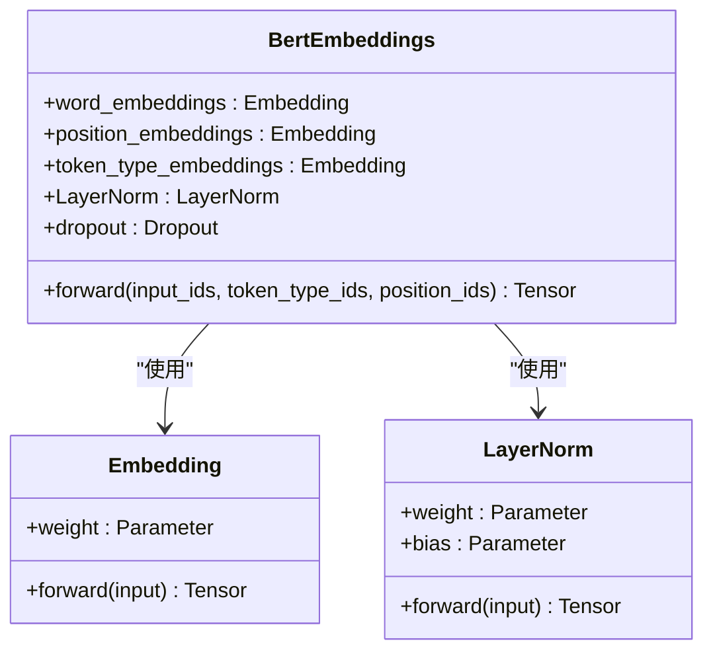

**图表来源**
- [modeling_bert.py](file://src/transformers/models/bert/modeling_bert.py#L60-L120)

嵌入层的关键特性：
- **词嵌入**：将token ID映射到固定维度的向量
- **位置嵌入**：为每个位置生成独特的位置信息
- **段落嵌入**：区分不同的文本段落（用于句子对任务）

**章节来源**
- [modeling_bert.py](file://src/transformers/models/bert/modeling_bert.py#L60-L120)

### BertSelfAttention：自注意力机制

自注意力机制是BERT的核心，实现了双向上下文信息的融合：

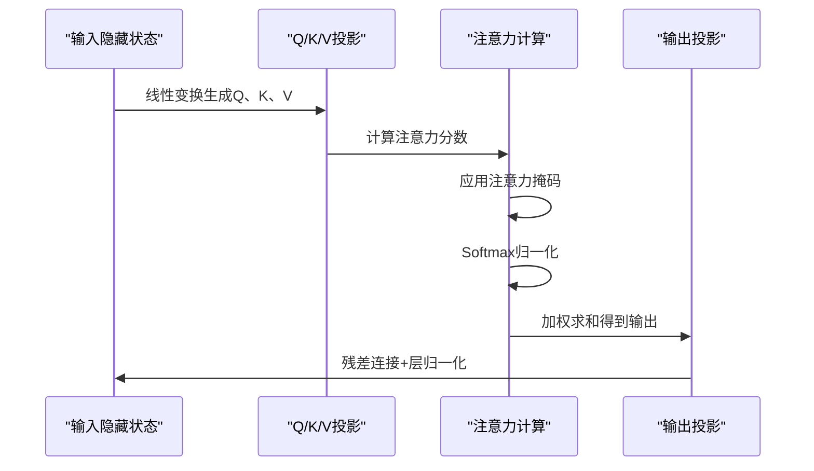

**图表来源**
- [modeling_bert.py](file://src/transformers/models/bert/modeling_bert.py#L150-L250)

**章节来源**
- [modeling_bert.py](file://src/transformers/models/bert/modeling_bert.py#L150-L250)

### BertLayer：Transformer层

每个BERT层包含自注意力机制和前馈网络：

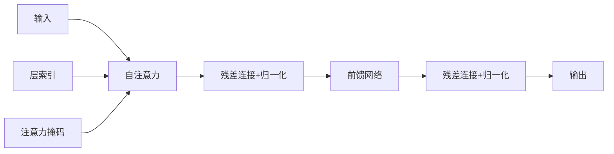

**图表来源**
- [modeling_bert.py](file://src/transformers/models/bert/modeling_bert.py#L350-L450)

**章节来源**
- [modeling_bert.py](file://src/transformers/models/bert/modeling_bert.py#L350-L450)

### BertEncoder：编码器堆叠

多个BERT层的堆叠构成了完整的编码器：

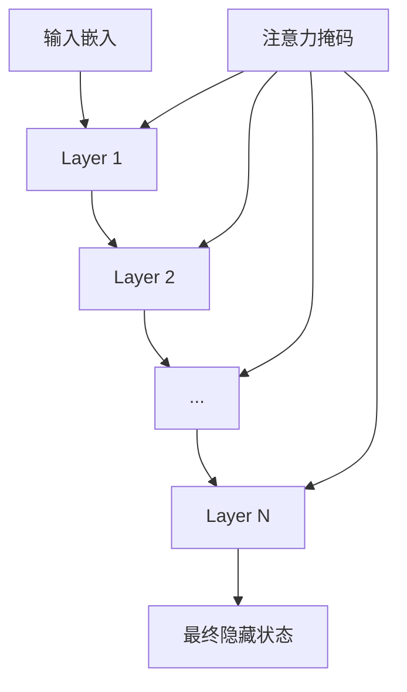

**图表来源**
- [modeling_bert.py](file://src/transformers/models/bert/modeling_bert.py#L450-L500)

**章节来源**
- [modeling_bert.py](file://src/transformers/models/bert/modeling_bert.py#L450-L500)

### BertPooler：池化层

池化层从序列的第一个token（[CLS]）提取全局语义表示：

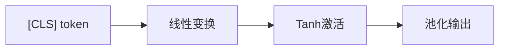

**图表来源**
- [modeling_bert.py](file://src/transformers/models/bert/modeling_bert.py#L500-L520)

**章节来源**
- [modeling_bert.py](file://src/transformers/models/bert/modeling_bert.py#L500-L520)

## 预训练任务

BERT采用两种主要的预训练任务来学习通用的语言表示：

### 1. 掩码语言建模（MLM）

MLM是BERT的主要预训练任务，通过随机掩码部分token来训练模型预测被掩码的token。

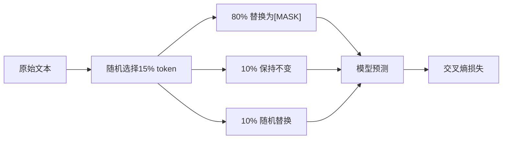

**图表来源**
- [modeling_bert.py](file://src/transformers/models/bert/modeling_bert.py#L800-L850)

### 2. 下一句预测（NSP）

NSP任务训练模型判断两个句子是否连续出现。

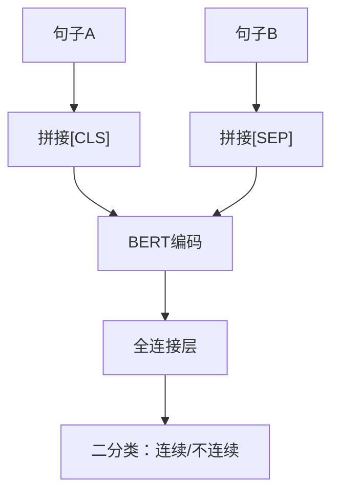

**图表来源**
- [modeling_bert.py](file://src/transformers/models/bert/modeling_bert.py#L850-L900)

**章节来源**
- [modeling_bert.py](file://src/transformers/models/bert/modeling_bert.py#L800-L900)

## 下游任务应用

BERT通过在特定任务上微调获得优异性能，以下是几种典型的应用：

### BertForSequenceClassification：序列分类

用于情感分析、文本分类等任务：

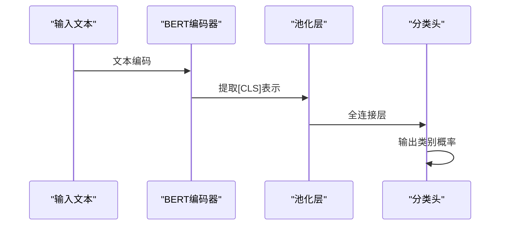

**图表来源**
- [modeling_bert.py](file://src/transformers/models/bert/modeling_bert.py#L1000-L1100)

### BertForQuestionAnswering：问答任务

用于阅读理解任务，预测答案在文本中的起始和结束位置：

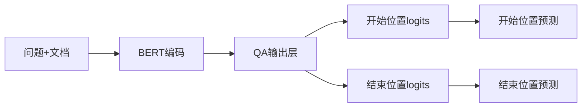

**图表来源**
- [modeling_bert.py](file://src/transformers/models/bert/modeling_bert.py#L1400-L1460)

### BertForTokenClassification：命名实体识别

用于NER任务，为每个token预测标签：

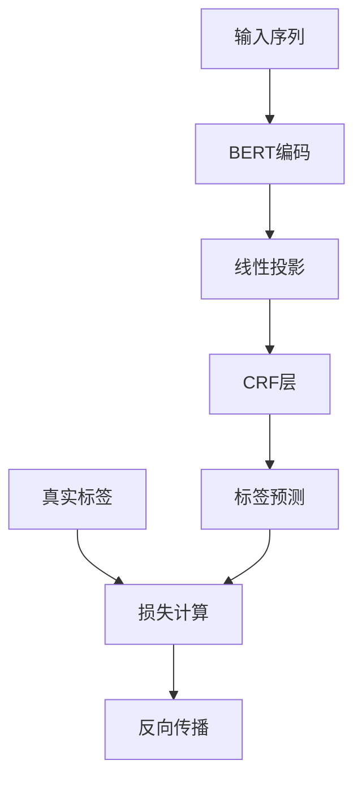

**图表来源**
- [modeling_bert.py](file://src/transformers/models/bert/modeling_bert.py#L1320-L1370)

**章节来源**
- [modeling_bert.py](file://src/transformers/models/bert/modeling_bert.py#L1000-L1460)

## 性能优化

### BertTokenizer vs BertTokenizerFast

BERT提供了两种分词器，各有优缺点：

| 特性 | BertTokenizer | BertTokenizerFast |
|------|---------------|-------------------|
| 实现语言 | Python | Rust |
| 性能 | 较慢 | 快10-100倍 |
| 内存使用 | 较高 | 较低 |
| 功能完整性 | 完整 | 基本功能 |
| 缓存支持 | 不支持 | 支持 |

### 内存优化策略

1. **梯度检查点**：减少中间激活的内存占用
2. **混合精度训练**：使用FP16降低内存需求
3. **批处理优化**：动态调整批次大小
4. **模型并行**：将大模型分布到多个GPU

### 推理优化

1. **静态图优化**：使用torchscript加速推理
2. **量化**：INT8量化减少内存使用
3. **缓存机制**：重用注意力计算结果

## 故障排除指南

### 常见问题及解决方案

#### 1. 内存不足错误
**症状**：CUDA out of memory
**解决方案**：
- 减少批次大小
- 启用梯度检查点
- 使用混合精度训练
- 考虑使用CPU offloading

#### 2. 分词器不匹配
**症状**：tokenizer版本不兼容
**解决方案**：
- 确保tokenizer与模型版本一致
- 重新下载预训练权重
- 检查词汇表大小

#### 3. 微调效果不佳
**症状**：验证集性能差
**解决方案**：
- 检查学习率设置
- 增加训练轮数
- 调整正则化参数
- 使用更好的初始化

#### 4. 推理速度慢
**症状**：推理时间过长
**解决方案**：
- 使用BertTokenizerFast
- 启用模型并行
- 使用量化模型
- 优化批处理大小

**章节来源**
- [tokenization_bert.py](file://src/transformers/models/bert/tokenization_bert.py#L60-L150)
- [tokenization_bert_fast.py](file://src/transformers/models/bert/tokenization_bert_fast.py#L25-L80)

## 结论

BERT作为自然语言处理领域的重要里程碑，其双向Transformer编码器架构为后续的预训练模型奠定了坚实的基础。通过深入理解BERT的内部机制，包括其独特的预训练任务、灵活的下游任务适配能力以及高效的实现方式，我们可以更好地利用这一强大的工具解决各种NLP挑战。

BERT的成功证明了大规模无监督预训练的有效性，同时也展示了迁移学习在实际应用中的巨大潜力。随着模型规模的不断增大和优化技术的持续进步，BERT及其衍生模型将继续在推动人工智能发展方面发挥重要作用。