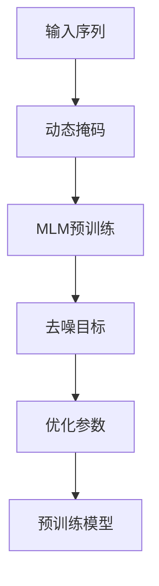
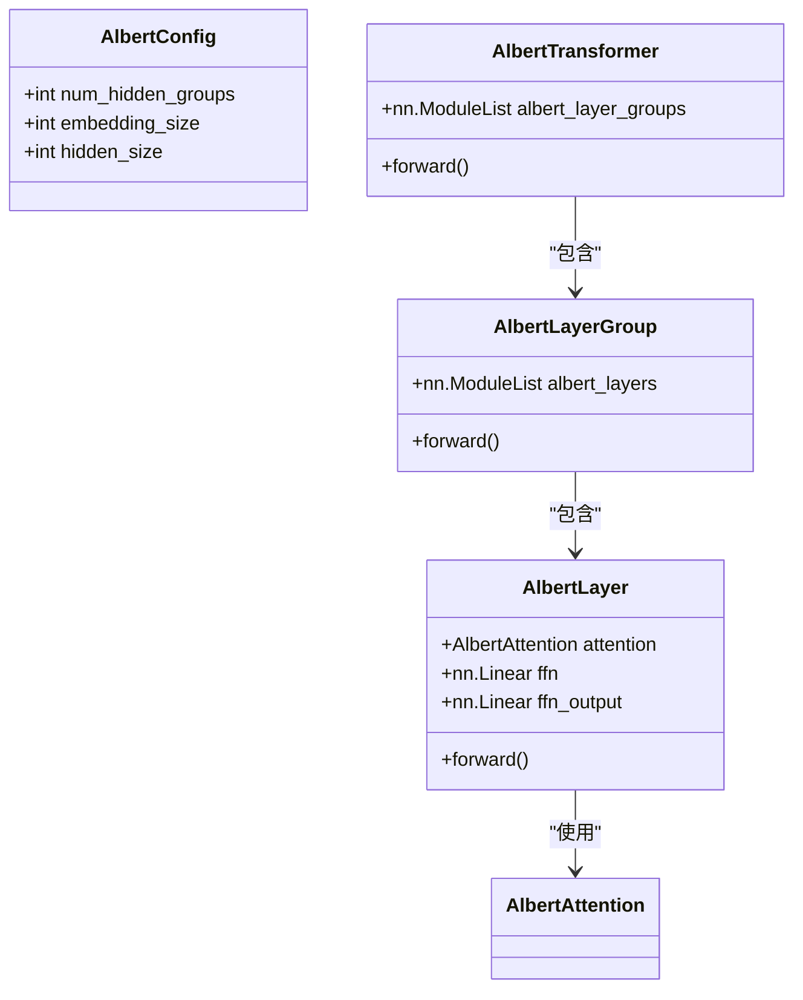
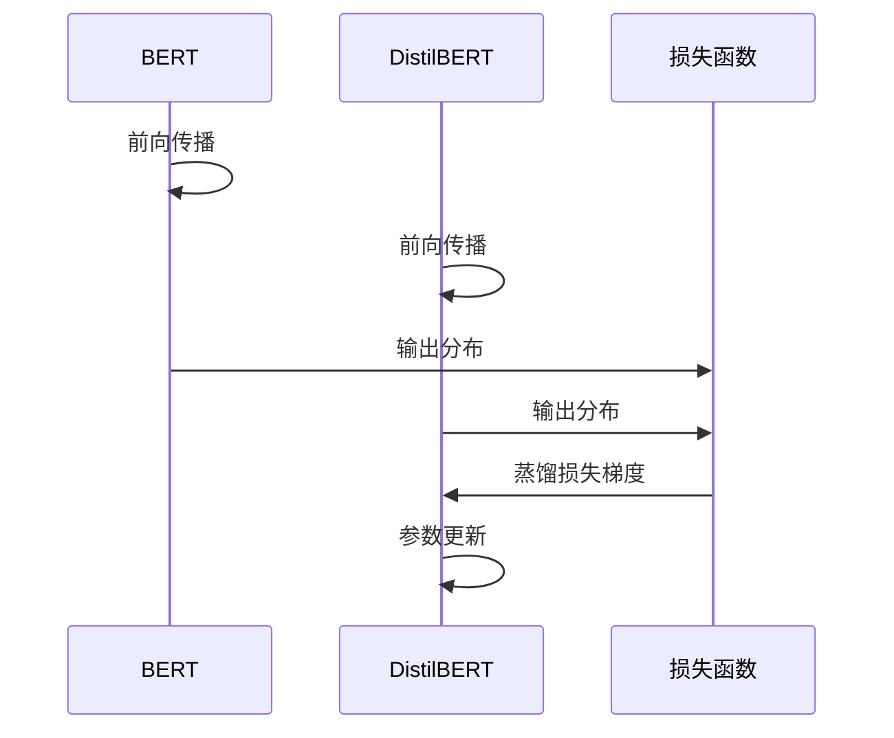
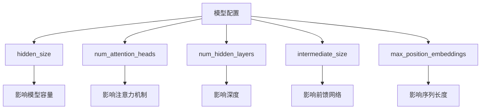

# BERT系列模型

<cite>
**本文档中引用的文件**  
- [configuration_bert.py](file://src/transformers/models/bert/configuration_bert.py)
- [modeling_bert.py](file://src/transformers/models/bert/modeling_bert.py)
- [tokenization_bert.py](file://src/transformers/models/bert/tokenization_bert.py)
- [configuration_roberta.py](file://src/transformers/models/roberta/configuration_roberta.py)
- [configuration_albert.py](file://src/transformers/models/albert/configuration_albert.py)
- [configuration_distilbert.py](file://src/transformers/models/distilbert/configuration_distilbert.py)
- [modeling_albert.py](file://src/transformers/models/albert/modeling_albert.py)
- [modeling_distilbert.py](file://src/transformers/models/distilbert/modeling_distilbert.py)
</cite>

## 目录
1. [引言](#引言)
2. [BERT模型架构](#bert模型架构)
3. [RoBERTa改进](#roberta改进)
4. [ALBERT模型压缩](#albert模型压缩)
5. [DistilBERT知识蒸馏](#distilbert知识蒸馏)
6. [模型配置参数](#模型配置参数)
7. [分词器使用](#分词器使用)
8. [任务应用与模型选择](#任务应用与模型选择)
9. [性能比较](#性能比较)

## 引言
BERT系列模型是基于Transformer编码器架构的自然语言处理模型，包括BERT、RoBERTa、ALBERT和DistilBERT等变体。这些模型通过预训练和微调范式在各种NLP任务中取得了显著成果。本文档详细解释这些模型的原理、实现和应用。

## BERT模型架构

BERT（Bidirectional Encoder Representations from Transformers）采用双向注意力机制，通过两个预训练任务：掩码语言建模（MLM）和下一句预测（NSP）。MLM任务通过随机掩码输入序列中的部分token并预测其原始值来训练模型，而NSP任务则训练模型判断两个句子是否连续。

BERT的Transformer编码器由多层自注意力机制和前馈神经网络组成。每个编码层包含多头自注意力机制，允许模型在处理每个token时关注输入序列中的其他token。这种双向上下文理解能力使BERT能够捕捉丰富的语义信息。

**节来源**
- [modeling_bert.py](file://src/transformers/models/bert/modeling_bert.py#L424-L439)
- [modeling_bert.py](file://src/transformers/models/bert/modeling_bert.py#L280-L314)

## RoBERTa改进

RoBERTa（Robustly optimized BERT approach）在BERT的基础上进行了多项改进。最重要的改进是去除了NSP预训练任务，发现MLM任务本身已足够有效。RoBERTa还引入了动态掩码策略，在训练过程中对每个序列进行不同的掩码模式，增加了训练数据的多样性。

此外，RoBERTa使用了更大的批次大小和更多的训练数据，显著提升了模型性能。这些改进使得RoBERTa在多个NLP基准测试中超越了原始BERT模型。

**图来源**
- [configuration_roberta.py](file://src/transformers/models/roberta/configuration_roberta.py#L100-L128)

**节来源**
- [configuration_roberta.py](file://src/transformers/models/roberta/configuration_roberta.py#L100-L128)

## ALBERT模型压缩

ALBERT（A Lite BERT）通过参数共享技术实现模型压缩。其主要创新包括跨层参数共享和分解嵌入参数。跨层参数共享允许不同编码层共享相同的参数，大大减少了模型参数数量。具体来说，ALBERT将隐藏层分组，每组内的所有层共享参数。

此外，ALBERT将词汇嵌入矩阵分解为两个较小的矩阵，进一步减少了参数数量。这种设计使得ALBERT能够在保持甚至提升性能的同时，显著降低内存占用和计算成本。

**图来源**
- [configuration_albert.py](file://src/transformers/models/albert/configuration_albert.py#L122-L140)
- [modeling_albert.py](file://src/transformers/models/albert/modeling_albert.py#L238-L268)

**节来源**
- [configuration_albert.py](file://src/transformers/models/albert/configuration_albert.py#L122-L140)
- [modeling_albert.py](file://src/transformers/models/albert/modeling_albert.py#L238-L268)

## DistilBERT知识蒸馏

DistilBERT通过知识蒸馏技术从完整的BERT模型中学习，创建了一个更小、更快的模型。知识蒸馏过程包括将大型教师模型（BERT）的知识转移到小型学生模型（DistilBERT）中。训练目标是最小化教师模型和学生模型输出分布之间的差异。

DistilBERT保留了BERT的核心架构，但减少了层数（从12层减少到6层），同时保持了相同的隐藏维度。这种压缩使得DistilBERT在保持95%以上BERT性能的同时，推理速度提高了60%，内存占用减少了40%。

**图来源**
- [configuration_distilbert.py](file://src/transformers/models/distilbert/configuration_distilbert.py#L100-L122)
- [modeling_distilbert.py](file://src/transformers/models/distilbert/modeling_distilbert.py#L569-L599)

**节来源**
- [configuration_distilbert.py](file://src/transformers/models/distilbert/configuration_distilbert.py#L100-L122)
- [modeling_distilbert.py](file://src/transformers/models/distilbert/modeling_distilbert.py#L569-L599)

## 模型配置参数

BERT系列模型的配置文件包含多个关键参数，这些参数直接影响模型的性能和资源消耗：

- **hidden_size**: 编码器层和池化层的维度，通常为768
- **num_attention_heads**: 每个注意力层的注意力头数，通常为12
- **num_hidden_layers**: Transformer编码器中的隐藏层数量
- **intermediate_size**: 前馈网络层的维度，通常为3072
- **max_position_embeddings**: 模型支持的最大序列长度

这些参数的设置需要在模型性能和计算资源之间进行权衡。较大的参数值通常带来更好的性能，但也会增加计算成本和内存占用。

**节来源**
- [configuration_bert.py](file://src/transformers/models/bert/configuration_bert.py#L50-L126)
- [configuration_roberta.py](file://src/transformers/models/roberta/configuration_roberta.py#L50-L128)
- [configuration_albert.py](file://src/transformers/models/albert/configuration_albert.py#L50-L141)
- [configuration_distilbert.py](file://src/transformers/models/distilbert/configuration_distilbert.py#L50-L122)

## 分词器使用

BERT系列模型使用WordPiece分词算法，通过`BertTokenizer`和`BertTokenizerFast`类实现。`BertTokenizer`是纯Python实现，而`BertTokenizerFast`基于Hugging Face Tokenizers库，提供了更快的处理速度和额外功能。

主要分词特殊token包括：
- `[CLS]`: 分类token，用于序列分类任务
- `[SEP]`: 分隔token，用于分隔不同句子
- `[PAD]`: 填充token，用于批处理中的长度对齐
- `[MASK]`: 掩码token，用于MLM任务
- `[UNK]`: 未知token，用于未登录词

`BertTokenizerFast`相比`BertTokenizer`具有更好的性能，特别是在处理大批量数据时，速度提升显著。此外，`BertTokenizerFast`支持字符偏移映射，便于在问答等任务中定位原始文本位置。

**节来源**
- [tokenization_bert.py](file://src/transformers/models/bert/tokenization_bert.py#L100-L199)

## 任务应用与模型选择

BERT系列模型适用于多种NLP任务，包括文本分类、命名实体识别和问答等。针对不同任务的模型选择建议如下：

- **文本分类**: 对于资源充足的场景，推荐使用BERT或RoBERTa；对于资源受限场景，推荐使用DistilBERT
- **命名实体识别**: ALBERT由于其参数共享机制，在长文本处理上表现优异
- **问答任务**: RoBERTa由于其更大的训练数据和优化策略，通常表现最佳

微调过程通常包括加载预训练模型、配置任务特定的输出层、设置训练参数和执行训练循环。推理过程则包括文本预处理、模型前向传播和结果解码。

**节来源**
- [modeling_bert.py](file://src/transformers/models/bert/modeling_bert.py#L884-L908)
- [modeling_distilbert.py](file://src/transformers/models/distilbert/modeling_distilbert.py#L767-L806)
- [modeling_albert.py](file://src/transformers/models/albert/modeling_albert.py#L509-L545)

## 性能比较

BERT系列模型在性能和资源消耗方面各有特点：

- **BERT**: 基准模型，平衡了性能和效率
- **RoBERTa**: 性能最优，但训练成本最高
- **ALBERT**: 参数效率最高，适合内存受限场景
- **DistilBERT**: 推理速度最快，适合实时应用

在GLUE基准测试中，RoBERTa通常表现最佳，其次是BERT，然后是ALBERT和DistilBERT。然而，在特定任务和资源约束下，轻量级模型可能更具优势。选择模型时需要综合考虑准确率要求、推理延迟和部署环境等因素。

**节来源**
- [configuration_bert.py](file://src/transformers/models/bert/configuration_bert.py#L50-L126)
- [configuration_roberta.py](file://src/transformers/models/roberta/configuration_roberta.py#L50-L128)
- [configuration_albert.py](file://src/transformers/models/albert/configuration_albert.py#L50-L141)
- [configuration_distilbert.py](file://src/transformers/models/distilbert/configuration_distilbert.py#L50-L122)